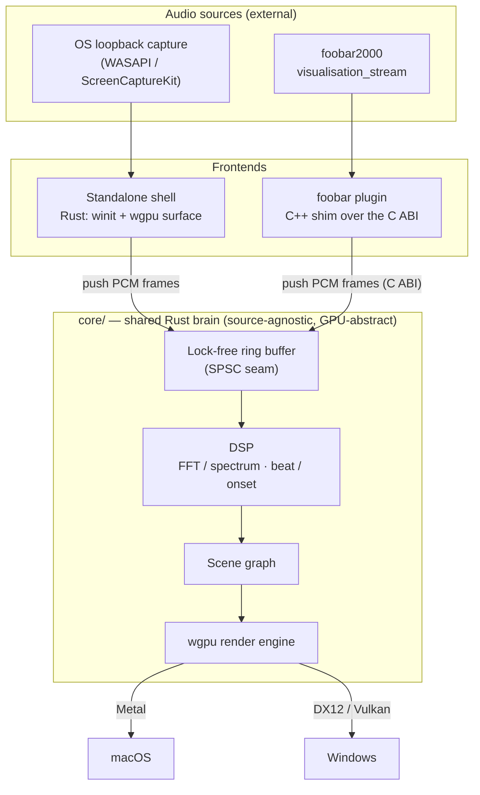

# Ritmolux


A lightweight, real-time music visualizer built around one **shared Rust core** that turns a
stream of PCM audio samples into GPU-rendered visuals. Two frontends consume that core:

- **Standalone app** (Windows + macOS) — pure Rust (`winit` + `wgpu`), fed by OS loopback
  audio capture.
- **foobar2000 plugin** (Windows-first) — a thin **C++ shim** over the core's **C ABI**, fed by
  foobar's own `visualisation_stream` (no loopback needed on that path).

The core is **source-agnostic**: it takes interleaved/mono PCM frames and does not care whether
they came from loopback capture or foobar. That single abstraction is what lets one visual
codebase serve both frontends.

| | | |
|---|---|---|
| [](docs/preset-guide.md) | [](docs/preset-guide.md) | [](docs/preset-guide.md) |
| `attractor` | `spectrum` | `star_pattern` |

Twelve built-in rendering systems, all driven by editable text presets —
**[see them, and how to write one](docs/preset-guide.md)**.

**Documentation site: [igorkonovalov.github.io/Ritmolux](https://igorkonovalov.github.io/Ritmolux/)**
— the same documents this repository holds, with search, plus a
[gallery](https://igorkonovalov.github.io/Ritmolux/gallery/) of one frame from every
preset that ships.

> Every picture in this repository is a **headless render of the engine**, captured by the `shot`
> CLI under a synthesized audio clip — not a screenshot of the application window. There is no
> picture anywhere of the preset browser, the settings menu or the `F3` overlay.

> **Status: pre-1.0, in active development.** Both frontends run **and both ship**: the standalone
> app renders live WASAPI loopback on Windows, and the foobar2000 component links the core's C ABI
> and is attached to every `v*` tag since `v0.70.0`. The preset format and the C ABI may still
> change between releases — stability begins at 1.0.0. See [`docs/plans/`](docs/plans/) for what's
> in flight.

## Architecture



The seam between audio and render is the **lock-free ring buffer**: audio arrives at the
device's cadence, frames render at the display's, and neither loop drives the other directly.

## Repository layout

```
core/                # Rust library crate — the shared brain: DSP + render engine + scenes.
                     #   Native Rust API (standalone) + C ABI (foobar plugin). No audio-source code.
core-cabi/           # The C ABI and nothing else — the only crate emitting a cdylib/staticlib,
                     #   plus include/rlx_core.h. Outside `default-members`, so a bare `cargo build`
                     #   never emits it; `--workspace` and `-p rlx-core-cabi` do. See ADR-0072.
rlx-ring/            # The lock-free SPSC ring, split out zero-dependency so Miri can check it in CI.
standalone/          # Rust binary + lib — winit window, wgpu surface, loopback capture, the shot example.
plugin-foobar/       # C++ shim: foobar2000 SDK integration, links the core's C ABI. Windows-first.
milkconv/            # The MilkDrop `.milk` -> preset converter (ADR-0113, Plan 0100). Never ships,
                     #   nothing shipped depends on it, so it is outside `default-members` too.
presets/             # The curated preset library (*.toml) — embedded at build time, seeded on first run.
scripts/             # Repo maintenance: the six Node gates the pre-push hook and CI's `links` job
                     #   run (see "Developer setup" below), plus check-site-links.mjs and
                     #   check-site-routes.mjs, a seventh and eighth that run in neither because they
                     #   need a built site — both live in the Pages workflow. And scripts/fixtures/
                     #   seeded bite checks.
site/                # The documentation site: an Astro Starlight front end publishing the
                     #   reader-facing subset of docs/ with search, at igorkonovalov.github.io/Ritmolux/.
                     #   Never shipped. `docs/` stays the single source — it is read in place, never
                     #   copied, and links are rewritten at build time. See ADR-0154.
packaging/           # What a `v*` tag ships, one recipe per artifact, each doing its own verification
                     #   so a local run is held to CI's bar: macos/bundle.sh (build, lipo, sign, zip,
                     #   verify) and foobar/ (fetch the pinned SDK, build, stamp, package, verify).
                     #   Plus the READ-ME-FIRST.md testers get in each zip. See ADR-0038, ADR-0115.
docs/
├── running.md       # What the app does once it is open: keys, menus, console, tiers, displays.
├── configuration.md # Every flag, environment variable and config.toml key, with defaults and precedence.
├── developing.md    # Building from a checkout, and every step the pre-push gate runs.
├── nfr.md           # Quantified v1 non-functional requirements (the numbers behind "lightweight").
├── preset-guide.md  # START HERE for presets: the illustrated entrance — the systems, one
│                    #   picture each, and the loop you work in.
├── preset-tuning-walkthrough.md  # One preset tuned over five steps, with the picture AND the
│                    #   --report row that changed at each one.
├── presets.md       # Preset authoring guide: the expression language, loading, and where files live.
├── preset-palettes.md  # The colour surface: built-in palettes, custom stops, the A/B crossfade.
├── capturing.md     # Headless capture: the shot CLI, the core/tests/ checks, and --render (video).
├── releasing.md     # The version-bump / release procedure (one bump per plan close).
├── on-device-validation.md  # The manual checklist for what CI cannot run: real GPUs, live loopback,
│                    #   and installing the foobar2000 component (no runner can load foobar2000).
├── design-backlog.md  # Captured friction not yet promoted to an ADR or a plan (…-archive.md holds retired entries).
├── roadmap-visual-richness.md  # The visual-capability roadmap the recent plans are sequenced against.
├── generative-techniques-catalogue.md  # The technique survey behind the scene families.
├── content-brief.md # What the shipped preset set is for — the curation brief behind the library.
├── diffusion-filter.md  # The diffusion filter's cost figures, held to one page by a gate (ADR-0122).
├── images/          # The committed documentation renders, regenerated by scripts/docs-shots.mjs.
├── examples/        # Teaching presets for the guide + walkthrough. Never shipped, never seeded.
├── adrs/            # Architecture Decision Records + rejected alternatives. Append-only.
├── specs/           # Living behavioral contracts per core subsystem (C ABI, ring/DSP determinism).
└── plans/           # Phased implementation plans (what's in flight); done/ holds completed plans.
```

The per-system parameter tables live in [`presets/README.md`](presets/README.md), beside the
preset files they document.

## Download

Prebuilt binaries are attached to each tag on the
[Releases page](https://github.com/IgorKonovalov/Ritmolux/releases). Three zips per
release, each carrying a `READ-ME-FIRST.txt`:

| Zip | What's in it |
|-----|--------------|
| `…-macos-universal.zip` | `Ritmolux.app` — universal (Apple Silicon + Intel), **macOS 13+** |
| `…-windows-x64.zip` | `ritmolux.exe` — Windows x64 |
| `…-foobar2000-component.zip` | `foo_ritmolux.fb2k-component` — foobar2000 v2, **x64 only** |

The two standalone zips also carry a reference copy of the presets.

All three are **unsigned**, so each host objects once. On Windows, SmartScreen says "Windows
protected your PC" → More info → Run anyway. On macOS, the app is ad-hoc signed only, so either
right-click it and choose **Open**, or strip the quarantine attribute first:

```sh
xattr -dr com.apple.quarantine Ritmolux.app
```

The macOS build then asks for the **Screen Recording** permission — that is the only first-party
way to tap system audio — and needs a **relaunch** after you grant it. Releases are marked
prerelease while the app is `0.x`. The `READ-ME-FIRST.txt` in each zip has the rest.

### The foobar2000 component

Unzip, then in foobar2000: **File → Preferences → Components → Install…**, pick
`foo_ritmolux.fb2k-component`, **Apply**, and let it restart. Open it from **View → Light Music
Visualizer**, or dock it into the layout as a *Playback visualisation* element. `Space` cycles
scenes; **right-click** for the menu: **Preset ▸** picks one by name (the choice is remembered
across restarts), **Reload presets** picks up a file you just dropped into the preset folder, and
**Open presets folder** takes you there.

It needs **64-bit foobar2000 v2 on Windows** — there is no 32-bit build and no macOS component
([ADR-0001](docs/adrs/0001-rust-core-wgpu-cabi-foobar-shim.md); the SDK is Windows-centric). A
32-bit install will simply not list it.

Because it reads what foobar2000 is already decoding, there is no audio capture to permit and no
output device to route — it is the path with the fewest ways to go wrong. If you run both, the
component and the standalone app **share one preset folder**, so a preset edited in either shows
up in both — the standalone hot-reloads it on save, the component on **Reload presets**.

## Running it

From a source checkout, `cargo run -p standalone --release` builds and launches `ritmolux`. **On
Windows it captures whatever is already playing** (system audio, via WASAPI loopback) — start some
music, and the visuals react.

| Key       | Action                                                      |
|-----------|-------------------------------------------------------------|
| `Space`   | Next preset — dissolves (and restarts the auto-rotate timer) |
| `A`       | Toggle auto-rotate on/off (off by default)                  |
| `Tab`     | Open/close the preset browser                               |
| `S`       | Open/close the settings menu                                |
| `C`       | Open/close the operator console on a second display         |
| `[` / `]` | Drop / raise the quality tier live                          |
| `F`       | Toggle fullscreen                                           |
| `D`       | Cycle to the next display/monitor                           |
| `F3`      | Toggle the diagnostics overlay                              |

That table is the one operator fact this file keeps, because a stranger should learn `Space` without
leaving. Everything else it used to carry now lives on the documentation site, which has search:

- **[Running the app](https://igorkonovalov.github.io/Ritmolux/use/running/)** — the two menus, the
  operator console, the now-playing banner, quality tiers, displays.
- **[Configuration](https://igorkonovalov.github.io/Ritmolux/use/configuration/)** — every flag,
  every environment variable, every `config.toml` key with its default, the precedence between
  them, and the OSC address table.


## Design principles

This is real-time audio + graphics, so a few rules are non-negotiable:

- **The audio callback is sacred.** The capture / `visualisation_stream` thread never blocks,
  allocates, locks, or logs — it hands samples to the core through the ring buffer and returns.
- **The core stays source-agnostic and GPU-abstract.** No WASAPI / ScreenCaptureKit / foobar
  types in `core/`; no raw Metal/DX/Vulkan outside the wgpu layer. Swappability is the point.
- **Determinism where it's testable.** DSP math is a pure function of its input window; visual
  randomness, when wanted, is explicitly seeded.
- **The C ABI is a versioned contract**, and [`docs/specs/0001-c-abi.md`](docs/specs/0001-c-abi.md)
  is the authority on its shape — not this list, which paraphrased five functions long enough for
  the real surface to reach thirteen. Changing that shape is an ADR-worthy event.
- **Lightweight is a feature.** Small binaries, few dependencies, low idle CPU/GPU.

## Presets

Visuals are driven by **presets** — small TOML files that bind a built-in
rendering system's parameters to short expressions over the live audio analysis
(no Rust, no rebuild). The whole curated set ships across every built-in system —
fragment field, particle swarm, parametric curve, L-system, star pattern,
reaction-diffusion, attractor, spectrum readout, ballistic emitter, shape field —
seeded into a per-user directory that both the standalone app and the foobar
plugin share.

**Start with [`docs/preset-guide.md`](docs/preset-guide.md)** — the illustrated
entrance: a complete preset in ten lines, what each built-in system looks
like and when to reach for it, and the loop you work in. Then
[`docs/preset-tuning-walkthrough.md`](docs/preset-tuning-walkthrough.md) tunes
one preset over five steps, showing the picture **and the `--report` row** that
changed at each one.

The three references the guide links into, each owning one surface:

| Document | Owns |
|---|---|
| [`presets/README.md`](presets/README.md) | every parameter each system takes, plus the structural, smoothing and engine-stage tables |
| [`docs/presets.md`](docs/presets.md) | the expression grammar — variables, functions, `select()`, and how a bad preset is reported |
| [`docs/preset-palettes.md`](docs/preset-palettes.md) | the colour surface — palettes, custom stops, the A/B crossfade |

Set **`RLX_PRESET_DIR`** to run against a custom preset folder instead of the
per-user one — `RLX_PRESET_DIR=./presets cargo run -p standalone` points the app
at the repo's own presets and hot-reloads an edit within ~150 ms.

## Rendering a music video

The engine renders a track to a video file **offline** — not by recording the
window. From a source checkout, one command walks a WAV end to end and produces
an MP4 with the audio muxed in:

```bash
cargo run -p standalone --example shot -- \
  --preset "Supernova" --render track.wav --fps 30 --size 1920x1080 \
  --ffmpeg ffmpeg --out track.mp4
```

Because the render is offline it is **decoupled from real time**: every frame is
drawn at an exact `1/fps` step regardless of how long it took, so the result is
deterministic and never drops a frame the way a screen recorder does. It is also
the mode where `--tier rich` is most worth paying for — there is no 60 Hz
deadline for the frame-time governor to miss.

**`ffmpeg` is a prerequisite and no encoder ships with this project.** A static
`ffmpeg` is larger than the application's entire size budget
([NFR §4](docs/nfr.md#4-size-and-dependencies)), so `shot` streams Y4M frames to whichever `ffmpeg` you
point it at and lets it own the container
([ADR-0114](docs/adrs/0114-the-engine-renders-video-offline-and-delegates-encoding.md)).
Without `--ffmpeg` the raw frame stream goes to stdout for any encoder to read.

**The default is archival, not shareable, and `--crf <0-51>` is the lever.**
At `-crf 18` a four-minute track at 1080p60 is several gigabytes; `--crf 23`
cuts that to roughly half and `--crf 28` to a quarter, with the colour tags
untouched. The default does not move, because a capture is evidence first and
re-encoding down from a master is possible while the reverse is not.

A `--preset` that names nothing costs nothing: the name is checked before the
encoder is spawned and before a GPU device is built, so a typo exits 1, lists
the roster's keys, and writes no file. The roster is keyed on a preset's
`name` field, not its filename.

See **[`docs/capturing.md`](docs/capturing.md#--render-a-music-video-from-a-track)**
for the frame-rate rules, the exact `ffmpeg` command line it generates, the size
lever's measured anchors, and what it reports about a long render.

### Through a diffusion model

Because the render is a pipe, a stage can sit in the middle of it.
**[`tools/sd-filter/`](tools/sd-filter/README.md)** is one: an img2img pass with
ControlNet holding the render's geometry, so the attractor becomes canyon rock
and the mandala becomes a rose window while the shape keeps tracking the music.

It is **creator tooling you build yourself, and none of it ships** — no model, no
weights, no Python runtime in the release zip. It needs a CUDA GPU, a Python
environment and a first-run download of several gigabytes of weights.

<!-- figures:orientation --> A four-minute track takes about **1.4 hours** at the `fast` profile, on the machine named beside that figure — the one thing worth knowing before you start.

**[`docs/diffusion-filter.md`](docs/diffusion-filter.md) is the whole of it** —
setup, the one canonical command, the flags, and what it costs everywhere else.

## Visual QA / headless capture

Scenes render **with no window** — the core draws into an offscreen texture and returns raw RGBA,
the same path [the video renderer](#rendering-a-music-video) runs on. A `shot` CLI writes PNGs and a
metrics report, and a differential harness in `core/tests/` hard-tests every preset for reactivity,
animation, shape sanity and beat response. It is dev tooling: the `image` crate is a
dev-dependency only, so the shipped binary is untouched.

See **[Headless capture and video](https://igorkonovalov.github.io/Ritmolux/engine/capturing/)**
for the runnable commands.


## Developing

A checked-in `.githooks/pre-push` runs the fast subset of CI before a push. It is **opt-in per
clone** — `git config core.hooksPath .githooks` — and an uninstalled clone has no gate.
**[Developing](https://igorkonovalov.github.io/Ritmolux/contribute/developing/)** has the build
commands and every step the hook runs.


## Architecture decisions

Key decisions are recorded as ADRs in [`docs/adrs/`](docs/adrs/). Start with
[ADR-0001](docs/adrs/0001-rust-core-wgpu-cabi-foobar-shim.md) — the founding decision (Rust core,
wgpu rendering, C ABI, C++ foobar shim), with the rejected alternatives (C++ core, Electron,
OpenGL) recorded.

## Platform notes

- **Loopback capture is not symmetric.** Windows has first-class WASAPI loopback and needs no
  permission; macOS has no equivalent, so the Mac path goes through **ScreenCaptureKit** (macOS
  13+) and a user-granted Screen Recording permission. Both are implemented; only the Windows
  one has been exercised on real hardware. A virtual device (BlackHole) remains the fallback if
  the SCK route disappoints — set it as the output and no capture code is needed. The foobar
  plugin sidesteps capture entirely, which is part of why plugin parity is valuable on Mac.
- **The Mac build is made by CI, not here.** The dev box is Windows and cannot link a Mach-O
  binary, so a macOS runner is the only build host — which is why the `.app` arrives through a
  tag-driven release rather than from anyone's machine
  ([ADR-0038](docs/adrs/0038-tag-driven-release-unsigned-universal-mac-app.md)). `packaging/macos/bundle.sh`
  is checked in and runs standalone on any Mac, so that is not a permanent condition.
- **wgpu targets differ per OS** — Metal on macOS, DX12/Vulkan on Windows. Scene code writes to
  wgpu and does not branch on the backend.

## License

Licensed under either of

- Apache License, Version 2.0 ([LICENSE-APACHE](LICENSE-APACHE) or
  <http://www.apache.org/licenses/LICENSE-2.0>)
- MIT license ([LICENSE-MIT](LICENSE-MIT) or <http://opensource.org/licenses/MIT>)

at your option.

Unless you explicitly state otherwise, any contribution intentionally submitted for inclusion in
this project by you, as defined in the Apache-2.0 license, shall be dual licensed as above,
without any additional terms or conditions.
