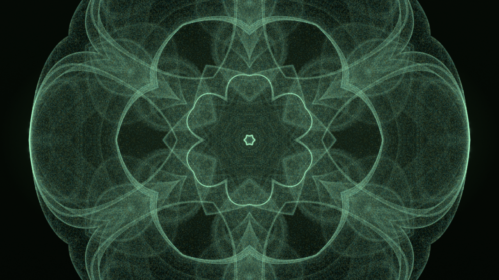
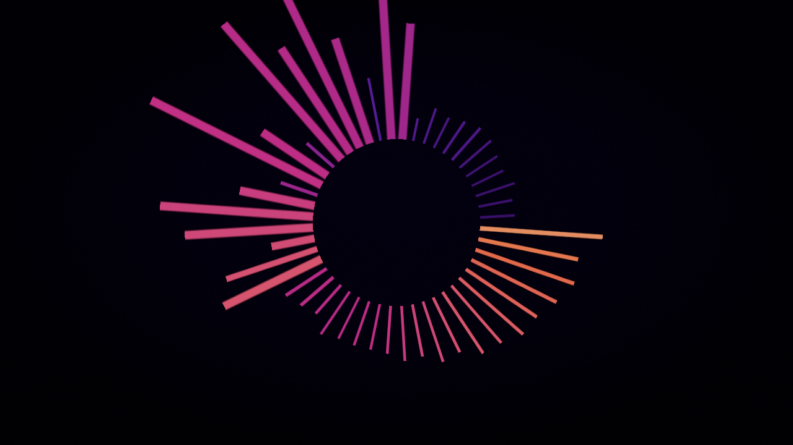
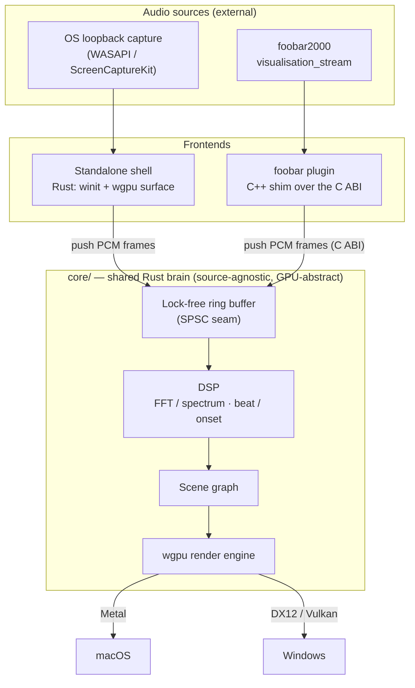

# Ritmolux


A lightweight, real-time music visualizer built around one **shared Rust core** that turns a
stream of PCM audio samples into GPU-rendered visuals. Two frontends consume that core:

- **Standalone app** (Windows + macOS) — pure Rust (`winit` + `wgpu`), fed by OS loopback
  audio capture.
- **foobar2000 plugin** (Windows-first) — a thin **C++ shim** over the core's **C ABI**, fed by
  foobar's own `visualisation_stream` (no loopback needed on that path).

The core is **source-agnostic**: it takes interleaved/mono PCM frames and does not care whether
they came from loopback capture or foobar. That single abstraction is what lets one visual
codebase serve both frontends.

| | | |
|---|---|---|
| [](docs/preset-guide.md) | [](docs/preset-guide.md) | [](docs/preset-guide.md) |
| `attractor` | `spectrum` | `star_pattern` |

Twelve built-in rendering systems, all driven by editable text presets —
**[see them, and how to write one](docs/preset-guide.md)**.

> Every picture in this repository is a **headless render of the engine**, captured by the `shot`
> CLI under a synthesized audio clip — not a screenshot of the application window. There is no
> picture anywhere of the preset browser, the settings menu or the `F3` overlay.

> **Status: pre-1.0, in active development.** Both frontends run **and both ship**: the standalone
> app renders live WASAPI loopback on Windows, and the foobar2000 component links the core's C ABI
> and is attached to every `v*` tag since `v0.70.0`. The preset format and the C ABI may still
> change between releases — stability begins at 1.0.0. See [`docs/plans/`](docs/plans/) for what's
> in flight.

## Architecture



The seam between audio and render is the **lock-free ring buffer**: audio arrives at the
device's cadence, frames render at the display's, and neither loop drives the other directly.

## Repository layout

```
core/                # Rust library crate — the shared brain: DSP + render engine + scenes.
                     #   Native Rust API (standalone) + C ABI (foobar plugin). No audio-source code.
core-cabi/           # The C ABI and nothing else — the only crate emitting a cdylib/staticlib,
                     #   plus include/rlx_core.h. Outside `default-members`, so a bare `cargo build`
                     #   never emits it; `--workspace` and `-p rlx-core-cabi` do. See ADR-0072.
rlx-ring/            # The lock-free SPSC ring, split out zero-dependency so Miri can check it in CI.
standalone/          # Rust binary + lib — winit window, wgpu surface, loopback capture, the shot example.
plugin-foobar/       # C++ shim: foobar2000 SDK integration, links the core's C ABI. Windows-first.
milkconv/            # The MilkDrop `.milk` -> preset converter (ADR-0113, Plan 0100). Never ships,
                     #   nothing shipped depends on it, so it is outside `default-members` too.
presets/             # The curated preset library (*.toml) — embedded at build time, seeded on first run.
scripts/             # Repo maintenance: the six Node gates the pre-push hook and CI's `links` job
                     #   run (see "Developer setup" below), plus check-site-links.mjs, a seventh that
                     #   runs in neither because it needs a built site — it lives in the Pages
                     #   workflow. And scripts/fixtures/ seeded bite checks.
site/                # The documentation site: an Astro Starlight front end publishing the
                     #   reader-facing subset of docs/ with search, at igorkonovalov.github.io/Ritmolux/.
                     #   Never shipped. `docs/` stays the single source — it is read in place, never
                     #   copied, and links are rewritten at build time. See ADR-0154.
packaging/           # What a `v*` tag ships, one recipe per artifact, each doing its own verification
                     #   so a local run is held to CI's bar: macos/bundle.sh (build, lipo, sign, zip,
                     #   verify) and foobar/ (fetch the pinned SDK, build, stamp, package, verify).
                     #   Plus the READ-ME-FIRST.md testers get in each zip. See ADR-0038, ADR-0115.
docs/
├── nfr.md           # Quantified v1 non-functional requirements (the numbers behind "lightweight").
├── preset-guide.md  # START HERE for presets: the illustrated entrance — the systems, one
│                    #   picture each, and the loop you work in.
├── preset-tuning-walkthrough.md  # One preset tuned over five steps, with the picture AND the
│                    #   --report row that changed at each one.
├── presets.md       # Preset authoring guide: the expression language, loading, and where files live.
├── preset-palettes.md  # The colour surface: built-in palettes, custom stops, the A/B crossfade.
├── capturing.md     # Headless capture: the shot CLI, the core/tests/ checks, and --render (video).
├── releasing.md     # The version-bump / release procedure (one bump per plan close).
├── on-device-validation.md  # The manual checklist for what CI cannot run: real GPUs, live loopback,
│                    #   and installing the foobar2000 component (no runner can load foobar2000).
├── design-backlog.md  # Captured friction not yet promoted to an ADR or a plan (…-archive.md holds retired entries).
├── roadmap-visual-richness.md  # The visual-capability roadmap the recent plans are sequenced against.
├── generative-techniques-catalogue.md  # The technique survey behind the scene families.
├── content-brief.md # What the shipped preset set is for — the curation brief behind the library.
├── diffusion-filter.md  # The diffusion filter's cost figures, held to one page by a gate (ADR-0122).
├── images/          # The committed documentation renders, regenerated by scripts/docs-shots.mjs.
├── examples/        # Teaching presets for the guide + walkthrough. Never shipped, never seeded.
├── adrs/            # Architecture Decision Records + rejected alternatives. Append-only.
├── specs/           # Living behavioral contracts per core subsystem (C ABI, ring/DSP determinism).
└── plans/           # Phased implementation plans (what's in flight); done/ holds completed plans.
```

The per-system parameter tables live in [`presets/README.md`](presets/README.md), beside the
preset files they document.

## Download

Prebuilt binaries are attached to each tag on the
[Releases page](https://github.com/IgorKonovalov/Ritmolux/releases). Three zips per
release, each carrying a `READ-ME-FIRST.txt`:

| Zip | What's in it |
|-----|--------------|
| `…-macos-universal.zip` | `Ritmolux.app` — universal (Apple Silicon + Intel), **macOS 13+** |
| `…-windows-x64.zip` | `ritmolux.exe` — Windows x64 |
| `…-foobar2000-component.zip` | `foo_ritmolux.fb2k-component` — foobar2000 v2, **x64 only** |

The two standalone zips also carry a reference copy of the presets.

All three are **unsigned**, so each host objects once. On Windows, SmartScreen says "Windows
protected your PC" → More info → Run anyway. On macOS, the app is ad-hoc signed only, so either
right-click it and choose **Open**, or strip the quarantine attribute first:

```sh
xattr -dr com.apple.quarantine Ritmolux.app
```

The macOS build then asks for the **Screen Recording** permission — that is the only first-party
way to tap system audio — and needs a **relaunch** after you grant it. Releases are marked
prerelease while the app is `0.x`. The `READ-ME-FIRST.txt` in each zip has the rest.

### The foobar2000 component

Unzip, then in foobar2000: **File → Preferences → Components → Install…**, pick
`foo_ritmolux.fb2k-component`, **Apply**, and let it restart. Open it from **View → Light Music
Visualizer**, or dock it into the layout as a *Playback visualisation* element. `Space` cycles
scenes; **right-click** for the menu: **Preset ▸** picks one by name (the choice is remembered
across restarts), **Reload presets** picks up a file you just dropped into the preset folder, and
**Open presets folder** takes you there.

It needs **64-bit foobar2000 v2 on Windows** — there is no 32-bit build and no macOS component
([ADR-0001](docs/adrs/0001-rust-core-wgpu-cabi-foobar-shim.md); the SDK is Windows-centric). A
32-bit install will simply not list it.

Because it reads what foobar2000 is already decoding, there is no audio capture to permit and no
output device to route — it is the path with the fewest ways to go wrong. If you run both, the
component and the standalone app **share one preset folder**, so a preset edited in either shows
up in both — the standalone hot-reloads it on save, the component on **Reload presets**.

## Running the standalone app

You need a recent stable **Rust** toolchain (the workspace is edition 2024 — Rust 1.85+). From
the repo root:

```sh
cargo run -p standalone --release
```

That builds and launches `ritmolux`, the standalone window. **On Windows it captures whatever is
already playing** (system audio, via WASAPI loopback) — start some music, and the visuals react.
`--release` is recommended: this is real-time graphics, and the debug build is noticeably slower.

### Controls

By default the app **holds one scene** — pick a look and it stays. Press `A` to
opt into auto-rotate (or set `auto = true` under `[rotate]` in `config.toml`);
when it's on, a scene holds ~20–90 s and an energy drop can nudge a change early.

Every preset change — `Space`, a pick from the browser, or an auto-rotate — **dissolves**
over about a second rather than cutting, so the show reads as continuous. The engine
rotates through a small library of dissolves (crossfade, additive burn, luma dissolve,
wipe), and a switch arriving mid-dissolve finishes the one in flight and starts the new
one, so you always land where you asked.

| Key       | Action                                                      |
|-----------|-------------------------------------------------------------|
| `Space`   | Next preset — dissolves (and restarts the auto-rotate timer) |
| `A`       | Toggle auto-rotate on/off (off by default)                  |
| `Tab`     | Open/close the preset browser — opens on the preset you're watching. `↑`/`↓` walk the list and wrap at both ends, `←`/`→` step a column, holding an arrow scrolls, type to filter, `Enter` selects (also dissolves), `Esc` closes |
| `S`       | Open/close the settings menu — quality, auto-rotate, dwell bounds, fullscreen, display, diagnostics, input mode, input device, preset name, now playing, console. `↑`/`↓` pick a row, `←`/`→` change it, `Esc` closes. Every change applies immediately and (except diagnostics) is written to `config.toml` |
| `C`       | Open/close the **operator console** — a second window on another display carrying the browser, the settings menu, a transport strip and a live preview of the output |
| `[` / `]` | Drop / raise the quality tier live — pins it for the session and persists the choice |
| `F`       | Toggle fullscreen                                           |
| `Esc`     | Leave fullscreen (with no menu open). Does nothing in a window, and never quits |
| `D`       | Cycle to the next display/monitor                           |
| `F3`      | Toggle the diagnostics overlay                              |

### The operator console

`C` opens a second window on a display **other than the show's**, so you can drive the
app from a desk without typing at the projector. It carries the preset browser and the
settings menu — while it is open, neither of those draws on the show any more — plus a
**transport strip** (`prev`, `next`, `rotate`, `auto`, `dwell -/+`, clickable), a line
naming **what the rotation will take next**, and a **live preview of the output**
letterboxed in the corner.

It is **off by default and costs nothing while closed**: no second surface, no
intermediate render target and no extra copy per frame. Open it from the settings
menu's **Console** row, with `C`, or at launch with `--console` / `enabled = true`
under `[console]` in `config.toml`; all four are one path, so they cannot disagree
about whether it is open. The console picks its display by the same name-over-index
rule the show's own display uses — `[console] display_name` first, then
`[console] display` — and where that lands on the screen the show is on, it moves to
another if there is one. Closing it from its own settings menu leaves that menu on the
show, so you never lose the menu along with the window.

On a single-monitor machine it opens as an ordinary window on that monitor, which is a
supported way to work rather than an error.

The browser lays the roster out in **as many columns as the window fits**, so a
library taller than the screen is visible at once rather than scrolled past. When
even the columns can't hold it, the list scrolls by whole columns and keeps the
highlighted preset on screen.

Both menus are modal and only one is open at a time: `S` opens settings when the
browser is closed (while it's open, `s` is a filter character), and `Tab` from
settings hands over to the browser.

The active preset's **name** sits in the top-left corner, and it gets out of the
way on its own: either menu or the `F3` overlay hides it, and it comes straight
back when they close. For a permanently clean canvas, turn the settings menu's
**Preset name** row off — that is `[hud] preset_name` in `config.toml`, and it
survives a restart.

### Now playing

When the track changes, the **artist and title fade in** over the visuals in the
lower-left corner, hold a few seconds, and fade out — an announcement, not a
status bar. A long title is truncated to fit rather than running off the screen.

On **Windows** the metadata comes from the system's now-playing feed (SMTC) —
the same one behind the media flyout — so it works with whatever player is
publishing to it, foobar2000 included. **Not every player publishes there.** One
that doesn't simply produces no banner: this is a nicety that stays silent when
it has nothing to say, never an error. Closing the player clears it.

On **macOS** the standalone gets no metadata: the OS has no supported equivalent
(`MediaRemote` is private and restricted), which is the same asymmetry loopback
capture already has. The foobar2000 plugin is the answer on that platform.

To turn it off entirely, use the settings menu's **Now playing** row — that is
`[hud] now_playing` in `config.toml`, and like the preset name it survives a
restart. Off means no track ever reaches the visualizer.

### Flags & environment

**`ritmolux --help` prints the roster and exits** — that is the authority on what this
binary accepts, and a test holds it in step with the scanners, so a flag that
exists is a flag `--help` names. An argument no flag claims is a **startup
error** that names it and the nearest spelling: `ritmolux --ocs 127.0.0.1:9000` exits
rather than starting a visualizer that publishes no telemetry. The list below
says what each flag is *for*, which is the part a roster line has no room for.

- `--help` / `-h` — print the flag roster and exit. Writes to stdout and creates no
  window, no GPU device and no capture client, so a script can probe the flag surface
  without starting a show.
- `--console` — open the operator console at launch, on a display other than the show's.
  A presence flag with no value: it turns the console **on** for this run and never off, and
  it does not write itself into `config.toml` (the same shape `--input` / `--device` / `--osc`
  follow). `[console] enabled = true` is the persistent form, and the `C` hotkey and the
  settings menu's **Console** row are the same path — no two of the four can disagree about
  whether the console is open.
- `--list-devices` — enumerate audio capture devices (Windows-only).
- `--list-adapters` — enumerate graphics adapters, from **both** rosters: the one the renderer
  selects through and the one the Spout sender selects through. They are separate enumerations and
  are not assumed to agree on order, so both are printed with their own indices.
- `--stream` — run **headless** as a live video source and publish every frame as a **Spout
  sender**, for TouchDesigner (or any Spout receiver) on the same machine. No window, no swapchain,
  no codec. Windows-only, and present only in a build with the `spout` feature — the release
  `ritmolux.exe` has it; a plain `cargo build` does not, and `--stream` there fails with a named error
  saying so. Presets rotate on the operator config's dwell timer exactly as they do in the window
  (rotation is **on** here even where `[rotate] auto` is off, since a headless source has nobody to
  press `Space`). Ctrl-C stops it and prints the run's frames, wall clock and scene clock.
  Companion flags, `--stream`-only: `--size WxH` (default `1280x720`), `--fps N` (default 60),
  `--sender <name>` to change the published sender name (default `ritmolux`), and `--frames N` for a
  bounded, self-terminating run. Passing one of these **without** `--stream` is a startup error
  naming both flags, rather than the silence it used to be. `--gpu` and `--preset` are not on this
  list — they work in the window too, below.
  See [docs/capturing.md](docs/capturing.md#the-live-video-out-rlx---stream) for the
  TouchDesigner side.
- `--gpu <name|index>` — which graphics adapter to render on, named from `--list-adapters`.
  Works for **both** the window and `--stream`.
  **On a machine with one GPU you will never need it; on a hybrid laptop it is the difference
  between a picture and nothing.** A Spout sender shares a D3D11 texture by handle and the receiver
  opens it on its own device, which works only when both are the same physical GPU — and Windows
  hands a plain console process the power-saving GPU while the receiving application runs on the
  discrete one. One flag moves both halves: the renderer and the sender each resolve the name
  against their own roster. Unset, `--stream`'s renderer asks for the high-performance adapter and
  the sender follows it by name, printing what both resolved to.
  **The window's unset behaviour is deliberately different**: it asks for whatever wgpu picks for
  the surface, which is what it has always asked for, so no published frame-time figure moves
  because this flag arrived. On a hybrid laptop that default is the power-saving GPU, and
  `--gpu <name|index>` is how you move the window onto the discrete one; the startup line in
  `diagnostics.log` names the adapter and says whether a flag pinned it. A named adapter that
  cannot drive the window is a startup error rather than a quiet fall-back to another GPU.
- `--preset <name>` — hold one scene and disable rotation. Works in the window as well as under
  `--stream`. The name is the preset's **display name** — `Clifford`, `Rose Window` — as the browse
  overlay and `--preset`'s own error listing spell it, not the `.toml` filename, so most of them
  need quoting. An unknown name is a startup error that lists the roster, and **no window opens**.
  Hotkeys still browse, so this pins where a run *starts* and turns the dwell timer off.
- `--input loopback|line-in` — where audio comes from, overriding `config.toml`'s `[input] mode`.
  `loopback` taps whatever the system is playing; `line-in` captures an input endpoint (an audio
  interface, a mixer feed). Windows-only. A value that is neither is a usage error and the app
  exits, the same way a bad `--tier` does.
  **The input also moves while the app is running** — the settings menu's **Input mode** and
  **Input device** rows swap the capture stream in place and write the choice to `config.toml`, so
  `--input` pins the launch rather than the session. Expect a brief hitch on the swap (the old
  stream is stopped and the new one opened synchronously), and, when the two endpoints negotiate
  different sample rates, a second or two of re-adaptation while the level tracking rebuilds.
- `--device "<friendly name>"` — which endpoint to capture, overriding `config.toml`'s
  `[input] device`. Copy a name out of `--list-devices`; a substring is enough. **The two flags
  override independently** — `--device` alone keeps the configured mode, `--input` alone keeps the
  configured device name. A name that matches no active endpoint of the selected mode is *not* an
  error: capture falls back to that mode's default endpoint and says so on stderr, because the
  interface being unplugged is a fact about the world rather than a typo in the flag. Giving
  **no name at all** — a trailing `--device`, or `--device=` — *is* an error: an empty value selects
  the default endpoint, which is the opposite of what naming a device asks for. Precedence is
  `--input`/`--device` > `config.toml`'s `[input]`; there is no environment variable, because an
  input selection is a property of a rig and already persists to the config.

  **If the input goes away mid-show** — the interface is unplugged, the driver resets — the app says
  so and reopens on that mode's default endpoint, a few times and then no more; `F3` and the
  `capture` column of `diagnostics.log` name what it fell back to, or say `lost …` if nothing worked.
  Re-plugging does **not** restore the device, and that is why a recovery is the one input change
  that is *not* written to `config.toml`: your `[input] device` still names the interface you chose,
  so the next launch goes back to it. Pick it again from the `S` menu to return to it in this run.
- `--soak [path]` — write a long-run instrumentation trace (frame-time stats) for stability
  testing; a bare `--soak` logs to a default path under the per-user data dir.
- `--tier floor|rich` — pin the quality tier instead of letting the engine pick. Unpinned, the app
  starts on `rich` and a frame-time governor demotes it to `floor` once if the display's frame
  budget is not being held (announced on stderr and marked with a `*` in the `F3` overlay). A pin
  is never demoted, so this is also how you keep `rich` on a machine a transient stall demoted.
  **The tier also moves while the app is running** — `[` / `]`, or the settings menu's Quality
  row. An in-app change **pins** the tier for the session (so the governor stops touching it) and
  writes it to `config.toml`'s `[quality] tier`. `--tier` and `RLX_TIER` still win at the next
  launch, so the precedence below is unchanged. Expect a brief re-accumulation of trails and
  feedback when it switches: the tier sizes GPU resources, so changing it rebuilds them.
- `--osc <host:port>` — publish the analyzer's telemetry as OSC over UDP, so a lighting console or a
  bridge can follow the music. **Off unless you ask for it**; the flag both aims the sink and turns
  it on, so `enabled = false` in `config.toml` cannot veto a target typed for this run. A target
  that will not resolve is a usage error and the app exits — the same way a bad `--tier` does —
  whereas a stale target in `config.toml` degrades to no sink and says so, because a config file
  must not stop a show. Sends are **non-blocking and dropped on failure**: a broken link costs the
  telemetry, never a frame, and the app prints one line when it starts failing and one when it
  recovers rather than a line per frame.

  The `[osc]` section in `config.toml` carries the same settings for a rig you run every night:
  `enabled` (default `false`), `target` (default `127.0.0.1:9000`), and `rate_hz` — datagram sets
  per second, default `60`, where `0` means every rendered frame. `--osc` overrides `target` and
  leaves `rate_hz` to the file, which is the one key it has no spelling for.

  **The address space is versioned in the addresses**, so a later signal is additive under the same
  `/lmv/v1` prefix and a mapping you have already bound keeps working. One argument per address, so
  a console binds a parameter to an address rather than to a position inside a message:

  | Address | Type | What it carries |
  |---------|------|-----------------|
  | `/lmv/v1/level/bass` | `f` | Bass level, peak-normalized to `0`–`1` |
  | `/lmv/v1/level/mid` | `f` | Mid level, peak-normalized |
  | `/lmv/v1/level/treb` | `f` | Treble level, peak-normalized |
  | `/lmv/v1/level/onset` | `f` | Spectral-flux onset envelope, peak-normalized |
  | `/lmv/v1/level/rms` | `f` | Broadband RMS of the waveform trace — **un-normalized**, unlike the four above it, because the trace it comes from deliberately is. Map it with a gain in the console |
  | `/lmv/v1/raw/bass` | `f` | Raw mean magnitude in the bass band — the absolute twin of `level/bass` |
  | `/lmv/v1/raw/mid` | `f` | Raw mean magnitude, mid |
  | `/lmv/v1/raw/treb` | `f` | Raw mean magnitude, treble |
  | `/lmv/v1/raw/onset` | `f` | Raw spectral-flux envelope |
  | `/lmv/v1/beat/trigger` | `i` | `1` on a frame an onset fired, `0` otherwise — the discrete event |
  | `/lmv/v1/beat/index` | `i` | Monotone count of onset detections. **Not a musical beat count** — the detector fires 1.2x–2.3x per beat depending on material, so no fixed multiplier turns it into bars. Useful as a ratchet, not as a meter |
  | `/lmv/v1/beat/phase` | `f` | Beat phase in `[0, 1)`: `0` on each beat, ramping to the next |
  | `/lmv/v1/tempo` | `f` | Tempo estimate in BPM, `0` until the tracker warms. Expect a warm-up of tens of seconds before it settles |
  | `/lmv/v1/preset` | `s` | The active preset's name |

  Telemetry rides the rendered frame, so it stops when the window is hidden and the preset name
  lags a switch by one frame. Nothing here is a musical timebase you can drive a sequencer from —
  it is a level feed for lights.
- `RLX_PRESET_DIR=<dir>` — point the app at a custom preset folder instead of the seeded per-user
  directory; edits to `*.toml` there hot-reload live.
- `RLX_TIER=floor|rich` — the same pin as `--tier`, for a one-off run. Precedence is
  `--tier` > `RLX_TIER` > `config.toml`'s `[quality] tier` > auto.

> **macOS:** loopback capture **is** implemented — `standalone/src/capture_mac.rs` taps system
> audio through **ScreenCaptureKit**, so it needs **macOS 13+** and the **Screen Recording**
> permission (SCK will not run an audio-only stream, so the capture carries a throwaway 2x2 px
> stub video alongside the audio). Grant it, then **relaunch** — the app does not pick the
> permission up mid-run. The caveat is that **this path has never run on Apple hardware**: CI
> compiles it on `macos-latest` every push, but no runner can play audio or drive a real Metal
> adapter, so the first live run is also its validation. A window with visuals but no reaction
> to music means capture did not start, not a crash — launch from Terminal to see the reason.
> See **Platform notes** below.

## Design principles

This is real-time audio + graphics, so a few rules are non-negotiable:

- **The audio callback is sacred.** The capture / `visualisation_stream` thread never blocks,
  allocates, locks, or logs — it hands samples to the core through the ring buffer and returns.
- **The core stays source-agnostic and GPU-abstract.** No WASAPI / ScreenCaptureKit / foobar
  types in `core/`; no raw Metal/DX/Vulkan outside the wgpu layer. Swappability is the point.
- **Determinism where it's testable.** DSP math is a pure function of its input window; visual
  randomness, when wanted, is explicitly seeded.
- **The C ABI is a versioned contract**, and [`docs/specs/0001-c-abi.md`](docs/specs/0001-c-abi.md)
  is the authority on its shape — not this list, which paraphrased five functions long enough for
  the real surface to reach thirteen. Changing that shape is an ADR-worthy event.
- **Lightweight is a feature.** Small binaries, few dependencies, low idle CPU/GPU.

## Presets

Visuals are driven by **presets** — small TOML files that bind a built-in
rendering system's parameters to short expressions over the live audio analysis
(no Rust, no rebuild). The whole curated set ships across every built-in system —
fragment field, particle swarm, parametric curve, L-system, star pattern,
reaction-diffusion, attractor, spectrum readout, ballistic emitter, shape field —
seeded into a per-user directory that both the standalone app and the foobar
plugin share.

**Start with [`docs/preset-guide.md`](docs/preset-guide.md)** — the illustrated
entrance: a complete preset in ten lines, what each built-in system looks
like and when to reach for it, and the loop you work in. Then
[`docs/preset-tuning-walkthrough.md`](docs/preset-tuning-walkthrough.md) tunes
one preset over five steps, showing the picture **and the `--report` row** that
changed at each one.

The three references the guide links into, each owning one surface:

| Document | Owns |
|---|---|
| [`presets/README.md`](presets/README.md) | every parameter each system takes, plus the structural, smoothing and engine-stage tables |
| [`docs/presets.md`](docs/presets.md) | the expression grammar — variables, functions, `select()`, and how a bad preset is reported |
| [`docs/preset-palettes.md`](docs/preset-palettes.md) | the colour surface — palettes, custom stops, the A/B crossfade |

Set **`RLX_PRESET_DIR`** to run against a custom preset folder instead of the
per-user one — `RLX_PRESET_DIR=./presets cargo run -p standalone` points the app
at the repo's own presets and hot-reloads an edit within ~150 ms.

## Rendering a music video

The engine renders a track to a video file **offline** — not by recording the
window. From a source checkout, one command walks a WAV end to end and produces
an MP4 with the audio muxed in:

```bash
cargo run -p standalone --example shot -- \
  --preset "Supernova" --render track.wav --fps 30 --size 1920x1080 \
  --ffmpeg ffmpeg --out track.mp4
```

Because the render is offline it is **decoupled from real time**: every frame is
drawn at an exact `1/fps` step regardless of how long it took, so the result is
deterministic and never drops a frame the way a screen recorder does. It is also
the mode where `--tier rich` is most worth paying for — there is no 60 Hz
deadline for the frame-time governor to miss.

**`ffmpeg` is a prerequisite and no encoder ships with this project.** A static
`ffmpeg` is larger than the application's entire size budget
([NFR §4](docs/nfr.md#4-size-and-dependencies)), so `shot` streams Y4M frames to whichever `ffmpeg` you
point it at and lets it own the container
([ADR-0114](docs/adrs/0114-the-engine-renders-video-offline-and-delegates-encoding.md)).
Without `--ffmpeg` the raw frame stream goes to stdout for any encoder to read.

**The default is archival, not shareable, and `--crf <0-51>` is the lever.**
At `-crf 18` a four-minute track at 1080p60 is several gigabytes; `--crf 23`
cuts that to roughly half and `--crf 28` to a quarter, with the colour tags
untouched. The default does not move, because a capture is evidence first and
re-encoding down from a master is possible while the reverse is not.

A `--preset` that names nothing costs nothing: the name is checked before the
encoder is spawned and before a GPU device is built, so a typo exits 1, lists
the roster's keys, and writes no file. The roster is keyed on a preset's
`name` field, not its filename.

See **[`docs/capturing.md`](docs/capturing.md#--render-a-music-video-from-a-track)**
for the frame-rate rules, the exact `ffmpeg` command line it generates, the size
lever's measured anchors, and what it reports about a long render.

### Through a diffusion model

Because the render is a pipe, a stage can sit in the middle of it.
**[`tools/sd-filter/`](tools/sd-filter/README.md)** is one: an img2img pass with
ControlNet holding the render's geometry, so the attractor becomes canyon rock
and the mandala becomes a rose window while the shape keeps tracking the music.

It is **creator tooling you build yourself, and none of it ships** — no model, no
weights, no Python runtime in the release zip. It needs a CUDA GPU, a Python
environment and a first-run download of several gigabytes of weights.

<!-- figures:orientation --> A four-minute track takes about **1.4 hours** at the `fast` profile, on the machine named beside that figure — the one thing worth knowing before you start.

**[`docs/diffusion-filter.md`](docs/diffusion-filter.md) is the whole of it** —
setup, the one canonical command, the flags, and what it costs everywhere else.

## Visual QA / headless capture

Scenes can be rendered **with no window** — the core draws into an offscreen
texture and returns raw RGBA. That is the same path [the video renderer](#rendering-a-music-video)
runs on. A `shot` CLI writes PNGs (and a text/JSON metrics
report), and a differential harness in `core/tests/` hard-tests every preset for
reactivity, animation, shape sanity, and beat response (with an advisory
distinctness report and golden-image regression). It's dev/agent tooling — the
`image` crate is a dev-dependency only, so the shipped binary is untouched.

The synthetic `--signal` path (e.g. `--signal click:120`) needs no audio file.
For the `--audio` path, drop a **16-bit PCM WAV** into `assets/test/` — that
folder is gitignored, so test audio is added manually and never committed (use
your own or a royalty-free / CC0 clip).

`shot` reads the same library the app does — including `RLX_PRESET_DIR` — and
takes `--presets <dir>` / `--preset-file <path>` to capture a specific folder or
file, so an edit can be shot without touching the seeded copy.

See **[`docs/capturing.md`](docs/capturing.md)** for the runnable commands. The
images in this README and in the preset docs come from that same CLI, driven by
**`node scripts/docs-shots.mjs`** — an argument-free script whose manifest records
the preset, stimulus, hop, size and tier behind every committed picture
([ADR-0100](docs/adrs/0100-documentation-images-are-committed-headless-renders.md)).

## Developer setup: the pre-push gate

A checked-in `.githooks/pre-push` runs the fast subset of CI before a push, so a
broken push costs seconds locally instead of minutes in CI. It is **opt-in per
clone** — enable it with:

```sh
git config core.hooksPath .githooks
```

> **An uninstalled clone has no gate.** Git will not run a hook from a tracked
> directory without that config, so until you set it nothing below happens. There
> is deliberately no auto-install ([ADR-0033](docs/adrs/0033-testing-strategy-coverage-ratchet-and-pre-push-gate.md)
> Alternative H).

What it runs, stopping at the first failure and naming the step that failed:

| Step | Command |
|------|---------|
| Doc links | `node scripts/check-doc-links.mjs` |
| Index rows | `node scripts/check-index-rows.mjs` |
| Index rows (self-test) | `node scripts/check-index-rows.mjs --self-test` |
| Backlog claims | `node scripts/check-backlog-claims.mjs` |
| Filter figures | `node scripts/check-filter-figures.mjs` |
| Comment hygiene | `node scripts/check-comment-hygiene.mjs` |
| Contents blocks | `node scripts/toc.mjs --check` |
| Contents blocks (self-test) | `node scripts/toc.mjs --self-test` |
| Format | `cargo fmt --all --check` |
| Lint | `cargo clippy --workspace --all-targets -- -D warnings` |
| Tests | `cargo nextest run --workspace -P fast` (narrowed — see below) |

The Node steps come first because they are the cheapest (tens of milliseconds
between them): every relative markdown link in the repo must resolve, every row
inside a marked roster region must stay under 320 bytes
([ADR-0116](docs/adrs/0116-an-index-row-is-a-pointer-and-a-gate-holds-it-to-one.md)),
every live `docs/design-backlog.md` entry must carry a probe that still holds
([ADR-0108](docs/adrs/0108-a-backlog-claim-about-the-repo-carries-an-executable-probe.md)),
the diffusion filter's cost figures must live in one file
([ADR-0122](docs/adrs/0122-a-sidecar-tool-documents-itself-in-one-place.md)), no `.rs`
comment may carry a relative link or plan-relative narration
([ADR-0127](docs/adrs/0127-a-comment-carries-the-mechanism-and-the-decision-record-stays-in-docs.md)),
and every generated contents block must still match the headings beneath it
([ADR-0163](docs/adrs/0163-a-long-document-carries-a-generated-contents-block.md)).
Six gates and eight steps: the two that could go green on a rule that had quietly
stopped working — a roster detector matching nothing, an anchor rule that is
merely plausible — carry a `--self-test` beside their check.
If `node` is not on your `PATH` they all **skip with a notice** rather than
failing the push; nothing else here needs Node. That skip is about the hook only
— CI's `links` job runs the same checks on `ubuntu-latest`, where they cannot
skip and are not bypassable.

**Measured warm wall time: ~48.6 s** (2026-08-08; dominated by the tests — `fmt`
and `clippy` are under two seconds between them). The hook excludes the nine
GPU-heavy suites that iterate every shipped preset or scene through a real
adapter. **Which nine is not written here** — since
[ADR-0156](docs/adrs/0156-the-per-phase-gate-is-scoped-and-the-suite-is-owed-once-per-plan.md)
the list is the `fast` profile's `default-filter` in `.config/nextest.toml`, and the hook, CI's
`check` job and the `dev` lane's per-phase gate all cite `-P fast` rather than restating it.
Nextest **names the skipped binaries itself** on every run, on the profile's
authority, so the narrowing is never silent, and **CI runs
all of them regardless** — though since [ADR-0073](docs/adrs/0073-the-windows-ci-critical-path.md)
it runs those nine in the `coverage` job alone rather than in two Windows jobs, so
the promise is now underwritten by one job instead of a redundancy between two.

`cargo deny`, doctests, Miri, and the coverage job are deliberately *not* in the
hook — they push it into minutes, and a gate that hurts gets disabled (ADR-0033
Alternative F). They are also the checks least likely to break from a local edit.

Bypass once with `git push --no-verify`.

## Architecture decisions

Key decisions are recorded as ADRs in [`docs/adrs/`](docs/adrs/). Start with
[ADR-0001](docs/adrs/0001-rust-core-wgpu-cabi-foobar-shim.md) — the founding decision (Rust core,
wgpu rendering, C ABI, C++ foobar shim), with the rejected alternatives (C++ core, Electron,
OpenGL) recorded.

## Platform notes

- **Loopback capture is not symmetric.** Windows has first-class WASAPI loopback and needs no
  permission; macOS has no equivalent, so the Mac path goes through **ScreenCaptureKit** (macOS
  13+) and a user-granted Screen Recording permission. Both are implemented; only the Windows
  one has been exercised on real hardware. A virtual device (BlackHole) remains the fallback if
  the SCK route disappoints — set it as the output and no capture code is needed. The foobar
  plugin sidesteps capture entirely, which is part of why plugin parity is valuable on Mac.
- **The Mac build is made by CI, not here.** The dev box is Windows and cannot link a Mach-O
  binary, so a macOS runner is the only build host — which is why the `.app` arrives through a
  tag-driven release rather than from anyone's machine
  ([ADR-0038](docs/adrs/0038-tag-driven-release-unsigned-universal-mac-app.md)). `packaging/macos/bundle.sh`
  is checked in and runs standalone on any Mac, so that is not a permanent condition.
- **wgpu targets differ per OS** — Metal on macOS, DX12/Vulkan on Windows. Scene code writes to
  wgpu and does not branch on the backend.

## License

Licensed under either of

- Apache License, Version 2.0 ([LICENSE-APACHE](LICENSE-APACHE) or
  <http://www.apache.org/licenses/LICENSE-2.0>)
- MIT license ([LICENSE-MIT](LICENSE-MIT) or <http://opensource.org/licenses/MIT>)

at your option.

Unless you explicitly state otherwise, any contribution intentionally submitted for inclusion in
this project by you, as defined in the Apache-2.0 license, shall be dual licensed as above,
without any additional terms or conditions.
