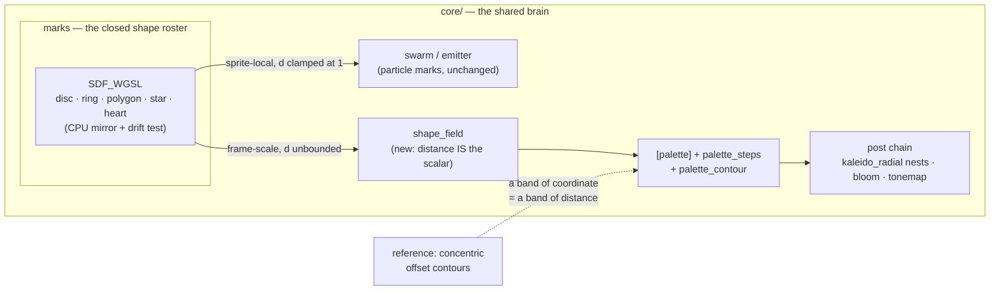

# ADR-0105 — The mark roster becomes a fullscreen distance field

> **Status:** accepted (2026-08-13, user approval)
> **Date:** 2026-08-13
> **Related plan(s):** [0091](../plans/0091-the-figure-fills-the-frame.md)

## Context

Three reference images arrived from the user, two of them the same subject: **concentric offset
heart contours, red on black**, tightening toward the centre. Decomposing them against the engine
found that almost everything they need already ships, and that what is missing is a single thing.

**The engine already has a heart.** `marks.rs:114` carries Inigo Quilez's heart as a signed
distance function, with an inradius that is exact rather than fitted (`SQRT_2 - 1`, derived in
`marks.rs:116-125` and confirmed by a grid search). It is one of five shapes — `disc`, `ring`,
`polygon`, `star`, `heart` (`marks.rs:63`) — in a closed roster shared by `swarm` and `emitter`
through one WGSL chunk with a CPU mirror and a drift test.

**It can only be drawn a few pixels across.** The roster exists to shape a *particle sprite*.
ADR-0084 scoped it that way deliberately, and `marks.rs:100-105` tunes its constants "for the size
the ask is *for* — small marks, a few pixels across". There is no path from that roster to a figure
at frame scale.

**Everything downstream of the missing piece already ships.** Banding a palette coordinate into
hard graphic steps is `palette_steps` (up to 64, `palette.rs:380`), and drawing constant-width
outlines at the band boundaries is `palette_contour` — which `palette.rs:57-58` scopes to exactly
the continuous-field scenes, for the reason that `fwidth` exists only in a fragment shader.
Nesting a centred figure into shrinking copies is `kaleido_radial`, periodic in `log r`. The
`fragment_mandala` preset ships the banding idiom today. So the nesting, the banding, the colour
surface and the reactivity levers are all present; **only the heart-shaped scalar is absent.**

**Neither line family can supply it, and one of them would be actively harmful.** `CurveFamily`
has exactly one variant, `MaurerRose` (`lines/mod.rs:95-98`), and the `star` scene's `Motif`
roster is seven names and closed by design. Both draw parametric outlines *sampled to straight
segments* — design-backlog 0073 — which is what retired `star_mandala`, `star_mandala_six` and
`star_weave` on 2026-08-06, and what ADR-0098 is being built to fix. Roughly twenty nested thin
hearts is the worst case that construction has: faceting scales with the number of copies, and
ADR-0098 records that the vertex bead *worsens* per unit length as sample count rises, because
ADR-0041's joins deliberately overlap and the additive composite sums the overlap. It would also
land directly on top of Plan 0087, the largest plan on the roster.

## Decision

**A new fullscreen scene renders the `marks` roster's normalized distance as its scalar field,
mapped through the shared `[palette]` like every other continuous-field scene.** The shape, its
scale and its centre are parameters; the distance is the palette coordinate.

This makes the reference's construction fall out rather than be imitated: **a band of the palette
coordinate is a band of constant distance, which is the definition of an offset curve.** Turning
`palette_steps` up produces concentric offset contours of the chosen shape, and `palette_contour`
produces thin outlines at their boundaries — the poster's construction exactly, per pixel,
resolution-independent, with no geometry to facet.

## Architecture diagram

## Consequences

### Positive

- **The three reactivity asks need no new mechanism.** Rings travelling outward is `color_center`
  offsetting the coordinate; ring count on the beat is `palette_steps`; the figure breathing is the
  scale parameter. All three are existing bindable params over a scalar that is now a distance.
- **One shape vocabulary, still one copy.** The scene reuses `marks::SDF_WGSL`, so the shapes a
  particle can wear and the shapes a figure can be cannot drift apart — which is the property that
  chunk was built for.
- **It sidesteps the line renderer entirely**, and therefore Plan 0087, ADR-0098's bead, and
  backlog 0073's faceting. A per-pixel distance has no vertices to show.
- **`palette_contour` gains its first subject that is a figure** rather than a noise field.

### Negative

- **The roster's exterior is unverified, and two arms are known to be wrong out there.**
  `marks.rs:33-37` says so plainly: "a distance function only has to be right inside it. That is
  what makes the polygon and star arms two cheap lines rather than an exact convex-polygon SDF."
  Offset contours read the field *outside* the silhouette, where nothing has ever looked. This ADR
  therefore changes what "correct" means for arms that were correct under the old contract, and the
  work of establishing it is real rather than incidental — it is why Plan 0091 opens with a
  measurement instead of a feature.
- **A tenth system**, with its own golden baselines, gate coverage, parameter rows and doc sweep.
- **The roster stays closed**, per ADR-0084's consequence, so a look wanting a shape outside the
  five still routes back through `architect` + `dev`. Promoting the roster raises the *value* of
  each name in it without making it extensible.

  **"Closed" governs the list of names, not the shape of each arm**, and the distinction is
  load-bearing enough to state before someone reads the sentence above as forbidding the obvious
  next move. An arm gaining a *parameter* — the star's valley radius, currently the hardcoded
  `STAR_INNER = 0.45` (`marks.rs:105`), or an edge curvature, or seeded per-spike jitter — adds no
  name and needs no ADR; it is the same decision ADR-0084 already took when it made `points`
  authorable. What the closed roster forbids is a *sixth silhouette*. Six further reference images
  arrived while this ADR was being written, five of which are the existing `star` arm wanting
  exactly those parameters, so this is a live reading and not a hypothetical one.

  One consequence of the shared chunk follows and belongs to whoever adds them: a constant promoted
  to a parameter is promoted for **both** consumers, so the particle path gains the same knob. Its
  default must therefore be the current constant exactly, or every shipped `shape`-bearing preset
  moves.
- **ADR-0037 is directly in play and this family has shipped that bug three times.** A fullscreen
  distance is screen-destined geometry, so its aspect must come from the render target. There is no
  internal grid here to take it from by accident, which removes the usual mechanism — but the rule
  is stated because the cost of rediscovering it is two plans of precedent.
- **A distance field is not free at the floor tier.** Each arm is a handful of ALU ops per pixel,
  which is cheap, but it is fullscreen and unconditional, unlike the sprite path where the quad
  bounds the work.

### Neutral

- The particle path is untouched by construction: it clamps at `d >= 1` and only ever reads the
  interior, so an exterior repair is invisible to it. That is an assertion the plan makes, not an
  assumption — it is checkable as byte-identity against the existing baselines.

## Alternatives considered

### Alternative A — a shape mode on `fragment_field`

Add a selector to the existing field scene choosing noise or shape. Cheaper by one scene: no new
pipeline, no new baselines, no new system name. Rejected because it makes one scene do two
unrelated jobs — a domain-warped noise field and an analytic figure share a palette and nothing
else — and it puts a byte-identity burden on every shipped `fragment_*` preset in exchange for
saving scaffolding this project adds routinely. The SRP cost is permanent; the scaffolding is paid
once.

### Alternative B — a heart in `CurveFamily`, or an eighth `Motif`

The obvious route: the reference is an outline, and the engine has an outline renderer. Rejected on
measured precedent rather than on taste. Every motif is a parametric outline sampled to straight
segments (backlog 0073), which retired three mandala presets on 2026-08-06; ADR-0098 records that
the vertex bead is the join mechanism working as specified and gets *worse* with more samples. A
figure made of ~20 nested thin contours maximises both defects simultaneously, and it would land on
the same files as Plan 0087.

### Alternative C — a composable SDF surface in the preset grammar

Let presets build shapes by combining primitives with union/intersection/offset in the expression
language. Strictly more powerful, and it is what a shader toy would do. Rejected because it turns
the preset language into a shader language, which ADR-0002 has deliberately declined for the whole
life of the project, and because there is no want behind it — the references need one shape from a
roster that already exists.

### Alternative D — approximate it with `kaleido_radial` over an existing field

`kaleido_radial` already nests shrinking copies, so point it at `fragment_field` and accept
whatever the noise gives. Rejected because it nests *noise*, not a figure: the references' subject
is the shape itself, and nesting is the one part of the construction that was never missing.

## Notes

The banding ceiling is `MAX_PALETTE_STEPS = 64` (`palette.rs:380`), comfortably above the ~20
contours the reference images carry, so the band count is not a constraint on this look.

`palette_contour` is documented as inert outside the continuous-field scenes and *nothing warns*
(`palette.rs:59-60`) — the new scene is a continuous field, so it becomes the third place that
param does something, and `presets/README.md`'s note beside it needs to learn the name.
