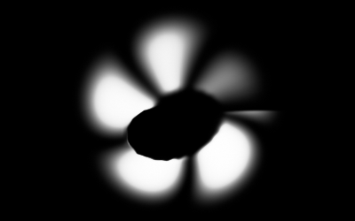
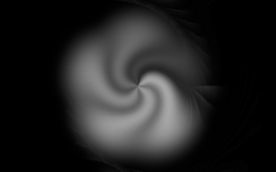
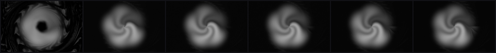
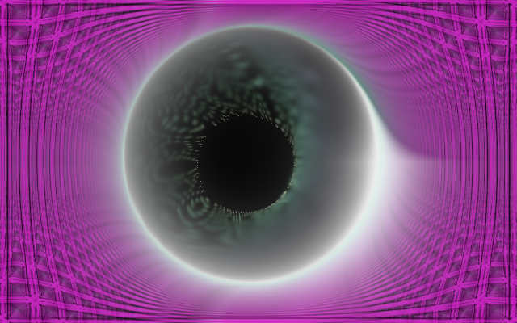
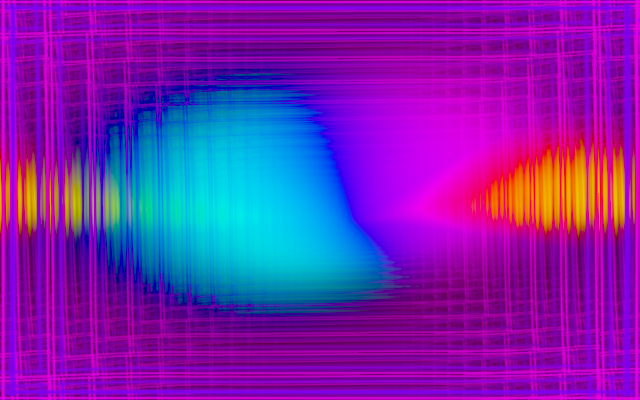
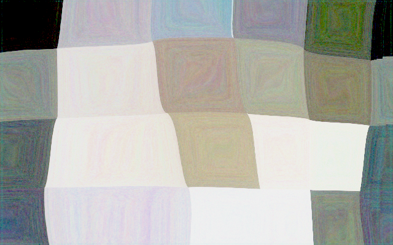

# Headless capture & visual QA

The renderer can draw a scene with **no window** — a surface-less wgpu context
draws into an offscreen texture and hands back raw RGBA pixels. Three things are
built on that:

- a **`shot` CLI** (`standalone/examples/shot.rs`) that writes PNGs an agent can
  read and a metrics report it can parse (Plan 0013),
- a **differential visual-QA harness** in `core/tests/` that hard-tests every
  preset for reactivity, animation, shape sanity, and beat response, with an
  advisory distinctness report and golden-image regression (Plan 0013), and
- an **offline video renderer** — [`--render`](#--render-a-music-video-from-a-track)
  walks a WAV end to end and streams frames to your own `ffmpeg`, so a track
  becomes a music video in one command (Plan 0101).

A headless render is a **pure function** of `(preset, input, frame-count, size)` —
scenes are reseeded per capture, every frame steps at the fixed
`scenes::FALLBACK_DT` (the live app injects its real `dt` instead; Plan 0014),
every capture path pins the preset's **declared numeric seed** so the grammar's
`hash()`/`noise()` reproduce even where the preset asked for `seed = "random"`
(Plan 0047 / [ADR-0051](adrs/0051-seeded-grammar-randomness-with-per-run-opt-in.md)
— see [Seeded randomness](../presets/README.md#seeded-randomness--hash-noise-and-generator-seed)),
and the DSP is deterministic — so renders are reproducible and diff-able.

> The seed pin is the one place a capture deliberately shows you something other
> than the live app: a `seed = "random"` preset's filmstrip is *an* instance of it,
> not the instance a user will see. Tune with a number.

## Captures pin the floor tier

**Every capture path renders at the `Floor` quality tier, and it cannot do
otherwise by accident.** `Renderer::new_headless` takes no tier argument and
resolves `Floor` by construction (Plan 0044 / [ADR-0045](adrs/0045-quality-tiers-floor-and-rich.md)),
so there is no field a test can forget and no environment variable that can change
what a baseline looks like. `shot` defaults to `floor` for the same reason and
deliberately does **not** read `LMV_TIER`.

Two reasons, and both are load-bearing:

- **Reproducibility.** A tier sets capacity — particle counts, the segment budget,
  the internal-grid caps — so a baseline blessed on a rich-tier run and compared
  against a floor-tier one differs for a reason that has nothing to do with the
  change under test. A capture is a pure function of its inputs (NFR §6), and the
  tier would otherwise be a hidden input.
- **Suite cost.** The golden and visual-QA suites run on the WARP software
  adapter, where fill and instance count translate directly into wall-clock. At
  rich values the same suite would draw 3x the attractor particles into a 4K-capped
  trail grid on a CPU rasterizer.

`--tier rich` is the deliberate opt-in, for spot-checking that the raised budgets
actually render.

> **A `Rich` capture is an instrument, and never a baseline**
> ([ADR-0064](adrs/0064-a-capture-may-pin-the-rich-tier.md)). Use it to *look*, not
> to bless: a rich capture must never be written into `core/tests/golden/`. The
> reason is dated rather than principled — `TierConfig::RICH`'s values are the
> provisional ones Plan 0044 shipped and its Phase 4 calibration has never run, so
> every `Rich` baseline would be a re-bless waiting on a number nobody has measured
> yet. Revisit after that calibration, not before.

Omitting the flag is exactly `--tier floor`, byte for byte — verified at Plan 0057
Phase 1 rather than assumed, since "the default is the old behaviour" is the kind
of claim that quietly stops being true.

> The consequence ADR-0045 names and accepts: rich-tier regressions are caught only
> by those spot checks and by on-device runs, not by the suite. That is a real hole,
> not a solved problem.

> `--size` is part of that tuple, and since Plan 0033 it does more than crop: the
> `trails` and `kaleido_*` stages size their internal grid from the render target
> (ADR-0034), so a preset composing either one genuinely renders *differently* at
> 640x360 than at 1080p rather than merely smaller. A given size is still exactly
> reproducible; two sizes are no longer scaled versions of one picture. Capture at
> the size you are judging.

Everything here is **dev/agent tooling**. The `image` crate is a *dev-dependency*
only (ADR-0011), so the shipped `lmv.exe` is untouched; the CLI is a
`cargo run --example`, not a subcommand of the app.

> Package name note: the standalone crate is `standalone`, so the invocation is
> `cargo run -p standalone --example shot -- …`.

## The `shot` CLI

Render one preset to a PNG (the agent then Reads the file):

```bash
cargo run -p standalone --example shot -- --preset "Whorl" --frames 120 --out shot.png
```

Flags:

| flag | meaning |
|------|---------|
| `--preset <name>` | preset to render (by name, as shown in the report / library); optional when the library holds exactly one preset |
| `--presets <dir>` | load the library from `<dir>` instead of the resolved preset directory |
| `--preset-file <path>` | load exactly one preset from `<path>` (beats `--presets`) |
| `--set k=v,...` | constant stimulus frame: `bass,mid,treb,onset,bar,novelty` (0..1), `tempo` (BPM), `beat` (non-zero = true). Keys are the **grammar's** names, so `tempo` is what a binding writes. It reaches the frame's scalars only — **not** the 64-band spectrum, so `bin(x)` reads `0` — see [the calibration traps](#the-three-calibration-traps) before trusting a value |
| `--frames <N>` | frames to advance before capture (default 120) |
| `--size <WxH>` | render size (default 1280x720) |
| `--out <path>` | output PNG (single shot) or dir/file (`--all`) |
| `--all` | contact sheet of every preset, labeled (needs `--out`) |
| `--report [family=<sys>]` | per-family metrics table — reactivity, animation, coverage and the [transient probe](#the-transient-columns); `family=` takes any `system` name (`fragment_field`, `swarm`, `parametric_curve`, `lsystem`, `star_pattern`, `reaction_diffusion`, `attractor`, `spectrum`) |
| `--json` | emit the report as JSON instead of a text table |
| `--signal <kind:param>` | synth-audio filmstrip (see below) |
| `--audio <clip.wav>` | filmstrip from a 16-bit PCM WAV |
| `--strip <N>` | frames tiled along the audio (default 8) |
| `--at <hop>,...` | explicit filmstrip hops, beating `--strip`'s even spacing — [how to capture a transient](#aiming-a-capture-at-a-transient) |
| `--frame-at <hop>` | **one** frame at that hop, written at the full `--size` — no tile scaling, no border. Needs `--signal`/`--audio`; not combinable with `--at`. [Which flag takes a picture worth keeping](#a-full-size-frame-under-real-audio) |
| `--tier floor\|rich` | quality tier to capture at (default `floor` — see above) |
| `--horizon <minutes>` | [the long-run drift check](#the-horizon-does-a-world-still-look-like-itself-after-minutes) — N **simulated** minutes at capture cadence, one statistics row per interval. Minutes of wall clock; never a gate |
| `--interval <secs>` | simulated seconds between horizon rows (default 30) |
| `--render <clip.wav>` | [offline video](#--render-a-music-video-from-a-track) — walk the clip at `--fps` and stream every frame to stdout for an encoder to read. Deterministic and decoupled from real time |
| `--fps <n\|num/den>` | the render mode's frame rate (default 60). A decimal is rejected: write `30000/1001`, not `29.97` |
| `--ffmpeg <path>` | spawn this encoder and wire the pipe, so one command produces a file. Needs `--out <file>`. No encoder ships and there is no fallback |

Bad arguments and unknown presets exit non-zero with a message.

### The horizon: does a world still look like itself after minutes?

Everything else on this page measures the first seconds of a preset's life. The
four behavioral gates capture **30 frames** — half a second — and the reactivity
gate a few seconds of hops. A live set runs for hours, and a world whose
mechanism *accumulates* can drift across that gap with the whole suite green:
Plan 0075 cohort 4's Shatter piled onto its flow field's attractors over minutes
and collapsed live three times without a single test going red.

`--horizon` is the instrument for that class. It renders N simulated minutes at
the fixed 1/60 s capture step and prints one row per interval — coverage,
concentration (`peak/mean`), and motion over the figure's own footprint since the
previous row — plus a trend line per statistic.

```bash
# Ten simulated minutes of a swarm world, a row every 30 s
cargo run -p standalone --example shot -- \
  --preset-file presets/swarm_shatter.toml --horizon 10 --size 96x96 --set bass=0.7

# ...and the same run as JSON
cargo run -p standalone --example shot -- \
  --preset-file presets/swarm_shatter.toml --horizon 10 --interval 60 --json
```

**When to run it** (ADR-0099 states the trigger once, so it can be found): on a
world whose mechanism has an **accumulation axis** — sustained forces, feedback
with net gain, a population that can migrate or pile up. Record the verdict in
the world's own header, the way the fold-edge verdicts were recorded.

**Five things to know before reading a row.**

1. **It is never a gate.** Nothing here runs in CI or fails a build, and the mode
   applies no threshold. It prints a trend; the verdict is yours. Making it a
   gate was rejected on measured cost — the reactivity gate's move to real PCM
   alone cost 1.8x over 41 presets, and a minutes-long capture per preset is
   orders beyond that.
2. **Run a static control beside the subject.** The statistics are image-domain
   proxies for a simulation-domain event: particles piling onto attractors
   *reads* as coverage falling and concentration rising, and that correlation is
   strong without being identity. A world that renders one frame forever prints
   `delta 0.0000, monotone 0.00` on every statistic — that flat series is what
   makes a sloped one mean something.
3. **It is slow by construction** — 3,600 renders per simulated minute. At
   96x96 on a hardware adapter a ten-minute horizon measured **16 s** for a
   single-pass world (`Halo`) and **54 s** for a reaction-diffusion one
   (`Etching`, 13 passes a frame). Nobody will run it casually, which is the
   honest cost of refusing a gate.
4. **The verified length is the documented one, and here is what verified
   means** (Plan 0099). `--horizon 10` renders all 36,001 frames on **all three**
   shipped reaction-diffusion worlds — `Etching`, `Mitosis`, `Verdigris` — with
   the resident set **flat**: 324 MB reported before the run and 400 MB after,
   of which the render itself travels **0.8 MB** (398.8 MB at 4 s to 399.6 MB at
   54 s) — the 21 sampled images themselves. Measured on the Windows
   development box, hardware adapter, debug build, at 96x96 (ADR-0071 — a
   different machine or profile is a different measurement).

   It was not always true, and the shape of the old failure is worth keeping.
   The capture path submitted every non-sampled frame without ever polling the
   device, so it reclaimed nothing between two *sampled* frames — 1,800
   consecutive unpolled submits at the default interval. Retention was per
   **pass**, not per pixel: an RD world retained **950 KB a frame** against a
   36 KB captured frame, where single-pass worlds retained ~30 KB, so RD reached
   the allocator first at ~4.4 GB and died with an invalid readback buffer. That
   made it look like a property of the RD family; it was the poll cadence. The
   step now polls, which costs about **1.5x** wall clock on an RD world and
   bounds the memory of any run at any length.

   **A run that cannot reach its requested length says so on stdout**, in the
   table's place, with the wall clock and resident set it died at — not only as
   a stderr line. And a `--horizon` the `--interval` does not divide is rounded
   **down** to the last whole interval (rows are exact multiples, which is what
   makes them comparable between runs), so the header states the length the run
   actually reached and flags the shortfall when there is one.
5. **It cannot see most of the process.** GPU resource churn and the frame-time
   spike on a preset switch are not reproducible in a headless loop that never
   rebuilds a surface. [`--soak`](nfr.md) is the instrument for that half, and
   the two are deliberately separate (ADR-0099).

   **One exception, and it is the one that mattered:** the resident set of the
   render loop itself. The cost block reports it, and reading that column is
   what found the ceiling in point 4 — a headless loop cannot reproduce a
   *switching* app's memory behaviour, but its own growth is exactly what a
   long run is in a position to see. This point used to name the resident set
   among the things a horizon cannot see; that was too broad.

The stimulus is `--set`, held for the whole run, which is what makes a row at
minute nine comparable with a row at minute one — so `--horizon` and
`--signal`/`--audio` are mutually exclusive rather than one silently winning.

Reading the trend block: `delta` is how far a statistic travelled end to end, and
`monotone` is what share of the steps went that way. A world grinding into a
corner reads a large `delta` at a `monotone` near `1.00`; a world breathing
around a stable mean reads a `delta` near zero whatever its `monotone`. Where the
line falls between *drifting* and *alive* is a judgement about the look, which is
why the tool declines to make it.

Two properties hold and are asserted rather than assumed
(`standalone/tests/shot_cli.rs`): the same world at the same horizon produces
**identical** rows across runs, and a row at interval *k* does not depend on how
far the run was asked to go — so a two-minute run and a ten-minute run agree on
every row they share. The wall clock and resident set in the cost block are the
exception: those are properties of the box, reported and never asserted
(ADR-0071).

### `--render`: a music video from a track

Every other mode on this page takes a **picture**. `--render` walks a WAV end to
end at a fixed frame step and writes a **video stream** to stdout, for a user's
own `ffmpeg` to encode ([ADR-0114](adrs/0114-the-engine-renders-video-offline-and-delegates-encoding.md)).

```bash
# One command: --ffmpeg spawns the encoder and wires the pipe.
cargo run -p standalone --example shot -- \
  --preset "Supernova" --render track.wav --fps 30 --size 1920x1080 \
  --ffmpeg ffmpeg --out track.mp4
```

**No encoder ships, and that is a decision rather than an omission.** A 1080p
RGBA frame is 8.29 MB and four minutes at 60 fps is 119 GB, so the frames can
never reach disk before the encoder — a pipe is the only viable shape, not an
optimization. A static encoder is in turn larger than this application's whole
[size budget](nfr.md#4-size-and-dependencies). So `ffmpeg` is a documented
prerequisite for this one feature, and `lmv.exe` does not change size.

**What makes this worth having is that it cannot drop a frame.** Every live
visualizer's render loop is welded to a real-time audio device, so its "export"
is a screen capture: bounded by the display's refresh and resolution, degraded
under load, and different every run. Nothing in this path races a display — `dt`
is injected (ADR-0013), the DSP is a pure function of its input window
([NFR §6](nfr.md#6-determinism)), and the grammar's randomness is pinned
(ADR-0051). Two runs of the same command produce **byte-identical** streams, and
that is asserted in `standalone/tests/shot_cli.rs` rather than inferred.

**The two clocks are different clocks.** Analysis hops arrive at
`sample_rate / HOP_SIZE` — 93.75 Hz for 48 kHz audio — and frames at `--fps`.
The loop advances whichever is due next, so most 60 fps frames take one new hop
and some take two. Rendering one frame per hop instead would run the picture at
64% speed against its own soundtrack. Above the hop rate (`--fps 240`) frames
repeat the last published analysis frame rather than interpolating one: the DSP
publishes on hop boundaries, and inventing values between them would put
something on screen the analyzer never derived.

**The wire format is Y4M** (`ffmpeg -f yuv4mpegpipe`), and the stream is
self-describing — `YUV4MPEG2 W1920 H1080 F60:1 Ip A1:1 C444 XCOLORRANGE=FULL` —
so a mistyped geometry cannot silently produce garbage and a non-`ffmpeg`
consumer needs nothing from the command line. Three parts of that header earn
their place:

- **`C444`** — chroma is not subsampled, so the conversion loses only rounding.
- **`XCOLORRANGE=FULL`** — the samples use 0–255, not the 16–235 studio swing.
  Omit it and every player expands the range again and the file is visibly
  washed out against the app, in a way that reads as an engine bug and is not.
- **`F60:1`** — an exact rational, which is why `--fps` refuses a decimal.
  `29.97` is 30000/1001; accepting it as 2997/100 would drift the picture against
  its own soundtrack by a frame every few minutes, and nothing in this harness
  would catch it.

Y4M cannot carry RGB — the muxer *errors* on `rgb24` — so `shot` owns the
RGB→YUV conversion (full-range BT.709). It is not bijective at 8 bits, which is
why the tap-placement guard is asserted on the RGB frame the writer is handed and
never on the wire bytes; a guard written against the wire would have to be
loosened to a tolerance until it passed, which is how a guard becomes decoration.

#### The one canonical `ffmpeg` invocation

`--ffmpeg <path>` spawns the encoder, wires the frame stream into its stdin, and
passes the source WAV through as a second input for muxing. **There is exactly
one command line and `--ffmpeg` generates it** — it is echoed on stderr at the
start of every encoded run, so adapting it by hand starts from what actually
ran rather than from a wiki of incantations:

```
ffmpeg -hide_banner -nostats -y -f yuv4mpegpipe -i pipe:0 -i track.wav \
  -map 0:v:0 -map 1:a:0 \
  -c:v libx264 -preset medium -crf 18 \
  -pix_fmt yuv420p -color_range pc -colorspace bt709 -color_primaries bt709 \
  -color_trc bt709 \
  -c:a aac -b:a 192k -shortest track.mp4
```

No `-s` or input `-pix_fmt`: the geometry is on the wire, which is the point of a
self-describing stream. The `-map` pair is explicit so a clip carrying album art
cannot displace the rendered picture. The four colour tags are the half most
likely to ship wrong — an untagged file is one the player expands from studio
swing and shows washed out. `-color_trc bt709` rather than `iec61966-2-1`: the
tap hands over sRGB-encoded samples and the two are close, but every player
assumes the former and some ignore the latter outright.

**A dead encoder reports the encoder's failure, not our broken pipe.** The child's
stderr is drained on a thread — echoed line by line as it arrives, and kept — so
if it exits non-zero `shot` exits non-zero quoting its last words. Writing into a
full pipe blocks until the encoder drains it, which *is* the backpressure
handling: nothing is buffered on this side of it. Both halves are asserted in
`standalone/tests/shot_cli.rs`, the second against a stand-in encoder that dies
on its first argument.

**`ffmpeg` is a prerequisite, and its absence is a named error naming the flag** —
never a fallback to something else, because a quietly-substituted encoder is what
would make an exported file untrustworthy.

Practical notes:

- **stdout is the video** on the raw-stream path. Every human-readable line goes
  to stderr, so a summary printed the way the other modes print one would be
  eight bytes of garbage in the middle of the file. `--out` is therefore rejected
  *without* `--ffmpeg` and required *with* it.
- Nothing validates the container. That the frames and the stream are right is
  tested; whether `ffmpeg` made a good MP4 is outside this harness and ADR-0114
  accepts it.
- `--render` takes its own clip and is mutually exclusive with `--signal`,
  `--audio` and `--horizon` — any pair would mean silently ignoring one of two
  stimuli.
- The frame count is `ceil(clip_seconds x fps)`: the trailing partial frame is
  rendered rather than dropped, so the picture is never shorter than the audio.
- It renders at the **floor** tier like every other capture path. `--tier rich`
  is the opt-in, and it is the mode where it is most worth paying for — an
  offline render has no 60 Hz deadline, so the frame-time governor never fires.
- **Every run reports its resident set**, sampled across the render and printed
  on stderr at the end:

  ```
  render: resident set 434 MB, growth +0.1 MB across 600 frames after a
  +75.9 MB warm-up (peak 434 MB, 21 samples)
  ```

  A render that leaks is the same defect as a live session that leaks, so
  [NFR §12](nfr.md#12-runtime-memory)'s no-session-growth requirement applies
  here and is measured the same way. Read the **growth**, not the absolute: the
  latter is a ~327 MB vendor driver floor on the reference box and does not
  travel. Growth is charged from the *warm* reading rather than the baseline
  because the whole warm-up step lands at once on the first draw — pipelines
  compiled, GPU resources built — and charging it against the baseline would
  print a flat run as "+76 MB", which is exactly what the per-frame retention
  [Plan 0099](plans/done/0099-the-horizon-reaches-its-own-length.md) found looks
  like. The peak keeps both honest: a run that grew and was reclaimed reads flat
  end to end, and only an intermediate sample tells it apart.

  The full four minutes at 1080p/60 — 14,400 frames of `reaction_mitosis` at
  `--tier rich`, the thirteen-pass family that hit 0099's wall — measured
  **334 MB, growth -8.1 MB, peak 342 MB** on the Windows dev box (2026-08-17,
  hardware adapter, release). Where the old retention would have reached ~4.4 GB.

#### A filter stage between `shot` and the encoder

The frame stream is a pipe, so anything that speaks Y4M can sit in the middle of
it. `tools/sd-filter/` is the first such stage: an img2img diffusion pass with
ControlNet holding the render's geometry, so the attractor becomes canyon rock
while the shape keeps tracking the music. **It is documented in one place, and
that place is [`docs/diffusion-filter.md`](diffusion-filter.md)** — setup, the one
canonical command, the flags and what it costs. Nothing on that path ships in the
release zip.

`--ffmpeg` is **not** used there: it spawns the encoder itself, which leaves no
seam to insert a stage into. Composing the pipe by hand is the whole point of the
raw-stream path.

**The encoder line is invariant, and that is the pipe-level fact worth keeping
here.** A stage in the middle changes the picture and never the frame count, so
the `ffmpeg` invocation above never learns a rate that has to agree with a flag on
another process. There is no `-r` to keep in sync and no way to desynchronize the
audio silently — which is why the encoder half of that pipe is unchanged,
character for character, whether or not a stage is in it.

### The three calibration traps

`--set` is a **held** stimulus: it writes the analysis frame directly and that
same frame drives every captured frame. That makes it perfect for isolating one
binding and wrong for three things people reach for it anyway.

**Trap 1 — `--set beat=1` holds the beat gate high for the whole capture.** Real
beats are transient: `beat` fires on one hop and is false on the next. Held high,
every `beat`-driven accent in the preset is at full deflection in the still you
are looking at — a `+ beat * 0.155` thickness term that should flash for a frame
instead reads as the preset's baseline. The result is that a *working* preset
looks broken in a still (permanently blown-out, or so busy the geometry is
unreadable), and the natural response — turning the accent down — breaks it for
real on live audio. If you want a beat, capture one:

```bash
# Transient beats through the real onset detector, no asset needed
cargo run -p standalone --example shot -- --preset "Drift" \
  --signal click:120 --strip 8 --out click.png
```

**Trap 2 — `--set` band magnitudes are not real levels.** `--set bass=0.8` writes
`0.8` onto the frame; a band that arrives through the analyzer comes in through
the normalizer instead, and *what `0.8` means* differs between the two.

> This trap used to be stated as a magnitude gap — a full-scale 60 Hz sine reads
> `bass ≈ 0.19` and a 120 BPM click track peaks at `bass ≈ 0.011`, so `--set
> bass=0.8` is four to seventy times too hot. **Those figures are raw-scale and
> [ADR-0049](adrs/0049-analysis-v2-dual-resolution-axis-normalized-bands.md)
> retired them**; they now describe `bass_raw`, and the table in
> [what real material actually produces](#what-real-material-actually-produces)
> is where they live. On the normalized scale the same sine reads `1.000`, because
> a steady tone *is* its own recent peak.
>
> The trap survives the rescaling, in a different shape: a normalized band is a
> fraction of the material's own peak, so `--set bass=0.8` claims "80 % of peak,
> held forever", which no music does. The number is no longer wrong by two orders
> of magnitude — it is wrong about *time*.

So every `--signal` / `--audio` filmstrip **prints the levels it measured**, and
those are the numbers to calibrate a gain against (here, `--signal bass:60`):

```
audio levels over 355 analysis hops (past warm-up) — calibrate gains against these, not against --set magnitudes:
  signal      min     mean      max
  bass      1.000    1.000    1.000
  mid       0.000    0.000    0.000
  treb      0.000    0.000    0.000
  onset     0.006    0.405    1.000
  onset peaks at 1.000 on hop 20 — the shipped attractor reseed gates run 0.50 to 0.75
```

`--audio <clip.wav>` on real material is the one that answers "what does my music
actually produce"; `--signal` answers it for a known synthetic tone. Use `--set`
to ask "does this binding do anything at all", not to decide how much of it to
apply.

**`onset` is in that table since Plan 0057**, and it is not a band. It is there
because a whole class of binding — every shipped attractor's `reseed`, every
beat-latched accent — is gated on it, and whether a given stimulus ever *crossed*
such a gate was not answerable from a capture. The peak hop is printed beside it
because that hop is the argument to [`--at`](#aiming-a-capture-at-a-transient).

### Aiming a capture at a transient

`--strip N` samples the clip at N **evenly spaced** hops. That is the right
question for "what does this look like over the clip" and the wrong one for "what
does the frame the gate fired on look like" — and the two get confused because a
strip *looks* thorough.

The arithmetic: under `--signal click:120`, `onset` crosses `0.75` on **7 hops out
of 375**. An evenly-spaced strip of 8 lands on one of them by luck, and when it
misses, the capture shows a preset whose reseed never fired — which is
indistinguishable from a preset whose reseed does not work.

So the level table names the peak hop and `--at` takes it:

```bash
# 1. What does this clip do, and where?  -> "onset peaks at 1.000 on hop 46"
cargo run -p standalone --example shot -- --preset-file presets/attractor_ink.toml \
  --signal click:120 --strip 8 --out over-the-clip.png

# 2. Now capture the transient itself, and the frames either side of it
cargo run -p standalone --example shot -- --preset-file presets/attractor_ink.toml \
  --signal click:120 --at 44,46,48,54 --tier rich --out the-reseed.png
```

Hops are indices from hop 0 of the clip — the same numbering the level table
reports. Order is yours (a before/after pair reads left to right), duplicates are
an error, and a hop past the end of the clip is an error rather than a silently
missing tile.

> **`--signal click:120` reaches every shipped reseed gate, and always did.**
> [ADR-0066](adrs/0066-a-reseed-disturbs-the-cloud-rather-than-replacing-it.md)
> and [design-backlog 0050](design-backlog.md) both state the opposite — that the
> synthesized clip's `onset` never clears `0.56`, let alone `attractor_clifford`'s
> `0.75`. That was true on the **raw** onset scale and was invalidated by
> [ADR-0049](adrs/0049-analysis-v2-dual-resolution-axis-normalized-bands.md)'s peak
> normalization, whose attack is *instant*: an isolated transient reads `1.000` on
> the hop it arrives, whatever its absolute magnitude. Measured at Plan 0057
> Phase 1, `click:120` produces **7 clean rising edges over `0.75`**, one per beat.
> The gate was never the problem; **aiming** at it was.

Which kind to reach for, for a gate rather than a level:

| kind | `onset` min / mean / max | as a reseed stimulus |
|---|---|---|
| `click:<bpm>` | 0.000 / 0.033 / 1.000 | **the one to use** — 7 isolated edges over `0.75`, one per beat |
| `dynamic:<bpm>` | 0.001 / 0.153 / 1.000 | 12 edges, in amongst real band dynamics |
| `noise:<seed>` | 0.826 / 0.953 / 1.000 | **wrong** — pinned above every gate, so an edge-triggered binding fires once and never again, exactly as `--set onset=1` does |

**Trap 3 — `--set` leaves the 64-band spectrum silent, so `bin(x)` reads `0`.**
`--set` writes the analysis frame's *scalars*; there is no key for the log-band
array, and `AnalysisFrame::default()` leaves all 64 bands at zero. So under any
`--set` capture:

- every `bin(x)` call in an expression returns `0`, whatever `bass`/`mid`/`treb`
  say, and
- the whole **`spectrum`** system draws its `base` resting comb and nothing else —
  the readout is inert, which looks exactly like a broken preset.

This is not a bug in `--set` (it writes what you ask and nothing else); it is the
one part of the frame it cannot reach. **`bin(x)` and the `spectrum` system have
to be verified through `--signal` or `--audio`**, both of which run the real
analyzer over real samples and therefore populate the array:

```bash
# The band array through the real FFT - the readout actually moves
cargo run -p standalone --example shot -- --preset "Halo" \
  --signal chord --strip 3 --out comb.png
```

`--report` builds its stimulus frames in code rather than from `--set`, and those
**do** light the band array (each named band lights the slice of the log spectrum
it summarises), so the report's numbers are real for a spectrum preset.

### A full-size frame under real audio

`--frame-at <hop>` (Plan 0088) captures **one** frame at the named hop and writes
it at the full `--size`. It is the flag every committed documentation image uses,
and the reason it had to exist is that neither of the other two paths produces a
picture worth keeping:

| what you run | what you get | why it is not a documentation image |
|---|---|---|
| `--frames 120 --out x.png` | a clean 1280x720 frame | it runs under **silence** — the capture path builds a default analysis frame, so a band-driven preset photographs at its resting state |
| `--at 340 --out x.png` | the right stimulus, through the real analyzer | the filmstrip scales every frame to a fixed tile height and draws a gutter round it: a single-hop `--at` at default size comes back **363x208 with a border** |
| `--set bass=0.8 --frames 120` | full size, and wrong three ways | [the three calibration traps](#the-three-calibration-traps) — a held `beat`, band magnitudes no music reaches, and a silent 64-band array |

`--frame-at` is the first two combined:

```bash
# The picture the docs commit: full size, real dynamics, on the loudest beat
cargo run -p standalone --example shot --release -- \
  --preset-file presets/attractor_leviathan.toml \
  --signal dynamic:110 --frame-at 300 --size 1280x720 --tier rich \
  --out docs/images/gallery/attractor.png
```

**Hop 300 is not arbitrary, and a later hop is worse.** `dynamic:110`'s phrase
builds for six beats and then rests for two at an amplitude of `0.04`, and at
110 BPM with a 512-sample hop that rest begins at hop 306 — so anything past that
photographs a reactive preset at its resting state. 300 is the last hop of the
loudest beat: maximum energy, and the most scene time an accumulating family can
have before the rest. The arithmetic is in
[`scripts/docs-shots.mjs`](../scripts/docs-shots.mjs)'s header, which is also
where a per-image deviation from 300 has to say why.

It shares everything with the strip except the write: the same hop numbering, the
same `capture_audio` call, and the same level table on stdout. A hop past the end
of the clip is an error, as `--at`'s is. Passing both `--frame-at` and `--at` is
an error — they answer the same question two ways — and `--frame-at` without
`--signal`/`--audio` is an error naming what is missing, since there is no clip to
advance through.

Two captures of the same `(preset, signal, hop, size, tier)` on **one machine and
binary** are byte-identical. That is a same-adapter claim only: the golden suite
treats a `0.02` mean channel difference as ordinary rasterizer drift, so
cross-machine byte equality does not hold and nothing here asserts it.

### What the report's columns mean

```
  preset            bass     mid    treb   onset   drive    anim    rate   cover  rise  fall
  Drift Mono       0.320   0.489   0.204   0.174   0.455   0.316 0.0411+   0.450    9+   24+
  Static Control   0.000   0.000   0.000   0.000   0.000   0.122 0.0057+   0.997   43+   42+
```

| column | question it answers |
|---|---|
| `bass` `mid` `treb` `onset` | how far the frame moves when that stimulus alone comes up, against silence — "does this preset respond to bass at all" |
| `drive` | how far the frame moves under the **combined** stimulus — silence against everything up at once, same depth and same size ([the two motion readings](#the-two-motion-readings)) |
| `anim` | how far the frame moves between two capture depths **under silence** — does it have a life of its own |
| `rate` | how far the frame moves **frame to frame** — the only column that walks consecutive frames, and the only one measured at 96x96 ([the two motion readings](#the-two-motion-readings)) |
| `cover` | fraction of the frame that differs from the corner background — [a low value is often correct](#a-low-cover-is-not-a-defect) |
| `rise` `fall` | the **transient probe** (below) — frames to settle after a step up, and after the matching step down; a **`+` suffix** means the value is a *lower bound*, not a measurement (below); [read them as evidence, not a verdict](#what-the-transient-columns-cannot-see) |

The name column is fourteen characters wide, and a longer name is **elided in
the middle**, not at the tail: `Tiled Rosette Mono` prints as `Tiled R~e Mono`.
The tail is what distinguishes a name in this library — `Mono`, `Gallery`,
`Bordered`, `Walk` — and a tail truncation threw it away, which is how two
presets came to print as one row label in all three tables (design-backlog 0131).
A `~` in a label means characters were dropped there.

Two extra labeled blocks print under the table (the table itself stays un-widened,
so every historical number keeps its place): the **realistic-levels** reading
(`reactivity_low` — the same bands at the levels real music reaches, ADR-0042) and,
since Plan 0077, the **footprint** reading (`reactivity_footprint`) — the same
differentials divided by the **union of lit pixels** instead of the whole frame
(`metrics::footprint_diff`, ADR-0091). Read the footprint block when a mean band
column shows ~0.000: reactivity concentrated in a small footprint — a `bloom_amount`
halo, a sparse figure — is diluted by the whole-frame mean, and before this reading
existed the house workaround was binding a `flash` lever just so the report had
something to see. On a backdrop-heavy preset the union mask approaches the whole
frame and the reading degrades toward the mean column — it never sits meaningfully
below it, so it fails toward the old behaviour rather than inventing reactivity.

Every one of those but the last two is a **settled** measurement: the capture
holds one stimulus for every frame it renders, so each smoother has converged
long before the pixels are read. That is the right question for "does it
respond", and it is exactly why those columns are **identical for any
`[smoothing]` constant**.

#### The two motion readings

`drive` and `rate` were added by [ADR-0134](adrs/0134-motion-is-two-readings-and-anchoring-is-why-neither-can-be-a-threshold.md),
which exists because the report could not see either axis. Every other statistic
on this page is a **settled differential** — two frames captured a fixed count
apart — so it cannot see *rate* at all, and the reactivity columns drive one band
at a time, so they cannot see combined drive either. A preset needed four live
passes with a person watching before the lane found its defect, and the harness
stayed green and unchanged through all four.

**`drive`** is the silent 48-frame capture differenced against the fully-driven
one: same frame count, same scene time, same `REPORT_SIZE`. It is the question
the listener asks — *does this change when the music does* — and it is not the
same question as the four band columns beside it, which drive one stimulus each.
A preset reading several bands together can measure low on every one of them and
still be strongly driven; one can read plausibly on all four and be driven by
none of them together. A preset with no audio binding at all reads `0.000`.

**`rate`** is the mean difference between **consecutive** frames over the settled
tail of the transient probe's loud plateau. It separates frozen from boiling,
which is the axis the report has never had.

Both ride captures the report already takes — no extra render pass, no extra
readback, no resize — so the full-library wall clock is unchanged.

Two things to know before reading either number:

- **`rate` is measured at `PROBE_SIZE` (96x96), not `REPORT_SIZE` (192x192) like
  every column printed beside it.** It rides the probe's frames, and the probe
  runs small for the reasons in [the transient columns](#the-transient-columns).
  `frame_diff` is a normalized mean so the two are broadly comparable, but
  "broadly" is not a property: never compare a `rate` against a number measured
  at another size. `--json` carries `measured_at_px` beside the value for exactly
  this reason.
- **A `rate` cell carries the same `+` mark the transient cells do**, taken from
  the probe's own `rise_settled`. An unsettled rise means the frames it averaged
  were still travelling toward the plateau, so the number describes the transient
  rather than the steady motion. The mark is **common, not exceptional** — see
  the transient section on why a great many presets never settle inside 48
  frames.

**Neither number is a gate, and `rate` does not sort the library.** This is the
finding the ADR turns on rather than a caveat bolted to it. Motion inside a
static repeating structure reads as *calm* — the eye reads a pattern updating in
place — while the same amount of motion in an unanchored world moves the whole
sheet bodily and has to be far quieter to watch. Measured: `fragment_tiledmono`
and `fragment_drostemono` both sit **higher** than a draft that was rejected for
shaking, and both are comfortable. No pixel statistic in this harness models
anchoring, so any threshold consistent with the rejected draft would fail two
shipped presets. Read both columns **against family neighbours**, the way `geom`
is read ([ADR-0083](adrs/0083-in-frame-geometry-is-measured-at-the-line-renderers-draw-seam.md)),
and never sort on them.

#### The transient columns

`rise` and `fall` are the one pair that is *not* settled. The probe drives a
step — silence, a held stimulus, silence again — reads back **every** frame, and
counts how many it takes for the frame to reach 90 % of its total change each
way ([ADR-0039](adrs/0039-verify-easing-with-a-transient-probe-not-a-committed-clip.md)).
That makes [ADR-0035](adrs/0035-asymmetric-attack-release-easing.md)'s
`{ attack, release }` pair visible: a scalar `[smoothing]` entry selects the same
constant both ways, so its two numbers match; a pair snaps up and glides down, so
`fall` runs well past `rise`.

Reading them:

- **`1` and `1`** — no easing on whatever the stimulus drives. The frame is fully
  there the frame after the step.
- **equal, both large** — a scalar `[smoothing]` entry, or an asymmetric one whose
  two constants are close.
- **`fall` much larger than `rise`** — an `{ attack, release }` pair doing its job.
- **`0` and `0`** — the step did not move the frame at all. Check the reactivity
  columns: this usually means the preset does not respond to the stimulus, not
  that its easing is instant.

#### What the transient columns cannot see

**The probe measures the frame, not the parameter.** It reads pixels, so it can
only see easing through whatever curve the scene puts between a bound value and
its output — and for most scenes that curve is neither linear nor even monotone.
Two consequences, both real and neither fixable by measuring harder:

- **A saturating response reads flat.** `rose_trails` is the worked example: its
  1.25 spin against a max-decay feedback drives the frame to the same place
  whatever `thickness` says, which is why the content lane once rendered five
  values from 1.10 to 2.30 — *including the untouched original* — and could not
  tell them apart. A preset like that will report a transient that has nothing to
  do with its `[smoothing]` table, and no column here will warn you.
- **The scene's own motion is measured too.** A fragment field's fold, a feedback
  trail and a particle cloud all keep changing while the parameter settles, and
  the probe cannot separate that from the response. Over the shipped library this
  shows up as presets reporting `fall` *below* `rise`, which is backwards for any
  easing.

Measured over the shipped set on 2026-07-27 — a snapshot of what the probe sees,
not a figure anyone maintains — presets carrying at least one
`{ attack, release }` entry had a median `fall / rise` of **1.02**, with
`fall > rise` in about half of them; presets with only scalar entries sat at
**0.60**, with barely any. So the columns separate the two populations
*directionally* and lose the magnitude almost entirely:
`Smooth Pulse`, the worked asymmetric example with a 0.60 s release,
reads `26 / 31` where a purpose-built near-linear fixture at a 0.5 s release reads
`3 / 61`.

> **Those numbers were taken before the `+` marker existed, and every one of them
> would carry it today** (Plan 0038 Phase 8). They were produced by exactly the
> defect this section goes on to describe: at `PROBE_WINDOW` = 48 a 0.60 s release
> is 1.33 τ, leaving ~26 % of the travel undone, and the fixture's `3 / 61` is now
> known to be `3 / 69` when measured to settlement. Read the snapshot for its
> *shape* — two populations, separated directionally, magnitude lost — and not for
> its magnitudes, which is the same warning the rest of this section gives, now
> with the arithmetic behind it. It has not been re-taken: re-snapshotting is not
> what makes the columns trustworthy, marking them is.

**Read the columns as evidence, not as a verdict.** A wide `fall / rise` gap is
good evidence the easing is working. A narrow one is not evidence it is broken.
The place easing is proven is `core/tests/easing.rs`, against fixtures built to
have a near-linear response precisely so the measurement is of the easing and not
of a scene; everything else is a preset-shaped approximation of that.

One smaller limit, and it is sharper than it was first written: the probe's window
is **48 frames (0.8 s) each way**, so a release constant longer than about 0.35 s
does not fully settle inside it. This page used to say such a response "reads
*clamped*" — **it does not, and that word was the trap.** `frames_to_settle`
normalizes against *the segment's own last frame*, so when that frame is still
travelling the measured total is short and every threshold is crossed early. The
number that comes back is not pinned at the window length and is not obviously
wrong; it is a plausible, smaller frame count. Worse, the bias is uneven — the
0.9 threshold is pulled in harder than the 0.5 one — so a truncated fall also
reads as a *more even* fall than it is.

That is not hypothetical. Plan 0038 Phase 3 measured two easing orderings, one of
which had an effective time constant of 1.0 s against a 1.6 s window, and read the
truncation as a difference in the shape of the two falls. Measured to settlement
the two shapes are identical and differ only in speed — 73 frames against 145,
where the truncated run said 61 against 78. See
[ADR-0040](adrs/0040-spectrum-level-curve-applies-before-the-easing.md)'s Outcome.

**The rule, and the function that enforces it.** `frames_to_settle` cannot detect
this about itself: normalizing against the last frame *guarantees* the threshold
is crossed inside the segment, so `frames_to_settle(seg, f) < seg.len()` is a
tautology rather than a check. Before trusting a frame count, gate it on
`metrics::segment_settled(segment, tol)`, which extrapolates the geometric tail
from three points spread across the segment and answers whether the last frame is
within `tol` of the asymptote. Sample widely rather than from the end: captures
are 8-bit, and a response slow enough to outrun its window moves by *less than one
code value per frame* near the end, so adjacent frames decode as identical and
read as settled exactly when they are not.

**So `--report` marks rather than pretends** (Plan 0038 Phase 8). A transient cell
carries a **`+`** when `segment_settled` cannot certify the response arrived —
`61+` means *at least 61 frames*, never 61. Each family's table then names how
many of its presets marked. `--json` carries the same fact as `rise_settled` and
`fall_settled` booleans, so a consumer reading only the counts cannot mistake a
truncated response for a settled one.

**Expect most of the shipped set to mark, and for two different reasons the
suffix does not separate.** One is the window, above. The other is far more
common here and is not a defect in the probe at all: a scene whose own motion
never stops — a fragment field's fold, a feedback trail, a particle cloud — has
**no asymptote to settle to**, so `segment_settled` correctly declines to certify
one. That is the same limitation this page already describes as "the scene's own
motion is measured too"; the mark just moves it from a caveat you have to remember
into the cell itself. A preset whose cells are *unmarked* is the interesting case:
it means the number is a measurement.

Widening the `--report` window does not fix that table's *separation* problem,
which is a different thing — measured at 96 frames the scalar-only median got
**worse** (0.60 → 0.92) for double the wall clock. Scene saturation is what hides
the magnitude there. Window length is what corrupts a slow response's shape, and
the two are not the same defect.

#### A low `cover` is not a defect

`cover` counts pixels differing from the corner-sampled background by more than a
threshold, on any channel — a **symmetric** difference, so dark-on-light and
light-on-dark are measured identically. An ink-remapped look is not penalised by
construction, and a low reading is not evidence of one.

What a low `cover` means is that the frame is sparse, and sparse is often the
intent. `reaction_coral_bloom` reports **0.128**, about as low as the shipped set
goes, and is healthy — it is the family's ink-on-paper variant, a pale print whose
chaotic-branching regime genuinely covers an eighth of the frame. The number is
truthful; what it cannot tell you is "sparse on purpose" from "dead".

So the column **names suspects rather than convicting them**. A low `cover`
alongside a dead `anim` and flat reactivity columns is worth investigating; a low
`cover` on a preset that is deliberately a thin figure on a wide ground is the
report working.

#### The second reading: the same columns at realistic levels

Under each family's table is a second block
([ADR-0042](adrs/0042-reachability-measured-on-the-expression-tree.md)):

```
  at realistic levels (bass 0.661 mid 0.575 treb 0.281 onset 0.145) — read the *gap* ...
  preset            bass     mid    treb   onset   gates   ceils   occ
  Aurora           0.183   0.165   0.212   0.025       0       1     0
  Ember            0.078   0.053   0.032   0.035       0       0     0
```

> **The realistic levels changed meaning in Plan 0048.** They are now fractions of
> each signal's own recent peak (ADR-0049), not magnitudes, which is why they read
> `0.661` where they used to read `0.04`. Any `--report` number quoted in an older
> commit message, ADR Outcome or backlog entry was measured on the raw scale.

The four columns are measured exactly as the ones above, from stimuli set to
[what real material produces](#what-real-material-actually-produces) instead of
to `1.0`. **The gap between the two rows is the reading, not either number
alone**, and it has a direction:

| what you see | what it means |
|---|---|
| both healthy | the preset responds at levels it will actually meet |
| **full scale lively, realistic ~0** | gained or gated against a magnitude music never reaches. This is the defect that hid six presets for months |
| realistic close to full scale | a compressive `curve`/`smoothstep` doing its job, or a binding already saturating at low input |
| **realistic > full scale** | something inverted or saturating — a parameter past its useful range at full scale, reading *back* down |

The last row is why the full-scale columns stayed. They also keep every number
quoted in an older commit, ADR or backlog entry meaning what it said.

Two things this pair cannot see. **`beat` is an event, not a magnitude**, so it
is `true` in both readings — a beat-latched binding holds across the gap while an
`onset`-scaled one falls away, which is a distinction, not a fault. And the
**band array is on its own scale**: the low stimulus lights the `spectrum` slice
to the same level as the scalar, while real material's per-band mean is `0.020`
with peaks to `0.338`, so a `bin()`-reading preset reads *lower* here than the
scalar gap suggests.

#### Reachability: gates the probe never drove both ways

The `gates` and `ceils` counts are not measured from pixels at all. They come
from walking each preset's **expression trees** while evaluating them over 12 s
of `dynamic:110` through the real analyzer, recording which way every
**comparison** and every `select()` condition went, and how close every `clamp()`
came to its upper bound. A frame differential structurally cannot answer this —
`select(c, 6, 8)` and `select(c, 6, 6)` diff identically, and neither names
*which* gate.

Four kinds of finding come out of that walk. Three are named one per line
underneath the table; the ceilings are summarized:

- **`GATE`** — a `select()` whose condition never went both ways. One branch of
  the preset has never rendered. Named with its source text, so the threshold to
  re-gain is in front of you.
- **`COMP`** — a **comparison** (`> < >= <= == !=`) that only ever took one
  value, so it read as a constant `0` or `1`
  ([ADR-0043](adrs/0043-reachability-reports-comparison-nodes.md)). This catches
  two shapes a `GATE` line cannot. One is the bare comparison as a whole
  binding — `reseed = "onset > 0.55"`, the idiomatic boolean-param form, which
  holds no `select()` at all. The other is one **half of a composite condition**:
  in `select(min(tempo > 124, bass + treb > 0.38), 4, 1)` the `GATE` line names
  the whole `min(...)`, and since a `tempo` gate is legitimately one-sided here
  (below), a reader would dismiss it — so each half is also reported on its own,
  and the excusable one can no longer launder the other.
- **`SAT`** — a `clamp()` whose inner value sat **at** its upper bound for 90 %
  or more of the probe
  ([ADR-0062](adrs/0062-clamp-occupancy-is-the-saturation-instrument.md)). The
  binding is a gain that has stopped being a function of the audio: it reads as
  the constant its ceiling is, for anything above a whisper. Named one per line
  with its occupancy, because unlike a decorative ceiling this is a **HARD**
  failure — see [the saturation gate](#saturation-a-hard-gate-on-clamp-occupancy).
- **clamp ceilings** — a `clamp()` upper bound the value never approached. The
  bound is decorative and the parameter's real range is narrower than it reads.
  These are **not** printed one per line: a single summary line per family gives
  the count and names the furthest three. All of them are in `--json`.

A comparison that is the **direct condition** of a `select()` reports once, as
the `GATE` line only — that line already names it and says which branch never
ran, which a `COMP` line cannot. So `GATE` and `COMP` never double-report the
same finding.

The `gates` column counts `GATE` + `COMP` together: both say a branch of the
preset's behavior has never happened. `ceils` counts the ceilings, and `occ`
counts the saturated clamps.

**`ceils` and `occ` are opposite ends of one measurement**, taken on the same
traversal from the same two numbers — a `clamp()`'s inner value and its upper
bound. `ceils` asks how *close* the value ever came (its peak, as a fraction of
the bound) and fires when the answer is "never near": the ceiling is decorative.
`occ` asks how *long* the value stayed there (the fraction of hops at or above
the bound) and fires when the answer is "always": the ceiling never released. A
clamp can trip at most one of them, and the healthy state is neither — a bound
reached on peaks and released in between. `occ` is by far the more serious of
the two, which is why it is the one that is gated.

**A flag is a suspect, not a conviction.** It says *this* stimulus never drove
the gate both ways, which is a fact about the probe as much as about the preset.
The standing false positive is **`tempo`**: the probe runs at one BPM, so
`select(tempo > 132, ...)` is *correctly* one-sided and will flag forever. Check
those two by hand with `--set tempo=90` / `--set tempo=160` (see
[Examples](#examples)); a gate on a band is the one worth acting on.

The probe runs 12 s rather than the 4 s a `--signal` filmstrip synthesizes,
because the tempo tracker needs about 4 s to lock. Under a short clip `tempo`
reads a flat `0` and every `tempo` comparison flags for the wrong reason.

The `GATE` and `COMP` half of this is advisory output. It is **not** a CI gate,
and deliberately so — and as of Plan 0048 **both** of the reasons are live again.
(The `SAT` half *is* gated, for reasons that do not apply to it — see
[below](#saturation-a-hard-gate-on-clamp-occupancy).)

The instrument is one of them, and that has not changed: the `tempo` single-BPM
false positive above accounts for 17 of the 26 flags the shipped set currently
produces, so a naive "fail if flags > 0" would fail CI permanently and a threshold
would be tuned to noise. The precondition remains a multi-BPM probe or an explicit
`tempo` exemption
([ADR-0043](adrs/0043-reachability-reports-comparison-nodes.md)).

The library is the other, and it regressed on purpose before being put back.
Plan 0042's re-audit measured **0 genuinely dead gates**, and that held until
ADR-0049 changed what a band level means: nine bindings written against raw
levels then compared against normalized ones and never went false, so their
`else` branches were dead. That was the priced cost of the one-time retune
ADR-0049 chose, and **Plan 0048 Phase 7 cleared it** — the library is back to
zero genuinely dead gates, with the residual flags all `tempo` one-sidedness.

**The walk used to be unable to see a gain, and now it can.** A comparison is a
fork it can watch; `clamp(bass * 16, 0, 0.3)` is not — it has no `select()`, no
comparison, nothing two-valued, and it is simply an arithmetic expression that
has quietly become a constant. Plan 0048 Phase 7 measured **263 of 332 clamped
band terms pinned at their ceiling**, and 14 presets with no live audio term at
all, none of it visible to any instrument this project had. The `occ` column and
the `SAT` lines are that instrument
([ADR-0062](adrs/0062-clamp-occupancy-is-the-saturation-instrument.md)), and
unlike the rest of the reachability block they are backed by a gate.

#### Saturation: a HARD gate on clamp occupancy

`core/tests/saturation.rs` runs the same walk over the embedded set and **fails
the build** on any `clamp()` whose occupancy reaches the threshold. It is the one
part of the reachability block that is not advisory, and the reason is the one
Plan 0048 Phase 7 supplies: for the whole window between ADR-0049 landing and the
retune, every automated signal was green and nobody had cause to run a report. An
instrument that requires suspicion to fire does not address the failure that
there was nothing to be suspicious of.

The threshold is a **measured** constant (`SATURATED_OCCUPANCY`), taken from the
retuned library's own distribution rather than reasoned to, and it therefore has
a shelf life: re-measure it whenever the library changes materially.

A `clamp()` that is *supposed* to pin — a safety rail whose job is to bind at
peak — declares itself in the preset:

```toml
[occupancy]
exempt = ["fade"]   # this clamp is a rail, not a gain: pinning is the design
```

An exemption silences the **gate**, not the diagnostic: the binding still shows
up as a `SAT` line and in the `occ` count, so it stays visible in review. That is
deliberate — an exemption is a place to hide, and the mitigation is that it is
explicit, in the file, and still reported.

### Which preset library a shot uses

Highest precedence first:

1. `--preset-file <path>` — one preset, parsed from that file.
2. `--presets <dir>` — every `*.toml` in that directory.
3. **`LMV_PRESET_DIR`** — the environment override
   ([ADR-0014](adrs/0014-preset-dir-override-for-dev-iteration.md)).
4. The per-user preset directory (`%APPDATA%\light-music-visualizer\presets` on
   Windows; see [`presets.md`](presets.md#where-preset-files-live)).
5. The presets compiled into the binary.

The `[source]` label printed after every capture names the winner, so a PNG's
provenance is never a guess. The two flags are **errors** when they come up empty
— a missing file, unparseable TOML, or a directory with no valid presets exits
non-zero rather than quietly capturing some other library. Levels 3–5 degrade
downward instead, exactly as the app does.

`shot` resolves levels 3 and 4 through the **same** `standalone` library function
the app calls, so the two can never disagree about which folder your edit landed
in.

### Editing presets live

Point both surfaces at the repo's version-controlled `presets/` and edit a
`.toml` — no rebuild, no relaunch:

```bash
# Windows (PowerShell): the app reloads the edited file within ~150 ms
$env:LMV_PRESET_DIR = "./presets"; cargo run -p standalone --release

# ...and every shot in that shell reads the same folder
cargo run -p standalone --example shot -- --preset "Whorl" --out shot.png
```

For a one-off capture, the flags say it explicitly and need no environment:

```bash
# The whole repo library
cargo run -p standalone --example shot -- --presets presets --preset "Whorl" --out a.png

# A single file — --preset is unnecessary, the one-entry library names itself
cargo run -p standalone --example shot -- --preset-file presets/fragment_whorl.toml --out a.png

# Metrics for the repo library rather than the seeded per-user copy
LMV_PRESET_DIR=./presets cargo run -p standalone --example shot -- --report
```

The app hot-reloads an override folder but **never seeds** into it (it is yours,
not ours), and `diagnostics.log` / `config.toml` stay under the per-user app
directory. The foobar2000 plugin does not read `LMV_PRESET_DIR`.

### Examples

```bash
# Shot a preset under a loud beat, at a custom size
cargo run -p standalone --example shot -- --preset "Drift" \
  --set bass=1,onset=1,beat=1 --size 960x540 --out pulse.png

# Both sides of a gate, e.g. `select(treb > 0.55, 12, 8)` on kaleido_order.
# The subject is a docs/examples file rather than a shipped preset on purpose:
# NO preset in the library binds `tempo`, so the tempo-gate example this
# replaces named a file that had been deleted and a variable nothing uses.
cargo run -p standalone --example shot -- \
  --preset-file docs/examples/tuning/step-2-naive-bands.toml \
  --set treb=0.2 --out below-the-gate.png
cargo run -p standalone --example shot -- \
  --preset-file docs/examples/tuning/step-2-naive-bands.toml \
  --set treb=0.9 --out above-the-gate.png

# Labeled contact sheet of the whole library
cargo run -p standalone --example shot -- --all --out gallery/

# Metrics report as a text table, or JSON for parsing
cargo run -p standalone --example shot -- --report
cargo run -p standalone --example shot -- --report --json > report.json

# Beat filmstrip from a synthesized click track (no asset needed)
cargo run -p standalone --example shot -- --preset "Drift" \
  --signal click:120 --strip 8 --out click.png

# The frame a reseed actually fired on, at the tier the app starts in
cargo run -p standalone --example shot -- --preset-file presets/attractor_ink.toml \
  --signal click:120 --at 44,46,48,54 --tier rich --out reseed.png

# ...or from the one synthesized kind with dynamics
cargo run -p standalone --example shot -- --preset "Drift" \
  --signal dynamic:110 --strip 8 --out groove.png

# Filmstrip from a real clip (16-bit PCM WAV)
cargo run -p standalone --example shot -- --preset "Perseids" \
  --audio assets/test/clip.wav --strip 8 --out clip.png
```

**Three committed scripts drive `shot`**, all self-documenting in their headers — run them with
`node`, no arguments needed:

| Script | What it renders | Output |
|---|---|---|
| `scripts/tuple-sheets.mjs` | one labeled contact sheet per attractor family, a cell per roster entry — the menu a `tuple` curation judges | `target/`, not committed |
| `scripts/tuple-paths.mjs` | one filmstrip per candidate `tuple_from`/`tuple_to` pair, a cell per `morph` step; pairs the engine refuses a walk for are skipped rather than rendered as identical cells | `target/`, not committed |
| `scripts/docs-shots.mjs` | every documentation image, from an inline manifest naming the preset file, stimulus, hop, size and tier behind each one | **`docs/images/`, committed** |

The first two read the roster straight out of `core/src/render/scenes/particles/family.rs`, so a
roster edit needs no script edit, and their output is a scratch artifact — re-run them when a
judgement is owed.

`docs-shots.mjs` is the odd one: its output *is* committed, so the manifest is the provenance record
for every picture in the documentation, and swapping which preset represents a family is one line
plus a re-run ([ADR-0100](adrs/0100-documentation-images-are-committed-headless-renders.md)). It
writes only under `docs/images/` and refuses an entry pointing anywhere else. **It is not a CI gate
and must not become one** — renders are not byte-reproducible across machines, so freshness is a
close-ceremony sweep duty rather than a check.

`--signal` kinds: `click:<bpm>`, `bass:<hz>`, `treble:<hz>`, `noise:<seed>`,
`chord`, `dynamic:<bpm>`. The synth path needs no committed asset. `--audio`
reads uncompressed 16-bit PCM WAV only (a hand-rolled reader — no decoder
dependency); other encodings are a followup.

#### `dynamic:<bpm>` — the one kind that rises and falls

Every other kind is a **steady** tone or steady noise, and the band report says
so: `bass:60` reads min/mean/max `0.187 / 0.187 / 0.187` — zero variance — and
`chord` `0.058 / 0.059 / 0.060`. A filmstrip of those exercises the DSP with
material that never changes, which is not what any preset is authored against.
`click:<bpm>` has real transients but peaks at `bass ≈ 0.011`, far below anything
a shipped preset is gained for.

`dynamic:<bpm>` is three layers on a beat grid — a pitch-dropping kick every
beat (bass), eighth-note hats (treble), a harmonic pad that swells across each
beat (mid) — under an **8-beat phrase** that builds for six beats and rests for
two. Measured at 110 BPM through the real analyzer:

| band | min | mean | max | `max / mean` |
|---|---|---|---|---|
| bass | 0.0035 | 0.0399 | 0.1063 | **2.67** |
| mid | 0.0005 | 0.0062 | 0.0189 | **3.07** |
| treb | 0.0000 | 0.0059 | 0.0320 | **5.45** |

against `noise:<seed>`'s 1.78 / 1.15 / 1.07 — and it was the liveliest kind there
was. Like every generator here it is a pure function of its arguments, so a
filmstrip of it is reproducible.

Those are **raw** magnitudes, so since ADR-0049 they describe `bass_raw` /
`mid_raw` / `treb_raw`. Through the normalizers the same clip reads:

| variable | min | mean | max |
|---|---|---|---|
| `bass` | 0.035 | 0.661 | 1.000 |
| `mid` | 0.031 | 0.575 | 1.000 |
| `treb` | 0.002 | 0.281 | 1.000 |
| `onset` | 0.001 | 0.145 | 1.000 |

The crest factors above are what normalization *preserves* — it divides by a
slowly-moving peak, so a clip's dynamics survive while its absolute level does
not. Note every variable reaches `1.000`: full scale is a state real material
visits, not a corner.

> **It exercises dynamics. It is not evidence about real loopback levels.** A
> preset that looks right under `dynamic:110` is a preset that survives material
> which rises and falls — that is all this says. Nothing synthesized can tell you
> whether your gains match what your music actually produces; only `--audio` on
> real material does — see [the reference range](#what-real-material-actually-produces)
> below. Do not read a lively filmstrip as a calibration check.

#### What real material actually produces

Measured 2026-07-27 through `--audio` on three local clips, none committed (see
the note above about `assets/test/`). All three were peak-normalized to −1 dBFS
first, because two of them arrived 20–26 dB under-levelled and every band read
zero — a level problem in the file, not a fact about the music.

> **These are raw magnitudes, so they now describe `bass_raw` / `mid_raw` /
> `treb_raw`** (ADR-0049). They used to be "the numbers to calibrate a gain
> against", and for the normalized `bass` / `mid` / `treb` they no longer are —
> that is the entire point of normalizing. Calibrate those against the `0–1` table
> in [presets.md](presets.md#set-the-threshold-from-a-measured-level-not-from---set)
> and they will hold on material like this without re-tuning. This section is now
> the reference for the **`*_raw`** variables, and for understanding *why* the
> normalized ones exist: look at how far apart the three rows below are.

| material | RMS | bass min / mean / max | mid | treb |
|---|---|---|---|---|
| electric-guitar loop, ~101 BPM, no drums | −17.7 dBFS | 0.000 / 0.000 / 0.004 | 0.000 / 0.002 / 0.013 | 0.000 / 0.000 / 0.000 |
| hi-hat percussion loop, ~102 BPM | −21.1 dBFS | 0.000 / 0.000 / 0.001 | 0.000 / 0.000 / 0.002 | 0.000 / 0.002 / 0.011 |
| trap with 808 sub, ~140 BPM | −19.9 dBFS | 0.000 / 0.007 / 0.190 | 0.000 / 0.001 / 0.026 | 0.000 / 0.001 / 0.006 |

**The shape of it matters more than any single number.** The 808's bass *peak*
(`0.190`) sits right on a full-scale 60 Hz sine (`0.187`) — the analyzer is not
quietly attenuating anything. Its *mean* is `0.007`, about 25× lower, because
real material is transient and spectrally sparse in a way no steady generator is.
Everything else here reads lower still: a guitar loop with no drums puts
essentially nothing in bass or treble, which is correct and is what most material
does in most bands most of the time.

So, in descending order of how far a stimulus is from real music — **on the raw
scale, i.e. what `bass_raw` sees**:

| stimulus | `bass_raw` it produces | vs. a real mean |
|---|---|---|
| `--set bass_raw=0.8` | `0.800` | **~100×** too hot |
| `--signal bass:60` (full-scale sine) | `0.187` | ~25× too hot |
| `--signal dynamic:110` | mean `0.040`, max `0.106` | ~6× too hot, right order for peaks |
| real music (above) | mean `0.000`–`0.007`, max up to `0.190` | — |

**This ladder is exactly what ADR-0049 abolished for the normalized variables.**
Its four rows span three orders of magnitude, and picking a threshold meant
knowing which rung you were standing on — which is why nine shipped mechanisms sat
dead for months. On the normalized scale every rung that carries real dynamics
lands in the same `0–1` range, so `bass > 0.8` means "near this material's own
peak" whether the material is an 808 at −1 dBFS or a quiet guitar loop. The ladder
survives here because `*_raw` still climbs it.

Two practical consequences, both of which still apply to `*_raw` and to `bin()`:

- **Calibrate against a mean, not a peak, for anything continuous** — a size, a
  zoom, a hue drift. Those spend their life near the mean, so a gain tuned to look
  right at `0.19` barely moves.
- **Calibrate against a peak for anything percussive** — a flash, a burst, a
  beat-latched accent. Those exist to fire on the hit, and the hit really does
  reach a full-scale tone's level.

The shipped library predates this measurement and is gained against the older
figures; whether it needs a re-gain pass is
[design-backlog 0020](design-backlog.md), not something to fix preset-by-preset.

> **Test audio is added manually and never committed.** Drop a 16-bit PCM WAV
> into [`assets/test/`](../assets/test/) — that folder is gitignored (only its
> README is tracked), so no licensed audio lands in the repo. Use your own or a
> royalty-free / CC0 clip; factory-library samples are fine to point at on disk
> but must not be committed. The `--signal` path needs no file, so the whole
> audio pipeline can be validated without adding anything.

The `--report --json` schema is a nested object of numbers keyed by
family/preset: per-band `reactivity`, `reactivity_low` and `reactivity_footprint`,
`animation`, `drive`, `rate`, `coverage`, `transient` (`rise_frames` /
`fall_frames` as integers plus their `ratio`), `reachability`, the pairwise
`pixel`/`shape` distinctness matrices, and `near_duplicates`.

`rate` is an **object**, not a bare number: `mean`, `settled`, and
`measured_at_px` — the size it was captured at, which is not the one the columns
beside it use ([the two motion readings](#the-two-motion-readings)). A consumer
that drops `measured_at_px` and compares a `rate` against a differently-sized run
is reading a different statistic.

`reachability` carries `dead_branches`, `unapproached_ceilings` and
`saturated_clamps` counts, the full `gates` list (each with `param`, `source`,
`kind`, and one of `always` / `peak_fraction_of_bound` / `occupancy`), and a
`probe` object naming the signal, BPM and duration they were observed under.
`kind` is `"select"`, `"compare"`, `"clamp"` or `"saturated"` — matching the
`GATE` / `COMP` / `CEIL` / `SAT` lines above — and `dead_branches` counts the
first two together. Keep the provenance when you consume it: a flag only ever
means *not observed under this stimulus*.

## `--downbeat-log`: the estimator's terms, one row per beat

The one instrument on this page that runs the **live app** rather than a headless
capture, and that is the point of it (Plan 0086 Phase 1). The question it exists
for cannot be asked of synthesized audio: the downbeat estimator publishes on
**6.0 %** of audible time and on backbeat rock/pop **0.14 %**, and the cause is
still *inferred* — `diagnostics.log` samples at 1 Hz and records the estimator's
outcome, not its per-beat terms, so three different failures fit the same reading.

```bash
# Windows: a row per detected beat, alongside the 1 Hz diagnostics.log
lmv.exe --downbeat-log
lmv.exe --downbeat-log C:\path\to\downbeat.log     # or --downbeat-log=<path>
```

A bare flag writes `downbeat.log` beside `diagnostics.log` under the per-user app
dir — the same three argument shapes [`--soak`](nfr.md) takes. Off by default:
without the flag no logger exists and the frame loop is unchanged.

One tab-separated row per **beat**, header on a fresh file:

| column | what it is |
|---|---|
| `beat` | the beat clock's `beat_index` — gaps mean beats the render loop coalesced. **Not the counter the fold buckets by**; that is `fold_beat`, below |
| `s0`..`s3` | mean accent per candidate beat-1 alignment: the 4/4 fold's own output |
| `best` | the alignment the fold favours right now |
| `held` | the alignment actually held, which lags `best` by the hysteresis |
| `effect_raw` | between-alignment share of accent variance, **before** correction |
| `null_share` | what four groups would explain by chance at this history length |
| `effect_corrected` | what the gate compares — and the published `downbeat_confidence`, bit for bit |
| `beats_seen` | accents recorded, against the 8-beat floor, saturating at 32 |
| `locked` | `0`/`1`, so the publish **rate** over a run is the mean of the column |
| `bass` `mid` `treb` `onset` | the normalized levels for context |
| `bpm` | the tempo tracker's estimate — read the **row rate** against it (see below) |
| `time_since_beat` | how stale this row's band levels are: they come from the latest analysis hop, not necessarily the hop the beat fired on |
| `unix_ms` | the time axis. Deltas between rows are the inter-detection interval, and it lines a capture up against a `diagnostics.log` from the same session |
| `fold_beat` | **the counter `s0..s3`, `best` and `held` are indexed in** — the grid's tempo-driven beat count once the grid runs, `beat_index` before that. Bucket the accent by `fold_beat % 4`, never by `beat % 4` |
| `grid_bar_phase` | where `fold_beat` sits across the bar, `[0, 1)`, **ungated** — no alignment subtracted, so it says where the *grid* is rather than where the estimator thinks beat 1 is. **Only a grid reading where `bpm > 0`**; on a warmup row it is the tempo tracker's onset-reset phase, so do not average the column down the whole file |

> The last five are **appended, never interleaved** — the frozen-prefix rule
> `diagnostics.log` follows — so a capture taken before they existed stays
> parseable by column name.

**`beat` and `fold_beat` are two different counters, and only the second one
indexes the alignment block.** They were one number until Plan 0095 moved the fold
onto the bar grid ([ADR-0109](adrs/0109-the-beat-clock-counts-onsets-not-beats.md));
`beat` still means `beat_index`, unchanged, so that every capture taken before
that keeps parsing and stays comparable. Reading `s0..s3` against `beat % 4`
produces a plausible, wrong answer — on the synthesized 4/4 in
`standalone/src/downbeatlog.rs` it puts the accent on phase 0 while the fold
reports 3 — which is what these two columns exist to stop.

**Read the row rate against `bpm` before reading anything else.** The beat flag
that paces these rows comes from the onset detector — an adaptive threshold on
spectral flux with a 96 ms refractory — and it is **not tempo-gated**
(`core/src/dsp/onset.rs`); `beat_index` is a straight count of those events
(`core/src/dsp/tempo.rs`). So `rows / seconds` against `bpm / 60` is the number of
detections per musical beat, and it is **not** guaranteed to be 1. On a synthesized
clip with one transient per beat it measures exactly 1.00; on real material with
hats it does not — which is why the fold stopped bucketing by `beat_index` in
Plan 0095, and why the ratio is still worth reading: it is the size of the gap
between the `beat` column and `fold_beat`.

**Reading it is what tells the three stories apart** — the reason the plan spends
a phase capturing before choosing a repair:

- `s0..s3` flat and `effect_raw` low → the accent carries no bar-scale structure
  → the accent feature is the defect.
- two scores tied and high, the other two low → a kick on 1 and 3 is 2-periodic,
  so the fold is choosing between two equally good answers → the repair is a cue
  independent of the drum pattern, and a second *percussive* band is the same
  ambiguity phase-shifted.
- `effect_raw` healthy but `effect_corrected` near zero → the noise correction is
  eating a real effect at this history length → the window or the measure.

Three things to know before running one:

1. **It costs the estimator nothing.** `Analyzer::downbeat_terms` is `&self`,
   allocation-free and clock-free, so being observed cannot change what is
   observed. The write is on the render thread — never the audio callback — and
   event-paced: ~2 rows/s at 120 BPM, and a frame with no beat costs a bool test.
2. **A hidden window logs nothing.** Rows come off the frame path, which returns
   early while occluded or zero-sized. Keep the window up for a capture.
3. **Run matched material.** The measurement this file exists for is a *genre
   split* — unambiguous 4/4 backbeat rock/pop against a four-on-the-floor control,
   matched in duration — so the result is comparable with Plan 0068's 6.79 % /
   0.14 % baseline. And do not re-measure by ear: `locked` is the outcome
   instrument and the score columns are the decomposition.

## `milkconv`: looking at a converted MilkDrop preset

`milkconv` turns a `.milk` file into an LMV preset ahead of time
([ADR-0113](adrs/0113-milkdrop-presets-are-translated-ahead-of-time-onto-a-warp-mesh-idiom.md)).
It is a **developer tool and never ships** — it sits outside the workspace's
`default-members`, exactly as `lmv-core-cabi` does, so a bare `cargo build` does
not compile it:

```bash
cargo run -p milkconv -- "path/to/Some Preset.milk" --out converted.toml
```

The output is an ordinary preset, so everything on this page already applies to
it — `shot --preset-file converted.toml` renders it like any other:

```bash
cargo run -p standalone --example shot -- \
  --preset-file converted.toml --frames 300 --size 640x400 \
  --set bass=0.6,mid=0.5,treb=0.45 --out converted.png
```

### Read the warnings; they are the interesting output

The converter prints every name it could not carry across, to **stderr**, and
repeats them in the bundle's header comment. That is the plan's
no-silent-zero rule (Phase 3): a preset that reads a variable MilkDrop supplies
and this engine does not, or writes one MilkDrop draws with and this engine does
not, says so — in the shape ADR-0020's typo warning already takes.

```text
milkconv: Songflower: custom shape 1 is textured with the previous frame, which this engine has no stage for; it is drawn as a flat gradient fill
milkconv: Cauldron - painterly 5: reads `ang` in per-frame code, where it is a per-VERTEX variable ...
```

What is **not** warned about is a bare name the preset uses as its own
accumulator. In EEL2 an unset variable legitimately reads zero, presets rely on
that constantly, and warning on every one of them would bury the findings that
matter. The check is against MilkDrop's own roster, not against "every name we do
not know".

### What a conversion does and does not carry

| carried | not carried |
|---|---|
| the per-frame and per-vertex programs, whole | disk textures — deliberately out of scope, and priced at 19 % of the corpus. **Since Phase 6 this is a conversion *failure***: the shader that samples one is rejected by name rather than silently rendered without it |
| **the `warp` and `comp` HLSL blocks, translated to WGSL** (Phase 6) — the ~30 intrinsics, swizzles, `if`, bounded loops, `#define`s, helper functions, the noise samplers, `GetBlur1..3`, the `q`/roam/rand/`rot_*` input surface | HLSL arrays, computed `#if` conditions, structs — each a named rejection, together well under 2 % of the corpus |
| `zoom` `rot` `cx` `cy` `dx` `dy` `sx` `sy` `warp` `zoomexp` | a custom shape’s `textured` flag — the previous frame as a fill, which needs a stage this engine has not got |
| `decay` `gamma` `wrap` `darken_center` `brighten` `darken` `solarize` `invert`, and **the video echo** `echo_zoom` / `echo_alpha` / `echo_orient` (Plan 0109) — a bundle emitted before that plan carries no register for them and must be re-converted | the second audio channel, because this engine’s analysis is mono by construction |
| the waveform's eight `wave_mode` figures and their whole `wave_*` roster | |
| up to four custom waves and four custom shapes, each with its own programs | |
| the inner and outer borders, and the motion-vector grid | |
| the initial conditions, re-applied at the top of every frame | |
| `q1`–`q32`, `t1`–`t8`, `megabuf`, `gmegabuf` | |

**A converted preset draws its own light and the scene's deposit stays off.**
MilkDrop's light source *is* the waveform, and up to Phase 3 the converter emitted
a stand-in ring in its place so there was something for the mesh to move. That
stand-in is gone: the frames further down this section that share a radial-arm
character are from that era and are labelled as such.

### Rates are converted, and that is why a preset moves at the right speed

MilkDrop's `zoom`, `rot`, `dx`, `dy`, `warp` and `decay` are all **per rendered
frame**, so a preset drifts at half the speed on a machine running twice the rate.
This engine's vocabulary is per second throughout (ADR-0019). The runtime converts
at MilkDrop's nominal **30 fps** — a factor becomes `v^30`, a rate `v * 30` — which
is what makes a converted preset move at the speed its author saw, on any display.

Two consequences worth knowing before reading a number in a bundle:

- A `zoom` of `1.02` in a `.milk` file is `1.81` per second here. The numbers are
  not on the same scale as a hand-authored `[params]` binding beside them.
- `fps` reports `30` to the program rather than the display's real rate. A preset
  that reads `fps` is compensating for a cadence, and telling it the truth about a
  144 Hz display would compensate twice.

### The moment of truth, captured

Plan 0100 Phase 3's done-when is a human judgement — does a converted preset move
the way its name says — so the evidence is frames rather than an assertion. All
four below are from `presets-milkdrop-original`, converted with no hand editing
and rendered at `bass=0.6,mid=0.5,treb=0.45` after 300 frames:

| | |
|---|---|
|  |  |
| *Goody — LSD Zoomtunnel*: rays converging on a dark centre, which is the preset's whole name. | *Krash & Rovastar — A Million Miles from Earth (Ripple Mix)*: the ripple's radial lobes. |
|  |  |
| *Idiot — Marphets Surreal Dream (Hypnotic Spiral Mix)*: a spiral, from `rot` and `zoom` composed per vertex. | *Aderrasi — Contortion (Escher's Tunnel Mix)*. |

And the same spiral over a clip, which is what "motion in the right direction, at
the right rate" actually looks like — six frames of `--signal click:120`:



> **The radial-arm character these four share is the stand-in deposit, not the
> presets.** It is the same ring in all of them; what differs is what the mesh
> does to it. They are kept because they are what Phase 3's done-when was judged
> on — read the *motion* in them, not the figure.

### The same thing again with the draw layer (Phase 4)

Phase 4 replaced that stand-in with what MilkDrop actually draws. The figure is
now the preset's own, and the difference is not subtle:

| | |
|---|---|
|  |  |
| *Aderrasi — Contortion (Escher's Tunnel Mix)*, the same preset as the last frame of the block above. The tunnel and its dark core are the mesh, as before; the magenta lattice at the edges is the preset's own custom shapes and waveform, which the stand-in ring had nothing to say about. | *Aderrasi — Songflower (Hybrid Plant)*: four custom shapes and a waveform over a field with `fDecay = 1`, so nothing ever fades. This is the case that reads as a flat white frame under a purely additive draw seam — see the blend note in [`presets/README.md`](../presets/README.md#milk--the-table-you-do-not-write). |

### And with the shaders (Phase 6)

MilkDrop 2's `warp` and `comp` pixel shaders are translated to WGSL at
conversion time and run as the preset's own passes — the warp shader replaces
the built-in decay fragment, the comp shader replaces the built-in present.
Both frames below are corpus files converted with no hand editing, same
settings as above:

| | |
|---|---|
|  |  |
| *Geiss — Blur Mix 3*: the waveform stroke sharp, its history softened through the three-level blur chain the comp shader reads with `GetBlur1..3` — the look the preset is named for. | *Geiss — Myriad Mosaics*: the mosaic grid is the warp shader's `cos` tiling, the swirl inside each tile its 3D noise-volume lookup (`sampler_noisevol_hq`), the grain its `rand_frame` dither. |

### `--report`: how much of the corpus converts, and what happens to the rest

Point the converter at a directory instead of a file and it walks it, converts
everything, and prints what became of each — Plan 0100 Phase 5:

```bash
cargo run -p milkconv --release -- --report path/to/corpus
cargo run -p milkconv --release -- --report path/to/corpus --render   # slower, adds the third count
cargo run -p milkconv --release -- --report path/to/corpus --json     # for diffing two runs
```

Three counts, and the third is the interesting one:

| count | is |
|---|---|
| **parse** | the `.milk` section layout read without error |
| **compile** | every EEL2 program in it turned into bytecode |
| **render non-blank** | the emitted preset loaded into the engine and put light on screen |

Only the third catches a preset that converts *perfectly* and draws *nothing* —
the failure class the plan's Risks call the worst for reputation, because it looks
like our bug rather than like a refusal. It needs a device, which is why it is
behind `--render`; without an adapter the run reports the other two rather than
failing, which is [ADR-0016](adrs/0016-gpu-tests-opt-in-ci-scope.md)'s policy for
captures. Budget about 50 ms a preset.

> **It asserts no threshold and it exits zero however bad the numbers are.** Per
> [ADR-0071](adrs/0071-a-numeric-test-contract-states-a-property-or-names-its-machine.md)
> a coverage percentage is a property of one corpus and one converter at one
> moment, so the report names both and is never a gate. A non-zero exit would
> make it one the first time somebody put it in a script. **The ranked reasons
> are the output that matters** — they are the work list.

The report also prints the two predictions the census made *before* any of this
was built, beside what was measured, so a ranking that disagrees sharply with
either is read as evidence about the **converter** rather than about the corpus.
That is the whole reason the census came first, and it costs nothing to state the
prediction in advance.

#### What it said, 2026-08-16

Two readings of the same corpus, one plan phase apart — together they are the
record of what Phase 6 changed.

**Before the shaders (Phases 1–5).** Over all three collections at
`WORK/milkdrop-corpus`, on `windows x86_64`; 10 325 of 10 347 converted, but the
82 % `unconverted-shader` row is the honest caveat — four fifths of the corpus
rendered with its `warp`/`comp` HLSL missing. The full-corpus `--render` probe
(same day) counted **10 257 non-blank of 10 325**, with 60 of the 68 blanks
declaring MilkDrop 2 — the picture was in the shader nothing ran yet.

```text
  files seen                     10347  100.0 %
  parse                          10347  100.0 %
  compile                        10325   99.8 %
  render non-blank               10257   99.1 %

WHAT A CONVERSION COULD NOT CARRY (top rows):
    8482   82.0 %  unconverted-shader
    2251   21.8 %  disk-texture
                               predicted   measured
  reads a disk texture           19.0 %     21.8 %
  MilkDrop 1.x, no shaders       18.0 %     17.9 %
```

**After the shaders (Phase 6).** The translator ran; `unconverted-shader` is
gone, and the disk-texture class moved from a warning to a **named conversion
failure** — a preset whose shader samples a texture we refuse to ship no longer
loads without it and renders something its author never drew:

```text
  stage                          count  share
  ---------------------------- -------  -------
  files seen                     10347  100.0 %
  parse                          10347  100.0 %
  compile                         8289   80.1 %
  render non-blank                8063   77.9 %

WHY A FILE DID NOT CONVERT, ranked:
    1217   11.8 %  warp shader disk-texture
     609    5.9 %  comp shader disk-texture
      75    0.7 %  warp shader unsupported
      74    0.7 %  comp shader unsupported
      37    0.4 %  warp shader parse
      16    0.2 %  comp shader unknown-name
      15    0.1 %  per_frame
       6    0.1 %  warp shader unknown-name
       5    0.0 %  per_vertex
       2    0.0 %  comp shader parse
       2    0.0 %  per_frame_init
```

Read together: **8 289 presets (80.1 %) now convert whole, shaders included,
and 8 063 (77.9 %) render non-blank under the probe** — the converted set is
about 97 % of everything not bound to a disk texture. The `unsupported` and
`parse` rows (under 2 % combined) are HLSL arrays, computed `#if` conditions
and similar exotica, each rejected by name. Of the 226 converted-but-blank
presets, 218 declare MilkDrop 2 — their shaders *ran*, so those are
shader-fidelity findings — and the 8 shaderless blanks are the same 8 the
pre-Phase-6 probe found. On the 552-preset original pack, where disk textures
are rarer, the same run reads 476 converted (86.2 %) and 471 non-blank
(85.3 %).

**Both predictions held**, which is the result that says the ranking is about the
corpus. The shaderless share landed at 17.9 % against a predicted 18 % — as close
as a prior gets. The disk-texture class came in 2.8 points *above* its prediction,
and that direction is expected rather than surprising: the census counted a `grep`
for a texture name, and the converter also flags `sampler_pc`, so it sees a
slightly wider class than the census could.

"Converts" is still a **weaker** claim than "renders as authored" — 82 % of the
corpus carries HLSL that nothing translates yet, which is the number Phase 6 is
sized by.

The eleven files that do not compile are genuinely malformed — a stray backslash,
a `sin` with no arguments, a truncated `per_frame_init`. Two decisions in the
parser are what got the number that high, and both were measured rather than
assumed; they are on `milk::join_code` and `eel::Compiler::argument`.


## The `core/tests/` harness

Most differential tests render on the **software adapter** (`prefer_software`) so
they hold on any GPU; the exceptions say so below. Run the whole suite:

```bash
cargo nextest run -p lmv-core     # what CI runs (per-test process isolation)
cargo test -p lmv-core            # single binaries only — see the two caveats below
```

> **Use `nextest` for the whole suite**, for two independent reasons.
>
> `preset`'s zero-allocation assertion
> counts allocations through a process-global allocator hook, so it is only
> reliable under nextest's per-test process isolation — under stock `cargo test`
> a concurrently-running test's allocations bleed into the count.
>
> And **stock `cargo test` runs a binary's tests as threads in one process, which
> the GPU tests do not survive.** Several of them build and drop a `Renderer` (and
> so a wgpu device) concurrently, and the driver aborts the process with
> `STATUS_ACCESS_VIOLATION` — `--test transition` every run on WARP, `--lib`
> intermittently at teardown, `--lib render::post` since Plan 0035. **This is a
> runner artifact, not a failing test**: the same binaries pass in full under
> `cargo nextest run`, which gives each test its own process. If a `cargo test`
> invocation aborts with `0xc0000005`, re-run it under nextest (or
> `-- --test-threads=1`) before concluding anything about coverage.
>
> Tests that need
> a real GPU (`background_composite`, and the in-crate dual-live dissolve check in
> `render/mod.rs`) **skip themselves** when only a software rasterizer is present,
> per [ADR-0016](adrs/0016-gpu-tests-opt-in-ci-scope.md). WARP mis-renders both:
> the fullscreen-scene + background pipeline set, and — once a dissolve allocates
> its blend targets mid-run — what the feedback `trails` stage resolves to.

Individual tests (add `-- --nocapture` to see the printed diagnostics):

| test | kind | asserts |
|------|------|---------|
| `reactivity` | HARD | every preset moves for at least one band (bass/mid/treb/onset), driven by **PCM through the real analyzer** (Plan 0067 Phase 1 — see [what the gates can and cannot see](#what-the-five-preset-gates-can-and-cannot-see) below); prints the per-band vector so a dead single binding — e.g. treble — is visible |
| `animation` | HARD | every preset changes between frame N and N+k **on at least one of two readings** (not frozen). Since Plan 0123 Phase 1 ([ADR-0136](adrs/0136-the-animation-gate-asks-its-question-in-both-readings.md)) the verdict is a disjunction over this gate's own statistic: the **silent** reading below, or a **driven** one — the same `footprint_diff` between the silent capture at frame N+k and one taken against `AnalysisFrame::fully_driven()` at the same frame count, floored at `0.017` against the silent `0.01`. A preset frozen in *both* still fails, and the static control is pinned failing both. The sweep prints which branch carried each pass and a roster of the presets that are **still images in silence**, because that weakening is real and an unprinted property is one nobody re-reads. Still no PCM: the driven capture is a synthesized frame, so the row in the stimulus table below is unchanged in kind. **Scores `metrics::footprint_diff` since Plan 0077 Phase 1** ([ADR-0091](adrs/0091-the-animation-gate-scores-motion-against-the-figures-footprint.md)) — motion over the **union of lit pixels**, with `bg_*` stripped, so a sparse figure is measured against its own footprint rather than diluted by the frame. The rejected fifth-density `emitter_squall` draft passes at 0.1049 where the whole-frame statistic priced it out at 0.0057; a static control still fails on a zero numerator, and both are pinned as a standing non-vacuity test. Two things it still cannot do, both by construction rather than by tuning: **a passing `anim` is not evidence of a *watchable* preset on a still family** — an IFS figure is a photograph, so a slow view pan clears the floor while nothing in the figure moves (design-backlog 0066); and **a rotationally symmetric figure cannot score its own spin** — a figure invariant under rotation by `2*pi/k` produces an *identical* image under that rotation, so its frame difference is zero at **every** resolution and no image-domain statistic lifts it (design-backlog 0009; the `#[ignore]`d resolution ladder from Plan 0067 Phase 1d is the recorded negative result, and it is why `SIZE` never moved). Such a figure must move radially, and that is an authoring constraint, not a gate defect |
| `sanity` | HARD | every preset lights a minimum coverage and spans ≥2 quadrants (not blank, not a dot), and is **not a blot**. **The blot check is a conjunction of two terms, and needs both to convict** ([ADR-0128](adrs/0128-a-tonally-flat-picture-is-a-blot-only-if-it-is-also-structureless.md), settled by [ADR-0130](adrs/0130-the-structural-term-is-boundary-density-and-conditioning-the-population-is-what-made-it-work.md), Plan 0119). Term one is `tonal_flatness` — the share of lit pixels inside one narrow luminance band, capped at `MAX_TONAL_FLATNESS` — asking *does the figure have any tonal structure*. Term two is `metrics::boundary_density` — the share of lit pixels touching an unlit 4-neighbour, perimeter over lit area, floored per system kind by `boundary_floor` — asking *does the lit set have any interior*. A preset fails only when it is flat **and** below its family's floor; either alone convicts legitimate content, which is why neither is a verdict. Term one alone convicted a two-ink print for being two-ink (`fragment_tiledmono`, held out of the set for two plans over it); term two alone would convict 22 of the 43 shipped presets, which the gate prints as a count on every run. The tonal term is Plan 0056 Phase 5: a saturated single-tone mass satisfies coverage and spread completely, which is how a run of attractor presets shipped flat. **What "lit" means moved twice, and neither reading is the preset's own backdrop.** [ADR-0067](adrs/0067-coverage-measures-the-scene-not-the-backdrop.md) strips every `bg_*` binding for this capture, because a `bg_vignette` made the frame's corner its darkest pixel and the backdrop read as a large, well-spread figure. [ADR-0126](adrs/0126-the-sanity-lens-measures-departure-from-the-frames-own-ground.md) then made the reference **the frame's own ground** — the mean tone of its most populous luminance band — rather than a hardcoded black, because a scene that paints its own paper reads full coverage whatever it drew, which made three of the four statistics constants for that content and left an emptying canvas indistinguishable from a broken one. So each statistic now answers *how far does this picture depart from the ground it is drawn on*: `coverage` how much of it does, `quadrant_spread` and `radial_shell_occupancy` where, `tonal_flatness` whether what departs has more than one tone, and `boundary_density` whether it has any interior. **Most floors are measured from the library's own distribution and printed on every run; `boundary_floor`'s default arm is not, and says so.** It is `0.31`, the midpoint of two frozen frames — the `Blown Out` blot at `0.2631` and `fragment_tiledmono` at `0.3602` — because a conjunction's second term is judged only over the frames that failed the first, and that population has two members, one of which is the preset the term exists to admit. Half-the-sparsest would be circular there. The `shape_collage` arm (`0.13`) *is* the ordinary ceremony, on a family [ADR-0123](adrs/0123-a-flat-graphic-scene-paints-its-own-paper-and-composites-opaque-elements-in-one-pass.md) holds under the tonemap knee so it has no additive path to the defect at all. `KNOWN_FLAT` is the exemption roster and it is **empty** — no shipped preset is excused from the blot check |
| `beat` | HARD | a 120 BPM click track through the **real** DSP makes a beat-accent preset render differently on-beat vs off-beat; a zeroed beat binding does not |
| `distinctness` | ADVISORY | prints per-family pixel + shape pairwise matrices and flags near-duplicate geometry; never asserts. Covers every family that ships **two or more** presets — the report’s unit is a pairwise matrix, so a family below that says nothing. The list is still a plain array and a new `SystemKind` does not appear in it on its own: `shape_field` is absent today, correctly and only because it ships no content yet |
| `golden` | HARD (tolerance) | one **frozen fixture per system**, plus the `EXTRA_FIXTURES` escape hatch below, matches its committed baseline PNG within a mean + max-outlier tolerance ([ADR-0023](adrs/0023-golden-drift-guard-uses-frozen-fixtures.md)) |
| `composite` | HARD (tolerance) | the **post stages**, one fixture each and never all at once — `trails`, `kaleido_*`, `bloom_*`, plus one that binds **no** stage and guards the composite's *arithmetic* (its assertion is that no channel of *that fixture* reaches 255 — a claim about the fixture, not a general property of the curve; see the re-bless note below). Captured at **160x100**, a size whose internal grid is *not* the target's shape, so an aspect error is visible ([ADR-0037](adrs/0037-internal-grid-is-a-resolution-not-a-shape.md)) |
| `bloom` | HARD (relative) | the bloom stage's behaviour, beside its baseline rather than in it: halo **energy** rises with `bloom_amount`, halo **extent** rises with `bloom_radius`, the rich tier's deeper pyramid reaches further than the floor's, and the halo is **round**. Captured at **256x256** — square, and load-bearing: the roundness guard is what catches a separable kernel whose two passes step in different units, and it reads 1.001 today against 7.05 under the defect it was written for. No magic numbers: every assertion compares two captures of one fixture differing in one bound param |
| `reaction_diffusion` | HARD | the first stateful-feedback scene: seed reproducibility, regime response ([ADR-0012](adrs/0012-stateful-feedback-render-system.md)) |
| `attractor` | HARD | the first compute-particle scene: seed reproducibility + beat perturbation ([ADR-0015](adrs/0015-gpu-compute-particle-idiom.md)) |
| `line_joints` | HARD (+ tolerance) | a **flagged joint stops leaving a hole** in the stroke ([ADR-0041](adrs/0041-line-joins-are-per-endpoint-on-the-segment-instance.md)): against a purpose-built zigzag `polyline`, a vertex is not a local luminance minimum relative to the segment interiors either side of it. Threshold-free, and captured at **512x512** because the wedge it measures is a fraction of a stroke-width across. The same capture is then pinned to a committed baseline (Plan 0040), since the reported defect had no pixel guard anywhere; the relative claim runs **first, even under `LMV_BLESS`**, so the notch cannot be blessed back in. Bless with `--test line_joints`, which cannot reach the golden roster |
| `attractor_trails` | HARD (tolerance) | the attractor with the engine `trails` stage bound — the attractor's four pipelines and the stage's two in **one command buffer**, which is the densest pipeline coexistence any shipped preset produces and the thing [ADR-0058](adrs/0058-bind-group-layout-collisions-carry-evidence.md)'s hazard keys on. `attractor.toml` binds no trails and every `composite_*` fixture is a line scene, so nothing pinned it before Plan 0053. Captured at **160x100** (a non-square, per ADR-0037) and, like every baseline here, blessed on WARP — so it is **coverage, not evidence of correctness**; ADR-0058's hardware-vs-WARP comparison is the check and this is the drift guard. Its own binary so `LMV_BLESS=1 … --test attractor_trails` can reach nothing else. A second, GPU-free test asserts the fixture still puts *both* accumulations live (`trails` > `fade`, `spin` non-zero), since at or below the scene's own tail the stage is a bit-for-bit passthrough |
| `ink` | HARD | the final tone-remap **inverts** tone, and `ink_amount = 0` is byte-identical to an unbound frame ([ADR-0028](adrs/0028-final-stage-ink-tone-remap.md)) |
| `geometry_extent` | HARD | the **in-frame geometry fraction**, for the four line families *only* ([ADR-0083](adrs/0083-in-frame-geometry-is-measured-at-the-line-renderers-draw-seam.md)): that the diagnostic is **byte-identical** to having it off, and that each of the two frozen over-scaled configurations measures below the shipped preset it was recovered from. **Neither engine-wide nor a threshold** — read the section below before using its numbers |
| lit-backdrop guards (**in-crate**, `--lib`) | HARD (exact) | one per **draw seam**, three of them: `swarm.rs`'s `a_lit_backdrop_survives_where_the_swarm_drew_nothing`, `lines/renderer.rs`'s `a_lit_backdrop_survives_where_the_strokes_drew_nothing`, and `emitter.rs`'s `a_lit_backdrop_survives_where_the_emitter_drew_nothing` ([ADR-0056](adrs/0056-additive-scenes-emit-premultiplied-alpha.md)). Each captures `swarm_lit_backdrop.toml` / `lines_lit_backdrop.toml` / `emitter_lit_backdrop.toml` three ways — lit backdrop, black backdrop, backdrop with the scene contributing nothing — and asserts that wherever the scene wrote no light the backdrop arrives **intact**. Bound **0** rather than a tolerance, because it reads the linear composite; see the section below. The swarm's and the lines' take a **fourth** capture at zero emitted light (Plan 0053 Phase 4), which turns the frame into a direct readout of alpha and widens the line guard's reach from 15 channels to the whole stroke footprint |
| emitter burst (**in-crate**, `--lib`) | HARD (relative) | the emitter is the first scene whose **population** varies, so `emitter.rs`'s `a_spawn_rate_on_onset_bursts_and_then_idles` drives `emitter_onset.toml` through `capture_preset_over` with a silent lead, a six-frame transient and a second of silence, and asserts the frame is dark before, lit after, and dark again by the end. `capture_preset` cannot ask this: it holds one analysis frame for every step, so it can show that a binding is live but never that the shower **empties** when the transient passes ([ADR-0057](adrs/0057-emitter-scene-analytic-ballistics-seeded-individuation.md)) |
| `background_composite` | HARD (**hardware only**) | RD / attractor presents alpha-blend over the `bg_*` backdrop; **skipped** on a software adapter, which mis-renders that pipeline set. **The stated cause of that mis-render was identified and fixed by Plan 0053 Phase 3** — it was `background-bind-layout` colliding with `rd-init-layout` / `fragment-field-uniform-layout` ([ADR-0058](adrs/0058-bind-group-layout-collisions-carry-evidence.md)), and an explicit `min_binding_size` moved WARP onto the hardware numbers for the RD half (`087.612 165.165 156.168` hardware, against a bare layout's `087.543 064.538 …`). **Whether the skip can now be lifted is open and unmeasured**: the attractor half of this test is a different layout group and nothing probed it. The module docs here and in `background_composite.rs` still assert the quirk as live — do not read that as evidence it is, and do not lift the gate without rendering both halves on both adapters |
| `transition` | HARD | every switch path (cycle **and** select) renders intermediate blended frames as a ramp, reproducibly from the injected `dt`; each blend kind shows its own signature; a switch arriving mid-dissolve lands on the last index requested; a hot-reload mid-dissolve cancels cleanly; the heavy attractor ↔ reaction-diffusion pair dissolves on the freeze fallback (set `LMV_TRANSITION_STRIP=<dir>` to also dump filmstrips) |
| `easing` | HARD | `[smoothing]` is observable: a scalar entry measures symmetric and an `{ attack, release }` pair does not, against purpose-built near-linear fixtures ([ADR-0039](adrs/0039-verify-easing-with-a-transient-probe-not-a-committed-clip.md)). Also measures the `spectrum` `curve`↔easing **ordering** both ways round through one renderer — **every** frame count in the suite is gated on `segment_settled` first — the shared probe's window is 180 frames (3 s, 6 τ) because at 96 its own asymmetric arm was truncated, reading 61 where the settled answer is 69 |
| `preset` | HARD | the expression evaluator and TOML schema: exact values, rejection without panic, **zero allocation** per eval, and the `PARAMS` ↔ `set_param` drift guard |
| `dsp` / `ffi` / `hygiene` | HARD | known-signal analysis fixtures; the C ABI across the boundary; the hot-path panic pragma + exact dependency pinning |

**Golden baselines pin frozen fixtures, not shipped presets.** `core/tests/fixtures/*.toml`
is a deliberately minimal preset per `SystemKind`, committed alongside
`core/tests/golden/*.png`; the shipped presets in `presets/` are guarded
*behaviorally* (`sanity` / `reactivity` / `animation`) so the `preset-author` lane can
tune them freely without re-blessing pixels. A new `SystemKind` variant fails
`golden.rs` to **compile** until its fixture exists (exhaustive match, no wildcard arm).

**One narrow exception: `EXTRA_FIXTURES`** (Plan 0063). A *second* fixture for a system
already in the roster, for when the rostered one structurally cannot reach the code under
test. `attractor_depth.toml` opened it, and the list has grown since: the rostered
`attractor.toml` is **De Jong**, and [ADR-0076](adrs/0076-the-attractor-keeps-the-depth-it-already-computes.md)
gives every 2-D family an inverse depth extent of exactly `0.0` — which is precisely what
makes the perspective divide, the distance haze and the depth tint the identity there, so
no edit to that fixture could execute a line of them. The newest, `warp_mesh_shader.toml`
(Plan 0110), earns its place the same way one level up: it is the only fixture anywhere in
the crate that carries WGSL, and `render/scenes/warp_mesh/shader.rs` is built **only** for a
bundle that declares a shader — so no edit to the rostered `warp_mesh.toml`, or to the
bytecode-driven `warp_mesh_milk.toml` beside it, could execute a line of that file either.
The list is **captured after the
roster loop, never interleaved with it**, so every pre-existing baseline renders from the
device state it always did (which matters on WARP, where building GPU resources mid-run
changes what a later capture resolves to). `systems_rosters_every_variant` holds it to the
roster's own two conditions plus one of its own: a stem colliding with a rostered system's
would have the two silently overwrite each other's baseline. The roster stays exhaustive —
ADR-0023 rests on that and this does not weaken it.

`core::signal` (pure, zero-dep) synthesizes the test audio; `core::render::metrics`
(pure) provides `frame_diff`, `struct_diff`, `coverage`, and `quadrant_spread`,
shared by the tests and the CLI report, plus the step-response pair
`frames_to_settle` / `step_response` and the `segment_settled` gate that says
whether either of those two is worth reading.

### What the five preset gates can and cannot see

A preset ships when the behavioral suite is green
([ADR-0081](adrs/0081-the-content-lane-lands-presets-and-architect-curates-the-set.md)), so
what "green" is evidence *of* is worth stating rather than inferring. Five gates
sweep the shipped set, and **one of them drives real audio**:

| gate | where its numbers come from | would it notice a preset that ignores the music? |
|------|------------------------------|--------------------------------------------------|
| `reactivity` | **PCM → the real analyzer** — four `core::signal` clips (60 Hz sine, a mid chord, a 12 kHz tone, a 240 BPM click track) pushed hop-by-hop through `Analyzer` via `Renderer::capture_audio_after_warmup`, which advances the analyzer's warm-up hops without pixels and rasterizes only the measured window | **Yes.** This is the only one. A preset that reads no band moves identically under all four clips and fails |
| `sanity` | one synthesized `AnalysisFrame` | No — it asks whether the frame is lit, spread and tonally structured |
| `animation` | a **zeroed** `AnalysisFrame` held constant, and a synthesized fully-driven one for the second reading — both held constant, neither from PCM | No, by design — it asks whether the picture moves at all, on the scene's own clock **or** against full drive. Neither reading passes a sample through the analyzer, so a preset whose bindings are wired to the wrong band still animates on both |
| `distinctness` | one synthesized `AnalysisFrame`, shared across a family | No — it asks whether two presets look alike |
| `golden` | frozen fixtures with constant params | No — it asks whether the renderer still draws what it drew |

**Four of the five are right to synthesize.** Their questions are about the
*frame* — is it lit, does it move, is it distinct, does it match its baseline —
and a made-up analysis frame answers those correctly and several times faster
than pushing samples would. Converting them would buy nothing and cost the sweep
a multiple of what it costs now. That is a decision, not an omission
([Plan 0067](plans/done/0067-the-curation-route.md), "What this plan does NOT do").
The **price of converting one has dropped** since that decision — Plan 0067 measured
it at ~1.8x when every hop rasterized, and
[Plan 0084](plans/done/0084-two-gates-stop-lying-about-what-they-check.md) removed
the warm-up renders from that figure — but the reasoning above does not turn on
the price, so the decision stands.

**So read a green suite as: the renderer produced a plausible, distinct, moving
frame, and the preset responds to at least one band of real audio.** What it
still does not say is that the preset responds *well* — `reactivity` compares a
driven band against silence, and against silence a binding that saturates just
above the noise floor is maximally responsive. That gap is `saturation`'s
(a CPU-only expression walk over a 12 s `dynamic:110` probe), and it is the
second gate that sees real signal even though it renders nothing. `beat`,
`chain` and `dsp` also push PCM, but they test fixtures and the DSP itself rather
than the shipped set.

**A fourth caveat, since Plan 0090: on an `emitter` world, a green gate means
something different at `prewarm = 0` than at `prewarm = 1`, and no gate can see
which.** Every behavioral gate captures 30 frames — half a second — and an
emitter's population *ramps* toward `spawn_rate * lifetime` over a whole lifetime
from an empty pool. `prewarm` back-dates that ramp so the first frame is already
the steady state, which means the gates score the world the author is designing
rather than the first 3 % of it. The same draft, changed in nothing else:

| statistic | `prewarm = 0` | `prewarm = 1` | floor |
|---|---|---|---|
| `sanity` coverage / radial shells | `0.0074`, 0 of 10 — convicted blank | `0.1470`, 10 of 10 — structurally present | `0.25` / 4 shells |
| `animation` footprint motion | `0.0629` | `0.1702` | `0.01` |
| `reactivity` best band | `0.0002` | `0.0195` | `0.02` |

Two things follow. A slow emitter world that fails `sanity` may be failing its
*warm-up* rather than its design — check `prewarm` before touching the look. And
a green row on a prewarmed world says nothing about what the first seconds of a
live set look like, which is the question `prewarm = 0` was answering all along.
Neither the capture length nor any floor moved to accommodate this
([ADR-0104](adrs/0104-the-emitters-source-is-authorable-geometry.md) rejected
that; the warm-up is what got attacked instead).

**A fifth caveat, since Plan 0119: `sanity`'s blot check convicts nothing in the
library today, and it is a landmine rather than a clean bill of health.** The
check is a conjunction — tonally flat **and** structureless — and no shipped
frame fails both, so a regression in its *wiring* would look exactly like a
healthy library. Two limits follow, and reading only the first will mis-price the
gate:

- **A raggeder blot passes the structural term.** `boundary_density` reads
  pixel-scale perimeter over lit area, so a particle field noisier than the
  frozen `Blown Out` fixture has *more* perimeter per lit pixel than a
  composition does and clears the floor while still being a mass of one tone.
  That is the known decay mode, it is the mechanism
  [ADR-0129](adrs/0129-the-structural-term-is-measured-at-composition-scale-not-pixel-scale.md)
  was written to escape, and ADR-0130 accepts it knowingly after measuring that
  the escape route was never open. The margin the term ships on is `1.37x`,
  inside the library's own `0.0440..0.9839` spread.
- **Over half the library is below the structural floor already and is held only
  by the tonal term.** 22 of 43 shipped presets read under their family's
  `boundary_floor` — the whole of `parametric_curve`, `shape_field`'s `Facet`,
  12 of 17 `attractor`, and 7 of 9 `fragment_field` including `Sumi` at `0.1008`.
  They pass because they have tonal structure, not because they have interior. So
  **converting any of them to a two-ink print flips them from passing to
  convicted**, since that raises `tonal_flatness` toward `1.0` and leaves
  `boundary_density` untouched. Each such conversion needs its own floor arm with
  its own derivation before it can ship; for `attractor` the ceremony-derived
  number is `0.0220`, `12x` below the blot and vacuous, so mono attractors and
  blot-catching cannot both be had on this term. The gate prints the full list
  and the count on every run, unasserted — there is no measured basis for a
  threshold on it, and it is expected to move.

If one of the other four ever needs to answer an audio question, `reactivity.rs`
is the pattern: synthesize with `core::signal`, drive
`Renderer::capture_audio_after_warmup`, and keep the clip only as long as the
analyzer's window needs to fill — `WARMUP_HOPS` of the ~40-hop clip publish
nothing at all, so they are fed as warm-up and never rasterized.

**Copying it carries one consequence that is easy to miss** (Plan 0084 Phase 4,
2026-08-13). Skipping the warm-up renders is safe for the *analyzer* — analysis
is a pure function of its window and the render pass never touches it, which
`core/tests/capture_advance.rs` asserts bit-for-bit — but it is **not** a no-op
for the scene. A scene that integrates on the GPU (trails, particles,
reaction-diffusion) now meets the measured window `WARMUP_HOPS` steps colder
than it would have, because those hops used to double as the scene warm-up.
Time-driven scenes are unaffected, since the clock advances either way. When
that change landed on `reactivity` it moved 35 of 36 per-band vectors — all
upward, none regressed, and the tightest headroom in the library roughly
doubled — but a gate copying the pattern should expect its own numbers to be a
fresh baseline rather than comparable to a rendered-warm-up run. Nothing asserts
this; it is documented here and in the two source docstrings because no
instrument in the repo can see it.

### Golden baselines

Golden baselines live in `core/tests/golden/*.png` and are ordinary PNGs
(viewable in the repo / PR diffs). To regenerate them after an intended visual
change:

```bash
LMV_BLESS=1 cargo test -p lmv-core --test golden
LMV_BLESS=1 cargo test -p lmv-core --test composite     # the post-stage baselines
LMV_BLESS=1 cargo test -p lmv-core --test line_joints   # the joined-polyline baseline
```

Only the first of those owns the per-`SystemKind` roster. Every
`composite_*.png` belongs to the `composite` test and `line_joint_zigzag.png` to
`line_joints`; blessing by binary is what keeps the scopes from rewriting each
other. `line_joints` additionally refuses to bless at all while its
local-minimum claim is failing, so a reopened notch cannot be baselined in.
`core/tests/feedback.rs` is deliberately absent from that list: it pins no
baseline at all — see
[Asserting that something *moved*](#asserting-that-something-moved--the-feedback-fixtures-plan-0046).

**Eyeball the regenerated PNGs before committing** — the first baseline is easy
to enshrine wrong. The compare tolerates minor cross-GPU rasterization drift; a
genuine change exceeds it.

> **Eyeballing the baseline is not enough on its own, and Plan 0045 is the
> record of why.** The whole suite captures on WARP, which is documented to hand
> a pipeline another live pipeline's resources
> ([ADR-0021](adrs/0021-shared-palette-system.md) / Plan 0020, the tonemap in
> Phase 3, the bloom blur in Phase 4). A mis-rendered frame at these capture
> sizes can look entirely plausible: Phase 4's bloom halo was 2:1 elongated in
> one draft and smeared into a column of copies in another, and the 160x100
> baseline looked like a reasonable glow under both. **Render the same fixture on
> the hardware adapter at a size large enough to see it** (`shot` uses the
> default adapter, so `cargo run -p standalone --example shot -- --preset-file
> <fixture> --size 512x512` is the check) **and confirm the two adapters agree
> before blessing.** Where they disagree, the hardware one is right and the
> baseline is about to enshrine a driver bug.

### The tonemap and pixel-level assertions (Plan 0045)

Every baseline in the repository was re-blessed once at Plan 0045 Phase 3, when
the composite became linear-light `Rgba16Float` with a tonemap at the surface
boundary. Two things follow for anything that reads pixels here:

- **A capture is downstream of a compressive curve.** The curve is the identity
  below ~0.6 and rolls off above it, so a low- or mid-luminance assertion reads
  what it always read, and a bright one reads lower than the linear value that
  produced it. `composite_overlap` pins that a frame of stacked additive strokes
  rolls off instead of flattening: no channel of *that fixture* reaches 255.
  **Do not read that as "255 is unreachable".** The curve is bounded strictly
  below 1 for every finite input, but the surface write encodes to sRGB and
  *rounds*, so `f(x)` crosses the last byte's midpoint at a linear input of about
  36 at the shipped knee — and `attractor.toml` reaches it on the hardware
  adapter. A suite-wide no-255 gate would fail on correct frames.
- **A backdrop makes a bright pixel's dim channels darker, and that is the curve
  working.** The roll-off scales all three channels by `f(m)/m` off the
  *brightest* one, so adding a red-dominant `bg_*` under a magenta stroke raises
  `m`, drops the scale, and takes blue down with it — measured at up to 15 bytes
  on `composite_bloom` with every post stage off. Any assertion of the form
  "compositing something underneath may only add light" therefore has to be made
  **upstream of the tonemap**, on the linear composite, where it is exact; see
  `a_backdrop_under_an_active_halo_only_ever_adds_light` in
  `core/src/render/bloom.rs` (Plan 0045 Phase 4b).
- **`--report` moved, slightly and measurably.** Re-run over the library at that
  change: reactivity max 0.060 / mean 0.012, animation max 0.042 / mean 0.006,
  coverage max 0.187 / mean 0.010, distinctness max 0.12, reachability
  identical everywhere and every floor still passing. Read that as the scale of
  drift a luminance-model change produces in these columns — not as noise, and
  not as something to re-derive without measuring.

### The display write dithers, and every baseline moved once (Plan 0082)

**All 27 baselines were re-blessed on 2026-08-12**, in one commit that contains
nothing else. If you find that commit in the history and wonder what happened:
the tonemap now adds ±1 **encoded** LSB of triangular noise before the 8-bit
write ([ADR-0096](adrs/0096-the-display-write-dithers.md)), hashed from the
fragment's integer coordinates and divided by the sRGB transfer function's local
slope. It is always on and it is not a param — correct quantization of the
display write is not a look. So every pixel in the engine can shift by one level,
and every baseline did.

**The re-bless is bounded, and that was asserted rather than trusted.**
`round(x + n)` with `|n| ≤ 1` differs from `round(x)` by at most one level, so
the whole change is provable rather than eyeballed. Measured **bless-to-bless**
across all 27 — a control set blessed from the pre-dither commit on the same box
first, because 8 of the 27 rewrite against their committed bytes on a clean local
bless and comparing against the repository would have charged that drift to the
dither:

| | |
|---|---|
| channels compared | 2 049 408 |
| max \|before − after\| | 2 (WARP) / 1 (hardware) |
| channels moved | 11.52 % |
| channels moved by 2 | 0.0103 % |

**The two-level moves are the blessing adapter's, not the amplitude's**, and this
is worth knowing before it is rediscovered. On the hardware adapter the bound is
exactly one: zero of 12 288 channels move by 2 on flat-sweep probes at either end
of the range. On WARP, 212 channels across the 27 baselines move by 2, 88 % of
them below byte 20 and every one skipping exactly one value. WARP is not missing
those code values — an undithered ramp there contains every byte from 6 to 18
with no gaps. DX12 permits tolerance in float-to-sRGB8, and in the steep dark
region WARP's approximation departs from the true transfer function, so a
perturbation sized by the true slope lands two levels away in some places and
fails to move the value at all in others. **Below ~byte 20 a WARP capture is not
a reliable instrument for one-level effects**; take those on hardware.

The guards live in `core/src/render/tonemap/tests.rs`:
`the_dither_is_one_encoded_level_at_both_ends_of_the_range` (the amplitude, which
is what a "tidied away" slope term breaks) and
`the_dither_dissolves_a_dark_ramps_plateaus` (the banding itself, stated as a
ratio against an undithered control resolved in the same run).

> **Two pixels per 8-bit level is the SAFE case, not the dangerous one.** Plan
> 0080 Phase 7 reasoned the other way — it called a quarter-frame fade at roughly
> two pixels per level "the classic Mach-band configuration" — and the arithmetic
> is inverted. Banding lives where one level lasts a *long* time, which is the
> **flattest** part of a curve, so a dense packing is the healthy state and a
> `bg_ramp_gamma` below 1 (a long dim tail) is where to look. That plan is closed
> and its own text is history; the correction belongs here, where someone reading
> about plateau widths will meet it. The reference frame and its before/after are
> in [`core/tests/fixtures/scratch-0082/`](../core/tests/fixtures/scratch-0082/README.md).

### A lit backdrop is a distinct test configuration, not a variant (Plan 0051)

**`bg_bright > 0` is its own coverage axis, and until Plan 0051 nothing in the
suite tested it deliberately.** Nearly every golden baseline and scene fixture
runs `bg_bright = 0` — the right call *for a baseline*, since on black every
lit pixel provably came from the scene rather than from the backdrop. It is also
a structural blind spot: **on a black backdrop, correctly compositing over the
backdrop and wrongly covering it are the same picture.** A stage or a scene that
mishandles alpha costs nothing there and punches a hole in the frame the moment a
preset turns `bg_bright` up — which is exactly what the shipped library does.

That blind spot has now produced four defects, all after
[ADR-0055](adrs/0055-backdrop-leaves-the-post-chain.md) moved the backdrop out of
the post chain and made every stage's alpha load-bearing: the fold fading to
black (Plan 0045 Phase 2b), the bloom recombine driving alpha past 1 and
*subtracting* the backdrop (Phase 4b), and both **draw seams** emitting a
constant alpha 1 over their whole quad (Plan 0051 / ADR-0056). Each was fixed
with a guard of the same shape, and the guards are per-seam rather than global
because nothing structurally forces a shader's colour and alpha to stay in step.

**Two golden baselines are lit, and they are the exception that proves the
rule** — both `EXTRA_FIXTURES` entries rather than rostered ones, so the
per-system roster is still uniformly dark and the sentence above still describes
what a *drift* baseline is for. Each exists because the backdrop pass is
**lazy**: it does not build its gradient pipeline at all below a visible
backdrop, so no dark baseline anywhere in the suite executes a line of it.

- `core/tests/fixtures/backdrop_ramp.toml` (Plan 0080, ADR-0094) runs
  `bg_bright = 0.6` — the directional ramp.
- `core/tests/fixtures/backdrop_band.toml` (Plan 0081, ADR-0095) runs
  `bg_bright = 0.5` **and all seven band params off their defaults** — the
  curved band, over a lit ramp so the baseline pins the two *added* rather than
  the band alone. It is not redundant with the one above: the band is an untaken
  `select` branch at `bg_band_amount = 0`, so `backdrop_ramp` — the suite's only
  other lit baseline — executes none of it, and `bg_band_curve` off `0` is the
  only thing in the crate's baselines that reads the along-band axis at all.

**Both were adapter-compared before blessing** (WARP against hardware, means
recorded in each fixture's header), because each plan grew this pass's uniform
and therefore moved its `min_binding_size` — a Plan 0053 fix against a *measured*
WARP mis-render, so a divergence there is a finding rather than something to
bless.

The fixtures below exist purely for this axis, and they are **additive test
surface** rather than re-parameterized existing files, for the reason above:

- **`core/tests/fixtures/swarm_lit_backdrop.toml`** — a sparse frozen swarm over
  a lit, un-vignetted backdrop. It guards the sprite pipeline, whose radial
  falloff over a *square* quad left four hard-edged black corners (~21 % of every
  sprite).
- **`core/tests/fixtures/emitter_lit_backdrop.toml`** — a sparse emitter shower
  over the same lit backdrop, guarding the **third** draw seam (Plan 0052). It is
  the one fixture of the three that **cannot be frozen**: an emitter whose objects
  do not move has no picture at all, because its source line sits below the frame.
  That costs nothing — the three captures vary only `bg_bright` and `size`, and
  neither touches spawning or the path, so the object positions are identical
  across all three. Demonstrated in both directions: reverting its fragment shader
  to a constant alpha gives `worst |L - B|` **0.3345** with 13 330 of 136 617
  compared channels violating, against **0.0002** and zero violations as shipped.
- **`core/tests/fixtures/lines_lit_backdrop.toml`** — a sparse frozen rose at
  **`thickness = 9`**, guarding the shared line renderer and therefore all four
  line scenes at once. The fat stroke is load-bearing: the line falloff is
  one-dimensional, so its dark region is a rim whose width scales with
  `thickness`, and at shipped widths (2–3) that rim is close to a hairline a
  capture cannot discriminate. Narrowing it leaves the test green and blind.
  **Its `softness = "1.0"` is pinned for the same reason and is deliberately
  *not* the shipped default** (Plan 0114): since
  [ADR-0124](adrs/0124-the-line-stroke-carries-a-solid-core-and-a-pixel-wide-edge.md)
  the profile is authorable and the library default is `0.25`, where a plateau
  reaches coverage `1` over a *region* — which is exactly what the fourth
  capture below reads as the defect. Normalising that line to the default
  retires the wide arm while leaving it green. The test asserts the pin.

All three bind a post stage (`trails`), and that is not decoration either: with an
empty chain the scene draws straight onto the backdrop and its additive colour
cannot remove light, so the defect is unrepresentable and the guard would prove
nothing. All three tests read those preconditions back out of the fixture before
they touch the GPU, and report the pixel counts either side of the property.

They live **in `core/src/render/`, not in `core/tests/`**, for the same reason
the bloom guard does: `capture::read_back_linear` is `pub(crate)`, and the
assertion has to be made upstream of the tonemap where it is exact (see the
previous section's second bullet for why a display-byte version cannot be
written). Follow that precedent for a **fourth** draw seam, if one is ever added.

#### The fourth capture, at zero emitted light — do not "simplify" it away

The swarm and line guards take a **fourth** capture (Plan 0053 Phase 4), and it
is not a variant of the other three. It renders the same scene over the same
backdrop with the stroke or sprite emitting **no light** — `glow = 0` for the
lines, `brightness = 0` for the swarm — so `src.rgb` is zero everywhere and the
composite reduces to exactly `bg * (1 - a)`. **The frame becomes a direct readout
of alpha**, which is the quantity these guards are actually about and the one the
lit capture can only reach indirectly.

It exists because the line guard's exact arm was nearly vacuous
([design-backlog 0041](design-backlog.md)). The line falloff is one-dimensional
and — **at the `softness = 1.0` this fixture pins** — quadratic. Since Plan 0114
that is a property of the fixture rather than of the renderer: the shipped
default is `0.25`, a solid core with a one-pixel edge, and every number in this
section was measured at `1.0` and stays valid because the fixture holds it
there. So the region where the falloff is *identically* zero is the outermost
sub-pixel sliver of the quad: reverting the shader moved that arm on **15
channels**, about five pixels, and no choice of `samples` / `scale` / `thickness`
widens it. The fourth capture changes the property instead of the fixture. A
pixel is fully extinguished exactly where `a = 1`, which pre-fix is the whole
quad footprint and post-fix is the centreline:

| guard | fixed shader | pre-fix shader | the exact arm, pre-fix |
|---|---|---|---|
| lines, `glow = 0` | 779 of 28 173 (2.77 %) | 28 178 (100.02 %) | 15 channels |
| swarm, `brightness = 0` | 1 of 12 880 (0.01 %) | 16 052 (124.63 %) | 9 594 channels |

Both arms stay, and neither replaces the other: the exact one says the backdrop
arrives **intact** where nothing was drawn, the wide one says alpha **is
coverage**. Both were confirmed in the reverted direction, and the wide arm's
count is measured *before* either assertion so a failing run prints both rather
than short-circuiting on the first — the comparison between the two regions is
the evidence, and hiding it would retire the improvement while keeping the code.

A ratio above 100 % is expected rather than a bug: the footprint is counted from
where the scene put *colour*, and the regions that draw no colour but still cover
a pixel — a sprite quad's corners, an anti-aliased stroke edge — belong to the
quad without registering as drawn. On the swarm that over-count *is* the defect's
signature.

**One existing baseline was positioned to see this and did not.**
`composite_kaleido.toml` is a line scene over a lit vignette — the exception to
the `bg_bright = 0` rule above — and it moved when Plan 0051 landed, at mean
0.0009 against a 0.02 tolerance, with only the outlier gate firing. A mean-drift
gate cannot see a hairline. That is the argument for asserting the property
directly rather than trusting a baseline to notice.

> **`LMV_BLESS=1` is not scoped to the scene you changed** — it rewrites **every**
> baseline the run touches. `git status` after blessing and `git checkout` the
> baselines your change had no business moving; committing an incidental re-bless
> silently retires the drift guard for that scene. (Learned the hard way in Plan
> 0027, where an over-broad bless moved `fragment_field` and `swarm`.)

### Asserting that something *moved* — the feedback fixtures (Plan 0046)

**A baseline cannot say a picture moved.** It says a picture is the picture it was
last time, which is the opposite question. When the thing under test is a motion —
ADR-0048's transformed feedback, where an accumulation is resampled through an
affine every frame — the guard has to compare **frames of one run against each
other**, and `core/tests/feedback.rs` is where that shape lives. The next author of
a motion test should copy its habits rather than reinvent them.

**Make the figure static, so the only thing that can move is the thing under
test.** Its motion fixtures are all one Maurer rose at `spin = 0`, parked
off-centre with `pan_x`. If the scene animated, a displacement measurement could
not attribute what it found.

**Measure in the coordinate the claim is about.** These transforms are radial and
tangential, so the guards convert every lit pixel to `(radius, angle)` about the
frame centre **in pixels** and compare *extents*: `fb_zoom` must grow the radial
span faster than the angular one, `fb_rotate` the reverse. Two details that cost
real time to rediscover — an angular span has to be computed as `2π` minus the
widest empty gap, or a set straddling the `atan2` branch cut reads as the whole
circle; and "lit" is a fraction of *that frame's own peak*, never an absolute
byte, because the tail of a decaying trail is dim by construction and how dim
depends on the tonemap, the palette and the adapter.

**Assert a ratio, not a number.** Every claim there is one run against itself —
late frame over early frame, or one axis' growth against the other's. There is no
pixel count to re-tune when a shader changes by a byte, and no threshold that
encodes the capture size.

**Say what a broken version would look like, then check the guard sees it.** The
shear guard rotates the figure into a closed ring and asserts its pixel bounding
box is square, because a ring about the frame centre is round *on screen* whatever
the target's shape. It was verified by breaking it: with the transform's aspect
forced to `1.0` the box goes from **45x46 to 44x71** at the file's 100x160 portrait
target. Which is also why that target is portrait — see the file's own header, and
ADR-0047.

Two more habits from the same file, for the deposit rather than the motion:

- **A convergence claim needs both ends.** "The frame stopped changing" is also
  what a stage that never accumulated would say, so the additive guard asserts
  that the *first* window moved a lot (97 bytes) and the last did not (0) — and
  compares them as a ratio, since an unbounded accumulation moves the late window
  by about what it moved the early one.
- **A one-key comparison is only controlled if the key does something.** Two of
  these fixtures measured `0.000000` apart before they were tuned, for two
  different reasons that both look like a passing test: `max(cur, prev * fade)`
  over a *stationary* figure is exactly `cur`, and so is a `trails` stage whose
  tail is shorter than the scene's own `fade`. Where a guard's premise is "this key
  changes the picture", assert that premise before asserting anything on top of it.

### The in-frame geometry fraction, and the four things it cannot see (Plan 0069)

**It covers four scene families and not the other five.** `parametric_curve`,
`lsystem`, `star_pattern` and `spectrum` build a CPU-side segment list and stroke
it through one shared `LineRenderer`, and the measurement is taken there — the
share of total drawn **line length, segments and arcs alike**, that lands inside
the render target's world rectangle `[-aspect, aspect] x [-1, 1]`, computed
inside `LineRenderer::draw` from the geometry and an aspect it already holds. An
arc contributes `|sweep| * radius`, clipped as 64 sub-arcs judged by their own
chords (Plan 0087 Phase 2) — which matters because since that plan a mandala's
whole figure is arcs, and a measure blind to them would report every arc-drawing
preset as better-framed than it is
([ADR-0083](adrs/0083-in-frame-geometry-is-measured-at-the-line-renderers-draw-seam.md)).
`fragment_field`, `reaction_diffusion`, `attractor`, `swarm` and `emitter` build
no segment list, are **not covered at all**, and keep pixel coverage. The split
follows whether a scene rasterizes a segment list — not a line an author would
guess — so **this is not an engine-wide gate and no number it prints says
anything about half the library.**

It exists because pixel coverage cannot see a figure whose tips leave the frame.
A comb roots every bar on a shared baseline and a corona roots every spoke at a
centre, so clipping the tips costs a rounding error of lit pixels: Plan 0058
measured two over-scaled presets scoring *above* the lowest legitimate content,
where no threshold ordering separates them. Repairing the same two moves this
measure by `0.4975` and `0.7788` — 9x and 14x the `0.055` that pixel coverage had
between its lowest legitimate preset and a plausible threshold.

Four things it does not see, each of which has its own answer:

- **It measures length, not area.** Stroke width and the joint extensions are not
  counted, so a **thick** stroke leaving the frame is under-counted relative to
  the picture it actually costs, and a hairline and a 24-px bar of the same
  length are weighted identically. It is the right measure for *overshoot* and a
  poor one for anything else; a stroke-width-weighted version is a different
  measure with a different failure mode, and it is deliberately not built.
- **A figure collapsed to a point scores a perfect `1.0`.** Zero-length segments
  contribute to neither sum, and a curve that has degenerated to a dot is
  entirely in frame, which is all this instrument is asked. *Is anything actually
  drawn* is `sanity.rs`'s question — coverage against the frame's own ground
  (ADR-0126) — and the two are complements rather than a progression. A figure drawing **nothing** reports no
  fraction at all (`None`) rather than a zero, for the same reason.
- **It cannot tell a deliberately zoomed-in figure from an over-scaled one**,
  because they are the same picture. `Rose Zoom` (`zoom` bound to `2.15..3.09`)
  measures `0.3492` and `Rose Overflow` (`scale` to `2.84`) `0.3659` — they
  **bracket** the frozen over-scaled comb's `0.3563`, one just below it and one
  just above, and both are working exactly as authored. No absolute threshold
  passes those two and fails the comb; that is why the gate is **paired**: it
  compares a
  configuration against *its own repair*, never against an absolute floor.
  Anyone adding `assert!(fraction > 0.5)` over the library would fail two shipped
  presets, which is precisely the mistake ADR-0083 catalogues pixel coverage
  making one axis over.
- **It is off in the shipped render path**, so it is not a runtime signal. The
  diagnostic is a thread-local switch (`set_extent_diagnostic` /
  `take_draw_extent`) and the first test in `geometry_extent.rs` asserts a capture
  with it on is **byte-identical** to one with it off. When on, it costs a CPU
  loop over the segment list per draw — bounded by the renderer's capacity, but
  real.

The particle families' equivalent, if it is ever wanted, is a genuinely different
design: they have no segment list and their "figure" is a statistical cloud. It
is not this measure with a different input.

## The habit for a new scene

When you add a new scene or preset:

1. **Eyeball it first** — `--preset <name> --out /tmp/new.png` and Read the PNG.
2. **Add the differential cases** — the `reactivity`, `animation`, and `sanity`
   tests iterate the embedded presets automatically, so a new *preset* is covered
   once it's in the default set; a new *system* may need its per-system floor in
   `sanity`. If it's beat-driven, extend `beat`.
3. **Check distinctness** — run `--report` (or the `distinctness` test) to see if
   the new preset is a near-duplicate of an existing one (advisory).
4. **A new *system* needs a golden fixture; a new *preset* does not.** Adding a
   `SystemKind` variant fails `golden.rs` to compile until you author
   `core/tests/fixtures/<system_name>.toml` and add its arm — then bless that one
   baseline after eyeballing it. Shipped presets are never pixel-pinned
   ([ADR-0023](adrs/0023-golden-drift-guard-uses-frozen-fixtures.md)).
