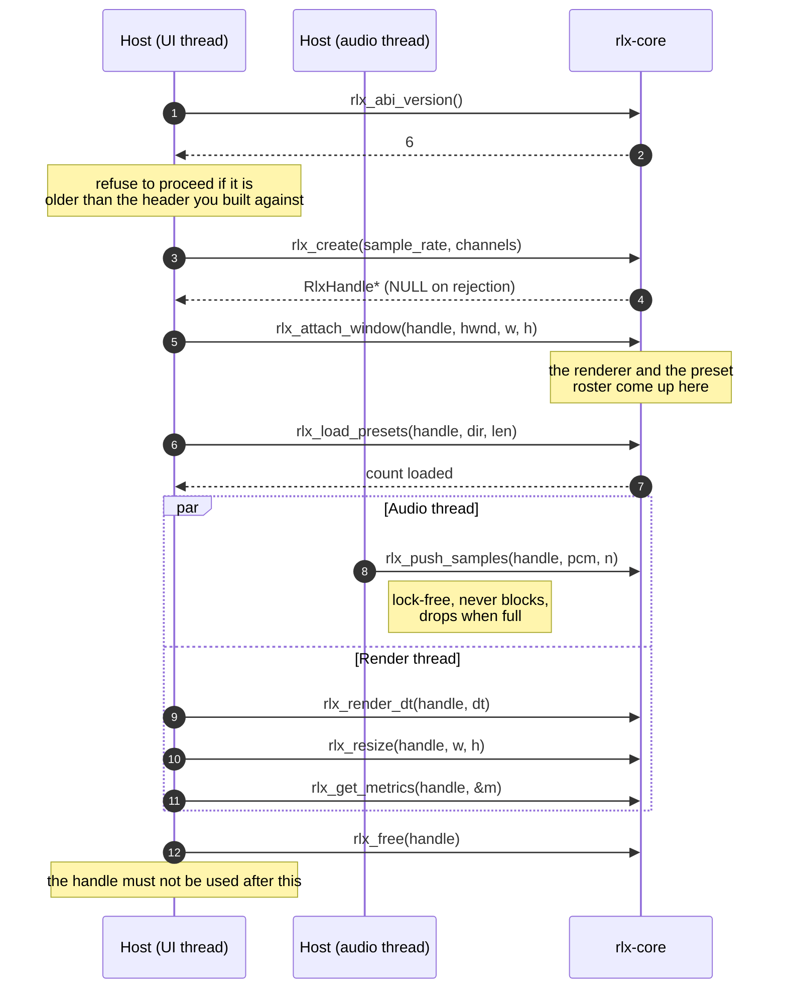

# Embedding the core

How to put the visualizer inside your own application. You give it PCM and a window; it gives you a
frame. Everything on this page goes through a small C ABI, so the host can be written in anything
that can call C.

The reference for every function is [the header itself](../core-cabi/include/rlx_core.h), published
verbatim. What the surface *must* do — the rules a host may rely on — is
[the C ABI contract](specs/0001-c-abi.md), and the threading half of it is
[Ring determinism](specs/0002-ring-determinism.md). This page is the walkthrough between them.

## What the ABI is, and what links it

The engine is a Rust library. `rlx-core-cabi` wraps it in an `extern "C"` surface and builds a
static or dynamic library plus one header, `rlx_core.h`. A host compiles against the header and
links the library; nothing about Rust reaches the host, and no allocation crosses the boundary in
either direction.

The foobar2000 component is exactly such a host — a C++ shim of a few hundred lines with no Rust in
it — and it is the working example this page describes in the abstract. Its source is
`plugin-foobar/viz_session.cpp` and `plugin-foobar/foo_ritmolux.cpp`.

## Two threads, and the contract between them

The host has an audio role and a render role, and they may run concurrently. That is the whole
threading model:

| Role | What it calls | Rules |
|---|---|---|
| **Audio** | `rlx_push_samples`, and nothing else | At most one thread at a time. The call is lock-free, allocates nothing, and never blocks; when the internal ring is full, excess samples are **dropped** rather than waiting |
| **Render / UI** | everything else | At most one thread at a time. `rlx_create` and `rlx_free` must not race any other call on the same handle |

**Push from the real audio callback and return.** That call is real-time safe by construction, which
is what lets you make it from a thread that must never block. Everything else must not be called
from there — `rlx_set_now_playing` copies its bytes, so it allocates, and belongs on the host's
playback or UI callback instead.

The two roles never synchronize with each other. Audio arrives at the device's cadence, frames
render at the display's, and a lock-free ring absorbs the difference — which also means a host that
stops rendering does not stall the audio thread.

## The lifecycle



**The order is not advice.** `rlx_attach_window` brings the renderer up, so the roster calls and
`rlx_render_dt` return `RLX_ERR_NO_WINDOW` before it. Push samples whenever you like — before the
window exists is fine, the ring is already there.

## A minimal host

**Illustrative, and not compiled by CI.** It is here to show the order and the shape; the compiled
host is the foobar shim. Every call it makes is in the header, and a test asserts that.

```c
#include "rlx_core.h"
#include <stdio.h>
#include <string.h>

/* Called from your audio thread. Real-time safe: no allocation, no blocking. */
static void on_audio(RlxHandle *rlx, const float *interleaved, uint32_t floats) {
    rlx_push_samples(rlx, interleaved, floats);
}

int host_main(void *hwnd, uint32_t width, uint32_t height, const char *preset_dir) {
    /* 1. Handshake. A core older than the header you compiled against may have
     *    moved a signature under you, so refuse rather than call into it. */
    if (rlx_abi_version() < RLX_ABI_VERSION) {
        fprintf(stderr, "rlx-core is ABI %u, this host needs >= %u\n",
                rlx_abi_version(), RLX_ABI_VERSION);
        return 1;
    }

    /* 2. One handle per PCM stream. NULL means the format was rejected. */
    RlxHandle *rlx = rlx_create(48000u, 2u);
    if (rlx == NULL) return 1;

    /* 3. The window. Nothing below works before this. */
    if (rlx_attach_window(rlx, hwnd, width, height) != RLX_OK) {
        rlx_free(rlx);
        return 1;
    }

    /* 4. Seed and load the preset directory. Idempotent; call it every start. */
    int32_t loaded = rlx_load_presets(rlx, (const uint8_t *)preset_dir,
                                      strlen(preset_dir));
    if (loaded < 0) fprintf(stderr, "presets: error %d\n", loaded);

    /* 5. Drive it at display cadence with your own measured elapsed time. */
    for (;;) {
        float dt = host_seconds_since_last_frame();
        int32_t rc = rlx_render_dt(rlx, dt);
        if (rc != RLX_OK) break;

        if (host_window_resized()) {
            rlx_resize(rlx, host_width(), host_height());
        }
        if (host_track_changed()) {
            const char *now = host_now_playing(); /* "artist - title" */
            rlx_set_now_playing(rlx, (const uint8_t *)now, strlen(now));
        }
        if (!host_pump_events()) break;
    }

    rlx_free(rlx);
    return 0;
}
```

`rlx_render` exists as a fixed-step wrapper for a host with no elapsed time to supply — it is
exactly `rlx_render_dt(handle, 1.0f / 60.0f)`. Prefer `rlx_render_dt` and pass your real frame
time: the core never reads a clock, so a feedback simulation runs at the same wall-clock rate on
any refresh only if you tell it how much time passed.

## The roster, and picking a preset

`rlx_load_presets` installs a set; `rlx_cycle_scene` advances through it. To build a menu instead,
read the roster and select by index.

`rlx_get_presets` writes every name into your buffer as UTF-8, one `0x00` after each, and returns
the total byte count. **Call it twice**: once with `buf_len = 0` to learn the size, then again with
a buffer that big. A buffer that is too small has **nothing** written into it — a short buffer never
yields a partial list — and no allocation crosses the ABI in either direction.

```c
int32_t need = rlx_get_presets(rlx, NULL, 0, NULL);
if (need > 0) {
    uint8_t *names = host_alloc((size_t)need);
    int32_t current = -1;
    if (rlx_get_presets(rlx, names, (size_t)need, &current) == need) {
        /* names is "First\0Second\0Third\0"; current indexes the one the show
         * is GOING to - the dissolve's target while a transition is running. */
    }
    host_free(names);
}
rlx_select_preset(rlx, chosen_index);
```

**An index is snapshot-scoped, not an identity.** It is a position in the list *this same handle*
just reported, with no `rlx_load_presets` in between. A host that remembers a choice across runs
stores the **name** and re-resolves it against a fresh snapshot.

## Metrics

`rlx_get_metrics` fills a caller-allocated `RlxMetrics` with frames per second, average and p99
frame time, frame and drop counts, core-tracked GPU bytes and last-frame draw calls. It is cheap
enough to poll every frame.

The struct leads with `struct_size` and `abi_version`, and **you must set `struct_size` to
`sizeof(RlxMetrics)` before calling**. The core writes at most that many bytes and stamps what it
actually wrote, which is how later fields can be appended without a version bump: an old host
against a new core gets the prefix it knows about.

Process memory is deliberately not in there. It belongs to the host process, so each host reads its
own.

## Error codes, and what each means to you

Every call but `rlx_create` and `rlx_free` returns `int32_t`: `RLX_OK` is `0`, failures are
negative, and `rlx_load_presets` and `rlx_get_presets` return a non-negative count on success.

| Code | What happened | What a host should do |
|---|---|---|
| `RLX_OK` | Success | — |
| `RLX_ERR_INVALID_ARG` | A null handle or pointer, a zero length, a non-UTF-8 path, an index outside the roster | A bug in the host. Nothing changed on the core side |
| `RLX_ERR_FORMAT` | The samples do not match what the handle was created with — `sample_count` is not a whole number of frames | Fix the push, or create a handle for the real format |
| `RLX_ERR_RENDER` | The frame could not be drawn | Recoverable in principle; a host that sees it repeatedly should tear the handle down |
| `RLX_ERR_NO_WINDOW` | Called before `rlx_attach_window` | Attach first. This is the usual first-run mistake |
| `RLX_ERR_PANIC` | A Rust panic was caught at the boundary | Not recoverable. A panic must never unwind across the ABI, so it is turned into this code instead; free the handle |
| `RLX_ERR_UNSUPPORTED` | The operation is not available in this build | Feature-detect rather than assume |

## What the real host does

`plugin-foobar/` is the reference implementation and worth reading beside this page. Four things it
does that the sketch above skips:

- **The handshake is `>=`, not `==`.** A newer core is fine, because `rlx_get_metrics` is
  size-guarded and the older functions are stable; the shim disables preset loading and diagnostics
  rather than refusing to run when the core is older.
- **It resolves the preset directory itself**, in C++, to the same per-user path the standalone
  application uses — so a preset edited in either shows up in both.
- **It pushes from foobar's `visualisation_stream`**, which is exactly the audio role above, and
  calls `rlx_set_now_playing` from the playback callback instead.
- **It frees the handle exactly once**, on window destroy, whichever of its two windows owned the
  session.

## What this costs

The library is on the order of ten megabytes and the numbers are tracked at each release; the size
series and the cap live in [the C ABI contract](specs/0001-c-abi.md), not here, so a correction has
one place to land.
