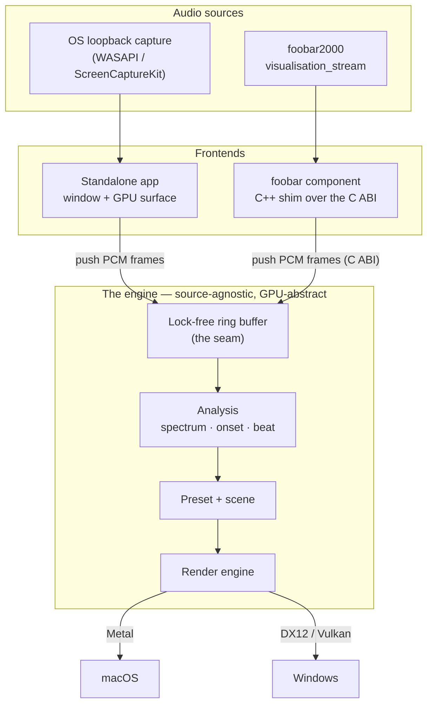

# How it works

What happens between a sound leaving your speakers and a shape moving on your screen. Written for
someone who wants to understand the machine rather than change it — nothing here is required to use
the application or to write a preset.

## Two frontends, one brain

Ritmolux is one rendering engine with two ways of being fed. The standalone application taps
whatever your machine is playing; the foobar2000 component is handed samples by the player it lives
inside. Neither of those facts reaches the engine: it takes a stream of PCM frames and does not know
where they came from, which is the single abstraction that lets one visual codebase serve both.



The seam between audio and picture is that **lock-free ring buffer**. Audio arrives at the sound
device's cadence and frames render at the display's, and neither loop drives the other: the
capture side writes and returns immediately, the render side reads whatever is there. That is not
a performance tweak. A capture callback that waits for anything — a lock, an allocation, a log
line — produces an audible click, so the rule is that it does none of those and hands the samples
over in constant time. The contract is written out in
[Ring determinism](specs/0002-ring-determinism.md).

Embedding the engine in something else is the same picture with your own code where the two
frontends are, and [the C ABI contract](specs/0001-c-abi.md) is what that seam is held to.

## What happens each frame

```mermaid
flowchart LR
    subgraph shell["Frontend"]
        pcm["PCM frames"]
    end

    subgraph seam["The seam"]
        ring["Ring buffer<br/>SPSC, never blocks"]
    end

    subgraph analysis["Analysis"]
        fft["Two FFT windows<br/>2048 transient · 8192 low band"]
        bands["Bands + onset<br/>normalized against their own peak"]
        clock["Beat and bar clock"]
    end

    subgraph preset["Preset engine"]
        vars["Variables<br/>bass mid treb onset beat bar time tempo …"]
        expr["Expressions<br/>one value per named parameter"]
    end

    subgraph renderer["Renderer"]
        scene["Scene"]
        chain["background → scene → trails →<br/>kaleidoscope → transition → ink"]
        present["Present"]
    end

    pcm --> ring --> fft --> bands --> clock --> vars --> expr --> scene --> chain --> present
```



### The samples arrive

The frontend hands over interleaved PCM at whatever rate the device runs. Sample rate, channel
count and buffer size are checked **once**, where audio enters the engine; everything downstream
assumes they are valid, because a hot path that re-validates is a hot path that is doing the wrong
work.

### The spectrum

Analysis runs on a **hop** — a fixed step through the stream, 512 samples at 48 kHz — rather than
per frame, so what a preset reads does not change with your display's refresh rate.

Two windows run, not one. A **2048-sample** window feeds everything time-sensitive: onset, beat,
tempo, and the mid and treble bands. An **8192-sample** window feeds only the bands below about
246 Hz, because a 23.4 Hz bin cannot tell a kick drum from a bass note. The cost is honest and
unpaid-for: the long window delays the low bands by about 85 ms. That is the physics of a window
that long, and it is accepted rather than compensated away — the beat-to-reaction path never
touches it, so [the 60 ms latency budget](nfr.md#3-latency--audio-to-visual) is unaffected.

### The levels, and why they are ratios

`bass`, `mid`, `treb` and `onset` are each divided by **their own slowly-decaying running peak**,
with a silence floor so a quiet room reads `0` rather than amplified noise. So `bass > 0.5` means
"loud for this track" on every track, at every gain setting — which is what makes a threshold
written into a preset portable at all.

The cost is deliberate: absolute dynamics are hidden. A quiet passage and a loud one both reach
`1.0` on their own peaks. Where a preset genuinely needs the absolute figure, `bass_raw` and its
three siblings carry it, un-normalized and small.

### The beat and the bar

Onset detection is spectral flux: how much the spectrum *changed* since the last hop. It spikes on
attacks rather than on loudness, so a sustained note does not fire it and a muted hit does.

A tempo tracker turns those onsets into a BPM estimate and a **beat phase** — `0` on each beat,
ramping to `1` before the next. Above that sits a bar clock: which beat of the bar you are on, how
far through the bar, how many bars have passed. **Onsets are not beats.** The detector fires
between 1.2 and 2.3 times per beat depending on material, which is why `beat_index` is a ratchet
and not a meter, and why `bar_phase` exists separately.

### The variables, and the expressions

Everything above arrives at the preset as a set of about two dozen read-only variables — the four
levels, their raw twins, the beat gate, the clocks, the tempo, plus a few that carry *position*
rather than sound. A preset binds a named parameter of a rendering system to a short expression
over them:

```toml
[params]
warp = "0.4 + bass * 0.6"
hue  = "time * 0.05 + onset * 0.2"
```

Those expressions are compiled once when the preset loads and evaluated once per frame. The
grammar — the functions, `select()`, what a bad expression reports — is
[the expression language](presets.md), and every parameter every system takes is in
[the parameter roster](../presets/README.md).

### The scene, and the chain behind it

A preset names one **rendering system** — a particle swarm, a parametric curve, a fragment field, a
reaction-diffusion lattice, and so on — and that system draws the frame. It never draws straight to
the screen. Every scene rides a shared composite chain:

**background → scene → trails → kaleidoscope → transition → ink → present**

A background pre-pass, the scene itself, feedback trails that hold a decaying copy of previous
frames, a screen-space kaleidoscope fold, a two-input dissolve that crossfades between the outgoing
preset and the incoming one, and a terminal ink tone-remap. A new rendering system inherits all of
it — including dissolving into and out of every other preset — for free.

The stages are parameters like any other, so a preset tunes them by name. The
[technique catalogue](generative-techniques-catalogue.md) is the survey the scene families came
out of.

### Present

The frame goes to the display through the graphics abstraction — Metal on macOS, DX12 or Vulkan on
Windows. Nothing in a scene knows which; that is the point of writing to one abstraction, and it is
[the founding decision](adrs/0001-rust-core-wgpu-cabi-foobar-shim.md).

## Quality tiers

The engine renders at one of two tiers. `rich` is the full chain at full internal resolution;
`floor` is the same chain sized for an integrated GPU. Unpinned, the app starts on `rich` and a
frame-time governor demotes it **once** if the display's frame budget is not being held; a tier you
pin is never demoted. What each tier is held to numerically is in
[Non-functional requirements](nfr.md#1-performance--adaptive-quality), and how to pin one is in
[Configuration](configuration.md#quality).

An internal render target is a **resolution, not a shape**: it is quantized and capped, so its
aspect ratio is not the window's. Anything computing screen-destined geometry takes its aspect from
the window, which is why a preset looks the same on a 16:10 laptop as on a 16:9 projector.

## What is deterministic, and what is not

The analysis is a pure function of the samples it was given. The same audio produces the same
spectrum, the same onset envelope and the same beat estimate, every run, on every machine — there
is no wall-clock read and no unseeded randomness anywhere in it. That is what makes the headless
[capture harness](capturing.md) able to assert things about a picture at all.

Visual randomness exists — a particle spray, a jitter — and it is explicitly seeded, so a scene
replays identically. What is *not* deterministic is the frame cadence: how many frames land between
two hops depends on your display and your GPU, and a preset that assumed otherwise would look
different on a 144 Hz monitor. This is why `time` is a scene clock in seconds rather than a frame
counter.
