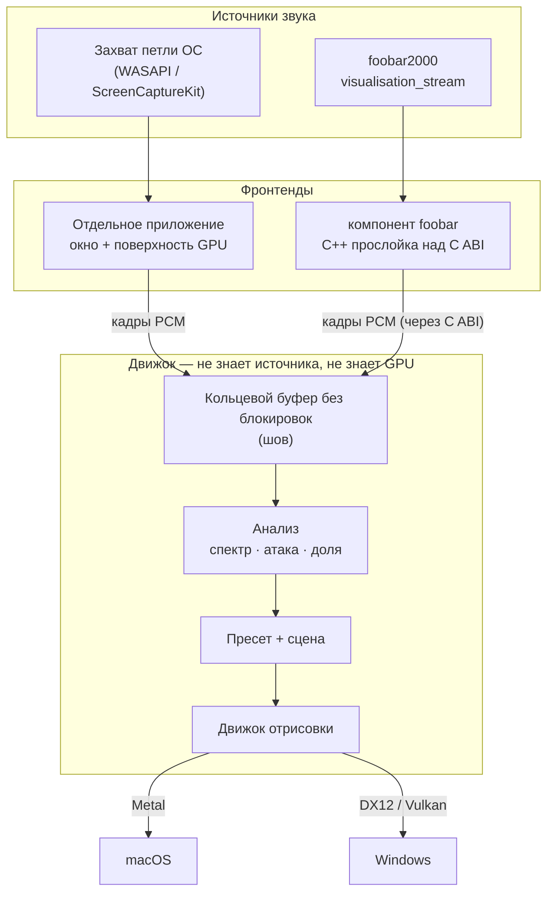

<!-- translated-from: 1ad9c6f8 -->
# Как это устроено

Что происходит между звуком, вышедшим из колонок, и фигурой, сдвинувшейся на экране. Написано для
того, кто хочет понять машину, а не изменить её, — ничто отсюда не требуется, чтобы пользоваться
приложением или писать пресет.

## Два фронтенда, один мозг

Ritmolux — это один движок отрисовки с двумя способами его кормить. Отдельное приложение снимает
то, что играет на машине; компоненту для foobar2000 сэмплы передаёт проигрыватель, внутри которого
он живёт. Ни то, ни другое до движка не доходит: он принимает поток PCM-кадров и не знает, откуда
они взялись, — и это та самая единственная абстракция, благодаря которой один визуальный код
обслуживает оба.



Шов между звуком и картинкой — это **кольцевой буфер без блокировок**. Звук приходит в темпе
звуковой карты, кадры рисуются в темпе дисплея, и ни один цикл не ведёт другой: сторона захвата
пишет и немедленно возвращается, сторона отрисовки читает то, что есть. Это не оптимизация.
Обратный вызов захвата, который чего-нибудь ждёт — блокировки, выделения памяти, строки в журнал, —
даёт слышимый щелчок, поэтому правило такое: он не делает ничего из этого и передаёт сэмплы за
постоянное время. Контракт выписан в [Ring determinism](specs/0002-ring-determinism.md).

Встроить движок во что-то своё — это та же картинка, где вместо двух фронтендов стоит ваш код;
[Embedding the core](embedding.md) проходит этот путь, а
[контракт C ABI](specs/0001-c-abi.md) — то, чем этот шов держится.

## Что происходит за кадр

```mermaid
flowchart LR
    subgraph shell["Фронтенд"]
        pcm["Кадры PCM"]
    end

    subgraph seam["Шов"]
        ring["Кольцевой буфер<br/>SPSC, никогда не блокирует"]
    end

    subgraph analysis["Анализ"]
        fft["Два окна БПФ<br/>2048 переходные · 8192 низ"]
        bands["Полосы + атака<br/>нормированы по своему пику"]
        clock["Часы доли и такта"]
    end

    subgraph preset["Движок пресета"]
        vars["Переменные<br/>bass mid treb onset beat bar time tempo …"]
        expr["Выражения<br/>одно значение на именованный параметр"]
    end

    subgraph renderer["Отрисовка"]
        scene["Сцена"]
        chain["фон → сцена → следы →<br/>калейдоскоп → переход → тон"]
        present["Показ"]
    end

    pcm --> ring --> fft --> bands --> clock --> vars --> expr --> scene --> chain --> present
```



### Сэмплы приходят

Фронтенд передаёт чередующийся PCM с той частотой, на которой работает устройство. Частота
дискретизации, число каналов и размер буфера проверяются **один раз**, там, где звук входит в
движок; всё ниже по потоку считает их верными, потому что горячий путь, который перепроверяет, —
это горячий путь, занятый не тем.

### Спектр

Анализ идёт по **шагу** — фиксированному шагу по потоку, 512 сэмплов при 48 кГц, — а не по кадрам,
поэтому то, что читает пресет, не зависит от частоты обновления вашего дисплея.

Окон работает два, а не одно. Окно в **2048 сэмплов** кормит всё, что чувствительно ко времени:
атаку, долю, темп, а также средние и высокие полосы. Окно в **8192 сэмпла** кормит только полосы
ниже примерно 246 Гц, потому что бин шириной 23,4 Гц не отличит бочку от басовой ноты. Цена честная
и не оплачена: длинное окно задерживает нижние полосы примерно на 85 мс. Это физика окна такой
длины, и её принимают, а не компенсируют, — путь от доли до реакции его не касается вовсе, так что
[бюджет задержки в 60 мс](nfr.md#3-latency--audio-to-visual) не страдает.

### Уровни, и почему это отношения

`bass`, `mid`, `treb` и `onset` каждый делится на **свой собственный медленно спадающий текущий
пик**, с порогом тишины, чтобы тихая комната читалась как `0`, а не как усиленный шум. Поэтому
`bass > 0.5` означает «громко для этого трека» на любом треке и при любой громкости — именно это и
делает порог, записанный в пресет, переносимым.

Цена намеренная: абсолютная динамика скрыта. И тихий отрывок, и громкий доходят до `1.0` каждый по
своему пику. Там, где пресету действительно нужна абсолютная величина, её несут `bass_raw` и три
его собрата — ненормированные и маленькие.

### Доля и такт

Обнаружение атаки — это спектральный поток: насколько спектр *изменился* с прошлого шага. Он
всплескивает на атаках, а не на громкости, поэтому тянущаяся нота его не запускает, а приглушённый
удар — запускает.

Трекер темпа превращает эти атаки в оценку BPM и **фазу доли** — `0` на каждой доле, нарастающая до
`1` перед следующей. Над этим стоят часы такта: на какой доле такта вы находитесь, насколько такт
пройден, сколько тактов прошло. **Атаки — это не доли.** Детектор срабатывает от 1,2 до 2,3 раза за
долю в зависимости от материала — поэтому `beat_index` это храповик, а не счётчик, и поэтому
`bar_phase` существует отдельно.

### Переменные и выражения

Всё вышеописанное приходит в пресет набором из примерно двух десятков переменных только для чтения
— четыре уровня, их сырые двойники, ворота доли, часы, темп плюс несколько таких, что несут
*положение*, а не звук. Пресет привязывает именованный параметр системы отрисовки к короткому
выражению над ними:

```toml
[params]
warp = "0.4 + bass * 0.6"
hue  = "time * 0.05 + onset * 0.2"
```

Эти выражения компилируются один раз при загрузке пресета и вычисляются раз в кадр. Грамматика —
функции, `select()`, что сообщается о плохом выражении — это
[язык выражений](presets.md), а каждый параметр каждой системы есть в
[справочнике параметров](../presets/README.md).

### Сцена и цепочка за ней

Пресет называет одну **систему отрисовки** — рой частиц, параметрическую кривую, фрагментное поле,
решётку реакции-диффузии и так далее, — и эта система рисует кадр. Прямо на экран она не рисует
никогда. Каждая сцена едет по общей составной цепочке:

**фон → сцена → следы → калейдоскоп → переход → тон → показ**

Предварительный проход фона, сама сцена, следы обратной связи, хранящие затухающую копию прошлых
кадров, экранный калейдоскопический сгиб, переход на два входа, который смешивает уходящий пресет с
приходящим, и завершающее тональное отображение. Новая система отрисовки получает всё это даром —
включая переходы в любой другой пресет и обратно.

Стадии — такие же параметры, как все прочие, поэтому пресет настраивает их по имени.
[Каталог техник](generative-techniques-catalogue.md) — тот обзор, из которого вышли семейства сцен.

### Показ

Кадр попадает на дисплей через графическую абстракцию — Metal в macOS, DX12 или Vulkan в Windows.
Ни одна сцена не знает, какая именно; в этом и смысл писать под одну абстракцию, и это
[основополагающее решение](adrs/0001-rust-core-wgpu-cabi-foobar-shim.md).

## Уровни качества

Движок рисует на одном из двух уровней. `rich` — это полная цепочка в полном внутреннем разрешении;
`floor` — та же цепочка, рассчитанная на встроенную видеокарту. Если уровень не закреплён,
приложение стартует на `rich`, а регулятор времени кадра **один раз** понижает его, если бюджет
кадра дисплея не выдерживается; закреплённый уровень не понижается никогда. Чем каждый уровень
держат численно — в [Non-functional requirements](nfr.md#1-performance--adaptive-quality), а как
закрепить — в [Configuration](configuration.md#quality).

Внутренняя цель отрисовки — это **разрешение, а не форма**: она квантуется и ограничивается
сверху, поэтому её соотношение сторон не равно оконному. Всё, что считает геометрию, идущую на
экран, берёт соотношение сторон у окна — поэтому пресет выглядит одинаково на ноутбуке 16:10 и на
проекторе 16:9.

## Что детерминировано, а что нет

Анализ — чистая функция от поданных ему сэмплов. Один и тот же звук даёт один и тот же спектр, ту
же огибающую атак и ту же оценку доли, в каждом прогоне и на любой машине: ни чтения системных
часов, ни незасеянной случайности внутри него нет. Именно это и позволяет безоконной
[оснастке захвата](capturing.md) вообще что-то утверждать о картинке.

Визуальная случайность есть — брызги частиц, дрожание — и она явно засеяна, поэтому сцена
воспроизводится один в один. Что *не* детерминировано, так это темп кадров: сколько кадров ляжет
между двумя шагами анализа, зависит от вашего дисплея и вашей видеокарты, и пресет, положившийся на
обратное, выглядел бы иначе на мониторе 144 Гц. Поэтому `time` — это часы сцены в секундах, а не
счётчик кадров.
