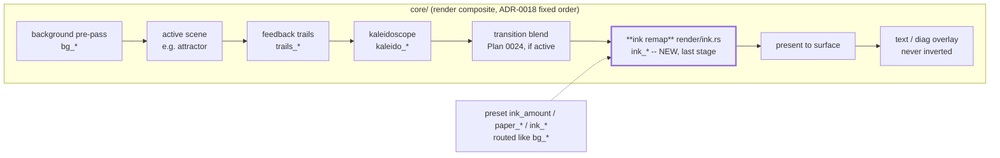

# 0027 — Attractor ink-on-paper + crisp trails (final-stage ink remap + trail resolution)

> **Status:** approved
> **Created:** 2026-07-24
> **Owner skill(s):** dev
> **Related ADRs:** [0028](../adrs/0028-final-stage-ink-tone-remap.md) (new, proposed); extends
> [0018](../adrs/0018-engine-wide-scene-compositing.md); coordinates with
> [0024](../adrs/0024-cross-preset-transitions.md); sequenced after Plans
> [0020](0020-shared-palette-system.md) and [0025](0025-full-composite-coverage.md).

## TL;DR

Deliver the "ink on paper" attractor look — a white background with black moving lines — plus a
sharper attractor. A new **final-stage duotone tone-remap** (`render/ink.rs`) maps the composited
frame's brightness between a preset-configurable `paper` and `ink` color (default white/black = a
pure invert), giving *every* scene an engine-wide black-on-white / colored-duotone mode via bindable
`ink_*` params. A second phase replaces the attractor's fixed **640x360** trail field with a
surface-tied internal resolution so it stops looking soft on a 1080p+ display. Core-only, C ABI
untouched, no new dependency, no `Scene`-trait change.

## Context & problem

The `preset-author` lane could not author a De Jong attractor as ink-on-paper (feedback note,
2026-07-24). Two engine facts block it, both verified against
`core/src/render/scenes/particles/mod.rs`:

1. **Tone.** The attractor (and swarm, and line scenes) draw with **additive** blend — a lightening
   model that only shows bright marks on a dark base. Dark strokes add nothing; strokes over a light
   background wash to white. "Black on white" is the inverse of the compositing model, unreachable by
   any color param. Plan 0025 gives a white *background* (alpha-present over the backdrop) and Plan
   0020 gives arbitrary stroke *colors*, but neither adds a **darkening** step, so neither yields dark
   strokes. See [ADR-0028](../adrs/0028-final-stage-ink-tone-remap.md) for the full analysis.
2. **Resolution.** Trails accumulate in a hardcoded `TRAIL_W = 640, TRAIL_H = 360` field, then upscale
   to the surface with linear filtering — that stretch is the softness. It is a `const`, not a param.
   (Same limitation the Plan 0016 close flagged as a minor, and Plan 0018 as a trails/kaleidoscope
   carry-forward.)

## Decision

Add one **engine-wide final composite stage** that duotone-remaps the finished frame (ADR-0028), and
**tie the attractor trail resolution to the surface**. We rejected a per-scene darkening blend (does
not compose with the trails/kaleidoscope/transition post-chain), a boolean-only invert (the user
wants arbitrary paper/ink colors), and doing nothing on 0025+0020 (yields a white background but never
dark strokes) — see ADR-0028 Alternatives. The remap is a skippable post-stage in the ADR-0018 fixed
composite, routed by `ink_*` named params exactly as `bg_*` are, passthrough when `ink_amount <= 0`, so
the default engine and shipped presets stay byte-identical. Bundled into one plan at user direction
(crisp + ink together); **hard-sequenced after Plans 0020 and 0025** because all three touch the
attractor present/draw path — landing after them lets ink ride on the LUT-colored, alpha-composited
output instead of rebasing across their shader edits.

## Architecture diagram



## Implementation phases

### Phase 1 — Final-stage ink tone-remap (engine-wide)
- **Owner skill:** dev
- **What:** A new skippable composite stage `core/src/render/ink.rs` that remaps the composited frame
  to `mix(paper, ink, luminance)`, driven by `ink_*` named params routed by the renderer like `bg_*`.
- **Files touched:** `core/src/render/ink.rs` (new), `core/src/render/mod.rs` (route `ink_*`, insert the
  stage last in the composite + fold-to-surface wiring), `core/tests/hygiene.rs` (add `ink.rs` to the
  hot-path pragma scan set).
- **Done when:** A preset with `ink_amount = 1` (default `paper`/`ink`) renders the attractor — and any
  scene (fragment, swarm, lines, RD) — as **black marks on a white field**; setting `paper_*`/`ink_*`
  produces a colored duotone (e.g. indigo-on-cream); `ink_amount = 0` is a **byte-identical passthrough**
  (existing golden fixtures unchanged, verified on WARP); the new file carries the `#![deny(clippy::...)]`
  hot-path pragma and is in the hygiene scan set; `clippy -p lmv-core --all-targets -D warnings` clean.

### Phase 2 — Attractor trail resolution tied to the surface
- **Owner skill:** dev
- **What:** Replace the fixed `TRAIL_W/TRAIL_H` (640x360) accumulation field with an internal resolution
  derived from the surface size, capped for the NFR §1 fill budget, deterministic under a fixed capture
  size.
- **Files touched:** `core/src/render/scenes/particles/mod.rs` (resolution derivation + lazy field
  (re)build on surface resize), `core/tests/golden.rs` / attractor fixture baseline (re-bless).
- **Done when:** the attractor renders visibly sharp at 1080p (no soft upscale from 640x360); a headless
  capture at a fixed `--size` is deterministic (byte-identical recapture, NFR §6); the attractor golden
  baseline is re-blessed on WARP with a one-line note that the resolution change is the cause; a code
  comment records the capped-surface-resolution choice and its NFR §1 fill tradeoff.

### Phase 3 — Curated ink preset + authoring docs
- **Owner skill:** dev
- **What:** Embed an ink-on-paper De Jong preset (the originating look) and document the `ink_*` params +
  the resolution behavior for authors.
- **Files touched:** `presets/attractor_ink.toml` (new; embedded automatically via the Plan 0021 build
  script), `presets/README.md` (document `ink_amount`/`paper_*`/`ink_*` and the palette-collapses-to-
  duotone interaction).
- **Done when:** `shot --preset "<ink preset>" --set bass=1,...` renders a black-on-white De Jong; the
  preset is in the embedded set (structural count assert green, no number to bump per Plan 0021); the
  README documents every new param and notes that in ink mode a scene's palette hue collapses to a
  luminance-keyed duotone.

## Data shapes

New layer-2 named params (all scalar, preset-bindable, mirroring the `bg_*` hue/bright convention with
saturation added so a neutral white/black is expressible). Defaults chosen so `ink_amount = 1` alone
gives a pure black-on-white invert:

| Param | Default | Meaning |
|-------|---------|---------|
| `ink_amount` | `0.0` | 0 = off (passthrough); 1 = full remap. Bindable (e.g. `beat`). |
| `paper_hue` | `0.0` | Paper (density 0) hue. |
| `paper_sat` | `0.0` | Paper saturation (0 = neutral -> true white with `paper_bright = 1`). |
| `paper_bright` | `1.0` | Paper brightness (1 = white). |
| `ink_hue` | `0.0` | Ink (density 1) hue. |
| `ink_sat` | `0.0` | Ink saturation (0 = neutral -> true black with `ink_bright = 0`). |
| `ink_bright` | `0.0` | Ink brightness (0 = black). |

```rust
// illustrative — not the final interface
struct InkUniform {
    paper: [f32; 4],   // rgb + unused; from paper_hue/sat/bright
    ink: [f32; 4],     // rgb + unused; from ink_hue/sat/bright
    amount: [f32; 4],  // x = ink_amount, rest pad
}
// fragment: let d = luminance(sample); out = mix(paper, mix(sample, mix(paper, ink, d), amount), ... )
// with amount gating passthrough (amount=0 => sample unchanged).
```

## Risks & open questions

- **NFR §1 fill (iGPU 60 fps @ 1080p).** Ink adds one full-frame offscreen + pass *while on*; Phase 2
  raises attractor fill by ~(surface/640x360). Both are the flagged tradeoff. Mitigation: ink is fully
  skipped when off; cap Phase 2's internal resolution (e.g. at 1080p). On-device confirmation is the
  standing `docs/on-device-validation.md` carry-forward, non-blocking.
- **Palette vs. ink interaction (0020).** In ink mode the luminance key collapses a scene's hue to a
  duotone — documented in Phase 3, not hidden. Open question deferred to a follow-up: an `ink_tint`
  knob to bleed the underlying color into the ink (out of scope here).
- **Ordering vs. Plan 0024 transitions.** Ink must remap the *blended* frame, so it sits after the
  transition blend. Whichever of 0024/0027 lands second wires the order; if 0024 is not yet in, ink is
  simply the last stage.
- **Determinism / golden re-bless.** Phase 2 changes the attractor's rendered pixels, so its golden
  baseline is re-blessed (expected, noted). Ink params are pure; capture at a fixed size stays
  deterministic.
- **HSV-to-RGB in-shader.** Small, standard; keep it allocation-free and in the fragment shader (no CPU
  color math per frame).

## What this plan does NOT do

- **No per-scene blend-mode change** — the additive draw pipelines are untouched; inversion is a final
  remap only (ADR-0028 Alternative A rejected).
- **No `ink_tint` / color-preserving ink** — duotone only; colored-glow-preserving inversion is a
  possible follow-up.
- **No engine-wide internal-resolution system** — Phase 2 sharpens the *attractor* only; the shared
  RD/trails/kaleidoscope fixed-resolution limitation is left as a separate future decision.
- **No C ABI or `Scene`-trait change**, no new dependency, no new DSP.
- **Does not re-open Plans 0020/0025** — it sequences after them and composes with their output.

## Followups (after this lands)

- Consider an `ink_tint` param (bleed underlying scene color into the ink pole) if duotone proves too
  flat for colored looks.
- Consider generalizing Phase 2 into a shared internal-resolution scale for the RD / trails /
  kaleidoscope fixed-16:9 presents (their common documented limitation).
- `preset-author` follow-up: author colored-duotone looks (cream/indigo, sepia) once the stage lands.
