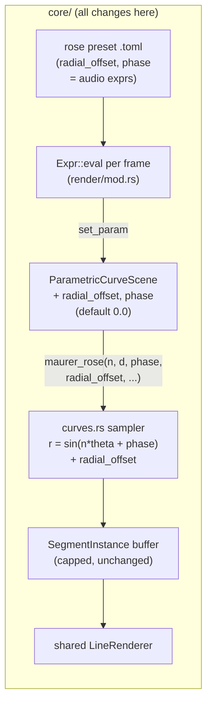

# 0028 — Parametric-curve shape params: radial offset + phase (audio-morphable rose geometry)

> **Status:** approved
> **Created:** 2026-07-24
> **Owner skill(s):** dev
> **Related ADRs:** [0029-parametric-curve-shape-params](../adrs/0029-parametric-curve-shape-params.md), supplements [0007-line-geometry-generators](../adrs/0007-line-geometry-generators.md)
> **Sequencing:** land **after Plan 0020** (shared palette). This is a **priority** sequencing, not a technical dependency — 0028 touches only the Maurer sampler (`curves.rs`/`parametric.rs`) and 0020 only color/shaders, so they never rebase across each other; the user's call (2026-07-24) is to land the color axis first so preset-author gets both color and shape levers together when revising the rose drafts.

## TL;DR

Add two named per-frame shape parameters to the `parametric_curve` scene — `radial_offset`
(added to the curve radius) and `phase` (added inside the sine) — so the Maurer sampler becomes
`r = sin(n·θ + phase) + radial_offset`. Both default to `0.0`, so every shipped rose preset and
the golden fixture are byte-identical. This unlocks the reference's spiral/rosette/annular
shape family and phase-morph as **preset-bindable, audio-driven levers** — the shape itself
morphs with `bass`/`bar`/`beat` (and, once Plan 0019 lands, `tempo`), not just its color. Core-
only, one `set_param`-path change, allocation-free/panic-free per frame; no `Scene`-trait change,
no C ABI change, no new dependency.

## Context & problem

The `preset-author` lane showed (2026-07-24, drafts `rose_maurer_sweep`/`rose_overflow`/
`rose_beat_bloom` in `presets/`) that a Maurer rose's *shape* is already live-morphable from a
preset — `n`/`d`/`samples`/`scale` are per-frame expressions. But two shape levers from the
reference (`github.com/IgorKonovalov/Maurer_Rose`) are unreachable because the sampler lacks them:

- **Radial offset** (`gg` in the reference: `r = sin(k·φ)·size + gg`). The additive term opens
  the rose off the origin into spirals/annuli/rosettes — the reference's most dramatic lever. Our
  `maurer_rose()` (`core/src/render/scenes/lines/curves.rs:30`) has `let r = (n * theta).sin();`
  with no offset.
- **Phase** (`rotate` in the reference, *inside* the sine). Distinct from our `spin`, which is a
  2-D screen-space rotation of the finished figure (`rot_sin`/`rot_cos` in the same sampler); a
  phase inside `sin(n·θ + phase)` reshapes the petal structure as it advances.

The design fork (named params vs. new `CurveFamily` variants vs. a general superformula) and the
zero-default backward-safety are recorded in [ADR-0029](../adrs/0029-parametric-curve-shape-params.md).
The hard constraint is **hot-path safety**: `curves.rs` and `parametric.rs` carry the panic-denial
pragma and the sampler runs every frame — the additions must be total, allocation-free, and
introduce no indexing/division (they are pure `f32` adds, so this holds trivially).

## Decision

Implement ADR-0029: two `f32` shape params (`radial_offset`, `phase`) on `ParametricCurveScene`,
threaded through the existing `reset_params`/`set_param`/`DEFAULT_*` machinery and passed into an
extended `maurer_rose(...)` sampler, defaulting to `0.0` (no-op). We rejected new `CurveFamily`
variants (a family is a fixed load-time choice, not a per-frame lever — can't morph with audio)
and a general superformula (a sampler rewrite with ~5 params and `NaN`-guarded exponents, more
than the routed need). Core-only; C ABI and the `Scene` trait untouched.

## Architecture diagram



## Implementation phases

One implementation phase: the two params are the same shape (an `f32` add in the same two files)
and ship as one coherent commit. A second phase covers the doc sync so the authoring reference
describes the finished surface.

### Phase 1 — Add `radial_offset` + `phase` to the parametric-curve scene and sampler
- **Owner skill:** dev
- **What:** Thread two new zero-defaulted shape params from `set_param` into an extended Maurer
  sampler, so `r = sin(n·θ + phase) + radial_offset`.
- **Files touched:** `core/src/render/scenes/lines/curves.rs` (the `maurer_rose` sampler + its
  unit tests), `core/src/render/scenes/lines/parametric.rs` (fields, `DEFAULT_PHASE`/
  `DEFAULT_RADIAL_OFFSET` consts = `0.0`, `reset_params`, the `set_param` match arms, and the
  `maurer_rose(...)` call in `update`).
- **Details:**
  - `parametric.rs`: add `phase: f32` and `radial_offset: f32` fields; `DEFAULT_PHASE = 0.0`,
    `DEFAULT_RADIAL_OFFSET = 0.0`; init in `new`, restore in `reset_params`, and add
    `"phase" => self.phase = value,` / `"radial_offset" => self.radial_offset = value,` arms to
    `set_param` (before the `_ => {}` catch-all). Pass both into the `maurer_rose(...)` call.
  - `curves.rs`: extend the signature — new `phase: f32` and `radial_offset: f32` args (place
    `phase` next to the frequency inputs and `radial_offset` next to `scale`, i.e. group by
    role). In the `point` closure: `let r = (n * theta + phase).sin() + radial_offset;`. Nothing
    else changes — the `rotate`/`scale`/`draw_progress` handling is untouched. Update the
    doc-comment to state the new `r` formula and that both default to a no-op.
  - Hot-path: both are pure adds — no indexing, no division, no allocation; the file's
    `#![deny(clippy::…)]` pragma stays satisfied.
- **Done when:**
  - `maurer_rose(...)` with `phase = 0.0, radial_offset = 0.0` produces **byte-identical**
    segments to the pre-change sampler on the existing test inputs (a test pins this — the
    zero-default no-op property, which is also why no golden re-bless is needed).
  - A nonzero `radial_offset` shifts every sampled radius by that constant (a test asserting a
    known point's distance-from-origin moves by `radial_offset` versus the zero case), and a
    nonzero `phase` changes the geometry (segments differ from the zero-phase curve).
  - A preset binding `radial_offset`/`phase` to expressions compiles, and those params reach the
    scene (drive them via `capture_preset` with a stimulus and confirm the frame differs from the
    zero-bound baseline — reuses the Plan 0013 harness).
  - The `parametric_curve` golden fixture (`core/tests/golden.rs` / `fixtures/`) is unchanged
    (no re-bless); `cargo test -p lmv-core` green; `clippy -p lmv-core --all-targets -D warnings`
    clean; the `curves.rs`/`parametric.rs` panic pragmas intact (hygiene guard green).

### Phase 2 — Document the two params in the authoring reference
- **Owner skill:** dev
- **What:** Add `radial_offset` and `phase` to the `parametric_curve` param table with the
  "out of bounds is intended" note.
- **Files touched:** `docs/presets.md` (the `parametric_curve` section), and `presets/README.md`
  if it enumerates per-scene params.
- **Details:** Document `radial_offset` (default `0.0`; adds to the radius; nonzero opens the
  rose off-origin into spiral/annular/rosette forms; large values push geometry past the frame —
  the intended blowout look), and `phase` (default `0.0`; radians added inside the sine;
  reshapes petals as it advances, distinct from `spin`'s figure rotation). Note that the new `r`
  is `sin(n·θ + phase) + radial_offset` and is no longer bounded to `[-1, 1]`.
  - **Coordination:** `docs/presets.md` is scheduled for a full rewrite by **Plan 0019 Phase 5**.
    If Plan 0019 lands first, fold these two params into that rewrite instead of double-editing;
    if this plan lands first, add them to the current doc and Plan 0019's rewrite carries them
    forward. Either order is fine — call out which happened in the close.
- **Done when:** `docs/presets.md` lists `radial_offset` and `phase` under `parametric_curve`
  with defaults and the out-of-bounds note; no other scene's docs change.

## Data shapes

```rust
// illustrative — not the final signature

// curves.rs — two new args (phase near frequency, radial_offset near scale)
pub fn maurer_rose(
    n: f32, d: f32, phase: f32,
    samples: usize, scale: f32, radial_offset: f32,
    rotation: f32, draw_progress: f32,
    color: [f32; 3], width: f32,
    out: &mut Vec<SegmentInstance>,
) { /* r = (n * theta + phase).sin() + radial_offset; */ }

// parametric.rs
const DEFAULT_PHASE: f32 = 0.0;
const DEFAULT_RADIAL_OFFSET: f32 = 0.0;
// fields: phase: f32, radial_offset: f32
// set_param: "phase" | "radial_offset" arms before the `_ => {}` catch-all
```

## Risks & open questions

- **Unbounded `r` drives geometry off-screen.** Intended (the "out of bounds" blowout), and the
  renderer clips; the per-frame `samples` clamp still bounds segment count against `MAX_SEGMENTS`.
  Mitigated by the doc note (Phase 2), not a guard — clamping would kill the desired look.
- **Param-vocabulary drift with Plan 0019 Phase 4.** That plan adds a per-system declared
  `PARAMS` list; if it lands *after* this, its `parametric_curve` list must include the two new
  names or they will (correctly, by that plan's design) warn as unknown. Noted as a coordination
  followup; neither plan blocks the other.
- **Argument-order churn in the sampler.** Extending `maurer_rose`'s signature touches its three
  call sites in tests plus the one in `update`. Low risk (compiler-caught), but keep the new args
  grouped by role so the call stays readable.

## What this plan does NOT do

- **No `tempo`/`bpm` variable.** That is already **Plan 0019 Phase 3** (expose `AnalysisFrame.bpm`
  as the `tempo` expression variable; status approved) — not re-scoped here. These params pair
  with it once it lands, but land independently.
- **No beat-latched stateful stepping.** "Advance to the next shape on each beat and hold" needs
  state in the grammar, which collides with the pure-expression determinism invariant ADR-0020
  deliberately keeps. Parked; if ever pursued it is a render-layer/scene design question, not this
  plan.
- **No new `CurveFamily`, no superformula, no other scene.** Only `parametric_curve` / the Maurer
  sampler change (ADR-0029). The L-system and star scenes are untouched.
- **No preset-content authoring.** New/tuned rose presets exploiting these params are the
  `preset-author` lane's job (the drafts already in `presets/` will be revised there); `dev`
  embeds a curated one only via the normal handoff.
- **No C ABI change, no `Scene`-trait change, no new dependency.**

## Followups (after this lands)

- `preset-author`: revise the `rose_maurer_sweep`/`rose_overflow`/`rose_beat_bloom` drafts to use
  `radial_offset`/`phase`, render-verify, and flag the strongest as a `dev` embed candidate.
- If Plan 0019 Phase 4 (declared param vocab) lands after this, add `radial_offset`/`phase` to the
  `parametric_curve` `PARAMS` list.
