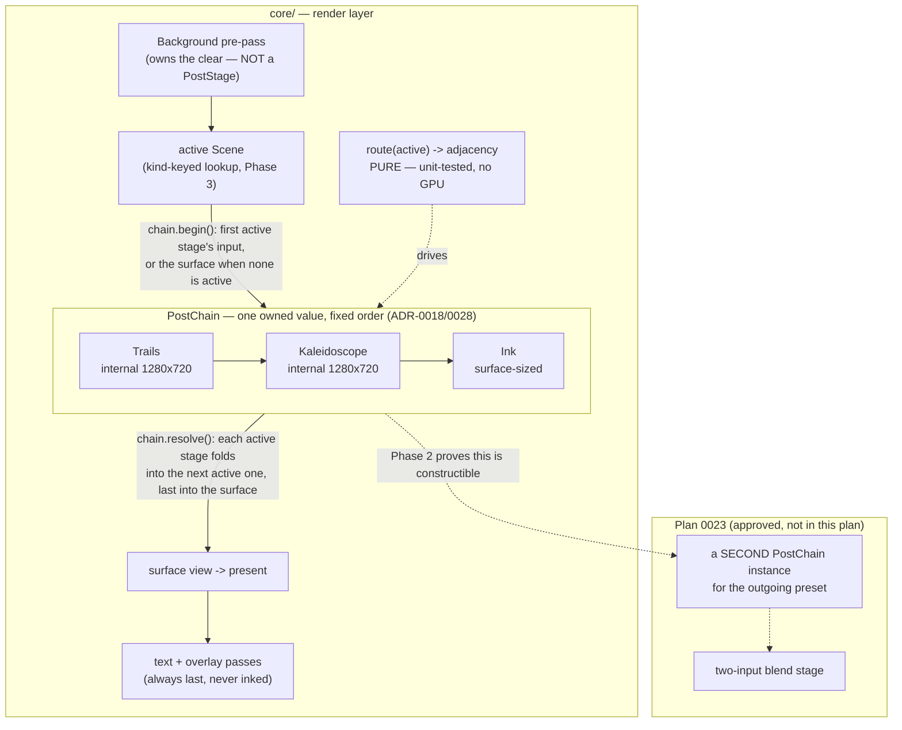

# 0030 — Composite chain + scene keying: a `PostStage` trait, an instantiable `PostChain`, and kind-keyed scenes

> **Status:** approved
> **Created:** 2026-07-25
> **Approved:** 2026-07-25
> **Owner skill(s):** dev
> **Related ADRs:** [0031](../adrs/0031-post-stage-trait-instantiable-composite-chain.md) (this plan
> implements it); preserves [ADR-0018](../adrs/0018-engine-wide-scene-compositing.md)'s fixed order
> and [ADR-0028](../adrs/0028-final-stage-ink-tone-remap.md)'s ink-is-last rule; **unblocks**
> [Plan 0023](0023-cross-preset-transitions.md)

## TL;DR

Replace `Renderer::draw_frame`'s hand-written composite branch ladder with a `PostChain` — an owned
value holding the three post stages behind a `PostStage` trait in ADR-0018's fixed order — and replace
the magic-index `system_slot` scene lookup with kind-keyed scene construction. Both are
behavior-preserving: every shipped preset renders byte-identically and every golden baseline is
unchanged, which is the plan's primary done-when. The payoff is that Plan 0023's approved dual-live
transition path becomes wiring instead of a re-architecture, and that a scene added tomorrow can no
longer silently render in the wrong slot.

## Context & problem

A codebase-health review (2026-07-25, at the user's request: least-knowledge / SOLID / testability /
large-method and performance audit) found no blockers — layering is clean, the audio callback is
untouched, the C ABI is still minimal v4, hot-path pragmas are intact — but two structural problems in
`core/src/render/`:

**The composite layer has an interface nobody declared.** `Trails`, `Kaleidoscope`, and `Ink` each
independently grew the same surface (`new` / `reset_params` / `set_param -> bool` / `reset_resources` /
`active` / `begin` / `resolve`) with no trait; `Kaleidoscope::begin(&mut self, _encoder)` carries an
unused parameter purely to match `Trails::begin`. `draw_frame` (`core/src/render/mod.rs:679-750`) then
composes them with a nested ladder over `trailing` / `kaleidoing` / `inking`: ~70 lines that enumerate
orderings rather than deriving them, with `ink.begin()` at three call sites and `draw_calls` summed by
hand. Nothing unit-tests that routing — it is only exercised through WARP captures of presets that
happen to bind the right params.

This is now blocking, not cosmetic. [Plan 0023](0023-cross-preset-transitions.md) is **approved** and
appends a fourth, *two-input* stage; its Phase 3 renders **two fully-composited frames in one frame**,
and its own risk list records the consequence — "in dual-live, each side needs its own feedback
field". The stages are single-instance `Renderer` fields owning single offscreens and a single
`PingPongField`, so a second live composite cannot be expressed without duplicating every field and
writing the ladder twice.

**Scene lookup is a hand-maintained positional coupling with no guard.** `system_slot`
(`core/src/render/mod.rs:65`) maps each `SystemKind` to a magic index into the `Vec<Box<dyn Scene>>`
that `create_all` (`core/src/render/scenes/mod.rs:140`) builds in a *separate* literal order. Adding or
reordering a scene means synchronized edits in `SystemKind`, `from_name`, `as_str`, `system_slot`, and
`create_all`, and nothing checks the two orderings agree: transpose two `create_all` entries and every
preset silently drives the wrong scene. The golden fixtures might catch the fallout, but nothing
localizes it and no unit test fails. Adding a scene should not require editing the renderer's dispatch
table.

## Decision

Per [ADR-0031](../adrs/0031-post-stage-trait-instantiable-composite-chain.md): declare a crate-internal
`PostStage` trait, hold the stages in a `PostChain` **value** in a compile-time constant order, and
factor the routing adjacency out as a **pure function over the active flags** so the contract is
testable without a GPU. The chain is a value (not a set of `Renderer` fields) specifically so a second
instance with independent GPU state is constructible — Plan 0023's dual-live requirement, proven by a
test in this plan rather than assumed. `Background` stays outside the trait: it is a pre-pass that owns
the frame clear, not a fold-down stage.

For scene keying, mirror the guard pattern the repo already trusts in `core/tests/golden.rs` (Plan 0022
/ Plan 0016 Phase 5): a single `SystemKind::ALL` const plus an **exhaustive** `match` factory, so a new
variant fails to compile until it is built. `golden.rs`'s hand-maintained `SYSTEMS` list is retired
onto `SystemKind::ALL`, so the variant roster lives in exactly one place instead of three.

We rejected extending the ladder per stage (Plan 0023 breaks it twice over), a general render graph
(ADR-0018 already rejected runtime-variable ordering, and it stays rejected), making post stages
`Scene`s (different inputs; would widen the trait every content scene implements), and trait-only
without touching the routing (leaves the blocking half in place). Full rationale in ADR-0031.

## Architecture diagram



## Implementation phases

### Phase 1 — `PostStage` trait + pure routing + `PostChain` (single instance); the ladder deleted
- **Owner skill:** dev
- **What:** Introduce `core/src/render/post.rs` holding the `PostStage` trait, the pure routing
  function, and `PostChain`; implement the trait for `Trails`, `Kaleidoscope`, and `Ink`; replace
  `draw_frame`'s branch ladder and the four hand-written param fan-outs with chain calls.
- **Files touched:** `core/src/render/post.rs` (new), `core/src/render/mod.rs`,
  `core/src/render/trails.rs`, `core/src/render/kaleidoscope.rs`, `core/src/render/ink.rs`
- **Notes for the implementer:**
  - `begin` returns an **owned** `wgpu::TextureView` (it is `Clone`/Arc-backed in wgpu 30, an atomic
    increment). Returning a borrow deadlocks against the scene render that happens between `begin` and
    `resolve` — do not fight this.
  - Collapse `Trails::aspect()`/`size()` and `Kaleidoscope::aspect()`/`size()` into
    `internal_size(&self) -> Option<(u32, u32)>`; `None` means surface-sized (ink), and the aspect is
    derived from whichever size wins. This is what removes ink's special case from the renderer.
  - `resolve` **returns its draw-call count** so the frame total is a sum, not the hand arithmetic at
    `mod.rs:747`.
  - The three stages' internals — shaders, lazy-build discipline, `reset_resources` semantics — do not
    change. This phase moves their composition, not their behavior.
  - Keep the param namespaces and first-owner-wins order exactly as they are; `Background` keeps its
    own direct `set_param` call ahead of the chain.
- **Done when:** `draw_frame` contains no `trailing`/`kaleidoing`/`inking` branch ladder and no
  per-stage `begin` call; **every golden baseline under `core/tests/golden/` is byte-identical with no
  re-bless** (the plan's central claim: this is a pure restructuring); `cargo nextest run -p lmv-core`
  is green with no test edited to accommodate the change; and new GPU-free unit tests on the pure
  routing function assert the adjacency contract for the cases the ladder used to encode by hand —
  no stage active (the scene renders straight to the surface), one active (it renders to the surface),
  all three active (trails folds into kaleidoscope's input, kaleidoscope into ink's, ink into the
  surface), and the middle-stage-skipped case (trails folds directly into ink's input) — plus the
  invariant that the last active stage always targets the surface and ink, when active, is always last.

### Phase 2 — `PostChain` is instantiable twice with independent state
- **Owner skill:** dev
- **What:** Make `Renderer` hold the chain as a single field, confirm nothing in `PostChain` is
  implicitly global, and prove a second independent instance is constructible — the Plan 0023 unblock.
- **Files touched:** `core/src/render/mod.rs`, `core/src/render/post.rs`
- **Notes for the implementer:** the failure mode to look for is shared GPU state that only *looks*
  per-instance — a chain built from cloned handles is fine (each stage builds its own textures lazily),
  a chain whose stages hand back views owned by the first instance is not. Trails is the one that
  matters (it owns a `PingPongField`), which is exactly what Plan 0023's risk bullet names.
- **Done when:** a headless test builds **two** `PostChain`s against one device, drives both to the
  point where their lazily-built resources exist, and asserts they are independent — the same
  `AnalysisFrame` and clock through chain A leaves chain B's accumulation untouched, so folding each to
  its own offscreen yields the pixels each chain's own history implies rather than a shared one; and
  `Renderer`'s stage handling is one field plus chain calls, with no residual per-stage field.

### Phase 3 — Kind-keyed scenes; `system_slot` deleted
- **Owner skill:** dev
- **What:** Replace the magic-index lookup with kind-keyed scene construction and lookup, guarded the
  way `golden.rs` already guards its fixture roster.
- **Files touched:** `core/src/render/scenes/mod.rs`, `core/src/render/mod.rs`,
  `core/src/preset/schema.rs`, `core/tests/golden.rs`
- **Notes for the implementer:**
  - Add `SystemKind::ALL` (a single const roster) beside `from_name`/`as_str` in `schema.rs`, plus the
    `VARIANT_COUNT`-style compile-time reminder `golden.rs` already carries — then **delete
    `golden.rs`'s own `SYSTEMS` list and point it at `SystemKind::ALL`**, so the roster lives in one
    place rather than three.
  - Build the roster from an **exhaustive** `match kind` factory, so a new variant fails to compile
    until it is constructed. Keep the shared `Rc<RefCell<LineRenderer>>` arrangement for the three
    line scenes exactly as `create_all` has it (ADR-0007: one line renderer) — this phase changes the
    keying, not the sharing.
  - Lookup by kind over ≤7 `Copy`-enum entries is not a hot-path concern; it already happens once per
    frame and replaces a `match` of the same size. Do not add a map.
- **Done when:** `system_slot` no longer exists and no scene is addressed by a numeric index anywhere;
  adding a hypothetical `SystemKind` variant fails to compile in the factory (verify by adding one
  locally, observing the error, and reverting); a test asserts every `SystemKind::ALL` entry builds a
  scene whose `name()` is the one that kind is supposed to drive — the assertion the old positional
  mapping made impossible; `SystemKind::ALL.len() == VARIANT_COUNT`; and the golden suite still renders
  all seven systems with **byte-identical** baselines.

### Phase 4 — Docs and diagram refresh
- **Owner skill:** dev
- **What:** Bring the composite documentation in line with the landed shape.
- **Files touched:** `core/src/render/mod.rs` + the three stage module docs (the "the renderer routes
  `ink_*` here exactly as it routes `bg_*`" narration is now the chain's job), `presets/README.md` and
  `docs/presets.md` **only if** either describes the composite mechanism rather than the params
  (params are unchanged — do not touch preset-facing param docs)
- **Notes for the implementer:** also fix the stale reference at `core/src/render/ink.rs:16`, which
  cites "Plan 0024" for the transition blend — 0024 is the ADR number; the plan is 0023.
- **Done when:** no module doc in `core/src/render/` describes a routing mechanism that no longer
  exists; the ink module's plan/ADR citation is correct; `cargo doc -p lmv-core` builds without
  warnings; and a reader of `post.rs` can state the composite order and the skip rule without opening
  `mod.rs`.

## Data shapes

```rust
// illustrative — not the final interface

/// One skippable post-composite stage (ADR-0031). Crate-internal: the composite
/// order is fixed in `PostChain::new`, not registered.
pub(crate) trait PostStage {
    fn name(&self) -> &'static str;

    /// Reset this stage's named params to defaults — once per frame, before routing.
    fn reset_params(&mut self);

    /// Apply one named param; `true` if this stage owns the name (first owner wins).
    fn set_param(&mut self, name: &str, value: f32) -> bool;

    /// Whether this stage runs this frame (its amount param is > 0 and finite).
    fn active(&self) -> bool;

    /// Fixed internal resolution, or `None` to size from the surface (ink).
    fn internal_size(&self) -> Option<(u32, u32)>;

    /// Lazily build and return the view this stage's input renders into.
    /// Owned, not borrowed: the caller renders the scene before `resolve`.
    fn begin(
        &mut self,
        encoder: &mut wgpu::CommandEncoder,
        surface: (u32, u32),
    ) -> Option<wgpu::TextureView>;

    /// Fold this stage's input into `out`; returns the draw calls encoded.
    fn resolve(
        &mut self,
        queue: &wgpu::Queue,
        encoder: &mut wgpu::CommandEncoder,
        out: &wgpu::TextureView,
    ) -> u32;

    /// Drop lazily-built resources (capture rebuild — keeps captures pure, NFR 6).
    fn reset_resources(&mut self);
}

/// The post stages in ADR-0018/0028 order. An owned value, so a second instance
/// with independent GPU state is constructible (Plan 0023 dual-live).
pub(crate) struct PostChain {
    stages: Vec<Box<dyn PostStage>>, // built in fixed order; never reordered at runtime
}

/// Where the background + scene render this frame.
pub(crate) struct SceneTarget {
    pub view: wgpu::TextureView,
    pub aspect: f32,
    pub size: (u32, u32), // what `Scene::set_target_size` receives (ADR-0030)
}

/// PURE: which active stage folds into which. `None` means "the surface".
/// Indices are positions in the fixed stage array. No GPU, no `self` — this is
/// the routing contract Phase 1 unit-tests.
pub(crate) fn route(active: &[bool]) -> Vec<(usize, Option<usize>)>;
```

## Risks & open questions

- **The borrow chain is the real implementation hazard.** `begin` must hand back a view that survives
  the scene render before `resolve` is called. Owning the returned `TextureView` (Arc clone) is the
  sanctioned answer; if `dev` finds a shape that keeps a borrow and is not contorted, that is fine, but
  do not spend the phase on it.
- **Byte-identical goldens are the whole safety net, and they are WARP-only.** If a baseline shifts,
  the restructuring changed something — treat it as a defect to find, **not** a re-bless. Note the
  standing trap recorded in prior closes: `LMV_BLESS=1` rewrites *every* baseline, not just the one
  under test.
- **The fourth stage will test the trait.** Plan 0023's blend stage is two-input and cannot use a
  one-input `begin`. ADR-0031 accepts that the trait gets revisited then, and sets the bound: a stage
  needing a method no other stage implements is a signal it does not belong in the chain. If that
  tension shows up early, surface it as feedback rather than pre-widening the trait here.
- **Dynamic dispatch on the hot path.** ~4 vtable calls plus ~4 Arc bumps per frame replace direct
  field calls. Expected to be unmeasurable against a render pass, but it is a real (if tiny) hot-path
  cost, and it is the honest price of the seam. If the debug overlay's p99 moves at all on the dev box,
  say so at review rather than letting it pass unremarked.
- **Phase 2's independence test needs a GPU adapter**, so it skips on runners without one (ADR-0016).
  It will be a WARP-only assertion in practice — acceptable, consistent with the rest of the capture
  suite, but it means CI does not defend the Plan 0023 unblock on macOS.
- **Open question for the closer:** the version bump. This plan ships production code with **no**
  behavior change. Per ADR-0005 the honest call is **patch**, not minor (no feature) and not none (the
  artifact does change) — but it is a deliberate call for the architect at close, not an automatic one.

## What this plan does NOT do

- **Does not implement Plan 0023.** No transition controller, no blend stage, no snapshot, no dual-live
  policy. This plan only makes the second chain *constructible* and proves it.
- **Does not change any preset-visible behavior.** No new param, no renamed param, no changed default,
  no new scene, no golden re-bless. If a preset looks different, the plan failed.
- **Does not touch the C ABI** (still v4), the `Scene` trait, the DSP path, or the audio intake.
- **Does not turn the composite into a render graph** or a registration point. The order stays a
  compile-time constant (ADR-0018, reaffirmed by ADR-0031).
- **Does not address the review's other findings** — duplicated `Renderer` constructors, per-frame
  binding-route resolution, the `shot` CLI's untested pure helpers, duplicated GPU boilerplate, the
  per-frame `format!` on the cap-overflow path. Those are [Plan 0031](0031-composite-cleanup-and-debt.md).
- **Does not give `Background` a trait impl.** It is a pre-pass, not a fold-down stage.

## Followups (after this lands)

- **Architect: revise Plan 0023's Phase 3 and its composite risk bullets.** With the chain landed,
  "allocate the second target (or generalize the Plan 0018 target into a reusable pair)" becomes
  "construct a second `PostChain`", and the "a kaleidoscope or trail stage that assumes it is last may
  need the blend to sit outside it" risk is answered structurally. Worth an edit so `dev` does not
  re-solve it.
- **[Plan 0031](0031-composite-cleanup-and-debt.md)** carries the rest of the review, including the
  accumulated minors from prior plan closes.
- If Phase 1's pure `route` function proves useful, consider whether the same treatment (pure decision
  function + thin GPU shell) fits the scene-target-size negotiation, which is currently also decided
  inline in `draw_frame`.
