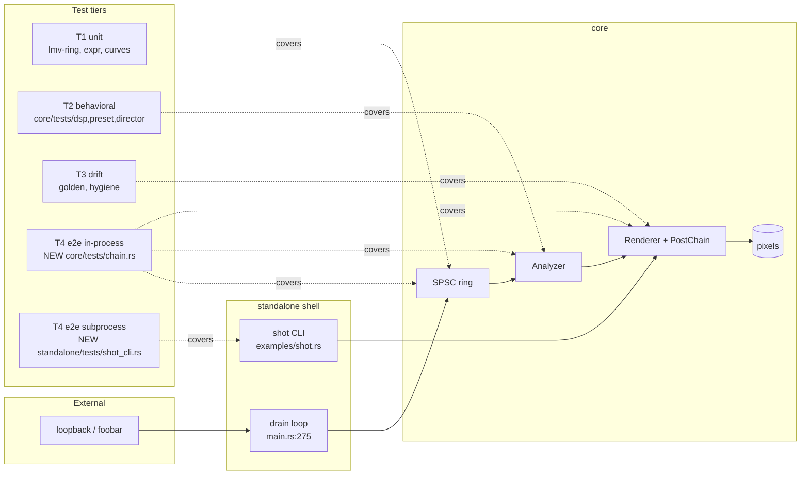

# 0032 — Testing strategy: full-chain e2e, `shot` CLI coverage, a core coverage ratchet, and a pre-push gate

> **Status:** in-progress
> **Created:** 2026-07-25
> **Owner skill(s):** dev, human
> **Related ADRs:** [0033](../adrs/0033-testing-strategy-coverage-ratchet-and-pre-push-gate.md)

## TL;DR

Close the three holes in a suite that grew plan-by-plan and was never audited as a whole. Add an
**end-to-end tier** — one in-process test that drives synthetic PCM through the real SPSC ring, the
real `Analyzer`, and the real `Renderer` to pixels, and one out-of-process suite that runs the built
`shot` binary and asserts exit codes, files, and JSON. Add a **line-coverage ratchet on `lmv-core`
alone**, set from a real measurement and only ever raised. Add an **opt-in `.githooks/pre-push`**
running `fmt` + `clippy` + `nextest`, so a broken push costs seconds locally instead of minutes in
CI. First user-visible behavior: after Phase 1, one `cargo nextest run` proves that pushing bass
through the ring and pushing treble through the ring produce measurably different frames — the claim
the architecture rests on and that nothing currently checks.

## Context & problem

The user asked three questions: do we have a coverage threshold, do we have e2e tests, are the happy
paths covered — and can we add a pre-push hook. The honest answers today are no, no, and *unknown*.

What exists is substantial and should not be undersold: 150 `#[test]`s, sixteen `core/tests/*`
suites, a golden-image drift guard over frozen per-system fixtures (ADR-0023), source-scanning drift
guards (`hygiene.rs`'s panic-pragma scan, `declared_params_match_set_param`), CI on Windows + macOS
running build / nextest / doctests / clippy `-D warnings` / fmt, `cargo deny` for supply chain, and
Miri over `lmv-ring`'s `unsafe`. That is a healthier baseline than most projects this age.

What is missing is the inverse view. Three specific holes:

1. **The ring seam is never crossed by a test.** `Renderer::capture_audio`
   (`core/src/render/mod.rs:1022`) drives real PCM through a real `Analyzer` and is used by exactly
   one test (`core/tests/beat.rs`) — but it *starts* at the `Analyzer`. The SPSC ring is tested in
   isolation (`lmv-ring`'s four unit tests plus Miri), and the drain policy joining ring to analyzer
   lives at `standalone/src/main.rs:275-281`, tested by nothing. So the sentence "the ring buffer is
   the seam between audio and render" is defended by design review, not by a test.
2. **`shot` has zero tests.** `standalone/examples/shot.rs` is the CLI the `preset-author` lane
   self-verifies through and the Plan 0013 visual-QA harness is built on, and `#[test]` does not run
   in an `examples/` target. Plan 0031 Phase 1 moves its pure helpers into the `[lib]`; that still
   leaves argument parsing, preset resolution, exit codes, and file output unexercised — and Plan
   0031 will be refactoring that file with no behavioral net under it.
3. **Nothing measures what is untested, and nothing gates locally.** The only hook is
   `block-broad-git-add.js`, which guards staging.

## Decision

Implement ADR-0033's five-tier model by adding what tier 4 (end to end) and the measurement layer
currently lack, in four `dev` phases plus one `human` install step. Coverage gates `lmv-core` only,
as a **ratchet** set from measurement rather than an aspirational target. The pre-push hook runs the
**fast subset** only — `fmt`, `clippy`, `nextest` — leaving `cargo deny`, doctests, Miri, and
coverage to CI.

We rejected a workspace-wide coverage gate (it would mostly measure how much of `standalone/` is
structurally untestable, and would push toward mocking WASAPI), a fixed 80 % target (arbitrary, and
a cliff), a named-module inventory guard instead of a percentage (blind to partial coverage, which
is the actual shape of the gap), promoting `shot` to a `[[bin]]` (drags the `image` dev-dependency
into the shipped binary and renames every documented invocation, including ones in
`.claude/skills/**` that cannot be edited), and full-CI-parity in the hook (minutes, so it gets
disabled). ADR-0033 records each with its decisive reason.

## Architecture diagram



The gap the diagram makes visible: every existing tier covers **one** box. Nothing today follows a
sample from `RING` through `AN` into `REN`, and nothing runs `SHOT` at all.

## Implementation phases

### Phase 1 — Full-chain e2e: PCM through the ring, the analyzer, and the renderer to pixels

- **Owner skill:** dev
- **What:** A new `core/tests/chain.rs` that joins the two halves of the pipeline for the first
  time — synthetic PCM pushed into a real `audio::intake` SPSC pair in capture-callback-sized
  bursts, drained through `pop_samples` into a fixed scratch buffer exactly as
  `standalone/src/main.rs:275-281` does, fed to `Analyzer::push_interleaved` / `take_frame`, and
  rendered through `Renderer::new_headless` + `capture_frame`. This is the walking skeleton of
  tier 4 and the phase that carries the plan's value on its own.
- **Files touched:** `core/tests/chain.rs` (new).
- **Done when:** all four claims below hold under `cargo nextest run -p lmv-core -E 'test(chain)'`
  on Windows, and the suite skips with a printed reason where the software adapter is unavailable
  (mirror `golden.rs`'s existing guard rather than inventing a second one):
  1. **Band routing survives the seam.** A bass-heavy signal and a treble-heavy signal, pushed
     through the *same* ring and the *same* reactive preset, render frames whose `frame_diff`
     exceeds a stated floor. Verify the assertion is non-vacuous by temporarily feeding both runs
     the same signal and confirming it fails.
  2. **Determinism holds through the ring.** Two identical runs of the same PCM produce
     byte-identical captures — the NFR §6 property, now checked across the seam rather than only
     downstream of it.
  3. **Overflow is lossy, not fatal.** Pushing a burst larger than the ring's capacity returns a
     short count from `push_samples`, and the chain keeps producing frames afterward. (An audio
     callback that overruns must drop samples, never block or panic.)
  4. **Boundary validation rejects, never panics.** `intake` at 4 kHz, 0 channels, and 9 channels
     each return the matching `FormatError`, and no path panics.

### Phase 2 — `shot` as a subprocess: exit codes, files, and report JSON

- **Owner skill:** dev
- **What:** A new `standalone/tests/shot_cli.rs` that runs the **built `shot` binary** the way a
  user does. It locates `target/<profile>/examples/shot[.exe]` by walking up from
  `std::env::current_exe()` to find the `examples/` sibling (robust to `CARGO_TARGET_DIR` and to a
  `--target <triple>` layout); if the binary is absent it fails with the actionable message
  `run \`cargo build -p standalone --example shot\` first` rather than silently passing.
  `shot` is deliberately **not** promoted to a `[[bin]]` — see ADR-0033 Alternative E.
- **Files touched:** `standalone/tests/shot_cli.rs` (new); `.github/workflows/ci.yml` and
  `.githooks/pre-push` only if the build-step check below comes back negative.
- **Done when:**
  1. **The GPU-free cases pass on both platforms.** Every one of these exits non-zero *before* a
     renderer is constructed (`parse_args` → `load_library` → renderer, `shot.rs:295`), so they
     need no adapter: an unknown flag; `--presets <missing dir>`; `--preset-file <missing file>`;
     `--preset X` with no `--out`. Each also names the offending input on stderr.
  2. **The GPU cases pass on Windows and skip with a printed reason on macOS** (no software Metal,
     ADR-0016): `--preset-file presets/<one>.toml --out <tmp>.png` exits 0 and writes a PNG that
     decodes at the requested `--size`; `--report --json` exits 0 and its stdout parses as JSON
     carrying the expected top-level keys; `--presets presets --preset <name> --out <tmp>.png`
     exits 0 and stdout carries the `[--presets presets]` source label — the provenance line Plan
     0015 added.
  3. **The build-step question is answered, not assumed.** Confirm whether `cargo nextest run`
     builds `examples/` targets. If it does not, add an explicit
     `cargo build -p standalone --example shot` step to CI and to the Phase 3 hook, and say so in
     the commit message.

### Phase 3 — The pre-push gate

- **Owner skill:** dev
- **What:** A checked-in `.githooks/pre-push` (POSIX `sh` — runs under Git-for-Windows' bundled
  shell and macOS `sh` alike) that runs the fast subset, stops at the first failure, names the step
  that failed, and prints the `--no-verify` escape.
- **Files touched:** `.githooks/pre-push` (new), `README.md`.
- **Done when:**
  1. The hook runs, in order, `cargo fmt --all --check`, `cargo clippy --all-targets -- -D warnings`,
     `cargo nextest run` — and **not** `cargo deny`, doctests, Miri, or coverage (ADR-0033
     Alternative F).
  2. **Warm wall time is measured and recorded in the README**, not estimated. If it exceeds ~90 s
     warm, the hook's test step narrows to a nextest filter that excludes the GPU-heavy suites
     (`golden`, `attractor`, `reaction_diffusion`, `background_composite`, `ink`) — and it
     **prints which suites it skipped** so the narrowing is never silent. CI keeps running all of
     them either way.
  3. An induced `rustfmt` violation blocks a real `git push`, the message names `cargo fmt` as the
     failing step, and `git push --no-verify` bypasses it.
  4. The README gains a short developer section: the one-line install
     `git config core.hooksPath .githooks`, what the hook runs, the measured time, and the explicit
     statement that **an uninstalled clone has no gate** (git will not run hooks from a tracked
     directory without that config).

### Phase 4 — Measure coverage, then set the ratchet

- **Owner skill:** dev
- **What:** A `coverage` CI job on `windows-latest` only — WARP makes the render paths genuinely
  executable there, while on macOS every GPU test skips and would report that code as dead. It runs
  `cargo llvm-cov nextest -p lmv-core --fail-under-lines $COVERAGE_FLOOR` with `cargo-llvm-cov`
  installed via `taiki-e/install-action`, alongside the existing `nextest` and `cargo-deny`
  installs. **Measure before choosing the number** — the floor is set from reality, not aspiration.
- **Files touched:** `.github/workflows/ci.yml`, `docs/nfr.md` (§7).
- **Done when:**
  1. The job runs green against the current suite, having landed **after** Phases 1-2 so the floor
     reflects the improved suite rather than being stale on arrival.
  2. `COVERAGE_FLOOR` is `floor(measured) - 2` (a margin so an unrelated change does not trip on
     rounding), lives in exactly **one** place — an `env:` key in `ci.yml` — and carries a comment
     stating the ratchet rule: raise it at a close ceremony when a plan improves coverage; never
     lower it without a one-line note naming the plan that lowered it and why.
  3. **The gate is proven to bite.** Delete a covered test file locally, confirm the number drops
     and the job fails, restore it. A gate never seen to fail is not known to work.
  4. The per-file breakdown lands in the GitHub job summary, and the measured baseline plus the
     five least-covered `core/` modules are recorded in this plan's close notes so the next plan
     can aim at them.
  5. `docs/nfr.md` §7 gains the coverage line and the pre-push gate, so the CI section stops being
     a stale description of a three-check pipeline.

### Phase 5 — Install the hook in your clone

- **Owner skill:** human
- **What:** `core.hooksPath` is per-clone local config; nothing in the repo can set it for you, and
  no phase above has any effect until you do.
- **Files touched:** none (local git config).
- **Done when:** `git config core.hooksPath .githooks` is set, and a deliberately misformatted file
  causes a real `git push` to be refused before any object is sent.

## Data shapes

No new structs, no schema, no ABI change. The one shape worth pinning is the CI floor, so nobody
has to hunt for where the number lives:

```yaml
# illustrative — .github/workflows/ci.yml
env:
  # ADR-0033 ratchet: line coverage of lmv-core only. Raise at a plan close when
  # coverage improves; never lower without a note naming the plan and the reason.
  COVERAGE_FLOOR: "<set from the Phase 4 measurement>"
```

## Risks & open questions

- **The ratchet can be tripped by a legitimate refactor.** Plan 0031 collapses three `Renderer`
  constructors and deletes duplicated GPU boilerplate; removing code changes the ratio in either
  direction. Deleting *well-covered* code lowers it. The escape is deliberate and visible — lower
  the floor with a note — and is the accepted cost of having a ratchet (ADR-0033, Negative
  consequences).
- **Plan 0023 is in flight and adds substantial new render code** (`core/src/render/transition.rs`
  is uncommitted in the working tree as of 2026-07-25). New, thinly-tested code lowers the ratio.
  That pressure is the point, but it is unpleasant to discover mid-plan — hence the sequencing note
  below recommending Phase 4 land after 0023 closes.
- **`cargo llvm-cov` against the WARP/DX12 path is unverified.** llvm-cov instruments Rust only, so
  the graphics driver is unaffected in principle, but instrumented binaries are slower and the
  GPU-heavy suites may stretch noticeably. Mitigation: it is a separate job off the critical path.
  If it proves unusable on Windows, the fallback is to gate coverage over the **non-GPU** subset of
  `lmv-core` (`dsp`, `preset`, `signal`, `audio`) with a correspondingly higher floor — a narrower
  gate, not no gate. Do not silently move it to macOS: the GPU tests skip there.
- **Warm `cargo nextest run` wall time is unmeasured.** A concurrent `dev` session held the tree
  mid-edit while this plan was written, so no local timing was taken. Phase 3 measures it; the ~90 s
  narrowing rule exists precisely because the number could come back either way.
- **Whether `cargo nextest run` builds `examples/`** decides if Phase 2 needs an explicit build step
  in CI and the hook. Phase 2 verifies rather than assumes.
- **The e2e chain test duplicates `main.rs`'s drain policy** instead of sharing it, so the two can
  drift. Extracting that loop into `standalone/src/lib.rs` (or `core`) is a followup below, not
  this plan — it would put a shell behavior change inside a testing plan.
- **`--fail-under-lines` failing is a hard CI stop.** If the margin proves too tight in practice
  (unrelated PRs tripping it), widen the margin rather than removing the gate.

## What this plan does NOT do

- **No coverage gate on `standalone/` or `plugin-foobar/`.** ADR-0033 Alternative A.
- **No standalone boot smoke test.** Launching the real `winit` window headlessly to prove surface
  creation, capture init, and the first frames was offered in the interview and not selected. It
  remains the one path CI has never executed; a future plan can take it with a `--selftest` flag.
- **No expansion of the C ABI lifecycle tests.** `core/tests/ffi.rs`'s five tests are left as they
  are; a fuller create → push → render → resize → free misuse matrix was offered and not selected.
- **No mocking of WASAPI or ScreenCaptureKit**, and no traits introduced to make platform capture
  "coverable".
- **No change to the golden tolerance, the `LMV_BLESS` flow, or any existing suite.** This plan adds
  tiers and gates; it does not retune what is already there.
- **No new Cargo dependency.** `cargo-llvm-cov` is a CI-installed tool, not a manifest entry — NFR
  §4's budget is untouched.
- **No `PreToolUse` push hook.** CLAUDE.md already forbids the assistant from pushing (ADR-0033
  Alternative G).
- **No `docs/testing.md`.** The tier table lives in ADR-0033; the README carries the operator-facing
  hook instructions. A living guide can be split out later if the table starts wanting edits.

## Sequencing

Phases 1-3 are independent of every active plan and can land at any time. Two ordering notes:

- **Phase 2 is worth landing before Plan 0031**, whose Phase 1 refactors `standalone/examples/shot.rs`
  (1028 lines, 45 functions, currently zero tests). A subprocess suite is exactly the behavioral net
  that refactor should be done under.
- **Phase 4 is best landed after Plan 0023 closes.** Setting the floor while a large, new,
  thinly-tested render subsystem is mid-flight either sets it artificially low or trips it
  immediately. This is a judgment call, not a hard dependency — if the user prefers the floor set
  now, widen the Phase 4 margin instead.

## Followups (after this lands)

- Extract `main.rs`'s ring-drain loop (`main.rs:275-281`) into shared testable code so the e2e chain
  test exercises the real policy rather than a copy of it.
- Raise `COVERAGE_FLOOR` at the next close ceremony that improves coverage, and record the new
  number's justification.
- Aim a targeted-coverage plan at the five least-covered `core/` modules identified by Phase 4.
- Reconsider the standalone boot smoke test and the fuller C ABI lifecycle matrix — both were
  scoped out here by user choice, not because they lack value.
- Revisit `plugin-foobar/` once the shim carries any logic of its own; today it is a thin
  `extern "C"` caller over a surface `core/tests/ffi.rs` covers.
