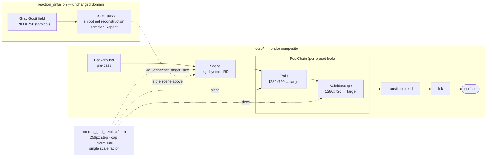

# 0033 — Internal resolution follows the target, plus the preset-surface and harness gaps behind it

> **Status:** draft
> **Created:** 2026-07-26
> **Approved:** 2026-07-26 — ready for `dev` (a fresh session; the handoff is manual on purpose)
> **Owner skill(s):** dev, human
> **Related ADRs:** [0034](../adrs/0034-internal-resolution-follows-the-target.md) (internal
> resolution), [0035](../adrs/0035-asymmetric-attack-release-easing.md) (attack/release easing);
> builds on [0012](../adrs/0012-stateful-feedback-render-system.md),
> [0018](../adrs/0018-engine-wide-scene-compositing.md),
> [0019](../adrs/0019-eased-parameters.md),
> [0031](../adrs/0031-post-stage-trait-instantiable-composite-chain.md)
> **Backlog entries closed:** [0003, 0004, 0006, 0008](../design-backlog.md)

## TL;DR

The composite's two post stages stop rendering the whole frame through a fixed 1280x720 and follow
the render target instead, so line geometry composited through `trails` or `kaleido_*` is sharp at
the display's own resolution. Reaction-diffusion's blockiness is attacked at the reconstruction seam
first (a near-free fix that changes no chemistry) and only then, if needed, by a single grid step to
512². RD's present sampler starts wrapping, which is what makes `zoom` and `pan_*` usable on that
scene at all. Alongside, two smaller gaps the same feedback batch surfaced: `[smoothing]` gains an
`{ attack, release }` form so a beat-driven parameter can snap and then glide, and the `shot`
harness stops being unable to drive `tempo`/`novelty` or to tell an author what real audio levels
look like. The first user-visible behavior is a sharp Fern with its trails back on.

## Context & problem

The `preset-author` lane rewrote all 35 shipped presets on 2026-07-26, iterating live with the user
on a 2048x1152 fullscreen display, and handed back eleven findings (triaged into
[`docs/design-backlog.md`](../design-backlog.md) entries 0002-0009, all re-verified against code at
intake). This plan takes the four that are ready to build. The user's own words drive it:

- **"coral is broken."** `GRID = 256` in `render/scenes/reaction_diffusion.rs:48`, upscaled 8x at
  2048 wide. The lane swept `flow` across 0.45 / 0.70 / 1.00 and the blockiness was identical in all
  three — it is not the chemistry, and no preset value removes it.
- **"fern grow... feels like it is upsized from something much smaller"**, then **"roses overall
  feels upscaled as well - quality is poor."** `TRAILS_W/H` and `KALEIDO_W/H` are both 1280x720, a
  1.6x upscale of the entire frame. The lane's only recourse was to **remove `trails` from all 13
  line presets**, which recovered sharpness and cost those presets their afterglow.
- **`zoom` is unusable on reaction-diffusion in both directions.** Above 1 it renders vertical bars
  and rectangular blocks; below 1 it magnifies the 256 px grid; any real `pan_*` walks off the field.
  All four RD presets are pinned at `zoom = 0.99`, which costs the family its whole view lever.
- **"pulse field reaction are way too fast and jarring, we should smoothen it up a lot."**
  `[smoothing]` is one symmetric time constant. A longer one reduces the jarring and makes the attack
  mushy; there is no value that gives both.
- **The harness cannot reach the newest grammar.** `apply_set` accepts six keys; `tempo` and
  `novelty` are not among them, **which is a large part of why no shipped preset used them.** And the
  lane calibrated its gains against `--set bass=0.8`, far above real loopback levels, so the user's
  first live reaction was that presets barely reacted.

Two of these diagnoses changed under verification, and the changes matter:

1. **RD's edge-smear is a sampler address mode, not a clamp bug.** The sim's `ld()` wraps —
   `((c % size) + size) % size` — so the field is **already toroidal**, while the present sampler is
   `AddressMode::ClampToEdge` (`:418-420`). The field is seamless; only the presentation refuses to
   wrap. The report also states `presets/README.md` documents the opposite sense; it does not. The
   README says a higher `zoom` shows more of the field, which is exactly what the shader computes —
   the gap is an omission (it never says RD's field is finite), not an inversion.
2. **RD's blockiness is probably not pixel steps.** The present sampler already filters `Linear`, so
   an 8x upscale should read soft, not angular. Bilinear interpolation is C0 — its gradient is
   discontinuous across texel edges — and RD's present pass runs analytic iso-contours plus a
   central-difference gradient over exactly that field, which turns a smooth upscale into angular
   facets. **This is a hypothesis, not a reproduction**, and Phase 3 confirms or kills it before
   spending the expensive fix.

## Decision

We size the two `PostStage` internal grids from the render target under Plan 0029's quantize-and-cap
policy (256 px step, a single scale factor at the cap so aspect survives), with the cap at
**1920x1080** rather than the attractor's 2560x1440 — the trails `Rgba16Float` field pair is charged
twice during a dual-live dissolve, and ADR-0034 works the arithmetic. The RD **simulation** grid
stays a constant: we fix reconstruction first, and take a single step to 512² only if that does not
resolve it, because doubling a Gray-Scott grid at a stability-bound diffusion coefficient costs ~4x
the sub-steps and shifts every coral preset's look. RD's present sampler wraps. `[smoothing]` gains
an optional `{ attack, release }` pair resolved at the same load boundary as today's scalar.

We rejected making the RD simulation target-sized (it would make a preset's appearance a function of
window size, and the WARP test budget that set the 256 is still live), a per-preset resolution scale
param (pushes an engine cost decision onto the content lane and answers a question nobody asked),
uncapped surface-sized post stages (265 MB of ping-pong at 4K, before the dual-live doubling), and
clamping RD's `zoom` to <= 1 (works around a one-line address mode by deleting a lever the toroidal
simulation has always supported, and leaves `pan_*` broken anyway). Full details in ADR-0034/0035.

Phase order puts the harness first because everything after it is verified **through** that harness,
and it is currently mis-calibrated in a way that made presets "look broken in stills that were fine
in motion."

## Architecture diagram



## Implementation phases

Each phase ships as its own commit. `dev` runs Phases 1-7 in one session; Phase 8 is the user's.

### Phase 1 — `shot` reaches `tempo`/`novelty`, and reports what real audio actually looks like
- **Owner skill:** dev
- **What:** Closes backlog 0008. `--set` gains the two grammar-v2 variables, and a filmstrip run
  prints the band levels it derived from the audio, so an author calibrates against measured numbers
  instead of guessing.
- **Files touched:** `standalone/src/shot/args.rs`, `standalone/examples/shot.rs`,
  `standalone/tests/shot_cli.rs`, `docs/capturing.md`
- **Done when:**
  1. `--set tempo=128,novelty=0.7` is accepted, and a preset binding `tempo` renders visibly
     differently at `tempo=90` than at `tempo=160` (a frame diff above the harness's existing
     reactivity floor). `apply_set`'s existing unit test is extended to cover both new keys and to
     keep rejecting an unknown one.
  2. A `--signal` or `--audio` filmstrip prints the min / mean / max of `bass`, `mid`, `treb` over
     the captured frames, so `shot --audio <clip.wav>` answers "what does real material actually
     produce" with numbers.
  3. `docs/capturing.md` states both calibration traps in the author's terms: that `--set beat=1`
     **holds the gate high for every captured frame** — unphysical, and it over-represents any
     `beat`-driven accent badly enough to make a working preset look broken in a still — and that
     `--set` band magnitudes are **not** comparable to real loopback levels, naming
     `--signal click:120` and `--audio <clip.wav>` as the paths that produce transient beats and
     realistic levels.

### Phase 2 — `[smoothing]` accepts `{ attack, release }`
- **Owner skill:** dev
- **What:** Closes backlog 0006, implements ADR-0035. A `[smoothing]` entry stays a scalar or becomes
  an inline two-constant table; `Binding::tau` becomes a pair; `Smoother::smooth` picks by direction.
- **Files touched:** `core/src/preset/schema.rs`, the raw `[smoothing]` table type in
  `core/src/preset/`, `core/src/render/mod.rs`, `presets/README.md`, `docs/presets.md`
- **Done when:**
  1. A unit test on `Smoother::smooth` drives the **same** step input up and then down with
     `attack = 0.02, release = 0.7` and asserts the rise reaches >= 90 % of the target within two
     60 Hz frames while the fall is still above 50 % after 0.4 s — i.e. the asymmetry itself, not a
     tuned constant.
  2. The scalar form is proven unchanged: a test asserts a scalar `tau` produces bit-identical output
     to an `{ attack = tau, release = tau }` table, and **every golden baseline is byte-identical
     with no re-bless** (no shipped preset uses the new form yet).
  3. Both constants are validated non-negative and finite at the load boundary with a surfaced error
     naming the parameter, matching today's scalar behavior; `0` on either side still means instant.
  4. `docs/presets.md` documents the form **and** its price — that a direction-dependent constant is
     a rectifier, so a fast-attack parameter rides above its input's mean under sustained material.

### Phase 3 — Confirm the RD artifact, then fix reconstruction
- **Owner skill:** dev
- **What:** Closes the cheap half of backlog 0003. Establish what the coral artifact actually is,
  then smooth the present pass's reconstruction of the finite field.
- **Files touched:** `core/src/render/scenes/reaction_diffusion.rs`, `core/tests/`
- **Done when:**
  1. **The hypothesis is settled in writing first.** `dev` captures `reaction_coral` at 2048x1152
     before any change and states in the commit body whether the artifact is bilinear faceting
     (contour edges polygonal, facet boundaries aligned to a 256-texel lattice) or genuine
     pixel-stepping. If it is *not* faceting, this phase stops there and says so, and Phase 4 carries
     the whole fix.
  2. The present pass reconstructs the field with a C1-continuous scheme (a quintic-smoothed
     fractional texel coordinate before the tap is the cheap form; Catmull-Rom is the expensive one)
     and the **gradient central-difference and the contour/hatch operators read through the same
     reconstruction** — the gradient is where the discontinuity becomes visible, so fixing only the
     value tap fixes nothing.
  3. A test pins the property rather than the pixels: rendering a known field upscaled well past 1:1,
     the second difference of luminance along a scanline has **no outlier at texel boundaries** —
     its maximum across a boundary is within a small factor of the interior maximum. Verified
     non-vacuous by confirming it fails against the current bilinear tap.
  4. The RD goldens are re-blessed **with the scope named in the commit body**, and the unaffected
     baselines are confirmed byte-unchanged (`LMV_BLESS` rewrites all of them).

### Phase 4 — Reaction-diffusion grid 256 → 512
- **Owner skill:** dev
- **What:** The remaining half of backlog 0003's RD side: a single fixed step up, accepted as a look
  change, with its cost measured rather than assumed.
- **Files touched:** `core/src/render/scenes/reaction_diffusion.rs`, `presets/reaction_*.toml` (only
  under the allowance below), `core/tests/golden/`
- **Done when:**
  1. `GRID` is 512 and the sub-step count needed to keep the simulation stable at the shipped
     `DIFFUSE_U`/`DIFFUSE_V` is **derived and stated**, not guessed — the 5-point explicit-Euler
     Laplacian has a stability bound the plan is not free to ignore.
  2. **The WARP cost is measured and reported**: `cargo nextest run -p lmv-core` wall time before and
     after, called out per RD-touching suite. If the increase exceeds ~30 s, `dev` stops and surfaces
     it rather than absorbing it — the 256 exists for this reason (`reaction_diffusion.rs:44`) and
     trading CI time for sharpness is the user's call, not a phase's.
  3. The four RD presets still pass the `sanity` / `reactivity` / `animation` floors. **Allowance,
     bounded:** `dev` may adjust `feed`/`kill`/`flow` in those presets *only* to restore a failing
     floor, must say so explicitly in the commit body, and must not make aesthetic changes — the
     aesthetic pass is Phase 8's, in the `preset-author` lane.
  4. RD goldens re-blessed with the scope named; unaffected baselines confirmed byte-unchanged.

### Phase 5 — RD's present sampler wraps, and the docs stop implying an infinite field
- **Owner skill:** dev
- **What:** Closes backlog 0004. One address mode, plus the documentation gap behind it.
- **Files touched:** `core/src/render/scenes/reaction_diffusion.rs`, `presets/README.md`
- **Done when:**
  1. The present sampler is `AddressMode::Repeat` on U and V, and a capture at `zoom = 1.4` shows the
     field tiling seamlessly — asserted as a test, not by eye: the column-wise variance of a
     `zoom = 1.4` capture is within a small factor of a `zoom = 1.0` capture's, where the
     clamp-smear collapses it toward zero on the off-field columns. Verified non-vacuous against the
     current `ClampToEdge`.
  2. `pan_x = 0.5` at `zoom = 1.0` renders a shifted-but-complete field with no edge artifact.
  3. `presets/README.md` says what is actually true of this scene: its field is **finite but
     toroidal**, so `pan_*` is a seamless infinite scroll and `zoom > 1` tiles rather than running
     out of field. The existing "shows more of the field" sentence is correct and stays; what gets
     added is why that was previously unusable.

### Phase 6 — The post stages follow the render target
- **Owner skill:** dev
- **What:** The headline. Closes backlog 0003's post-stage side per ADR-0034.
- **Files touched:** `core/src/render/post.rs`, `core/src/render/trails.rs`,
  `core/src/render/kaleidoscope.rs`, `core/tests/golden/`
- **Done when:**
  1. One shared policy function turns a surface size into an internal grid size — 256 px step per
     axis, cap 1920x1080 applied as a **single** scale factor to both axes — and it is unit-tested
     GPU-free, including that a 3440x1440 ultrawide comes back with its aspect intact (the failure
     mode Plan 0029 already hit and fixed on the attractor).
  2. `PostStage::internal_size` takes the surface size and returns the grid, and the trait's
     doc-comments stop describing a fixed 16:9 grid. `KALEIDO_ASPECT` moves from a compile-time
     constant into the uniform, and a fold on a **non-16:9** target is asserted still symmetric —
     wedge means around the fold axis match within tolerance.
  3. **Resources rebuild on a size change and only on a size change** (ADR-0030's compare-first
     obligation), proven by a test that counts builds: N frames at one size build once; a size change
     builds once more; returning to the first size builds once more and does not reuse a stale grid.
  4. A `PostChain` driven at 2048x1152 reports an internal size of 2048x1152, not 1280x720.
  5. Trails and kaleidoscope goldens re-blessed with the scope named in the commit body; every other
     baseline confirmed byte-unchanged.

### Phase 7 — Operator-doc sweep
- **Owner skill:** dev
- **What:** The required cross-doc sweep for everything Phases 1-6 changed that a user or an author
  observes — including one gap the lane flagged that predates this plan.
- **Files touched:** `presets/README.md`, `docs/presets.md`, `docs/capturing.md`,
  `docs/on-device-validation.md`, `docs/nfr.md` (only if a budget moved), `CLAUDE.md` if the layout
  changed
- **Done when:**
  1. `presets/README.md` states the **mirror-versus-kaleidoscope asymmetry** the lane asked for:
     `mirror_*` replicates real geometry *before* rasterization and is therefore free of resolution
     cost, while `kaleido_*` folds finished pixels at the stage's internal grid — so on line scenes,
     prefer the mirror. This is the guidance whose absence caused the trails removal.
  2. `presets/README.md` and `docs/presets.md` cover the `{ attack, release }` form, the RD toroidal
     view transform, and the fact that the composite stages now render at the target.
  3. `docs/on-device-validation.md` gains items for the two numbers this plan cannot measure here:
     frame time at 1080p on the baseline iGPU with `trails` **active at native resolution**, and the
     memory delta against NFR §12's ~350 MB soft ceiling — including during a dissolve, when two
     `PostChain`s are live at once.
  4. No count-bearing sentence is introduced that will re-drift (prefer "the whole embedded set" over
     a number).

### Phase 8 — Re-tune and confirm on the real display
- **Owner skill:** human
- **What:** The aesthetic pass this plan's engine work exists to enable. Engine-green does not mean it
  looks right, and only the user has the 2048x1152 display and real audio.
- **Done when:**
  1. The `preset-author` lane is run over the four `reaction_*` presets (which lost their view
     transform to the pin at `zoom = 0.99`, and whose look shifts if Phase 4 landed) and over the 13
     line presets, **restoring `trails` where it was removed purely for sharpness**.
  2. The user confirms on-device that coral no longer reads as angular blocks, and that Fern and the
     roses no longer read as upscaled, with trails on.
  3. Anything still missing goes back to the backlog as new entries rather than being absorbed
     silently — backlog 0002 (spectrum), 0005 (bloom) and 0007 (star_pattern) are already waiting.

## Data shapes

```rust
// illustrative — not the final interface

// ADR-0035: one entry, two constants, resolved at load like today's scalar.
pub struct Easing {
    pub attack: f32,   // seconds; 0 = instant
    pub release: f32,  // seconds; 0 = instant
}
// A scalar `[smoothing]` entry parses to Easing { attack: t, release: t }.

// ADR-0034: the one policy both post stages share.
// 256 px step per axis; when the cap binds, ONE scale factor applies to both
// axes so aspect survives (Plan 0029's lesson on the attractor).
fn internal_grid_size(surface: (u32, u32)) -> (u32, u32);

// The PostStage seam gains the surface it was already being handed elsewhere.
fn internal_size(&self, surface: (u32, u32)) -> (u32, u32);  // was: Option<(u32, u32)>, no arg
```

## Risks & open questions

- **The faceting hypothesis may be wrong.** It is grounded in the code (`Linear` filter, C0 bilinear,
  contour + central-difference operators over it) but **not reproduced**. Phase 3 settles it before
  spending anything, and Phase 4 is the fallback. If both fail to fix it, the diagnosis is wrong in a
  more interesting way and the plan should stop rather than escalate further.
- **The iGPU frame budget is the real exposure.** Full-resolution trails means a full-resolution
  `Rgba16Float` ping-pong read/write per frame, and NFR §1's >= 60 fps at 1080p floor is exactly the
  claim at risk. A WARP capture cannot speak to it. Mitigation: the cap is one constant, and Phase 7
  puts it on the on-device checklist. If it fails on device, lower the cap — do not re-fix the grids.
- **Memory is a projection, not a measurement.** ~50 MB per chain at the 1920x1080 cap, ~100 MB
  during a dissolve, against a ~350 MB soft ceiling that is mostly driver floor. The arithmetic is in
  ADR-0034. Same mitigation: the cap.
- **A resize now clears the trail history**, because the ping-pong field is rebuilt. The 256 px
  quantization makes it rare rather than continuous, but a slow window drag across a step boundary
  will blink the afterglow away. Accepted; call it out in the commit rather than discovering it in a
  review.
- **Phase 4 may not be reachable inside the CI budget.** Its done-when makes that a stop-and-surface,
  not a judgment call absorbed mid-phase.
- **Golden churn is broad in this plan** (RD, trails, kaleidoscope). `LMV_BLESS` rewrites *every*
  baseline, so each re-bless must name its scope and restore the untouched ones — this repo has been
  bitten by exactly that before.
- **Open:** whether the RD gradient/hatch operators want the smoothed reconstruction or their own
  analytic derivative. Phase 3 done-when #2 requires they read through the same reconstruction;
  whether that is sufficient for the hatch at high `hatch` values is unverified.

## What this plan does NOT do

- **No per-bin spectrum and no N-element scene** (backlog 0002) — the largest item in the batch,
  needing both a grammar decision and a scene with no precedent for per-element evaluation. It gets
  its own interview and its own plan.
- **No bloom / glow stage** (backlog 0005). It is well-shaped now that ADR-0031's `PostStage` trait
  exists, and it is deliberately sequenced *after* this plan so it is built against target-sized
  stages rather than inheriting the 720p problem it is meant to answer.
- **No `star_pattern` work** (backlog 0007). The user chose to invest in it rather than cut it; that
  is a generator-level design needing its own ADR.
- **No pulsing `--set` form.** `apply_set` is a pure per-frame function with no frame index, and
  giving it one to make `beat` transient duplicates what `--signal click:120` and `--audio` already
  do correctly. Phase 1 documents the trap and names the existing paths instead.
- **No change to the `animation.rs` gate** (backlog 0009) — captured as informational; the resolution
  is a sentence in the authoring docs, not a looser floor.
- **No `Scene` trait change, no C ABI change (stays v4), no new dependency.** `PostStage` is
  crate-internal (ADR-0031); nothing here is reachable from a preset or an FFI caller.

## Followups (after this lands)

- Backlog 0002 (per-bin spectrum + an N-element scene) — the next design interview.
- Backlog 0005 (bloom), sequenced deliberately after this plan.
- Backlog 0007 (`star_pattern`), now a decided *invest*, needing its own ADR.
- Whether the attractor's 2560x1440 cap should converge on the post stages' 1920x1080, or whether
  the two genuinely want different numbers. Deliberately left alone here — the attractor's grid is
  single-instance and not doubled by a dissolve, so it is not obviously the same decision.
