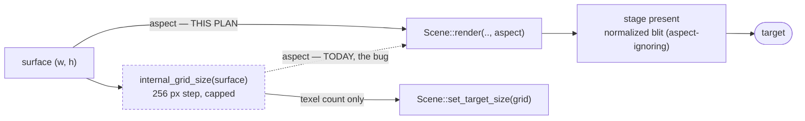

# 0035 — The composite's aspect is the target's: the grid-shape stretch, one grid policy, and a pixel guard for the post stages

> **Status:** draft
> **Created:** 2026-07-26
> **Owner skill(s):** dev
> **Related ADRs:** [0037](../adrs/0037-internal-grid-is-a-resolution-not-a-shape.md) (the invariant);
> corrects the aspect consequence of [0034](../adrs/0034-internal-resolution-follows-the-target.md);
> re-establishes [0029](../plans/done/0029-attractor-resize-cost-and-ink-followups.md) Phase 5 on the
> composite path; touches the [0031](../adrs/0031-post-stage-trait-instantiable-composite-chain.md)
> `PostStage` seam
> **Closes:** Plan 0033's close-review majors 1-3 and minors 2-4

## TL;DR

Turning on `trails` or `kaleido_*` currently changes the **shape** of the picture, not just its
softness: the composite derives every scene's aspect from the quantized internal grid, and the
stage's present is a plain stretch, so the frame comes out 1.28x too wide at 1280x800 and 1.07x too
wide at 1280x720. This plan makes the composite's aspect the render **target's** (ADR-0037), gives
the two post stages the pixel coverage whose absence let this ship, folds the two copy-pasted grid
policies into one, and corrects the three docs that now say something untrue. No preset changes, no
golden churn expected.

## Context & problem

Plan 0033's Mode 4 review found the defect and reproduced it. `PostChain::begin`
(`core/src/render/post.rs:445`) sets `SceneTarget::aspect` from the **internal grid**:

```rust
aspect: size.0 as f32 / size.1.max(1) as f32,   // `size` is the grid, not the surface
```

That one value reaches every scene (`render/mod.rs:421`), and both stages present with a normalized
fullscreen blit that ignores aspect entirely. Since `internal_grid_size` rounds each axis **up** to
a 256 px step, the grid's aspect is only approximately the target's — so the scene draws correct-for
-the-grid and the present stretches it:

| target | grid | stretch | measured |
|---|---|---|---|
| 1280x800 | 1280x1024 | 1.280x wide | **1.278x** |
| 1280x720 | 1280x768 | 1.067x wide | **1.069x** |
| 3440x1440 | 1920x1024 | 1.274x wide | — |
| 1366x768 | 1536x768 | 0.889x | — |
| 1920x1080 · 2048x1152 · 2560x1440 · 3840x2160 | exact | 1.000x | — |

Measured with `shot` against a trails-bound copy of `presets/rose_web.toml`, comparing the lit-pixel
extent with the stage active and inactive. Three things make this worse than a cosmetic nit:

- **It is a regression at two very common sizes.** At 1280x720 and 1366x768 the old fixed 1280x720
  grid was aspect-exact, so composing a stage cost nothing in shape. It does now.
- **It re-breaks a fix the project already paid for.** Plan 0029 Phase 5 corrected exactly this on
  the attractor by projecting at the target's aspect rather than the accumulation grid's ratio. The
  attractor reads `SceneTarget::aspect`, so an active post stage hands it the grid ratio again.
- **The kaleidoscope has it independently.** It folds in its *output* space but aspect-corrects by
  its *input grid's* ratio (`kaleidoscope.rs:298`), so the wedges skew whenever the two disagree.

None of it was caught because 1920x1080 and the 2048x1152 display this project is developed on both
come back from the policy exactly 16:9 — and because **no fixture in `core/tests/fixtures/` binds
`trails` or `kaleido_*`**, so no capture in the suite exercises the changed path at all. Plan 0033
Phase 6's done-when spoke of re-blessing trails and kaleidoscope goldens; those baselines have never
existed.

## Decision

We correct the aspect at the projection, not the grid (ADR-0037): `SceneTarget::aspect` comes from
`surface`, and the kaleidoscope's fold corrects by the aspect of the destination it folds into.
`Scene::set_target_size` keeps receiving the grid — that one is genuinely a resolution.

We rejected making the grid's aspect match the target's (a horizontal drag would then change the
derived axis continuously and reallocate the texture pair on nearly every `Resized` event, defeating
the 256 px step), letterboxing the grid into the target (black bars in a fullscreen visualizer are a
worse outcome than either the stretch or the fix), and leaving it documented as a known limit (28 %
is a defect, not a limit). Full reasoning in ADR-0037.

Phase order puts the fix first because it is the user-visible correctness and it is small; the
coverage phase follows immediately because its absence is the actual root cause and it must be
proven to catch this class, not merely added.

## Architecture diagram



## Implementation phases

Each phase ships as its own commit.

### Phase 1 — The composite's aspect is the surface's
- **Owner skill:** dev
- **What:** Closes the review's major 1. `SceneTarget::aspect` is derived from `surface`; the
  kaleidoscope's uniform takes the destination's aspect rather than its input grid's.
- **Files touched:** `core/src/render/post.rs`, `core/src/render/kaleidoscope.rs`,
  `core/src/render/trails.rs` (doc only, if its module note describes the old behavior)
- **Done when:**
  1. `SceneTarget::aspect` is a function of `surface` alone, and the field's doc says why (an
     internal grid is a resolution, not a shape — ADR-0037), naming the cancellation: a scene told
     the target's aspect draws pre-squashed into the grid, and the present's stretch is the inverse.
  2. The kaleidoscope folds about the **destination's** aspect. `PostStage::resolve` gains whatever
     it needs to know that — passing the destination size alongside the view is the obvious shape,
     since `begin` already takes `surface`. State in the commit that this is the second change to an
     ADR-0031 seam and that it stays crate-internal (no preset, no C-ABI caller reaches it).
  3. **A behavioral test that fails before the fix.** Render a radially symmetric figure at a target
     whose grid aspect differs from its own — 1280x800 (grid 1280x1024) is the strongest case, and
     1920x1080 must be used as the control where grid *equals* target — through an active stage and
     with the stage skipped, and assert the figure's x/y extent ratio matches between the two within
     a few percent. Confirm non-vacuity by restoring the grid-derived aspect and watching it fail;
     report both numbers in the commit body, as Plan 0029 Phase 5 did (it reported the predicted
     1.329 skew and 1.00 after).
  4. `the_fold_stays_symmetric_on_a_non_16_9_target` gains a probe at a size where the grid and the
     surface **disagree**. Today it uses (512, 256), which `internal_grid_size` returns unchanged, so
     it cannot distinguish grid aspect from surface aspect and passed throughout the defect.
  5. **Every golden baseline byte-identical, with no re-bless** — this changes only the stage-active
     path and no fixture binds a stage. Verify with `git status` rather than asserting it.

### Phase 2 — A pixel guard for the two post stages
- **Owner skill:** dev
- **What:** Closes major 3. The composite's two stages have no capture-level coverage of any kind;
  that is why a whole-frame geometric defect shipped green.
- **Files touched:** `core/tests/fixtures/`, `core/tests/golden.rs` or a new `core/tests/composite.rs`,
  `core/tests/golden/`, `docs/capturing.md` if the fixture roster is described there
- **Done when:**
  1. At least one fixture composes `trails` and one composes `kaleido_*`, and both are captured by a
     regression test. **The WARP question is settled explicitly, in writing, before the fixture
     lands:** building a feedback pipeline mid-run deterministically changes what the trails stage
     resolves to on the software adapter — the posture `background_composite.rs` and Plan 0023's
     dual-live test already take is to request the default adapter and **skip on software**
     (ADR-0016). Either the new captures take that posture, or `dev` demonstrates they are stable on
     WARP across three consecutive runs. Whichever it is, say which and why.
  2. **The guard is proven to catch this class**, not merely added: with Phase 1 reverted, the new
     test fails. If a golden-image comparison cannot see a 6.7 % stretch at the capture size chosen,
     say so and make the capture size one where it can (the 1280x800 case is a 28 % stretch).
  3. Any new baseline is blessed with its scope named in the commit body, and every unrelated
     baseline is confirmed byte-unchanged (`LMV_BLESS` rewrites all of them — this repo has been
     bitten by that in three separate plans).

### Phase 3 — One grid policy, one implementation
- **Owner skill:** dev
- **What:** Closes minor 2. `post.rs::internal_grid_size` + its `quantize_axis` is a line-for-line
  copy of `particles/mod.rs::trail_grid_size` + its `quantize_axis`, differing only in the cap
  constants — which is how the two came to have different aspect behavior at all.
- **Files touched:** a shared home (`core/src/render/grid.rs` is the natural one; `render/gpu.rs` is
  for wgpu boilerplate and this is pure arithmetic), `core/src/render/post.rs`,
  `core/src/render/scenes/particles/mod.rs`
- **Done when:**
  1. One `fn grid_size(surface: (u32, u32), cap: (u32, u32), step: u32) -> (u32, u32)` exists, and
     both call sites are thin wrappers naming their own cap. The caps stay different on purpose
     (ADR-0034's dual-live arithmetic for the post stages, Plan 0029's for the attractor) — this
     unifies the *policy*, not the numbers.
  2. Both existing unit-test sets still pass against their wrapper, and a test asserts the two
     wrappers agree when handed the same cap — so a future edit to one cannot silently change the
     shape of the other.
  3. `trail_grid_size`'s `pub` visibility is reviewed while it is being touched: Plan 0029's close
     logged it as a nit (public API widened for a test's benefit). Keep or narrow deliberately, and
     say which.

### Phase 4 — The docs that now say something untrue
- **Owner skill:** dev
- **What:** Closes minors 3 and 4, plus the on-device gap for the one cost this plan's predecessor
  shipped and never measured.
- **Files touched:** `presets/README.md`, `docs/presets.md`, `docs/on-device-validation.md`
- **Done when:**
  1. `presets/README.md`'s "The cap is a real ceiling… an ultrawide keeps its proportions instead of
     being squashed" is corrected. After Phase 1 the true statement is stronger and simpler: the
     stages never change the picture's proportions, at any window size, because the aspect comes from
     the window and not the grid. Say that instead.
  2. `docs/on-device-validation.md` gains an item for the **reaction-diffusion reconstruction cost**,
     which Plan 0033 shipped and never measured on hardware: the present pass calls `sample_v` five
     times per fragment at nine bilinear taps each, ~45 texture fetches per fragment, and the WARP
     figure first reported was retracted as run-to-run noise (193.6 / 224.2 / 105.2 s on the same
     suite). Name a `reaction_*` preset, ask for fps and p99 at 1080p on the low-end iGPU, and state
     what to do if it fails — the reconstruction is one function and reverting it costs the coral
     look, so that is a user call, not an automatic one.
  3. No count-bearing sentence is introduced (prefer "the whole embedded set" over a number).

## Data shapes

```rust
// illustrative — not the final interface

// ADR-0037: the grid is a texel count; the aspect is the target's.
pub struct SceneTarget {
    pub view: wgpu::TextureView,
    pub aspect: f32,        // WAS: size.0 / size.1  ->  IS: surface.0 / surface.1
    pub size: (u32, u32),   // unchanged: the grid, for Scene::set_target_size
    pub routing: Routing,
}

// The fold happens in the destination's space, so it corrects by the destination's aspect.
fn resolve(
    &mut self,
    queue: &wgpu::Queue,
    encoder: &mut wgpu::CommandEncoder,
    out: &wgpu::TextureView,
    out_size: (u32, u32),   // new
) -> u32;

// Phase 3: one policy, two caps.
fn grid_size(surface: (u32, u32), cap: (u32, u32), step: u32) -> (u32, u32);
```

## Risks & open questions

- **The fix is invisible on the development display.** 1920x1080 and 2048x1152 both come back
  aspect-exact, so every check has to deliberately choose a size where the grid and the target
  disagree. That property is what hid the defect; Phase 1's done-when 3 names the sizes so the test
  cannot accidentally re-hide it.
- **A golden may not be able to see a 6.7 % stretch.** A whole-frame image comparison at a small
  capture size might pass a mildly stretched frame. Phase 2's done-when 2 makes that a stop-and-say
  rather than a silent weak test — if the golden cannot see it, the geometric assertion from Phase 1
  is the real guard and the golden is a bonus.
- **A trails fixture on WARP may be unstable.** Documented behavior: allocating GPU resources mid-run
  changes what the trails stage resolves to on the software adapter. Phase 2 requires the posture to
  be chosen and stated rather than discovered.
- **Wasted fill is now non-uniform.** After Phase 1 the composite genuinely rasterizes more texels on
  one axis than it shows (up to one 256 px step). Bounded and much cheaper than the alternative, but
  it is real work — and it lands on top of the full-resolution ping-pong that Plan 0033's on-device
  item is already watching.
- **Open:** whether `Scene::render` should receive the target size rather than a bare `aspect`. Every
  consumer derives what it needs from the ratio today, and widening the hot-path signature is
  ADR-0030-governed, so this plan deliberately does not — but if a third aspect bug appears, the
  answer is probably that the seam is passing a derived value where the primitive belongs.

## What this plan does NOT do

- **No change to the quantization policy, the 256 px step, or either cap.** ADR-0037's whole point is
  that once aspect is not carried by the grid, those become pure cost/quality knobs. Changing them is
  an on-device calibration, not this plan.
- **No preset changes.** The fourteen preset headers still teaching the retired fixed-1280x720 rule
  (`rose_zoom.toml:19-25` and siblings, `attractor_ink.toml:22`) are **content**, and they belong to
  Plan 0033's Phase 8 aesthetic pass in the `preset-author` lane — where the same author is already
  restoring `trails` to those presets.
- **No RD reconstruction change.** Phase 4 puts its unmeasured cost on the on-device checklist; it
  does not revert or re-tune Catmull-Rom. If the iGPU says no, that is a decision with a look
  consequence and it earns its own conversation.
- **No `Scene` trait change, no C ABI change (stays v4), no new dependency.** `PostStage` is
  crate-internal (ADR-0031); nothing here is reachable from a preset or an FFI caller.
- **No contour-curvature metric for the RD faceting.** Plan 0033's Phase 3 done-when 3 was closed as
  mis-specified, not deferred; the RD golden is the guard.

## Followups (after this lands)

- Backlog 0005 (a bloom/glow post stage) — sequenced after this so it inherits the corrected aspect
  rule rather than the defect, exactly as it was sequenced after Plan 0033 to inherit target sizing.
- Whether the attractor's 2560x1440 cap and the post stages' 1920x1080 should converge. Still open
  from Plan 0033, and cheaper to answer once the policy is one function (Phase 3).
