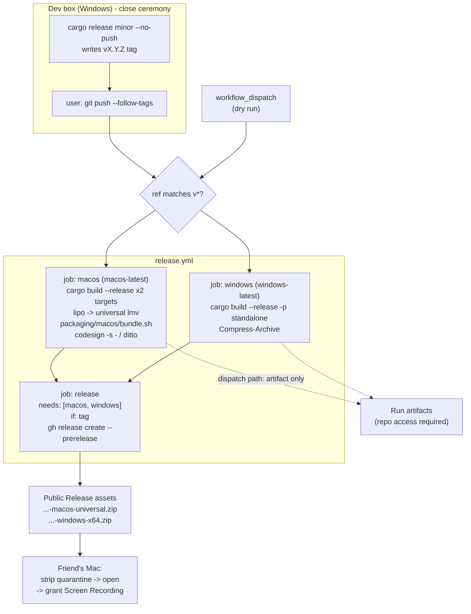

# 0036 — macOS and Windows release artifacts: a tag-driven Release with a universal `.app`

> **Status:** **in-progress 2026-08-04** — Phases 1-3 are `dev` and run in one session on
> `plan-0036-release-artifacts`; **Phase 4 is `human`** (push the tag, send the link), so the
> plan does not close in that session.
> **Created:** 2026-07-26
> **Approved:** 2026-07-26 — ready for `dev` (a fresh session; the handoff is manual on purpose)
> **Owner skill(s):** dev, human
> **Related ADRs:** [0038](../adrs/0038-tag-driven-release-unsigned-universal-mac-app.md) (this plan's decision), [0025](../adrs/0025-foobar-component-version-single-sourced.md) (version single-sourcing precedent), [0022](../adrs/0022-build-time-preset-embedding.md) (presets are embedded, not loaded from the zip)
>
> **Re-checked 2026-08-04, still valid, three notes for the implementer.** The user confirmed
> there is **no Mac in reach** — a friend has one — so this plan is the route and its
> open question at the bottom resolves to "no". `docs/nfr.md` §9's hardware matrix, which
> lists a "Mac, macOS 13+" as hardware the user has, is **wrong**; correct it in Phase 3
> alongside §8. Two citations have drifted since 2026-07-26: the silence-driven render path
> is `standalone/src/main.rs:998` (the `ScreenCaptureKit capture unavailable ...; rendering
> without audio` arm), not `:677`; and `README.md`'s macOS paragraph was rewritten on
> 2026-08-04 (`f7035a2`) to say the capture path is implemented-but-unvalidated and to name
> this plan as the missing piece — Phase 3's Download section lands **beside** that, and the
> "no Mac build to download yet" bullet in Platform notes comes out when it does.

## TL;DR

A pushed `v*` tag builds and publishes two downloadable zips. The macOS one contains a
**universal** (`arm64` + `x86_64`) `LightMusicVisualizer.app` — ad-hoc code-signed so the Screen
Recording prompt names *our app* rather than Terminal — alongside a reference copy of the shipped
presets and a short `READ-ME-FIRST.txt`. The Windows one contains `lmv.exe` and the same two
companions. Both are attached to a GitHub prerelease, which on a public repository is a plain
download URL the recipient can fetch without an account. The first user-visible behavior: the
user pushes a tag, and minutes later has a link to send a friend.

## Context & problem

The user wants to send a friend a runnable Mac build. Today that is impossible: `ci.yml` runs a
**debug** `cargo build` on `macos-latest` and discards it — no `upload-artifact`, no release job,
no packaging directory anywhere in the tree. Distribution is roadmap item 5 and has never been
designed.

Three constraints, established in [ADR-0038](../adrs/0038-tag-driven-release-unsigned-universal-mac-app.md):
the dev box is Windows and cannot link a Mach-O binary, so a macOS runner is the only build host;
ScreenCaptureKit's Screen Recording grant attaches to the launching process, so a loose binary
hands the permission to Terminal and a `.app` bundle is what makes the grant land on us; and the
repository is public, so a Release asset is an unauthenticated URL while a run artifact is not.

Compounding it: the macOS path has never run on Apple hardware. `standalone/src/capture_mac.rs`
compiles on every push but Plan 0001 Phase 10's on-device validation was deferred and remains
"the one outstanding piece of v1" (`docs/plans/README.md:1208`). This plan builds the vehicle;
the friend's first launch is also that validation.

The user's scope calls, from the interview: universal binary (target Mac unknown); a full
tag-driven release workflow rather than a one-off Mac artifact; the zip carries the app, the
preset `.toml` files and instructions; running with no audio is an acceptable outcome, so no
synthetic-audio mode and no BlackHole route; and tester instructions live in the zip only — no
`docs/` page, no `on-device-validation.md` section.

## Decision

Add a **separate** `.github/workflows/release.yml` (never a job inside `ci.yml`, which is a
per-push gate) triggered by `push` on tags matching `v*`, plus `workflow_dispatch` for
artifact-only dry runs. Three jobs: `macos` builds both Apple targets and fuses them with `lipo`,
then wraps the result via a checked-in `packaging/macos/bundle.sh`; `windows` builds the release
`lmv.exe`; and `release`, gated on both with `needs:` and on the ref being a tag, attaches both
zips to a GitHub prerelease using the runner's preinstalled `gh` CLI. If either build fails, no
Release exists — there is no half-published state.

The `.app` is minimal on purpose: `Info.plist` plus `Contents/MacOS/lmv`, no icon. Its version
fields are substituted at package time from root `Cargo.toml` `[workspace.package].version`,
parsed section-anchored exactly as `plugin-foobar/build.ps1` does, so there is no second version
string to drift (ADR-0025). The bundle is ad-hoc signed (`codesign -s -`) for a stable code
identity and zipped with `ditto -c -k --keepParent`, since `zip` does not round-trip a bundle's
symlinks and extended attributes.

## Architecture diagram



## Implementation phases

### Phase 1 — The macOS zip, end to end

- **Owner skill:** dev
- **What:** A pushed tag produces a friend-usable macOS zip: a universal, ad-hoc-signed
  `LightMusicVisualizer.app`, the reference `presets/*.toml`, and the tester instructions.
- **Files touched:** `packaging/macos/bundle.sh` (new), `packaging/macos/Info.plist.in` (new),
  `packaging/macos/READ-ME-FIRST.md` (new), `.github/workflows/release.yml` (new, `macos` job
  only in this phase).
- **Notes for the implementer:**
  - `rustup target add x86_64-apple-darwin` in the workflow, **not** a `targets` key in
    `rust-toolchain.toml` — that would cost every clone an extra target download for a
    CI-only need (NFR §4).
  - Build both targets with `--release -p standalone`, then
    `lipo -create -output <staging>/LightMusicVisualizer.app/Contents/MacOS/lmv`.
  - `Info.plist` keys: `CFBundleExecutable = lmv`, `CFBundleIdentifier =
    io.github.igorkonovalov.light-music-visualizer` (a reverse-DNS the user controls),
    `CFBundleName = LightMusicVisualizer`, `CFBundleDisplayName = Light Music Visualizer` (this
    is the string the TCC prompt shows), `CFBundlePackageType = APPL`,
    `LSMinimumSystemVersion = 13.0` (the ScreenCaptureKit floor, NFR §2),
    `NSHighResolutionCapable = true`, and `CFBundleShortVersionString` /`CFBundleVersion`
    substituted from the workspace version. The bundle directory name has **no spaces** so the
    README's Terminal one-liners stay copy-pasteable; the display name carries the pretty form.
  - Screen Recording has no `NS*UsageDescription` key to set — the prompt copy is
    system-generated. (Unverified whether a custom string is possible at all; out of scope
    either way.)
  - Zip a staging *folder* containing the app, `presets/` and `READ-ME-FIRST.txt`:
    `ditto -c -k --sequesterRsrc --keepParent <staging>/<name> <name>.zip`.
  - Asset name: `light-music-visualizer-v<version>-macos-universal.zip`.
- **Done when:** a `v*` tag push produces that zip as a run artifact, and the job's own verify
  steps — not a human eyeball — assert all of: `lipo -archs` on the bundled binary names both
  `arm64` and `x86_64`; `plutil -lint Info.plist` exits 0; `codesign --verify --strict` on the
  bundle exits 0; the plist's `CFBundleShortVersionString` read back with `plutil -extract`
  equals the version parsed from `[workspace.package]`; and the zip's top level holds
  `LightMusicVisualizer.app`, `READ-ME-FIRST.txt`, and a `presets/` directory containing every
  `presets/*.toml` in the repo and no `.md`. Any one of those failing fails the job.

### Phase 2 — The Windows zip and the Release job

- **Owner skill:** dev
- **What:** The same workflow builds the Windows standalone and, for a tag with both builds
  green, publishes one prerelease carrying both zips.
- **Files touched:** `.github/workflows/release.yml`, `packaging/windows/READ-ME-FIRST.md` (new).
- **Notes for the implementer:**
  - Windows: `cargo build --release -p standalone`, stage `lmv.exe` + `presets/*.toml` +
    `READ-ME-FIRST.txt`, `Compress-Archive` to
    `light-music-visualizer-v<version>-windows-x64.zip`. Parse the version the same
    section-anchored way `plugin-foobar/build.ps1` already does — reuse that logic's shape rather
    than a naive first-`version =` match, which would happily read a member crate's line.
  - `release` job: `needs: [macos, windows]`, `if: startsWith(github.ref, 'refs/tags/v')`,
    `permissions: contents: write`, `actions/download-artifact@v4` for both zips, then
    `gh release create` — no marketplace release action, since `gh` is preinstalled and a pinned
    third-party action would be a new dependency to justify (NFR §4).
  - `--prerelease` while the app is 0.x, with the tag as the title and a body naming the two
    platforms and the unsigned/quarantine caveat in one line each.
  - Re-running a workflow on an existing tag must not hard-fail: create the release if absent,
    otherwise `gh release upload --clobber`.
- **Done when:** a tag push with both builds green yields one prerelease with exactly two assets,
  both openable; a tag push where either build fails yields **no** release at all (verifiable by
  the `needs:` gate — the job is skipped, not merely red); a `workflow_dispatch` run produces both
  run artifacts and creates no release; and re-running the same tag's workflow replaces the assets
  rather than failing.

### Phase 3 — Sweep the docs the release process now contradicts

- **Owner skill:** dev
- **What:** Four documents that describe distribution or the repo layout are now wrong; make them
  match what ships.
- **Files touched:** `docs/releasing.md`, `docs/nfr.md`, `CLAUDE.md`, `README.md`.
- **Notes for the implementer:**
  - `docs/releasing.md` — the section after the `cargo release` command block gains the second
    half of the loop: the user pushes the tag (`git push --follow-tags`), which fires
    `release.yml`; what lands (two zips on a prerelease); and that pushing anything under
    `.github/workflows/` needs the `workflow` OAuth scope on the git credential
    (`gh auth refresh -s workflow` if the push is rejected).
  - `docs/nfr.md` §8 currently promises "unsigned standalone exe + a packaged `.fb2k-component`".
    Replace with what is true: a Windows standalone zip and a macOS **universal, ad-hoc-signed,
    unnotarized** `.app` zip, published from a tag; the `.fb2k-component` stays a local
    `build.ps1` artifact because the SDK is not in the repository. Keep the "no installer, no
    Developer ID signing in v1" posture — this plan does not change it.
  - `CLAUDE.md` "Where things live" gains `packaging/` with a one-line description.
  - `README.md` gains a short **Download** section: link the Releases page, name the two zips,
    and give the macOS quarantine one-liner. Point at the zip's `READ-ME-FIRST.txt` for the rest
    rather than duplicating it.
- **Done when:** `docs/nfr.md` §8 no longer claims CI ships a `.fb2k-component`; `docs/releasing.md`
  shows the tag push as the step that produces artifacts and names the `workflow` scope gotcha;
  `CLAUDE.md`'s tree lists `packaging/`; `README.md` has a Download section. No document states a
  hard version number or a preset count (both re-drift).

### Phase 4 — Push it, send it, hear back

- **Owner skill:** human
- **What:** The user runs the real thing and gets the friend's report — which is also Plan 0001
  Phase 10's deferred macOS on-device validation, finally exercised.
- **Steps:**
  1. Push the branch, then push the tag. If the workflow files are rejected, refresh the
     credential's `workflow` scope and retry.
  2. Watch the run; on success, copy the macOS asset URL from the prerelease and send it.
  3. Ask the friend for five specific things: does the `.app` open at all; does the Screen
     Recording prompt name "Light Music Visualizer"; after granting **and relaunching**, do the
     visuals react to music; what fps does `F3` show; and the contents of
     `~/Library/Application Support/light-music-visualizer/diagnostics.log`.
- **Done when:** the friend has launched the build and reported those five items. Anything broken
  routes back as its own `dev` follow-up (most likely `standalone/src/capture_mac.rs`); a clean
  run retires the Plan 0001 Phase 10 carry-forward.

## Data shapes

No Rust types change. The artifact layouts are the interface this plan defines:

```text
light-music-visualizer-v0.17.0-macos-universal.zip
└── light-music-visualizer-v0.17.0-macos-universal/
    ├── LightMusicVisualizer.app/
    │   └── Contents/
    │       ├── Info.plist              # version substituted from [workspace.package]
    │       └── MacOS/lmv               # universal: arm64 + x86_64, ad-hoc signed
    ├── presets/*.toml                  # reference copy; the app uses its embedded set
    └── READ-ME-FIRST.txt

light-music-visualizer-v0.17.0-windows-x64.zip
└── light-music-visualizer-v0.17.0-windows-x64/
    ├── lmv.exe
    ├── presets/*.toml
    └── READ-ME-FIRST.txt
```

`READ-ME-FIRST.txt` (macOS) must cover, in this order and in plain language: strip the quarantine
attribute (`xattr -dr com.apple.quarantine LightMusicVisualizer.app`) **or** right-click → Open,
because the build is unsigned; grant Screen Recording when prompted, then **relaunch** — the app
does not pick the permission up mid-run; **a window with visuals but no reaction to music means
audio capture did not start, not a crash** (`standalone/src/main.rs:677` renders silence-driven
visuals in that case), and running
`./LightMusicVisualizer.app/Contents/MacOS/lmv` from Terminal prints the reason a Finder launch
hides; the controls worth knowing (`Space` next preset, `Tab` browser, `F` fullscreen, `F3`
diagnostics overlay); where its files live (`~/Library/Application Support/light-music-visualizer/`
— an editable seeded copy of the presets, `config.toml`, and `diagnostics.log`); and what to send
back. Keep it short enough that a non-technical reader finishes it.

## Risks & open questions

- **Everything macOS runs for the first time.** Beyond ScreenCaptureKit: Metal adapter selection
  through wgpu, and glyphon's `FontSystem::new()` (`core/src/render/text.rs:79`) loading the system
  font set for the F3 overlay. Mitigation is framing, not code — the README pre-explains the
  degraded no-audio path so it is not reported as a crash, and Phase 4 asks for the Terminal
  stderr line that names the actual failure.
- **The ad-hoc signature changes every rebuild,** so TCC's grant does not survive a new build:
  the friend re-grants Screen Recording each time we send one, and stale entries pile up in System
  Settings. Accepted per ADR-0038; the README says so plainly so it reads as expected rather than
  broken.
- **The Mac job will be slow** — `lto = "fat"` and `codegen-units = 1` across two architectures.
  Use `Swatinem/rust-cache@v2` as `ci.yml` does and accept the wall-clock; it runs on tags, not
  pushes.
- **A tag push now publishes publicly.** Every future plan close that pushes its `cargo-release`
  tag creates a prerelease. That is the intended design, but it means the close ceremony's last
  step became outward-facing — worth a line in `docs/releasing.md` (Phase 3) so no one is
  surprised.
- **`gh release create` on an existing tag fails.** Phase 2's done-when covers the re-run path
  explicitly; without it, the first re-run of a tag is a red job for a non-reason.
- **Open question, deliberately unresolved:** whether a Mac ever gets into the user's own hands.
  If it does, `packaging/macos/bundle.sh` is runnable locally and the CI path becomes a
  convenience rather than the only route.

## What this plan does NOT do

- **No `.fb2k-component` in CI.** The foobar2000 SDK is third-party, separately licensed, and
  `.gitignore`'d — `git ls-files plugin-foobar/sdk` returns nothing — and `build.ps1` needs
  msbuild plus a toolset retarget. It stays a local artifact. NFR §8's promise of a packaged
  component in the release zip is corrected in Phase 3, not fulfilled.
- **No Developer ID signing, notarization, DMG, or installer** — NFR §8 defers all of it. Ad-hoc
  signing is not a step toward it beyond leaving `bundle.sh` a natural place to add it.
- **No app icon.** `assets/` holds only `test/`; making one is a design task, not a packaging one.
- **No `docs/macos-testing.md` and no macOS section in `docs/on-device-validation.md`** — the user
  chose zip-README-only. The Plan 0001 Phase 10 carry-forward stays where it is until results
  come back.
- **No synthetic-audio mode and no `shot` in the zip.** Considered as a way to prove rendering
  independently of the TCC grant; the user judged "no music is fine", and the app already renders
  without audio rather than failing.
- **No arm64 Windows build.** Windows stays x64-only.
- **No change to `ci.yml`.** Its debug macOS build stays the per-push gate; this workflow is the
  artifact producer.

## Followups (after this lands)

- Retire the Plan 0001 Phase 10 carry-forward in `docs/plans/README.md` once the friend's report
  lands (architect, at a later close).
- An app icon plus a `.dmg`, if the Mac path proves worth polishing.
- Notarization when there is an Apple Developer account — the one thing that makes permission
  grants survive updates.
- `.fb2k-component` in CI, only if the SDK's licensing permits a runner-side fetch.
