# 0038 — The line family's unreachable levers: `glow`, the readout's geometry, a level curve, and `log`

> **Status:** approved
> **Created:** 2026-07-27
> **Approved:** 2026-07-27 — ready for `dev` (a fresh session; the handoff is manual on purpose)
> **Owner skill(s):** dev, human
> **Related ADRs:** [0040](../adrs/0040-spectrum-level-curve-applies-before-the-easing.md) (this
> plan's decision — curve before easing, as a bindable exponent),
> [0036](../adrs/0036-preset-reachable-spectrum.md) (the spectrum surface),
> [0037](../adrs/0037-internal-grid-is-a-resolution-not-a-shape.md) (the constraint on Phase 2),
> [0035](../adrs/0035-asymmetric-attack-release-easing.md) (the easing Phase 3 orders against)
> **Backlog entries closed:** [0016](../design-backlog.md), [0017](../design-backlog.md),
> [0018](../design-backlog.md), [0019](../design-backlog.md)

## TL;DR

Four levers that **already exist inside the engine** are not reachable from a `.toml`. `glow` is an
argument of `LineRenderer::draw` that all four line scenes pass as a hardcoded `1.0`. `SPAN_X` and
`BASELINE_Y` are constants that pin the spectrum readout to ~56 % of the frame width and throw
`mirror_reflect`'s copy against the top edge. And the level→length map is strictly linear, with no
curve reachable except through a workaround that silently discards the scene's own easing.

This plan turns all four into bound parameters, adds `log(x)` to the expression grammar, and does it
**behaviour-preservingly**: every new parameter's default reproduces today's constant exactly, so
Phases 1–4 leave every golden baseline byte-identical. Only Phase 6, a `preset-author` pass, changes
what anything looks like.

## Context & problem

The 2026-07-27 `preset-author` batch (design-backlog 0016–0019) found four gaps in one sitting, all
verified against code. They share a shape worth naming: **the capability is built and the wire is
missing**. None needs a new render idiom, a new pipeline, a `Scene`-trait change or a C-ABI change.

**1. `glow` is plumbed and hardcoded.** `LineRenderer::draw(queue, encoder, view, aspect, glow,
xform, segments)` takes it; `parametric.rs:291`, `lsystem.rs:288`, `star.rs:271` and
`spectrum.rs:639` **all pass `1.0`**. It is the renderer's per-segment falloff — *not* a post-process
bloom, which remains the separate, undesigned backlog 0005. This is the cheapest item in the batch
and the only one that is not spectrum-specific: it lands on the rose, the L-system and the star too,
which is most of the line library.

**2. The readout's width is a constant, and density makes it bite.** `SPAN_X = 1.0`
(`spectrum.rs:78`) means the figure spans 2 world units, which the line renderer maps to the frame
**height** — about **56 % of the width at 16:9**, less on an ultrawide. `zoom` is no substitute: it
scales about the frame centre, so widening also lifts the baseline and grows the elements. It
compounds with element count: `MAX_ELEMENTS = SPECTRUM_BINS` (`spectrum.rs:73`) is the right ceiling,
but at 1920x1080 those 64 elements share **1080 px** — **16.9 px each** — where the full width would
give 30. The width limit is what makes the top of the legal range unusable.

**3. The baseline is a constant, so the mirror is wrong on this scene.** `BASELINE_Y = -0.85`
(`spectrum.rs:81`), and the geometry mirror reflects across the **x-axis** (`lines/mod.rs:227`:
`let y = if reflected { -p[1] } else { p[1] }`). Bars stand upward from `-0.85`, so a reflected copy
stands downward from `+0.85` — against the **top edge**, not mirrored about a shared centre line as
`mirror_reflect` means on every other line scene. Rendered and confirmed. **`pan_y` cannot fix it**
for a structural reason: the mirror runs in `update()` on world coordinates while the view transform
is applied later in the shader, so panning moves the mirrored pair together.

**4. There is no level curve, and no way to write one.** `element_length` is `base + scale * level`
(`spectrum.rs:214`). Audio level is perceptually logarithmic, so a linear readout leaves everything
but the loudest element stubbed. The grammar has `sqrt` and `pow` but **no `log`**. And the only
reachable workaround — bind `base` from `bin(index)`, set `scale = 0` — **discards the `levels` that
`[spectrum] smoothing` eases**, because that easing is scene state, not a binding. So today the
choice is *curve or easing, never both*.

## Decision

Bind all four, and add `log(x)` to the grammar so the shaping vocabulary is not scene-specific.

Per [ADR-0040](../adrs/0040-spectrum-level-curve-applies-before-the-easing.md): the level curve is a
**bindable exponent** (`curve`, default `1.0`), and it applies **before** the per-element easing, so
the smoother operates in the displayed domain the way meter ballistics do. The rejected alternatives
— easing first, a structural named-mode key, both together, and `log` alone — are recorded there.

`span` and `baseline` are **bindable world-space parameters**, not a fit mode.

> **The binding constraint, and it is not negotiable.** A scene that reads its render target's aspect
> to size itself is exactly the [ADR-0037](../adrs/0037-internal-grid-is-a-resolution-not-a-shape.md)
> trap, which has already shipped twice in this codebase (Plan 0029 on the attractor, Plan 0033 on
> the composite). `span` sets a **world** span; the renderer's existing aspect handling maps it. The
> honest consequence, which Phase 5 documents rather than hides: *"fill the width"* is therefore
> aspect-dependent — `span` ≈ 1.78 fills a 16:9 frame and leaves an ultrawide short. That is correct
> behaviour for a world quantity, and a `fit`/`auto` mode is **explicitly out of scope**.

**Everything defaults to today's constant.** `glow = 1.0`, `span = 1.0`, `baseline = -0.85`,
`curve = 1.0`. So Phases 1–4 are behaviour-preserving, and "every golden baseline byte-identical" is
an assertable done-when through Phase 5 — which is what makes this safe to land before Plan 0037's
transient probe exists.

## Architecture diagram

```mermaid
flowchart TD
    subgraph preset["preset .toml"]
        P["[params]<br/>glow · span · baseline · curve"]
        E["expression grammar<br/>+ log(x)"]
    end
    subgraph scene["SpectrumScene::update()"]
        DS["downsample<br/>64 bands -> N levels"]
        CV["curve<br/>level^curve"]
        EA["ease<br/>[spectrum] smoothing"]
        EL["element_length<br/>base + scale * level"]
        BU["build<br/>bars | polyline | radial_ring"]
    end
    subgraph render["LineRenderer"]
        DR["draw(.., glow, ..)"]
    end

    P --> CV
    P --> EL
    P -.span · baseline.-> BU
    P --> DR
    E --> P
    DS --> CV --> EA --> EL --> BU --> DR

    style CV fill:#2d4a22
    style EA fill:#2d4a22
```

The green pair is ADR-0040's ordering decision: **curve then ease**, not the reverse.

## Implementation phases

Each phase ships as its own commit. Phases 1–5 are `dev`; Phase 6 is the user's.

### Phase 1 — `glow` reaches all four line scenes
- **Owner skill:** dev
- **What:** The cheapest win and the widest, so it goes first: it establishes the param-plumbing
  pattern on four scenes at once with no geometry or timing risk. Closes backlog 0019.
- **Files touched:** `core/src/render/scenes/lines/{parametric,lsystem,star,spectrum}.rs`
- **Done when:**
  1. `glow` is a bound parameter on **all four** line scenes — in each scene's `PARAMS` const beside
     its `set_param` arm, so Plan 0019's drift guard covers it — replacing the hardcoded `1.0` at
     each `draw` call site.
  2. **Default is exactly `1.0`, and every golden baseline is byte-identical with no re-bless.** This
     is the phase's real assertion: a `glow` regression would otherwise be invisible.
  3. A rendered check that it is non-vacuous: one capture at a clearly different `glow` differs
     materially from the default. State the measured `frame_diff` in the commit body.
  4. The commit body says plainly that this is the renderer's **per-segment falloff**, not the post
     bloom of backlog 0005, so the two are not later mistaken for each other.

### Phase 2 — `span` and `baseline` become world-space parameters
- **Owner skill:** dev
- **What:** Retires the two constants pinning the readout's geometry. Closes backlog 0016 and 0018.
- **Files touched:** `core/src/render/scenes/lines/spectrum.rs`
- **Done when:**
  1. `span` and `baseline` are bound parameters (in `PARAMS`, whole-figure rather than per-element,
     so a series aimed at either takes its `index = 0` value per the existing trait rule), defaulting
     to **exactly** `1.0` and `-0.85`. `SPAN_X` and `BASELINE_Y` are gone as the source of truth.
  2. **Every golden baseline byte-identical, no re-bless.**
  3. **`baseline = 0` makes `mirror_reflect` mirror about the frame centre** — the symmetric
     "landscape and its reflection" figure — verified by a rendered capture, not by argument. This is
     the 0018 fix and it deliberately costs **no new mirror semantics**: the mirror still reflects
     across the x-axis exactly as it does on the other three line scenes, and moving the baseline to
     the axis is what makes that mean the right thing.
  4. Both are **world** quantities: `grep` the diff and confirm **no aspect or target size is read**
     anywhere in this scene to compute them (ADR-0037). A test or a stated inspection is fine; the
     claim must be checked, not assumed.
  5. `span` is documented as applying to `bars` and `polyline`, and being a **no-op on
     `radial_ring`** — consistent with `radius` already being a no-op on the other two. Same for
     `baseline` on the ring.

### Phase 3 — the level `curve`, applied before the easing
- **Owner skill:** dev
- **What:** ADR-0040's decision. The phase that makes a dB-like readout authorable *without*
  surrendering `[spectrum] smoothing`. Closes backlog 0017.
- **Files touched:** `core/src/render/scenes/lines/spectrum.rs`, `core/tests/` (a unit test on the
  ordering)
- **Done when:**
  1. `curve` is a bound parameter, default **exactly `1.0`**, applied as `level.max(0).powf(curve)`
     **to the downsampled level before the smoother**, per ADR-0040. The per-element pipeline reads
     `downsample -> curve -> ease -> element_length`.
  2. **Total on the hot path**: the level is floored at `0` and the exponent clamped to
     `[0.05, 4.0]` before the `powf`, so no author expression yields `pow(0, 0)`, `pow(0, -1)`, a
     `NaN` or an infinite length. Covered by a unit test over degenerate inputs, in the style of the
     grammar's existing totality tests.
  3. **The ordering is pinned by a test, because it is the ADR's whole content and is otherwise
     invisible.** A unit test over the pure per-element step asserts that curving-then-easing differs
     from easing-then-curving for a non-unit `curve` and a non-instant smoother — and **fails if the
     two are swapped**. Assert the *property*, not a tuned constant.
  4. `curve = 1.0` is exactly the identity (`powf(x, 1.0) == x`), so **every golden baseline is
     byte-identical, no re-bless**.
  5. The commit body records the interaction authors will hit first, with the arithmetic: measured
     typical levels are ~0.02–0.05, and at `curve = 0.5` a level of `0.03` becomes `0.173` — a
     **5.8x** boost — so a preset adopting a curve must bring `scale` down by roughly that factor.
     This is the reason the default must stay `1.0`.

### Phase 4 — `log(x)` joins the expression grammar
- **Owner skill:** dev
- **What:** The shaping vocabulary stops being scene-specific. Serves every system, not just this
  scene. Deliberately **after** Phase 3, because it does not substitute for the `curve` param — an
  expression cannot reach the scene's internal `levels`.
- **Files touched:** `core/src/preset/expr.rs`, `core/tests/preset.rs`, `docs/presets.md`
- **Done when:**
  1. `log(x)` is a registered function of **arity 1**, natural logarithm, so `log(0.1, 2)` is the
     same surfaced `WrongArity` load error as any other call and a bare `log` is still
     `UnknownIdent`. `VAR_NAMES`/function-count claims in docs are updated count-free where possible.
  2. It follows **`sqrt`'s existing posture** on degenerate input rather than inventing a new rule:
     `log(0)` is `-inf` and `log(-1)` is `NaN`, documented, with `select`/`max` as the guard idiom.
     Unit-tested at both, plus an exact interior value.
  3. `docs/presets.md` carries the worked dB example, since that is why it exists:
     `20 * log(x) / 2.302585` is decibels, and `log(0.03)` = `-3.5066` gives **-30.5 dB** for a
     typical measured level. State that the constant is `ln(10)` and that there is no `log10`.
  4. The hot-path panic pragma on `expr.rs` stays intact — no new `unwrap`/indexing.
  5. No existing expression changes meaning; the `preset` suite still passes and every shipped preset
     still loads warning-free.

### Phase 5 — the doc sweep
- **Owner skill:** dev
- **What:** The required operator-doc sweep. The three bolded rows of the architect's Mode 4 table
  are all in play here, and this lane's whole design rests on them being true.
- **Files touched:** `presets/README.md`, `docs/presets.md`, `docs/preset-palettes.md` (if `glow`
  belongs beside the colour surface)
- **Done when:**
  1. `presets/README.md`'s per-system roster carries `glow` on **all four** line scenes and `span`,
     `baseline`, `curve` on `spectrum`, with defaults and the whole-figure/per-element distinction.
  2. The `span` aspect consequence is stated honestly: it is a **world** quantity, so `span ≈ 1.78`
     fills a 16:9 frame and leaves an ultrawide short; there is deliberately no `fit` mode, and why.
  3. The `curve`↔`scale` interaction is documented with the 5.8x figure from Phase 3, and the
     `curve`↔`[spectrum] smoothing` coupling ADR-0040 names as its price — the same `release` looks
     different once a curve is engaged.
  4. `baseline = 0` is documented as the way to get a centre-mirrored readout, since that is the
     non-obvious fix for a thing that reads as a bug.
  5. No count-bearing sentence is introduced that will re-drift (the "Seven systems" → "Eight
     systems" lesson from Plan 0034's close).

### Phase 6 — adopt the new levers in the curated set
- **Owner skill:** human
- **What:** Runs the `preset-author` lane over the shipped presets now that the levers exist. Kept
  out of `dev`'s phases on purpose — this is content, and ADR-0017's lane split holds.
- **Done when:**
  1. At least one `spectrum_*` preset adopts `curve` and `span`, and at least one uses
     `baseline = 0` for a centre-mirrored figure — chosen by eye, verified with `--signal` (not
     `--set`, which cannot drive the spectrum array).
  2. `glow` is used on at least one non-spectrum line preset, since it lands on the whole family and
     the plan should not ship it unexercised.
  3. The behavioral gates still pass over the embedded set (`sanity`, `reactivity`, `animation`,
     `distinctness`), and `--report` is run before/after with the numbers stated.
  4. Any preset whose `scale` is retuned for a `curve` says so in its header, with the factor.

## Risks & open questions

- **The `curve`/easing coupling is a documented price, not a solved problem** (ADR-0040's main
  negative). An author who changes `curve` and then finds their `release` feels wrong has hit a real
  interaction. Phase 5 documents it; Plan 0037's transient probe is what would let anyone *measure*
  it, which is a reason to keep this plan's easing claims as properties rather than numbers.
- **Phase 2 is the ADR-0037 trap's natural habitat.** The whole point of `span` is framing, and the
  tempting implementation is "ask how wide the target is". Done-when 4 exists specifically to catch
  that, and it should be checked by grep rather than trusted.
- **`glow`'s visual range is unknown.** Nothing has ever varied it, so its useful span is
  unmeasured — Phase 1's non-vacuity capture is the first data point. If it turns out to be
  uninteresting across its range, that is a finding worth stating rather than quietly shipping a
  no-op param.
- **Unmeasured:** the per-frame cost of 64 `powf` calls is asserted negligible, not measured. It is
  almost certainly noise against the existing per-element work, but no number is claimed.

## What this plan does NOT do

- **No post-process bloom.** Backlog 0005 is a separate, undesigned stage; Phase 1 ships the
  renderer's existing per-segment falloff and the commit says so explicitly.
- **No `fit`/`auto` width mode.** Out of scope by decision, not by omission — it is the ADR-0037
  trap.
- **No true dB mode on the scene.** The exponent approximates the shape; a named `db` family is
  recorded in ADR-0040 as a reasonable later addition if the approximation proves insufficient.
- **No change to the band axis itself.** Backlog 0015 — the half-linear resolution profile — is DSP,
  is ADR-worthy in its own right, and is deliberately not bundled here.
- **No new mirror semantics.** Phase 2 fixes 0018 by moving the baseline, not by special-casing this
  scene's mirror.
- **No `log10`**, no new constants beyond what Phase 4 documents, and **no C-ABI change** (stays v4),
  no `Scene`-trait change, no new dependency.
