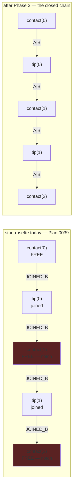

# 0040 — Line joins, finished: the star's other half, and a pin under the reported defect

> **Status:** approved 2026-07-28 — ready for `dev` (a fresh session; the handoff is manual on
> purpose). [Plan 0039](done/0039-line-joins.md) has closed, so nothing blocks it.
> **Created:** 2026-07-28
> **Owner skill(s):** dev
> **Related ADRs:** [0041](../adrs/0041-line-joins-are-per-endpoint-on-the-segment-instance.md)
> (the mechanism, already accepted — this plan finishes applying it, and its **Outcome** section is
> the source of Phase 3), [0023](../adrs/0023-golden-drift-guard-uses-frozen-fixtures.md) (why the
> new pin cannot join the golden roster)
> **Backlog entry closed:** [0024](../design-backlog.md)
> **No new ADR.** Every decision here was made in ADR-0041; what is left is an unfinished
> application of it plus test hygiene. There is no alternative worth rejecting in writing.

## TL;DR

Plan 0039's Mode 4 review found three things worth code. The star rosette is a **closed chain**, not
a set of pairs — its contact points are shared between adjacent petals, so half its joints were never
flagged and the notch survives at the sharper half. The shader tests raw bit literals with nothing
tying them to the Rust constants. And the defect that started all of this — the spectrum polyline's
notch — has **no committed baseline**, because the golden fixture for `spectrum` takes the `bars`
layout.

## Context & problem

### The star is a closed chain

`hankin.rs::star_rosette` builds petal `k` from two contact points on the unit circle:

```rust
let m0 = contact(k);
let m1 = contact(k + 1);
// ... both rays run inward and meet at `tip`
out.push(seg(m0, tip, JOINED_B));
out.push(seg(m1, tip, JOINED_B));
```

Petal `k + 1` then starts from `contact(k + 1)` — the same point, from the same closure, with the
same argument. So every contact point is shared by two segments' `a` ends, and the figure is

```
contact(0) -> tip(0) -> contact(1) -> tip(1) -> ... -> contact(n) == contact(0)
```

a closed chain in which **all `2n` vertices are joints**. Plan 0039 flagged the `n` tips.

ADR-0041's connectivity table said "`m0`/`m1` are free", and Phase 3 implemented that faithfully;
the error is in the analysis, not the mechanism. The per-endpoint flag expresses this topology
exactly — both segments at a contact point want `JOINED_A`, both at a tip already carry `JOINED_B` —
which is one more piece of evidence for the granularity ADR-0041 chose.

**The unflagged half is the sharper half.** The two rays leave a contact point `2 * contact_angle`
apart, so a stroke passing through turns by `pi - 2 * contact_angle` and the wedge is

```
half_width * tan(theta / 2) = half_width / tan(contact_angle)
```

which exceeds a half-width for any star pointier than 45 degrees, against a `contact_angle` clamped
as low as `CONTACT_MIN_DEG = 8` (`star.rs`). The gap left at a contact point is wider than the one
Plan 0039 removed at the tip.

The shipped test does not see this. `the_star_joins_in_pairs_at_the_petal_tip` asserts
`!close(pair[0].a, pair[1].a)` — the two contact points *within* one petal are distinct, which is
true and will stay true. It says nothing about the sharing *across* petals, so it passes unchanged
both before and after the fix.

### The shader's join bits are magic numbers

`renderer.rs` defines `JOINED_A = 1 << 0` and `JOINED_B = 1 << 1` in Rust; the WGSL tests
`(joined & 1u)` and `(joined & 2u)`. Nothing asserts the correspondence, and **a swap would not be
caught**: `line_joints.rs` probes only interior joints, where a chained segment carries both bits and
the two are indistinguishable.

### The reported defect has no pixel baseline

`core/tests/line_joints.rs` measures a *relative* property (a vertex is not a local luminance
minimum) and pins nothing. `core/tests/fixtures/spectrum.toml` takes the default `bars` layout, and
`spectrum_ridge` is a shipped preset guarded behaviorally per ADR-0023. So today, a shader edit could
silently reopen the notch on a gentler figure than the deliberately hostile zigzag and no baseline
would move.

**The pin cannot join the golden roster.** `core/tests/golden.rs` selects one fixture per
`SystemKind` through an exhaustive match, and `systems_rosters_every_variant` asserts no duplicate
stems and a count equal to `SystemKind::VARIANT_COUNT`. A second `spectrum` entry breaks the
invariant ADR-0023 rests on. `core/tests/composite.rs` is the precedent to follow instead: its own
`FIXTURES` array, its own baseline compare, and its own `LMV_BLESS` handling — which also means
blessing it is **scoped to its test binary** and cannot rewrite the roster, the standing trap that
made Plan 0039's Phases 2 and 3 restore unrelated files by hand.

## Decision

Finish applying ADR-0041 to the star, tie the shader's bits to the Rust constants with a test that
catches a swap, and pin the polyline join in pixels beside `composite.rs` rather than inside the
`SystemKind` roster.

Phase order is deliberate: the pin lands **first**, against today's correct behavior, so the two
later phases inherit a regression net they must leave untouched. Neither of them touches `spectrum`,
so "untouched" is a real assertion rather than a hope.

## Architecture diagram



The wedge at a red node is `half_width / tan(contact_angle)` — wider than the one already closed at
the tips.

## Implementation phases

Each phase ships as its own commit. All three are `dev`.

### Phase 1 — pin the reported defect in pixels

- **Owner skill:** dev
- **What:** A committed baseline under the zigzag capture `line_joints.rs` already takes, so a future
  shader edit that reopens the notch moves a file instead of passing quietly. Lands first, against
  behavior this plan does not change, so Phases 2 and 3 inherit it.
- **Files touched:** `core/tests/line_joints.rs`, `core/tests/golden/`,
  `core/tests/fixtures/README.md`, `docs/capturing.md`
- **Done when:**
  1. `line_joints.rs` compares its capture against a committed baseline, following
     `core/tests/composite.rs`'s pattern — its own compare, its own `LMV_BLESS` handling, scoped to
     `cargo test -p lmv-core --test line_joints`. **Blessing it must not be able to rewrite the
     golden roster**; say in the commit body that you checked, since the reverse trap cost Plan 0039
     two manual restores.
  2. It reuses the capture the existing test already takes. A second capture only if there is a
     reason — and then say the reason.
  3. Tolerances match `composite.rs` (`MEAN_TOL = 0.02`, `MAX_OUTLIER = 48`) unless a measurement
     says otherwise; if you deviate, state the measured number that forced it.
  4. **The existing relative assertion stays and still passes, unchanged.** The pin catches a silent
     change; the relative test says *why* the change matters. Both, not one — a baseline alone would
     let someone bless the notch back in.
  5. `core/tests/fixtures/README.md` currently says `line_joint_zigzag.toml` "pins no pixels and is
     never blessed". That stops being true here — correct it, and correct the `line_joints` row in
     `docs/capturing.md` for the same reason.

### Phase 2 — the shader's join bits stop being magic numbers

- **Owner skill:** dev
- **What:** Close the drift between `JOINED_A`/`JOINED_B` and the `1u`/`2u` the WGSL tests, and add
  the assertion that would catch a swap. Small and mechanical; it lands before Phase 3 so the star
  work runs on a primitive whose bit mapping is pinned.
- **Files touched:** `core/src/render/scenes/lines/renderer.rs`, `core/tests/line_joints.rs`,
  `presets/README.md`
- **Done when:**
  1. A divergence between the Rust constants and the bits the shader tests is a **compile error or a
     test failure**, not a silently wrong render. The mechanism is `dev`'s call — a `const _: () =
     assert!(...)`, formatting the constants into the shader source, or something better — state the
     choice and why in the commit body.
  2. **A test catches a swap of the two bits**, which today nothing does. The property to assert,
     stated rather than thresholded: on a chained figure the two **outer** ends are free, so the
     stroke must not extend past the figure's own first and last points. Swap the bits and it does —
     the first segment's `a` and the last segment's `b` each grow by a half-width. The existing
     zigzag fixture already has this shape (six elements, five segments, `joined[0] = JOINED_B` and
     `joined[4] = JOINED_A`), so this needs no new fixture — probe just outside the first and last
     points along the stroke direction and compare against the same interior samples the file
     already computes.
  3. Verify the new assertion the Plan 0039 way: **make it fail first.** Swap the two literals
     locally, confirm the test fires, restore them, confirm it passes. State both results.
  4. `presets/README.md`'s `### Line-art parameter notes (Plan 0010)` heading now labels content from
     three plans. Retitle it so it names the section rather than a plan number, and introduce no
     count-bearing sentence (the Plan 0034 lesson).

### Phase 3 — the star rosette's contact points join

- **Owner skill:** dev
- **What:** The review's one major. Two lines of `hankin.rs`, an amended test, one golden re-bless —
  and a look, because the contact point is a near-reversal and ADR-0041's accepted trade there is a
  bright bead rather than a gap.
- **Files touched:** `core/src/render/scenes/lines/hankin.rs`, `core/tests/golden/star_pattern.png`,
  `presets/README.md` (only if the bead is worth an author knowing about)
- **Done when:**
  1. Both segments at every contact point carry `JOINED_A` alongside their existing `JOINED_B`, so
     all `2n` vertices of the rosette are flagged.
  2. `the_star_joins_in_pairs_at_the_petal_tip` is amended or replaced to assert the sharing **across
     pairs**, not only within one: segments `2k + 1` and `2k + 2` share a contact point and both
     declare it joined. The shipped test passes unchanged after this fix, which is exactly why it
     needs replacing. Note the wrap-around pair — segment `2n - 1` starts at `contact(n)` and segment
     `0` at `contact(0)`, the same point computed two ways (`cos(TAU)` against `cos(0)`), so that one
     needs the existing `close` helper rather than an exact compare.
  3. **`star_pattern` is the only baseline that may move.** No other producer changed. Neither
     composite fixture draws a star — **verify that** rather than assuming it, and if a composite
     baseline moves anyway, that is a finding to report, not a stale golden. Restore every unrelated
     file before committing (`LMV_BLESS` over `--test golden` rewrites the whole roster).
  4. **Seen, not inferred.** Capture the star before and after at a `contact_angle` near the
     8-degree floor **and** at a mid value, and state in the commit body what a contact point now
     looks like at each. No threshold is asserted here and none should be invented: the question is
     whether the bead reads as a deliberate stud or as a defect. If it reads as a defect at the
     pointy end, **stop and route it back** — a miter limit is the thing that would fix it and that
     is an ADR-0041 supplement, not something to tune around here.
  5. If the bead is visible enough that a preset author would meet it, `presets/README.md`'s line-art
     notes say so beside the existing near-reversal paragraph. If it is not, say that in the commit
     body rather than touching the file.

## Risks & open questions

- **The bead may read worse than the gap at a pointy star.** This is the only real risk in the plan
  and it is why Phase 3 done-when 4 requires a look at the 8-degree end rather than at a comfortable
  default. ADR-0041 accepted the trade for the polyline sight-unseen; here we have a case sharp
  enough to test it, and the honest outcome may be "route it back".
- **A 512x512 baseline is larger than the roster's 128.** One PNG of a mostly-dark frame, so the
  repository cost is small, but it is a real cost and the alternative (a second, smaller capture) is
  a second GPU round trip per run. `dev` picks; the reasoning goes in the commit body.
- **Phase 1's pin makes the notch blessable.** A baseline can always be re-blessed by someone who
  assumes the diff is drift. That is why done-when 4 keeps the relative assertion: it fails loudly
  and explains itself, where a baseline only says "something moved".
- **Unmeasured:** the per-frame cost of flagging `n` more endpoints is asserted negligible — the flag
  is already in the instance, no instance count changes, and the shader work is identical. No number
  is claimed.

## What this plan does NOT do

- **No miter join, no miter limit, no join discs.** All three stay rejected on ADR-0041's grounds.
  If Phase 3's look says a miter limit is genuinely needed, that is a supplementing ADR and a
  separate plan — not a quiet addition here.
- **No new preset-facing parameter.** Joining stays unauthorable, for the reason Plan 0039 gave: a
  stroke that comes apart at its vertices is a defect, not a look.
- **No second `spectrum` entry in the golden roster.** ADR-0023's one-fixture-per-`SystemKind`
  invariant is enforced by a test; the pin goes beside `composite.rs` instead.
- **No `Scene` trait change, no C ABI change** (stays v4), and no new dependency.
- **No `spectrum_ridge` re-tune.** That is [Plan 0039](done/0039-line-joins.md)'s open Phase 5 and it
  belongs to `preset-author`, not to `dev`.
