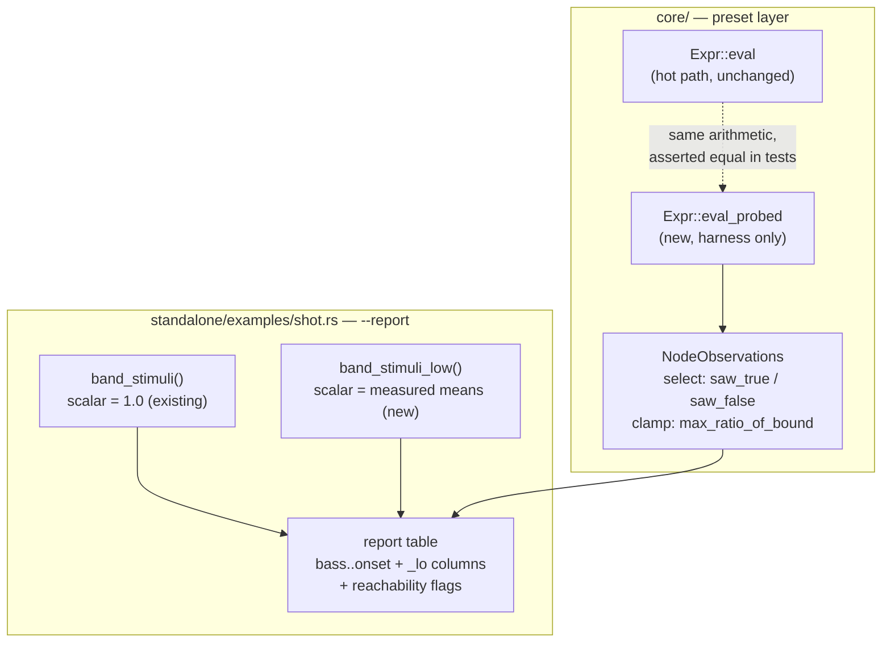

# 0041 — `--report` reads at two levels, and expression reachability is measured on the AST

> **Status:** in-progress 2026-07-29
> **Created:** 2026-07-28
> **Owner skill(s):** dev
> **Related ADRs:** [0042](../adrs/0042-reachability-measured-on-the-expression-tree.md)
> **Closes backlog:** [0020](../design-backlog.md#0020--the-shipped-library-is-gained-against-stimuli-6-100x-hotter-than-real-music)
> (the harness half), [0022](../design-backlog.md#0022--reports-reactivity-columns-are-structurally-blind-to-a-level-curve)

## TL;DR

`--report` gains a second set of reactivity columns measured at **realistic** band levels beside
today's full-scale ones, and a new **reachability** check that walks each preset's expression trees
and names any `select()` whose condition never took both values, or any `clamp()` whose upper bound
was never approached. After this, a preset whose headline mechanism has never once run — six of which
shipped for months — shows up as a flagged gate rather than as a healthy row.

## Context & problem

The `preset-author` lane's 2026-07-28 library audit found that comparison gates across the shipped set
were written against `--set bass=1` magnitudes rather than measured audio. On real material the
three-band sum peaks near `0.157`; thresholds of `0.90`, `0.55`, `0.42` and `0.22` are therefore dead
code. Six presets had their defining mechanism disabled — `fragment_kaleido` never left 6 folds,
`reaction_reef` never folded at all, `lsystem_arrowhead` never subdivided. Three remain dead.

**Every one of them scored healthy in `--report`**, because its band stimuli set the scalar to `1.0`
and at full scale every dead gate fires. The same full-scale property makes the report blind to a
level `curve` (backlog 0022: `1^curve = 1` at any exponent). One property of the instrument, two
classes of blindness, and the instrument is what all three lanes verify through.

The interview settled four points, recorded in [ADR-0042](../adrs/0042-reachability-measured-on-the-expression-tree.md):
keep full-scale and **add** a low-level reading (non-breaking, and the *gap* is the signal); flag both
dead branches and unreachable clamps; ship **advisory** and gate only after the library is clean;
stay on **synthesized** stimuli, leaving ADR-0039's rejection of a committed clip intact.

## Decision

We add a second, lower-level band stimulus to `--report` and print its reactivity beside the existing
columns, and we add an opt-in probed evaluation path to `core/src/preset/expr.rs` that records
per-AST-node reachability across a run. We rejected replacing the full-scale stimuli (silently
redefines every historical number quoted in the backlog and ADRs, and realistic levels are not
sample-rate-independent), inferring dead gates from frame differentials alone (the frame cannot tell
"never fired" from "both branches render alike", and cannot name *which* gate), and gating in CI
immediately (lands red on nine presets and blocks everyone on an unrelated content pass).

## Architecture diagram



## Implementation phases

### Phase 1 — A second band stimulus at realistic levels

- **Owner skill:** dev
- **What:** Add `band_stimuli_low()` beside the existing `band_stimuli()`, setting each scalar to the
  measured mean for its band rather than `1.0`, and lighting the matching spectrum slice
  proportionally (the existing `band_stimulus` already lights the array — this is the same shape with
  a level argument). Render each preset under both sets.
- **Files touched:** `standalone/examples/shot.rs`.
- **Done when:** the report computes and stores two reactivity triples per preset. The levels are
  taken from what `shot --signal dynamic:110` prints (`bass` mean `0.040`, `mid` and `treb` mean
  `0.006`), and the constants carry a comment naming that source and the date, so the next person to
  question them knows what to re-measure rather than guessing. Existing columns are byte-identical to
  before this phase — that is the non-breaking claim, and it is checkable by diffing a report run
  against one from the previous commit.

### Phase 2 — Probed evaluation in `core/src/preset/expr.rs`

- **Owner skill:** dev
- **What:** An opt-in `Expr::eval_probed(&self, vars, &mut Observations)` that computes exactly what
  `eval` computes while recording, per node index: for `Func::Select`, whether the condition has
  evaluated non-zero and whether it has evaluated zero; for `Func::Clamp`, the highest fraction of
  its upper bound the inner value reached. `Expr::eval` is **untouched** and stays the only thing the
  render path calls.
- **Files touched:** `core/src/preset/expr.rs`, plus a test module.
- **Done when:** for every expression in the embedded preset library, evaluated across a range of
  `Variables`, `eval_probed` returns a value identical to `eval` — this is the divergence risk ADR-0042
  names as the main cost of the approach, and it is the one thing here worth a dedicated test.
  Separately, a hand-built expression with a condition that is constant over the supplied variables
  reports that condition as one-sided, and one whose condition crosses reports it as two-sided.
  **No allocation and no observation recording occurs on the `eval` path** — verified by the hot-path
  pragma already on this module plus the absence of any new field on the types `eval` touches.

### Phase 3 — Surface both in the report

- **Owner skill:** dev
- **What:** Extend the `--report` table with the low-level reactivity columns and a reachability
  summary per preset, and name the specific offending gates below the family table (a count in the
  row, the detail underneath — the table is already dense and a per-gate column would not fit).
- **Files touched:** `standalone/examples/shot.rs` (table + JSON output).
- **Done when:** running `--presets presets --report` on the library as it stands flags the three
  presets whose gates are known dead (`attractor_dejong` at `bass + mid > 0.34`, `attractor_lorenz` at
  `bass + treb > 0.38`, `fragment_warp` at `bass + treb > 0.55`) and does **not** flag
  `fragment_kaleido`, `reaction_reef` or `lsystem_arrowhead`, whose gates were recalibrated on
  2026-07-28 and now fire. That contrast across a library containing both is the real acceptance
  test — it shows the check discriminates rather than flagging everything or nothing.
  The `tempo`-gated presets (`swarm_storm`, `attractor_lorenz`, `rose_zoom`) will flag under a single
  BPM and that is expected; the output wording must present a flag as a **suspect, not a conviction**,
  matching the discipline the existing columns already carry. The JSON output carries the same fields
  so the data is machine-readable.

### Phase 4 — Document what the columns and flags can and cannot see

- **Owner skill:** dev
- **What:** Extend `docs/capturing.md`'s report section with: how to read the two-level pair (the
  *gap* is the signal, and what each direction of gap means); why a `tempo` gate flags falsely under a
  fixed-BPM generator; and — the thing that would have prevented all of this — a statement in
  `presets/README.md` and `docs/presets.md` that comparison thresholds and band gains must be set from
  **measured** levels, with the measured table and a pointer to `--signal dynamic:110` for
  re-measuring. Today that table exists only in a comment inside `presets/spectrum_comb.toml`.
- **Files touched:** `docs/capturing.md`, `presets/README.md`, `docs/presets.md`.
- **Done when:** an author reading `presets/README.md` on how to write a `select()` threshold is told
  what range the bands actually occupy, in that document, without needing to open a preset to find it.
  Also fold in backlog [0027](../design-backlog.md#0027--two-engine-behaviours-that-are-correct-non-obvious-and-undocumented):
  `color_center` is cyclic (a negative centre wraps into the bright end, it does not clamp toward the
  dark one), and the ink pass is `mix(paper, ink, luminance)` and therefore **interpolates**, so
  inverting its poles does not darken a continuous field. Both cost the content lane multiple render
  round-trips in the session that raised this plan.

## Data shapes

```rust
// illustrative — not the final interface

/// Per-AST-node reachability, accumulated across a run. Lives only in the
/// harness path; nothing here is allocated or touched by `Expr::eval`.
#[derive(Default, Clone)]
pub struct Observations {
    /// Indexed by node position in the expression's node arena.
    pub nodes: Vec<NodeObservation>,
}

#[derive(Default, Clone, Copy)]
pub enum NodeObservation {
    #[default]
    Untouched,
    /// A `select()` condition: did it ever go each way?
    Select { saw_true: bool, saw_false: bool },
    /// A `clamp()`: the highest fraction of the upper bound the inner
    /// value reached. `< 1.0` across a whole run means the bound is
    /// decorative at this stimulus.
    Clamp { peak_fraction_of_bound: f32 },
}
```

## Risks & open questions

- **Divergence between `eval` and `eval_probed` is the main risk**, and it is the reason Phase 2's
  first done-when is an equality assertion over the real library rather than a spot check. If this
  proves awkward to keep in step, the fallback shape is a single `eval` generic over a
  zero-sized-vs-recording observer so there is literally one body — more type machinery, no
  divergence. `dev` may take that shape instead if the duplicated body looks fragile; say so in the
  phase commit if you do.
- **The realistic level becomes a de-facto standard.** Whatever number Phase 1 bakes in will be what
  every future preset is gained against, which is precisely the role `--set bass=0.8` played in
  causing this problem. The mitigation is the comment naming its provenance, not the number itself.
- **Open, deliberately not decided here:** what a fair *gate* floor looks like. A `tempo` gate is
  correctly dead under one BPM, so a CI gate probably needs multi-BPM runs or a `tempo` exemption.
  ADR-0042's Notes record this; it belongs to the plan that adds the gate.

## What this plan does NOT do

- **It does not re-gain the ~10 un-swept presets.** `attractor_*` (five), `fragment_aurora`,
  `fragment_pulse`, `fragment_warp`, `lsystem_fern` and `star_rosette` still carry dead gates and
  `--set`-calibrated gains. That is a `preset-author` content pass, sequenced deliberately **after**
  this plan so it can be verified by an instrument that can see the defect — doing it first means
  verifying it twice.
- **It does not add a CI gate.** Advisory only, per ADR-0042 and backlog 0009's precedent.
- **It does not touch the band axis.** Backlog 0015 (31 of 64 bands are linear, and the low end is
  the array's coarsest region) is a live, separate, ADR-worthy question about the DSP. Nothing here
  changes what `bin(x)` means.
- **It does not change `Expr::eval`,** the grammar, or anything the render path executes.
