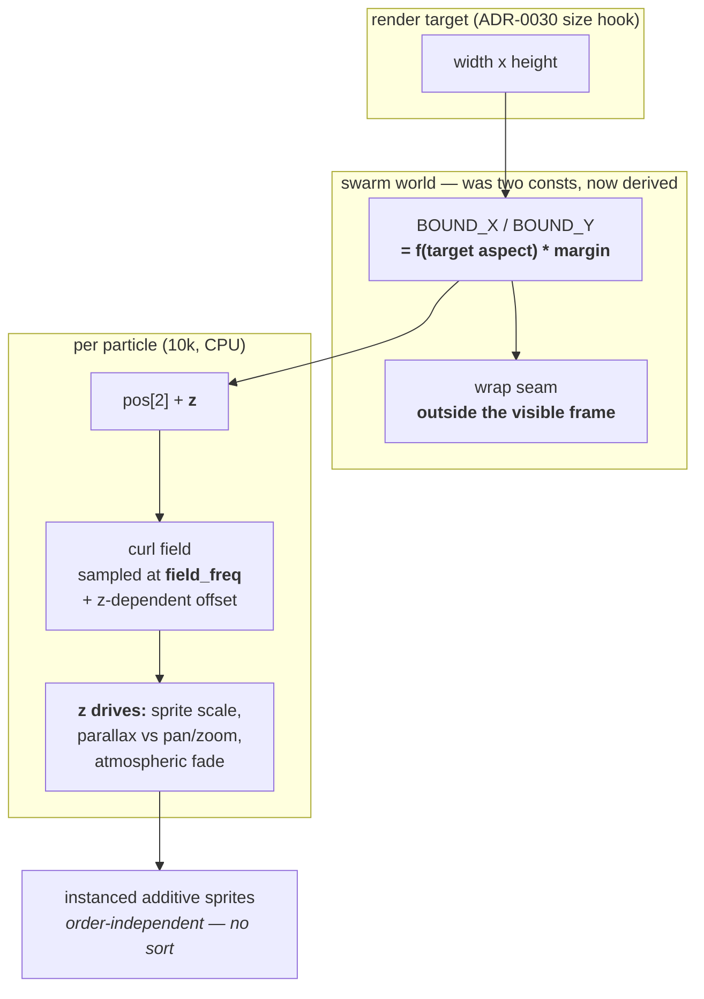

# 0043 — The swarm gets a depth axis and a domain that follows the target

> **Status:** draft
> **Created:** 2026-07-29
> **Owner skill(s):** dev
> **Related ADRs:** [0044](../adrs/0044-swarm-world-is-a-25d-torus-sized-from-the-target.md) (this
> plan's decision), [0037](../adrs/0037-internal-grid-is-a-resolution-not-a-shape.md) (the aspect
> rule being applied), [0030](../adrs/0030-scene-target-size-hot-path-hook.md) (the per-frame
> target-size hook this relies on)
> **Closes backlog:** [0029](../design-backlog.md), and [0025](../design-backlog.md) in full

## TL;DR

The swarm's toroidal wrap seam sits exactly on the visible frame edge, and the feedback stage burns
it into a bright bar across the top and bottom of every swarm preset. The same constants bake in a
fixed 16:9 that ADR-0037 rules against. And the scene has no depth axis, which is the standing
reason it cannot do the thing it is for. This plan makes the domain follow the render target with a
margin that puts the seam off-screen, adds a per-particle `z` used for scale, parallax and
atmospheric fade — no sorting, because additive blending is order-independent — and exposes
`FIELD_FREQ` as the bindable `field_freq`.

## Context & problem

Three findings, one file (`core/src/render/scenes/swarm.rs`), and they are entangled enough that
fixing them separately would mean touching the particle loop three times.

**The artifact (backlog 0029).** `BOUND_Y = 1.0` is the NDC frame edge. The wrap is toroidal, so
every particle that leaves the field teleports across at exactly that line — making it the one place
on screen every wrapping particle is guaranteed to paint. With `trails` in the 0.7–0.9 range the
whole family uses, that per-frame deposit accumulates into a saturated bar within a few hundred
frames while the interior drains. Reported by the user from the running app, reproduced headless
with `--frames 400`, present on all five swarm presets and predating the 2026-07-29 content retune.
No preset lever reaches it: `trails` dims bar and figure equally and the bar wins; `zoom` below
`1.0` exposes the domain rectangle instead, pinning the family at or above `1.0` — where the seam
is.

**The stale aspect.** The constants' own comment reads *"x is wider so the field fills 16:9 after
the shader's aspect divide"*. ADR-0037 established that anything computing screen-destined geometry
takes its aspect from the render target; this is a simulation domain doing exactly what that ADR
forbids, and it under- or over-fills on any non-16:9 target.

**The missing dimension (backlog 0025).** `Particle.pos` is `[f32; 2]`. There is no z, no parallax,
no perspective; the only depth cue is incidental (`bright = (0.25 + speed * 0.7) * p.bright`). The
user's standing complaint — *"they should look like flocks of birds, swirling and dancing in 3d-like
space"* — is not reachable by any combination of existing params. Backlog 0025 also flags
`FIELD_FREQ` as a `const 2.3` that sets vortex tightness, and therefore how many distinct streams
fit in frame, and recommends taking it first.

The swarm family is also the weakest-measuring one in the library and is being cut from five presets
to two or three. That makes this the moment to fix the engine underneath it — the surviving presets
should be authored against the scene as it will be, not as it is.

## Decision

Per [ADR-0044](../adrs/0044-swarm-world-is-a-25d-torus-sized-from-the-target.md): a **2.5D** world.
`Particle` gains one `z` in `0..1` driving sprite scale, a parallax offset against the shared view
transform, and an atmospheric brightness fade, with **no z-sorting and no perspective projection** —
additive blending is commutative, so the sort a 3D particle system normally needs buys nothing here.
Depth layers sample the flow field at a z-dependent offset so near and far particles ride different
currents; that is what separates volume from a scaled sprite sheet. The toroidal bounds derive from
the render target's aspect with a margin that puts the seam outside the visible frame, and
`FIELD_FREQ` becomes `field_freq`, defaulting to the `2.3` it replaces.

We rejected a true 3D field with perspective and sorting (a 3D noise field sampled 10 000 times per
frame against the 60 fps @ 1080p iGPU floor, buying occlusion that an additive scene has none of),
boids rules (O(n²), and the spatial hash that fixes that is a per-frame rebuild on a
must-not-allocate path), fading alpha near the seam (treats the symptom, keeps the 16:9 constant,
and a fade wide enough to hide an accumulated bar visibly darkens every frame), and respawning
instead of wrapping (trades one static bright line for 10 000 popping streaks — the reason the
existing wrap comment gives).

## Architecture diagram



## Implementation phases

### Phase 1 — the domain follows the target, and the seam leaves the frame

- **Owner skill:** dev
- **What:** replace `BOUND_X`/`BOUND_Y` constants with bounds computed from the render target's
  aspect (via the existing per-frame target-size hook) times a margin factor. The wrap must stay
  stable across a resize — recomputing bounds must not teleport every particle at once.
- **Files touched:** `core/src/render/scenes/swarm.rs`
- **Done when:** rendering `presets/swarm_drift.toml` for 400 frames under
  `--signal dynamic:110` shows **no bright horizontal band** at the top or bottom of the frame —
  the artifact reproduced by the pre-plan command in backlog 0029 is gone. The field fills the frame
  at 16:9 **and** at 16:10, where today it does not (this is the configuration the fixed constants
  agree with the target on, and therefore the one no existing test can distinguish — see ADR-0037's
  reasoning). A resize mid-run does not produce a visible discontinuity in the particle field.
- **Note:** pick the margin by measuring against the family's working `zoom` range (roughly
  1.0–1.3), not by picking a round number — the requirement is that the seam is off-screen across
  that whole range, and the cost of over-margining is visible density, which Phase 4 has to live
  with.

### Phase 2 — `field_freq` is a named param

- **Owner skill:** dev
- **What:** `FIELD_FREQ` becomes the bindable named param `field_freq`, defaulting to `2.3`.
- **Files touched:** `core/src/render/scenes/swarm.rs`, `presets/README.md`
- **Done when:** a preset binding `field_freq` visibly changes vortex tightness — a low value gives
  a few broad currents, a high one many tight swirls — and a preset that does *not* bind it renders
  byte-identically to before this phase (the default is exactly the constant it replaced, so the
  golden fixture for `swarm` must not move). `presets/README.md` lists it in the swarm roster.

### Phase 3 — the depth axis

- **Owner skill:** dev
- **What:** `Particle` gains `z`, seeded deterministically alongside the existing scatter. `z` drives
  sprite scale, a parallax offset against `zoom`/`pan_*`, an atmospheric brightness fade, and a
  z-dependent offset into the flow-field sample. No sorting, no projection matrix.
- **Files touched:** `core/src/render/scenes/swarm.rs`
- **Done when:** panning a swarm preset shows near particles traversing the frame measurably faster
  than far ones (parallax is present, not merely a scale change); the same seed produces the same
  `z` sequence run-to-run, so a capture at a fixed target size is reproducible (NFR §6); and the
  10 000-particle loop still holds the 60 fps @ 1080p floor on the iGPU test box (NFR 1/9) — this
  phase adds per-particle work to a hot path, so the floor is the acceptance criterion, not an
  afterthought.

### Phase 4 — re-author the surviving swarm presets

- **Owner skill:** dev
- **What:** the swarm family is cut from five presets to two or three, and the survivors are
  re-authored against the new levers (`field_freq`, depth parallax) and the new visible density that
  Phase 1's margin implies. `dev` owns this because it is the curation half — the content itself is
  `preset-author` work handed back through the normal route if the looks need iterating.
- **Files touched:** `presets/swarm_*.toml`
- **Done when:** the surviving presets each bind `field_freq` to something meaningful, no preset in
  the family shows the Phase 1 artifact, `--report` shows the family's `anim` improved against the
  pre-plan baseline (Burst 0.027, Dense 0.044, Drift 0.090, Flow 0.050, Storm 0.041), and the
  `sanity` / `reactivity` / `animation` / `distinctness` gates pass on the reduced set.

## Data shapes

```rust
// illustrative — not the final interface
struct Particle {
    pos: [f32; 2],
    vel: [f32; 2],
    /// 0 = far, 1 = near. Drives sprite scale, parallax and atmospheric fade —
    /// never sorting: the scene blends additively, so draw order is irrelevant.
    z: f32,
    hue: f32,
    bright: f32,
}
```

## Risks & open questions

- **The illusion flattens at density.** No occlusion means a dense near-field never hides a far one,
  and `Dense` is exactly that regime. If the surviving set keeps a dense preset, expect depth to
  read weakest there — that is a known limit of the 2.5D choice (ADR-0044), not a bug to chase.
- **Two look changes land together.** Phase 1's margin lowers visible density and Phase 3 changes
  every particle's size and brightness. The family will look different before Phase 4 re-tunes it;
  judging the intermediate states as regressions would be a mistake.
- **Hot-path budget is the real constraint.** Phase 3 adds work inside the 10 000-iteration loop.
  If the NFR floor is missed, the lever is `PARTICLES`, and that is a look decision that routes back
  here rather than being taken silently.

## What this plan does NOT do

- **No boids.** Cohesion/separation/alignment stays rejected on the real-time budget (ADR-0044
  Alternative B). It would need its own ADR and a measured budget.
- **No true 3D.** No projection matrix, no z-buffer, no sort — and if any of those is ever wanted,
  ADR-0044's reasoning is invalidated and Alternative A re-opens.
- **It does not touch the other scenes.** The aspect fix here is local to the swarm's domain; the
  composite already took its own under Plan 0035.
- **It does not change `PARTICLES`, `DAMPING`, or the curl-field construction.**
