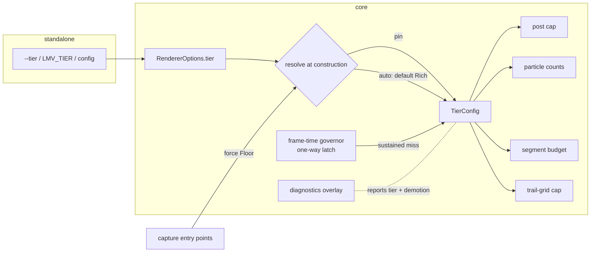

# 0044 — Quality tiers: `Floor` and `Rich`, a governor, and the constants that move

> **Status:** draft
> **Created:** 2026-07-30
> **Owner skill(s):** dev, human
> **Related ADRs:** [0045](../adrs/0045-quality-tiers-floor-and-rich.md) (tiers), [docs/roadmap-visual-richness.md](../roadmap-visual-richness.md) R0

## TL;DR

Build NFR §1's long-deferred second half: a `TierConfig` carrying the engine's quality
constants, resolved once at renderer construction — default `Rich` (calibrated to a
midrange discrete GPU), demoted to `Floor` (today's exact values) by a one-way frame-time
governor, pinnable explicitly. Captures and goldens pin `Floor`, so every baseline stays
byte-identical. First user-visible behavior: the standalone on the user's machine runs with
visibly higher particle/segment/resolution budgets, and the diagnostics overlay names the
active tier.

## Context & problem

Every capacity constant in the engine is tuned to the ~2015 iGPU floor and applied to every
machine (ADR-0045 Context lists them with file:line). The visual-richness review names this
the root cause capping richness, and the user's mandate is "even at the cost of performance".
The floor commitment itself stays: NFR §2 hardware must still get a good default.

**Sequencing:** Plan 0043 (in progress) owns `core/src/render/scenes/swarm.rs`. This plan
does not start until 0043 closes; its Phase 3 touches that file.

## Decision

Per ADR-0045: two named tiers, auto-selected `Rich` with a one-way governor demotion and an
explicit pin; `Floor` is byte-identical to today; captures force `Floor`. Rejected
alternatives (manual-only, continuous feature-shedding, raising the single tier) are in the
ADR.

## Architecture diagram



## Implementation phases

### Phase 1 — Walking skeleton: `TierConfig`, resolution, one consumer
- **Owner skill:** dev
- **What:** `Tier { Floor, Rich }` + `TierConfig` in `core` (Floor values = today's
  constants, moved, not retyped — each constant's definition site becomes the
  `TierConfig::floor()` initializer so no number exists twice). Renderer construction takes
  an optional pin; default resolves `Rich`. One consumer converts: the post-stage cap
  (`Floor` 1920x1080 = today; `Rich` 2560x1440, the value ADR-0034 priced and declined at
  floor budgets). Standalone grows `--tier floor|rich` and reads `LMV_TIER`; all capture
  entry points force `Floor`.
- **Files touched:** `core/src/render/mod.rs`, new `core/src/render/tier.rs`,
  `core/src/render/post.rs`, `standalone/src/lib.rs`, `standalone/src/main.rs`,
  `standalone/examples/shot.rs`.
- **Done when:** the diagnostics overlay and `--report` header name the active tier; a
  `Rich` run reports a larger post grid than a `Floor` run for the same window; every
  golden and capture is **byte-identical** (captures pin Floor); C ABI untouched at v4.

### Phase 2 — The governor
- **Owner skill:** dev
- **What:** a pure decision function over the smoothed frame-time series (Plan 0011's
  diagnostics already measure it): a sustained miss of the display budget demotes
  `Rich -> Floor` once per session (one-way latch, the dual-live freeze shape at
  `render/mod.rs:96` is the precedent); a pinned tier never demotes; the demotion is
  reported in the overlay and log line, never silent. Hysteresis is a property, not a magic
  number: a single spike must not demote, a sustained miss must, and the plan's test drives
  the function with injected series for both.
- **Files touched:** `core/src/render/tier.rs`, `core/src/render/mod.rs`,
  `standalone/src/main.rs` (overlay line).
- **Done when:** unit tests show (a) an isolated spike does not demote, (b) a sustained
  miss demotes exactly once, (c) a pin never demotes; headless captures never demote (they
  are pinned Floor by Phase 1).

### Phase 3 — Spread `TierConfig` over the remaining constants
- **Owner skill:** dev
- **What:** convert the remaining floor-cited caps to tier values: attractor
  `PARTICLE_COUNT` and `TRAIL_MAX_W/H`, line `MAX_SEGMENTS`, swarm `PARTICLES` (0043 has
  closed by now). Rich starting values are **provisional multipliers, expected to be
  corrected by Phase 4's measurement**: attractor 50k -> 150k, segments 20k -> 60k, swarm
  10k -> 30k, attractor trail cap -> target-sized with a 4K ceiling. The RD simulation grid
  stays 256² in both tiers — it is a *content*-changing constant (ADR-0034: pattern scale
  moves with the grid), deliberately out of scope here.
- **Files touched:** `core/src/render/scenes/particles/mod.rs`,
  `core/src/render/scenes/lines/mod.rs`, `core/src/render/scenes/swarm.rs`,
  `core/src/render/tier.rs`.
- **Done when:** no floor-cited capacity constant remains outside `TierConfig` (grep for
  the ADR-0045 Context list); Floor-tier goldens still byte-identical; a Rich-tier smoke
  capture at each converted scene renders without validation errors at the raised budgets.

### Phase 4 — Rich-tier calibration on the target hardware
- **Owner skill:** human
- **What:** run the standalone pinned `Rich` on the user's discrete GPU at native
  fullscreen across a representative preset set (heaviest of each family: an attractor, a
  dense line preset with mirror + fold, swarm, RD, spectrum), reading the diagnostics
  frame-time. Record the numbers in this plan file.
- **Done when:** measured frame time holds the display rate on every representative preset,
  or the misses are listed with numbers so the closing `dev` step can lower the specific
  Rich values that missed. No number is invented: the constants that ship are the measured
  ones.

### Phase 5 — Docs sweep and NFR update
- **Owner skill:** dev
- **What:** `docs/nfr.md` §1 gains the now-real tier mechanism (and stops calling it a
  follow-up); `README.md` documents `--tier`/`LMV_TIER`; `docs/capturing.md` states that
  captures pin Floor and why; `presets/README.md` gains one sentence: shipped presets are
  authored and gated on Floor, Rich raises capacity not behavior.
- **Files touched:** `docs/nfr.md`, `README.md`, `docs/capturing.md`, `presets/README.md`.
- **Done when:** the four docs agree with the shipped behavior; no stale "deferred tier
  system" phrasing survives a grep.

## Data shapes

```rust
// illustrative — not the final interface
pub enum Tier { Floor, Rich }

pub struct TierConfig {
    pub post_cap: (u32, u32),
    pub attractor_particles: u32,
    pub attractor_trail_cap: (u32, u32),
    pub swarm_particles: u32,
    pub max_segments: u32,
    // bloom_levels joins here when ADR-0046 lands
}

pub struct RendererOptions {
    pub tier: Option<Tier>, // None = auto (Rich + governor)
}
```

## Risks & open questions

- **Buffer sizes become tier-dependent.** The line instance buffer and particle buffers are
  allocated at construction from what were compile-time constants; the allocation paths must
  take the config value without introducing hot-path branching. Allocation stays at
  construction/reconfigure time only.
- **A demotion mid-session reallocates.** Dropping from Rich to Floor shrinks buffers and
  grids; the trails-blink-on-reallocate behavior (trails.rs:369) will fire once at demotion.
  Accepted: demotion is a rare, visible event.
- **Rich multipliers are guesses until Phase 4.** Named as provisional in Phase 3; the
  measured values are the contract.
- **WARP suite cost must not move** — captures pin Floor; Phase 1's byte-identical done-when
  is the guard.

## What this plan does NOT do

- No HDR, bloom, or format change (Plan 0045 / ADR-0046).
- No RD grid change in either tier (content-changing; its own future decision).
- No C ABI change and no plugin tier picker (future ABI question per ADR-0045).
- No auto-promotion Floor -> Rich (one-way by design).
- No preset-visible tier variable in the grammar.

## Followups (after this lands)

- ADR-0046's `bloom_levels` joins `TierConfig`.
- A plugin-side tier setting if foobar users ask (ABI-touching, ADR-worthy).
