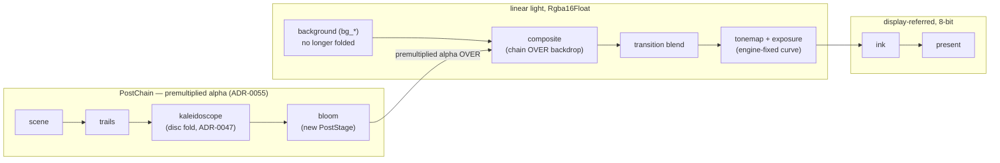

# 0045 — Linear light: the HDR composite, the bloom stage, and the fold that had to be fixed first

> **Status:** in-progress 2026-07-31 — Phases 1-2 done (the fold is confirmed: **falloff-disc
> ships**, [ADR-0047](../adrs/0047-kaleidoscope-fold-domain-disc-with-falloff.md) now carries an
> Outcome). **Phase 2b (`dev`) is next and Phase 3 is gated on it** — Phase 2 surfaced that the
> falloff fades to black rather than to the backdrop, whose cause is structural
> ([ADR-0055](../adrs/0055-backdrop-leaves-the-post-chain.md)). Phase 2's own cleanup
> (delete the losing fold variants, the temporary `kaleido_domain` switch, and `docs/samples/`)
> is **owed by `dev`** and folds into Phase 2b's commit.
> **Created:** 2026-07-30
> **Owner skill(s):** dev, human
> **Related ADRs:** [0046](../adrs/0046-linear-light-hdr-composite-bloom-tonemap.md) (linear-light + bloom + tonemap),
> [0047](../adrs/0047-kaleidoscope-fold-domain-disc-with-falloff.md) (fold domain, **confirmed
> 2026-07-31 with an Outcome**),
> [0055](../adrs/0055-backdrop-leaves-the-post-chain.md) (the backdrop leaves the chain;
> premultiplied alpha through the composite — added mid-plan by Phase 2),
> [0045](../adrs/0045-quality-tiers-floor-and-rich.md) (tier values this plan consumes).
> [docs/roadmap-visual-richness.md](../roadmap-visual-richness.md) R1.

## TL;DR

Convert the composite to linear-light `Rgba16Float` end to end, add one engine-fixed
tonemap + exposure pass before ink, and add a bloom `PostStage` with the bindable params
`exposure`, `bloom_amount`, `bloom_threshold`, `bloom_radius`. First, fix the kaleidoscope
fold (disc + falloff + bindable centre, ADR-0047) so bloom builds against settled
resampling. First user-visible behavior: stacked bright strokes roll off instead of
clipping, and a preset can bloom on the beat. This is the roadmap's single largest visible
change; every golden baseline moves exactly once, deliberately.

## Context & problem

The 8-bit additive composite is an undecided default whose measured costs (additive
ceiling, clipped accumulations, haze-not-light glow, backlog 0005's twice-requested bloom)
are catalogued in ADR-0046's Context. The kaleidoscope fold defect (backlog 0010/0011)
gates the bloom stage per backlog 0005's own sequencing note. **This plan runs after Plan
0044** — bloom's blur-level count and any float-bandwidth relief on Floor are `TierConfig`
values.

## Decision

Per ADR-0046 (full linear-light conversion; engine-fixed tonemap; four bindable params;
formats identical across tiers) and ADR-0047 (disc fold with radial falloff + bindable
centre, confirmed against rendered samples 2026-07-31). Rejected alternatives are recorded
there.

**Added mid-plan by Phase 2:** ADR-0055 — the backdrop leaves the post chain and is
composited underneath an alpha-carrying chain. This was not in the original scope; Phase 2's
sample set exposed that ADR-0047's "the falloff lands on the backdrop" is false as shipped,
and the cause is that the backdrop is rendered *into* the fold's own input. The user routed it
here rather than to the backlog, and chose it as a phase inside this plan rather than a
separate one.

## Architecture diagram

The backdrop sits **under** the chain rather than inside its input — that is Phase 2b's change
(ADR-0055), and it is what makes the fold's falloff land on `bg_*` instead of on black. Both
live chains composite their own backdrop before the transition blend, so a dissolve keeps each
side's `bg_*`.

## Implementation phases

### Phase 1 — The fold: disc + falloff + centre, with the sample set
- **Owner skill:** dev
- **What:** implement ADR-0047's falloff-disc fold and the `kaleido_center_x/y` params,
  keeping the plain hard-disc clamp and a wrap-address variant behind a temporary
  test-only switch. Render the confirmation set: a centred figure (`star_rosette` or
  `fragment_kaleido`) and a border-filling field (`swarm_storm`) under all three
  treatments, at 1920x1080 **and** a portrait size (e.g. 900x1600), committed under a
  scratch `docs/samples/` path for Phase 2. Re-bless `composite_kaleido.png` **by hand**
  (the Plan 0035 trap: the guard stays green at 94 % of budget and will not announce the
  fix) and add the direct guard backlog 0010 owes — an assertion on the out-of-disc pixel
  statistic using the border-filling fixture.
- **Files touched:** `core/src/render/kaleidoscope.rs`, `core/src/render/scenes/mod.rs`
  (param routing), `core/tests/composite.rs`, `core/tests/golden/composite_kaleido.png`,
  `presets/README.md` (two params).
- **Done when:** at portrait aspect the fold shows no edge streaks (the new guard asserts
  it); `swarm_dense.toml`'s "pinned to dodge the defect" comment is obsolete (left for the
  content lane to act on); the three-way sample set exists at both aspects.

### Phase 2 — The user picks the fold treatment — **DONE 2026-07-31**
- **Owner skill:** human
- **What:** confirm or flip ADR-0047 from the rendered samples (falloff-disc vs hard disc
  vs wrap), at both aspects. **Stopping condition:** if the falloff-disc is rejected, stop
  and route back to `architect` — ADR-0047 gets an Outcome and the alternative ships
  instead; do not proceed to Phase 3 with an unconfirmed fold.
- **Done when:** the pick is recorded in ADR-0047 (Outcome note), the losing variants and
  the temporary switch are deleted, and the sample files are removed.
- **Outcome:** **the falloff-disc is confirmed** — the stopping condition did not fire. The
  pick and its reasoning are recorded in ADR-0047's Outcome section, together with two
  findings the samples produced: this ADR's model of the plain-clamp alternative was wrong
  (it draws a sunburst of rays, not a flat ring), and a fourth treatment (`vignette`) was
  rendered and rejected. **The deletion half of the done-when is carried into Phase 2b** —
  it is `dev` work in the `lmv-plan-0045` worktree, and doing it in the same commit as the
  alpha restructure keeps one golden re-bless instead of two. A third finding — the falloff
  fades to black rather than to the backdrop — is what Phase 2b exists to fix.

### Phase 2b — The backdrop leaves the chain: premultiplied alpha through the composite
- **Owner skill:** dev
- **What:** implement [ADR-0055](../adrs/0055-backdrop-leaves-the-post-chain.md). The chain's
  stage inputs clear **transparent**; each stage propagates alpha instead of forcing `1.0`
  (for the kaleidoscope this is the fix — the falloff weight `w` multiplies **colour and
  alpha together**, so it fades to transparent, not to black); `Background` renders into the
  chain's **destination** rather than the first active stage's input, and the **last active**
  stage's resolve blends `PREMULTIPLIED_ALPHA_BLENDING` over it instead of `REPLACE`
  (intermediate resolves stay `REPLACE`); the trails accumulation decays alpha on the same
  schedule as colour. The no-active-stage path is untouched. **Also do Phase 2's owed
  cleanup in this commit:** delete the losing fold variants and the temporary
  `kaleido_domain` switch (including its `presets/README.md` entry and the `Repeat`-sampler
  branch), and `git rm -r docs/samples/`.
- **Files touched:** `core/src/render/post.rs` (routing + the resolve blend),
  `core/src/render/background.rs` (destination), `core/src/render/kaleidoscope.rs` (alpha in
  the falloff; variant deletion), `core/src/render/trails.rs` (alpha decay),
  `core/tests/composite.rs` + a new lit-backdrop fixture, affected `core/tests/golden/*`,
  `presets/README.md`, `docs/samples/` (removed).
- **Done when:** a capture at **`bg_bright > 0`** with the fold active shows the falloff
  landing on the backdrop rather than darkening toward black — asserted, not eyeballed, since
  this is the configuration the sixteen Phase 1 samples did not have and therefore could not
  have caught; `bg_vignette` is no longer replicated into the fold's wedges (assert the
  backdrop's radial darkening stays frame-centred while `kaleido_center_*` is moved off
  centre); with every post stage inactive, existing baselines are **byte-identical** (the
  untouched-path claim, proven the Plan 0038 way); `kaleido_domain` is gone from the code,
  the params list and `presets/README.md`; `docs/samples/` is gone.

### Phase 3 — The float composite and the tonemap pass
> **Gated on Phase 2b.** Do not start this phase until the alpha model is settled — a tonemap
> on top of an alpha bug makes the alpha bug unreadable in a capture (ADR-0055, Notes).

- **Owner skill:** dev
- **What:** move scene targets, trails-composited, kaleido-src, blend snapshot/live and
  ink-src from the surface format to `Rgba16Float`; add the tonemap + exposure fullscreen
  pass between blend and ink. The curve is chosen here (extended-Reinhard or a filmic fit)
  against ADR-0046's property: monotone, hue-preserving, near-identity below mid-range —
  demonstrated by a unit test that a frame with all values ≤ ~0.8 maps within a small
  tolerance of identity, and a saturating ramp maps monotonically without channel
  crossover. `exposure` becomes a bound named param (default 1.0). Re-bless all goldens
  **eyes-on, scene by scene** — each baseline diff is inspected and the commit message
  says what changed visually per scene; `LMV_BLESS` rewrites every baseline, so the
  unrelated-restore trap is in effect at full width.
- **Files touched:** `core/src/render/mod.rs`, `post.rs`, `trails.rs`, `kaleidoscope.rs`,
  `transition.rs`, `ink.rs`, new `core/src/render/tonemap.rs`, scene present pipelines
  (`fragment_field.rs`, `reaction_diffusion.rs`, `particles/mod.rs`, `swarm.rs`,
  `lines/renderer.rs`), `core/tests/golden/*`.
- **Done when:** the composite carries float linear values from scene to blend (asserted
  by a test reading back an over-1.0 accumulation before tonemap); two overlapping
  full-brightness strokes no longer clip to flat white after tonemap (capture-level
  assertion: the overlap region is brighter than a single stroke but below clip); goldens
  re-blessed with the per-scene inspection note; NFR §12 arithmetic re-done in
  `post.rs`'s docstring for the float sizes.

### Phase 4 — The bloom stage
- **Owner skill:** dev
- **What:** `Bloom` joins the `PostChain` after `Kaleidoscope` (`STAGE_COUNT` 2 -> 3):
  threshold bright-pass, separable blur pyramid (level count from `TierConfig`), additive
  recombine. Bindable `bloom_amount` (default 0.0 — stage inactive, unbuilt, exactly the
  existing skip discipline), `bloom_threshold`, `bloom_radius`. Per-stage capture tests in
  the `composite.rs` pattern; WARP pipeline-count sensitivity means the stage gets its own
  gated test rather than joining a mega-composite case.
- **Files touched:** new `core/src/render/bloom.rs`, `core/src/render/post.rs`,
  `core/src/render/scenes/mod.rs` (param routing), `core/src/render/tier.rs`
  (`bloom_levels`), `core/tests/composite.rs` + new fixture + baseline.
- **Done when:** with `bloom_amount = 0` every existing baseline is byte-identical (the
  default-off claim, proven the Plan 0038 way); a fixture with a small bright core shows a
  halo whose extent grows with `bloom_radius` and whose energy grows with `bloom_amount`
  (relative assertions, no magic thresholds); at Floor the level count is lower and the
  stage still passes its capture test.

### Phase 5 — Docs sweep
- **Owner skill:** dev
- **What:** `presets/README.md` — the four new params + `kaleido_center_*`, the "authoring
  against the additive ceiling" guidance rewritten for the tonemap era (the craft.md
  additive-ceiling rule changes meaning); `docs/preset-palettes.md` — one paragraph on
  linear-light sampling of the LUT; `docs/presets.md` — untouched grammar, but the worked
  examples that mention clipping get a sentence; `docs/capturing.md` — the re-bless record
  and the tonemap's effect on pixel-level assertions; `docs/nfr.md` §12 — the float memory
  table.
- **Files touched:** the five docs above.
- **Done when:** the three preset-author-facing docs describe every new param and the
  changed luminance model; no doc still describes the 8-bit clip as the operative ceiling.

### Phase 6 — Rich-tier validation on the target hardware
- **Owner skill:** human
- **What:** run the standalone pinned Rich on the user's discrete GPU: the heaviest fold +
  trails + bloom preset at native fullscreen, watching frame time; and a Floor-pinned run
  on the same machine as a sanity check of the floor path. Record both in this plan.
- **Done when:** frame time holds the display rate at Rich with bloom active on the
  representative set, or the misses are recorded with numbers for the close to act on
  (lower `bloom_levels` at Rich, or the post cap — the levers are named in ADR-0046).

## Data shapes

No new public structs; the C ABI stays v4. New named params (all ordinary bindables):
`exposure`, `bloom_amount`, `bloom_threshold`, `bloom_radius`, `kaleido_center_x`,
`kaleido_center_y`.

## Risks & open questions

- **The golden re-bless is the dominant cost and the dominant risk.** Phase 3 moves every
  baseline once; the eyes-on-per-scene discipline is the mitigation, and the
  `LMV_BLESS`-rewrites-everything trap applies in every later phase too (restore unrelated
  WARP-noise rewrites before staging — Plans 0033/0039/0040 all hit it). **Phase 2b moves the
  lit-backdrop subset a second time** — that overlap is accepted deliberately (ADR-0055's
  third Negative) to keep the alpha restructure separately reviewable from the float
  conversion.
- **Phase 2b's defect class is invisible at the configuration we author at.** Alpha bugs in
  the chain only show against a lit backdrop, and near-black backdrops are the norm across the
  library — which is exactly why sixteen Phase 1 samples missed the black-fade in the first
  place. The mitigation is that Phase 2b's done-when *requires* a `bg_bright > 0` fixture; do
  not let it be satisfied by a capture on a dark preset. Same shape as ADR-0037's lesson: a
  configuration where two things coincide cannot tell you which one the code used.
- **Floor-tier bandwidth is unmeasured until on-device.** The float chain roughly doubles
  composite bandwidth; the named relief lever is the Floor post cap (post.rs docstring
  already prescribes lowering it). Phase 6 measures the Rich side; the Floor side on real
  iGPU hardware stays with the standing on-device checklist.
- **WARP pipeline-count sensitivity** (documented DX12 mis-render pressure): three new
  pipelines (tonemap, bright-pass, blur/recombine). Mitigation: lazy build + skip at
  default, per-stage gated tests, exactly the existing discipline.
- **Tonemap vs the QA metrics:** `metrics.rs` measurements and the `animation`/`reactivity`
  floors read post-tonemap pixels; a near-identity below mid-range keeps today's readings
  comparable, but Phase 3 must re-run `--report` over the library and note drift rather
  than assume none.
- **Ink after tonemap** is semantically today's behavior, but the pole arithmetic in
  backlog 0027's worked example should be re-checked once during Phase 5's doc sweep.

## What this plan does NOT do

- No transformed feedback (`fb_zoom`/`fb_rotate`/warp) — that is R2, its own ADR + plan,
  built *on* this pipeline.
- No layer composition, no blend-mode surface (R3).
- No preset adoption pass — `preset-author` gets the new params after close (R6 territory);
  this plan only ships engine defaults that leave existing content near-identical.
- No tonemap curve choice in the preset surface (ADR-0046 Alternative C).
- No OKLab/perceptual palette work — ADR-0021's deferral ends structurally (linear light
  exists) but the ramp work is its own future item.

## Followups (after this lands)

- R2: transformed feedback on the trails accumulation (the reason trails stayed float).
- Re-examine `glow`'s three per-family meanings now that bloom exists — candidates for
  simplification or retirement per scene.
- The content lane's fold-order presets (`swarm_dense` un-pins its fold; `reaction_reef`
  re-enables rotation).
