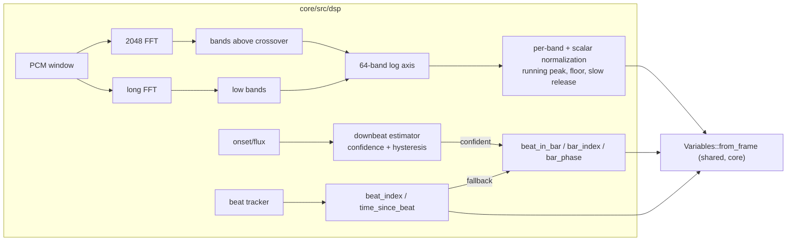

# 0048 — Analysis v2: the dual-resolution axis, normalized bands, phrase time, and the one retune that pays for all of it

> **Status:** draft 2026-07-30 (parallel-safe against the render queue except one named touch; see file fence)
> **Created:** 2026-07-30
> **Owner skill(s):** dev, human
> **Related ADRs:** [0049](../adrs/0049-analysis-v2-dual-resolution-axis-normalized-bands.md) (axis + normalization),
> [0050](../adrs/0050-downbeat-and-phrase-tracking-with-confidence-fallback.md) (phrase time).
> [docs/roadmap-visual-richness.md](../roadmap-visual-richness.md) R5 (the large half). Runs after Plan 0047.

## TL;DR

The analysis surface becomes worth binding to: a second, longer FFT feeds the low bands so
the 64-band axis is truly logarithmic and the kick/sub region resolves; `bass`/`mid`/`treb`/
`onset` become normalized against their own recent range (raw values stay as `*_raw`);
`beat_index`/`time_since_beat` land unconditionally and `beat_in_bar`/`bar_index`/`bar_phase`
land behind a measured-confidence downbeat estimator that falls back to counters. **This is
deliberately breaking**, and the whole library is retuned once, at the end, verified through
`--report`. First user-visible behavior: a spectrum preset where an 808 line reads as moving
structure instead of one fat bar, and thresholds that mean the same thing on every track.

## Context & problem

ADR-0049 and ADR-0050 carry the full case and the interview's choices (including the two
places the user chose the aggressive option over the recommendation — semantic replacement
and full downbeat tracking — both priced there). **File fence:** `core/src/dsp/**`,
`core/src/preset/expr.rs`, `core/src/preset/schema.rs`, `standalone/examples/shot.rs`,
docs, presets. One named exception: the `Variables` construction site in
`core/src/render/mod.rs`, taken in Phase 3 as a small, coordinated touch (and turned into
the shared constructor Plan 0041's review major asked for, so the duplication dies rather
than doubles).

## Decision

Per ADR-0049 (dual-resolution low end; normalization with `*_raw` escapes; one retune) and
ADR-0050 (two-layer phrase time, confidence-gated downbeat with deterministic fallback).

## Architecture diagram

## Implementation phases

### Phase 1 — The dual-resolution axis
- **Owner skill:** dev
- **What:** the second analysis window (length chosen here by measuring CPU per hop against
  NFR §3 — 4096 first, 8192 only if 4096 still leaves sub-bass bands bin-starved), feeding
  bands below the crossover; band edges re-laid truly logarithmically 35 Hz–18 kHz with
  every band at least one achievable bin. The axis position tables in the docs are
  regenerated from code, not edited by hand.
- **Files touched:** `core/src/dsp/fft.rs`, `core/src/dsp/mod.rs`.
- **Done when:** a swept sine below 250 Hz moves smoothly through multiple distinct bands
  (the 808-collapse reproduction, inverted); no band above the crossover changed its edge
  by more than rounding (asserted from the layout function); measured per-hop analysis cost
  is recorded in the phase commit with the NFR §3 headroom stated.

### Phase 2 — Normalization: `bass`/`mid`/`treb`/`onset` + `*_raw`
- **Owner skill:** dev
- **What:** per-band and per-scalar running normalization in the analyzer (instant attack,
  seconds-scale release, silence floor — properties tested; constants provisional until
  Phase 6). The four familiar names become normalized; `bass_raw`/`mid_raw`/`treb_raw`/
  `onset_raw` join `VAR_NAMES`. The 64-band array presets reach through `bin()` normalizes
  the same way (one rule, no per-surface exceptions).
- **Files touched:** `core/src/dsp/mod.rs`, `core/src/preset/expr.rs`.
- **Done when:** a full-scale sine and the same sine at −20 dB converge to the same
  normalized reading (the portability property); silence stays at 0 (the floor works, noise
  is not amplified); a step from silence reads high immediately (instant attack) and decays
  over seconds (property, not a magic number); `*_raw` reproduce today's values bit-exactly.

### Phase 3 — The shared `Variables` constructor, and the new time counters
- **Owner skill:** dev
- **What:** `Variables::from_frame(&AnalysisFrame, time)` in core replaces the two
  positionally-duplicated construction sites (`render/mod.rs:1192` and `shot.rs:933` — the
  Plan 0041 review major); `beat_index` and `time_since_beat` land unconditionally
  (ADR-0050 Layer 1). This is the one render-file touch; coordinate with the render queue's
  in-flight plan before starting it.
- **Files touched:** `core/src/preset/expr.rs`, `core/src/render/mod.rs` (construction site
  only), `standalone/examples/shot.rs`.
- **Done when:** exactly one construction site exists (grep proves it); the probe and the
  engine bind identical values by construction; `beat_index` is monotone and
  `time_since_beat` resets on each beat under `--signal click`.

### Phase 4 — The downbeat estimator, gated
- **Owner skill:** dev
- **What:** ADR-0050 Layer 2: accent folding over the four 4/4 alignments, confidence with
  hysteresis, `beat_in_bar`/`bar_index`/`bar_phase` published when confident and
  counter-derived otherwise. The ADR's pinned test strategy is the phase's test list
  (accented click locks in all four rotations; unaccented stays in fallback; alignment
  flips take bars, not frames).
- **Files touched:** `core/src/dsp/` (new module), `core/src/preset/expr.rs`.
- **Done when:** the three pinned tests pass; the fallback path is byte-deterministic; the
  confidence value is exposed to diagnostics (not to the grammar — authors get behavior,
  not homework).

### Phase 5 — Harness and docs recalibration
- **Owner skill:** dev
- **What:** `--report`'s realistic-level stimuli and every measured-level table
  (`presets/README.md` bands table, `docs/presets.md` axis/threshold guidance,
  `docs/capturing.md` calibration ladder) re-measured against the new semantics and
  regenerated; the reachability check re-run over the un-retuned library and its flag list
  committed as the *before* record Phase 7 works from.
- **Files touched:** `standalone/examples/shot.rs`, the three docs.
- **Done when:** no doc states a pre-v2 level as current; the before-flags list exists.

### Phase 6 — Real-music validation of the constants
- **Owner skill:** human
- **What:** play 2–3 real tracks (the Plan 0037 Phase 4 material plus something
  sparse/ambient) through the live app with the diagnostics overlay: do normalized levels
  ride the music without pumping (release too fast) or going numb (too slow)? Does the
  downbeat lock on the 4/4 material, stay honestly in fallback on the ambient, and never
  visibly mis-accent? Record impressions and the confidence lock-rate.
- **Done when:** verdicts recorded in this plan; any constant `dev` must move is named with
  the observed symptom. **Stopping condition:** if the downbeat estimator mis-accents
  confidently (not "fails to lock" — *locks wrong*) on ordinary 4/4 material, stop and
  route to `architect`: ADR-0050's gate design gets an Outcome before the retune builds on
  bar variables.

### Phase 7 — The library retune
- **Owner skill:** human
- **What:** run the `preset-author` lane over the full shipped set against the v2 surface
  (the one retune both ADRs sequence everything for): thresholds to normalized semantics,
  the eight `bin()` presets to the new axis, adopting `beat_index`/`bar_phase` where a
  preset's arc wants them. `--report`'s two-level columns and reachability flags are the
  acceptance instrument; Phase 5's before-list is the work list.
- **Done when:** reachability reports no dead gates the author did not deliberately keep
  (each keeper documented in-file, the standing convention); the `animation`/`reactivity`
  gates pass library-wide; the lane's session notes land in the design backlog as usual.

## Data shapes

New variables: `bass_raw`, `mid_raw`, `treb_raw`, `onset_raw`, `beat_index`,
`time_since_beat`, `beat_in_bar`, `bar_index`, `bar_phase` (VAR_COUNT 10 → 19; `Variables`
already borrows, so the copy-cost concern from ADR-0036 does not return). No C ABI change,
no `Scene` change.

## Risks & open questions

- **The retune is the largest content pass since the library rewrite** — it is priced,
  scheduled last, and instrument-verified; but it is real work and the plan does not
  pretend otherwise.
- **Downbeat lock-rate on real music is unknown** until Phase 6; the fallback design means
  the worst case is the counters-only option the interview declined — a safe floor, stated
  in ADR-0050.
- **AGC pumping vs numbness** is a tuning axis with no universally right constant; the
  properties are tested, the feel is Phase 6's job, and the release constant is the one
  most likely to move.
- The Phase 3 render-file touch collides with the render queue if taken mid-flight —
  explicitly sequenced to coordinate, and it is small.
- `--report`'s historical numbers all shift meaning; Phase 5's regeneration is load-bearing
  for every future backlog entry that quotes a level.

## What this plan does NOT do

- No `novelty` graduation or section detection (ADR-0050 Alternative B — stacks later).
- No `bin_range()` integrator (deferred from ADR-0036; the resolved axis makes it worth
  revisiting on its own merits afterward).
- No slew-release smoothing form (backlog 0021 stays parked awaiting an author want).
- No renaming of `bar` (documented misnomer; `bar_phase` is the true quantity).
- No grammar randomness (Plan 0047, which runs first).

## Followups (after this lands)

- Revisit `bin_range(lo, hi)` against the resolved axis.
- ADR-0050 Alternative B (novelty/section signal) once bar time has proven itself in
  content.
- The `--report` ceiling-check threshold minor from Plan 0041's review, if the regenerated
  tables touch that code anyway.
