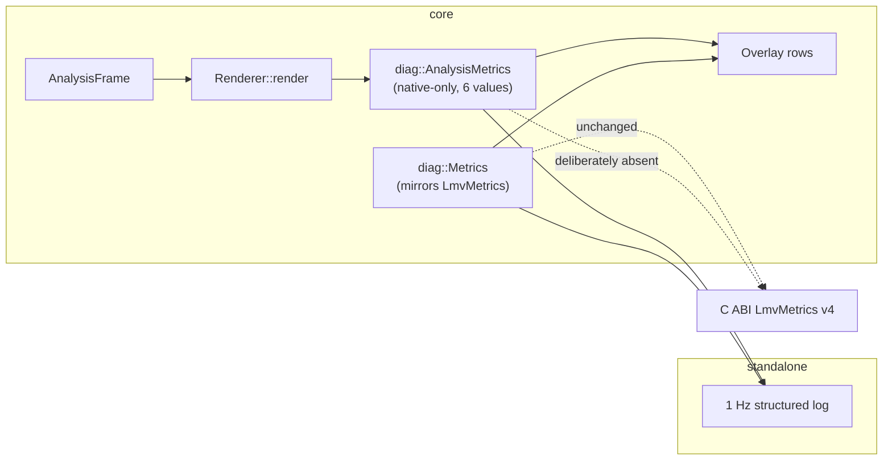

# 0049 — The analysis diagnostics surface: making Plan 0048 Phase 6 measurable (and the kaleidoscope seam)

> **Status:** in-progress 2026-07-30
> **Created:** 2026-07-30
> **Owner skill(s):** dev
> **Related ADRs:** [0052](../adrs/0052-analysis-diagnostics-are-native-only.md) (native-only, no ABI change);
> [0050](../adrs/0050-downbeat-and-phrase-tracking-with-confidence-fallback.md) (the gate this instrument observes);
> [0047](../adrs/0047-kaleidoscope-fold-domain-disc-with-falloff.md) (owns the fold Phase 1 touches).
> **Blocks:** Plan 0048 Phase 6, which cannot run until Phases 2-4 land.

## TL;DR

Plan 0048's `human` listening phase asks for two judgements and the app displays neither.
This plan builds the instrument: six analysis values on a native-only `AnalysisMetrics`,
rendered live in the `F3` overlay and written as structured fields to the 1 Hz log. It
also carries one unrelated fix the user routed here — the kaleidoscope fold tears the
frame along a horizontal ray to the left whenever its order is fractional, which every
kaleido preset makes it, because `kaleido_order` is eased.

## Context & problem

Plan 0048 Phase 6 reads: *"play 2-3 real tracks through the live app with the diagnostics
overlay: do normalized levels ride the music without pumping or going numb? Does the
downbeat lock … Record impressions and the confidence lock-rate."*

`diag::Metrics` (`core/src/diag/mod.rs:44`) carries fps, mean and p99 frame time, frame
counts, GPU bytes and draw calls. The 1 Hz logger (`standalone/src/main.rs:465`) emits that
plus RSS. Neither carries a single audio value. So the phase's first question has no
instrument, its second has no instrument, and its done-when — a recorded lock rate — is not
producible.

The sharper problem is ADR-0050's stopping condition. That ADR accepts genuine research
risk on the downbeat estimator, and what makes the risk acceptable is a gate whose failure
mode is the conservative behaviour, plus a human check that it never *locks wrong*. From
outside the app a wrong lock and the counter fallback look identical. **The check ADR-0050
rests on is currently unfalsifiable.** Plan 0048 Phase 4's commit disclosed this as "worth
a small followup"; it is not a followup, it is the phase's only instrument.

ADR-0052 settles the one design question this raised — whether the values cross the C ABI.
They do not.

## Decision

Per ADR-0052: a separate native-only `AnalysisMetrics` carrying six values (`bass`, `mid`,
`treb`, `onset` normalized, plus `downbeat_confidence` and `downbeat_locked`), surfaced in
**both** the `F3` overlay and the 1 Hz log. `LmvMetrics` and `LMV_ABI_VERSION` do not move.

## Architecture diagram

## Implementation phases

### Phase 1 — The kaleidoscope fold takes an integer order

- **Owner skill:** dev
- **Why it is here:** unrelated to the rest of this plan, and carried here by an explicit
  routing decision (2026-07-30) rather than by subject matter. It is a one-line fix the
  user is looking at right now; ADR-0047 owns this fold long-term and Plan 0045 will
  rework its domain, but that plan is large and this artifact is visible on every kaleido
  preset today. Committed on its own so it can be read — or reverted — independently.
- **What:** in `core/src/render/kaleidoscope.rs:313` the order is
  `clamp(MIN_ACTIVE_ORDER, MAX_ORDER)` and never rounded. The fold does
  `a = atan2(p.y, p.x) + angle` then wraps with `a - seg * floor(a / seg)`, and `atan2`'s
  branch cut lies on the **−x ray**: crossing it, `a` jumps by exactly `2*pi`. The wrap
  absorbs that jump only when `2*pi` is a whole multiple of `seg = 2*pi/order` — that is,
  only when `order` is an integer. Any fractional order tears the frame along one
  horizontal ray from the centre to the left edge. Round the order to the nearest integer
  **CPU-side**, so the uniform only ever carries an integral value and the shader's
  contract is visible in Rust rather than implied in WGSL.
- **Why it is constantly visible:** `kaleido_order` sits under `[smoothing]` in every
  kaleido preset (`fragment_kaleido.toml:110` tau 1.3 s, `fragment_glacier.toml:84` 1.1 s,
  `reaction_reef.toml:101` 1.2 s), so each ladder step eases through a second or more of
  fractional orders; preset dissolves interpolate it too.
- **Files touched:** `core/src/render/kaleidoscope.rs`, a test in `core/tests/`.
- **Done when:** a capture at a **fractional** order (e.g. 12.5) shows no discontinuity
  across the −x ray — asserted by comparing pixel rows immediately above and below the
  horizontal midline over the left half, which differ sharply today and must not after.
  The reproduction is confirmed and rendered: at order 12 the frame is clean, at 12.5 the
  seam is unmistakable. Rounding necessarily makes `kaleido_order` a **stepped** parameter,
  so state that in `presets/README.md` beside the param — a smooth sweep now snaps at each
  half-integer, which is correct (a 12.5-wedge kaleidoscope is not a thing) but is a
  behaviour change an author will notice.

### Phase 2 — `AnalysisMetrics`, plumbed end to end

- **Owner skill:** dev
- **What:** a native-only `AnalysisMetrics` in `core/src/diag/`, carrying the six values,
  populated from the `AnalysisFrame` the render path already holds, and reachable through
  its own accessor beside `Renderer::metrics()`. This is the walking skeleton: get one
  value visible on the overlay before building the readout properly, so the plumbing is
  proven before the presentation work starts.
- **Do not** add fields to `diag::Metrics` — its doc comment claims it mirrors the C ABI's
  `LmvMetrics` and ADR-0052 keeps that claim literally true. Carry the reason in a doc
  comment on the new type, because "why two structs" is the first question a reader has.
- **Files touched:** `core/src/diag/mod.rs`, `core/src/render/mod.rs`.
- **Done when:** the six values are readable through the new accessor and are the frame's
  own values, asserted against a synthesized `AnalysisFrame` rather than eyeballed;
  `LMV_ABI_VERSION` is still 4 and `LmvMetrics` is unchanged, asserted by a test so a later
  plan cannot widen it silently; `diag::Metrics` has the same fields it has today.

### Phase 3 — The overlay renders the analysis rows

- **Owner skill:** dev
- **What:** extend the `F3` overlay's readout with the levels and the lock state. The
  panel currently draws one text row plus a sparkline (`core/src/render/overlay.rs`,
  `write_readout` / `draw_text`); this adds rows and re-flows the panel height.
- **The font is the trap in this phase.** `overlay_font::glyph` covers digits, `.`, `/`,
  `:`, `*` and exactly eleven capitals — **B C F H I L M O P R S** — and its fallback arm
  is `_ => [0x00; GLYPH_H]`, so **an unknown character renders as blank with no error**.
  `BASS` would draw as `B SS`. Either add the glyphs the chosen labels need or pick labels
  from the existing alphabet; do not discover this at render time.
- **Files touched:** `core/src/render/overlay.rs`, `core/src/render/overlay_font.rs`.
- **Done when:** the overlay shows the four levels and the lock state with its confidence,
  legibly at 1080p; and — the guard that matters — a test walks **every character the
  readout can emit** and asserts `glyph(c)` is non-blank for each non-space one, so the
  silent-blank failure above cannot ship. Add it as a general guard over the readout's
  alphabet, not as a fixed string, or it stops covering the readout the first time the
  format string changes.

### Phase 4 — The 1 Hz log carries the structured fields

- **Owner skill:** dev
- **What:** the six values as structured key-value fields on the existing 1 Hz line, in
  the format that logger already uses. This is the half Phase 6 records rather than
  watches: a run of these lines is what a lock **rate** is computed from, and the reason
  ADR-0052 rejected an overlay-only surface.
- **Files touched:** `standalone/src/main.rs` (and the diag-log module it delegates to).
- **Done when:** a run over `--signal` material emits lines carrying all six, parseable
  without a regex tuned to one value's formatting; the existing fields and their names are
  unchanged, so anything already parsing these lines keeps working. Sampling stays lazy —
  the logger must not start reading analysis state on frames where no line is due.

### Phase 5 — The Plan 0048 review findings that need code

- **Owner skill:** dev
- **What:** four items from Plan 0048's Mode 4 review, none large, batched here because
  `dev` is already in these files. Each is independently committable.
  1. `core/src/dsp/mod.rs:74` — the `spectrum` field doc still says "each band normalized
     against its own recent peak". Phase 2 of Plan 0048 replaced that with **one shared
     peak** and the struct-level doc says so correctly; this is the line a reader lands on
     first, and it states the exact thing the deviation rejected.
  2. `core/src/dsp/fft.rs:542` — the test's stated reason for reading the layout directly
     ("the analyzer publishes a per-band normalized one on which an argmax is meaningless")
     is a leftover from the same draft. Under a shared peak a uniform gain preserves
     ordering, so the argmax *is* meaningful. Reading the layout is still right for a
     layout test; fix the reason, keep the choice.
  3. **The sample-rate coverage gap.** Every band-layout test is at 48 kHz
     (`BandLayout::new(48_000)` at fft.rs:362, 398, 436, 602, 613; `SR = 48_000`
     throughout). `AudioFormat` accepts 8 kHz-384 kHz and foobar hands the plugin 44.1 kHz
     for CD material. ADR-0049's stated benefit is literally *"the axis stops depending on
     sample rate in its bottom half"* — that is the claim, and it is the one claim no test
     can see. `with_windows` is already parameterized, so add a layout check at 44_100 and
     96_000: every band non-empty, the crossover still lands near `BASS_HI_HZ`, `starved`
     stays small. Note `debug_assert_eq!(short_widened, 0)` at fft.rs:142 is the only guard
     that the crossover really keeps the short region unstarved, and a `debug_assert` does
     not run in release.
  4. `bar_index` is documented monotone in three places (`core/src/dsp/mod.rs:109`,
     `core/src/dsp/downbeat.rs:78`, `docs/presets.md`) and is not: `shifted =
     beat_index.saturating_sub(alignment)`, so an alignment change from 0 to 2 at beat 40
     takes it 10 → 9, and a lock dropping steps it forward by one. Hysteresis makes it
     rare and a repeated bar is a far softer failure than a wrong downbeat — but
     `mod(bar_index, 8)` authors will assume the promise. **Pick one and say why:** soften
     the docs to "monotone except across an alignment change", or publish a counter that
     never decreases. Do not do both.
- **Done when:** each item is addressed or explicitly declined with a reason in the commit;
  the two doc lines describe the shared peak that shipped; the layout tests fail if run
  against a rate-dependent regression.

## Data shapes

`AnalysisMetrics { bass: f32, mid: f32, treb: f32, onset: f32, downbeat_confidence: f32,
downbeat_locked: bool }` — native-only. No C ABI change, no `Scene` change, no new
grammar variable (`downbeat_confidence` stays out of `VAR_NAMES`; ADR-0050's "authors get
behavior, not homework" line is already a test in `preset/expr.rs`).

## Risks & open questions

- **The overlay is read at a glance while music plays.** Six values plus what is already
  there is close to the useful limit; if it reads as a wall of numbers the phase has
  failed even with every assertion green. Legibility is a judgement, so it is a done-when
  in words rather than a threshold this plan has not earned.
- **The interview's accepted overlay mock showed `bar 2/4` — i.e. `beat_in_bar` — while
  the values question chose the six.** The six are the contract. `beat_in_bar` is one
  `u32` already on the frame and would arguably make a mis-accent visible by eye rather
  than inferred from a confidence number; `dev` may include it, but it is **not** a
  done-when and the plan is complete without it.
- Phase 1 changes `kaleido_order`'s feel for every preset that eases it. That is the fix
  working as intended, but it is a visible content change made by an engine plan, so
  `preset-author` should be told rather than left to discover it.
- Phase 5 item 3 may find nothing. That is a fine outcome and the test still earns its
  place — the point is that no configuration we develop at can currently see the claim.

## What this plan does NOT do

- No C ABI change and no `LMV_ABI_VERSION` bump (ADR-0052); the foobar plugin gets no
  analysis diagnostics, named as a real gap there.
- No `*_raw`, `bpm`, `bar` or `novelty` on the overlay — not until something asks.
- No rework of the kaleidoscope fold's *domain* (the disc + falloff of ADR-0047). Phase 1
  fixes the tear only; Plan 0045 still owns the redesign.
- No change to `docs/nfr.md` — its `window <= 2048` contradiction with Plan 0048 Phase 1
  is architect-owned and handled outside this plan.

## Followups (after this lands)

- Plan 0048 Phase 6 runs against this instrument, then Phase 7, then Plan 0048 closes.
- If the estimator ever needs validating on the foobar path, ADR-0052's Alternative A is
  the road back — `struct_size` still absorbs the growth.
