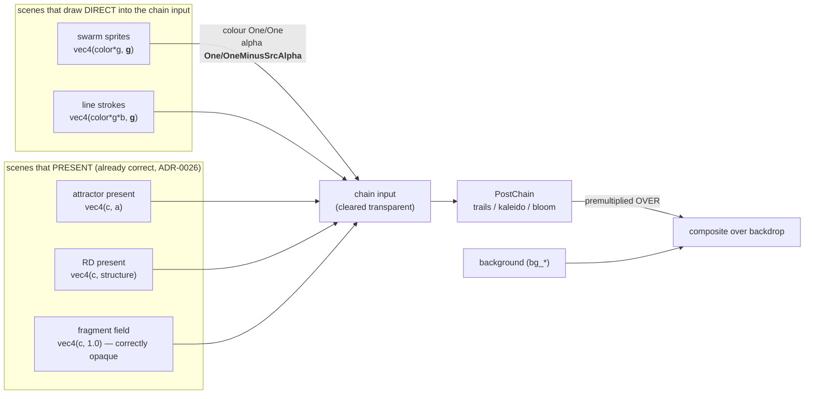

# 0051 — The scene seam emits premultiplied alpha: the swarm and the strokes stop punching holes in the backdrop

> **Status:** draft
> **Created:** 2026-07-31
> **Owner skill(s):** dev
> **Related ADRs:** [0056](../adrs/0056-additive-scenes-emit-premultiplied-alpha.md) (this plan's
> decision), [0055](../adrs/0055-backdrop-leaves-the-post-chain.md) (the premultiplied chain whose
> first Negative bullet this is the third instance of),
> [0026](../adrs/0026-full-composite-coverage-fullscreen-scenes.md) (the scene-seam convention
> being completed). Follows [Plan 0045](done/0045-linear-light-and-bloom.md), which caused the
> visibility.

## TL;DR

Two additive draw pipelines — the swarm's sprites and the line renderer's strokes — emit a hard
`1.0` alpha across their whole quad while colour carries a falloff, so since Plan 0045 Phase 2b the
frame *covers* the backdrop with black wherever those quads write no light. Make each emit alpha
equal to its own coverage (`vec4(color * g, g)`), switch the alpha blend component from
`BlendComponent::OVER` to premultiplied OVER (`One` / `OneMinusSrcAlpha`) so stacked quads saturate
instead of squaring, and install the lit-backdrop guard per seam that ADR-0055 said this class
needs. First user-visible behavior: the black rectangular notches beside every bright swarm
particle are gone, and every existing golden is byte-identical.

## Context & problem

Reported from a `preset-author` session: small black rectangular notches, quad-shaped, punched into
the backdrop beside bright particles on `swarm_storm`, dozens per frame, visible headlessly and
live in the app. It reproduces on the pre-retune file from history, so it is engine behaviour, not
content.

The mechanism is measured and is not subtle. `core/src/render/scenes/swarm.rs:186` returns
`vec4(in.color * g, 1.0)` and `core/src/render/scenes/lines/renderer.rs:150` returns
`vec4(in.color * g * u.v.y, 1.0)`. Alpha is a literal constant; only colour carries `g`. With the
alpha blend at `BlendComponent::OVER` and a source alpha of exactly 1, the destination alpha
saturates to 1 across the entire quad footprint — including everywhere `g` is zero. The chain's
resolve then computes `src.rgb + backdrop * (1 - src.a)`, which at `src.a = 1` discards the
backdrop entirely.

The swarm is the loud case because its falloff is a **radial** distance over a **square** quad: the
region outside the inscribed disc is `1 - π/4 ≈ 21 %` of every sprite's area, in four hard-edged
corners, all of it exactly `(0, 0, 0, 1)`. The line renderer's falloff is one-dimensional across
the stroke, so its dark region is the two long edges — nearly a hairline at shipped `thickness`,
unmistakable at `thickness = 9` against `bg_bright = 0.55`, where `lsystem_fern` renders black rims
and wedges over the whole figure. Both were reproduced during triage.

Before Plan 0045 this could not show: the chain forced alpha to 1 and the backdrop was rendered
*into* the chain's input. Phase 2b put something underneath, which made an always-wrong alpha
observable for the first time.

**Nothing caught it, and that is the part this plan must fix as much as the shaders.** Every swarm
fixture and every golden baseline for these scenes runs `bg_bright = 0`, where a black backdrop
times any alpha is still black — so the whole regression suite is structurally blind to it, and it
is invisible at contact-sheet scale too. That is verbatim the blind spot ADR-0055's Negative
section names. The fold got a lit-backdrop guard in Phase 2b and the bloom recombine got one in
Phase 4b; the scene seam never did.

Roughly sixteen shipped presets are affected — the three `swarm_*` files and the thirteen line
presets — at exactly the `bg_bright > 0` setting the library tests least and ships most.

## Decision

Per [ADR-0056](../adrs/0056-additive-scenes-emit-premultiplied-alpha.md): each affected fragment
shader emits premultiplied alpha equal to its own coverage, and the alpha blend component becomes
`One` / `OneMinusSrcAlpha` so accumulation is `a + a_dst * (1 - a)` — monotone and bounded in
`[0, 1]` **by construction**, which makes the over-1 alpha that caused Phase 4b's defect
unrepresentable here rather than clamped afterwards. Colour stays `One` / `One` additive and
unbounded, which is what the linear-light composite exists for.

Rejected there and worth not re-litigating: clamping alpha at the resolve (the alpha here is
exactly 1.0 — in range and still wrong, so a clamp does nothing), reverting to an opaque chain
(that is un-doing ADR-0055), deriving coverage centrally from luminance (a legitimately dark
covered pixel would become transparent), and additive alpha plus a clamp (reintroduces the failure
mode and then guards it).

**The claim that makes this cheap: no existing golden moves.** Colour is never a function of alpha
anywhere in the chain — no pass un-premultiplies, and `post.rs:265` / `kaleidoscope.rs:289` already
write down the argument — so at `bg_bright = 0` the resolve reduces to `src` in every channel
whatever the alpha is. This is a behaviour change that is provably a no-op on the entire existing
baseline set.

## Architecture diagram

The change is confined to the two left-hand boxes. Everything downstream already handles
premultiplied alpha correctly — that is what Plan 0045 Phase 2b built.

## Implementation phases

### Phase 1 — The swarm seam, the shared blend constant, and the guard

- **Owner skill:** dev
- **What:** in `swarm.rs`, emit `vec4(in.color * g, g)` and change the pipeline's alpha blend
  component to `One` / `OneMinusSrcAlpha`. Hoist that blend state into a single named constant in
  `core/src/render/gpu.rs` (which already exists to hold repeated wgpu boilerplate, per Plan 0031)
  — name it for what it means, e.g. "additive light with saturating coverage" — with a doc comment
  stating the invariant and why the alpha factor is not `One`/`One`. Phase 2 consumes the same
  constant, so there is one definition rather than two that can drift.

  Then build the guard. Add a lit-backdrop swarm fixture (`bg_bright > 0`, sparse enough that
  sprites do not overlap into a solid mass) and assert the property below on the **linear**
  composite, upstream of the tonemap — `capture::read_back_linear` is `pub(crate)`, which is why
  Phase 4b's equivalent guard lives in the render module rather than in the test file. Follow that
  precedent.
- **Files touched:** `core/src/render/scenes/swarm.rs`, `core/src/render/gpu.rs`,
  `core/tests/fixtures/` (a new lit-backdrop swarm fixture), the swarm capture test module.
- **Done when:**
  - **The guard property holds, and it is exact rather than toleranced.** Capture the fixture three
    ways at the same size and stimulus: `L` at `bg_bright > 0`, `K` at `bg_bright = 0`, and `B`
    with the backdrop only and the scene contributing nothing. At every pixel where `K` reads zero
    in all channels — the scene wrote no light there — `L` must equal `B`, bound **0** (half-
    precision slack only). Upstream of the tonemap this is a plain premultiplied OVER, so there is
    no tolerance to negotiate: where nothing was drawn, the backdrop must arrive intact.
  - **Two non-vacuity arms, both required.** (1) The guard **fails on the pre-fix shader** —
    demonstrate it in both directions by reverting the two-line change, exactly as Phase 4b
    confirmed its clamp. (2) The `K`-reads-zero region must be a substantial fraction of the frame,
    not a handful of pixels; report the count in the assertion message so a future fixture edit
    that quietly empties it is visible.
  - **Every existing golden baseline is byte-identical** (the no-op claim, proven the Plan 0038
    way — run the suite without blessing and show zero drift). If any baseline does move, stop:
    the "colour never depends on alpha" premise is wrong somewhere and that is a finding, not a
    re-bless.
  - The reported repro is visibly clean: `swarm_storm` at 1550x902 with
    `--set bass=0.05,mid=0.04,treb=0.02` shows no black notches.

### Phase 2 — The line seam

- **Owner skill:** dev
- **What:** the same change in `lines/renderer.rs` — emit `vec4(in.color * g * u.v.y, g)` and take
  the shared blend constant from Phase 1. One edit covers all four line scenes
  (`parametric`, `lsystem`, `star`, `spectrum`), since they all draw through this renderer. Add the
  second lit-backdrop guard, on a line fixture, with the same property and the same two
  non-vacuity arms.
- **Files touched:** `core/src/render/scenes/lines/renderer.rs`, `core/tests/fixtures/` (a new
  lit-backdrop line fixture), the line capture test module.
- **Done when:** the Phase 1 property holds on a line fixture too, with the same exact bound and
  the same revert-confirmed non-vacuity; every existing golden stays byte-identical; and the
  triage repro is clean — `lsystem_fern` at `bg_bright = 0.55` with `thickness = 9` shows no black
  rim or wedge. **Use a fat stroke in the reproduction, not a shipped one:** at shipped
  `thickness` the defect is close to a hairline and a capture at those widths cannot discriminate
  the fix. The committed fixture should carry a comment saying so, or the next author will
  "simplify" it back to a shipped width and retire the test silently — the same trap
  `core/tests/kaleidoscope.rs` documents about its non-zero `kaleido_angle`.

### Phase 3 — The docs, and what the next draw pipeline is told

- **Owner skill:** dev
- **What:** record the invariant where someone adding a fifth draw pipeline will meet it. A module
  doc on the shared blend constant is the primary home (Phase 1); this phase makes sure the
  narrative docs agree. `docs/capturing.md` gains the two new fixtures and one sentence on why a
  lit backdrop is a distinct test configuration rather than a variant of an existing one.
  `presets/README.md`'s background section gains a sentence that `bg_*` now composites correctly
  under every scene, since the content lane has been working around this without naming it. Check
  `presets/swarm_storm.toml` and the line presets for comments that rationalize the artifact, the
  way `swarm_dense.toml` once rationalized the fold defect; remove any found.
- **Files touched:** `docs/capturing.md`, `presets/README.md`, any preset file carrying a stale
  rationalization.
- **Done when:** no doc or preset comment describes the black notches as expected behaviour, and
  `docs/capturing.md` names both new fixtures and the configuration they exist to cover.

## Data shapes

None. No new named param, no `Scene` trait change, no C ABI change (stays v4), no new dependency,
no preset-visible surface. Two fragment shader lines and one blend state.

## Risks & open questions

- **The byte-identical claim is load-bearing and is the one thing that could be wrong.** It rests
  on no pass in the chain un-premultiplying, which was checked by grep during triage and is
  asserted in two existing comments (`post.rs:265`, `kaleidoscope.rs:289`). If a golden moves,
  that premise is false somewhere and the finding matters more than the re-bless — surface it
  rather than blessing through it.
- **A dense swarm will now genuinely occlude the backdrop** where coverage saturates. That is
  correct, and it is a real visual change on `swarm_dense`. It should read as the figure sitting
  *on* the atmosphere rather than as the atmosphere shining through solid particles. If the
  content lane dislikes it, that is a look question about additive scenes' alpha semantics —
  ADR-0056's last Negative names it — and routes back to `architect`, not to a shader tweak.
- **`bloom_threshold` interacts with the change in one direction only.** Removing the
  `(0,0,0,1)` corners removes noise from the buffer the bright-pass reads, which cannot make a
  halo dimmer. No bloom fixture should move; if one does, understand why before blessing.
- **The guard is a convention check, not a structural one.** Nothing stops a sixth draw pipeline
  from emitting a constant alpha again. The shared blend constant plus its doc comment is the
  cheapest mitigation available; a stronger one (enumerating every pipeline's blend state the way
  Phase 4b enumerated bind-group layouts) is possible but was not judged worth the machinery for
  two call sites. Revisit if a third additive draw seam appears.

## What this plan does NOT do

- **No change to the fold, the tonemap, or bloom.** Those seams already handle alpha correctly;
  this is the one that was missed.
- **No re-tune of any preset.** The affected presets get correct compositing from the values they
  already bind. If a look wants adjusting afterwards, that is a `preset-author` pass.
- **No new alpha model for additive scenes.** Coverage-as-alpha is the conservative reading that
  matches every other seam. A deliberate "additive light never occludes" model is a different
  decision and is left alone.
- **Nothing about `fragment_field`'s opaque `1.0`.** That is correct — a fullscreen field is
  supposed to cover the backdrop.
