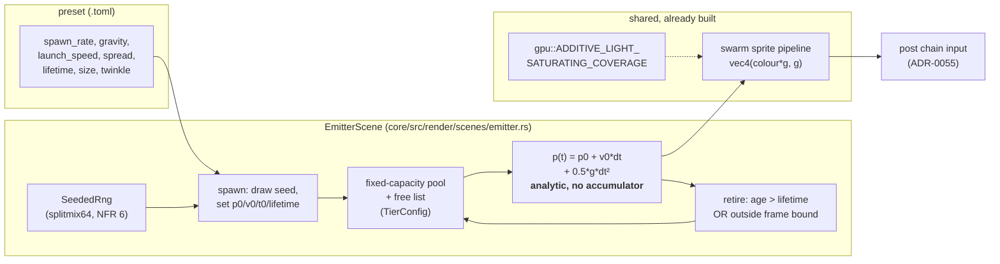

# 0052 — The emitter: objects that spawn, fall on a parabola, and die

> **Status:** **draft** — created 2026-08-01. All four phases are `dev`; nothing gates it.
> **Created:** 2026-08-01
> **Owner skill(s):** dev
> **Related ADRs:** [0057](../adrs/0057-emitter-scene-analytic-ballistics-seeded-individuation.md)
> (this plan's decision), [0044](../adrs/0044-swarm-world-is-a-25d-torus-sized-from-the-target.md)
> (the torus this scene exists to not be),
> [0056](../adrs/0056-additive-scenes-emit-premultiplied-alpha.md) (the seam invariant its sprite
> pipeline inherits, and the guard it owes),
> [0007](../adrs/0007-line-geometry-generators.md) (the scene-idiom split this joins).
> Closes [design-backlog 0034](../design-backlog.md).

## TL;DR

Add `SystemKind::Emitter` — a CPU particle scene in which objects **spawn** from a source, follow
an **analytic** ballistic path (`p0 + v0*t + 0.5*g*t²`, so the trajectory has no `dt` in it and
cannot drift between devices), **age**, and are **retired** when their lifetime expires or they
leave the frame. Per-object variation — launch angle, size, spin, twinkle phase — comes from a
seed drawn once at spawn, so a starfield twinkles star by star instead of flashing as one sheet.
First user-visible behavior: a preset that throws a shower of sparks upward from below the frame,
each on its own parabola, falling out of shot and not coming back.

## Context & problem

`preset-author` filed [design-backlog 0034](../design-backlog.md) after a user request for a
Solitaire-style cascade — "падает красиво по параболе в разных направлениях". Four pieces are
missing and all four were verified against code:

- **Nothing spawns and nothing dies.** `swarm::Particle` is `{ pos, vel, z }`. The swarm's world
  is a **torus**: `bounds(aspect)` wraps every particle back into frame (ADR-0044), deliberately,
  so the field stays populated with no respawn hitches. A particle therefore *cannot fall out of
  shot* — which is the entire motion being asked for.
- **No gravity, no throw.** Steering is a flow field plus a radial `burst`. A flow field bends
  every particle in a region the same way; that is a current, not a parabola.
- **No per-object state.** A binding is evaluated once per frame. `Scene::set_param_series`
  (ADR-0036) is the only per-element channel and only `spectrum` feeds it. The user asked for stars
  that blink and got a field-wide flash, because there is nothing for `hash()` to vary *over*.
- **No stamped trail.** `trails` is a decaying whole-frame smear; it cannot stamp hard copies along
  an arc.

The backlog notes this is the smaller and safer half of the figurative gap: an emitter throwing
round blobs on parabolas needs no new shape vocabulary and no change to the additive model, and it
carries the motion. [Design-backlog 0033](../design-backlog.md) — that marks have no *shape* —
stays open and is explicitly not in scope here.

## Decision

Per [ADR-0057](../adrs/0057-emitter-scene-analytic-ballistics-seeded-individuation.md): a **new
`SystemKind::Emitter`** beside `swarm`, with **analytic** position and **seeded** per-object
variation, drawing through the swarm's instanced-quad sprite pipeline on the shared
`gpu::ADDITIVE_LIGHT_SATURATING_COVERAGE` blend state.

Rejected there and not worth re-litigating: extending `swarm` (ADR-0044's toroidal wrap is exactly
what a cascade must not have, so one scene would carry two world topologies), building a general
per-object expression facility first (per-object expression evaluation at cascade counts is an
unmeasured hot-path cost, and the first thing it buys is variation a seeded distribution already
gives), and integrating with a fixed-timestep accumulator (it makes the trajectory depend on
substep alignment, reintroducing exactly the reproducibility surface the analytic form does not
have — revisit only if a look needs mid-flight forces).

**The analytic path is what makes the done-when arithmetic honest.** Position is a closed form, so
an object launched with vertical speed `v0` against gravity `g` reaches its apex at `t = v0 / g`
and height `v0² / (2g)` — checkable numbers this plan did the arithmetic on, rather than a
tolerance invented to fit whatever the integrator produces.

## Architecture diagram



The scene owns the pool and the path; everything to the right of it already exists and is reused
rather than re-derived.

## Implementation phases

### Phase 1 — The scene exists, and things fall out of frame

- **Owner skill:** dev
- **What:** `SystemKind::Emitter` rostered end to end (`VARIANT_COUNT`, `ALL`, `from_name`,
  `as_str`, `param_names`, the never-called exhaustive-match reminder, `scenes::create`) plus
  `core/src/render/scenes/emitter.rs` holding a fixed-capacity object pool with a free list, a
  spawn source, analytic position, and retirement. Objects draw through the swarm's sprite shader
  idiom — `vec4(colour * g, g)` — on `gpu::ADDITIVE_LIGHT_SATURATING_COVERAGE`.

  Pool capacity comes from a new `TierConfig::emitter_objects` field beside `swarm_particles`, and
  **spawning is clamped to the pool rather than allowed to overrun it**: when the pool is full the
  spawn is dropped, not queued and not allocated for. This is the phase's real-time hazard and it
  is the phase's job to make it unrepresentable.

  First params: `spawn_rate`, `gravity`, `launch_speed`, `launch_angle`, `lifetime`, `size`,
  `brightness`, plus the global composite set every scene gets.
- **Files touched:** `core/src/preset/schema.rs`, `core/src/render/scenes/mod.rs`,
  `core/src/render/scenes/emitter.rs` (new), `core/src/render/tier.rs`, `presets/` (one fixture
  preset), `core/tests/fixtures/` (an emitter fixture).
- **Done when:**
  - **A thrown object follows the parabola the closed form predicts.** With `gravity = g` and
    `launch_speed = v0` straight up, the object's apex occurs at `t = v0 / g` and at height
    `v0² / (2g)` above its spawn point, to within the f32 rounding of the closed form — not a
    tolerance, because there is no integrator to accumulate error. Assert against at least two
    `(v0, g)` pairs so a coincidence at one pair cannot pass.
  - **The trajectory is identical at different frame cadences.** Sample the same object's position
    at the same *scene time* under two different `dt` sequences (e.g. a steady 60 Hz cadence and a
    ragged one summing to the same elapsed time) and require the positions to match. This is the
    property ADR-0057 claims is structural; assert it rather than trusting it.
  - **Objects genuinely leave.** An object retired for crossing the frame bound does not reappear —
    capture two frames far enough apart that a wrapped particle would have re-entered, and assert
    the count of live objects in the frame's lower half is not replenished from the top. The swarm
    would fail this by construction, which is what makes it a real discriminator.
  - **The pool cannot be overrun.** With `spawn_rate` bound to a value that would demand more
    objects per second than the pool holds, the live count saturates at capacity and the scene
    neither allocates nor panics. Assert the count, not the absence of a crash.
  - `cargo run -p standalone --example shot --preset-file <the new fixture>` renders visible
    objects on ballistic arcs.

### Phase 2 — Individuation: each object gets its own life

- **Owner skill:** dev
- **What:** every object draws a `seed` once at spawn from the scene's `SeededRng`; each
  individuating quantity is a pure function of that seed and a preset **distribution** param.
  Adds `spread` (launch-angle cone), `size_spread`, `lifetime_spread`, `spin`, and `twinkle` —
  a per-object brightness oscillation whose **phase** comes from the seed.

  This is the phase that answers the original report: the user asked for stars that blink and got
  a field-wide flash. A seeded twinkle phase is the difference.
- **Files touched:** `core/src/render/scenes/emitter.rs`, `presets/`, `presets/README.md`.
- **Done when:**
  - **Objects alive at the same instant differ from each other.** With `spread > 0`, the launch
    angles of the live set have a non-trivial spread; with `twinkle > 0`, the per-object brightness
    values at one instant are not all equal. State it as the property — the population varies —
    rather than pinning a distribution statistic this plan has not measured.
  - **`spread = 0` collapses it exactly.** Every object launches on the same angle, which makes the
    previous assertion non-vacuous in both directions.
  - **The whole scene is reproducible.** Two runs from the same seed at the same scene times
    produce byte-identical frames. No wall-clock read anywhere in the scene (NFR 6).
  - **A twinkling field does not flash as one sheet.** Whole-frame mean brightness over a window
    varies far less than any single object's does — the field is steady while its members are not.

### Phase 3 — Audio: the emitter reacts

- **Owner skill:** dev
- **What:** bind the emitter to the analysis frame the way every other scene is: `spawn_rate`,
  `launch_speed` and `brightness` are ordinary bindable params, so `onset`/`beat`/band expressions
  reach them through the existing grammar with no new machinery. Confirm the scene passes the
  library gates (`sanity`, `reactivity`, `animation`, `distinctness`) and add its golden baseline.

  **Read the gates before assuming they fit.** This is the first scene whose object count starts at
  zero and varies during a capture; `animation.rs` renders at 96x96 and `ANIM_FLOOR` is a
  whole-frame diff ([design-backlog 0009](../design-backlog.md)), and a sparse shower of small
  marks is exactly the shape that measures near zero there. If a gate needs a fixture tuned to
  meet it honestly, tune the fixture; if a gate is structurally wrong for this scene, **stop and
  surface it** rather than lowering a floor.
- **Files touched:** `core/src/render/scenes/emitter.rs`, `core/tests/fixtures/`,
  `core/tests/golden/` (one new baseline), `presets/`.
- **Done when:**
  - A preset binding `spawn_rate` to `onset` visibly emits in bursts on transients and idles
    between them, and the `reactivity` gate sees it on at least one band.
  - The golden baseline is committed and stable across two consecutive runs on the same adapter.
  - `sanity`, `animation` and `distinctness` pass with the shipped preset, **or** the phase stops
    with a written statement of which gate is structurally blind to this scene and why.

### Phase 4 — The third draw seam's guard, and the docs

- **Owner skill:** dev
- **What:** the emitter is the **third pipeline that draws directly into the post chain's input**,
  so per ADR-0056 it owes the third lit-backdrop guard: a `bg_bright > 0` fixture captured three
  ways, asserting the backdrop arrives intact wherever the scene wrote no light. Follow the swarm's
  guard (`core/src/render/scenes/swarm.rs`) — same shape, same reason it lives in the render module
  rather than `core/tests/`.

  Then the docs: `presets/README.md` gains the emitter's params (it is the roster document the
  content lane reads first), `docs/capturing.md` gains the new fixtures and the guard row, and
  `docs/nfr.md` gains the pool's memory line beside the swarm's.
- **Files touched:** `core/src/render/scenes/emitter.rs`, `core/tests/fixtures/`,
  `presets/README.md`, `docs/capturing.md`, `docs/nfr.md`.
- **Done when:**
  - The guard holds at bound 0 on the linear composite, and **fails on a deliberately reverted
    constant-alpha shader** — demonstrated in both directions, as Plan 0051's two guards were.
  - `presets/README.md` documents every emitter param, and `docs/capturing.md` names the new
    fixtures and what configuration they cover.
  - `docs/nfr.md` carries the pool's per-tier memory arithmetic.

## Data shapes

```rust
// illustrative — not the final interface
struct Object {
    p0: [f32; 2],      // spawn position, normalized domain
    v0: [f32; 2],      // launch velocity
    t0: f32,           // scene time at spawn
    lifetime: f32,     // seconds; retired when scene_time - t0 exceeds it
    seed: u32,         // drawn once at spawn; every per-object quantity derives from it
}

// position is a closed form, not an accumulator:
//   let age = scene_time - o.t0;
//   let pos = o.p0 + o.v0 * age + 0.5 * gravity * age * age;
```

New `TierConfig` field: `pub emitter_objects: usize`, beside `swarm_particles`.

No `Scene` trait change, no C ABI change (stays v4), no new dependency, no change to the expression
grammar.

## Risks & open questions

- **The gates have never met a scene that starts empty, and `animation.rs` is the likely one to
  bite.** It renders at 96x96 with a whole-frame diff floor, and design-backlog 0009 already records
  that thin, sparse figures measure near zero there even when clearly animated at full size. A
  shower of small marks is that shape. Phase 3 is written to stop and surface rather than lower the
  floor, because lowering a floor to admit a scene is how a gate stops meaning anything.
- **Spawn is the one place this scene can allocate, and the hot path forbids it.** The fixed pool
  plus free list is the mitigation and Phase 1 asserts the saturation behaviour directly. A
  `spawn_rate` bound to an unclamped expression is the realistic way a preset reaches it.
- **`trails` will read differently on this scene than on the swarm, and that is not a defect.** A
  decaying smear behind an object that *leaves* looks like a comet tail; behind a wrapping particle
  it looks like a current. Content may want the stamped, non-decaying trail the backlog describes —
  that is a feedback-stage semantics change (ADR-0031 territory), out of scope, and recorded as a
  followup.
- **Analytic position forbids mid-flight forces, permanently, until ADR-0057 is superseded.** If
  the first content pass immediately wants swirl or drag, that is the ADR's stated price being
  paid, and the answer is a superseding ADR rather than sneaking an accumulator in.
- **The new scene widens the WARP bind-group-layout collision surface** that
  [design-backlog 0039](../design-backlog.md) and [Plan 0053](0053-the-suite-stops-blessing-what-warp-gets-wrong.md)
  are about: an emitter uniform group shaped `[Uniform]` joins six existing ones. If 0053 lands
  first, its assertion will name this scene; if this lands first, 0053 inherits one more entry.
  Neither ordering is wrong — they should just not surprise each other.

## What this plan does NOT do

- **No shape vocabulary.** Objects are round additive blobs. [Design-backlog 0033](../design-backlog.md)
  — that no mark has a shape, and that a dark mark cannot exist in an additive pipeline — stays
  open and is the larger half of the figurative gap.
- **No stamped trail.** The Solitaire cascade's hard, non-fading copies along an arc need a
  feedback-stage change; `trails` decays by design.
- **No per-object expressions.** `set_param_series` is not extended. Individuation is distributions
  plus a seed; an arbitrary per-object expression stays out of reach.
- **No collision, drag, or inter-object forces.** The path is fixed at spawn.
- **No curated preset family.** Phase 1 and 3 ship the minimum content needed to exercise and pin
  the scene. Building a *look* on it is a `preset-author` pass, and it is the obvious first one to
  run once this lands.

## Followups (after this lands)

- Hand the emitter to `preset-author` for a look pass — this is the first genuinely new idiom since
  the attractor, and the lane asked for it.
- A non-decaying **stamped** trail (ADR-0031 territory), if the cascade look wants it.
- [Design-backlog 0033](../design-backlog.md) — shaped marks — with the emitter as the natural
  first consumer.
- Revisit per-object expressions with a real workload to measure, rather than a hypothetical one.
