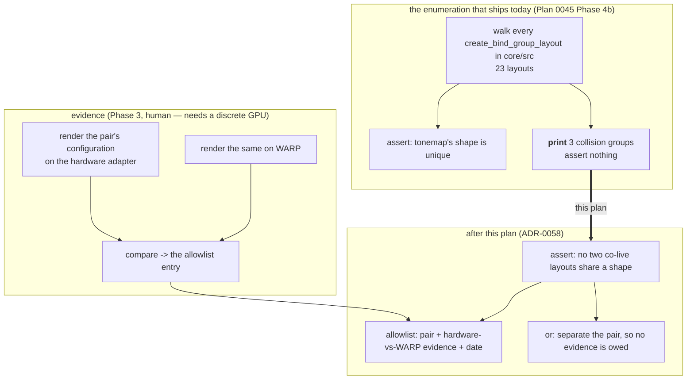

# 0053 — The suite stops blessing what WARP gets wrong, and two guards start biting

> **Status:** **approved 2026-08-02** — ready for `dev`. Four phases; Phase 3 is `human` and gates
> Phase 4's allowlist entries.
> **Premise correction, 2026-08-04 (at Plan [0060](done/0060-a-test-number-states-a-property-or-names-its-machine.md)'s
> close): this plan is not blocked, and Phase 3 may be much cheaper than written.** The header said
> Phase 3 "needs a discrete GPU" and that the plan does not run start-to-finish in one session.
> **The dev box has a hardware adapter.** The gate every hardware-only check in this suite skips on
> is `Renderer::adapter_is_software()` — `device_type == DeviceType::Cpu`
> (`core/src/render/context.rs`) — **not** "discrete", and Plan 0060 Phase 3 took a real hardware
> measurement here on 2026-08-04 (`ae4c215`) after verifying the hardware-only sibling runs and
> passes on this box. Whether Phase 3's *specific* comparison is satisfiable on an integrated
> adapter is a judgement for whoever takes it — but "wait for a machine we do not have" is not the
> reason to defer it. Try it first.
> **And Plan 0060 handed this plan a sharper question than it was written against**, in the same
> commit: the hardware dual-live reading matched **CI WARP** to five figures on one statistic and
> disagreed with **this box's local WARP** by 1.54x on a sequence with no dual-live asymmetry in it.
> If that holds, the build the golden suite blesses on is the outlier. See
> [ADR-0074](../adrs/0074-a-ratio-against-an-in-run-control-is-not-automatically-portable.md)'s
> Outcome section — it lands squarely in this plan's scope, which is whether WARP's output should be
> trusted at all.
> **Created:** 2026-08-01
> **Owner skill(s):** dev, human
> **Related ADRs:** [0058](../adrs/0058-bind-group-layout-collisions-carry-evidence.md) (this
> plan's decision), [0016](../adrs/0016-gpu-tests-opt-in-ci-scope.md) (the adapter policy that
> makes this a real hazard), [0056](../adrs/0056-additive-scenes-emit-premultiplied-alpha.md) (the
> guard whose line-seam instance this strengthens).
> Closes [design-backlog 0039](../design-backlog.md) and [0041](../design-backlog.md).

## TL;DR

The instruments this project checks itself with have three holes. A test prints eleven
bind-group-layout collisions and asserts nothing about them, on an adapter that is *known* to hand
a colliding pipeline the wrong pass's resources — and the whole golden suite captures on that
adapter, so a mis-render is blessed rather than caught. The line seam's lit-backdrop guard
discriminates on five pixels. And the hazard itself has been cited as "ADR-0021 / Plan 0020" in
four code comments for five plans, which is the shared palette system. This plan asserts the
collision property with an evidence-carrying allowlist, widens the line guard to a
three-orders-of-magnitude margin, and fixes the citations. First user-visible behavior: none — this
plan changes nothing a viewer sees, and that is the point.

## Context & problem

Three findings, all verified, all about the tools rather than the product.

**1. Eleven layouts collide and nothing asserts on them
([design-backlog 0039](../design-backlog.md)).** Plan 0045 Phase 4b enumerated every
`create_bind_group_layout` call in `core/src` — 23 layouts — and asserts uniqueness for the tonemap
alone. It *prints* three collision groups and asserts nothing:

| shape | held by |
|---|---|
| `[Uniform, Texture, Sampler]` | `ink-bind-layout`, `kaleido-bind-layout` |
| `[Texture, Sampler]` | `attractor-present-layout`, `trails-present-bind-layout` |
| `[Uniform]` | `background`, `disc`, `fragment-field-uniform`, `renderer.rs` (per-scene), `rd-init`, `swarm` |

The docstring calls them "older and deliberate" — a claim with nothing behind it, which is the exact
failure mode Phase 4b existed to retire (the comment it replaced made the same claim and was
false). **One pair is live on shipped content**: `attractor_clifford` and `attractor_leviathan`
bind `trails` on the attractor, putting `attractor-present` and `trails-present` in one command
buffer, and no golden fixture renders that combination.

**2. The hazard has no record and the citations point at the wrong ADR.** `tonemap.rs:234`,
`tonemap.rs:977`, `bloom.rs:66`, `bloom.rs:430` and `gpu.rs:168` all cite "ADR-0021 / Plan 0020",
and so does design-backlog 0039. [ADR-0021](../adrs/0021-shared-palette-system.md) is the shared
palette system; it says nothing about adapters or layouts. Anyone following the reference to
understand the hazard finds a palette decision.

**3. The line seam's lit-backdrop guard is nearly vacuous
([design-backlog 0041](../design-backlog.md)).** Verified at Plan 0051's close by reverting the
shader: the guard fails on only **15 channels** (~5 pixels), at an unambiguous magnitude of
`0.4944`, against **52 651** untouched pixels for the swarm's equivalent. The cause is geometric —
the line falloff is 1-D and quadratic, so the exactly-zero region is a sub-pixel sliver, and no
choice of `samples`/`scale`/`thickness` widens it.

None of this is a shipping defect. All of it is the difference between a suite that would notice
and a suite that would agree with the mistake.

## Decision

Per [ADR-0058](../adrs/0058-bind-group-layout-collisions-carry-evidence.md): **assert that no two
bind-group layouts which can be live in one frame share a shape, unless an allowlist entry carries
per-pair evidence** — a hardware-vs-WARP comparison of the same configuration. Where separation is
cheap, separate instead of allowlisting; the allowlist exists for the `[Uniform]` group, where
padding six naturally-minimal layouts to satisfy a test is the worse cure.

Rejected there: reshuffling every colliding layout (distorts shipping code to dodge one software
adapter's bug, and every future fullscreen pass inherits the distortion), capturing goldens on
hardware instead (trades a narrow checkable hazard for goldens pinned to whichever GPU a developer
owns), the strict no-allowlist form (Alternative A with the work deferred to a failing build), and
leaving it documented (the documentation cited the wrong ADR for five plans).

For the line guard, the property changes rather than the fixture: **capture a fourth way with the
stroke emitting no light** (`glow = 0`), where the frame is exactly `bg * (1 - a)`. Pre-fix the
fully-extinguished set is the whole quad footprint; post-fix it is the centreline. That is a 2-D
region with a three-orders-of-magnitude margin, and it needs no shader change and no new fixture.

## Architecture diagram



## Implementation phases

### Phase 1 — The citations point at the hazard, and the fixture that ships exists

- **Owner skill:** dev
- **What:** correct the five code comments and the backlog entry to cite
  [ADR-0058](../adrs/0058-bind-group-layout-collisions-carry-evidence.md) rather than ADR-0021 /
  Plan 0020. Then add the **missing golden fixture for the one collision that ships**: an attractor
  with `trails` bound, so `attractor-present` and `trails-present` are in one command buffer in a
  capture that has a baseline. `core/tests/fixtures/attractor.toml` binds no trails, which is why
  the live pair has never been rendered under a pinned baseline.

  This phase is first because it is valuable alone: the fixture is coverage the suite lacks today,
  independent of whether the assertion in Phase 2 ever lands.
- **Files touched:** `core/src/render/tonemap.rs`, `core/src/render/bloom.rs`,
  `core/src/render/gpu.rs`, `docs/design-backlog.md`, `core/tests/fixtures/` (a new
  attractor-with-trails fixture), `core/tests/golden/` (its baseline).
- **Done when:**
  - No comment in `core/src` attributes the WARP layout-aliasing hazard to ADR-0021 or Plan 0020;
    `grep -rn "ADR-0021" core/src` returns only genuine palette references.
  - The new fixture renders the attractor with `trails` active, its baseline is committed, and two
    consecutive runs on the same adapter agree.
  - **Blessing this fixture cannot silently bless the rest** — bless it by its own test filter, the
    way `line_joints` documents, and say so in the fixture header.

### Phase 2 — The collision property is asserted, with an allowlist that starts empty

- **Owner skill:** dev
- **What:** generalize `the_tonemap_layout_is_a_shape_no_other_layout_in_core_has` into an
  assertion over **all** pairs: no two layouts share a shape unless an allowlist entry names them.
  The allowlist is a table in the test carrying, per entry, the two labels, a one-line reason, and
  the evidence reference (which Phase 3 fills in).

  Seed it with the pairs that exist today so the build is green, each marked
  **`EVIDENCE: none yet — Plan 0053 Phase 3`**. An entry in that state is a visible debt, not a
  suppression: Phase 4 replaces each with a measurement or removes the pair by separation.

  Where separation is cheap, do it instead of allowlisting: the two-member groups
  (`ink`/`kaleido`, `attractor-present`/`trails-present`) are the candidates — evaluate each and
  say in the commit which route was taken and why.

  While in the file: `bloom.rs`'s module docs make the same prose uniqueness claim for its four
  layouts. The enumeration shows it holds today, so **assert it** rather than leaving a second
  prose claim of the kind this plan exists to retire.
- **Files touched:** `core/src/render/tonemap.rs` (the enumeration test), `core/src/render/bloom.rs`.
- **Done when:**
  - Adding a new layout whose shape matches an existing one **fails the test** — demonstrate it by
    temporarily adding one, exactly as Plan 0051's guards were confirmed in both directions.
  - Every currently-colliding pair is either separated or carries an allowlist entry, and every
    entry without evidence says so in the string a failure would print.
  - `bloom.rs`'s four layouts are asserted mutually distinct rather than claimed to be.
  - The test names how many layouts it walked, so a future refactor that stops finding some of them
    is visible rather than silently passing on a shorter list.

### Phase 3 — Measure the pairs on hardware, so the allowlist carries evidence

- **Owner skill:** human
- **What:** on a machine with a discrete GPU, render each allowlisted pair's configuration twice —
  once on the hardware adapter, once forced onto WARP — and compare. The `shot` CLI already renders
  from a preset file; the pairs and the preset/fixture that puts each pair live come from Phase 2's
  allowlist.

  **The comparison is the deliverable, not a verdict.** Record for each pair: the two images'
  agreement (the tonemap precedent recorded "mean luma 51.84 vs 56.29, lit-pixel counts within
  0.1 %"), and whether the WARP render shows the *other* pass's parameters — which is what aliasing
  looks like and is unmistakable when it happens.
- **Files touched:** none (this phase produces measurements, handed to Phase 4).
- **Done when:** every allowlisted pair has a hardware-vs-WARP comparison recorded, and each is
  classified as **agrees** (allowlist it with the numbers) or **aliases** (a real defect — stop,
  and it becomes a finding rather than an entry).

### Phase 4 — The evidence lands, and the line guard starts biting

- **Owner skill:** dev
- **What:** two things.

  First, write Phase 3's measurements into the allowlist, replacing every `EVIDENCE: none yet`
  with the numbers and the date. Any pair Phase 3 classified as **aliases** is a defect and is
  fixed by separation, not by an entry.

  Second, strengthen the line seam's guard per
  [design-backlog 0041](../design-backlog.md). Add a **fourth capture at `glow = 0`** to
  `a_lit_backdrop_survives_where_the_strokes_drew_nothing`: the stroke draws its full geometry and
  emits no light, so the frame is exactly `bg * (1 - a)`. Assert that the set of *fully
  extinguished* pixels is a small fraction of the stroke footprint measured from the lit capture —
  pre-fix that set is the whole quad, post-fix it is the centreline. Do the same at
  `brightness = 0` for the swarm guard, which costs one more call to a harness that already exists.

  **Confirm both in the reverted direction**, as Plan 0051 did. The existing exactly-zero property
  stays — this adds a second, wider one rather than replacing a proven assertion.
- **Files touched:** `core/src/render/tonemap.rs` (the allowlist), `core/src/render/scenes/lines/renderer.rs`,
  `core/src/render/scenes/swarm.rs`, `docs/capturing.md`.
- **Done when:**
  - Every allowlist entry carries a dated measurement; none says "none yet".
  - The line guard's new arm fails on the pre-fix shader over a region **orders of magnitude larger
    than the 15 channels the existing arm reaches** — report both counts in the assertion message so
    the improvement is visible and a future regression in fixture quality is not.
  - `docs/capturing.md` records what the fourth capture is for, so the next author does not
    "simplify" it away.

## Data shapes

```rust
// illustrative — not the final interface
/// One accepted layout collision, with the evidence that it does not alias.
struct AllowedCollision {
    a: &'static str,          // layout label, e.g. "attractor-present-layout"
    b: &'static str,          // layout label, e.g. "trails-present-bind-layout"
    why: &'static str,        // one line: why separation is the worse cure here
    evidence: &'static str,   // "2026-08-0X, RTX xxxx vs WARP: mean luma A vs B, lit within N%"
}
```

No production type changes. No `Scene` trait change, no C ABI change (stays v4), no new dependency,
no preset-visible surface.

## Risks & open questions

- **"Can be live in one frame" is approximated, and the approximation is coarse.** Whether two
  layouts co-exist depends on which stages a preset composes; the test cannot know that, so it must
  treat any two layouts in `core/src` as potentially co-live. Expect it to flag pairs no preset
  combines, each costing a measurement. If the allowlist grows past roughly the current eleven, the
  approximation is wrong and the shape of the assertion should be revisited rather than the list
  extended.
- **Phase 3 needs hardware and is therefore not reproducible on CI.** That is ADR-0016's standing
  cost, not new. The mitigation is that the evidence is *recorded*, so it outlives the session — but
  it is trusted thereafter rather than re-derived, and the entry can rot.
- **Phase 2 may find that separation is right for both two-member groups**, in which case the
  allowlist ships holding only `[Uniform]` entries and Phase 3 shrinks. That is a good outcome, not
  a scope miss.
- **The new attractor-with-trails fixture is rendered on WARP like everything else.** If that pair
  *does* alias, the baseline committed in Phase 1 is a picture of the wrong thing — and Phase 3 is
  what finds out. Sequencing note: do not treat Phase 1's baseline as evidence of correctness; it is
  coverage, and Phase 3 is the check.
- **[Plan 0052](0052-the-emitter-objects-that-spawn-fall-and-die.md) adds a `[Uniform]` layout.**
  Whichever lands second inherits the other's list. Neither ordering is wrong; they should just not
  surprise each other.

## What this plan does NOT do

- **No change to what any preset renders.** Zero pixels move except the one new baseline this plan
  adds. If a golden moves, that is a finding.
- **No reshuffle of the `[Uniform]` group.** ADR-0058 rejects it explicitly.
- **No change to ADR-0016's adapter policy.** The suite still captures on WARP.
- **Nothing about the `animation.rs` resolution constraint** ([design-backlog 0009](../design-backlog.md)) —
  that entry says its own resolution is a sentence in the authoring docs, and it rides the next doc
  sweep rather than this plan.
- **No re-audit of the 23 layouts' contents.** This asserts on shapes, which is what WARP keys on.

## Followups (after this lands)

- Re-measure allowlist entries when either pass changes; the entries carry dates for that reason.
- If [Plan 0052](0052-the-emitter-objects-that-spawn-fall-and-die.md) lands first, its emitter
  layout joins the `[Uniform]` group and needs an entry or separation.
