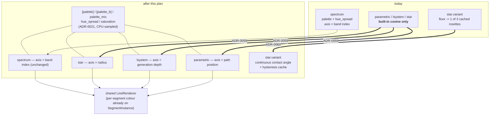

# 0054 — The line scenes catch up: every one honours the palette, and the star stops cutting between shapes

> **Status:** **approved 2026-08-02** — ready for `dev`. All four phases are `dev`; nothing gates
> it, so it can be taken in one session.
> **Created:** 2026-08-01
> **Owner skill(s):** dev
> **Related ADRs:** [0059](../adrs/0059-line-scenes-colour-along-their-generator-axis.md) (the
> colour half), [0060](../adrs/0060-star-pattern-variants-interpolate.md) (the geometry half),
> [0021](../adrs/0021-shared-palette-system.md) (the palette surface being extended),
> [0036](../adrs/0036-preset-reachable-spectrum.md) (the per-element channel both reuse),
> [0007](../adrs/0007-line-geometry-generators.md) (the generators).
> Closes [design-backlog 0026](../design-backlog.md) and [0007](../design-backlog.md).

## TL;DR

`spectrum` is the only line scene that reaches `[palette]` — `parametric_curve`, `lsystem` and
`star_pattern` still colour from the built-in cosine ramp, and `lsystem`'s thirteen params contain
exactly one colour lever. Give all four the palette surface, each colouring along the axis its own
generator makes meaningful (path position, generation depth, radius, band index). Then make
`star_pattern`'s `variant` a continuous contact angle instead of a `floor` into three cached
rosettes, so a bound or eased `variant` morphs rather than cuts. First user-visible behavior: a
fern whose older branches are a different colour from its new growth, and a rosette that changes
shape smoothly.

## Context & problem

Two blocked content asks in one subsystem, both with the user's own words behind them.

**[Design-backlog 0026](../design-backlog.md) — `lsystem` has no per-segment colour.** The lane
filed it as an asymmetry with `spectrum` that "looks unintentional"; the user's framing on
Arrowhead was that a flat hue makes a branching figure read as wire rather than growth. Reading the
code widened it: `spectrum.rs`'s module docs say it is **"the first line scene to honor the
palette; the others still colour from the built-in cosine"**. So three scenes reach neither
`[palette]`, `[palette_b]`, `palette_mix`, `hue_spread` nor `saturation`. `lsystem::PARAMS` has
`hue` and nothing else.

**[Design-backlog 0007](../design-backlog.md) — `star_pattern` cuts between shapes.** The user's
verdict was "idea is interesting but looks poor", and separately "change between star rosette
shapes should be smooth". `star.rs` precomputes one rosette per contact-angle offset and picks with
`idx = (variant.max(0.0) as usize).min(variants - 1)` — a floor into a small array. `[smoothing]`
on `variant` eases through fractional values the floor throws away, which reads as a stutter. The
lane's only mitigation was making the cut rare and hiding it under a redraw. The user decided
**invest, do not cut** on 2026-07-26 and it has been waiting for its ADR since.

The mechanism for the first is already built and proven: `Scene::set_param_series` (ADR-0036)
carries one evaluation per element for a binding naming `index`, and `spectrum` declares six
per-element params against a documented rule — whole-figure params degrade to their `index = 0`
value.

## Decision

Per [ADR-0059](../adrs/0059-line-scenes-colour-along-their-generator-axis.md): **every line scene
honours the palette, and each generator declares the axis its `hue_spread` walks** —
`parametric_curve` position along the traced path, `lsystem` **generation depth**, `star_pattern`
radius from centre, `spectrum` band index (unchanged). `hue_spread = 0` collapses each to today's
flat `hue`, so this is a strict superset and no shipped preset moves.

Per [ADR-0060](../adrs/0060-star-pattern-variants-interpolate.md): **`star_pattern` builds its
rosette from a continuous contact angle**, cached on a quantized key with hysteresis, so `variant`
becomes a real morph. Rejected there: cross-fading two cached variants (a dissolve, and on an
additive pipeline the overlap goes *brighter* exactly where the transition should hide),
interpolating cached vertex arrays (segment count and topology change with the angle, so there is
no correspondence to lerp), rebuilding every frame (violates ADR-0007's off-hot-path generator
rule), and cutting the scene (the user rejected it).

## Architecture diagram



The renderer does not change — `SegmentInstance` already carries a per-segment colour. What changes
is each generator's fill of it.

## Implementation phases

### Phase 1 — `lsystem` colours by generation depth

- **Owner skill:** dev
- **What:** the reported case first, so the plan's first commit is the thing that was asked for.
  `lsystem` gains `[palette]` / `[palette_b]` / `palette_mix` / `hue_spread` / `saturation`,
  sampled on the CPU exactly as `spectrum` does, with `hue_spread` walking **generation depth**
  normalized over `visible_depth`. Copy `spectrum`'s degradation rule verbatim for a series aimed
  at a whole-figure param.
- **Files touched:** `core/src/render/scenes/lines/lsystem.rs`, `presets/README.md`.
- **Done when:**
  - `hue_spread = 0` renders **byte-identical** to before the change on every shipped `lsystem`
    preset — the strict-superset claim, proven the Plan 0038 way: run the suite without blessing
    and show zero drift. If a baseline moves, the claim is wrong and that is a finding, not a
    re-bless.
  - With `hue_spread > 0`, segments at different generation depths carry different colours, and
    segments at the **same** depth carry the same one. That second half is what makes it depth
    rather than traversal order, and traversal order is the plausible way to get this wrong.
  - A `[palette]` set on an `lsystem` preset visibly changes its colours; with no `[palette]` the
    scene renders its previous cosine colours.

### Phase 2 — `parametric_curve` and `star_pattern` join

- **Owner skill:** dev
- **What:** the same surface on the other two generators, each on its declared axis —
  `parametric_curve` on normalized position along the traced path, `star_pattern` on normalized
  radius from the rosette centre.
- **Files touched:** `core/src/render/scenes/lines/parametric.rs`,
  `core/src/render/scenes/lines/star.rs`, `presets/README.md`.
- **Done when:**
  - `hue_spread = 0` is byte-identical on every shipped `rose_*`, `curve_*` and `star_*` preset,
    same proof as Phase 1.
  - On `parametric_curve`, a swept `hue_spread` colours the curve along its direction of travel —
    assert that the colour at the path's start differs from the colour at its end, which is the
    claim, rather than that "colours vary".
  - **`star_pattern`'s radial axis is honestly reported.** The backlog's finding is that segments
    cluster near the rim, so the reachable radius range is narrow. Measure and record what fraction
    of the radial range the figure actually occupies; if it is small enough that the ramp is
    invisible, say so in the commit rather than shipping a lever that does nothing.

### Phase 3 — `variant` becomes a continuous contact angle

- **Owner skill:** dev
- **What:** `star_pattern` builds from a continuous contact angle rather than indexing a fixed set.
  Keep a cache keyed on a **quantized** angle with hysteresis — rebuild when the requested angle
  moves more than one step from the built one, reuse otherwise — so generator work stays off the
  hot path per ADR-0007.

  **The step is measured, not assumed.** Pick it from two constraints: fine enough that stepping is
  invisible in motion, coarse enough that a fast `variant` sweep cannot rebuild every frame. State
  the measured rebuild cost and the chosen step in the commit.
- **Files touched:** `core/src/render/scenes/lines/star.rs`, `core/tests/fixtures/`,
  `core/tests/golden/` (the two `star_*` baselines move — see Risks), `presets/star_rosette.toml`,
  `presets/star_lantern.toml`.
- **Done when:**
  - **Intermediate `variant` values produce intermediate geometry.** Capture at `variant = 0`,
    `0.5` and `1`, and require the middle frame to differ from **both** ends. Under the old floor it
    was identical to one of them, which makes this non-vacuous in the way that matters.
  - **A swept `variant` does not rebuild every frame.** Sweep it across its range over a capture and
    assert the rebuild count is bounded by the range divided by the step, not by the frame count.
  - **The rebuild fits the frame budget**, measured at `TierConfig::max_segments` rather than
    asserted.
  - The two shipped `star_*` presets render sensibly at their existing `variant` values, and their
    moved baselines are re-blessed **deliberately**, with the numbers and an eyes-on description in
    the fixture header — the ceremony Plan 0051 established.

### Phase 4 — The docs, and what the axes are

- **Owner skill:** dev
- **What:** `presets/README.md` gains the colour surface for all four line scenes **and a table of
  which axis each one walks** — that table is the thing an author needs and cannot infer.
  `docs/preset-palettes.md` gains the per-scene colour params for the three new scenes.
  `docs/presets.md` needs checking for anything that says line scenes do not honour the palette.
  Each generator's module docs name its own axis beside the code that implements it.
- **Files touched:** `presets/README.md`, `docs/preset-palettes.md`, `docs/presets.md`,
  the four line-scene modules.
- **Done when:** no doc says a line scene cannot reach `[palette]`; the axis table names all four
  scenes; and `star_pattern`'s `variant` is documented as continuous with its stepping behaviour
  stated.

## Data shapes

No new structs. `SegmentInstance` already carries `color: [f32; 3]` per segment — this plan fills
it from the palette in three more scenes. Each generator gains the palette fields `spectrum`
already holds (`hue_spread`, `saturation`, `palette_mix` and the baked palette handles).

`star_pattern`'s cache key changes from a variant index to a quantized angle:

```rust
// illustrative — not the final interface
struct StarCache {
    built_angle_deg: f32,   // the angle the cached rosette was built at
    step_deg: f32,          // hysteresis: rebuild when |requested - built| > step
    segments: Vec<SegmentInstance>,
}
```

No `Scene` trait change, no C ABI change (stays v4), no new dependency.

## Risks & open questions

- **Two golden baselines will move in Phase 3, and this plan says so up front.** `star_rosette` and
  `star_lantern` bind `variant`; a continuous angle at the same numeric value is a different
  rosette. That is the decision landing, not a regression — but it must be re-blessed deliberately
  with recorded numbers, and `LMV_BLESS` rewrites **every** baseline the run touches, so restore
  the unrelated ones before committing.
- **Phases 1 and 2 claim byte-identity and that claim is load-bearing.** It rests on `hue_spread = 0`
  collapsing the ramp to a constant equal to today's `hue`. If the palette path rounds differently
  from the cosine path even at zero spread, baselines move and the superset claim is false —
  surface it rather than blessing through it.
- **The rebuild is newly reachable from a bound param.** Today `build` runs at `configure`;
  after Phase 3 a preset can reach it during playback. The hysteresis bounds the rate but the worst
  case is a rebuild inside a frame, which did not previously exist. If the measurement in Phase 3
  does not fit the budget, widen the step or stop — do not ship an unmeasured rebuild on the hot
  path.
- **`star_pattern`'s radial colour axis may be nearly useless until the interior question is
  answered.** The lane swept `contact_angle_deg` at 12 / 20 / 28 and found no meaningful interior
  change, which suggests the interior is not reachable from the current construction at all. Phase
  2 is written to measure and report rather than to pretend.
- **This plan does not answer "does the star scene earn its slot".** Smooth transitions between
  three ring-shaped rosettes are still ring-shaped rosettes. The user's "looks poor" verdict is
  about the interior, and that stays open.

## What this plan does NOT do

- **No interior redesign of the Hankin rosette.** More tilings, an off-centre construction, or
  drawing the underlying tiling grid are the named candidates and all three are generator design
  work needing their own record. ADR-0060's Notes carry the starting measurement.
- **No selectable colour axis.** ADR-0059 rejects `hue_axis` as surface for its own sake; the axis
  is one line per generator to change if the lane asks twice.
- **No change to the line renderer.** Per-segment colour already exists on `SegmentInstance`.
- **No change to `spectrum`.** It is the scene the others are catching up to.
- **No preset re-tune.** Shipped presets get the new surface at defaults that reproduce today's
  look; composing with it is a `preset-author` pass.

## Followups (after this lands)

- A `preset-author` pass on the `lsystem` and `rose_*` families, which now have a colour axis they
  did not have — the fern-as-growth reading is the motivating case.
- The `star_pattern` interior question ([design-backlog 0007](../design-backlog.md)'s second half),
  which decides whether the scene is good rather than whether it transitions well.
- If the lane asks for a path-position axis on `lsystem`, reopen ADR-0059's axis choice.
