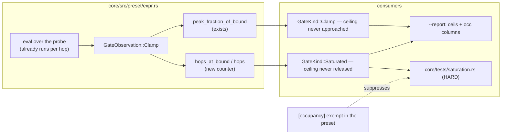

# 0056 — Clamp occupancy: the instrument that would have caught a saturated library, plus the axis anchor

> **Status:** draft
> **Created:** 2026-08-03
> **Owner skill(s):** dev
> **Related ADRs:** [0062](../adrs/0062-clamp-occupancy-is-the-saturation-instrument.md) (occupancy
> as a gate — this plan implements it), [0063](../adrs/0063-address-the-spectrum-by-frequency.md)
> (Phase 4 only: the external axis anchor, which is that ADR's cheap immediate half).
> Follows [Plan 0048](0048-analysis-v2-and-the-retune.md), whose Phase 7 found the gap.

## TL;DR

A `clamp()` in a preset binding stops varying when its inner value sits permanently at the
ceiling, and **nothing in this project can see that** — every reactivity instrument compares
against silence, where a saturated binding looks perfectly reactive. Plan 0048 Phase 7 measured
263 of 332 clamped band terms in exactly that state, across 14 presets with no live audio term at
all, behind a fully green suite. This plan records **occupancy** — the fraction of hops a clamp
spends at its bound — on the traversal that already computes the peak, prints it in `--report`,
and makes it a HARD gate. First visible behavior: `--report` gains an `occ` column that names the
saturated binding, not just the flat preset.

## Context & problem

ADR-0062 carries the full case. In short: reachability (ADR-0042/0043) watches **forks**, and a
gain contains none. `clamp(bass * 16, 0, 0.3)` reaches its ceiling at `bass = 0.019` and holds it
for anything above a whisper — an arithmetic expression that has quietly become a constant, with
no `select()` and no comparison for the walker to observe.

The data to detect it is already collected. `Expr::flag_gates` visits every `clamp()` on every hop
and computes `value / upper_bound`, keeping only the running maximum
(`GateObservation::Clamp { peak_fraction_of_bound }`, `core/src/preset/expr.rs:1129`). One counter
on the same traversal yields the statistic that names the defect.

Phase 4 is unrelated in mechanism and related in cause: `fft.rs:736` asserts `band_for_freq` agrees
with the edge table, but Plan 0048 Phase 1 moved both together and the test passed through the
rebuild unchanged — an internal-consistency check with no external anchor. It rides along here
because it is small, it is test-only, and it closes the second hole the same plan opened.

## Decision

Per ADR-0062: record occupancy alongside the existing peak fraction, surface it in `--report`, and
gate on it with an in-file exemption for clamps that are meant to pin. We rejected a mid-scale rung
in the reactivity gate (a frame differential names no binding, and costs another render pass per
band per preset on the software adapter) and a response-slope assertion (it would fail the
attractor family, which lowers `fade` and `size` on energy by design — "peak buys structure").

## Architecture diagram



## Implementation phases

### Phase 1 — Occupancy on the walk
- **Owner skill:** dev
- **What:** count hops where a `clamp()`'s inner value reaches its upper bound, alongside the
  existing peak, and expose it on the observation and as a new `GateKind`. No consumer yet — this
  phase is the measurement and its unit tests.
- **Files touched:** `core/src/preset/expr.rs`.
- **Done when:** a binding whose value is above its ceiling on every evaluated hop reports
  occupancy `1.0`, one that reaches the ceiling on none reports `0.0`, and one that crosses part
  way through reports the crossing fraction; the existing `peak_fraction_of_bound` is unchanged in
  value for every case (the two statistics are independent, and the ceiling-never-approached flag
  must not shift). A clamp evaluated zero times reports `0.0` and not a division by zero.

### Phase 2 — The `--report` column
- **Owner skill:** dev
- **What:** print occupancy per preset in the reachability block, and name each saturated binding
  the way `GATE` / `COMP` lines already name theirs.
- **Files touched:** `standalone/examples/shot.rs`, `docs/capturing.md`.
- **Done when:** running `--report --presets presets` over the **retuned** library reports no
  saturated bindings, and running it over a deliberately over-driven fixture names that binding
  with its occupancy. `docs/capturing.md`'s column table documents `occ` beside `ceils`, including
  the sentence that the two are opposite ends of the same measurement.

### Phase 3 — The gate, and the exemption
- **Owner skill:** dev
- **What:** a HARD test over the embedded set failing on occupancy above the threshold, plus the
  in-file exemption an intentionally-pinned clamp declares.
- **Files touched:** `core/tests/saturation.rs` (new), `core/src/preset/schema.rs`,
  `presets/README.md`, and whichever shipped presets legitimately pin.
- **Done when:** the shipped library passes; an over-driven fixture fails with a message naming the
  binding and stating the ceiling-is-reached-at level, so the fix is readable from the failure; and
  an exempted clamp passes while still appearing in `--report` (an exemption silences the gate, not
  the diagnostic). **The threshold is chosen by measuring the retuned library and picking a value
  clear of its highest legitimate occupancy — record the measured distribution in the phase commit
  rather than asserting 0.9 because this plan said so.** ADR-0062 offers 0.9 as a starting point,
  not a finding.

### Phase 4 — The axis anchor
- **Owner skill:** dev
- **What:** pin the frequency a handful of `bin()` positions resolve to, as an external anchor
  independent of the edge table (ADR-0063's immediate half).
- **Files touched:** `core/src/dsp/fft.rs` tests or `core/tests/dsp.rs`.
- **Done when:** the test states Hz for at least `x` = 0.0, 0.2, 0.31, 0.5, 0.84, 1.0 against
  literals **written from the values measured today, not computed from the layout function** — the
  whole point is that it must fail if the layout moves, which it cannot do if it re-derives from
  the thing that moved. A comment on the test says what a failure means: the axis was relaid and
  every `bin()` in `presets/` needs re-checking against the frequency its author named.

## Data shapes

```rust
// illustrative — not the final interface
GateObservation::Clamp {
    peak_fraction_of_bound: f32, // exists: highest value/bound seen (ceiling never bit)
    hops_at_bound: u32,          // new: hops where value >= bound
    hops: u32,                   // new: hops evaluated, so occupancy = at_bound / hops
}

GateKind::Saturated { occupancy: f32 } // new, beside GateKind::Clamp
```

The exemption is a preset-level table naming params, deliberately not a per-expression annotation —
the grammar stays a pure expression language (ADR-0020's line), and the exemption is metadata about
a binding rather than part of it:

```toml
# illustrative
[occupancy]
exempt = ["fade"]   # this clamp is a safety rail; pinning at peak is the design
```

## Risks & open questions

- **The threshold is a tuning parameter and there is no principled value.** Mitigated by deriving
  it from the retuned library's measured distribution in Phase 3 rather than asserting it here, and
  by the exemption path for the genuine cases. If the measurement shows legitimate occupancy
  crowding any plausible threshold, that is a finding worth surfacing before shipping the gate —
  the diagnostic column (Phase 2) is still worth having on its own.
- **The exemption can be used to make a real defect quiet.** Accepted deliberately; it is at least
  explicit, in the file, and visible in review, which is more than the current state offers. Phase 3
  keeps exempted bindings in the `--report` output for that reason.
- **One probe.** Occupancy inherits every limitation of the `dynamic:110` reachability stimulus,
  including the standing single-BPM `tempo` one-sidedness. It is advisory-quality evidence promoted
  to a gate, which is defensible only because the threshold is high and the exemption exists.
- **Phase 3 may find shipped presets that legitimately pin** and need exempting. That is expected
  work, not a signal the design is wrong — but if the count is large, the threshold is wrong.
- No real-time hazard: everything here runs in the reachability walk, which is offline harness and
  test code, never the per-frame render path.

## What this plan does NOT do

- **No `bin_hz()` / `bin_range()`.** ADR-0063's grammar half is its own plan; only the axis anchor
  rides along here.
- **No mid-scale rung in `core/tests/reactivity.rs`.** Rejected in ADR-0062, and revisitable only
  if occupancy proves to miss a real case.
- **No preset retune.** Plan 0048 Phase 7 did that; this plan builds the instrument that would have
  caught it, and the library is expected to pass on arrival.
- **No change to reachability's existing findings.** `GATE`, `COMP` and the ceiling-never-approached
  `ceils` behave exactly as they do today.

## Followups (after this lands)

- ADR-0063's grammar half (`bin_hz`, `bin_range`) as its own plan.
- Re-measure the occupancy threshold once the library has changed materially again — it is a
  measured constant, so it has a shelf life.
- If occupancy proves useful, the same walk could report the mirror for the *lower* clamp bound,
  which nothing currently observes at all.
