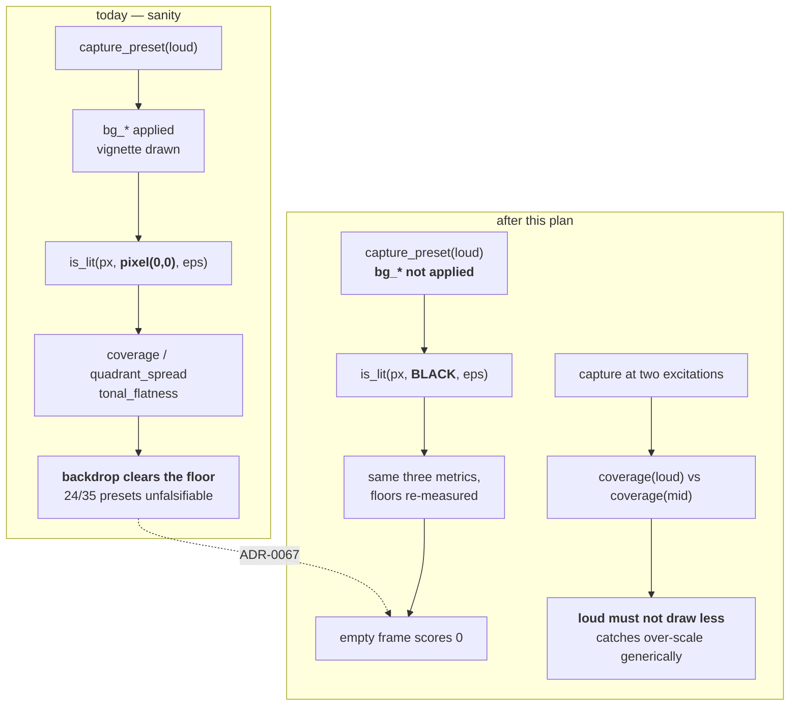

# 0058 — The gate can see an empty frame, and "loud" has to mean more picture

> **Status:** **approved 2026-08-03** — ready for `dev`. Phases 1-3 are `dev` and run in one
> session; **Phase 4 is `human`** (a `preset-author` re-scale) and is the only phase that moves a
> pixel, so the plan stops there by construction.
> **Created:** 2026-08-03
> **Owner skill(s):** dev, human
> **Related ADRs:** [0067](../adrs/0067-coverage-measures-the-scene-not-the-backdrop.md) (this
> plan implements it), [0062](../adrs/0062-clamp-occupancy-is-the-saturation-instrument.md) (the
> same class one layer up), [0049](../adrs/0049-analysis-v2-dual-resolution-axis-normalized-bands.md)
> (the normalization whose blast radius this contains).
> Closes [design-backlog 0053](../design-backlog.md).

## TL;DR

`sanity` measures "is something there" against **pixel (0, 0)**, and `bg_vignette` makes that corner
the darkest pixel in the frame — so the backdrop alone scores as a large lit figure. 24 of 35 presets
carry a vignette and the sparse-scene floor is 0.01, which makes the floor **unfalsifiable** for
most of the library. `spectrum_ridge` proved it by shipping a contour drawn 3.3 world units off the
top of a frame whose half-height is 1.0, and passing. This plan measures the scene against black,
re-measures every floor, and then adds the check the first one still cannot make: that a preset does
not draw **less** picture when the music gets louder. First visible behavior: the pre-repair
`spectrum_ridge` fails the gate it used to pass.

## Context & problem

[ADR-0067](../adrs/0067-coverage-measures-the-scene-not-the-backdrop.md) carries the full case. The
mechanism in one line: `is_lit(px, bg, eps)` is shared by `coverage`, `quadrant_spread` and
`tonal_flatness`, and `sanity` hands it the top-left pixel as `bg`.

Two things make that fatal rather than merely imprecise. `bg_vignette` guarantees the corner is the
frame's minimum, so the comparison is biased in exactly one direction — toward finding light. And
the floors are low by design (0.01 for every sparse system), because sparse scenes really do paint
little. The two together mean the backdrop clears the bar on its own.

The defect that exposed it is worth stating because it is a *class*, not an incident.
[Plan 0048](done/0048-analysis-v2-and-the-retune.md) Phase 7 retuned the library onto the normalized
band scale, and it searched for one shape: `clamp(band * G, 0, C)`, a gain with a ceiling. A
**world-space** param that multiplies a band into a coordinate — `spectrum`'s `scale`, and any
`bin()`- or `index`-driven geometry — has the same exposure with no `clamp` for that pass to find,
nothing for reachability to fork on, and nothing for ADR-0062's occupancy to observe. `spectrum_comb`
(`scale = 3.80`) and `spectrum_corona` (`scale = 5.20`) are still in that state today; their peaks
clip off the top edge on every beat, and they score well because a comb roots each bar on a baseline
so the body of the figure survives.

That is the generalization this plan is built around: **the instrument must not depend on knowing
which param is world-space.** A stimulus-relative check does not need to.

## Decision

Per ADR-0067: **the `sanity` capture does not apply the preset's `bg_*` bindings, and `is_lit`
compares against black**, so "lit" means "the scene drew this". Rejected there: hardening the
background sampler (treats the symptom — a lit backdrop is not a figure and no reference pixel makes
it one), an in-frame geometry fraction (needs a `Scene`-adjacent accessor and misses the three
scenes that draw no CPU geometry list), and tightening the floors (no single number can work when
the backdrop's contribution varies per preset).

Then, because a black-backdrop coverage check still only measures **one** excitation, Phase 3 adds
the property that names the over-scale class directly: **more audio must not produce less picture.**

## Architecture diagram



## Implementation phases

### Phase 1 — Coverage measures the scene

- **Owner skill:** dev
- **What:** the `sanity` capture stops applying the preset's `bg_*` bindings and compares against
  black. `background.rs` already defaults `bright` and `vignette` to `0.0`, so this is *not applying
  three bindings* rather than a new render path — do it the way that keeps the shipped composite
  untouched for every other caller (`golden`, `distinctness`, `shot` all keep today's behaviour).
- **Files touched:** `core/tests/sanity.rs`, and whichever seam lets a capture skip those bindings
  (prefer a test-side preset transform over widening the renderer API; if that proves impossible,
  stop and surface it rather than growing the capture surface).
- **Done when:**
  - A preset whose scene draws nothing scores coverage `0.0`, **proven against the real case**: the
    pre-repair `spectrum_ridge` (`scale = 3.20`, see `git show 81190ac^:presets/spectrum_ridge.toml`)
    fails this gate. This is the non-vacuity check and it is the point of the phase — a gate that
    cannot fail the defect that motivated it has not been built.
  - Every other shipped preset still passes, or a preset that now fails is reported as a **finding**
    rather than fixed by lowering a floor.
  - `golden`, `distinctness` and `shot` output are byte-unchanged — this phase moves no pixels
    anywhere except inside `sanity`'s own capture.

### Phase 2 — The floors are re-measured

- **Owner skill:** dev
- **What:** re-derive the per-system coverage floors and the `MAX_TONAL_FLATNESS` ceiling from the
  shipped library under the Phase 1 measurement, and record the distributions on the constants — the
  ceremony ADR-0062's `SATURATED_OCCUPANCY` established.
- **Files touched:** `core/tests/sanity.rs`.
- **Done when:**
  - Every floor is a number with a printed distribution behind it, and the gap between the floor and
    the lowest passing preset is **stated**. A floor no preset comes within a factor of two of is a
    floor that is not doing anything — say so rather than leaving it.
  - The tonal-flatness distribution is re-measured too, because removing the backdrop changes which
    pixels are counted. **`spectrum_ridge` currently sits at `0.8655` against a `0.90` ceiling with
    only `0.035` of margin** (`core/tests/sanity.rs`), so this phase either widens that gap or
    reports that it cannot — the honest outcome is a finding, not a nudged constant.
  - `KNOWN_FLAT` is still empty. If Phase 1's change puts a preset back over the ceiling, that is a
    real defect to route, not an entry to re-add.

### Phase 3 — More audio must not mean less picture

- **Owner skill:** dev
- **What:** the check Phase 1 cannot make. Capture each preset at **two** excitations and assert the
  louder one does not collapse. This is the generic form of the over-scale defect: a world-space
  param driven past the frame reduces what is drawn as the level rises, and no per-param knowledge
  is needed to see it.
- **Files touched:** `core/tests/sanity.rs`, `presets/README.md`.
- **Done when:**
  - The property is asserted as a **ratio against the preset's own moderate-excitation coverage**,
    not as an absolute floor — the scenes differ by two orders of magnitude in how much they paint,
    which is why the existing floors are per-system.
  - **The threshold is measured, not asserted here.** Run the whole library at both excitations,
    record the distribution, and choose a ratio clear of the quietest legitimate case. Some presets
    legitimately paint *slightly* less when loud (a figure that tightens on a hit — the attractor
    family's "peak buys structure" idiom, ADR-0062's Alternatives records it as real), so the
    threshold must accommodate that or it convicts correct content.
  - Non-vacuity again: `spectrum_comb` at its shipped `scale = 3.80` is the live candidate. State
    whether it fails, and if it does **not**, say so plainly — a comb roots each bar on a baseline so
    clipping the tips costs it little coverage, and that would mean this check does not reach the
    layout it was designed around. That is a finding worth having.
  - `presets/README.md` gains the rule in the authoring voice: a world-space param multiplying a band
    is not bounded by its clamp, and the frame is the bound.

### Phase 4 — The two over-scaled presets

- **Owner skill:** human
- **What:** a `preset-author` pass re-scaling `spectrum_comb` and `spectrum_corona` onto the
  normalized band scale, verified with the instruments Phases 1–3 provide rather than by eye. The
  reference is the `spectrum_ridge` repair in `81190ac`: `3.20 -> 0.60`, chosen so a fully-driven
  element lands just inside the frame.
- **Files touched:** `presets/spectrum_comb.toml`, `presets/spectrum_corona.toml`.
- **Done when:** both presets keep their whole figure in frame at full drive; both pass Phases 1–3;
  the chosen factors and the sweep behind them are recorded in each file's header. **Their golden
  baselines will move** — re-bless deliberately with the numbers and an eyes-on description, and
  restore any unrelated baseline `LMV_BLESS` rewrites.

## Data shapes

No new types. The change is which `bg` value reaches an existing predicate, plus one new
per-preset ratio computed from two existing captures:

```rust
// illustrative — not the final interface
let lit_loud = coverage(&loud_img, BLACK, EPS);
let lit_mid  = coverage(&mid_img,  BLACK, EPS);
// a figure driven off-frame collapses as the level rises
assert!(lit_loud >= LOUD_COLLAPSE_RATIO * lit_mid);
```

No `Scene` trait change, no C ABI change (stays v4), no new dependency, and nothing on the per-frame
render path.

## Risks & open questions

- **Phase 1 may fail presets that are actually fine.** A scene drawing genuinely faint light over a
  lifted backdrop could sit under `eps = 10` against black. If that happens the answer is a measured
  `eps`, not a lowered floor — and it is a finding about the additive-alpha work
  ([ADR-0056](../adrs/0056-additive-scenes-emit-premultiplied-alpha.md)), so surface it.
- **Phase 3's threshold may not exist.** If the legitimate "tightens on a hit" presets overlap the
  over-scaled ones, there is no ratio that separates them and the check should ship as a **report**
  rather than a gate — the same call ADR-0062 made in reverse when it took the gate. Deciding that
  needs the measurement, so it is not pre-empted here.
- **Phase 4 moves golden baselines**, the only pixels this plan moves anywhere.
- **This plan does not make `sanity` see the `Rich` tier.** It renders at `Floor`, which is where
  [Plan 0056](done/0056-clamp-occupancy-and-the-axis-anchor.md) Phase 5 found the flat-frame
  statistic blind to the attractor saturation it was aimed at. Orthogonal, and noted so the two are
  not confused.

## What this plan does NOT do

- **No in-frame geometry fraction.** ADR-0067's strongest rejected alternative, and the one to
  revisit if the pixel measure proves blunt on the line and spectrum families.
- **No change to `golden`, `distinctness`, `reactivity` or `shot`.** They keep the shipped composite,
  backdrop included; only `sanity`'s own capture changes.
- **No new backdrop capability**, and no widening of the renderer's capture surface if a test-side
  transform will do.
- **No re-tune of any preset except the two in Phase 4.**

## Followups (after this lands)

- The in-frame geometry fraction as a supplement for CPU-geometry scenes, if Phase 3's measurement
  shows the pixel ratio cannot reach a comb's clipped tips.
- Whether `sanity` should also run at `Rich` — [ADR-0064](../adrs/0064-a-capture-may-pin-the-rich-tier.md)
  and `shot --tier` make it possible, and Plan 0056 Phase 5's measurement is the argument for it.
