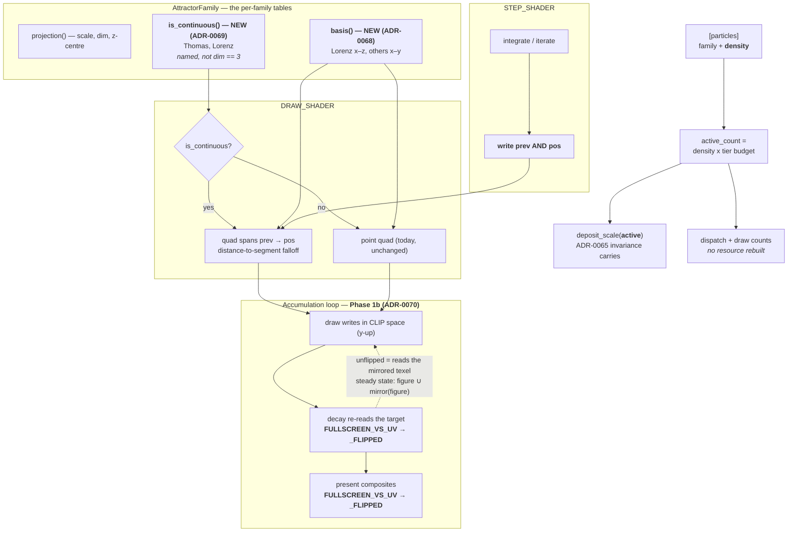

# 0059 — Lorenz finds its plane, and the attractor can trade samples for curves

> **Status:** **in progress** — approved 2026-08-03; **Phases 1 and 1b landed 2026-08-04**, Phase 2
> is next. Phases 1-3 are `dev` and run in one
> session; **Phase 4 is `human`** (the one content pass) and **may route back to `architect`** if
> `density` + `fade` cannot hold a legible curve, so the plan does not close in one sitting.
> **Created:** 2026-08-03
> **Owner skill(s):** dev, human
> **Related ADRs:** [0068](../adrs/0068-the-projection-basis-is-a-per-family-property.md) (Phase 1),
> [0070](../adrs/0070-a-feedback-pass-addresses-its-own-target-in-framebuffer-space.md) (Phase 1b),
> [0069](../adrs/0069-the-attractor-trades-sample-count-for-trace-length.md) (Phases 2-3).
> Depends on [ADR-0065](../adrs/0065-the-attractor-deposit-is-normalized-by-particle-count.md) —
> the normalization that makes a preset-chosen count safe — and inherits
> [ADR-0066](../adrs/0066-a-reseed-disturbs-the-cloud-rather-than-replacing-it.md)'s kick.
> **Successor to [Plan 0057](done/0057-the-attractors-compute-path.md)**, whose Phase 4 diagnosed
> this and stopped by its own instruction; closes [backlog 0048](../design-backlog.md).
>
> **Amended 2026-08-03, mid-Phase-1.** Phase 1's done-when asked for the butterfly "at a rest angle
> *and* at a quarter turn". The second half is unsatisfiable in principle and the plan was wrong to
> ask for it: the spin is a turntable about the vertical, so a quarter turn shows y–z whatever the
> basis is, and the butterfly lives in exactly one plane. The old basis's quarter turn was z–y — the
> *same plane transposed* — so that capture never discriminated a basis at all. The criterion is
> restated below as the property it was proxying (a rigid rotation, not a shear), which is checkable,
> and which the Phase 1 captures already satisfy. The consequence for the *look* — that Lorenz reads
> as the butterfly for only part of the spin cycle — is a real question and moves to Phase 4, where
> it can be judged in motion.
>
> **Amended 2026-08-04, after Phase 1 landed (`357a17e`).** Phase 1's basis is correct and its
> measurable done-whens are met, but its *described* criterion — "Lorenz reads as the butterfly at
> rest" — was still not satisfied, and the reason is not the basis. **The attractor trail mirrors
> itself vertically**: the decay pass samples the accumulation target with the unflipped fullscreen
> prelude while the draw pass writes that same target in clip space, so the feedback re-reads its
> own history mirrored and the steady state is `figure ∪ mirror(figure)`. That is why the corrected
> x–z plane still rendered as an X. It is older than this plan and older than ADR-0068 — the old
> x–y basis doubled the same way. **New Phase 1b** takes it, per
> [ADR-0070](../adrs/0070-a-feedback-pass-addresses-its-own-target-in-framebuffer-space.md), placed
> before Phase 2 so that every capture Phases 2-4 judge is of a figure that will not change shape
> again. Phases 2, 3 and 4 keep their numbers and their content. **Two golden baselines now move**
> (`attractor.png`, `reaction_diffusion.png`), which contradicts this plan's original "no golden
> baseline moves" claim and the roster row that repeated it; both are corrected below.

## TL;DR

`attractor_lorenz` renders the wrong plane. The shared 3-D projection uses `y` as the vertical and
rotates `x` against `z`, so the rest view is x–y and the quarter turn is z–y — and the butterfly
lives in **x–z**. Plan 0057 Phase 4 proved it with a discriminating capture and routed the fix here,
because changing a shared convention for one family is a decision rather than a constant. Phase 1
takes it — and, landed, it was **still an X**, because the trail feedback mirrors itself vertically
and every attractor has been rendering as `figure ∪ mirror(figure)`. Phase 1b takes that. Phases 2
and 3 then take the half neither fix can reach: corrected to x–z the figure
still reads as **stipple**, because the scene draws 50 000 independent samples of the invariant
measure where the iconic plot follows one trajectory as a curve — so `[particles]` gains a `density`
fraction and the continuous families draw a segment instead of a point. Phase 4 is the one content
pass over all six attractor presets. First visible behavior: Lorenz has a shape.

## Context & problem

The two ADRs carry the mechanisms and the measurements. What justifies one plan rather than two is
the same coupling Plan 0057 was built around, and it is concrete: **all four phases move
`attractor_lorenz`'s look**, and Plan 0057 Phase 6 already withheld that preset's re-tune on the
grounds that judging a figure about to change shape is judging nothing. Split into two plans, that
preset is re-authored twice.

Three things carry forward from Plan 0057 and are stated here rather than only in its file:

- **The diagnosis is settled and does not need re-litigating.** Lorenz occupies 5.89 % of its own
  bounding volume, stable from 60 through 240 to 600 frames, so it is converged — this is not
  integration and not an un-converged seed. The capture that discriminates the basis needs
  `SPIN_RATE` pinned to `0`, or the frame is the 41° the spin reaches by frame 240 rather than the
  rest basis being reasoned about.
- **`shot --tier floor|rich` and `--at <hop>` both exist**, and this plan's captures use them. A
  `Rich` capture is an instrument and never a baseline.
- **Phase 2 of Plan 0057 returned 3x of headroom**, which is the budget Phase 4 here spends.

## Decision

Per ADR-0068: a **per-family projection basis in code**, Lorenz x–z, everyone else unchanged — no
preset key, because five of the six presets have no opinion. Rejected there: a preset-facing view
parameter (makes every preset answer a question five do not have, and still needs a default
underneath), re-centring Lorenz's coefficients (makes the shipped `sigma`/`rho`/`beta` name something
other than the textbook system every header cites), and keying the basis off `dim == 3.0` (the
ADR-0037 trap in another costume — `dim` and "wants a non-default basis" agree on today's roster of
four and are not the same property).

Per ADR-0069: **`density` plus the streak, as one decision**, because the arithmetic says neither
delivers alone. A `prev → current` segment is worth ~1.8x a point's footprint at Lorenz's measured
per-frame travel — it closes the beading and is not a trace — and trace length can only come from
persistence, which needs sparsity the engine cannot currently express. Rejected there: the streak
alone (a denser fog, not curves), `density` alone (ships the beading artifact it makes visible), a
4-segment sub-step polyline (the four sub-steps span the *same* 1.8 diameters, so it is 4x the fill
for less than a point radius of difference), per-particle position history (the right successor, and
undemonstrable until a sparse preset exists to compare against), and a bindable `density` (an eased
integer count re-decides the picture every frame).

Per ADR-0070: **a pass that samples the target it writes addresses it in framebuffer space**, so
`FULLSCREEN_VS_UV` is retired rather than re-documented. Its stated contract — "every pass uses this
convention, so the flips cancel" — describes no achievable arrangement: the mirror is complete
within a single pass. Rejected there: fixing only the attractor's two call sites and correcting the
prelude's doc (the corrected precondition is a property of each caller's fragment shader, not of the
prelude, so the trap survives for the next caller), making the draw pass write Y-down instead (puts
the compensation on the space that carries `pan_y` and ADR-0068's basis, at maximum distance from
the cause), a doc fix with no gate, and leaving reaction-diffusion on its own per-scene proof.

**Phase order is basis → un-mirror → density → streak → content**, so that each capture the content
pass judges is of a figure that will not change shape again.

## Architecture diagram



## Implementation phases

### Phase 1 — Lorenz renders its own plane

- **Owner skill:** dev
- **What:** `AttractorFamily` gains a projection basis (ADR-0068); Lorenz returns x–z, every other
  family keeps x–y. It reaches the draw shader as axis selectors in the existing draw uniform — one
  pipeline, one draw call, no second shader. **Name the basis outright**; do not derive it from
  `projection().1 == 3.0`.
- **Files touched:** `core/src/render/scenes/particles/mod.rs`, `presets/README.md`.
- **Done when:**
  - **Lorenz reads as the butterfly at rest**, captured with `SPIN_RATE` pinned to `0` — two lobes
    with the notch on the centre of the edge where they converge. **This is a described property, not
    a threshold**: nothing in the harness can score "looks like a butterfly", and inventing a number
    for it would be inventing a measurement.
  - **The quarter turn shows that the spin is a rigid rotation about the vertical, not a shear.**
    It cannot show the butterfly, and no basis can make it: a turntable spin about the vertical
    necessarily leaves the butterfly's plane, and at 90° the view is y–z, which is a legitimately
    low-structure projection of this attractor (`corr(x, y) = 0.87`, so y–z is x–z with the notch
    smeared shut). What the second angle *does* discriminate is the failure the two-angle check was
    written for — a half-applied basis, `bv` moved to `z` while `bh` is left on `z`, which renders
    `(z, z)`: a diagonal streak. So capture the quarter turn and record two extents against the rest
    frame:
    - **the vertical extent is unchanged**, because `screen.y = dot(p, bv)` has no `θ` in it. Exactly
      1.00, up to measurement noise on a bloomed capture.
    - **the horizontal extent is the attractor's `y` span where the rest frame's was its `x` span** —
      `50.7 / 37.4 = 1.36` from the ODE's own bounds, which are the bounds ADR-0068 read back off the
      particle buffer. A half-applied basis gives `44.4 / 37.4 = 1.19` *and* a figure collapsed onto
      a line, which is the visible half of the same check.

    Both numbers are earned from the attractor's measured extents rather than picked, and both are
    already satisfied by the Phase 1 captures: 686/501 = **1.37** horizontal, 695/685 = **1.01**
    vertical.
  - **De Jong, Clifford and Thomas captures are byte-identical**, verified rather than reasoned.
    Thomas is the one to check — it is the other user of the 3-D branch, and its cyclic symmetry is
    why it does not *need* x–z, not a reason a change to it would be free.
  - **No golden baseline moves.** `core/tests/fixtures/attractor.toml` runs the default De Jong.
  - A test pins the basis per family against an explicit expected table, so a fifth family cannot be
    added without choosing one.
  - `presets/README.md`'s attractor section says which plane each family is viewed in, since an
    author tuning `zoom`/`pan_*` on Lorenz has been aiming at a different figure than they thought.

### Phase 1b — The trail stops mirroring itself

- **Owner skill:** dev
- **What:** retire `gpu::FULLSCREEN_VS_UV` (ADR-0070). The attractor's decay and present passes
  take `FULLSCREEN_VS_UV_FLIPPED`, whose `uv` round-trips to the texel the fragment writes;
  reaction-diffusion's init, sim and present move **together** to the same prelude, since RD's
  `uv`-addressed terms (init blob centres, the sim's injection stamp, the present's zoom/pan sample
  window) have to keep agreeing with one another. After this the unflipped prelude has no callers
  and is deleted.
- **Files touched:** `core/src/render/gpu.rs`, `core/src/render/scenes/particles/mod.rs`,
  `core/src/render/scenes/reaction_diffusion.rs`, `core/tests/golden/attractor.png`,
  `core/tests/golden/reaction_diffusion.png`, plus wherever the new gate lands.
- **Done when:**
  - **`pan_y` moves the figure, asserted as a gate.** With a non-zero `pan_y` on an attractor
    preset, the lit centroid's vertical offset from the frame centre is at least some margin.
    **Measure the margin, do not pick it**: render at two or three `pan_y` values, record the
    centroid offset each produces, and set the threshold below the smallest with room for capture
    noise — then state both numbers in the commit. The assertion must be shown **non-vacuous**: it
    fails on the pre-Phase-1b code, where the mirror doubling pins the centroid to the centre line
    whatever `pan_y` says. Run that check and record it, rather than asserting it here.
  - **Lorenz reads as the butterfly at rest** — the Phase 1 criterion, now reachable. Captured with
    `SPIN_RATE` pinned to `0`: a single figure, wings up and out, notch at the top centre,
    converging to a tail. Still a described property and still not a threshold; the *measurable*
    companion is the one above.
  - **The orientation is right, not merely single.** Assert against the attractor's own data rather
    than against taste: read back the particle buffer and check that the rendered figure's widest
    row sits where the buffer's widest `|x|` band sits. The buffer says high `z` is at the wing
    tips (`|x| > 14` → mean `z` 36.9; `|x| < 2` → 19.8), so with `+z` up the widest row is near the
    **top**. A both-flips-missing render puts it at the bottom, and a one-flip render is the
    doubled X — so this discriminates all three states.
  - **Exactly two baselines move**, re-blessed deliberately: `attractor.png` and
    `reaction_diffusion.png`. Verify the other eleven are untouched **before** blessing — golden
    bless is not scoped to the failing fixture, and an unrelated baseline swept into this commit is
    the failure mode this repo has already hit.
  - **RD's pattern is equivalent, not merely different.** Flipping all three RD passes together
    should be a global relabelling: the same Gray-Scott dynamics on a mirrored blob layout. Check
    it rather than assuming — compare the new capture against a vertical mirror of the old one and
    state the residual. If they are *not* near-mirrors, something beyond orientation moved and this
    phase stops.
  - **RD's `pan_y` direction is recorded.** It reverses. Say so in the commit and state which way
    each of the four RD presets now drifts; a slow drift reversing is expected to read as neutral,
    and if any preset reads worse that is a followup, not a fix inside this phase.
  - `gpu.rs` no longer contains `FULLSCREEN_VS_UV`, and the surviving prelude's doc comment states
    the real rule — a pass that samples the target it writes addresses it in framebuffer space,
    by round-tripping `uv` or by `textureLoad` on `@builtin(position)`. **Do not rename**
    `FULLSCREEN_VS_UV_FLIPPED` in this phase (ADR-0070's Negative section); a behaviour change and
    a symbol rename should not share a diff.

### Phase 2 — A preset can choose how many samples it draws

- **Owner skill:** dev
- **What:** `[particles] density`, a fraction of the tier's particle budget, defaulting to `1.0`
  (ADR-0069). It selects an **active count** and rebuilds nothing: the buffer stays allocated at the
  tier budget, the compute already returns early on `i >= step.count`, and the draw's instance count
  becomes the active count. `deposit_scale` takes the **active** count so ADR-0065's invariance
  carries across the new dial.
- **Files touched:** `core/src/render/scenes/particles/mod.rs`, `core/src/preset/schema.rs`,
  `presets/README.md`, `docs/presets.md` if the structural-table reference lists `[particles]` keys.
- **Done when:**
  - `density` is validated at load with a stated range and a named error, like every other structural
    key. **Pick the floor from the arithmetic, not by feel**: state what the smallest allowed value
    resolves to at both tiers and why a cloud that sparse is still a picture.
  - **Total deposited light is invariant across `density`**, asserted on the value the way ADR-0065's
    scalar already is: `active_count * deposit_scale(active_count)` is constant. This is the property
    that makes the key structural rather than an exposure control, so it is asserted, not observed.
  - **A density change rebuilds no GPU resource.** Assert the inert tail directly — after N frames at
    a reduced density, positions beyond `active_count` are **unchanged** from their seeded values,
    read through Plan 0057's `read_positions`. That also proves the early-return guard is what is
    doing the work.
  - `density = 1.0` is byte-identical to today for every shipped preset, and **no golden baseline
    moves** — no fixture declares `[particles]`.
  - `presets/README.md` documents the trade in the authoring voice: `density` and `fade` are one look
    together, low density plus high `fade` is curves, high density plus high `fade` is fog, and the
    tier caps the top rather than setting the value.

### Phase 3 — The continuous families draw a segment

- **Owner skill:** dev
- **What:** the step shader writes each particle's pre-integration position alongside its new one;
  the draw expands a continuous family's instance into a quad spanning `prev → pos`, with the
  fragment's radial falloff becoming a distance-to-segment falloff. **Discrete maps keep the point.**
  The predicate is a named `is_continuous()`, not `dim == 3.0`.
- **Files touched:** `core/src/render/scenes/particles/mod.rs`, `presets/README.md`.
- **Done when:**
  - **The segment's endpoints are this frame's `pos` and the previous frame's `pos`**, asserted as a
    property of the shader's inputs rather than of the pixels — a readback of `prev` after frame N
    equals the readback of `pos` after frame N-1. Zero gap by construction is what "the beading
    closes" means, and it is checkable where "is the stroke connected" is not.
  - `is_continuous()` is pinned against an explicit per-family table, **with the test stating that
    its agreement with `dim == 3.0` is a coincidence of the current roster** — the same hazard
    ADR-0068 Alternative C declines. A 2-D flow or a 3-D map must force a choice.
  - **De Jong and Clifford captures are byte-identical and no golden baseline moves.** A chord across
    a discrete map's scattered successive points is meaningless geometry drawn brightly; the test
    that the maps are unchanged is what proves they never take the branch.
  - The reseed's long streak is **reachable both ways** — drawn, and suppressed on the jitter frame —
    behind whichever mechanism is cheapest to flip for a capture, because Phase 4 decides it and this
    phase must not. Say in the commit which is the shipped default and that it is provisional.
  - `Particle`'s "std430 stride is a tight 16" note is corrected, and the memory cost at both tier
    budgets is stated.
  - **Record the exposure change rather than normalizing it.** A segment emits more light than a
    point, by a ratio that varies with local speed; ADR-0069 accepts that deliberately and names the
    content pass as the lever. Measure the frame's mean luminance before and after on one continuous
    preset so Phase 4 knows what it is compensating for.

### Phase 4 — The one content pass

- **Owner skill:** human
- **What:** run the `preset-author` lane over the attractor family **once**, judged at both tiers
  with `--tier`. Four things settle in the same pass: `attractor_lorenz` re-authored against a figure
  that now has a shape (Plan 0057 Phase 6 withheld this deliberately); whether `density` + `fade` can
  hold a legible curve, which is the question ADR-0069's Alternative D waits on; the reseed-streak
  A/B from Phase 3; and the exposure shift the streak introduces on `attractor_thomas` as well as
  Lorenz.
- **Files touched:** `presets/attractor_*.toml`.
- **Done when:**
  - Each preset touched is judged at both tiers and the commit states which levers moved per preset.
    Tonal flatness and coverage are recorded before and after — both are printed by `sanity` on every
    run, and the coverage floors are live gates now, so a re-raise that moves the family minimum will
    fail `report_coverage_distribution` with the number rather than drifting.
  - **The reseed-streak question is answered from a rendered A/B**, not from argument, and the answer
    is written onto the constant or the flag that carries it.
  - **`density` + `fade` gets a verdict in writing.** If a legible curve is reachable, say at what
    values. If it is **not**, that is the finding ADR-0069's Alternative D is waiting for, and it
    routes back to `architect` with the captures rather than being worked around in content.
  - **No preset's identity changes**: no palette, family or coefficient base moves. This is a re-gain
    and a re-aim, not a re-design.
  - **The spin's dwell gets a verdict**, added by the 2026-08-03 amendment. `SPIN_RATE = 0.18 rad/s`
    turns Lorenz through a full revolution every 34.9 s, and the butterfly is only legible near 0°
    and 180° — near 90° and 270° the view is y–z and has no notch, so a basis fix alone leaves the
    preset reading as a cloud for a good part of every cycle. Judge it **in motion, with the streak
    in hand**, because a banded trajectory may read as structure where a stipple of the same measure
    does not. If it still reads as dead, the lever is the **spin** — a slower rate, or a sway that
    dwells near the plane instead of a full turntable — and that is a per-family look decision that
    routes back to `architect` as an ADR-0068 supplement, not something to work around in content.

## Data shapes

```rust
// illustrative — not the final interface

// Phase 1 (ADR-0068): named, exhaustive, beside the tables it belongs with.
fn basis(self) -> Basis { match self { Lorenz => Basis::XZ, _ => Basis::XY } }

// Phase 2 (ADR-0069): a fraction of the tier's budget, resolved once at load.
struct RawParticles { family: String, density: Option<f32> }
let active = (tier.attractor_particles as f32 * density).round() as u32;
let deposit = deposit_scale(active);   // ADR-0065 invariance, over the ACTIVE count

// Phase 3: the sub-step positions are NOT kept — only the frame's endpoints.
struct Particle { pos: [f32; 3], seed: f32, prev: [f32; 3], _pad: f32 }
```

No `Scene` trait change, no C ABI change (stays v4), no new dependency, no new pass, no new pipeline.

## Risks & open questions

- **Phase 4 may route back, and ADR-0069 names where.** If `density` + `fade` cannot hold a curve,
  per-particle position history (Alternative D) is the successor — and it will then have the rendered
  case it currently lacks, which is exactly why it was not taken first.
- **The streak's exposure shift is unnormalized on purpose.** A length normalization is a second
  constant with no measurement behind it, and speed-dependent brightness may be the correct rendering
  of a trajectory. If Phase 4 finds it unmanageable, that is the measurement the normalization needs.
- **`density` is a new way to be wrong**, and it is not independent of `fade` or the tier. The
  mitigation is documentation plus the fact that the tier caps the top; there is no gate that can
  tell a deliberate sparse look from an accidental one.
- **A basis fixes one angle, and the scene rotates.** The butterfly is a property of the x–z plane,
  so the spin carries the figure out of legibility and back twice per revolution; ADR-0068 buys the
  shape, not the shape at every angle. Named here rather than left implicit because the plan's own
  Phase 1 criterion originally assumed otherwise. Phase 4 decides whether it matters.
- **`attractor_lorenz` has never been authored against its real figure**, so Phase 4's work on it is
  closer to first authoring than to a re-tune. Budget accordingly. **Amended 2026-08-04: this is
  true of all six, not one.** Every attractor preset was tuned against a vertically doubled figure —
  twice the geometry at half the meaning — so `fade`, `size` and the brightness balance were all set
  against something that will not exist after Phase 1b, and all six `pan_y` drifts were authored as
  if they panned when they pulsed. Phase 4 grows accordingly.
- **The mirror bug was invisible to every gate this project owns**, because the doubling makes the
  output mirror-symmetric and so conceals its own symptom. Phase 1b's `pan_y` gate closes exactly
  that hole and nothing wider; a figure wrong in a way that survives a centroid check is still
  unguarded.
- **No real-time hazard.** `density` is load-time and changes two integers; `prev` is written by the
  dispatch that already runs; the streak is the same draw call with a differently-shaped quad. No new
  allocation, no audio-thread contact.

## What this plan does NOT do

- **No preset-facing view basis.** ADR-0068 declines it; the expressive version is a superset that
  can supersede later if a look wants an animated viewing plane.
- **No per-particle position history.** ADR-0069's Alternative D, deliberately deferred to Phase 4's
  verdict.
- **No sub-step polyline.** Rejected by measurement, not by taste.
- **No rename of `FULLSCREEN_VS_UV_FLIPPED`**, which Phase 1b leaves as the only uv prelude and
  therefore misleadingly named. ADR-0070 records it as a deliberate followup: a behaviour change and
  a symbol rename do not share a diff.
- **No re-authoring of the four reaction-diffusion presets.** Phase 1b reverses their `pan_y` and
  records which way each now drifts; if one reads worse, that is a followup, not this plan.
- **No `Rich` golden baselines**, and no tier calibration — Plan 0044 Phase 4 stays open and
  on-device.
- **No change to the reseed gates or to `JITTER_FRACTION`.** Plan 0057 Phase 6 set both against
  measured onset levels; this plan changes what a kick *draws*, not when it fires or how far it goes.

## Followups (after this lands)

- **Rename `FULLSCREEN_VS_UV_FLIPPED`** once Phase 1b leaves it the only uv prelude — "flipped"
  will name a contrast with a symbol that no longer exists (ADR-0070).
- **A look check on the four reaction-diffusion presets**, whose `pan_y` Phase 1b reverses. Expected
  neutral (a slow drift running the other way), so it is a check rather than planned work.
- **Whether the `pan_y` gate generalizes** to every scene exposing `pan_*`. Phase 1b scopes it to
  the attractor, where the defect was; the same assertion would cover `reaction_diffusion`,
  `swarm` and the line scenes for the cost of more WARP captures. Nobody has asked yet.
- Re-check whether the streak wants a length normalization, with Phase 4's numbers.
- **Whether the spin is a per-family property too**, if Phase 4 finds the y–z half of the turn reads
  as dead. Today `SPIN_RATE` is one shared constant and the spin is always a full turntable about the
  vertical; the candidates are a per-family rate and a bounded sway that dwells near the family's own
  plane. It is an ADR-0068 supplement and it needs Phase 4's rendered case first — the same reason
  ADR-0069 Alternative D waits.
- Whether the swarm — the other GPU particle scene — has anything to gain from `density`. It has its
  own tier field and its own draw, and nobody has asked.
