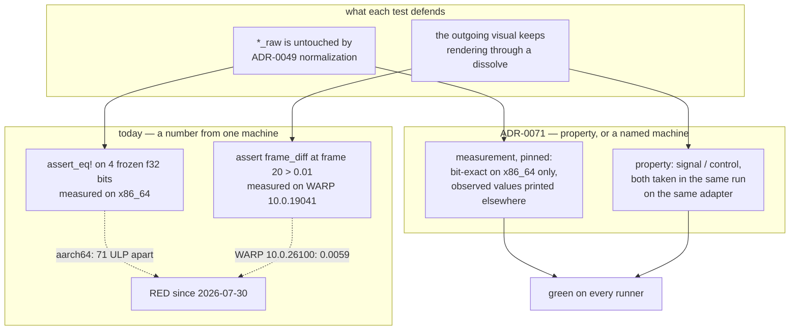

# 0060 — A test number states a property, or names its machine

> **Status:** **in-progress 2026-08-04** — Phase 1 landing. Three phases; Phase 2 is `human` (push
> the Phase 1 commit, then hand back what the two runners printed) and gates Phase 3, so this plan
> does **not** run start-to-finish in one session. Phase 1 alone turns CI green.
> **Created:** 2026-08-04
> **Owner skill(s):** dev, human
> **Related ADRs:** [0071](../adrs/0071-a-numeric-test-contract-states-a-property-or-names-its-machine.md)
> (this plan's decision), [0016](../adrs/0016-gpu-tests-opt-in-ci-scope.md) (the skip-with-notice
> shape reused here), [0023](../adrs/0023-golden-drift-guard-uses-frozen-fixtures.md) (whose
> `MEAN_TOL` is the noise floor one threshold is measured against),
> [0049](../adrs/0049-analysis-v2-dual-resolution-axis-normalized-bands.md) (the raw levels one
> test defends).

## TL;DR

CI has been red since 2026-07-30 — five consecutive pushes — because two tests freeze a number
that only exists on the machine that measured it. One asserts bit-exact `f32` literals taken on
x86_64 and has never once passed on the arm64 macOS runner; the other asserts a pixel-difference
floor of `0.01`, which is **half** the `0.02` this project already calls cross-rasterizer noise,
and which reads `0.045` on the developer's WARP against `0.0059` on the runner's. Phase 1 makes
both gates state only what they can prove on any machine and print everything they observed, which
turns CI green. Phase 2 pushes and reads the two runners' numbers. Phase 3 sets the durable
magnitude contract from those numbers rather than from this box. First user-visible behavior:
none — this plan moves no pixels and changes no shipped code.

## Context & problem

The user asked why CI was failing. Two tests fail, deterministically, on every run since
`554c3aa` (macOS) and `31ea398e` (Windows). Everything else is healthy: `fmt`, `cargo test --doc`
and `clippy -D warnings` are all clean at `4ab383c`, verified locally — they simply never ran in
CI, because `nextest` aborts the step first.

**`raw_levels_are_bit_identical_to_the_pre_normalization_build` (`core/tests/dsp.rs`).** Four
`f32` levels are asserted to reproduce, bit for bit, literals measured against `92579ef` on an
x86_64 box. On `macos-26-arm64` `bass_raw` diverges by `8.4e-6` relative — about 71 ULP — and it
cannot do otherwise. The fixture builds its own input with `f32::sin` (platform libm), and
`rustfft` dispatches NEON on aarch64 where it dispatches AVX/SSE on x86_64: different rounding
applied to slightly different samples. The test has never passed on that runner. The other three
literals' arm64 values are unknown, because `assert_eq!` inside the loop stops at the first
mismatch.

**`dual_live_keeps_the_outgoing_side_animating` (`core/src/render/mod.rs`).** The assertion is
`frame_diff(frozen[20], live[20]) > 0.01`. The Plan 0045 linear-light merge moved the reading, so a
code change is what turned it red — but the threshold was never sound. `core/tests/golden.rs` sets
`MEAN_TOL = 0.02` as the mean per-channel difference that counts as rasterizer drift rather than
signal. This floor is half of that, and the healthy local reading is 2.25x it. The claim has always
been made inside the band this project already declares to be noise.

Neither number can be re-chosen here. The failing configurations exist only on the runners, and per
Plan [0036](0036-macos-and-windows-release-artifacts.md) Phase 4 there is no Mac on this side at
all. That is what shapes the phases below: the measurement has to come back from CI before the
contract can be written.

## Decision

Both tests are rewritten to [ADR-0071](../adrs/0071-a-numeric-test-contract-states-a-property-or-names-its-machine.md)'s
rule — state a property that holds on every configuration, or name the configuration the number
came from and skip elsewhere — and the work is sequenced **instrument first**, the pattern Plans
0057 and 0058 both used: land the thing that makes the numbers visible, read them, then set the
contract. The DSP test keeps its bit-exact claim and pins it to x86_64. The render test trades its
absolute floor for a ratio against a control taken in the same run on the same adapter, so the
rasterizer cancels.

We rejected re-measuring the constants per target and keeping them absolute, because that is the
same machine-pinning multiplied and needs a fresh round trip on every runner-image change; and
loosening both thresholds until the runners pass, because for the render test the honest loosening
lands under a third of `MEAN_TOL`, which is a test that noise alone satisfies. Making the render
test hardware-only — its sibling's treatment — was considered and is kept as the documented
fallback if Phase 2's numbers show the ratio cannot survive WARP either.

## Architecture diagram

## Implementation phases

### Phase 1 — Both gates state what they can prove, and both report what they saw

- **Owner skill:** dev
- **What:** Neither test asserts a number it cannot own on the machine it is running on, and both
  print their full observation so Phase 2 can read it out of the CI log. CI goes green.
- **Files touched:** `core/tests/dsp.rs`, `core/src/render/mod.rs`
- **Detail — DSP.** The four-literal comparison runs under `cfg(target_arch = "x86_64")` and keeps
  `assert_eq!` on the bits exactly as it is. On every other architecture it prints each observed
  value as hex bits, decimal, and relative error against the same literal, plus a one-line notice
  naming where the reference came from (`92579ef`, x86_64) in the ADR-0016 shape. The existing
  non-vacuity counter-assertion — `frame.bass != frame.bass_raw`, that normalization is not a
  no-op — needs no frozen number and **runs on every architecture**, so the test is not vacuous
  where it is pinned.
- **Detail — render.** Replace the single-frame floor with the exact statement of the defect: a
  dual-live dissolve that wrongly held the outgoing side would do the same work freeze does and,
  given this project's determinism contract, render **byte-identically at every frame** — the
  opening-frame `assert_eq!` on raw RGBA already demonstrates the two runs are byte-reproducible
  against each other. So Phase 1 asserts the two modes differ somewhere in the window, which needs
  no threshold, and additionally asserts the control series is non-trivial so a dissolve that is
  not dissolving cannot pass. Print the whole statistic set: the per-frame signal series
  `frame_diff(frozen[i], live[i])`, its peak and mean, the control series
  `frame_diff(frozen[0], frozen[i])` and its peak, and the peak-signal-over-peak-control ratio.
- **Done when:** on x86_64 the four raw levels are still asserted bit-for-bit and the dual-live
  test still fails if the outgoing side is held; on aarch64 the DSP test asserts that normalization
  changes the value and prints the four observed raw levels instead of failing on their bits; the
  dual-live test passes on both the developer's WARP and the runner's while still failing a build
  where freeze and dual-live render identically; and `cargo nextest run` is green locally with the
  full statistic line visible under `--success-output immediate`.

### Phase 2 — The runners report their own numbers

- **Owner skill:** human
- **What:** Push Phase 1 and hand back what the two runners printed. Only the user pushes, and the
  arm64 and CI-WARP configurations exist nowhere else.
- **Files touched:** none (this plan gains a measurements table).
- **Done when:** the CI run for the Phase 1 commit is green on `check (windows-latest)`,
  `check (macos-latest)` and `coverage`, and two readings are recorded in this plan: the four
  arm64 raw levels with their relative errors, and the Windows runner's full dual-live statistic
  line including the ratio. If the run is *not* green, that is the finding and Phase 3 reads it
  instead.

### Phase 3 — The magnitude contract is set from those readings

- **Owner skill:** dev
- **What:** Restore the magnitude claim the Phase 1 property deliberately gives up, using numbers
  the runners produced rather than numbers this box produced.
- **Files touched:** `core/src/render/mod.rs`, `core/tests/dsp.rs`,
  `docs/specs/0002-ring-determinism.md`
- **Detail — render.** Add the ratio floor. **Choose it as at most half the lower of the two
  observed ratios**, so the weaker machine keeps 2x headroom; state the chosen number and both
  readings in the test's doc comment. The local ratio is `0.269` (peak signal `0.1096` over peak
  control `0.4078`); the CI ratio is Phase 2's to supply.
- **Detail — DSP.** Record the arm64 observations in the test's doc comment as
  observed-but-not-asserted, with their relative errors, so the next reader knows the size of the
  divergence rather than inferring it from a skip.
- **Detail — spec.** `docs/specs/0002-ring-determinism.md` requires that the same hops through a
  fresh `Analyzer` produce "a bit-identical sequence of analysis frames". That is true and is not
  what broke — it is a same-machine claim, and `analysis_is_deterministic` runs both analyzers in
  one process. Sharpen it to say so explicitly: bit-identity is contracted **within one build on
  one machine**, and reproduction across architectures is deliberately not claimed. This is the
  sentence whose absence let the frozen-literal test read as though it followed from the spec.
- **Done when:** the dual-live test asserts a ratio floor with at least 2x headroom on **both**
  measured configurations and the doc comment names both; the DSP test's doc comment carries the
  arm64 values; the determinism spec states the scope of its bit-identity clause; `fmt`, `clippy
  -D warnings` and the full `nextest` run are clean locally.
- **Route back to `architect` if:** Phase 2's ratio does not clear the fallback condition in Risks
  below. That is the ratio contract failing on its own terms, and the decision between
  hardware-only and something else is not `dev`'s to take.

## Risks & open questions

- **The exact-zero property is weaker on WARP than it looks, and this is the main risk.**
  `dissolve_at`'s own docstring records that on WARP, allocating the dissolve's GPU resources
  mid-run resets what the trails feedback resolves to. Dual-live allocates more than freeze does,
  so on WARP the two modes can differ *for that reason alone* — meaning Phase 1's positivity check
  could pass even with the outgoing side held. This is exactly why Phase 3's magnitude half
  matters and why the plan does not stop at Phase 1. Phase 1 is honest about what it is: a gate
  that cannot fail spuriously, not the whole claim.
- **The fallback condition, stated in advance.** If Phase 2's CI ratio is below `0.05` — roughly
  a fifth of the local reading, and near where the allocation quirk alone could account for it —
  then the ratio does not separate signal from artifact on WARP, and the honest answer is the
  alternative this plan did not pick: make the test hardware-only alongside its sibling
  `a_dual_live_dissolve_carries_the_outgoing_trail`, accepting that CI stops checking the dissolve.
  Phase 3 routes back to `architect` rather than deciding that.
- **`onset_raw` may be the interesting one.** At `2.502e-7` it is small enough that a
  difference-derived value can lose relative precision badly, so its arm64 divergence could be
  orders of magnitude worse than `bass_raw`'s `8.4e-6`. Phase 2 will show it for the first time.
  It changes nothing about the chosen design — the literals are pinned either way — but a large
  number there is worth knowing before anyone proposes a cross-architecture tolerance later.
- **Coverage genuinely lost.** After this, nothing checks the raw band path on aarch64. Named as
  ADR-0071's accepted cost rather than mitigated; the portable sibling
  `normalized_levels_are_portable_across_absolute_gain` still exercises the analyzer there.
- **The coverage job is unmeasured.** `COVERAGE_FLOOR` is 88 and the coverage job has not reached
  its measurement step since 2026-07-30, because the same dual-live failure aborts it. Phase 2's
  green run is the first time in five pushes the ratchet actually gets evaluated; it could fail on
  a number nobody has seen recently. That is a possible Phase 2 finding, not a Phase 1 defect.

## What this plan does NOT do

- **It does not touch the Plan 0045 linear-light chain.** That series moved the dual-live reading,
  and the reading moving is not evidence the chain is wrong — the test was measuring inside the
  noise band either way. If the linear-light composite has a real defect, finding it is separate
  work and this plan would only have hidden it behind a threshold.
- **It does not add a per-target constant table**, which is ADR-0071's Alternative A.
- **It does not revisit `MEAN_TOL`, the golden baselines, or the WARP-trust work in Plan
  [0053](0053-the-suite-stops-blessing-what-warp-gets-wrong.md).** 0053 owns whether WARP's output
  should be trusted at all; this plan only stops two thresholds from depending on which WARP ran.
  They touch in one place worth knowing: if 0053's Phase 3 hardware access materializes, the
  hardware-only fallback above becomes cheaper to accept.
- **It moves no golden baseline and no preset.** No `LMV_BLESS` run is expected or authorized;
  see the standing note that blessing is not scoped to one scene.
- **It does not change CI's workflow file**, the job matrix, or the coverage floor.

## Followups (after this lands)

- If Phase 2 shows the coverage ratchet failing on a number nobody has seen since 2026-07-30,
  that is its own small plan — do not fold a floor change into this one.
- ADR-0071's corollary (a threshold at or below the declared noise floor is not a property) is
  worth a one-line check during Mode 4 review of any plan that adds a pixel-difference assertion.
  Consider adding it to the architect skill's lens 4 at this plan's close.
