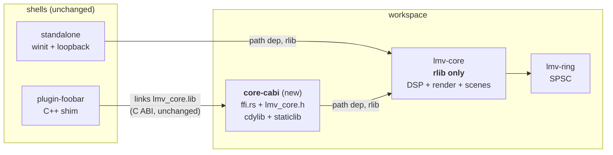
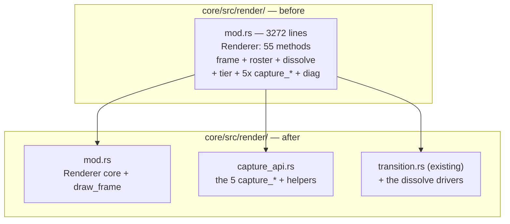

# 0061 — The build stops paying for what it is not building, and the two oversized modules come apart

> **Status:** draft
> **Created:** 2026-08-04
> **Owner skill(s):** dev, human
> **Related ADRs:** [ADR-0072](../adrs/0072-the-c-abi-ships-from-its-own-crate.md) (new, proposed),
> [ADR-0001](../adrs/0001-rust-core-wgpu-cabi-foobar-shim.md),
> [ADR-0003](../adrs/0003-c-abi-v1-surface.md),
> [ADR-0017](../adrs/0017-preset-author-skill-lane.md),
> [ADR-0033](../adrs/0033-testing-strategy-coverage-ratchet-and-pre-push-gate.md),
> [ADR-0053](../adrs/0053-plan-lanes-run-in-git-worktrees.md)

## TL;DR

A maintainability audit (2026-08-04, architect Mode 4 on the whole tree) found the architecture
healthy — no layering violations, a clean audio callback, an allocation-free per-frame GPU path,
green clippy — but three localized problems worth a plan: every core edit rebuilds a 412 MB
staticlib no test consumes, `target/debug` carries 33.9 GB of debug symbols across 264 PDBs, and two
modules have grown past the point where a reader can hold them. This plan halves the edit-compile
loop, extracts the C ABI into its own crate ([ADR-0072](../adrs/0072-the-c-abi-ships-from-its-own-crate.md)),
carves the capture and transition families out of `Renderer`, splits the attractor's
3077-line `mod.rs` into the directory it already lives in, and closes four smaller findings. **It
moves no pixels** — every golden baseline must come back byte-identical.

## Context & problem

The user asked for a review of code size, maintainability and application performance. Raw line
counts are misleading in this repo, because doc comments and inline `mod tests` are the majority of
the biggest files — `core/src/render/tonemap.rs` is 1034 lines holding **10** lines of code, and
`post.rs` is 1630 lines of which 1021 are tests. Corrected for that, only two files carry more than
~1200 lines of actual code:

| File | total | tests | doc/blank | **code** |
|---|---|---|---|---|
| `core/src/render/scenes/particles/mod.rs` | 3077 | 822 | 885 | **1370** |
| `core/src/render/mod.rs` | 3272 | 1142 | 988 | **1142** |
| `core/src/preset/expr.rs` | 1878 | 241 | 609 | **1028** |
| `standalone/examples/shot.rs` | 1621 | 0 | 504 | **1117** |
| `standalone/src/main.rs` | 1414 | 0 | 427 | **987** |

`expr.rs` is a tokenizer + parser + evaluator + gate analyzer, which is a defensible unit at 1028
lines; it is **out of scope**. The two that are not defensible:

- **`particles/mod.rs` is a directory module holding one file.** `particles/` contains only `mod.rs`,
  while the sibling `lines/` is decomposed into ten files. Five concerns share it: attractor family
  ODE math (`AttractorFamily`/`Basis`, 26 match arms), 326 lines of embedded WGSL across four shader
  constants, three GPU resource structs, `AttractorScene` (37 fields) plus its `Scene` impl, and five
  free `encode_*` functions. The decomposition the directory implies was never done.
- **`Renderer` is a god object.** `impl Renderer` spans `core/src/render/mod.rs:746-2132` — 55
  methods over six responsibilities: frame encoding, preset roster selection, the dissolve state
  machine, the tier governor, **five public `capture_*` methods that are dev-tooling API rather than
  app API**, and diagnostics passthroughs. `draw_frame` is 310 lines and opens with a **33-field
  destructure of `self`**, which is the diagnosis rather than a style choice: it exists because the
  struct carries more than any one frame needs.

Separately, the build configuration taxes every iteration. `core/Cargo.toml` declares
`crate-type = ["rlib", "cdylib", "staticlib"]`; measured, a one-file touch costs ~5.0 s and ~550 MB
of artifact writes against ~2.3 s for `["rlib"]` alone — and the cdylib/staticlib serve only the
foobar shim, which is built by a separate MSVC toolchain and never in CI. Meanwhile `target/debug` is
**55.7 GB**, of which **33.9 GB is 264 PDB files** (25 integration test targets × ~193 MB each, plus
stale hashes). Under [ADR-0053](../adrs/0053-plan-lanes-run-in-git-worktrees.md) every plan lane pays
that separately, which is the mechanism behind the disk-fill already recorded against a lane.

Four smaller findings round it out: `standalone/examples/shot.rs` still carries 1117 code lines after
Plan 0031 evacuated its pure helpers; `queue_frame_text` allocates on the frame path; the param-name
triplication is guarded between code and code but **not** between code and `presets/README.md` —
which is the surface `preset-author` authors against per ADR-0017; and `CLAUDE.md` describes the C
ABI as five functions when it has twelve.

## Decision

We take all eight findings in one plan, ordered so a single `dev` session lands everything and only a
plugin-link verification remains for the user. The C ABI extraction gets
[ADR-0072](../adrs/0072-the-c-abi-ships-from-its-own-crate.md), because "leave it, the plugin build is
rare" is a nameable rejected alternative and the re-export-shim variant is a genuine footgun (an
rlib's `no_mangle` symbols are not guaranteed to survive into a downstream cdylib).

We rejected **majors-only** because the four small items are cheap to carry and leaving them creates
backlog entries that will rot, and **build-config-only** because it leaves the two oversized modules
untouched for another cycle while the review that found them is still fresh.

**The `human` phase goes last, deliberately.** `dev` stops at a `human` tag, so placing the plugin
verification immediately after the extraction would end the session with two-thirds of the plan
unwritten. Phases 4-7 touch nothing the ABI depends on, so nothing is invalidated if the link needs a
follow-up fix. The trade is stated in Risks.

**Phase 6 is gated on Plan 0059.** That plan is in flight and actively editing
`particles/mod.rs` (Phase 1 landed `357a17e`; Phase 1b re-blesses `attractor.png`). Since 0061 runs
last the gate will most likely already be satisfied — it exists so the ordering is explicit rather
than tribal.

## Architecture diagram





## Implementation phases

Each phase ships as its own commit. `dev` runs every `dev`-tagged phase in one session, stopping at
the `human` tag in Phase 8.

**Standing done-when for Phases 3-7: the golden suite comes back byte-identical.** These phases are
refactors and configuration; none is allowed to move a pixel. `LMV_BLESS` must **not** be set in any
of them, and a baseline diff is a phase failure, not a re-bless. (Note the standing hazard: bless is
not scoped to the failing scene — see the repo's own history of re-blessing unrelated baselines.)

### Phase 1 — Stop shipping full debuginfo to 25 test binaries
- **Owner skill:** dev
- **What:** Add a `[profile.dev]` debuginfo setting to the root `Cargo.toml` so the dev profile stops
  emitting the type/variable DWARF that dominates PDB size, while keeping file/line in backtraces.
- **Files touched:** `Cargo.toml`
- **Done when:** `[profile.dev] debug = "line-tables-only"` is set with a comment naming the measured
  problem (55.7 GB `target/debug`, 33.9 GB of it 264 PDBs). From a **clean** `target/`, a
  `cargo build --tests` produces a `target/debug` **measurably smaller** than the same clean build on
  the previous setting, and the commit message records both measured sizes. A test made to panic
  deliberately still reports a `file:line` frame in its backtrace under
  `RUST_BACKTRACE=1` — line tables are retained, so panic diagnosis is not degraded.
  *No threshold is stated because none has been earned: the reduction was not measured during the
  audit, only the composition of the 33.9 GB. Record the number; do not target one.*

### Phase 2 — Extract `core-cabi` (ADR-0072)
- **Owner skill:** dev
- **What:** Create the `core-cabi/` workspace member as the only crate declaring `cdylib`/`staticlib`;
  move `ffi.rs`, the C header and the ABI conformance test into it; drop `lmv-core` to
  `crate-type = ["rlib"]`.
- **Files touched:** `Cargo.toml` (members), new `core-cabi/Cargo.toml` + `core-cabi/src/lib.rs`,
  `core/src/ffi.rs` → `core-cabi/src/` (`git mv`), `core/src/lib.rs` (drop `pub mod ffi`),
  `core/include/lmv_core.h` → `core-cabi/include/`, `core/tests/ffi.rs` → `core-cabi/tests/`,
  `core/Cargo.toml`, `core/tests/hygiene.rs`, `plugin-foobar/build.ps1`, `deny.toml` if it names
  members, `.github/workflows/ci.yml`
- **Done when:** A plain `cargo build` produces **no** `lmv_core.lib` and **no** `lmv_core.dll` under
  `target/debug` (the crisp check — a file that must be absent), while
  `cargo build -p lmv-core-cabi` produces both. `cargo nextest run` is green across the workspace with
  the ABI conformance suite running from its new home, and `lmv_abi_version()` still returns `4` — the
  `extern "C"` surface is unchanged, so ADR-0003's version does **not** move. The incremental rebuild
  after touching one `core/src` file is measurably faster than before this phase, with both numbers in
  the commit message (audit measured ~5.0 s → ~2.3 s; confirm, don't assume). `core/tests/hygiene.rs`
  scans the new crate's `src/`, so the panic-denial pragma is still enforced on the ABI — verified by
  temporarily deleting the pragma and watching the guard fail by name. CI gates the new crate's
  coverage, and `COVERAGE_FLOOR` is **re-derived from the first post-move run** and committed with the
  measured number, not carried over at 88.

### Phase 3 — Carve the capture and dissolve families out of `Renderer`
- **Owner skill:** dev
- **What:** Move the five public `capture_*` methods and their private helpers into
  `core/src/render/capture_api.rs`, and the dissolve-driving methods next to the transition code, as
  additional `impl Renderer` blocks. Pure code movement — no signature, visibility or behavior change.
- **Files touched:** `core/src/render/mod.rs`, new `core/src/render/capture_api.rs`,
  `core/src/render/transition.rs`
- **Done when:** `core/src/render/mod.rs` contains no `fn capture_` and no `fn begin_transition`,
  and the file is under 2400 lines. The five capture entry points keep their exact public paths, so
  `standalone/examples/shot.rs` and every `core/tests/` caller compile **unchanged** — no call site
  edits in this phase's diff outside the moved code. `cargo nextest run` green; golden baselines
  byte-identical (standing done-when).

### Phase 4 — `shot.rs`: move the report machinery into the library
- **Owner skill:** dev
- **What:** Continue Plan 0031's evacuation — lift the `--report` reactivity/animation/distinctness
  table generation out of the example into `standalone/src/shot/`, leaving the example with argument
  handling, GPU capture and file I/O as its own header says it should own.
- **Files touched:** `standalone/examples/shot.rs`, new `standalone/src/shot/report.rs`,
  `standalone/src/shot/mod.rs`
- **Done when:** `standalone/examples/shot.rs` is under 1200 total lines and the moved report logic
  carries `#[test]` coverage that **actually runs** under `cargo nextest run` — the whole point of the
  library placement, since `#[test]` in an example does not run. `image` remains a dev-dependency and
  nothing under `standalone/src/` names an `image` type (the ADR-0011 / ADR-0033 boundary). The
  `--report` and `--report --json` output for a fixed preset set is **byte-identical** to before the
  move, captured before and diffed after.

### Phase 5 — Reuse the frame-path text buffers
- **Owner skill:** dev
- **What:** Hold `queue_frame_text`'s `texts`/`meta` vectors as `AppState` fields and `clear()` them
  per frame instead of allocating fresh ones.
- **Files touched:** `standalone/src/main.rs`
- **Done when:** `queue_frame_text` contains no `Vec::new()` / `vec![]`; the two buffers are
  `AppState` fields cleared at entry, so a steady-state frame allocates only when content grows past
  the retained capacity. The `TextRun` borrow of `texts` still type-checks against the reused
  buffer. The app runs and the overlay, settings modal and browse list are unchanged on screen.
  *An early return is explicitly **not** the fix: `text_layer.end_frame()` clears the queue every
  frame, so the runs must be re-queued each frame — reuse is the only correct shape.*

### Phase 6 — Split `particles/` into the directory it already is
- **Owner skill:** dev
- **What:** Decompose `core/src/render/scenes/particles/mod.rs` into the four files its concerns
  already are: `family.rs` (the ODE/basis math, pure and GPU-free), `shaders.rs` (the four WGSL
  constants), `resources.rs` (the three GPU resource structs), and `mod.rs` (the scene, its `Scene`
  impl, and the `encode_*` pass functions).
- **Files touched:** `core/src/render/scenes/particles/{mod.rs,family.rs,shaders.rs,resources.rs}`
- **Done when:** **Plan 0059 is `Status: done` and sits in `docs/plans/done/`** — this phase does not
  start otherwise, and `dev` surfaces and skips it if the gate is unmet rather than merging around a
  live lane. Afterwards: `mod.rs` is under 1400 total lines, contains no `r#"` WGSL literal and no
  `AttractorFamily` match arm; `family.rs` has no `wgpu` import, proving the math is separable and
  unit-testable without a device. The existing `particles` tests are distributed to the file they
  cover and all still run. Golden baselines byte-identical (standing done-when) — this is the phase
  most able to move a pixel by accident, so check `attractor.png` explicitly.

### Phase 7 — Guard the third copy of every param name
- **Owner skill:** dev
- **What:** Add a test asserting every `PARAMS` entry across all scenes and post stages appears in
  `presets/README.md`, closing the one unguarded leg of the name triplication. Fix the `CLAUDE.md`
  ABI description while in the neighbourhood.
- **Files touched:** `core/tests/preset.rs` (beside the existing drift guard at its line ~1039),
  `presets/README.md` if the new test finds real gaps, `CLAUDE.md`
- **Done when:** The new test fails **naming the missing parameter and the file it belongs to** when a
  `PARAMS` entry is absent from `presets/README.md` — verified by temporarily adding a fake param and
  reading the failure message. Any genuinely doc-exempt name sits in an explicit, commented allowlist
  (the shape ADR-0058 uses for evidence), never an unexplained skip. `CLAUDE.md`'s C ABI bullet stops
  paraphrasing a five-function surface and points at `docs/specs/0001-c-abi.md` as the authority.

### Phase 8 — Verify the foobar plugin still links
- **Owner skill:** human
- **What:** Build the plugin against the extracted `core-cabi` crate and confirm it loads.
- **Files touched:** none (verification), or `plugin-foobar/build.ps1` / the `.vcxproj` link line if
  the artifact path needs correcting.
- **Done when:** `.\plugin-foobar\build.ps1` completes and produces `plugin-foobar/build/foo_lmv.dll`,
  and that component loads in foobar2000 v2 and renders. This is `human` because it needs VS Build
  Tools 2022 plus the unpacked foobar SDK on the machine — CI has no plugin job, so no `dev` phase can
  assert it. If the link fails, the fix is Phase 2's artifact naming (see Risks), not a change to the
  ABI itself.

## Data shapes

No new runtime types. The only new structural artifact is the workspace member:

```toml
# illustrative — core-cabi/Cargo.toml, not the final manifest
[package]
name = "lmv-core-cabi"
version.workspace = true
edition.workspace = true
publish = false

[lib]
# Emitted stem chosen so plugin-foobar/build.ps1 and the .vcxproj link line
# change as little as possible — see Risks on the collision fallback.
name = "lmv_core"
crate-type = ["cdylib", "staticlib"]

[dependencies]
lmv-core = { path = "../core" }
```

## Risks & open questions

- **The emitted library name may collide.** Preferred: keep the stem `lmv_core` so `build.ps1` only
  changes its `-p` argument and the `.vcxproj` link line is untouched. `lmv-core` emits
  `liblmv_core.rlib` while the new crate emits `lmv_core.lib`/`lmv_core.dll`, so the stems differ and
  there should be no clash — but Cargo also writes `.d` dep-info per target and may warn about an
  output filename collision. **Decision criterion for `dev`:** if Cargo reports a collision, rename to
  `lmv_core_c` and update **both** `build.ps1` and the `.vcxproj` link line in the same commit. Do not
  silence a collision warning.
- **The coverage floor is genuinely unknown after Phase 2.** Removing 493 lines of `ffi.rs` plus its
  163-line test from `-p lmv-core` moves the percentage in a direction the audit did not measure. Do
  not guess: take the first post-move number and set the floor from it, and gate the new crate too or
  the ABI's coverage silently stops being watched (an ADR-0072 Negative).
- **The `human` phase sits last, so Phase 2 lands unverified against a real C++ link** for the rest of
  the session. Accepted to keep the plan closable in one `dev` pass; the exposure is bounded because
  the `extern "C"` surface does not change, so the only realistic failure is an artifact path.
- **Phase 6's gate may be unmet.** If Plan 0059 has not closed, `dev` skips Phase 6 and says so; the
  plan then closes with Phase 6 outstanding and the architect either holds it open or spins the split
  into its own number at review. Do not merge around a live lane.
- **A refactor that silently moves a pixel is the main correctness hazard**, and the golden suite is
  the only thing that would catch it. Two standing traps apply: bless rewrites *all* baselines, not
  just the failing one, and WARP can alias identical bind-group layouts so the suite blesses garbage
  that hardware renders correctly. Neither Phase 3 nor Phase 6 should need a bless at all — if one
  seems to, that is a bug in the refactor.
- **This plan is scheduled last and is explicitly subject to change.** Every measurement in it is a
  2026-08-04 snapshot of this machine. Re-measure before acting: if an intervening plan has already
  moved `render/mod.rs` or `particles/mod.rs`, the line-count done-whens need re-deriving, not
  satisfying literally.

## What this plan does NOT do

- **Does not touch `expr.rs`.** At 1028 code lines it is a tokenizer, parser, evaluator and gate
  analyzer — cohesive, and splitting it would separate a grammar from its own AST for no gain.
- **Does not change the C ABI's shape.** No function added, removed or re-signatured;
  `LMV_ABI_VERSION` stays `4`. Only where it compiles changes (ADR-0072).
- **Does not move a single pixel.** No golden baseline is re-blessed. Any plan wanting a visual change
  is a different plan.
- **Does not consolidate the 25 integration test targets.** Fewer, larger targets would cut link time
  further, but it reshuffles the whole `core/tests/` layout and would collide with every in-flight
  plan that adds a test. Phase 1 takes the cheap 80 % of the same win; the rest is a followup.
- **Does not touch `standalone/src/main.rs`'s size** beyond Phase 5's buffer reuse. At 987 code lines
  it is a winit event loop with 30 small handler methods — large, but the shape is idiomatic and
  splitting it has no obvious seam.
- **Does not address the `preset-author` curation-boundary question** that ADR-0017 still owes a
  supplement, even though Phase 7 touches the same docs.

## Followups (after this lands)

- Consolidating `core/tests/`' 25 targets into fewer binaries, if link time still bites after Phase 1.
- `reaction_diffusion.rs` (719 code lines, 234 of doc, no inline tests) is the next-largest scene and
  has the same embedded-WGSL-plus-resources shape `particles/` had. Not urgent; revisit if it grows.
- A `target/` size check in the pre-push hook or a periodic prune, given ADR-0053 multiplies it per
  lane.
