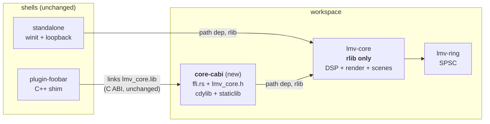
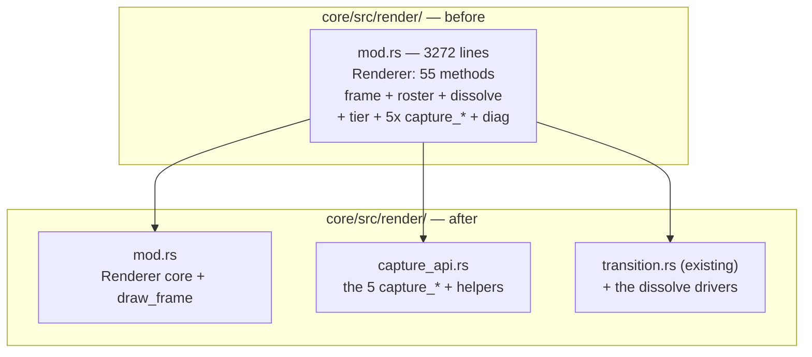
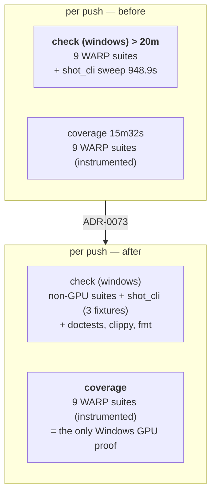

# 0061 — The build stops paying for what it is not building, and the two oversized modules come apart

> **Status:** draft — **Phase 4b's scoping half landed early and out of sequence** as `1c55476`
> (2026-08-04, at the user's direct request); see the note on that phase for what it satisfies, the
> one accepted deviation, and the coverage gap it opens until Phase 4 lands. Every other phase is
> unstarted.
> **Created:** 2026-08-04
> **Amended:** 2026-08-04 — four phases added (1b, 2b, 4b, 9) covering CI wall time, after run
> 30903871856 made the first green measurement available; [ADR-0073](../adrs/0073-the-windows-ci-critical-path.md)
> **Amended:** 2026-08-04 (second pass) — Phase 4b reconciled against `1c55476`, which implemented
> it ahead of its sequence
> **Owner skill(s):** dev, human
> **Related ADRs:** [ADR-0072](../adrs/0072-the-c-abi-ships-from-its-own-crate.md) (new, proposed),
> [ADR-0073](../adrs/0073-the-windows-ci-critical-path.md) (new, proposed),
> [ADR-0001](../adrs/0001-rust-core-wgpu-cabi-foobar-shim.md),
> [ADR-0003](../adrs/0003-c-abi-v1-surface.md),
> [ADR-0016](../adrs/0016-gpu-tests-opt-in-ci-scope.md),
> [ADR-0017](../adrs/0017-preset-author-skill-lane.md),
> [ADR-0033](../adrs/0033-testing-strategy-coverage-ratchet-and-pre-push-gate.md),
> [ADR-0053](../adrs/0053-plan-lanes-run-in-git-worktrees.md)

## TL;DR

A maintainability audit (2026-08-04, architect Mode 4 on the whole tree) found the architecture
healthy — no layering violations, a clean audio callback, an allocation-free per-frame GPU path,
green clippy — but three localized problems worth a plan: every core edit rebuilds a 412 MB
staticlib no test consumes, `target/debug` carries 33.9 GB of debug symbols across 264 PDBs, and two
modules have grown past the point where a reader can hold them. This plan halves the edit-compile
loop, extracts the C ABI into its own crate ([ADR-0072](../adrs/0072-the-c-abi-ships-from-its-own-crate.md)),
carves the capture and transition families out of `Renderer`, splits the attractor's
3077-line `mod.rs` into the directory it already lives in, and closes four smaller findings. **It
moves no pixels** — every golden baseline must come back byte-identical.

**Amended 2026-08-04 with the same finding on the build machine.** The first green run since
2026-07-30 shows the shipped preset library rendered **three times per push**: once in `check
(windows-latest)`, once instrumented in `coverage` (≈ 1930 duplicated CPU-seconds on two identical
runners at the same moment), and a third time by a single `shot_cli` subprocess test that takes
**948.9 s — 61 % of `check`'s test wall clock** — to assert that some JSON is balanced. That is this
plan's own title applied to CI, so it lands here rather than in a plan of its own. Phase 2b gives the
GPU sweep one owner and Phase 4b takes the shape claim off the critical path (both
[ADR-0073](../adrs/0073-the-windows-ci-critical-path.md)); Phase 1b tries dependency optimization in
the same `[profile.dev]` table Phase 1 edits; Phase 9 reads the resulting run. **Neither CI phase
works without the other** — see Phase 2b's note.

## Context & problem

The user asked for a review of code size, maintainability and application performance. Raw line
counts are misleading in this repo, because doc comments and inline `mod tests` are the majority of
the biggest files — `core/src/render/tonemap.rs` is 1034 lines holding **10** lines of code, and
`post.rs` is 1630 lines of which 1021 are tests. Corrected for that, only two files carry more than
~1200 lines of actual code:

| File | total | tests | doc/blank | **code** |
|---|---|---|---|---|
| `core/src/render/scenes/particles/mod.rs` | 3077 | 822 | 885 | **1370** |
| `core/src/render/mod.rs` | 3272 | 1142 | 988 | **1142** |
| `core/src/preset/expr.rs` | 1878 | 241 | 609 | **1028** |
| `standalone/examples/shot.rs` | 1621 | 0 | 504 | **1117** |
| `standalone/src/main.rs` | 1414 | 0 | 427 | **987** |

`expr.rs` is a tokenizer + parser + evaluator + gate analyzer, which is a defensible unit at 1028
lines; it is **out of scope**. The two that are not defensible:

- **`particles/mod.rs` is a directory module holding one file.** `particles/` contains only `mod.rs`,
  while the sibling `lines/` is decomposed into ten files. Five concerns share it: attractor family
  ODE math (`AttractorFamily`/`Basis`, 26 match arms), 326 lines of embedded WGSL across four shader
  constants, three GPU resource structs, `AttractorScene` (37 fields) plus its `Scene` impl, and five
  free `encode_*` functions. The decomposition the directory implies was never done.
- **`Renderer` is a god object.** `impl Renderer` spans `core/src/render/mod.rs:746-2132` — 55
  methods over six responsibilities: frame encoding, preset roster selection, the dissolve state
  machine, the tier governor, **five public `capture_*` methods that are dev-tooling API rather than
  app API**, and diagnostics passthroughs. `draw_frame` is 310 lines and opens with a **33-field
  destructure of `self`**, which is the diagnosis rather than a style choice: it exists because the
  struct carries more than any one frame needs.

Separately, the build configuration taxes every iteration. `core/Cargo.toml` declares
`crate-type = ["rlib", "cdylib", "staticlib"]`; measured, a one-file touch costs ~5.0 s and ~550 MB
of artifact writes against ~2.3 s for `["rlib"]` alone — and the cdylib/staticlib serve only the
foobar shim, which is built by a separate MSVC toolchain and never in CI. Meanwhile `target/debug` is
**55.7 GB**, of which **33.9 GB is 264 PDB files** (25 integration test targets × ~193 MB each, plus
stale hashes). Under [ADR-0053](../adrs/0053-plan-lanes-run-in-git-worktrees.md) every plan lane pays
that separately, which is the mechanism behind the disk-fill already recorded against a lane.

### The same shape, on the build machine (added 2026-08-04)

The audit measured the *local* build. Run **30903871856** — the first green CI run since 2026-07-30,
made possible by Plan [0060](done/0060-a-test-number-states-a-property-or-names-its-machine.md) — made the
CI side measurable for the first time, and it is the same finding twice.

| Job | Runner | Wall |
|---|---|---|
| `check` | macos-latest | 3m23s (nextest 132.9 s / 460 tests; every GPU suite skips, ADR-0016) |
| `check` | windows-latest | **> 20m** |
| `coverage` | windows-latest | **15m32s** (nextest 726.6 s / 368 tests) |
| `miri` | ubuntu-latest | 2m19s |
| `deny` | ubuntu-latest | 19s |

- **The `lmv-core` WARP preset sweep runs in both Windows jobs**, uninstrumented in `check` and
  instrumented in `coverage`, concurrently on two identical runners. The eight slowest coverage tests
  — reactivity 409.6 s, animation 364.4 s, sanity 315.2 s, reaction_diffusion 237.9 s,
  attractor_contract 188.5 s, sanity/shape 185.0 s, attractor_aspect 114.8 s, distinctness 114.3 s —
  are ≈ **1930 CPU-seconds**, paid twice.
- **One test is the critical path, and it is not in that duplication.**
  `standalone::shot_cli::the_json_report_is_well_formed_and_carries_its_top_level_keys` runs
  **948.9 s**, **61 %** of `check (windows-latest)`'s nextest wall clock (85 s locally — an 11.2x
  runner penalty, because a subprocess sweeping a directory is serial and nextest cannot parallelize
  it). It lives in `standalone/`, so `coverage`'s `-p lmv-core` never runs it. It asserts that
  `--report --json --presets presets` exits zero, emits balanced JSON, and carries two top-level
  keys. **None of those claims depends on the preset count.**

Both are the same defect as `crate-type = ["rlib", "cdylib", "staticlib"]`: paying again for
something already built. [ADR-0073](../adrs/0073-the-windows-ci-critical-path.md) takes them.

### The four smaller findings

`standalone/examples/shot.rs` still carries 1117 code lines after
Plan 0031 evacuated its pure helpers; `queue_frame_text` allocates on the frame path; the param-name
triplication is guarded between code and code but **not** between code and `presets/README.md` —
which is the surface `preset-author` authors against per ADR-0017; and `CLAUDE.md` describes the C
ABI as five functions when it has twelve.

## Decision

We take all ten findings in one plan, ordered so a single `dev` session lands everything and only two
verifications remain for the user — a plugin link and a CI run, neither of which `dev` can perform.
The C ABI extraction gets [ADR-0072](../adrs/0072-the-c-abi-ships-from-its-own-crate.md), because
"leave it, the plugin build is rare" is a nameable rejected alternative and the re-export-shim variant
is a genuine footgun (an rlib's `no_mangle` symbols are not guaranteed to survive into a downstream
cdylib). The two CI findings get [ADR-0073](../adrs/0073-the-windows-ci-critical-path.md), because
deciding **which job proves the Windows GPU tier** changes what ADR-0033 wrote down about each job,
and because four alternatives lose for reasons a future reader will otherwise re-derive — merging the
two Windows jobs, moving coverage off branch pushes, sampling the sweep, and narrowing the coverage
job instead.

**The CI half is the same finding as the build half, which is why it lives here rather than in its own
number.** `crate-type = ["rlib", "cdylib", "staticlib"]` rebuilds a 412 MB staticlib nothing links;
two Windows jobs render the same 35 presets at the same moment; one subprocess test renders them a
third time to check that braces balance. Three instances of paying again for something the run already
has.

We rejected **majors-only** because the four small items are cheap to carry and leaving them creates
backlog entries that will rot, and **build-config-only** because it leaves the two oversized modules
untouched for another cycle while the review that found them is still fresh.

**Both `human` phases go last, deliberately.** `dev` stops at a `human` tag, so placing the plugin
verification immediately after the extraction would end the session with two-thirds of the plan
unwritten. Phases 4-7 touch nothing the ABI depends on, so nothing is invalidated if the link needs a
follow-up fix. The trade is stated in Risks. Phase 9 (reading the CI run) is `human` for a harder
reason: **no CI measurement can be taken locally, and `dev` does not push** — so the plan is
instrument-then-read in the same shape Plan 0060 used, and for the same reason.

**Dependency optimization is a phase, not an ADR, and the rejected alternative is a comment.** Phase
1b sets `opt-level` for *dependencies only*. Applying it workspace-wide — the obvious simplification a
future reader will reach for — would optimize `lmv-core` itself, and inlining muddies the line
mapping the ADR-0033 ratchet gates on, so the floor would silently start measuring something else.
That belongs next to the setting rather than in a third ADR, so Phase 1b's done-when requires the
comment.

**Phase 6 is gated on Plan 0059.** That plan is in flight and actively editing
`particles/mod.rs` (Phase 1 landed `357a17e`; Phase 1b re-blesses `attractor.png`). Since 0061 runs
last the gate will most likely already be satisfied — it exists so the ordering is explicit rather
than tribal.

## Architecture diagram





The CI half, before and after Phases 2b + 4b. The library is rendered three times on the left and
once on the right; the bold box is the workflow's long pole.



## Implementation phases

Each phase ships as its own commit. `dev` runs every `dev`-tagged phase in one session, stopping at
the `human` tag in Phase 8. Phase 9 is the second `human` phase and is read after the user pushes.

**Standing done-when for Phases 1b and 3-7: the golden suite comes back byte-identical.** These
phases are refactors and configuration; none is allowed to move a pixel. `LMV_BLESS` must **not** be
set in any of them, and a baseline diff is a phase failure, not a re-bless. (Note the standing
hazard: bless is not scoped to the failing scene — see the repo's own history of re-blessing
unrelated baselines.) Phase 1b is in this set because optimizing `naga` and `wgpu` is the one
configuration change in the plan with a *conceivable* path to different pixels; the expectation is
that shader generation is deterministic and the baselines do not move, and the check is how that
stops being an expectation.

### Phase 1 — Stop shipping full debuginfo to 25 test binaries
- **Owner skill:** dev
- **What:** Add a `[profile.dev]` debuginfo setting to the root `Cargo.toml` so the dev profile stops
  emitting the type/variable DWARF that dominates PDB size, while keeping file/line in backtraces.
- **Files touched:** `Cargo.toml`
- **Done when:** `[profile.dev] debug = "line-tables-only"` is set with a comment naming the measured
  problem (55.7 GB `target/debug`, 33.9 GB of it 264 PDBs). From a **clean** `target/`, a
  `cargo build --tests` produces a `target/debug` **measurably smaller** than the same clean build on
  the previous setting, and the commit message records both measured sizes. A test made to panic
  deliberately still reports a `file:line` frame in its backtrace under
  `RUST_BACKTRACE=1` — line tables are retained, so panic diagnosis is not degraded.
  *No threshold is stated because none has been earned: the reduction was not measured during the
  audit, only the composition of the 33.9 GB. Record the number; do not target one.*

### Phase 1b — Optimize dependencies in the dev profile (added 2026-08-04)
- **Owner skill:** dev
- **What:** Add `[profile.dev.package."*"] opt-level = 2` to the root `Cargo.toml` so `wgpu`, `naga`
  and the rest of the dependency graph are compiled optimized while workspace crates stay at
  `opt-level = 0`. Every WARP test in this repo spends most of its time inside `wgpu-core` validation
  and `naga` shader translation, both of which are ours only in the sense that we depend on them.
- **Files touched:** `Cargo.toml`
- **Done when:** The setting is present and carries a comment stating **why it is scoped to
  dependencies**: applying `opt-level` workspace-wide would optimize `lmv-core` itself, and inlining
  muddies the line mapping the ADR-0033 coverage ratchet gates on. Warm `cargo nextest run` wall time
  is recorded **before and after** in the commit message, taken from the same machine and the same
  warm cache, and the same two numbers are taken for the narrowed pre-push set. Golden baselines are
  byte-identical (standing done-when) — this phase is in that set on purpose.
  *No target is stated. The hypothesis that `wgpu-core` validation dominates debug WARP time is
  plausible and **unmeasured** in this repo; if the improvement is small, record the small number and
  keep the setting only if it pays for the cold-build cost it adds. Reverting is one line, and a
  reverted Phase 1b is a legitimate outcome, not a failed phase.*
  *Interacts with Phase 1: both edit `[profile.dev]`, and this one plausibly makes `target/debug`
  **larger** while Phase 1 makes it smaller. Do not read Phase 1's size number as invalidated —
  record both, and do not trade one against the other, because they buy different things (disk vs
  test wall time).*

### Phase 2 — Extract `core-cabi` (ADR-0072)
- **Owner skill:** dev
- **What:** Create the `core-cabi/` workspace member as the only crate declaring `cdylib`/`staticlib`;
  move `ffi.rs`, the C header and the ABI conformance test into it; drop `lmv-core` to
  `crate-type = ["rlib"]`.
- **Files touched:** `Cargo.toml` (members), new `core-cabi/Cargo.toml` + `core-cabi/src/lib.rs`,
  `core/src/ffi.rs` → `core-cabi/src/` (`git mv`), `core/src/lib.rs` (drop `pub mod ffi`),
  `core/include/lmv_core.h` → `core-cabi/include/`, `core/tests/ffi.rs` → `core-cabi/tests/`,
  `core/Cargo.toml`, `core/tests/hygiene.rs`, `plugin-foobar/build.ps1`, `deny.toml` if it names
  members, `.github/workflows/ci.yml`
- **Done when:** A plain `cargo build` produces **no** `lmv_core.lib` and **no** `lmv_core.dll` under
  `target/debug` (the crisp check — a file that must be absent), while
  `cargo build -p lmv-core-cabi` produces both. `cargo nextest run` is green across the workspace with
  the ABI conformance suite running from its new home, and `lmv_abi_version()` still returns `4` — the
  `extern "C"` surface is unchanged, so ADR-0003's version does **not** move. The incremental rebuild
  after touching one `core/src` file is measurably faster than before this phase, with both numbers in
  the commit message (audit measured ~5.0 s → ~2.3 s; confirm, don't assume). `core/tests/hygiene.rs`
  scans the new crate's `src/`, so the panic-denial pragma is still enforced on the ABI — verified by
  temporarily deleting the pragma and watching the guard fail by name. CI gates the new crate's
  coverage, and `COVERAGE_FLOOR` is **re-derived from the first post-move run** and committed with the
  measured number, not carried over at 88.

### Phase 2b — The GPU sweep gets one owner (ADR-0073) (added 2026-08-04)
- **Owner skill:** dev
- **What:** Narrow `check`'s `cargo nextest run` with the nine-binary exclusion `.githooks/pre-push`
  already carries, so the WARP preset sweep runs once per push — instrumented, in `coverage` — instead
  of concurrently in both Windows jobs.
- **Files touched:** `.github/workflows/ci.yml`, `.githooks/pre-push` (comment only)
- **Sequenced after Phase 2** because that phase already rewrites `ci.yml` (adds the `core-cabi`
  crate and re-derives `COVERAGE_FLOOR`); two phases racing one file for no reason is avoidable.
- **Done when:** `check`'s test step is `cargo nextest run -E '<the nine-binary exclusion>'`, with the
  filter written as one string and commented with **ADR-0073** and with the sentence that the
  `coverage` job is now the only place these suites run on Windows. The **union check** passes: the
  `cargo nextest list` output of `check` plus that of `coverage -p lmv-core` covers every test the
  pre-change `check` listed — run both list commands locally, sort, diff, and paste the (empty) diff
  in the commit message. **That diff is the whole safety argument for this phase**; a non-empty diff
  means a suite has fallen through the gap between the workspace run and `-p lmv-core`, and the phase
  is not done. `.githooks/pre-push`'s comment claiming *"CI runs the full suite on every push
  regardless"* is corrected to say CI still runs all of it, now in one job rather than two.
  *The filter is applied on **both** matrix arms, not branched per-OS: macOS already skips every GPU
  suite (ADR-0016), so the exclusion removes nothing there, and a per-OS branch is a second thing to
  keep true.*
  **This phase does not, on its own, shorten the workflow, and must not be reported as if it did.**
  It removes ≈ 1930 duplicated CPU-seconds — a cost win — but `shot_cli`'s 948.9 serial seconds stay
  under `check`, within noise of `coverage`'s entire 932-second job. **Phase 4b is the half that moves
  the wall clock**; this is the half that stops paying twice. Neither is worth landing without the
  other, and Phase 9 measures them together.

### Phase 3 — Carve the capture and dissolve families out of `Renderer`
- **Owner skill:** dev
- **What:** Move the five public `capture_*` methods and their private helpers into
  `core/src/render/capture_api.rs`, and the dissolve-driving methods next to the transition code, as
  additional `impl Renderer` blocks. Pure code movement — no signature, visibility or behavior change.
- **Files touched:** `core/src/render/mod.rs`, new `core/src/render/capture_api.rs`,
  `core/src/render/transition.rs`
- **Done when:** `core/src/render/mod.rs` contains no `fn capture_` and no `fn begin_transition`,
  and the file is under 2400 lines. The five capture entry points keep their exact public paths, so
  `standalone/examples/shot.rs` and every `core/tests/` caller compile **unchanged** — no call site
  edits in this phase's diff outside the moved code. `cargo nextest run` green; golden baselines
  byte-identical (standing done-when).

### Phase 4 — `shot.rs`: move the report machinery into the library
- **Owner skill:** dev
- **What:** Continue Plan 0031's evacuation — lift the `--report` reactivity/animation/distinctness
  table generation out of the example into `standalone/src/shot/`, leaving the example with argument
  handling, GPU capture and file I/O as its own header says it should own.
- **Files touched:** `standalone/examples/shot.rs`, new `standalone/src/shot/report.rs`,
  `standalone/src/shot/mod.rs`
- **Done when:** `standalone/examples/shot.rs` is under 1200 total lines and the moved report logic
  carries `#[test]` coverage that **actually runs** under `cargo nextest run` — the whole point of the
  library placement, since `#[test]` in an example does not run. `image` remains a dev-dependency and
  nothing under `standalone/src/` names an `image` type (the ADR-0011 / ADR-0033 boundary). The
  `--report` and `--report --json` output for a fixed preset set is **byte-identical** to before the
  move, captured before and diffed after.

### Phase 4b — A shape claim stops sweeping the library (ADR-0073) (added 2026-08-04)

> **LANDED EARLY, out of sequence, as `1c55476` (2026-08-04)** — at the user's direct request, in
> the same window this plan was being written, and reconciled here rather than reverted. The change
> is correct and the win is real (**85 s → 5.0 s** locally on the one test; the CI figure is Phase
> 9's to read), so reverting a correct fix to satisfy a sequencing preference would cost the wall
> clock and buy nothing. Two things follow, and the second is a live gap:
>
> - **One deviation, accepted.** The fixture library is a **scratch directory written by the test**
>   (`tiny_report_library()`), not the checked-in `standalone/tests/fixtures/report/` this phase
>   suggested. The phase said "e.g." and wanted a `README.md` saying what it is for and why it is
>   small; the helper's doc comment carries exactly that, beside the assertion instead of two
>   directories away. Equal or better, and it adds no files. **The done-when below is otherwise met
>   in full**: three presets across two distinct `SystemKind`s, an added assertion that *both*
>   families reached the map (so a future shrink cannot quietly turn the balance check into a
>   single-object test), the three original assertions unchanged in wording and strength, the
>   before/after wall time in the commit message, and `the_presets_flag_is_reported_as_the_source`
>   still pointing at `presets/`.
> - **The coverage gap this phase's sequencing existed to prevent is now open, and stays open until
>   Phase 4 lands.** The reason 4b was sequenced after Phase 4 was never tidiness: Phase 4 moves the
>   report machinery into `standalone/src/shot/report.rs` under `#[test]`s that actually run, and
>   scoping the subprocess test *first* leaves the report generator's own logic proved only by a
>   three-preset CLI invocation. That is exactly the state the tree is in. **Nothing renders every
>   shipped preset through the real CLI any more** (ADR-0073's accepted cost) *and* nothing yet
>   tests the generator in-process. Phase 4 closes it; until then, treat a `--report` change as
>   under-covered.
> - **Still owed from this phase:** the `--size` / `--frames` reduction, which `1c55476` did not
>   take. It was written as "check, don't assume" and remains unchecked. It is worth having and is
>   not a substitute for the scoping — take it with Phase 4.

- **Owner skill:** dev
- **What:** Scope `standalone/tests/shot_cli.rs`'s
  `the_json_report_is_well_formed_and_carries_its_top_level_keys` to a small fixture directory instead
  of `presets/`. Its three assertions — exit zero, balanced JSON, the top-level keys `source` and
  `families` — are independent of how many presets the report describes.
- **Files touched:** `standalone/tests/shot_cli.rs`, a new small fixture directory (e.g.
  `standalone/tests/fixtures/report/`) with its own `README.md` saying what it is for and why it is
  small
- **Sequenced after Phase 4**, and this ordering is load-bearing rather than tidy. Phase 4 moves the
  report machinery into `standalone/src/shot/report.rs` under `#[test]`s that actually run; scoping
  the subprocess test *before* that move would leave the report generator's own logic proved only by a
  three-preset CLI invocation. Afterwards, the subprocess test is asserting CLI wiring — which is what
  ADR-0033's tier 4 says it is for — and the generator is tested in-process.
- **Done when:** The test invokes `--presets <fixture dir>` and the directory holds **at least two
  distinct `SystemKind`s**, so `families` is genuinely plural and the grouping the key names is
  exercised rather than assumed — assert the key's contents have more than one entry, not just that
  the key exists, or the smaller fixture set has quietly weakened the test. The three original
  assertions are unchanged in wording and strength. Warm wall time for this one test is recorded
  before and after in the commit message (local baseline: **85 s**). Nothing else in `shot_cli.rs`
  changes its preset source — in particular `the_presets_flag_is_reported_as_the_source` keeps
  pointing at `presets/`, because *that* test's claim is about resolving the shipped directory.
  *Take `--size` / `--frames` reduction as well if `--report` honours them (unverified — check, don't
  assume). It is worth having and is **not** a substitute: it leaves the cost proportional to a preset
  count that grows every content plan.*

### Phase 5 — Reuse the frame-path text buffers
- **Owner skill:** dev
- **What:** Hold `queue_frame_text`'s `texts`/`meta` vectors as `AppState` fields and `clear()` them
  per frame instead of allocating fresh ones.
- **Files touched:** `standalone/src/main.rs`
- **Done when:** `queue_frame_text` contains no `Vec::new()` / `vec![]`; the two buffers are
  `AppState` fields cleared at entry, so a steady-state frame allocates only when content grows past
  the retained capacity. The `TextRun` borrow of `texts` still type-checks against the reused
  buffer. The app runs and the overlay, settings modal and browse list are unchanged on screen.
  *An early return is explicitly **not** the fix: `text_layer.end_frame()` clears the queue every
  frame, so the runs must be re-queued each frame — reuse is the only correct shape.*

### Phase 6 — Split `particles/` into the directory it already is
- **Owner skill:** dev
- **What:** Decompose `core/src/render/scenes/particles/mod.rs` into the four files its concerns
  already are: `family.rs` (the ODE/basis math, pure and GPU-free), `shaders.rs` (the four WGSL
  constants), `resources.rs` (the three GPU resource structs), and `mod.rs` (the scene, its `Scene`
  impl, and the `encode_*` pass functions).
- **Files touched:** `core/src/render/scenes/particles/{mod.rs,family.rs,shaders.rs,resources.rs}`
- **Done when:** **Plan 0059 is `Status: done` and sits in `docs/plans/done/`** — this phase does not
  start otherwise, and `dev` surfaces and skips it if the gate is unmet rather than merging around a
  live lane. Afterwards: `mod.rs` is under 1400 total lines, contains no `r#"` WGSL literal and no
  `AttractorFamily` match arm; `family.rs` has no `wgpu` import, proving the math is separable and
  unit-testable without a device. The existing `particles` tests are distributed to the file they
  cover and all still run. Golden baselines byte-identical (standing done-when) — this is the phase
  most able to move a pixel by accident, so check `attractor.png` explicitly.

### Phase 7 — Guard the third copy of every param name
- **Owner skill:** dev
- **What:** Add a test asserting every `PARAMS` entry across all scenes and post stages appears in
  `presets/README.md`, closing the one unguarded leg of the name triplication. Fix the `CLAUDE.md`
  ABI description while in the neighbourhood.
- **Files touched:** `core/tests/preset.rs` (beside the existing drift guard at its line ~1039),
  `presets/README.md` if the new test finds real gaps, `CLAUDE.md`
- **Done when:** The new test fails **naming the missing parameter and the file it belongs to** when a
  `PARAMS` entry is absent from `presets/README.md` — verified by temporarily adding a fake param and
  reading the failure message. Any genuinely doc-exempt name sits in an explicit, commented allowlist
  (the shape ADR-0058 uses for evidence), never an unexplained skip. `CLAUDE.md`'s C ABI bullet stops
  paraphrasing a five-function surface and points at `docs/specs/0001-c-abi.md` as the authority.

### Phase 8 — Verify the foobar plugin still links
- **Owner skill:** human
- **What:** Build the plugin against the extracted `core-cabi` crate and confirm it loads.
- **Files touched:** none (verification), or `plugin-foobar/build.ps1` / the `.vcxproj` link line if
  the artifact path needs correcting.
- **Done when:** `.\plugin-foobar\build.ps1` completes and produces `plugin-foobar/build/foo_lmv.dll`,
  and that component loads in foobar2000 v2 and renders. This is `human` because it needs VS Build
  Tools 2022 plus the unpacked foobar SDK on the machine — CI has no plugin job, so no `dev` phase can
  assert it. If the link fails, the fix is Phase 2's artifact naming (see Risks), not a change to the
  ABI itself.

### Phase 9 — Read the run (added 2026-08-04)
- **Owner skill:** human
- **What:** Push, then read the resulting CI run and record what the four config phases actually
  bought. `dev` cannot do this: no CI measurement exists locally, and `dev` does not push.
- **Files touched:** this plan (the measured numbers), `docs/adrs/0073-the-windows-ci-critical-path.md`
  (an Outcome section at its acceptance)
- **Done when:** A **cache-warm** run is read — *not* the first run after the push. Phases 1, 1b and 2
  each invalidate `Swatinem/rust-cache` wholesale (a `[profile.dev]` edit; a new workspace member), so
  the first post-change run is a cold build and its wall time is wrong in the pessimistic direction.
  Read the second. From it, record: each job's wall time; `check (windows-latest)`'s nextest wall
  clock; the new duration of `the_json_report_is_well_formed_and_carries_its_top_level_keys`; and the
  new `lmv-core` coverage percentage against whatever floor Phase 2 set.
  Then check the one property ADR-0073 committed to: **`coverage` is the longest job in the
  workflow.** If it is not, the surviving `check (windows-latest)` is dominated by its *build* rather
  than its tests, and that is the measurement that flips ADR-0073's Alternative A (merge the two
  Windows jobs, saving a whole Windows build of `wgpu` + `naga`) from rejected to worth taking — route
  it back to `architect` as a supplement rather than editing the job here.
  *No target wall time is stated anywhere in this phase, deliberately. The runner is shared hardware
  and this is the project's second-ever green run; a number chosen now would be a guess dressed as a
  contract. Record what came back.*

## Data shapes

No new runtime types. The only new structural artifact is the workspace member:

```toml
# illustrative — core-cabi/Cargo.toml, not the final manifest
[package]
name = "lmv-core-cabi"
version.workspace = true
edition.workspace = true
publish = false

[lib]
# Emitted stem chosen so plugin-foobar/build.ps1 and the .vcxproj link line
# change as little as possible — see Risks on the collision fallback.
name = "lmv_core"
crate-type = ["cdylib", "staticlib"]

[dependencies]
lmv-core = { path = "../core" }
```

## Risks & open questions

- **The emitted library name may collide.** Preferred: keep the stem `lmv_core` so `build.ps1` only
  changes its `-p` argument and the `.vcxproj` link line is untouched. `lmv-core` emits
  `liblmv_core.rlib` while the new crate emits `lmv_core.lib`/`lmv_core.dll`, so the stems differ and
  there should be no clash — but Cargo also writes `.d` dep-info per target and may warn about an
  output filename collision. **Decision criterion for `dev`:** if Cargo reports a collision, rename to
  `lmv_core_c` and update **both** `build.ps1` and the `.vcxproj` link line in the same commit. Do not
  silence a collision warning.
- **The coverage floor is genuinely unknown after Phase 2.** Removing 493 lines of `ffi.rs` plus its
  163-line test from `-p lmv-core` moves the percentage in a direction the audit did not measure. Do
  not guess: take the first post-move number and set the floor from it, and gate the new crate too or
  the ABI's coverage silently stops being watched (an ADR-0072 Negative).
- **The `human` phase sits last, so Phase 2 lands unverified against a real C++ link** for the rest of
  the session. Accepted to keep the plan closable in one `dev` pass; the exposure is bounded because
  the `extern "C"` surface does not change, so the only realistic failure is an artifact path.
- **Phase 6's gate may be unmet.** If Plan 0059 has not closed, `dev` skips Phase 6 and says so; the
  plan then closes with Phase 6 outstanding and the architect either holds it open or spins the split
  into its own number at review. Do not merge around a live lane.
- **A refactor that silently moves a pixel is the main correctness hazard**, and the golden suite is
  the only thing that would catch it. Two standing traps apply: bless rewrites *all* baselines, not
  just the failing one, and WARP can alias identical bind-group layouts so the suite blesses garbage
  that hardware renders correctly. Neither Phase 3 nor Phase 6 should need a bless at all — if one
  seems to, that is a bug in the refactor.
- **This plan is scheduled last and is explicitly subject to change.** Every measurement in it is a
  2026-08-04 snapshot of this machine. Re-measure before acting: if an intervening plan has already
  moved `render/mod.rs` or `particles/mod.rs`, the line-count done-whens need re-deriving, not
  satisfying literally.
- **Three separate reasons now move `COVERAGE_FLOOR`, and they must not be read as competing.** Plan
  0060 may re-derive it; Phase 2 moves it again by removing `ffi.rs` from the gated crate; and Phase
  2b changes nothing about the number but makes the job that carries it load-bearing for correctness.
  Whoever writes the floor last states which of the three they measured against.
- **The first post-change CI run will read worse than the truth**, because Phases 1, 1b and 2 each
  invalidate the rust-cache wholesale. Phase 9 requires the *second* run for exactly this reason, and
  anyone reading the first should expect a cold build.
- **CI wall time is measurable in only one place, and it is not here.** Phases 1b, 2b and 4b are all
  landed on evidence from a single run — the only green one in existence. If a done-when's local
  measurement disagrees with the CI proportions, trust the local number for the local claim and let
  Phase 9 settle the CI claim. Do not tune a config until the CI number looks right; there is no
  second data point to tune against.
- **Phase 2b makes the `coverage` job a single point of failure for the Windows GPU tier.** If it is
  ever disabled, skipped, or broken by a `cargo-llvm-cov` install failure, the golden guard and every
  GPU behavioral suite silently stop running on the only platform that can run them. The comment
  Phase 2b requires in `ci.yml` is the only thing standing between that and a green-looking run;
  treat deleting it as deleting a gate.

## What this plan does NOT do

- **Does not touch `expr.rs`.** At 1028 code lines it is a tokenizer, parser, evaluator and gate
  analyzer — cohesive, and splitting it would separate a grammar from its own AST for no gain.
- **Does not change the C ABI's shape.** No function added, removed or re-signatured;
  `LMV_ABI_VERSION` stays `4`. Only where it compiles changes (ADR-0072).
- **Does not move a single pixel.** No golden baseline is re-blessed. Any plan wanting a visual change
  is a different plan.
- **Does not consolidate the 25 integration test targets.** Fewer, larger targets would cut link time
  further, but it reshuffles the whole `core/tests/` layout and would collide with every in-flight
  plan that adds a test. Phase 1 takes the cheap 80 % of the same win; the rest is a followup.
- **Does not touch `standalone/src/main.rs`'s size** beyond Phase 5's buffer reuse. At 987 code lines
  it is a winit event loop with 30 small handler methods — large, but the shape is idiomatic and
  splitting it has no obvious seam.
- **Does not address the `preset-author` curation-boundary question** that ADR-0017 still owes a
  supplement, even though Phase 7 touches the same docs.
- **Does not sample the preset sweep** (user call, ADR-0073 Alternative C). Every gate that asserts
  something about a preset still sees every preset, on every push. What Phases 2b and 4b remove is
  *repeat* renderings and one test whose claim was never about the library — not coverage of it. No
  nightly job, no main-only sweep, no `LMV_SUBSET` environment variable.
- **Does not merge the two Windows jobs** (ADR-0073 Alternative A), even though it would save a whole
  Windows build of `wgpu` + `naga`, because it would put `fmt --check` behind the longest test run in
  the workflow. Phase 9 names the measurement that would reopen it.
- **Does not touch the macOS job.** At 3m23s it is not a problem, and every GPU suite already skips
  there (ADR-0016). Note in passing that GitHub bills macOS at 10x, so `check (macos-latest)` is the
  workflow's second-largest *cost* line while being its third-fastest job — a different question from
  this plan's, and not one it opens.

## Followups (after this lands)

- Consolidating `core/tests/`' 25 targets into fewer binaries, if link time still bites after Phase 1.
- `reaction_diffusion.rs` (719 code lines, 234 of doc, no inline tests) is the next-largest scene and
  has the same embedded-WGSL-plus-resources shape `particles/` had. Not urgent; revisit if it grows.
- A `target/` size check in the pre-push hook or a periodic prune, given ADR-0053 multiplies it per
  lane.
- **Merging the two Windows jobs** (ADR-0073 Alternative A) if Phase 9 shows the surviving `check
  (windows-latest)` is build-dominated rather than test-dominated. That is the one measurement that
  flips it, and it does not exist yet.
- **A standing habit rather than a one-off**: no other test in the tree has ever had its CI duration
  looked at, because until 2026-08-04 there was no green run to look at. `shot_cli`'s 948.9 s was
  invisible for the same reason the doubled attractor was — nothing had ever rendered the
  configuration. Reading the slowest-test list at a close ceremony is cheap and would have caught
  this one; whether it becomes a ceremony step is an ADR-0033 question, not this plan's.
