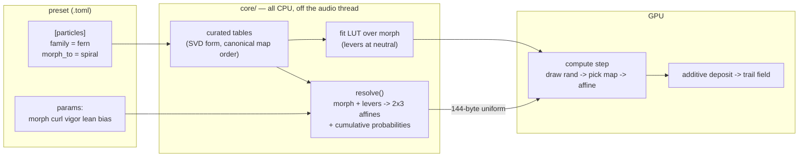

# 0062 — The chaos game grows a fern: an IFS family that morphs between figures

> **Status:** **approved 2026-08-04** — ready for `dev`. Phases 1-6 are `dev` and nothing gates
> them, so they run start-to-finish in one session; **Phase 7 is `human`** (a `preset-author` pass
> judging the levers against real audio), so the plan does not close in that session.
> **Created:** 2026-08-04
> **Owner skill(s):** dev, human
> **Related ADRs:** [0075](../adrs/0075-ifs-family-morphs-in-singular-value-space.md)

## TL;DR

The `attractor` scene gains a fifth family, `ifs`, that runs an iterated function system instead of
a strange-attractor map — the Barnsley fern first, plus four sibling figures (bare tree, dragon
curve, Sierpinski triangle, spiral). Every map is parameterized by the singular value decomposition
of its linear part rather than by raw affine coefficients, so a preset can morph continuously from
one figure to another and drive four shape levers from audio without any table it can reach ever
diverging. First user-visible behavior: `shot --preset attractor_fern` renders a recognizable
Barnsley fern that fades and glows through the attractor's existing trail field.

## Context & problem

The user asked whether the Barnsley fern could give this project "something generative and organic
at the same time". The organic half is not in doubt — the fern is the canonical organic fractal.
The generative half is where the engine has a real gap, and the interview located it precisely:
every structural choice in this codebase today is **discrete**. An L-system has production rules;
`star_pattern` has three precomputed contact angles, which is exactly why
[design-backlog 0007](../design-backlog.md) could not blend them and needed
[ADR-0060](../adrs/0060-star-pattern-variants-interpolate.md) to rescue it. Nothing in the engine
can travel continuously from one *figure* to another.

An IFS can, because its whole structure is twenty-four affine coefficients and four probabilities,
and numbers interpolate. It also costs almost nothing to run here: the `attractor` scene is
**already a chaos game** — 50 000–150 000 GPU particles, one map iteration per fixed 1/60 s step,
additive deposit into a decaying trail — and the step shader already carries a seeded deterministic
bit-mixer (`mix32`/`hash3`, `particles/mod.rs:481-504`) for the reseed jitter, which is the random
map choice an IFS needs.

What blocks the direct approach is the cliff. De Jong and Clifford stay bounded for any `a b c d`,
so a preset can drive them anywhere. An IFS converges only while every map contracts; push one past
unit operator norm and positions run to infinity, then to `NaN`, and the particle buffer stays dead
for the session. So the design question is not "can we draw a fern" — it is "what does audio touch,
such that it can never kill the figure".

## Decision

We add `AttractorFamily::Ifs(IfsFigure)` and parameterize each map as `M = R(θ)·diag(sx, sy)·R(φ)`
with `sy` signed, so contractivity is the scalar test `max(|sx|,|sy|) < 1`. Morphing interpolates in
that space (angles do not affect contractivity; interpolated singular values stay below 1 because
both endpoints are), and the four audio levers are built to be safe rather than checked: `curl`
adds to every `θ`, `vigor` scales the singular values under one clamp at `0.97`, `lean` rotates the
translation vectors (which do not enter contractivity at all), and `bias` reweights the
probabilities (which changes where points land, never whether they converge). All of it resolves on
the CPU to a plain 2×3 affine table; the shader picks a map and applies it.

We rejected raw coefficients with a runtime divergence guard, because the guard would live on the
GPU where its safety property is provable only by rendering — and a preset that diverges on a loud
passage passes every capture. We rejected a separate `ifs` scene, because it would copy the trail
field, deposit normalization, projection, palette LUT path and view transform of the most complex
scene in the repo to change one line of a step shader. Full reasoning and a third rejected option
(fitting the framing from the fully-resolved table) are in
[ADR-0075](../adrs/0075-ifs-family-morphs-in-singular-value-space.md).

## Architecture diagram



## Implementation phases

### Phase 1 — the fifth family draws a fern

- **Owner skill:** dev
- **What:** `AttractorFamily::Ifs(IfsFigure)` with `Fern` only and a hardcoded 2×3 affine table,
  a per-step random map choice in the compute shader, and the projection generalization the fern
  needs. The walking skeleton: a fern on screen before any morph machinery exists.
- **Files touched:** `core/src/render/scenes/particles/mod.rs`,
  `core/src/render/scenes/particles/ifs.rs` (new), `core/src/preset/schema.rs`,
  `presets/attractor_fern.toml` (new).
- **The four pieces:**
  - `Step`'s uniform grows to carry the table: four `vec4` linear parts, two `vec4` packing the
    four `(e, f)` translations, one `vec4` of cumulative probabilities — 144 bytes total, from 32.
    The bind-group layout gains **no new binding**, so nothing about the layout-collision surface
    [Plan 0053](0053-the-suite-stops-blessing-what-warp-gets-wrong.md) reasons about changes shape.
  - The shader draws `mix32(bitcast<u32>(seed) ^ (step_index * PRIME))` as a unit uniform, compares
    against the cumulative table, and applies the chosen map through an **unrolled four-way
    branch** — not a dynamically-indexed uniform array, matching the reason `Basis::masks`
    (`mod.rs:299`) uses one-hot masks rather than indices.
  - `step_index` is a new monotonic `u32` on the uniform, incremented per fixed step. Determinism
    is preserved exactly: the draw is a pure function of the particle's fixed seed and the step
    index, and the step index is a pure function of accumulated injected `dt`, which captures pin
    at 1/60 s. `salt` keeps its reseed meaning.
  - `projection()`'s third element generalizes from a **z**-centre to a full `[f32; 3]` centre
    subtracted before projection, because the fern spans `y ∈ [0, 10]` and is not origin-centred.
    Existing families pass `[0,0,0]` and `[0,0,25]` — the same values they pass today.
  - `JITTER_MODE` moves from shader id 4 to 5. Its own doc comment (`mod.rs:344`) says this is what
    a fifth family does.
  - `is_continuous() == false` for the IFS: successive points jump across the figure, so no segment
    is drawn — the same reason De Jong and Clifford take that branch.
- **Done when:** `shot --preset-file presets/attractor_fern.toml` renders a figure recognizable as
  the Barnsley fern, with both its root and its canopy inside the frame, at 16:9 **and** at a
  portrait aspect. World scale near `0.17` is the starting point (the fern's `y` half-extent is
  5.0, and De Jong's shipped `0.42 × 2.0` occupies ~0.84 of the half-height), but the acceptance is
  the framing, not the number. The four existing families' golden baselines are **byte-identical** —
  no bless. `AttractorFamily::from_name("fern")` parses; an unknown figure name is a load error.

### Phase 2 — the roster, in singular-value form

- **Owner skill:** dev
- **What:** The five curated tables (fern, tree, dragon, sierpinski, spiral), each stored decomposed
  as `M = R(θ)·diag(sx, sy)·R(φ)` per map, and the `decompose`/`recompose` pair they rest on. This
  phase replaces Phase 1's literal fern table with the decomposed one and must not move a pixel.
- **Files touched:** `core/src/render/scenes/particles/ifs.rs`, `core/src/preset/schema.rs`.
- **Conventions this phase establishes, both comment-enforced and both load-bearing:** every table
  is authored with **exactly four maps** — a figure with fewer duplicates one at probability 0 — and
  in **canonical order**: index 0 the trunk or dominant map, 1 the main body, 2 the left branch, 3
  the right branch. Phase 3 pairs maps by index, so a table in the wrong order morphs its trunk into
  its partner's left branch.
- **Done when:** `decompose` followed by `recompose` returns each curated map's original 2×2 within
  `1e-5` per entry — a tolerance well above `f32` round-trip error on values of order 1 through five
  multiplies and two trig calls, and well below any coefficient difference that would be visible.
  **The row that matters is the fern's `f₄`, whose determinant is `−0.109`:** a parameterization
  that cannot represent a reflection reproduces the fern with its right-hand frond wrong and passes
  every other row, so this test names that map explicitly. Rendering the fern through the decomposed
  path is byte-identical to Phase 1's capture. All five figures render and are individually
  recognizable.

### Phase 3 — the morph

- **Owner skill:** dev
- **What:** The `[particles] morph_to = "<figure>"` config key and the bindable `morph` param, with
  interpolation in SVD space — singular values lerped, angles taken along the shortest arc,
  translations and probabilities lerped.
- **Files touched:** `core/src/render/scenes/particles/ifs.rs`, `core/src/preset/schema.rs`,
  `core/src/render/scenes/particles/mod.rs`, `presets/attractor_fern.toml`.
- **Boundary validation:** `morph_to` on a non-IFS family is a load-time error, not a silent no-op.
  Validate once at load, per the project's boundary rule.
- **Done when:** a CPU reference implementation of the chaos game (the same step the shader runs,
  in Rust — cheap, and it makes the property provable without a GPU) run for 10 000 iterations on
  the resolved table produces **only finite positions inside a bounded box**, at every `morph` in a
  33-point sweep, for every ordered pair of the five figures. The same sweep asserts every map's
  `max σ < 1`. A rendered capture at `morph` = 0, 0.5, 1 for the fern→spiral pair shows a non-empty
  figure at each. No golden baseline moves.

### Phase 4 — the figure stays framed while it morphs

- **Owner skill:** dev
- **What:** A 33-entry lookup of `(centre, half-extent)` over `morph`, built once at `configure`
  time from the resolved table **with every lever at neutral**, lerped per frame to give the
  projection its scale and centre.
- **Files touched:** `core/src/render/scenes/particles/ifs.rs`,
  `core/src/render/scenes/particles/mod.rs`.
- **Why neutral, and why a LUT:** fitting the fully-resolved table would cancel `vigor` — the
  figure surges on a beat and the fit shrinks it back for a net zero, making the most audible lever
  in the set render as nothing (ADR-0075 Alternative C). Fitting at neutral makes the fit a function
  of `morph` alone, which is why it can be a load-time LUT: per-frame cost is one lerp, there is no
  per-frame chaos game, and there is nothing stochastic left to shimmer. Each entry is sampled from
  a **fixed-seed** run of the CPU reference from Phase 3, so the table is deterministic.
- **Done when:** across the full `morph` range of every shipped figure pair, the fitted figure's
  sampled extent lies inside the frame at 16:9 and at portrait. **And the exact property the design
  rests on is asserted directly:** the fit output is *bit-identical* when `curl`, `vigor`, `lean`
  and `bias` are moved to their extremes — it is a function of `morph` and the figure pair only.
  Load cost stays inside the preset-switch budget (33 × a few thousand iterations is single-digit
  milliseconds; the existing switch budget is ~150 ms).

### Phase 5 — the four levers

- **Owner skill:** dev
- **What:** `curl`, `vigor`, `lean` and `bias` as bindable params on the attractor scene, applied in
  SVD space by `resolve`.
- **Files touched:** `core/src/render/scenes/particles/ifs.rs`,
  `core/src/render/scenes/particles/mod.rs` (`PARAMS`), `presets/attractor_fern.toml`.
- **What each does:** `curl` adds a shared Δθ to every map's rotation — fronds curl and uncurl.
  `vigor` multiplies every singular value, then the whole table is scaled down if needed so
  `max σ ≤ 0.97` — a bushier, deeper, denser figure. `lean` rotates every translation vector about
  the origin, bending the plant; translations do not enter contractivity, so this lever is
  unconditionally safe. `bias` shifts sampling weight between the dominant map and the branch maps,
  renormalizing — the shape is untouched and only the density distribution moves, which is the
  cheapest genuinely organic response in the set.
- **Done when:** a CPU test sweeps every figure × every lever at both documented extremes × all four
  at once and asserts `max σ < 1` throughout — divergence is excluded before a shader runs. And,
  because Phase 4's fit deliberately does not compensate for it: two captures of the same preset
  differing only in `vigor` have **measurably different lit extents**, so the lever is visible
  rather than fitted away. The four names are added to `PARAMS` and reported as IFS-only in the
  docs sweep.

### Phase 6 — a golden fixture, a shipped preset, and the doc sweep

- **Owner skill:** dev
- **What:** Pin the new family with a capture baseline and update every operator doc the plan moved.
- **Files touched:** `core/tests/fixtures/attractor_ifs.toml` (new) + its baseline,
  `presets/README.md`, `presets/attractor_fern.toml`, `docs/capturing.md` if any flag text changes.
- **Docs the sweep owes** — `presets/README.md` is load-bearing for the `preset-author` lane, which
  keeps no catalogue of its own: the `[particles]` table gains `family = "fern" | "tree" | "dragon"
  | "sierpinski" | "spiral"` and `morph_to`, and the param roster gains `morph`, `curl`, `vigor`,
  `lean`, `bias` **marked as IFS-only** (they are inert on the four map families, the same way
  `a b c d` already carry family-specific meanings). State the `0.97` ceiling explicitly — a preset
  asking for more `vigor` than the clamp allows gets silence, not an error, which is the same
  undiscoverable-ceiling shape the bloom section already has to document. `docs/presets.md` is
  **not** touched: no expression-grammar variable, function or operator changes.
- **Done when:** the new fixture's baseline exists and the other thirteen are verified untouched.
  Note the standing trap: `LMV_BLESS` rewrites **all** baselines, not the one you meant — restore
  the unrelated ones before committing.

### Phase 7 — judge the plant in motion

- **Owner skill:** human
- **What:** A `preset-author` content pass over the family, live against real audio, deciding what
  the five figures and four levers are actually worth.
- **Questions it answers, and they are the ones no capture can:** does `bias` read as the plant
  breathing, or as noise? Is `vigor`'s 17 % of headroom above `f₂`'s 0.851 enough to feel like a
  surge, or is the `0.97` clamp too tight? Which figure pair is the morph worth binding to audio
  for — fern→spiral is the design's showcase, but the dragon may be the more striking cross. Does
  Sierpinski earn a preset at all, or is it only a correctness fixture (its rigidity is the point of
  including it, and rigid is the opposite of the ask)? Does the ~0.5 s startup haze, while an
  initial bounding-box fill converges onto the figure, read as a defect at a preset switch?
- **Done when:** the shipped IFS presets are chosen and tuned, and any lever that could not be made
  to read is written up as a feedback note in `docs/design-backlog.md` rather than quietly left
  bound to nothing.

## Data shapes

```rust
// illustrative — not the final interface

/// One map, decomposed. `sy` is signed so a reflection is representable —
/// the fern's f4 has determinant -0.109.
struct IfsMap {
    theta: f32,   // R(theta), applied after the scale
    phi: f32,     // R(phi), applied before the scale
    sx: f32,      // singular values; contractive iff max(|sx|,|sy|) < 1
    sy: f32,
    t: [f32; 2],  // translation (e, f) — never affects contractivity
    p: f32,       // selection probability
}

/// A curated figure: exactly four maps, in canonical order
/// (0 trunk, 1 body, 2 left branch, 3 right branch).
struct IfsTable { maps: [IfsMap; 4] }

/// What the compute step receives: 144 bytes, one uniform binding.
#[repr(C)]
struct IfsUniform {
    linear: [[f32; 4]; 4],   // per map: a, b, c, d
    translate: [[f32; 4]; 2] // four (e, f) pairs, packed
    cumulative_p: [f32; 4],  // c0, c1, c2, 1.0
}

/// The pure function everything safety-critical lives in — no GPU, no clock.
fn resolve(a: &IfsTable, b: &IfsTable, morph: f32, lv: Levers) -> IfsUniform;
```

## Risks & open questions

- **[Plan 0061](0061-the-build-stops-paying-for-what-it-is-not-building.md) Phase 6 edits
  `particles/mod.rs` to split it, and this plan adds to it.** Mitigated by construction: every new
  line of consequence goes in a **new** `particles/ifs.rs`, which is both smaller surface for the
  collision and the direction 0061 Phase 6 is heading anyway. Whichever lands second inherits the
  other's file; neither ordering is wrong. (The hot-path pragma guard needs no extension —
  `core/tests/hygiene.rs:69` scans `src/render` recursively, so the new module is covered the moment
  it exists.)
- **Divergence is designed out, not caught.** If the SVD parameterization has a hole this plan did
  not foresee, the failure mode is a permanently dead particle buffer, not a visible glitch. Phase
  3's CPU reference chaos game is the mitigation and is deliberately CPU-side so the property is
  provable without rendering.
- **The `0.97` clamp is a look constant with no principled value.** It is far enough below 1.0 that
  float error cannot cross it and leaves `f₂`'s 0.851 about 17 % to grow. Phase 7 is where it is
  judged; if it is too tight, this constant is the lever and widening the parameterization is not.
- **Canonical map order is a comment, not a check.** A mis-ordered table produces ugly intermediates
  and nothing fails. Phase 2's done-when names it; a review reads it.
- **A hard `vigor` push can leave the frame**, because Phase 4 fits at neutral levers on purpose.
  That is the accepted cost of an audible lever (ADR-0075 Alternative C); `zoom` is the recourse.
- **Startup transient.** The initial fill scatters particles over the figure's bounding box, so they
  converge onto it over ~23 steps — 0.39 s at the fixed step, with the trail carrying the haze
  roughly a second at `fade = 0.94`. The successor plan's staggered respawn removes it properly;
  Phase 7 decides whether it reads as a defect meanwhile.
- **Sierpinski is in the roster as a correctness fixture as much as a look.** Its exact
  self-similarity makes a wrong implementation obvious at a glance — and it is the least organic
  thing in a plan whose brief was "organic". If Phase 7 finds it does not earn a preset, keeping the
  table and shipping no preset for it is a legitimate outcome.
- **`density` interacts pleasantly and is untested here.** At the ADR-0069 floor the family draws 25
  particles — a sparse pen sketch of a fern rather than a mass. Worth a capture in Phase 7; nothing
  in this plan depends on it.

## What this plan does NOT do

- **No unfurl and no depth colour.** The successor plan carries both, and they are the same channel:
  a particle's iteration depth since respawn is simultaneously the growth clock and the colour ramp,
  and `Particle`'s free `pad` slot (`mod.rs:451`) holds it without growing the struct. It is
  deliberately second so the unfurl is tuned against a figure already known to be right. ADR-0075's
  Notes record the property it will build on — respawning at the figure's own fixed point,
  `(I − M)⁻¹ t`, keeps a growing orbit *on* the attractor so no light is deposited off the figure.
- **No per-map tint.** Also the successor plan; it needs a second per-particle channel.
- **No author-supplied coefficient tables.** Twenty-four free coefficients with a contractivity
  cliff is close to unauthorable — most random tables are a blob or a diverging cloud. Five curated
  figures and a continuous path between them is the authorable version of the same freedom.
- **No 3-D IFS.** The family is `dim = 2` and takes the default `Basis::XY`. A 3-D IFS is a real
  thing and is a separate decision (ADR-0068's per-family basis is where it would land).
- **`lsystem_fern` is not retired.** It draws a *different* thing — a deterministic stroked
  structure, where this is a density figure — and the two coexist. If the content pass finds one
  obsoletes the other, that is a Phase 7 feedback note, not a scope item here.
- **No C ABI change, no `Scene` trait change, no new dependency, no new render idiom.**

## Followups (after this lands)

- The successor plan: continuous unfurling + depth and per-map colour (the user's interview answers
  3 and 4).
- Whether `bias` deserves a per-map form rather than one scalar — deferred until Phase 7 says
  whether the scalar reads.
