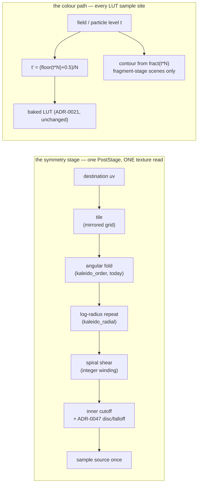

# 0064 — The symmetry stage and the banded palette: mandalas, Droste zooms, and hard colour

> **Status:** draft
> **Created:** 2026-08-04
> **Owner skill(s):** dev, human
> **Related ADRs:** [0077](../adrs/0077-the-symmetry-stage-owns-one-coordinate-map.md) (the
> coordinate map), [0078](../adrs/0078-banding-is-a-palette-coordinate-operation.md) (the banding),
> supplementing [0047](../adrs/0047-kaleidoscope-fold-domain-disc-with-falloff.md) and
> [0021](../adrs/0021-shared-palette-system.md)

## TL;DR

The kaleidoscope grows from an angular fold into **the symmetry stage**: one coordinate map applied
at one texture read, adding log-radius repetition (concentric self-similar rings), a quantized
spiral shear (Droste), wallpaper tiling, and an inner cutoff — plus `palette_steps` and
`palette_contour` on the colour path, which turn smooth gradients into hard graphic bands. Together
they make three of the user's five reference images reachable from a preset, on **every** scene.
First user-visible behavior: `kaleido_radial = 1.3` on any existing preset turns it into a mandala
of nine concentric shrinking copies of itself.

## Context & problem

The user supplied five reference images. Three of them — a radial mandala with concentric shrinking
copies, a higher-contrast variant, and an infinite zoom tunnel — are one mechanism the engine has
exactly half of.

Map the plane to `(log r, θ)`. Periodicity in `θ` is the n-fold fold `kaleidoscope.rs` already does.
Periodicity in **`log r`** is scale self-similarity — concentric rings, each a shrunk copy of the one
outside — and it is the half that is missing. It is also the half that makes the difference: without
it the fold produces a flat rosette, which is what every `kaleido_*` preset in the library looks like
today. A shear between the axes is the Droste spiral; a translation along `log r` is a zoom, and it
returns a **bit-identical** image after one period, so an audio-driven zoom runs forever without a
reset. The fourth image is the same operation in Cartesian coordinates: a wallpaper tile.

The colour treatment is independent and is most of why the references read as *designed*: hard bands
with a dark contour between them, rather than smooth gradients. The engine's LUT is a smooth ramp,
linearly filtered. The cyclic hue is already reachable (the LUT is repeat-addressed, so a large
`color_span` wraps it); only the hard edge is missing.

## Decision

Both halves land in one plan because **neither alone reproduces the references** — a mandala without
bands reads as a smear, and bands without the radial repeat are a recolour of what already exists —
and because the user chose to decide the look from a **rendered sample set**, which has to show the
combination.

The coordinate terms go into the existing kaleidoscope rather than beside it: fold, radial repeat,
spiral and tile are all destination-to-source coordinate maps, so composing them costs **one**
bilinear resample where three stages would cost three, and it puts the inner cutoff, ADR-0047's
`r_max` and falloff and Plan 0055's edge treatment under one radius policy instead of three. The
banding goes on the palette coordinate in-shader rather than into ADR-0021's baked LUT, because the
band count must be bindable and a re-bake per frame is exactly the work that bake exists to avoid.
Rejected alternatives — a stage per term, an authorable domain-warp expression, an RGB posterize post
stage, and baking the bands — are in
[ADR-0077](../adrs/0077-the-symmetry-stage-owns-one-coordinate-map.md) and
[ADR-0078](../adrs/0078-banding-is-a-palette-coordinate-operation.md).

## Architecture diagram

## Implementation phases

### Phase 1 — the coordinate map composes

- **Owner skill:** dev
- **What:** `kaleido_radial`, `kaleido_spiral`, `kaleido_zoom`, `kaleido_tile` and `kaleido_inner`,
  all inside the existing stage as one coordinate function evaluated before the single sample.
- **Files touched:** `core/src/render/kaleidoscope.rs`.
- **The terms, with their parameterizations chosen to be authorable rather than mathematical:**
  - `kaleido_radial` is **the scale ratio between successive rings** — `2.0` means each ring is half
    the size of the one outside it, `1.3` gives fine dense rings. The log period is `L = ln(radial)`.
    `radial ≤ 1` is off and takes the unmapped path, not a degenerate case of the mapped one. For
    scale: across a 10:1 radius range, `radial = 1.3` gives `ln(10)/ln(1.3)` ≈ **9 rings** and
    `radial = 2` gives ≈ **3**.
  - `kaleido_spiral` is an **integer winding number**, quantized CPU-side. Shearing `log r` by `k·θ`
    shifts the radius by `2πk` over one revolution, so the image closes only when `2πk` is a multiple
    of `L` — i.e. `k = m·L/(2π)`. An unquantized spiral draws a visible seam, and this is the same
    trap already recorded for this stage: an eased parameter sweeps continuously through values whose
    math needs integers, so the quantization happens before the uniform is packed.
  - `kaleido_zoom` offsets `log r`. Because the map is periodic in `log r` with period `L`, an offset
    of exactly `L` **is** the identity map — so a zoom bound to `time` or `bar_phase` is a seamless
    endless tunnel with no reset and no crossfade.
  - `kaleido_tile` is cells across the frame, with mirrored alternate cells
    (`abs(fract(x·n/2)·2 − 1)`). Applied **first** in the destination-to-source chain, which read
    forwards means the polar rosette is the motif that gets tiled — what the references show.
  - `kaleido_inner` stops the repeat below a radius. This is **not** optional polish: the repeat
    *minifies* toward the centre, and at `radial = 2` after five repeats a destination annulus at
    0.0125 displays the source's canonical annulus at 0.4 — a linear compression of 32, roughly a
    thousand source texels per destination pixel against a bilinear sampler's four. The reference
    tunnel's bright central disc is exactly this cutoff.
- **Done when:** every term at its identity (`radial = 1`, `spiral = 0`, `zoom = 0`, `tile = 1`)
  renders **byte-identical** captures for all fourteen existing baselines. The two arithmetic
  properties are asserted as **CPU tests on the map**, not on pixels, because both are exact:
  - the map with `zoom` offset by exactly `L` equals the map with `zoom = 0`, to `f32` precision, at
    every sampled destination coordinate — the seamless-loop property;
  - the map at `θ` and at `θ + 2π` agree for every **integer** winding number and **disagree** for a
    fractional one — the seam condition, and the reason for the quantization.

### Phase 2 — colour gets hard edges

- **Owner skill:** dev
- **What:** `palette_steps` and `palette_contour` at every LUT sample site.
- **Files touched:** `core/src/render/scenes/fragment_field.rs`,
  `core/src/render/scenes/reaction_diffusion.rs`, `core/src/render/scenes/particles/mod.rs`,
  `core/src/render/scenes/swarm.rs`, `core/src/render/scenes/lines/mod.rs`.
- **How:** `t' = (floor(t·N) + 0.5)/N` before the sample; the contour darkens where `fract(t·N)` is
  near a band edge, with the width taken from `fwidth` so it is constant in **screen** space.
  `palette_steps` is quantized to an integer CPU-side, for the same reason `kaleido_spiral` is.
- **The scoping that must be documented rather than discovered:** contours need `fwidth`, which
  exists only in a fragment shader — and the attractor and swarm sample the LUT in the **vertex**
  stage, one sample per particle, where there is no gradient to contour in the first place. So
  **banding reaches every scene; contours reach the continuous-field scenes.** `palette_contour` on
  the attractor is inert and nothing warns, which is the shape ADR-0020's unknown-parameter warning
  exists to prevent and cannot catch here — the param *is* known.
- **Done when:** `palette_steps ≤ 1` and `palette_contour = 0` take the unquantized path and every
  baseline is byte-identical. At `palette_steps = 6` on `fragment_smooth`, the capture's distinct
  quantized palette coordinates number exactly 6 — asserted on the CPU-side expression, since a
  pixel count would also see the bloom and the backdrop. Each sample site carries a comment naming
  the single source of the expression, following this codebase's existing practice
  (`apply_saturation` is commented as mirroring `palette.rs::desaturate` verbatim), and a test
  asserts the sites have not drifted.

### Phase 3 — the sample set

- **Owner skill:** dev
- **What:** A rendered grid of concrete variants for the user to choose defaults and ranges from —
  the workflow that decided the fold in [Plan 0045](done/0045-linear-light-and-bloom.md) with a
  sixteen-image three-way set, and the way this user prefers to make look decisions.
- **Files touched:** captures written under the scratch/report path; no shipped file changes.
- **What to render, and it must be a grid rather than a list:** `kaleido_radial` across
  {1.15, 1.3, 1.6, 2.2} × `kaleido_spiral` across {0, 1, 2} on **at least three structurally
  different sources** — a fullscreen field (`fragment_kaleido`), an accumulating figure
  (`attractor_lorenz`), and a line figure (`star_rosette`) — because a coordinate map behaves
  completely differently on a texture that fills the frame and on one that is mostly empty. Then
  `palette_steps` across {0, 4, 8, 16} × `palette_contour` across {0, 0.3, 0.8} on the field source,
  and `kaleido_tile` across {1, 2, 3} once. **Every row at 16:9 and at portrait** — the fold's worst
  behaviour is at non-16:9 aspects ([design-backlog 0010](../design-backlog.md)) and the configuration
  this project develops at hides it ([ADR-0037](../adrs/0037-internal-grid-is-a-resolution-not-a-shape.md)).
- **Done when:** the grid exists as image files with a plain index naming each cell's settings, and
  the `kaleido_inner` sweep specifically shows where the inner aliasing begins on each source — that
  is the number Phase 4 has to pick and it cannot be picked from arithmetic.

### Phase 4 — pick the defaults and the ranges

- **Owner skill:** human
- **What:** The user reads Phase 3's grid and chooses: default `kaleido_inner`, the useful range of
  `kaleido_radial`, whether the spiral earns its param at all, whether `kaleido_tile` earns its param
  at all, and the band-count and contour range worth documenting as the sane region.
- **Done when:** each of the five new terms has either a chosen range or a decision to drop it, and
  the aliasing cutoff has a number that came from an image. **Dropping a term here is a legitimate
  outcome** — the tile is the most likely candidate, being the most "texture" and least "figure" of
  the set.

### Phase 5 — lock it in: a fixture that would notice, and the doc sweep

- **Owner skill:** dev
- **What:** Apply Phase 4's decisions, pin the stage with a baseline, sweep the operator docs.
- **Files touched:** `core/src/render/kaleidoscope.rs`, `core/tests/fixtures/composite_symmetry.toml`
  (new) + its baseline, `presets/README.md`, `docs/preset-palettes.md`.
- **Why a new fixture:** `composite_kaleido.toml` pins the fold's *artifact* on purpose
  ([design-backlog 0010](../design-backlog.md)) and binds none of the new terms, so it would bless a
  broken radial repeat silently. The new fixture binds `radial`, `spiral`, `tile`, `inner`, `steps`
  and `contour` all non-identity.
- **Docs the sweep owes:** `presets/README.md` gains the five `kaleido_*` terms with the composed
  order stated (**tile → fold → radial → spiral**, and that it is fixed, not author-selectable) and
  the aliasing warning attached to `kaleido_inner` rather than left to be rediscovered.
  `docs/preset-palettes.md` gains `palette_steps` / `palette_contour` **and the scene scoping** — that
  contours are inert on the attractor and swarm and why. Both files are load-bearing for the
  `preset-author` lane, which keeps no catalogue of its own. `docs/presets.md` is **not** touched: no
  grammar change.
- **Done when:** the new baseline exists and the other fourteen are verified untouched. Standing
  trap: `LMV_BLESS` rewrites **all** baselines rather than the one you meant.

### Phase 6 — build the reference looks

- **Owner skill:** human
- **What:** A `preset-author` pass producing presets that actually reproduce the user's references —
  a banded radial mandala, a Droste tunnel locked to the bar, and a tiled field — judged live.
- **Questions it answers that no capture can:** does the seamless zoom read as endless travel or as a
  loop you can feel? Is a beat-latched `palette_steps` a response or a strobe? Does the mandala hold
  up on a *sparse* source (the attractor at low `density`) or only on a full-frame field?
- **Done when:** the presets ship, and anything that could not be made to read is written up in
  `docs/design-backlog.md` rather than quietly left bound to nothing.

## Risks & open questions

- **[Plan 0055](0055-the-fold-edge-becomes-a-choice.md) is approved and lives in this shader.** One
  of the two inherits the other's file. They touch different parts — 0055's `kaleido_edge` is a
  uniform branch on the **destination** radius, which the composed map does not touch — and 0055 is
  the smaller and older, so **taking 0055 first is the cheaper order**. Neither is wrong.
- **The inner rings alias, and `kaleido_inner` is a workaround.** The correct fix is a mip chain on
  the stage's source with an LOD from the map's Jacobian; the post chain's offscreens are
  single-level today, so that is a separate plan. Phase 3's sweep is what makes the limit visible
  instead of surprising.
- **Banding fights bloom.** ADR-0046's bright pass blurs exactly the hard edges this plan creates, so
  a preset cannot have crisp bands and heavy bloom at full strength. Not solvable here; named so
  Phase 6 does not treat it as a defect.
- **The banding expression is duplicated at five sample sites.** This project has no shader include
  mechanism and the existing practice is a commented verbatim copy. The drift test in Phase 2 is
  weaker than not having copies, and that is the accepted cost.
- **Phase 4 is `human` and gates Phases 5-6**, so this plan does not close in one session by
  construction. Phases 1-3 are a full `dev` session.
- **The `PostStage::internal_size` policy is unchanged and must stay unchanged.** Nothing here reads
  a grid's aspect; the stage's aspect comes from the render target, per
  [ADR-0037](../adrs/0037-internal-grid-is-a-resolution-not-a-shape.md). Grep the diff for `aspect`
  at review — a value derived from the stage's internal size is the bug this project has shipped
  twice.

## What this plan does NOT do

- **No mip chain and no Jacobian LOD.** The proper answer to the minification aliasing; deferred, with
  `kaleido_inner` as the control in the meantime.
- **No authorable domain warp.** ADR-0077 Alternative B — a per-pixel expression VM is a compiler, not
  a parameter.
- **No RGB posterize.** ADR-0078 Alternative B — it bands the picture's brightness rather than the
  field, and would catch the bloom and backdrop too.
- **No change to ADR-0021's LUT bake**, no new post stage, no `Scene` trait change, no C ABI change,
  no new dependency.
- **Not the drawn mandala.** The fourth reference image is line geometry and is
  [Plan 0065](0065-the-mandala-interior.md).

## Followups (after this lands)

- Mip-chained post offscreens with an explicit LOD, if Phase 6 finds `kaleido_inner` too blunt.
- Whether the composed order should be author-selectable, if Phase 6 wants tile-after-fold.
