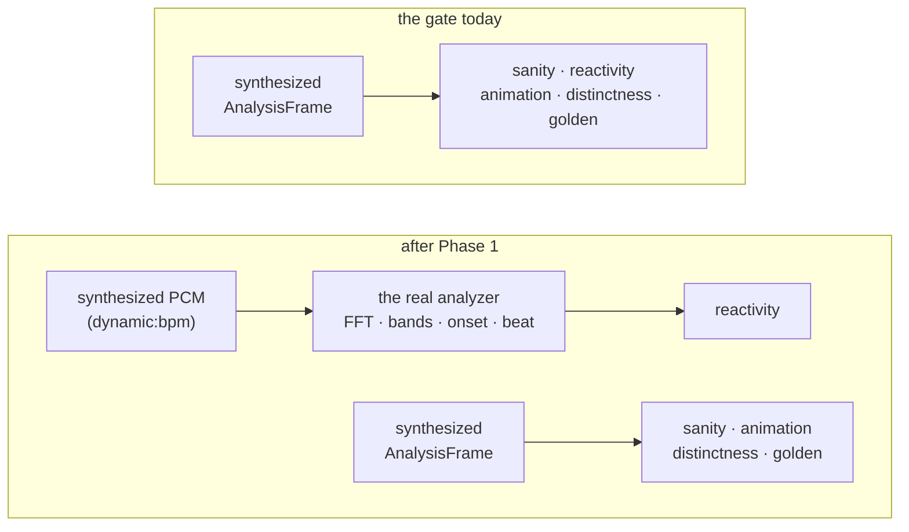

# 0067 — The curation route: a gate worth trusting, and the preset that has been waiting six weeks

> **Status:** **approved 2026-08-04** — ready for `dev`, gated by nothing. Phases 1-2 are `dev`;
> **Phase 3 is `human`** (the Coral Oracle pass — declining it is a successful outcome) and gates
> Phase 4, so the plan does not close in one session. Phase 1 touches `core/tests/reactivity.rs`,
> adjacent to [0061](0061-the-build-stops-paying-for-what-it-is-not-building.md)'s CI and coverage
> work — keep that seam clean if both are live. **Moves no pixels.**
> **Created:** 2026-08-04
> **Owner skill(s):** dev, human
> **Related ADRs:** [0081](../adrs/0081-the-content-lane-lands-presets-and-architect-curates-the-set.md), supplementing [0017](../adrs/0017-preset-author-skill-lane.md)
> **Closes:** [design-backlog 0056](../design-backlog.md#0056--a-user-authored-preset-has-been-living-outside-the-repo-for-six-weeks-and-it-is-a-curation-candidate-the-boundary-has-no-route-for)

## TL;DR

[ADR-0081](../adrs/0081-the-content-lane-lands-presets-and-architect-curates-the-set.md) lets
`preset-author` commit presets directly, **gated on the behavioral suite**. This plan makes that
gate worth leaning on — today all five preset gates synthesize `AnalysisFrame` values and none of
them drives PCM through the analyzer, so a green suite is silence rather than evidence — and then
walks the first candidate through the new route: the untracked "Chthonic Coral Oracle", which
motivated Plan 0025 and never came home.

## Context & problem

Two problems that only look separate.

**The route.** ADR-0017 put curation at "`dev` embeds a curated preset" because embedding meant
editing Rust in two coupled spots. ADR-0022 retired that premise — `core/build.rs` globs
`presets/*.toml` — so the boundary has been standing on a fact that stopped being true. ADR-0081
moves it: the lane lands presets, `architect` curates the set at plan-close cadence.

**The gate that authorizes it.** `grep -l 'SpectrumAnalyzer\|push_samples' core/tests/*.rs` returns
`beat.rs`, `chain.rs`, `dsp.rs`, `saturation.rs`. It does **not** return `sanity.rs`,
`reactivity.rs`, `animation.rs`, `distinctness.rs` or `golden.rs` — the five gates a preset actually
passes through. Those construct analysis frames directly. So the sentence "gated on the behavioral
suite" currently means *the renderer produced a plausible frame from numbers we made up*, and it is
about to become the thing that authorizes shipping content without a second reader.

The two shipped instruments that *do* see real signal are `shot --audio <clip.wav>` and
`shot --signal dynamic:<bpm>` (Plan 0037 Phase 3), and the levels real material produces are
recorded in [`capturing.md`](../capturing.md#what-real-material-actually-produces). The analyzer
path exists and is exercised; it is simply not in the loop the preset gates run.

**And the candidate.** `%APPDATA%\light-music-visualizer\presets\chthonic_coral_oracle.toml` has
never been tracked. It raised the entry that became ADR-0026 and Plan 0025, so the levers it asked
for shipped while the look that asked for them did not. It also carries two pieces of rot read off
the file: `kaleido_angle = "time * 0.06 + bar * 0.5"` names `bar`, which stopped being a variable at
ADR-0050, and `kaleido_order` is eased at `tau = 2.0`, sweeping a param whose math wants integers
through the values between them.

## Decision

Strengthen one gate so it sees real signal, then run the candidate through the route ADR-0081
opens. We rejected doing the candidate first — that is what happened last time and it is why the
file spent six weeks outside the repo — and we rejected converting all five gates to a PCM path,
because the point is a *credible* authorization, not a uniform one, and four of the five are asking
questions (does it animate, is it distinct, does it match its baseline) that synthesized frames
answer correctly and more cheaply.

## Architecture diagram

## Implementation phases

### Phase 1 — One gate stops making up its input

- **Owner skill:** dev
- **What:** `reactivity.rs` drives its presets from **PCM through the real analyzer** rather than
  from hand-built `AnalysisFrame`s, using the same synthesized generator `shot --signal
  dynamic:<bpm>` uses.
- **Files touched:** `core/tests/reactivity.rs`, whatever shared test helper builds frames today,
  possibly a small `core/src/dsp` re-export if the generator is not reachable from a test.
- **Done when:** the reactivity gate's numbers come from `push_samples` → analyzer → scene, not from
  a literal; the gate still passes over the shipped set; and a preset whose only band binding is
  deleted **fails** it, which is the property proving the signal reaches the picture. Determinism
  is preserved — the generator is seeded and the analysis is a pure function of its window
  (`CLAUDE.md`'s determinism rule), so the gate stays byte-reproducible run to run.
- **Note:** `reactivity` is the right one because it is the only gate whose *question* is about
  audio. The other four ask about the frame and are correct as they stand.

### Phase 2 — The gate says what it can and cannot see

- **Owner skill:** dev
- **What:** the harness docs stop letting "the suite is green" be read as stronger than it is.
- **Files touched:** [`docs/capturing.md`](../capturing.md) (a short section naming which gates run
  the analyzer and which synthesize), `presets/README.md` if it points at the suite as an
  acceptance check.
- **Done when:** a reader can tell, without opening a test file, which of the five gates would
  notice that a preset ignores the music. This is the sentence ADR-0081's Negative section is
  waiting on.

### Phase 3 — Chthonic Coral Oracle comes home, or is decided against

- **Owner skill:** human
- **What:** a `preset-author` pass: refresh the file against the v2 grammar, render it, judge it in
  motion, and decide whether it earns a place — including whether the regime-drift idea is better
  carried by a new preset than by restoring this one.
- **Files touched:** `presets/chthonic_coral_oracle.toml` (new, if it earns it).
- **Done when:** the file is either committed to `presets/` having passed the suite, or explicitly
  declined with the reason recorded in the backlog entry. **Both are successful outcomes** — the
  plan is about the route existing, not about this file shipping. Two known repairs first: `bar` is
  no longer a variable (build the term on `beat_index` / `time_since_beat`, since the downbeat
  estimator locks ~3 % of the time — [backlog 0042](../design-backlog.md)), and the eased
  `kaleido_order` sweeps through non-integer values, which is a render question this pass answers
  by looking.

### Phase 4 — The close ceremony grows a curation step

- **Owner skill:** dev
- **What:** the architect skill's close-ceremony bookkeeping gains the curation pass ADR-0081 makes
  its duty, hooked to "this plan touched `presets/`".
- **Files touched:** `.claude/skills/architect/SKILL.md` (the close-ceremony bookkeeping list),
  `.claude/skills/preset-author/SKILL.md` (the handoff description, which currently says the lane
  names candidates and hands off).
- **Done when:** both skills describe the same boundary, and neither still says `dev` embeds a
  curated preset. The architect's list states the trigger (the plan touched `presets/`) and the
  output (a one-line verdict in the close notes), because a duty with no trigger is the one this
  project has already proved gets skipped.

## Risks & open questions

- **Phase 1 could get expensive.** Running the analyzer per preset adds work to a gate that already
  sweeps the shipped set, and CI pays for preset sweeps more than once per push
  ([Plan 0061](0061-the-build-stops-paying-for-what-it-is-not-building.md) Phase 4b measured it).
  Keep the stimulus short — the analyzer needs enough window to fill, not a musical phrase — and if
  the gate's wall-clock grows materially, say so rather than absorbing it.
- **Phase 1 is adjacent to Plan 0061's CI work**, which owns `ci.yml` edits and the report
  generator's coverage. This phase touches `core/tests/` only. If both are live, that is the seam
  to keep clean.
- **Phase 4 edits `.claude/skills/**`.** Writes there are classifier-dependent rather than blocked;
  attempt the edit and report if it is refused rather than assuming.
- **Phase 3 may decline the preset**, which would leave ADR-0081's route demonstrated by a negative
  result. That is a weaker demonstration but not a failed one, and the entry says the same.

## What this plan does NOT do

- **It does not convert the other four gates to PCM.** They ask questions about the frame that
  synthesized analysis answers correctly and faster. Phase 2 documents that as a decision rather
  than leaving it as an omission.
- **It does not run a curation pass over the existing library.** Phase 4 installs the duty; the
  first pass belongs to whichever plan close next touches `presets/` — very likely
  [backlog 0058](../design-backlog.md)'s fold-edge content work.
- **It does not change what `dev` may edit.** `dev` still edits presets when an engine change
  requires it (a renamed param, a retired default); what it stops doing is *couriering* new content.
- **It does not touch ADR-0017's other boundaries.** `preset-author` still writes no engine Rust.

## Followups (after this lands)

- If Phase 1's real-signal gate turns up shipped presets that pass while ignoring the music, that
  is a content finding worth its own backlog entry — and it would be the first time an instrument
  in this repo could have found it.
- The other four gates' blindness is now written down. If one of them ever needs to answer an audio
  question, this plan's Phase 1 is the pattern to copy.
