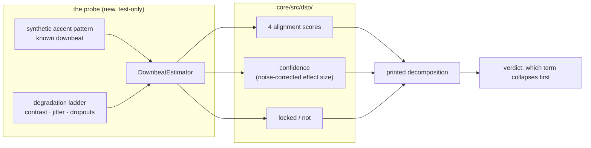

# 0068 — Why the downbeat rarely locks: an instrument, an ablation, and a verdict

> **Status:** **in-progress 2026-08-09** — ready for `dev`, gated by nothing and sharing no file with
> any other plan in the roster. Phases 1-2 are `dev` and run start-to-finish; **Phase 3 is `human`**
> (a listening pass on known-4/4 material, reading the 1 Hz log rather than judging by ear) and
> gates Phase 4, so the plan does not close in one session. **Ships a diagnosis and no fix, on
> purpose** — the repair is a follow-on plan written against the named cause. **Moves no pixels.**
> **Created:** 2026-08-04
> **Owner skill(s):** dev, human
> **Related ADRs:** [0082](../adrs/0082-the-downbeat-gate-holds-and-the-estimator-is-diagnosed-first.md), supplementing [0050](../adrs/0050-downbeat-and-phrase-tracking-with-confidence-fallback.md)
> **Closes:** [design-backlog 0042](../design-backlog.md#0042--the-downbeat-estimator-locks-on-3--of-audible-time-so-the-gated-bar-variables-are-almost-always-fallback)

## TL;DR

The downbeat estimator locks on 3.1 % of audible time, so `beat_in_bar` / `bar_index` / `bar_phase`
are counter-derived almost always. Three terms could be responsible — the accent feature, the 4/4
fold, the confidence measure — and nobody has distinguished them, because the only instrument is a
1 Hz column printing the *outcome*. This plan builds an instrument that prints the terms, degrades a
known-good pattern until the lock is lost, and ends with a named cause. **It deliberately ships no
fix**: per [ADR-0082](../adrs/0082-the-downbeat-gate-holds-and-the-estimator-is-diagnosed-first.md)
the gate does not move to buy lock rate, and the repair belongs to a plan written against a
diagnosis rather than against a symptom.

## Context & problem

Plan 0048 Phase 6 measured the estimator through the live app: 458 audible rows, `downbeat_locked`
true in **14** of them, confidence **mean 0.030 / median 0.000** against `CONFIDENCE_THRESHOLD =
0.25`, clearing the gate in two of eighteen 30-second windows and peaking at **0.516** — twice the
gate. It can lock. It rarely does.

Nothing is broken: ADR-0050 designed the gate so that failing to lock degrades to counters, and the
fallback shares the publishing formula rather than being a parallel path. What is true is that a
capability the engine paid for is unreachable in practice, and that the mis-accent risk the gate
exists to prevent is **untested** rather than passed — with the gate shut 97 % of the time there was
little opportunity to observe one.

The blocker on doing anything about it is that the measurement is an outcome, not a decomposition.
`downbeat.rs` computes four alignment scores and a noise-corrected effect size every beat, and none
of that is observable over a run. So "the accent feature is too weak", "eight bars of history is the
wrong window" and "the confidence measure under-reports" are three untested stories that fit the
same number.

## Decision

Build the decomposition, then use it — first on synthetic patterns with known ground truth, then on
degraded versions of those patterns to find where the lock is lost, then on real material through
the existing 1 Hz path. The deliverable is a **named cause with a curve behind it**. We rejected
lowering the threshold (ADR-0082 Alternative A — it spends the guarantee to buy the capability,
using data collected while the gate was closed), and we rejected rewriting the estimator (replacing
three terms to fix whichever one is weak).

## Architecture diagram



## Implementation phases

### Phase 1 — The estimator's terms become observable

- **Owner skill:** dev
- **What:** a test-only decomposition — the four alignment scores, the raw effect size, the noise
  correction and the published confidence — exposed for a run and printed.
- **Files touched:** `core/src/dsp/downbeat.rs` (a `#[cfg(test)]` or crate-internal accessor; **no
  new allocation and no wall-clock read** — this module is on the analysis path and is pure and
  allocation-free after construction by design), `core/tests/dsp.rs` or a new
  `core/tests/downbeat_probe.rs`.
- **Done when:** feeding a clean synthetic 4/4 with a strong accent on beat 1 prints four alignment
  scores in which the true alignment is the largest, and a confidence above the gate; feeding an
  unaccented click train prints four near-equal scores and a confidence near zero. Both claims are
  already made by the module's own tests — **the phase's deliverable is the printed decomposition,
  not the pass/fail**, and the done-when is that a reader can see *why* each case scores as it does.

### Phase 2 — The degradation ladder: where the lock is actually lost

- **Owner skill:** dev
- **What:** take the clean pattern from Phase 1 and degrade it along three independent axes, one at
  a time, recording confidence at each step: **accent contrast** (how much louder beat 1 is than
  beats 2-4, from decisive down to none), **timing jitter** on the beat stream, and **dropouts**
  (beats with no accent at all, as a sparse arrangement produces).
- **Files touched:** the probe test from Phase 1.
- **Done when:** the report gives, per axis, the value at which published confidence falls below
  `0.25` — as a curve across the ladder rather than a single number, because the useful output is
  *which axis is steep*. The claim this phase can support is comparative and dimensionless ("the
  estimator tolerates X of jitter and only Y of contrast loss"), so it does not depend on the
  machine and can be asserted; an absolute confidence value at a given rung is a measurement and is
  printed rather than asserted ([ADR-0071](../adrs/0071-a-numeric-test-contract-states-a-property-or-names-its-machine.md)).
- **Why this separates the candidates:** if confidence collapses on contrast loss, the accent
  feature is the weak term. If it survives contrast loss but collapses on dropouts, the fold's
  history window is. If it stays high across the ladder while the *published* value does not, the
  noise correction is over-discounting and the confidence measure is the weak term.

### Phase 3 — The same probe against real music

- **Owner skill:** human
- **What:** a listening pass on **known-4/4 material only**, reading the 1 Hz `downbeat_locked` and
  `downbeat_confidence` columns, to sharpen the ~6 % beat-driven figure the earlier half-and-half
  split left approximate — and to locate real material on Phase 2's ladder.
- **Files touched:** none (a measurement; results recorded in this plan and in the backlog entry).
- **Done when:** there is a lock-rate figure for material that is unambiguously 4/4 with a clear
  downbeat, and a statement of which degradation axis real material most resembles. **Do not
  re-measure by ear** — the log column is the instrument.

### Phase 4 — The verdict, and the docs stop offering two layers as equals

- **Owner skill:** dev
- **What:** write the diagnosis into ADR-0082 as a dated `Outcome` section (the ADR-0054 / ADR-0074
  precedent), and qualify the authoring docs.
- **Files touched:** `docs/adrs/0082-...md` (an `Outcome` section — the ADR body is not edited),
  `presets/README.md` and `docs/presets.md` (layer 1 is unconditional and reliable; layer 2 is
  confidence-gated and, as measured, mostly counter-derived — build an arc on `beat_index`).
- **Done when:** an author reading the variable roster can tell which musical-time variables are
  always meaningful and which are conditional, with the measured rate stated; and ADR-0082 carries
  the named cause. If the diagnosis is inconclusive, **that is what the Outcome says** — an honest
  null is the deliverable's floor, not a failure.

## Data shapes

```rust
// illustrative — not the final interface, and test-visible only
pub(crate) struct DownbeatTerms {
    pub alignment: [f32; BEATS_PER_BAR], // folded accent per candidate beat-1
    pub effect_raw: f32,                 // before the noise correction
    pub effect_corrected: f32,           // what the gate compares
    pub beats_seen: u32,                 // against the evidence floor
}
```

## Risks & open questions

- **The probe must not change the estimator's behaviour.** `downbeat.rs` is pure and
  allocation-free after construction and sits on the analysis path; an accessor that allocates or
  branches differently under test would make the diagnosis measure the probe. Keep the exposure a
  read of state that already exists.
- **The synthetic ladder may not resemble real music**, which is exactly why Phase 3 exists and why
  it is `human`. If Phase 3 finds real material sitting off the ladder entirely, that is itself the
  finding and Phase 4 records it.
- **A plan that ships no fix can read as unfinished.** It is not: ADR-0082's whole argument is that
  the fix chosen without this diagnosis would most likely be the threshold, which is the one change
  the measurement must not be taken to recommend.
- **Phase 3 is `human` and mid-plan**, gating Phase 4 — so this plan does not close in one session.
  Phases 1-2 are a self-contained `dev` session.

## What this plan does NOT do

- **It does not move `CONFIDENCE_THRESHOLD`.** ADR-0082's decision, and the reason this plan exists
  in this shape.
- **It does not change the accent feature, the fold, or the confidence measure.** Those are the
  suspects; changing one before the diagnosis is what this plan is a substitute for.
- **It does not touch layer 1.** `beat_index` and `time_since_beat` are unconditional and are what
  presets should build on meanwhile.
- **It does not add a meter hypothesis beyond 4/4.** ADR-0050 assumes 4/4 and falls back rather than
  mis-accenting; that is not implicated in the measured material.

## Followups (after this lands)

- The repair plan, written against the named cause. It will want its own ADR only if the cause has a
  real fork (e.g. a stronger accent feature versus a longer history window trade latency against
  each other).
- If Phase 2 shows the confidence measure is under-reporting a correct alignment, the gate keeps its
  meaning and the *measure* is what changes — which is the one route that improves lock rate without
  touching the trade ADR-0050 made.
