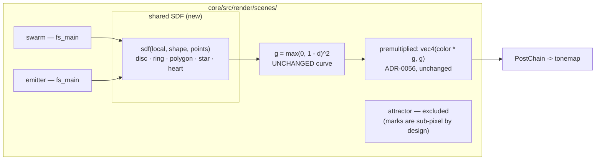

# 0070 — Shaped marks: the particle sprite stops being a circle

> **Status:** draft
> **Created:** 2026-08-04
> **Owner skill(s):** dev, human
> **Related ADRs:** [0084](../adrs/0084-a-particle-marks-silhouette-is-a-signed-distance-function.md)
> **Closes:** the silhouette half of [design-backlog 0033](../design-backlog.md#0033--every-mark-the-engine-can-draw-is-a-round-additive-blob-or-a-stroked-curve-so-no-object-has-a-shape)

## TL;DR

Every mark the engine draws is a round additive blob (`d = length(in.local)`) or a stroked curve.
This plan gives `swarm` and `emitter` a `shape` parameter selecting a signed-distance function —
disc, ring, polygon, star, heart — with the existing quadratic falloff measured from the shape's
boundary instead of from the sprite centre. First visible behavior: a field of small seven-pointed
stars twinkling on the beat, which is the form the user asked for twice and which no combination of
existing params gets closer to.

## Context & problem

`swarm.rs::fs_main` is three lines and has no shape input:

```wgsl
let d = length(in.local);
let falloff = max(0.0, 1.0 - d);
let g = falloff * falloff;
```

The emitter's sprite is the same idea. So the engine can place ten thousand marks anywhere, with
motion, lifetime, depth, spin and twinkle — and they are all circles.

The workaround that exists is not close. `parametric_curve` with `radial_offset = 1` produces
exactly `n` lobes and can flip the count every beat (`n = "7 + floor(hash(beat_index) * 2.999)"`
works and is rather nice), but it is **one large centred figure**, and `mirror_order` replicates
about the origin so copies land on each other. Rendered, it reads as a starfield and not at all as
stars with points.

**What this plan does not fix, stated up front.** The same backlog entry carries a second ask — a
red heart with a black outline — and that needs a *fill and stroke* model. The pipeline is additive:
black adds zero, and the only dark-on-light route is the ink stage, which is two-poled
(`mix(paper, ink, luminance)`). Measured: the cardioid drawn through `parametric_curve` at
`ink_amount = 1` on white paper renders its outline **grey**, because a thin anti-aliased stroke
averages to mid luminance. A heart-shaped *glow* is what this plan delivers.

## Decision

Per [ADR-0084](../adrs/0084-a-particle-marks-silhouette-is-a-signed-distance-function.md): a `shape`
enum evaluated as an SDF in the existing fragment shader, `disc` as the default and exactly today's
arithmetic, on `swarm` and `emitter` only. We rejected a texture atlas (an asset pipeline, and worse
than an SDF at the small sizes this is *for*), a fill-and-stroke path outside the additive model
(reopens ADR-0018/ADR-0056 — it stays a separate backlog question), and author-supplied WGSL
(ADR-0002's parked escape hatch). The `attractor` is excluded because its marks are a chaos-game
accumulation: at the densities that make a figure, one mark is a point.

## Architecture diagram



## Implementation phases

### Phase 1 — The SDF library, and `swarm` gets a silhouette

- **Owner skill:** dev
- **What:** a shared WGSL distance-function block (disc, ring, regular polygon, n-pointed star,
  heart), plus `shape` and `points` on `swarm`'s `PARAMS`.
- **Files touched:** `core/src/render/scenes/swarm.rs` (the shader source, `PARAMS`, `set_param`,
  `reset_params`, the instance or uniform carrying the selection), a new shared shader chunk if the
  two scenes are to share one source of truth.
- **Done when:** `shape = disc` (the default) renders **byte-identically** to the pre-phase build —
  exact, because the disc branch is the same three lines it replaces; `shape = star` with
  `points = 7` produces a figure whose lit radius has **exactly seven angular maxima**, counted from
  a capture rather than asserted by eye; and the falloff curve is unchanged, so a disc at any `size`
  matches today at that size.

### Phase 2 — `emitter` gets the same vocabulary

- **Owner skill:** dev
- **What:** the same `shape` / `points` params on the emitter, reading the same SDF block.
- **Files touched:** `core/src/render/scenes/emitter.rs`.
- **Done when:** the two scenes' `PARAMS` agree on both names and the shape roster is one list in
  one place — a test asserting both scenes accept the same set of `shape` values, so the two cannot
  drift. The emitter's existing `spin` rotates the silhouette, which is what makes a shaped mark
  read as an object rather than a stamp; `spin` on a disc stays the no-op it is today.

### Phase 3 — `points` steps, and the engine says so

- **Owner skill:** dev
- **What:** quantize `points` CPU-side before upload, per the `kaleido_order` precedent, and pin the
  behaviour.
- **Files touched:** wherever the scenes fold evaluated params into their uniform; a test.
- **Done when:** an eased `points` sweeping `7 → 9` produces **only** the figures at 7, 8 and 9 —
  never a partial lobe — and the test states that as the behavioral claim. This is the opposite of
  what `variant` ([ADR-0060](../adrs/0060-star-pattern-variants-interpolate.md)) and the IFS morph
  ([ADR-0075](../adrs/0075-ifs-family-morphs-in-singular-value-space.md)) taught, so it is called out
  rather than assumed: a star's angle fold is periodic in the count, and a fractional count is a
  discontinuity, not an intermediate.

### Phase 4 — A golden fixture per shape family, and the cost is measured

- **Owner skill:** dev
- **What:** one fixture exercising a non-disc silhouette, plus a frame-cost reading for the branch.
- **Files touched:** `core/tests/fixtures/swarm_shaped.toml` + baseline, `core/tests/`.
- **Done when:** the new baseline is blessed once, deliberately, with the frame looked at; **every
  pre-existing baseline is byte-identical** (no shipped preset names a shape, so they all take the
  disc branch, which is exact); and the per-frame cost with a non-disc shape is *reported* against
  the disc case on the machine it was measured on, not asserted as a threshold
  ([ADR-0071](../adrs/0071-a-numeric-test-contract-states-a-property-or-names-its-machine.md)). If the
  reading is alarming against `docs/nfr.md` §7, say so — do not tune until it passes.

### Phase 5 — The docs carry the roster and the two warnings

- **Owner skill:** dev
- **What:** `presets/README.md` gains `shape` / `points` in the `swarm` and `emitter` sections.
- **Files touched:** `presets/README.md`, `docs/presets.md` if it enumerates scene params.
- **Done when:** the roster is listed with a one-line description each; the entry for `points` says
  it **steps** under `[smoothing]` rather than morphing, and why; and the section states plainly
  that a shaped mark is a *silhouette in additive light* — there is no fill and no outline, so a
  heart is a heart-shaped glow. That sentence is the one that stops the next author burning a
  session discovering ADR-0084's deliberate scope.

### Phase 6 — The starfield the request asked for

- **Owner skill:** human
- **What:** a `preset-author` pass producing the look that motivated this: small white-gold
  seven-, eight- and nine-pointed stars on black, twinkling and flashing on bass and beat.
- **Files touched:** one new preset under `presets/`.
- **Done when:** the preset is judged in motion against real audio and either ships or is declined
  with the reason recorded. Worth pairing with `hash(beat_index)` on `points` — the count flipping
  per beat is the trick that already worked on `parametric_curve` and it should carry over.

## Data shapes

```rust
// illustrative — not the final interface
#[repr(u32)]
enum MarkShape { Disc = 0, Ring = 1, Polygon = 2, Star = 3, Heart = 4 }
// Uploaded per draw (not per instance) as two scalars in the existing uniform:
//   x: shape as u32-in-f32, y: quantized point count
// Per-draw rather than per-instance keeps the branch uniform across a warp and
// keeps `SegmentInstance`-sized structs from growing.
```

## Risks & open questions

- **A branch in the hottest fragment shader in the engine.** Keeping the selection *per draw*
  rather than per instance is what keeps it uniform; Phase 4 measures rather than assuming. If the
  cost is real, the fallback is separate pipelines per shape, which trades pipeline count for
  branchlessness — and pipeline count has its own hazard on the WARP adapter
  ([ADR-0058](../adrs/0058-bind-group-layout-collisions-carry-evidence.md)), so that fallback is not
  free either.
- **Small marks are where SDFs earn their keep and also where they alias.** A seven-pointed star at
  three pixels is mostly its own anti-aliasing. The falloff curve helps (it is a soft edge by
  construction), but Phase 6 is where this gets judged, and "the shape is invisible at the sizes the
  look wants" is a possible honest outcome.
- **The roster is closed.** A look wanting a shape not on the list routes back through `architect`.
  That is deliberate and matches ADR-0061's fold-edge precedent, but it means Phase 6 may surface a
  sixth shape as feedback rather than as a preset.
- **Phase 6 is `human` and terminal**, so this plan does not close in one session. Phases 1-5 are a
  full `dev` session with nothing gating them.

## What this plan does NOT do

- **It does not add fill or outline.** No two-tone objects, no dark marks. That reopens the additive
  model and stays a separate backlog entry — see ADR-0084 Alternative B.
- **It does not touch the attractor.** Excluded by argument, not by omission.
- **It does not change the falloff curve.** `g = max(0, 1 - d)^2` is preserved exactly, so any
  visual change is attributable to the silhouette alone.
- **It does not add author-supplied shaders.** ADR-0002's parked escape hatch stays parked.

## Followups (after this lands)

- The fill-and-outline question — the other half of backlog 0033 — is now cleanly separable and
  should be re-stated as its own entry once this lands, so the two are not confused again.
- If Phase 6 wants a shape the roster lacks, that is one line of feedback and a small follow-on, not
  a redesign.
