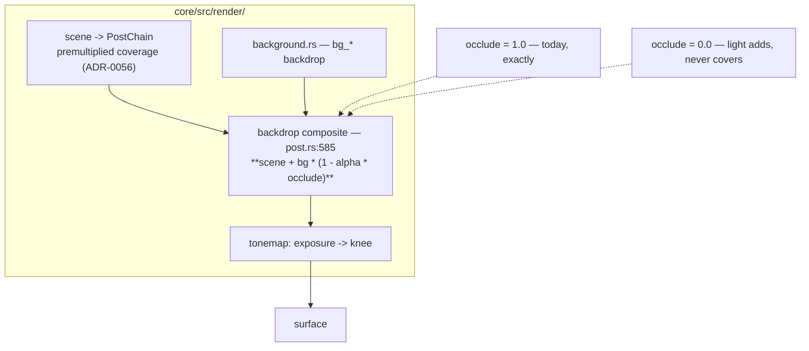

# 0071 — Light that adds without covering: `occlude`, decided from a sample set

> **Status:** **approved 2026-08-04** — ready for `dev`, gated by nothing. It touches `post.rs`'s
> backdrop composite, which [0064](0064-the-symmetry-stage-and-the-banded-palette.md) does not (that
> is the fold shader). Phases 1-2 are `dev` and end in a rendered grid; **Phase 3 is `human`** (the
> user picks the default, in motion, over a **lit** backdrop — at `bg_bright = 0` the two models are
> identical) and gates Phases 4-5, so the plan does not close in one session. **Moves no golden
> baseline at the default `1.0`**; if Phase 3 moves the default, the re-bless is priced there first.
> **Created:** 2026-08-04
> **Owner skill(s):** dev, human
> **Related ADRs:** [0085](../adrs/0085-how-much-a-scene-occludes-the-backdrop-is-one-number.md), supplementing [0056](../adrs/0056-additive-scenes-emit-premultiplied-alpha.md)
> **Closes:** [design-backlog 0040](../design-backlog.md#0040--additive-light-occludes-by-geometry-so-a-dim-figure-over-a-lit-backdrop-reads-as-dark-speckle)

## TL;DR

A scene's alpha is its geometric coverage, so a fragment occludes the backdrop whatever light it
emits — which means `bg_bright` can rise only as far as the figure's dimmest emitted luminance
before the picture grows dark speckle. This plan adds `occlude`, one bindable scalar at the backdrop
composite: `scene + bg * (1 - alpha * occlude)`. At the default `1.0` nothing changes, exactly. Then
it renders both models side by side over a **lit** backdrop and lets the user decide what the
default should be — because ADR-0085 is a look decision and the argument for it cannot settle it.

## Context & problem

ADR-0056 made scenes emit premultiplied coverage, which fixed black notches and rims. Its last
Negative bullet is this plan's subject: coverage-as-alpha means a fragment covers the backdrop
whatever it emits, so it *darkens* the backdrop wherever `c < bg`.

At the shipped floors this is unobservable — all sixteen affected presets sit between `bg_bright`
0.009 and 0.070. It matters because **the ADR-0056 fix invited raising them**: the black rim is why
the swarm and line families were floored, and `lsystem_fern.toml:98-103` still records the symptom
with the wrong cause attached. An author accepting that invitation meets a ceiling nobody chose —
past the figure's dimmest emitted luminance, depth-parallaxed far particles and `glow`-dimmed
strokes stop fading and start reading as dark speckle.

Rendered, both ends: `swarm_storm` over `bg_bright = 0.35` at `brightness = 0.02` is black specks;
at the shipped floor the same run's darkest pixel is `(71,13,22)` against `(138,67,56)`.

Nothing is broken — post-ADR-0056 is brighter than pre- at every pixel. The open question is whether
coverage is the right model for an additive look at all, and that is a question you answer by
looking.

## Decision

Per [ADR-0085](../adrs/0085-how-much-a-scene-occludes-the-backdrop-is-one-number.md): `occlude`, a
bindable scalar in `[0, 1]` at the backdrop composite, default `1.0`. We rejected a two-valued enum
(less expressive at identical cost, and it would add a fourth quantization seam to a codebase that
has already been bitten by three), deriving alpha from luminance centrally (ADR-0056's standing
rejection — a legitimately dark covered pixel would go transparent), per-scene rather than
per-preset semantics (it takes the choice away from the level where a backdrop and a figure meet),
and documenting the ceiling and changing nothing (a trap with a sign on it).

**The default is decided in Phase 3, not here.** Phases 1-2 build the mechanism and the sample set;
Phase 3 is the user's call in the running app.

## Architecture diagram



## Implementation phases

### Phase 1 — `occlude`, at the one seam that already does this arithmetic

- **Owner skill:** dev
- **What:** an engine-wide bindable `occlude`, defaulting to `1.0`, multiplying the alpha the
  backdrop composite resolves against.
- **Files touched:** `core/src/render/post.rs` (the blend at `:585` where the last active stage
  lands on the backdrop, **and its no-active-stage counterpart** — there are two paths and both must
  take the same factor), `core/src/render/mod.rs` (param routing, `reset_params`), whichever uniform
  the composite already carries.
- **Done when:** at `occlude = 1.0` every existing golden baseline is **byte-identical** — exact,
  because the factor is literal `1.0`; at `occlude = 0.0` a scene fragment never reduces the
  backdrop below its unoccluded value, asserted as a per-pixel property against a rendered lit
  backdrop rather than as a tolerance; and a value between produces a result strictly between the
  two, which is what makes it a blend rather than a switch. **Both composite paths are tested** — a
  preset with no active post stage and one with the full chain, since a factor applied to only one
  of them is the bug this phase can most plausibly ship.

### Phase 2 — The sample set, over a lit backdrop, at both ends and between

- **Owner skill:** dev
- **What:** a rendered grid the user can judge: two scenes with different depth models, at a raised
  `bg_bright`, across `occlude` values.
- **Files touched:** captures under the scratch/QA path, not committed as goldens; a short note in
  the plan recording what was rendered.
- **Done when:** the grid covers, at minimum, **`swarm_storm`** (a luminance depth model — the case
  ADR-0085 says has most to lose) and **one line-family preset** (no luminance depth model), each at
  `bg_bright` raised well into the range the ADR-0056 fix invites, each at `occlude` `1.0 / 0.5 /
  0.0`, and each **in motion** as well as as stills. Judging this at `bg_bright = 0` is the
  confirmation failure ADR-0061's Notes records — at a black backdrop the two models are identical,
  so a grid rendered there would show nothing and prove nothing.

### Phase 3 — The user decides the default and any per-preset values

- **Owner skill:** human
- **What:** watch the grid in the running app and rule: does `occlude` stay at `1.0` by default, and
  which presets — if any — want a different value.
- **Files touched:** none (a decision; recorded in this plan and in `docs/plans/README.md`, the way
  Plan 0055 Phase 2's verdict was, because it is a human decision no test can re-derive).
- **Done when:** there is a recorded verdict naming the default and its reason, and either a list of
  per-preset values or an explicit "none yet". **If the default moves off `1.0`, the baseline cost is
  stated before it is accepted** — every backdrop-bearing baseline moves and is re-blessed by hand,
  with `LMV_BLESS` rewriting all baselines rather than the targeted one.

### Phase 4 — The docs stop describing a ceiling as a law

- **Owner skill:** dev
- **What:** `presets/README.md` gains `occlude`, and the existing text about `bg_bright`'s ceiling is
  rewritten as a consequence of a choice rather than a property of the engine.
- **Files touched:** `presets/README.md`, `presets/lsystem_fern.toml` (its `:98-103` comment
  attributes the floor to the lifted backdrop washing out the additive halo — a real effect, but the
  rim was contributing and the comment has been half wrong since ADR-0056).
- **Done when:** an author reading the backdrop section can tell why a raised `bg_bright` might grow
  dark speckle and what the one knob for it is; and no shipped preset header still explains its floor
  with a cause that stopped being the whole story.

### Phase 5 — The retune this unblocks, if Phase 3 says there is one

- **Owner skill:** human
- **What:** a `preset-author` pass raising the floors that were floored for the rim, now that the
  ceiling is adjustable.
- **Files touched:** presets under `presets/`.
- **Done when:** judged in motion. **Worth running together with
  [backlog 0038](../design-backlog.md#0038--mid-tone-dominated-presets-lost-8--luminance-to-the-tonemap-knee-and-the-library-has-not-been-retuned)
  and [0058](../design-backlog.md#0058--thirteen-presets-bind-the-fold-and-eleven-of-them-have-not-chosen-an-edge-treatment-because-until-now-there-was-nothing-to-choose)**
  — all three are retunes of the same shipped set against a composite that moved underneath it, all
  three are judged over a lit backdrop, and doing them separately means walking the same presets
  three times.

## Data shapes

```rust
// illustrative — not the final interface
// The backdrop composite's existing uniform, one field wider:
//   alpha_scale: f32   // `occlude`, default 1.0
// Resolve:  out = scene_rgb + bg_rgb * (1.0 - scene_a * alpha_scale)
// At 1.0 this is today's expression with an extra multiply by literal 1.0 —
// which is why every baseline is byte-identical rather than approximately so.
```

## Risks & open questions

- **Two composite paths, one factor.** The active-chain blend and the no-stage blend are separate
  code; applying `occlude` to one and not the other would produce a bug that only appears on presets
  with every post stage off, which is a thin slice of the library and an easy one to miss. Phase 1's
  done-when names both deliberately.
- **`occlude = 0` blows out over a bright backdrop.** The tonemap rolls off rather than clipping, so
  it degrades softly, but Phase 2's grid must include a genuinely bright backdrop or the sample set
  will only show the flattering half.
- **The wrong value is invisible at a dark backdrop.** Every preset in the library is currently
  authored at a floor where both models look identical, so `occlude` is a param whose effect an
  author cannot see in the configuration they usually work in. Phase 4's doc wording is the only
  defence and it should say this outright.
- **Phase 3 is `human` and mid-plan**, gating Phases 4-5, so this does not close in one session.
  Phases 1-2 are a self-contained `dev` session ending in a grid to look at.

## What this plan does NOT do

- **It does not change ADR-0056's alpha model.** Scenes still emit premultiplied coverage; this
  scales how much of it the backdrop resolve honours.
- **It does not give scenes a blend-mode vocabulary.** That is the roadmap's R3 (a second scene
  layer with blend modes) and it is a much larger decision.
- **It does not derive anything from luminance.** ADR-0056's standing rejection.
- **It does not retune the library.** Phase 5 is the hook for that and it is deliberately grouped
  with the two other pending retunes rather than run alone.

## Followups (after this lands)

- The three-way retune (this plan's Phase 5 + backlog 0038 + backlog 0058) wants to be one
  `preset-author` pass over a lit backdrop. Whoever schedules it should say so explicitly, because
  each of the three reads as small on its own and they share every file.
- If `occlude` turns out to be reached for constantly at one value, that is evidence the default is
  wrong and Phase 3's verdict should be revisited with the new evidence — not silently retuned
  around.
