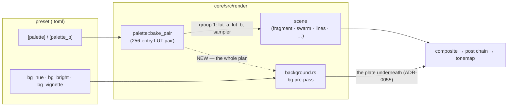

# Plan 0072 — The backdrop joins the palette

> **Status:** **in-progress 2026-08-08** — Phases 1 and 3 are `dev`;
> Phase 2 is `human` (a `preset-author` pass, landing directly per
> [ADR-0081](../adrs/0081-the-content-lane-lands-presets-and-architect-curates-the-set.md)).
> **ADR:** [0086](../adrs/0086-the-backdrop-colours-through-the-preset-palette.md)
> **Raised by:** [design-backlog 0059](../design-backlog.md#0059--the-backdrop-is-the-one-surface-left-that-does-not-colour-through-the-shared-palette-and-nothing-says-so)
> **Owner skill(s):** dev, human

## TL;DR

The background pass keeps a private copy of the iq cosine and binds no palette LUT, so `[palette]`,
`saturation` and `palette_mix` stop at the scene and never reach the sky. Delete the copy, give the
pass the same group-1 LUT bind group every other scene uses, re-tune the fifteen presets whose
declared palette now tints their backdrop, and write the backdrop into the colour docs — where it
has never appeared at all.

## Context & problem

Full argument in [ADR-0086](../adrs/0086-the-backdrop-colours-through-the-preset-palette.md). The
three facts that set the scope, all measured:

- **`background.rs:70` is the third copy of `d = (0.10, 0.42, 0.62)`** — the constant
  [ADR-0021](../adrs/0021-shared-palette-system.md) was written to de-duplicate. The pass binds one
  uniform and no textures.
- **26 of 37 shipped presets light a backdrop.** Eleven declare no `[palette]` and provably cannot
  move (the default gradient *is* that cosine, and the difference is sub-LSB — the arithmetic is in
  the ADR). Fifteen declare one and re-tint.
- **`docs/preset-palettes.md` does not contain the string `bg_hue`.** The document that owns the
  colour surface, and carries a twenty-row swatch table for the line scenes' ramp, has never
  mentioned the backdrop.

## Decision

Take ADR-0086: the backdrop samples the preset's baked LUT, `bg_hue` becomes a coordinate in that
gradient, and `saturation` / `palette_mix` reach it like everything else. Rejected alternatives —
a `bg_palette` source switch, a separate `[palette_bg]` table, joining halfway — are recorded there.

## Architecture diagram

## Implementation phases

### Phase 1 — The backdrop samples the LUT

- **Owner skill:** dev
- **What:** delete the inline `palette()` from `background.rs`'s WGSL and give the pass the group-1
  bind group the fragment field already defines (`lut_a`, `lut_b`, `lut_samp`), sampling at `bg_hue`
  and mixing A/B by `palette_mix`, then `desaturate` by `saturation`. `bg_hue` wraps rather than
  clamps, matching `color_center` / `hue_center`.
- **Files touched:** `core/src/render/background.rs`, whatever routes the baked palette to the
  scenes in `core/src/render/mod.rs`, and the two fixture baselines below.
- **Done when:**
  - No cosine constant remains in `background.rs`; `grep -n "0.42" core/src/render` no longer
    matches it.
  - A preset declaring **no** `[palette]` renders a backdrop unchanged **to within one 8-bit level**
    at `bg_bright = 0.55` — that is the ADR's arithmetic, and it is a property rather than a frozen
    number, so assert it as a bound and not as a measured constant. `lines_lit_backdrop` and
    `composite_kaleido` are the two golden fixtures in exactly that configuration and must pass
    **without re-blessing**.
  - A preset declaring a flat two-stop palette renders that colour as its backdrop, at every
    `bg_hue`. That is the positive proof the LUT is actually reached, and it needs no new fixture:
    `emitter_lit_backdrop` and `swarm_lit_backdrop` already declare `#ffcf80` at both stops.
  - Those two baselines are re-blessed and **only** those two.
- **Two hazards, both with precedent in this repo:**
  - **ADR-0058 / WARP.** The new bind-group layout is shape-identical to the fragment field's group
    1, which is the exact configuration where the DX12 WARP adapter hands a pass another pipeline's
    resources with no validation error while real hardware is correct. **Compare adapters before
    blessing** and record the comparison, per that ADR's evidence rule.
  - **`LMV_BLESS` is not scoped to the scene you are fixing.** It rewrites every baseline. Restore
    the unrelated ones before committing and check `git status` against the two files named above.

### Phase 2 — The fifteen re-tint

- **Owner skill:** human (a `preset-author` pass)
- **What:** walk the fifteen presets that declare a `[palette]` *and* light a backdrop, and choose
  `bg_hue` again — it is now a position in the preset's own gradient, so the old number is a
  different colour. The eleven default-palette presets are untouched by construction.
- **The fifteen:** `attractor_clifford`, `attractor_dejong`, `attractor_leviathan`,
  `attractor_lorenz`, `emitter_sparks`, `emitter_squall`, `reaction_coral`, `reaction_coral_bloom`,
  `reaction_coral_head`, `reaction_reef`, `spectrum_corona`, `spectrum_ridge`, `swarm_dense`,
  `swarm_drift`, `swarm_storm`. (Anchored greps: `grep -l '^bg_bright' presets/*.toml` intersected
  with `grep -l '^\[palette\]' presets/*.toml`.)
- **Done when:** each of the fifteen has been looked at in motion and either re-tuned or explicitly
  left, and the suite passes. **Leaving one is a real outcome** — several will improve untouched,
  because a backdrop drawn from the figure's own gradient is the coherence this change is for.
- **Note:** `bg_bright` across all fifteen is between 0.008 and 0.039 including the audio term, so
  this is a dim wash and the judgement is subtle. It pairs naturally with
  [backlog 0038](../design-backlog.md) (the tonemap knee retune) and
  [backlog 0040](../design-backlog.md) / [Plan 0071](0071-light-that-adds-without-covering.md),
  which are the other two retunes of the same set against a composite that moved underneath it —
  and 0040's whole question is *how bright a backdrop can get*, which is the same fifteen files.
  If Plan 0071 has landed, do them together.

### Phase 3 — The colour docs gain the backdrop

- **Owner skill:** dev
- **What:** `docs/preset-palettes.md` gains the backdrop in its "Bindable colour parameters" roster
  and its own short section; `presets/README.md`'s background-pass paragraph stops saying "the
  shared cosine palette" and says what is true after Phase 1.
- **Files touched:** [`docs/preset-palettes.md`](../preset-palettes.md),
  [`presets/README.md`](../../presets/README.md).
- **Done when:** an author reading the colour doc can tell (a) that `bg_hue` is a coordinate in the
  preset's gradient, cyclic, with the same wrap trap `color_center` documents; (b) that `saturation`
  and `palette_mix` move the backdrop too; and (c) that the swatch table already in that file —
  *the line scenes' cosine ramp* — is what `bg_hue` looks like **when the preset declares no
  palette**, since that is the same gradient. **Do not add a second swatch table.** Backlog 0014 is
  the precedent: an independently-measured colour table drifted from the one in the code and every
  name in it was wrong.
- **Note:** an interim version of (c) is being written *before* Phase 1, describing today's
  behaviour, because the gap misleads authors now. This phase replaces it rather than starting from
  nothing.

## Risks & open questions

- **The WARP aliasing hazard is the real risk in this plan**, not the arithmetic. The failure mode
  is a green suite over a wrong picture, and this repo has been bitten by it twice
  ([ADR-0058](../adrs/0058-bind-group-layout-collisions-carry-evidence.md)). If the comparison shows
  a divergence, that is a finding to report, not a baseline to bless.
- **Phase 2 may find that some `bg_hue` values were load-bearing against the cosine specifically** —
  a preset whose sky deliberately contrasted its figure. A preset that genuinely wants an unrelated
  sky is the `[palette_bg]` alternative ADR-0086 rejected on proportion; one instance is a note,
  three would be evidence worth a new entry.
- **The pass still does not run at `bg_bright <= 0`** and must keep that property — it is an NFR §1
  passthrough win *and* the reason a second fullscreen pipeline stays off the device during headless
  no-backdrop captures, which is itself a WARP mitigation.

## What this plan does NOT do

- **It does not touch `bg_bright` or `bg_vignette`.** Only the colour source moves. How bright a
  backdrop may be is [backlog 0040](../design-backlog.md) / Plan 0071's question.
- **It does not give the backdrop its own gradient.** Rejected in the ADR.
- **It does not move the backdrop in the chain.** [ADR-0055](../adrs/0055-backdrop-leaves-the-post-chain.md)
  put it under the post chain deliberately; nothing here disturbs that.
- **It does not re-tune the eleven default-palette presets.** They cannot move by more than a
  rounding of the final 8-bit write, and asking a content pass to look at them would waste the pass.
