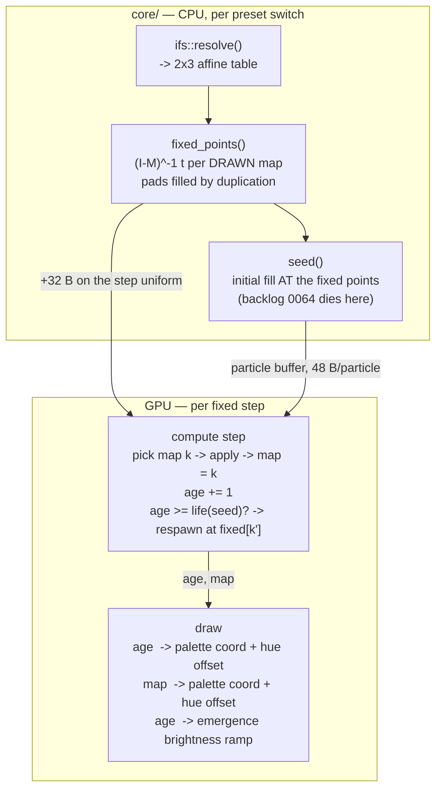

# 0073 — The fern unfurls and colours by what made it: age, last map, and the end of the startup rectangle

> **Status:** **in-progress 2026-08-06**. Phases 1-5 are `dev` and nothing gates them,
> so they run start-to-finish in one session; **Phase 6 is `human`** (a `preset-author` pass judging
> the two colour channels and the churn constants against real audio), so the plan does not close in
> that session.
> **Created:** 2026-08-05
> **Owner skill(s):** dev, human
> **Related ADRs:** [0087](../adrs/0087-the-ifs-particle-carries-its-age-and-its-last-map.md)

## TL;DR

`Particle` grows from 32 to 48 bytes and gains two channels: **how old the particle is** and **which
map last moved it**. The IFS family uses them for a continuous staggered respawn onto the drawn maps'
fixed points, and for two colour channels reaching the picture through a palette coordinate and a hue
offset each. First user-visible behaviour: `shot --preset-file presets/attractor_fern.toml` renders a
fern whose stem, body and two fronds are distinguishable colours. Last user-visible behaviour: the
**hard-edged rectangle that currently frames every switch into the family is gone**, not faded — the
particle population is never a uniform box at any moment.

## Context & problem

[Plan 0062](done/0062-the-chaos-game-grows-a-fern.md) landed the IFS family and deliberately left two
things out, on the stated grounds that they are the same per-particle channel and are better tuned
against a figure already known to be right. That figure now exists and ships two presets. Its content
pass then found a third item that turns out to share the mechanism.

- **The unfurl and the depth colour** — Plan 0062's own Followups, from the user's interview answers
  3 and 4.
- **Per-map tint** — deferred once already, because it needs a *second* per-particle channel.
- **[Backlog 0064](../design-backlog.md)** — the initial fill scatters particles over the figure's
  bounding box, so a switch into the family shows a legible, hard-edged, axis-aligned rectangle for
  roughly two thirds of a second, with the ~1 s preset dissolve landing entirely inside it. Verified
  by measurement at 2 / 6 / 12 / 24 / 40 / 90 frames. It is the same artifact class
  [ADR-0066](../adrs/0066-a-reseed-disturbs-the-cloud-rather-than-replacing-it.md) was written to
  remove from `reseed`, back on a different path, and it is **not authorable around** — nothing on
  the preset surface reaches the seed box.

The three want one thing: a particle that knows its age, knows which map last moved it, and restarts
somewhere legal. "Somewhere legal" has a closed form and only for this family —
[ADR-0075](../adrs/0075-ifs-family-morphs-in-singular-value-space.md)'s Notes prove any contractive
map's fixed point `(I − M)⁻¹ t` lies *on* the attractor. The blocker is that `Particle` has exactly
**one** free word (`pad`, written to `0.0` at seed and read by nothing), and the two channels are
independent: age is a continuous ramp that resets, last-map is a categorical value that changes every
step.

## Decision

We widen `Particle` to 48 bytes with `age` and `map` as separate fields, respawn continuously onto
the drawn maps' fixed points, and expose each colour channel through **both** a palette coordinate
and a hue offset. Continuous churn rather than a one-time unfurl is the load-bearing half: under a
one-time unfurl every age saturates in ~0.4 s and the colour channel is uniform thereafter, so the
expensive half of the work would be visible for one second per preset switch. Under churn the
population always holds every age, the gradient is permanent, and **the startup rectangle never forms
because there is no bulk fill at any moment.**

Rejected: packing both channels into the free word (aliasing with a convention nothing enforces),
deferring per-map tint a second time (the identical choice would recur with no new information), a
one-time unfurl (above), and respawning into the seed box (ADR-0066's artifact made permanent and
thin). Full reasoning in
[ADR-0087](../adrs/0087-the-ifs-particle-carries-its-age-and-its-last-map.md).

**IFS-only, and that is structural rather than a default.** The fixed point is a consequence of
ADR-0075's parameterization; De Jong, Clifford, Thomas and Lorenz have no closed-form on-attractor
point to restart at.

## Architecture diagram



## Implementation phases

### Phase 1 — the particle carries which map made it, and the fronds colour differently

- **Owner skill:** dev
- **What:** `Particle` grows to 48 bytes; the IFS arm of the step shader writes `map` each step; the
  draw shader turns it into colour through `map_tint` and `map_hue`. The walking skeleton: a visibly
  four-part fern before any respawn machinery exists.
- **Files touched:** `core/src/render/scenes/particles/mod.rs` (the Rust and WGSL `Particle`, the
  step shader's IFS arm, the draw shader, `PARAMS`, `set_param`, `reset_params`).
- **The layout, and why 48 and not 40:** WGSL rounds a struct to a multiple of its alignment, and
  `vec3<f32>` aligns to 16. `pos`+`seed` fill bytes 0-15 and `prev`+`pad` fill 16-31 — which is why
  the struct is 32 today. Adding two `f32` puts them at 32 and 36 and rounds the whole to **48**,
  leaving two words of tail padding. Name them; do not leave them implicit, because `bytemuck::Pod`
  forbids implicit padding and because **they are the budget for the next channel** and should read
  as such.
- **What `map` means, and it is the non-obvious part:** it is the index of the map applied on the
  **most recent** step, so it is a property of *position* rather than of history — it names which
  sub-copy `fₖ(A)` the particle currently sits in (stem, body, left frond, right frond). Written
  unconditionally in the IFS arm; left at its seeded `0.0` by every other family.
- **Done when:** `shot --preset-file presets/attractor_fern.toml` with `map_tint` bound renders a
  fern in which the stem, the body and the two fronds are distinguishable, and the two fronds differ
  from each other. `size_of::<Particle>() == 48` is asserted. **All seventeen golden baselines are
  byte-identical** — both new params default to `0.0`, so the colour path is the arithmetic identity,
  not a small change. A readback test asserts `map` takes every value `0..MAPS` across the buffer
  after one step on the fern, and is identically `0.0` on De Jong.

### Phase 2 — the fixed points, and the rectangle stops existing

- **Owner skill:** dev
- **What:** A CPU `fixed_points(&IfsTable) -> [[f32; 2]; MAPS]` in `ifs.rs`, and `seed()` using it for
  the IFS family's initial fill. This phase closes [backlog 0064](../design-backlog.md).
- **Files touched:** `core/src/render/scenes/particles/ifs.rs`,
  `core/src/render/scenes/particles/mod.rs` (`seed` only).
- **The closed form, not an iteration:** for `M = [[a, b], [c, d]]`, `(I − M)⁻¹` is
  `1/Δ · [[1 − d, b], [c, 1 − a]]` with `Δ = (1 − a)(1 − d) − bc`. **`Δ ≠ 0` follows from
  contractivity rather than being checked** — `Δ` is `det(I − M)`, which vanishes only if `M` has an
  eigenvalue of `1`, which `σ_max < 1` forbids. The magnitude is bounded the same way:
  `‖(I − M)⁻¹‖ ≤ 1/(1 − σ_max)`, at most `33.3` under ADR-0075's `0.97` ceiling.
- **Only drawn maps are targets.** A padded slot's fixed point is on the attractor only when the pad
  duplicates a drawn map — true of all five curated tables today, and exactly what stops being true
  when a sixth figure is added. `fixed_points` writes the `p > 0` maps' points into all four slots,
  duplicating as needed, so every consumer picks one of four unconditionally.
- **`seed_box` is NOT the thing that changes**, and this is the trap the backlog note names.
  `AttractorFamily::jitter_extent` (`particles/mod.rs:334`) is *derived* from `seed_box` as
  `JITTER_FRACTION` of its spread, so collapsing that spread would make **`reseed` silently inert on
  the whole family** — a lever ADR-0075 lists among the family's free wins. The change is to what
  `seed()` writes.
- **Done when:** for every figure, every `morph` in the 33-point sweep, and every lever extreme,
  every returned point is finite and **a zero-burn-in chaos run started there produces a bounding box
  agreeing with the burnt-in reference to within the `5 %` tolerance
  `the_chaos_reference_is_deterministic_and_measures_the_figure` already uses** for the curated
  `extent()` literals. **The test demonstrates its own sensitivity**: the same zero-burn-in run
  started from a corner of the old seed box must *fail* that bound, or it is asserting nothing.
  Visually: captures at 2 / 6 / 12 / 24 frames after a switch into `attractor_fern` show **no
  rectangle at any frame** — which is the measurement backlog 0064 was raised with, re-run.
  `attractor_ifs.png` is re-blessed here and **is the only baseline that moves**; a second moved
  baseline is a phase failure. Note the standing trap: `LMV_BLESS` rewrites **all** baselines —
  restore the other sixteen before committing.

### Phase 3 — the churn

- **Owner skill:** dev
- **What:** The four fixed points on the step uniform, a per-particle lifetime derived from `seed`,
  the `age` counter, and the respawn. Plus the emergence ramp that makes a respawn invisible.
- **Files touched:** `core/src/render/scenes/particles/mod.rs` (`StepUniform`, the step shader's IFS
  arm, the draw shader), `core/src/render/scenes/particles/ifs.rs` (packing).
- **The uniform grows from 160 to 192 bytes** — two `vec4` carrying four `(x, y)` fixed points,
  packed two per row exactly as `translate` already is. **The bind-group layout gains no binding**,
  so the collision surface [Plan 0053](0053-the-suite-stops-blessing-what-warp-gets-wrong.md) and
  [ADR-0058](../adrs/0058-bind-group-layout-collisions-carry-evidence.md) reason about does not
  change shape.
- **Why the emergence ramp is load-bearing rather than polish.** At the 150 000-particle ceiling a
  fixed rate lands on the order of a thousand particles per frame onto exactly **four points**, and
  the trail field integrates that into four bright dots. A brightness ramp from zero over a
  particle's first several steps means those points deposit almost nothing, and by the time a
  particle is bright it has been iterated enough to have spread. Without it the churn is four blobs;
  with it the churn is invisible, which is the whole intent.
- **Both constants are look constants with no principled value**, in the same position ADR-0075's
  `0.97` occupies. Starting points, with the acceptance being the look rather than the number: a
  lifetime near **180 steps** (3 s at the fixed step, so ~0.56 % of the buffer restarts per step) and
  a ramp near **8 steps** (0.13 s). Phase 6 judges both; if the churn reads as twinkle, **these
  constants are the lever and making the rate bindable is not**.
- **Done when:** the respawn is a pure function of the particle's fixed `seed` and the step index —
  two runs of the same preset at the same injected `dt` sequence produce identical buffers, asserted
  by readback. Every particle's position stays finite across a 10 000-step CPU reference at every
  morph and every lever extreme, respawns included. **And the property the phase exists for, asserted
  as a distribution rather than as a picture:** after 600 steps the readback buffer's `age` values
  span at least 90 % of `[0, lifetime]` and no decile is empty — a population holding every age is
  what makes Phase 4's gradient permanent, and a bulk respawn would leave the ages clustered and pass
  every other assertion here.

### Phase 4 — age becomes colour, by two routes

- **Owner skill:** dev
- **What:** `age_tint` and `age_hue` on the draw path, alongside Phase 1's `map_tint` and `map_hue`.
- **Files touched:** `core/src/render/scenes/particles/mod.rs` (draw shader, `PARAMS`, `set_param`,
  `reset_params`, and `projection_mirror`'s transcription if the colour maths lands there).
- **Two channels, two routes each, and the symmetry is the point.** A **palette coordinate** rides
  the preset's own `[palette]` gradient, so `palette_mix` and `saturation` reach it for free and a
  custom ramp works — the direction [ADR-0021](../adrs/0021-shared-palette-system.md) through
  [ADR-0086](../adrs/0086-the-backdrop-colours-through-the-preset-palette.md) has been converging on.
  A **hue offset** shifts hue directly, matching the `depth_hue` lever authors already know on the
  3-D families. Both, because the user chose both at interview: the gradient route is right for a
  figure whose colour should be the author's, and the offset route is right for a preset that wants
  the fronds nudged off the body without touching its ramp.
- **Done when:** all four params default to `0.0` and every baseline except Phase 2's re-blessed one
  is byte-identical — asserted, because "the default is the identity" is a claim about arithmetic,
  not a hope. Two captures of `attractor_fern` differing only in `age_tint` have **measurably
  different colour distributions in the lit region** while their **lit extents match**, which is what
  distinguishes a colour lever from a geometry lever. The same for `map_tint`. `age_hue` and
  `map_hue` move hue and leave the palette coordinate alone, asserted on the transcribed CPU maths
  rather than on pixels.

### Phase 5 — the fixture, and the doc sweep

- **Owner skill:** dev
- **What:** Extend the IFS golden fixture to bind the four new params, and update every operator doc
  this plan moved.
- **Files touched:** `core/tests/fixtures/attractor_ifs.toml` + its baseline, `presets/README.md`.
- **Docs the sweep owes** — `presets/README.md` is load-bearing for the `preset-author` lane, which
  keeps no catalogue of its own. The attractor param roster gains `age_tint`, `age_hue`, `map_tint`,
  `map_hue`, **marked IFS-only** alongside `morph`/`curl`/`vigor`/`lean`/`bias`. The IFS section
  gains a paragraph on what the two channels *are* — age is distance-from-the-fixed-points in
  disguise, `map` names which part of the figure a point belongs to — because neither is guessable
  from the name. **`docs/presets.md` is not touched:** no expression-grammar variable, function or
  operator changes. ~~While in `presets/README.md`, close the Plan 0062 review minor: the `morph`
  table row still reads "every value between is a real figure" some forty lines above its own
  correction, and wants a clause pointing down to it.~~ **Already done 2026-08-05** — the row now
  carries the clause and an anchor to the correction; nothing owed here.
- **Done when:** the fixture binds all four params at non-default values and its baseline is
  re-blessed; the other sixteen are verified untouched. The fixture's sensitivity is
  **demonstrated, not assumed** — each of the four params neutralized in turn and the capture
  re-measured against the baseline, with the numbers recorded in the fixture's header comment, the
  way `attractor_ifs.toml` already does for the Plan 0062 levers.

### Phase 6 — judge the churn and the colour in motion

- **Owner skill:** human
- **What:** A `preset-author` content pass over the two channels and the two constants, live against
  real audio.
- **Questions it answers, and they are the ones no capture can:** does the churn read as life, or as
  twinkle? Is the 180-step lifetime the right order — does 3 s of age gradient read, or does it want
  10? Does the emergence ramp fully hide the four fixed points, or do they still register as hot
  spots under a long `fade`? Which of the two routes does an author actually reach for, and does
  shipping both cause the confusion the interview flagged as its risk? And the one that decides
  whether this plan delivered: **does the age gradient survive the morph** — `attractor_dissolve`
  travels the whole range, and the fixed points move as it does.
- **Done when:** the two shipped IFS presets are retuned against the new channels, and any channel or
  route that could not be made to read is written up in `docs/design-backlog.md` rather than quietly
  left bound to nothing. If **both** colour routes read and neither is redundant, say so explicitly —
  the interview accepted a documented risk here and the content pass is what settles it.

## Data shapes

```rust
// illustrative — not the final interface

/// 48 bytes. Two words of tail padding are the budget for the next channel.
#[repr(C)]
struct Particle {
    pos: [f32; 3],
    seed: f32,
    prev: [f32; 3],
    /// Steps since this particle last respawned. Reset to 0 there.
    age: f32,
    /// Index of the map applied on the MOST RECENT step — a property of
    /// position, not of history. `0.0` on every non-IFS family.
    map: f32,
    _pad: [f32; 2],
}

/// `(I - M)^-1 t` per map, drawn maps duplicated into the padded slots so the
/// shader picks one of four with no branch. Finite by contractivity, not by a
/// check: `det(I - M) = 0` requires an eigenvalue of 1, which `sigma_max < 1`
/// forbids.
fn fixed_points(table: &IfsTable) -> [[f32; 2]; MAPS];
```

## Risks & open questions

- **Growing the particle buffer is an allocation change, and this repo has been burned by those on
  WARP twice.** Both `WARP allocation shifts trails` and `WARP aliases identical bind layouts` are
  recorded hazards, and the golden suite runs on the software adapter in CI. The buffer is built at
  scene build rather than mid-run, so the documented failure mode should not apply — but Phase 1's
  "all seventeen byte-identical" is the assertion that finds out, and if it fails on WARP while
  passing on hardware, **compare adapters before blessing anything.**
- **`attractor_ifs.png` moves twice if the phases are taken literally** — once in Phase 2 (the seed)
  and once in Phase 5 (the fixture binds new params). That is expected and is two deliberate
  re-blesses of one file, not drift. Any *other* baseline moving, at any phase, is a defect.
- **The emergence ramp interacts with `fade`.** A preset with a long trail integrates the four fixed
  points over more frames, so the ramp that suffices at `fade = 0.86` may not at `0.94`. Phase 6 has
  both shipped presets at different `fade` values, which is the cheapest available test of it.
- **Four params is a lot on a roster that just took five**, and two of them are two routes to the
  same channel. The interview accepted this knowingly; Phase 6's last done-when is what converts it
  from an assumption into a finding.
- **The rate is not bindable, deliberately.** A preset cannot make the churn an instrument — a beat
  cannot restart a burst. It was declined at interview to keep one look decision out of the content
  pass. If Phase 6 wants it, that is a follow-up plan and a small one; do not add it mid-plan.
- **`age` is a step count, not seconds.** That is what makes it deterministic (the step index is a
  pure function of accumulated injected `dt`, which captures pin at 1/60 s), and it means the visible
  age gradient is frame-rate-independent for the same reason ADR-0075's map choice is. Do not
  "improve" it into a wall-clock age.

## What this plan does NOT do

- **No respawn on the four map families.** They have no closed-form on-attractor point, and
  respawning them into their seed box is ADR-0066's artifact per particle and forever. The channels
  exist on their particles because the struct is shared; nothing writes or reads them there.
- **No bindable churn rate.** See Risks — declined at interview, and a follow-up if Phase 6 asks.
- **No third per-particle channel.** Two words remain free by design; spending them is a later
  decision with its own reason.
- **No change to `AttractorFamily::seed_box` or `jitter_extent`.** The `reseed` kick keeps its
  current magnitude and meaning; this plan changes only what the *initial fill* writes.
- **No C ABI change, no `Scene` trait change, no new dependency, no new render idiom.**
- **It does not close the Plan 0062 review minor about `IfsFigure::frame()`** being unreachable but
  documented as live. That is a two-line comment fix in `ifs.rs` and belongs to whoever next opens
  that file with a reason; naming it here so it is not lost.

## Followups (after this lands)

- The bindable churn rate, if Phase 6 asks for it.
- Whether the two colour routes should be one, decided by which one the content pass actually used.
