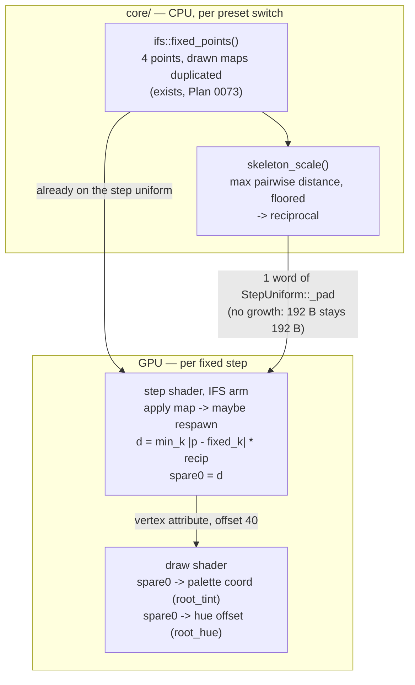

# 0074 — The figure colours by how far it has come: distance from the skeleton, and the age channel retires

> **Status:** **approved 2026-08-06** — ready for `dev`, gated by nothing.
> **Phase 2 is `human` and it is a GATE**, deliberately placed after one `dev` phase rather than at
> the end. Phase 6 is `human` and terminal. So this plan does not close in one session, and it can
> legitimately stop after Phase 2. **A `dev` session lands Phase 1 and then stops** — do not
> continue past the gate on the assumption that the channel reads.
> **Created:** 2026-08-06
> **Owner skill(s):** dev, human
> **Related ADRs:** [0088](../adrs/0088-the-ifs-colours-by-distance-from-its-own-skeleton.md);
> supplements [0087](../adrs/0087-the-ifs-particle-carries-its-age-and-its-last-map.md), whose age
> channel this replaces rather than repairs

## TL;DR

Each IFS particle gains a third channel: **how far it is from the nearest of the drawn maps' fixed
points**, normalised against the diameter of the fixed-point set, computed in the step shader and
stored in one of the two spare `Particle` words. It reaches the picture as `root_tint` and
`root_hue`, and **`age_tint` / `age_hue` retire in the same plan** so the roster does not grow.
First user-visible behaviour: `shot --preset-file presets/attractor_fern.toml` with `root_tint`
bound renders a fern that is dark at the stem base and the frond origins and bright at the tips — a
continuous gradient, permanent, which is what
[ADR-0087](../adrs/0087-the-ifs-particle-carries-its-age-and-its-last-map.md) promised and did not
deliver.

## Context & problem

Plan 0073 shipped two colour channels. `map` works and is bound in both shipped IFS presets. `age`
does not read: it renders as per-particle speckle with no gradient anywhere, measured in the most
favourable configuration the preset surface can build and swept across the whole morph range.
[design-backlog 0074](../design-backlog.md) has the full write-up; ADR-0087's Outcome section has
the short version.

The cause is structural, and it is ADR-0087 arguing with itself: age is a proxy for
distance-from-the-fixed-points, the proxy decays after ~10 steps (the family contracts by `0.742`
per step), and the first 8 steps — where the proxy is good — are exactly what the emergence ramp
deliberately hides. Lengthening the lifetime cannot help, because the problem is spatial rather than
temporal.

**The idea was right and the proxy was wrong.** Distance from the figure's contraction points is
real structure, it is permanent, and nothing else in this family exposes it. The points are already
computed, already correct, and already uploaded — they are just on the *step* uniform rather than the
draw uniform, so the colour path cannot reach them.

## Decision

Compute the distance in the step shader, where the points already live, and store it in a spare
`Particle` word. Expose it by the two routes ADR-0087 established. Retire the two params it
replaces. Normalise by the **diameter of the fixed-point set** rather than by a sampled bounding box.
Full reasoning, and five rejected alternatives, in
[ADR-0088](../adrs/0088-the-ifs-colours-by-distance-from-its-own-skeleton.md).

**Naming: `root_tint` / `root_hue`, and `depth_*` was not available.** `depth_fade` and `depth_hue`
are shipped params — the 3-D depth cues from [Plan 0063](done/0063-the-attractor-keeps-its-depth.md) — so the
obvious name collides with something live. The fixed points are where each sub-copy converges, which
on the fern is the stem base and the frond origins, so "root" is both free and apt.

**What is different from Plan 0073, and it is the whole bet.** The age channel was a *proxy* for
position and decayed. This channel is a *pure function of position*, recomputed every step from
where the particle currently is. A particle five hundred steps old sitting near a fixed point reads
a distance near zero, exactly as a freshly restarted one does — so the emergence ramp dims only the
small fraction that has just respawned, and the neighbourhood of each fixed point is otherwise
occupied by old, bright particles.

**That last sentence is a claim of the same kind ADR-0087 got wrong, so this plan gates on it after
one phase instead of at the end.** Phase 2 is a `human` look at a rendered sample set across all
five figures, and "it does not read" is a legitimate outcome that stops the plan with the retirement
half shipped.

## Architecture diagram



## Implementation phases

### Phase 1 — the channel exists and the fern has a gradient

- **Owner skill:** dev
- **What:** `skeleton_scale()` on the CPU, the reciprocal onto the step uniform, the distance written
  to `spare0` in the step shader's IFS arm, and `root_tint` on the draw path. The walking skeleton:
  a visibly graded fern before the second route, the retirement or the docs exist.
- **Files touched:** `core/src/render/scenes/particles/ifs.rs` (`skeleton_scale`, `IfsPacked`),
  `core/src/render/scenes/particles/mod.rs` (`StepUniform`, step shader, draw shader,
  `PARTICLE_ATTRIBUTES`, `PARAMS`, `set_param`, `reset_params`, `DrawUniform`).
- **The normaliser, and why it is not a bounding box.** `skeleton_scale` returns
  `max over drawn j, k of ‖p_j − p_k‖` — at most six pairwise distances. Closed form, exact,
  deterministic, and a continuous function of the fixed points, so it moves as smoothly across the
  morph as they do. **Do not reach for `chaos_extent`**: it returns a bounding box, which is a
  supremum statistic, and ADR-0087's Notes already record that two runs' boxes disagree by `0.046` at
  20 k iterations and `0.143` at 100 k — *growing*. Normalising a colour coordinate by that would
  make the gradient's scale wobble by an amount nobody chose, and cost a Monte Carlo per switch.
- **The floor is required, not defensive.** Two drawn maps' fixed points can approach each other as
  the morph interpolates, and a diameter of zero gives a divergent reciprocal. Floor the diameter;
  the done-when measures how close the sweep actually gets.
- **The uniform does not grow.** `StepUniform::_pad` is `[u32; 3]`, three explicitly named padding
  words the scalar block's alignment already paid for. The reciprocal takes one and leaves two, so
  the struct stays **192 bytes** and `the_step_uniform_carries_the_ifs_table_in_one_binding` keeps
  asserting that number unchanged. No binding is added, so ADR-0058's collision surface is untouched.
- **`spare0` is at byte offset 40**, and `PARTICLE_ATTRIBUTES` must be extended by hand with that
  offset spelled out. **Do not reach for `vertex_attr_array!`** — it lays attributes out
  consecutively, which is the trap Plan 0073 documented and this is the first phase since to add an
  attribute. `the_particle_layout_carries_two_channels` is the test that holds the offsets to the
  struct; extend it rather than writing a new one.
- **Store normalised, clamp at the read.** Values above `1` are legitimate — the skeleton's diameter
  is not an upper bound on the attractor's reach — so the stored value stays a faithful measurement
  and the draw clamps.
- **Done when**, in three claims:

  **1. The normaliser is bounded away from its floor, measured rather than assumed.** Over every
  figure pair, every `morph` in the existing 33-point sweep and both `Levers::EXTREMES`, the
  fixed-point diameter is computed and its **minimum over the whole sweep is asserted above the
  floor**, with the observed minimum and the figure pair and morph it occurred at printed. This is
  the assertion that finds out whether the floor is doing nothing (good) or is load-bearing (which
  would mean the channel degenerates somewhere in the morph and Phase 2 should be told where to
  look). No tolerance to tune: the two numbers are the measurement and the constant.

  **2. The distance is what it claims to be**, asserted on a CPU transcription rather than on
  pixels. For a sample of positions on each figure, the mirrored `min_k ‖p − p_k‖ · recip` agrees
  with a directly computed nearest-distance to within `f32` rounding, and is **exactly `0`** at each
  fixed point itself. The `projection_mirror` discipline: the WGSL is the source, the Rust is the
  mirror, and a constants-agree test holds the shader's literals to the Rust ones the way
  `the_churn_constants_agree_between_rust_and_wgsl` already does.

  **3. The population occupies the whole range, which is the property the channel exists for.**
  After 600 steps the readback buffer's `spare0` values span at least 90 % of `[0, 1]` and **no
  decile is empty** — the direct analogue of Plan 0073's age-decile test, on the quantity that
  actually matters. *This is the cheap early warning for the exact failure that plan hit:* a channel
  whose population clusters cannot show a gradient, and this catches that before a human looks.
  It does **not** establish that the gradient is *visible* — that is Phase 2's job, and no readback
  can do it.

- **Not a done-when, because it cannot be one:** "the fern reads as graded". Phase 2 owns that.
- **Baselines:** all seventeen stay byte-identical. `root_tint` defaults to `0` and the palette
  coordinate takes an exact `+0`, so the colour path is the arithmetic identity. Note the standing
  trap — `LMV_BLESS` rewrites *all* baselines even on a pristine HEAD, so a green golden run means
  *within tolerance*, never byte-identical; assert this from a `git diff` of `core/tests/golden/`,
  not from a green suite.

### Phase 2 — does it read? The gate

- **Owner skill:** human
- **What:** A `preset-author` pass over a rendered sample set, deciding whether the gradient is
  actually visible before three more `dev` phases are spent on it.
- **Why this is mid-plan and not terminal, in one sentence:** Plan 0073 spent five `dev` phases
  building a channel that turned out not to read, and found out in its terminal `human` phase — this
  plan pays one phase to ask the same question first.
- **What `dev` leaves for it:** a sample grid rendered by `shot`, **all five figures** at
  `root_tint` off / mid / high, plus `sierpinski -> fern` swept across `morph` at 0 / 0.25 / 0.5 /
  0.75 / 1.0. Rendered bare — no backdrop, no bloom — and also once at a long `fade`, because the
  trail is what a real preset has.
- **All five figures, not just the fern, and that is deliberate.** ADR-0088's Notes name the one
  thing its argument cannot prove: the gradient's survival rests on the invariant measure having
  *support* near each fixed point, which is a theorem, but says nothing about **density**. A figure
  whose measure is thin near one of its fixed points will show that region as sparse rather than as
  coloured. That is per-figure and not provable in general, so it is looked at per figure.
- **Questions it answers, and they are the ones no capture can:** is there a gradient at all, or is
  this speckle again? Does it read as *depth into the figure* or as an arbitrary radial wash? Does
  it survive the morph, where the fixed points move? Does it survive a long `fade`, where the trail
  averages neighbouring particles of different distances? And does it fight `map_tint`, which is
  bound in both shipped presets and writes the same palette coordinate?
- **Done when:** a verdict is recorded in this plan, in one of three shapes.
  - **It reads** → Phases 3-6 proceed as written.
  - **It reads on some figures and not others** → Phases 3-6 proceed, and the figures where it does
    not are named in `presets/README.md` rather than left for an author to discover.
  - **It does not read** → **the plan stops here, and that is a successful outcome, not a failure.**
    Phase 3's retirement half ships on its own (that is
    [backlog 0074](../design-backlog.md)'s route 3), the rest is reverted, ADR-0088 is closed
    `rejected` with the measurement that rejected it, and the two spare words go back in the budget.
    Do not rescue the channel by tuning; the whole point of gating here is that the honest answer is
    cheap at this phase and expensive at Phase 6.

### Phase 3 — the second route, and the age channel retires

- **Owner skill:** dev
- **What:** `root_hue` alongside `root_tint`, and the removal of `age_tint` / `age_hue`.
- **Files touched:** `core/src/render/scenes/particles/mod.rs` (draw shader, `PARAMS`, `set_param`,
  `reset_params`, `DrawUniform`, `UniformInputs`, `projection_mirror`).
- **The `ch` row swaps rather than grows.** It is `(map_tint, map_hue, age_tint, age_hue)` today and
  becomes `(map_tint, map_hue, root_tint, root_hue)`. The draw uniform does not change size, and the
  engine keeps zeroing the whole row off the IFS — which is what makes all four exactly inert on the
  four map families rather than merely defaulted (the gap Plan 0073 Phase 4 closed; do not reopen it).
- **`Particle::age` stays.** It drives the emergence ramp, which is load-bearing. Only the two
  params that read it for colour go. Leaving `age` unused-for-colour but live-for-brightness is the
  correct end state, and the field's doc comment should say so, because a future reader will
  otherwise take it for dead weight.
- **Done when:** `root_hue` moves hue and leaves the palette coordinate alone, asserted on the
  transcribed CPU maths rather than on pixels — the claim is not expressible in a capture, since a
  capture cannot separate "sampled the ramp elsewhere" from "rotated the colour the ramp returned".
  `shift_hue`'s exact-zero early return is preserved and re-asserted on bits. `set_param("age_tint",
  …)` no longer resolves, and **no shipped preset or fixture binds either retired name** — grepped,
  not assumed. All seventeen baselines byte-identical except the fixture's, which Phase 5 re-blesses.

### Phase 4 — the emergence ramp becomes authorable

- **Owner skill:** dev
- **What:** `emergence`, a param on the ramp length `EMERGENCE_STEPS` currently fixes at 8.
- **Files touched:** `core/src/render/scenes/particles/mod.rs`.
- **On its own merits, and explicitly not as the age channel's rescue.** ADR-0087's Risks flagged
  that a ramp sufficient at `fade = 0.86` may not be at `0.94`, because a longer trail integrates
  the four restart points over more frames. That reason is independent of any colour channel and
  survives this plan; the *other* reason to expose it — letting the age gradient show — is exactly
  what Phases 1-3 make obsolete. Ship it for the first reason only, and say so in the roster.
- **The guard is arithmetic, not taste.** `em.x` is `1 / emergence`, so a zero or negative binding
  divides or inverts the ramp. Clamp at the pack site, the way `perspective` is clamped silently
  (`MAX_PERSPECTIVE`), and pin the clamped range in a test — a smoothing curve can sweep a param
  through values its own maths does not accept, which this repo has already been bitten by.
- **Done when:** the default reproduces the current constant **exactly** — `emergence = 8` is
  bit-identical to today, asserted, so every baseline holds. A binding of `0`, a negative, and a
  non-finite each clamp rather than producing a division artifact, asserted at the pack site. The
  units are steps and the roster says so, with the seconds equivalence at `FIXED_STEP` spelled out
  because authors think in time.

### Phase 5 — the fixture, and the doc sweep

- **Owner skill:** dev
- **What:** Rebind the IFS golden fixture to the new channels, and sweep every operator doc this
  plan moved.
- **Files touched:** `core/tests/fixtures/attractor_ifs.toml` + its baseline, `presets/README.md`,
  `docs/preset-palettes.md`, `docs/design-backlog.md`.
- **Docs the sweep owes, and `preset-palettes.md` is on the list this time.** Plan 0073's Phase 5
  named only `presets/README.md` and its close had to repair `docs/preset-palettes.md` afterwards,
  because that file carries the attractor's palette-coordinate formula and `root_tint` is a **fourth
  term** in it. Both files, both directions:
  - `presets/README.md` — the roster row (`age_tint`/`age_hue` out, `root_tint`/`root_hue`/
    `emergence` in), the IFS-only warning, and the "Colouring by what made a point" section, whose
    `age` bullet and warning box both describe a channel that no longer exists.
  - `docs/preset-palettes.md` — the three-term coordinate expression added at Plan 0073's close
    becomes a three-term expression again with a different third term. The `map_tint`-competes-with-
    `hue_spread` warning still stands and now applies to `root_tint` too.
  - `docs/design-backlog.md` — **strike entry 0074 through** with a pointer to this plan and
    ADR-0088. It is the architect inbox; an entry that has been built and not struck reads as open.
  - **`docs/presets.md` is not touched:** no expression-grammar variable, function or operator changes.
- **Done when:** the fixture binds `root_tint`, `root_hue` and `emergence` at non-default values and
  its baseline is re-blessed; the other sixteen are verified untouched **by `git diff`**, not by a
  green suite. The fixture's sensitivity is **demonstrated, not assumed** — each new param
  neutralized in turn and the capture re-measured against the baseline, with the numbers recorded in
  the header comment the way that file already does. Note that the previous table was re-measured in
  full at Plan 0073 Phase 5 for exactly this reason: the baseline had moved under it.

### Phase 6 — the content pass

- **Owner skill:** human
- **What:** A `preset-author` pass binding the new channel in the two shipped IFS presets, live
  against real audio.
- **Questions it answers:** does `root_tint` earn a binding on `attractor_fern`, given `map_tint`
  already writes that coordinate and `hue_spread` had to come down to 0.05..0.125 to make room for
  it? Does `attractor_dissolve` want it across the morph, where the fixed points travel? Is
  `root_hue` the better route on a narrow palette, as the two-route theory predicts? And does
  `emergence` want to move on the longer-`fade` of the two presets?
- **Done when:** both shipped IFS presets are retuned, and any route that could not be made to read
  is written up in `docs/design-backlog.md` rather than quietly left bound to nothing. If the
  three-way competition for the palette coordinate (`hue_spread`, `map_tint`, `root_tint`) turns out
  to be one channel too many, **say so** — that is a finding, and it is the one this plan's shape
  most plausibly gets wrong.

## Data shapes

```rust
// illustrative — not the final interface

/// The diameter of the fixed-point set: `max over drawn j, k of ‖p_j − p_k‖`.
/// Closed form, at most six distances, continuous in the table. Floored,
/// because two drawn maps' fixed points can approach each other across a morph
/// and the reciprocal would diverge.
fn skeleton_scale(table: &IfsTable) -> f32;

/// 48 bytes, unchanged. One spare word is spent; one remains.
#[repr(C)]
struct Particle {
    pos: [f32; 3],
    seed: f32,
    prev: [f32; 3],
    _pad: f32,
    age: f32,          // still drives the emergence ramp; no longer drives colour
    map: f32,
    /// Normalised distance to the nearest drawn fixed point (ADR-0088).
    /// Offset 40. May exceed 1; clamped at the read, not at the write.
    root: f32,
    _spare: f32,       // the last one
}
```

## Risks & open questions

- **The central claim is the one its predecessor's twin got wrong.** ADR-0088 argues the gradient
  survives because the channel is a property of position rather than a proxy for it. That reasoning
  is different in kind from ADR-0087's, but ADR-0087's also sounded right. **This is why Phase 2 is
  a gate and not a review**, and why "it does not read" is written into the plan as a successful
  outcome with a defined shape.
- **Support is not density.** The gradient rests on the invariant measure having mass near each
  fixed point. Membership is a theorem; density is not, and is per-figure. A figure thin near one of
  its points shows that region sparse rather than coloured. Phase 2 looks at all five figures for
  this reason and nothing else would catch it.
- **Three channels now compete for one palette coordinate.** `hue_spread` (per particle),
  `map_tint` (per part) and `root_tint` (per distance) all write it. Plan 0073 already had to drop
  `attractor_fern`'s `hue_spread` from `0.16..0.42` to `0.05..0.125` to let `map_tint` read. There
  may not be room for a third. `root_hue` is the escape — it does not touch that coordinate — and
  Phase 6's done-when is what converts this from an assumption into a finding.
- **The floor could be load-bearing rather than defensive.** If Phase 1's claim 1 finds the minimum
  diameter close to the floor, the channel degenerates somewhere in the morph and Phase 2 must be
  told exactly where to look. That is why the assertion prints the figure pair and morph rather than
  just passing.
- **`attractor_ifs.png` moves twice if the phases are taken literally** — once when Phase 3 retires
  the two params the fixture binds, once when Phase 5 rebinds it. That is two deliberate re-blesses
  of one file. Any *other* baseline moving, at any phase, is a defect.
- **One spare word remains after this.** The next per-particle channel is a struct change to a type
  four families share. Alternative A in ADR-0088 (two-step map history) is the obvious claimant and
  is deliberately not taken here.

## What this plan does NOT do

- **No respawn or channel on the four map families.** They have no closed-form on-attractor point,
  so they have no skeleton to measure distance from. The word exists on their particles because the
  struct is shared; nothing writes or reads it there.
- **No two-step map history.** ADR-0088 Alternative A — a good idea, rejected here for being a
  second *categorical* channel where the gap is a continuous one. It could use the last spare word,
  as its own plan.
- **No change to `EMERGENCE_STEPS`' default,** only to whether it can be bound. `emergence = 8` is
  asserted bit-identical to today.
- **No bindable churn rate.** Still declined, still Plan 0073's open followup, still a separate plan
  if anyone asks.
- **No new normaliser for the four map families,** no `chaos_extent` change, no fit change.
- **No C ABI change, no `Scene` trait change, no new dependency, no new render idiom.**
- **It does not close the Plan 0062 review minor about `IfsFigure::frame()`** being unreachable but
  documented as live. Named again so it is not lost; it is a two-line comment fix for whoever next
  opens `ifs.rs` with a reason — which, for once, is this plan's Phase 1.

## Followups (after this lands)

- Two-step map history on the last spare word, if the finer partition is wanted.
- The bindable churn rate, still unclaimed since Plan 0073.
- Whether three channels on one palette coordinate is one too many, decided by Phase 6.
