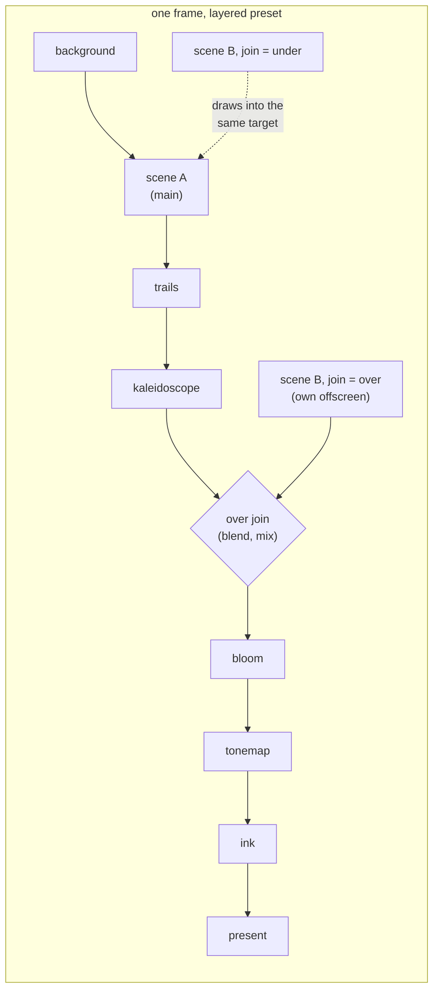

# 0076 — The second layer: a preset composes two scenes (R3)

> **Status:** **in-progress** (implementation started 2026-08-11; approved 2026-08-09) — the four open design choices were decided by the user
> in the Mode 1 interview the same day ([ADR-0090](../adrs/0090-a-preset-composes-two-scene-layers.md)
> records them, including the one taken against the architect's recommendation).
> **Created:** 2026-08-09
> **Owner skill(s):** dev, human
> **Related ADRs:** [0090](../adrs/0090-a-preset-composes-two-scene-layers.md) (the decision),
> building on [0046](../adrs/0046-linear-light-hdr-composite-bloom-tonemap.md),
> [0024](../adrs/0024-cross-preset-transitions.md),
> [0031](../adrs/0031-post-stage-trait-instantiable-composite-chain.md),
> [0056](../adrs/0056-additive-scenes-emit-premultiplied-alpha.md)
> **Serves:** [roadmap-visual-richness R3](../roadmap-visual-richness.md); feeds
> [Plan 0075](0075-the-content-renaissance.md)'s cohorts (soft ordering: 0075's brief should
> know whether layering exists, but 0075 does not hard-gate on this plan — its own text says so)

## TL;DR

A preset gains an optional `[layer]` table: a second scene with full params and bindings,
joined to the composite either **`under`** (shares trails/fold/bloom with the main scene —
one substance) or **`over`** (crisp above the processed frame, blended in linear light
between the kaleidoscope and bloom with `add`/`screen`/`multiply`/`overlay` and a bindable
`mix`). Layer scenes are **constructed per preset, not borrowed from the one-instance-per-
system roster**, so same-system pairs are legal. Both tiers render both layers. Presets that
declare no layer are byte-identical.

## Context & problem

Wrong turn 4 of the visual-richness review: one scene per preset, one fixed chain, so the
layered-collage reference look is unreachable. The evidence that this is affordable is
already in-tree — the dissolve runs two full composites with independent `PostChain`s
(Plan 0030 proved it with a test). ADR-0090 takes the render-graph question off the table
(the rejections stand; this is one junction with two positions) and settles the four open
choices. What remains is execution, and the one genuinely new engine problem in it: **the
scene registry's one-instance-per-system assumption**, which same-system layering ends.

## Decision

Implement ADR-0090 in five phases: schema and the `under` join first as a walking skeleton on
different-system pairs (the roster's existing instances make that free), the registry
migration second, the `over` join and blend third, the transition/tier/instrument
interactions fourth, and a judged sample set plus the operator-doc sweep last.

## Architecture diagram

A preset uses one join or the other; both are drawn to show the two positions. The chain
order is unchanged and compile-time (ADR-0031); the `over` junction is known to the chain
walk, not a reorderable stage.

## Implementation phases

### Phase 1 — the walking skeleton: `[layer]` parses, validates, and joins `under`

- **Owner skill:** dev
- **Area:** core
- **What:** the `[layer]` table lands in the schema — `system`, params, bindings,
  `[layer.smoothing]`, `join` (default `under`), `blend` + `mix` (parsed now, used in
  Phase 3) — with load-time validation and warnings in the existing shape (an unknown layer
  param warns like a top-level one; `blend` on an `under` join warns as ignored). The `under`
  path renders: the layer scene draws into the scene target after the main scene, through the
  shared `ViewTransform`, using the **roster's existing instance** — which means Phase 1
  supports **different-system pairs only** and says so in a validation error that Phase 2
  deletes. Layer params route to the layer's own namespace, never into the main scene's
  first-owner-wins routing.
- **Files touched:** `core/src/preset/schema.rs`, `core/src/render/mod.rs` (the frame walk),
  the param-routing seam.
- **Done when:** a fixture preset declaring `fragment_field` + `[layer] system = "swarm"`
  renders both, visibly and deterministically, in a capture; a preset with no `[layer]` takes
  the exact code path it took before (no new pass, no new target — verified by draw-call
  count, which the diagnostics already report); the same-system fixture fails at load with
  the Phase 1 error; layer bindings react to the analysis frame like top-level ones.

### Phase 2 — per-layer scene instances: the registry migration

- **Owner skill:** dev
- **Area:** core
- **What:** ADR-0090's point 4, the user's explicit call. A layer's scene is constructed for
  the preset rather than resolved from the prebuilt singleton roster, so same-system pairs
  become legal and the Phase 1 validation error is deleted. The stateful families duplicate
  their GPU state per instance (a second RD ping-pong field, a second particle buffer); the
  line families' shared `LineRenderer` idiom is the delicate one — whether the renderer is
  shareable between two live line-scene instances or must be duplicated is discovered here,
  and the answer is **recorded in the module doc** either way.
- **Files touched:** the scene registry/roster in `core/src/render/`, stateful scene
  constructors.
- **Done when:** a fixture declaring two instances of the **same** system (two fragment
  fields at different zooms) renders two visibly independent configurations; the two
  instances share no mutable state (the property: driving one layer's params moves only that
  layer's picture); the memory cost of a layered stateful pair is measured and stated in the
  commit (as a measurement on this box, ADR-0071's shape — not asserted as a universal);
  scene teardown/rebuild on preset switch leaks nothing across switches (the existing
  resize/rebuild instruments cover this — cite which).

### Phase 3 — the `over` join and the linear-light blend

- **Owner skill:** dev
- **Area:** core
- **What:** the `over` path: the layer renders into its own offscreen, and a blend pass
  joins it to the chain **between the kaleidoscope and bloom** — exempt from the resampling
  stages, participating in the luminous ones, in linear light before the tonemap
  (ADR-0046's ordering). Modes `add`, `screen`, `multiply`, `overlay`, fixed at load;
  `mix` bindable per frame. The blend operates within the layer's premultiplied-alpha
  footprint (ADR-0056), so a darkening mode darkens only where the layer has coverage. The
  routing decision (which target feeds what) stays a **pure function over the active flags**,
  extending the one ADR-0031 made unit-testable — the new junction gets the same GPU-free
  test treatment.
- **Files touched:** `core/src/render/post.rs` (the chain walk), a new blend pass module, the
  pure routing function and its tests.
- **Done when:** the four modes render visibly distinct results on one fixture pair (a
  filmstrip capture, judged in Phase 5); `mix = 0` is pixel-identical to the layerless main
  scene (the property that the junction is truly skippable); the routing function's unit
  tests cover both joins times active/inactive stages without a GPU; an `under` preset's
  pixels are untouched by this phase (its baseline from Phase 1 stands).

### Phase 4 — the seams: transitions, tiers, instruments

- **Owner skill:** dev
- **Area:** core, standalone
- **What:** three interactions, each an extension of an existing mechanism rather than new
  machinery.
  1. **Dissolve eligibility** (ADR-0024): dual-live between presets is decided against the
     full set of scene instances in flight; any construction the registry cannot satisfy
     live, and any budget miss, falls back to the freeze snapshot exactly as today. Layered
     content freezing more often is expected and accepted (ADR-0090's Negative).
  2. **Tiers**: `Floor` renders both layers at its per-scene budgets. Frame time on a
     deliberately heavy pair (attractor + reaction-diffusion, both joins) is measured on this
     box at 1080p and the numbers stated — as measurements, not asserted floors; the
     on-device iGPU checklist gains one line for the same pair.
  3. **Instruments**: `shot` renders layered presets on every path (capture, `--report`,
     filmstrips); reachability (ADR-0042/0043) walks layer bindings' expression trees — this
     should be free because layers use the same `Binding` machinery, and the phase **verifies
     it** with a layer binding whose gate never fires, which must flag. The behavioral gates
     sweep layered fixtures like any preset; the added per-preset cost is measured and
     stated.
- **Files touched:** the transition controller, `standalone/examples/shot.rs` if any path
  special-cases scene count, `docs/on-device-validation.md`.
- **Done when:** a mid-transition switch between two layered presets neither crashes nor
  double-borrows any instance (the dissolve's existing re-entrancy tests extend to a layered
  pair); the dead-gate probe on a layer binding flags in `--report`; the measured numbers are
  in the commit message and the checklist line exists.

### Phase 5 — the judged sample set, golden fixtures, and the doc sweep

- **Owner skill:** human
- **What:** the concrete-examples pass. Rendered side-by-sides for the user: `under` vs
  `over` on the same pair, the four blend modes as a ladder, a same-system pair, and an
  audio-driven `mix` surge under `--signal dynamic`. The user's verdict decides two things:
  whether the `over` join point (pre-bloom) reads as intended (crisp but glowing), and
  whether any mode earns removal or renaming before it becomes author surface. **Landing
  shipped presets is explicitly not this phase** — that is [Plan 0075](0075-the-content-renaissance.md)'s
  cohorts; this phase proves the seam with fixtures.
- **Also in this phase (dev, same commit series):** two frozen golden fixtures join the
  suite (one `under`, one `over` pair — per ADR-0023 they are fixtures, not shipped
  content), and the operator docs land: `presets/README.md` (the `[layer]` table as a
  first-class section), `docs/presets.md` (only if any grammar-visible surface changed —
  expected: none), `docs/preset-palettes.md` (the shared-palette rule and why),
  `docs/capturing.md` (any `shot` surface added in Phase 4).
- **Done when:** the user has judged the set and the verdicts are recorded in this plan
  file; the two golden fixtures pin both joins; a preset author can learn the whole layer
  surface from `presets/README.md` without opening Rust.

#### Phase 5 verdicts (recorded 2026-08-11)

The user judged the rendered sample set (`WORK/lmv-plan-0076-samples/` — `under` vs
`over` on one kaleidoscoped pair, the four-mode blend ladder, two same-system pairs,
and the bass-driven `mix` surge filmstrip) and accepted it as-is ("looks fine"):

- **The `over` join point stands at pre-bloom.** The crisp-but-glowing read is as
  intended; the junction does not move, and ADR-0090 needs no Outcome correction.
- **All four blend modes ship under their names.** None earned removal or renaming
  before becoming author surface; `screen` remains the default.

One implementation finding travels with the verdicts into the authoring docs: a
fullscreen premultiplied layer at the `under` join occludes the main scene entirely
(measured on fragment-over-fragment in Phase 2) — `under` is the sparse-over-dense
idiom, and a fullscreen pair wants `over` with a blend.

## Risks & open questions

- **Phase 2 is the plan's real risk.** The registry migration touches every scene family's
  construction path, and the line families' shared-`LineRenderer` idiom may resist a second
  live instance (`Rc<RefCell<...>>` double-borrow is exactly what ADR-0024's Alternative D
  was rejected over). If the migration turns out to need per-family redesign beyond
  constructor plumbing, **stop and route back to architect** rather than absorbing it — the
  phase's scope is instances, not scene rewrites.
- **WARP's pipeline-count sensitivity** (the documented mis-render pressure against adding
  pipelines) applies to the new blend pass and any duplicated stateful pipelines. Compare
  adapters before blessing anything (the standing rule), and expect
  [Plan 0053](done/0053-the-suite-stops-blessing-what-warp-gets-wrong.md)'s allowlist to need the
  new layouts if their shapes collide with live ones (ADR-0058's evidence duty).
- **Gate cost.** Layered fixtures roughly double per-fixture render cost in the suites that
  sweep them. Measured in Phase 4; if the wall-clock grows materially, that is a finding for
  the CI budget (ADR-0073's `coverage`-is-longest property), said rather than absorbed.
- **The `over` join's position is a taste decision backed by reasoning, not evidence.**
  Pre-bloom was chosen so a crisp figure still glows. If Phase 5's verdict is that `over`
  content wants to be post-bloom (fully dry), the junction moves — it is one position in a
  compile-time walk — and ADR-0090 gains an Outcome line.
- **Sequencing against the live roster.** This plan touches `core/src/render/mod.rs` and
  `post.rs`, which the in-flight [0071](done/0071-light-that-adds-without-covering.md) lane is
  also editing. Do not start Phase 1 in a worktree until 0071's lane has landed or the seam
  is coordinated.

## What this plan does NOT do

- **No third layer, no layer list.** One optional `[layer]` table. A list is the render
  graph returning through the schema; if a cohort wants three layers, that is a new decision
  with new evidence.
- **No per-layer `PostChain`** (private trails/fold on the `over` layer) — ADR-0090's
  deferred alternative, waiting on a demonstrated want from a cohort.
- **No per-layer `[palette]`** — rejected in ADR-0090; the shared palette is what makes two
  layers one world.
- **No shipped presets.** The renaissance's cohorts author the layered worlds; this plan
  ships the capability and its fixtures.
- **No C ABI change, no `Scene`-trait widening.** The layer is preset data driving an
  ordinary `Scene` the engine constructs and calls; both seams keep their shape.

## Followups (after this lands)

- [Plan 0075](0075-the-content-renaissance.md) Phase 4's brief should mark which cohort
  worlds are layered — the collage look is the acceptance evidence R3 was built for.
- If a cohort asks for private effects on the `over` layer, or a third layer, those route
  through architect with this plan's measured costs as the starting evidence.
