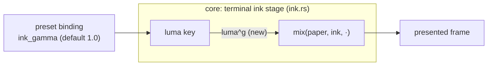

# 0078 — The ink learns to bite: a contrast exponent on the terminal remap

> **Status:** approved 2026-08-11 (scope user-decided by interview at the Plan 0075 handoff)
> **Created:** 2026-08-11
> **Owner skill(s):** dev, human
> **Related ADRs:** [0092](../adrs/0092-the-ink-remap-gains-a-contrast-exponent.md) (the
> lever and its shape), [0028](../adrs/0028-final-stage-ink-tone-remap.md) (the stage it
> supplements)
> **Closes:** [design-backlog 0084](../design-backlog.md#0084--the-ink-stage-has-no-contrast-lever-and-three-worlds-in-two-cohorts-paid-for-it)
> **Queued:** after [Plan 0076](done/0076-the-second-layer.md) (landed) and Plan 0075's cohort 6, per the
> 2026-08-11 handoff decision.

## TL;DR

Three worlds in two renaissance cohorts wanted the same thing and could not have it: a
duotone whose dark pole bites harder without moving the paper. ADR-0092 puts a response
exponent on the ink remap's luminance key — `mix(paper, ink, luma^g)` — whose endpoints are
invariant by construction, so the paper never moves; default `1.0` is the exact identity, so
nothing shipped changes until a preset binds it. This plan lands the param, documents the
three-lever interaction (`ink_gamma` x `ink_amount` x `exposure`), and ends with the content
lane re-judging the ink worlds that paid for the absence.

## Context & problem

Backlog 0084 carries the full record: three separate measurements across cohorts 3 and 4,
each reaching for a contrast/gamma control on the terminal remap and finding none. The two
workarounds both pay — Etching authored the duotone into `[palette]` (spending the palette
on the remap's job), and the `brightness`/`fade` juggle trades away structure. The remap
itself (`core/src/render/ink.rs`, ADR-0028) keys on luminance with a fixed response.

## Decision

Implement ADR-0092 as specified: one bindable engine-stage param, exponent shape, endpoint
invariance as the defining property, default-identity so the zero-baseline claim is
structural and verified rather than argued. Rejected alternatives (palette-side authoring, a
parametric curve or third stop, doing nothing) are in the ADR.

## Architecture diagram

## Implementation phases

### Phase 1 — the lever lands

- **Owner skill:** dev
- **Area:** core
- **What:** the exponent on the remap's luminance key in `core/src/render/ink.rs`, exposed
  as a bindable named param (working name `ink_gamma`; final name fixed here and used
  consistently in the docs phase). Continuous — no quantization seam applies. C ABI
  untouched.
- **Files touched:** `core/src/render/ink.rs`, `core/src/preset/schema.rs`.
- **Done when:** three properties hold, none a frozen number: (1) at `g = 1.0` the capture
  is byte-identical to today — verified bless-to-bless against a clean control per the
  standing baseline-drift rule, and expected to hold structurally since no golden fixture
  binds the new param (verify the grep at implementation); (2) endpoint invariance — pixels
  at key 0 and key 1 are identical across a ladder of `g` values; (3) monotonicity — at
  fixed input, each mid-key pixel moves monotonically toward paper as `g` rises above 1 and
  toward ink as it falls below.

### Phase 2 — the docs carry the three-lever story

- **Owner skill:** dev
- **Area:** docs
- **What:** `presets/README.md`'s ink section gains the param row and one paragraph an
  author actually needs: which lever does what among `ink_gamma` (response between the
  poles), `ink_amount` (how much remap), and `exposure` (level upstream of the stage) — the
  0061/0063 lesson is that an undocumented interaction costs every author a rendered
  ladder. State the endpoint-invariance property in the author's terms: the paper does not
  move.
- **Files touched:** `presets/README.md`.
- **Done when:** the row and the interaction paragraph exist; no numeric advice is given
  that was not measured in Phase 1 or 3.

### Phase 3 — the ink worlds re-judge

- **Owner skill:** human
- **What:** the content lane revisits the ink-mode worlds that paid for the absence —
  Etching first (its palette-side duotone is a live instance of the backlog-0060 pattern:
  a workaround that outlives its defect the moment Phase 1 lands, findable because its
  header says what it is doing), then the other two measurements' worlds. The output per
  world is a verdict: retune onto `ink_gamma`, or a recorded "the palette version stays on
  its looks" — judged in motion, not assumed from the mechanism.
- **Done when:** each world's header names its verdict; any retune lands through the
  normal suite; no header still describes the contrast workaround as forced.

## Data shapes

One new named param through the existing route. No new structs, no C ABI motion.

## Risks & open questions

- **The exponent may not cover all three measured wants.** If a world needs a toe *and* a
  shoulder, the exponent's one-parameter family cannot express it — that is ADR-0092's
  named negative, and the finding routes back to the backlog rather than growing this plan.
- **Phase 3 may retire its own subject.** The renaissance's cohort 6 and Phase 6 sweep run
  before this plan executes; if an ink world was retired meanwhile, Phase 3's roster is
  whatever ink-mode worlds actually ship at that point.

## What this plan does NOT do

- **A parametric contrast curve, an S-curve, or a third ink stop** — ADR-0092 Alternative B;
  the third tone is backlog 0069's composite question.
- **Touch `ink_*` semantics** beyond adding the exponent — ADR-0028's stage ordering and
  ADR-0032's placement stand.

## Followups (after this lands)

- If Phase 3 finds the exponent insufficient on a real look, file the S-curve want with the
  measurement — it becomes the demonstrated want ADR-0092 said it would wait for.
