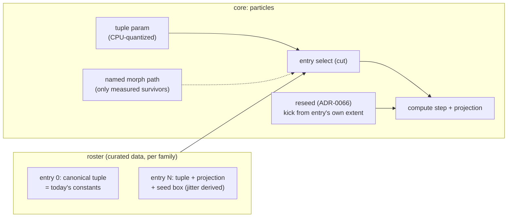

# 0079 — The attractor learns new figures: the tuple roster with per-tuple framing, and measured morph paths

> **Status:** in-progress 2026-08-13 (approved 2026-08-11; shape user-decided by interview at
> the Plan 0075 handoff — roster **plus** morph paths, research risk accepted)
> **Created:** 2026-08-11
> **Owner skill(s):** dev, human
> **Related ADRs:** [0093](../adrs/0093-attractor-tuples-are-content-with-per-tuple-framing.md)
> (the decision), [0068](../adrs/0068-the-projection-basis-is-a-per-family-property.md) and
> [0066](../adrs/0066-a-reseed-disturbs-the-cloud-rather-than-replacing-it.md) (the two
> mechanisms the roster must carry per-tuple without breaking)
> **Closes:** [design-backlog 0055](../design-backlog.md#0055--the-attractors-shape-vocabulary-is-breathe-and-bend-and-the-reference-figures-ask-for-more)
> **Queued:** after [Plan 0076](done/0076-the-second-layer.md) (landed) and Plan 0075's cohort 6, per the
> 2026-08-11 handoff decision; **last of the three handoff plans** — it is the largest and
> carries the research-risk phase.

## TL;DR

The attractor's vocabulary is "breathe and bend around one figure"; the reference galleries
are collections of *different* figures, and cohort 5 measured the wall exactly: a wild tuple
(Lorenz at rho ≈ 100) is unreachable because projection and seed box are per-family
constants sized to the canonical tuple. ADR-0093 makes tuples content: a curated per-family
roster where each entry carries its coefficients *and its framing* (with `jitter_extent`
derived per-entry so `reseed` keeps working), selected by a quantized `tuple` param — plus
named morph paths between roster pairs, shipped only where a rendered end-to-end sweep shows
the figure surviving the walk. Zero surviving paths is a legitimate recorded outcome.

## Context & problem

Backlog 0055 (raised by the user 2026-08-04, re-raised with the mechanism at the 2026-08-11
handoff) carries the full record. The coefficients are already bindable and already cut past
small steps — chaos, working as documented. What is *not* reachable at any preset-side cost
is a distant tuple's framing: `AttractorFamily::projection()` / `seed_box()`
(`core/src/render/scenes/particles/family.rs`) are per-family constants, so the torus-knot
Lorenz renders off-centre and out of frame, and `pan` cannot span it. One recorded coupling
shapes the fix: `jitter_extent` derives from `seed_box` (the Plan 0062 architect note), so
framing that does not travel with the tuple silently kills the `reseed` lever.

## Decision

Implement ADR-0093: roster entries as data (tuple + projection + seed box, jitter derived),
entry 0 byte-identical to today, a CPU-quantized `tuple` param (the `kaleido_spiral`
precedent — an eased fractional index must never interpolate between chaotic figures), cuts
softened by the ADR-0066 disturbance and the ADR-0024 dissolve; then morph paths as a
measured, evidence-gated extra. Rejected: free coefficients alone (the wall), dual-instance
crossfade (the dissolve already provides it), per-frame auto-centering (a frame-loop
readback). Curation and path judgment are `human` phases run on rendered contact sheets —
the user's concrete-examples workflow.

## Architecture diagram



## Implementation phases

### Phase 1 — per-tuple framing plumbing, roster of one

- **Owner skill:** dev
- **Area:** core (particles)
- **What:** the roster table type (coefficients + projection basis + seed box per entry;
  `jitter_extent` derived per-entry exactly as it derives per-family today), with each
  family's canonical tuple as entry 0. The `tuple` param lands CPU-quantized. To prove the
  plumbing rather than the curation, one **provisional** second entry ships behind it: the
  Lorenz rho ≈ 100 torus knot, framed by measurement — the previously unreachable regime is
  the walking skeleton.
- **Files touched:** `core/src/render/scenes/particles/family.rs`, `encode.rs`, `mod.rs`;
  `core/src/preset/schema.rs`.
- **Done when:** `tuple` unbound (and at 0) is byte-identical to today — bless-to-bless
  against a clean control, and structurally expected since entry 0 *is* today's constants;
  the rho ≈ 100 Lorenz at `tuple = 1` renders centred and in frame at the default view;
  `reseed` on entry 1 visibly disturbs and re-converges (the per-entry jitter derivation is
  the thing under test — the Plan 0062 coupling must not regress); an eased `tuple` binding
  never evaluates a fractional entry (quantization asserted CPU-side).

### Phase 2 — candidate sheets

- **Owner skill:** dev
- **Area:** tooling/content support
- **What:** render per-family contact sheets of candidate tuples — sourced from the
  reference galleries backlog 0055 cites and from the families' literature regimes — each
  candidate auto-framed by the same measurement Phase 1 used, so the user judges *figures*,
  not framing accidents. Sheet index records tuple values beside each cell.
- **Done when:** sheets exist for each family with enough candidates to choose from
  (the count is the curator's call, not a target); every cell is in frame.

### Phase 3 — the user picks the roster

- **Owner skill:** human
- **What:** the user selects the shipping tuples per family from the Phase 2 sheets — the
  concrete-examples workflow. The output is the curated roster list appended to this plan
  file, each entry named against its sheet cell.
- **Done when:** the list is in this file and the user has said "go" on it.

### Phase 4 — the roster lands, with docs

- **Owner skill:** dev
- **Area:** core, docs
- **What:** the chosen entries become the shipped roster; `presets/README.md` gains the
  `tuple` row — the quantization note beside `kaleido_spiral`/`palette_steps`' existing
  one, the long-`[smoothing]` guidance `kaleido_order` carries (a fast tuple binding is a
  slideshow, not a morph), and the per-entry framing fact (so authors stop expecting `pan`
  to rescue a wild tuple — the README's "slowly and by a little" paragraph gets its
  companion).
- **Done when:** the roster ships; docs describe it; the suite is green with zero
  pre-existing baselines moved (the golden fixtures bind no `tuple`; verify the grep).

### Phase 5 — morph-path sweeps, rendered end to end

- **Owner skill:** dev
- **Area:** core (the walk mechanism), tooling (the sweeps)
- **What:** the path-walk mechanism (interpolation along a *named* roster pair only — never
  free interpolation between arbitrary tuples), plus filmstrip sweeps of every candidate
  pair the roster makes plausible, in the exact shape of the IFS five-pair sweep that
  found `sierpinski -> fern` and demoted the showcase pair. Framing along the walk
  interpolates between the endpoints' framings; whether that holds mid-walk is part of
  what the sweep shows.
- **Done when:** the sweep set exists and each pair's filmstrip is judgeable; the walk
  mechanism is inert (zero baselines, no param bound) until Phase 6 ships survivors.

### Phase 6 — the user judges the paths; survivors ship or the record ships

- **Owner skill:** human
- **What:** the user judges the Phase 5 filmstrips. Pairs that survive ship as named paths
  with their binding documented; pairs that fail are recorded with their filmstrips'
  verdicts. **Zero survivors is a legitimate outcome** — the verdict lands in this plan and
  in ADR-0093's Outcome at close, and the roster alone stands as the delivered variety.
- **Done when:** every candidate pair has a verdict; shipped paths (if any) are green
  through the suite and documented; the plan file records the outcome either way.

## Data shapes

```rust
// illustrative — not the final interface
struct TupleEntry {
    coeffs: [f32; 4],           // a, b, c, d (family-interpreted)
    projection: (f32, f32, [f32; 3]),  // the per-entry form of family.rs's constants
    seed_box: ([f32; 3], [f32; 3]),    // jitter_extent derives from this, per entry
}
// per family: &'static [TupleEntry], entry 0 == today's constants
```

C ABI untouched; the roster is core-internal data reached by the existing named-param route.

## Risks & open questions

- **The research-risk phase is real risk.** The morph sweeps may produce zero survivors —
  accepted by the user at the interview, and Phase 6's done-when treats the recorded
  negative as completion, not failure. The plan must not be held open hoping for a path.
- **Curation quality is the ceiling.** A bad tuple ships looking authoritative (ADR-0093's
  negative). The Phase 2 sheets exist to make the pick a judgment of rendered figures.
- **Per-entry framing under the depth levers.** `perspective`'s orbit (backlog 0061) is
  proportional to the figure's projected extent, so a larger-extent tuple inherits a larger
  orbit — the sheets should render with the shipping presets' depth settings, not bare.
- **Sequencing against the renaissance.** If cohort 6 or the Phase 6 sweep retired or
  reshaped attractor worlds, Phase 3's curation reads the library as it then stands.

## What this plan does NOT do

- **Free interpolation between arbitrary tuples** — the walk exists only along measured,
  named pairs; everything else still cuts, documented.
- **Dual-instance crossfade or per-frame auto-centering** — ADR-0093 Alternatives B and C.
- **New attractor families** — the roster deepens the four that exist (`de_jong`,
  `clifford`, `thomas`, `lorenz`); the IFS family has its own morph design (ADR-0075) and
  is untouched.
- **Ship presets** — demonstration worlds are content-lane work through the 0067 route,
  after the capability lands.

## Followups (after this lands)

- A content pass binding `tuple` on the shipped attractor worlds (or new worlds) — routed
  to the lane, not bundled here.
- If the walk mechanism survives with paths shipped, backlog 0055's "variety vs morph"
  question closes in full; if not, the morph half is recorded as measured-and-refused, and
  the entry closes on the roster.
