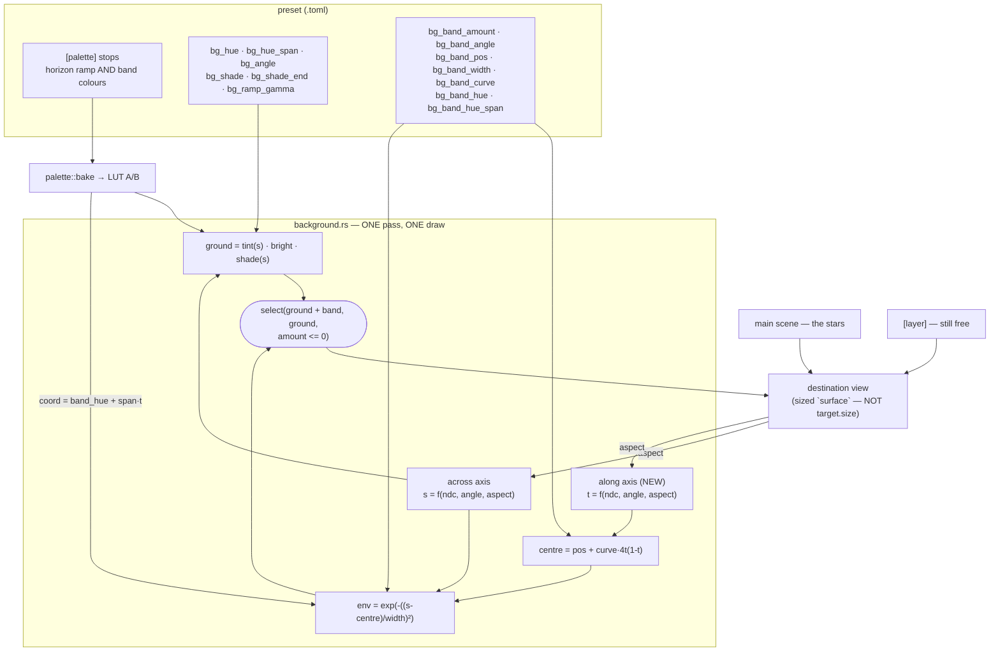

# 0081 — The sky gets a galaxy: the backdrop paints a curved band

> **Status:** approved 2026-08-12 (user approval, same day; the structure/colour/arc forks were all
> decided by interview — see ADR-0095 Alternatives A, D and F)
> **Sequenced after:** [0082](0082-the-gradient-stops-banding.md) — the band is a second wide smooth
> gradient, and Phase 6's verdict must not be confounded by banding already known about
> **Created:** 2026-08-12
> **Owner skill(s):** dev, human
> **Related ADRs:** [0095](../adrs/0095-the-backdrop-paints-a-curved-band.md) (this plan's
> decision), continues [0094](../adrs/0094-the-backdrop-paints-a-directional-ramp.md) (the ramp it
> sits beside, same pass), supplements
> [0086](../adrs/0086-the-backdrop-colours-through-the-preset-palette.md) (one colour language),
> [0090](../adrs/0090-a-preset-composes-two-scene-layers.md) (the layer cap this avoids widening),
> [0037](../adrs/0037-internal-grid-is-a-resolution-not-a-shape.md) (the aspect trap — **twice over
> here, and the new axis does not cancel at the default angle**)
> **Follows:** [0080](done/0080-the-sky-gets-a-horizon.md), whose Phase 7 verdict is **still
> outstanding** — see Risks

## TL;DR

The background pre-pass gains **one soft, curved band**, drawn additively beside the ramp in the
same pass — seven bindable params (`bg_band_amount`, `bg_band_angle`, `bg_band_pos`,
`bg_band_width`, `bg_band_curve`, `bg_band_hue`, `bg_band_hue_span`), all defaulting to exactly the
picture Plan 0080 shipped. The first user-visible behavior is a Milky Way arc standing over the dusk
ground: a swell of light along a bowed diagonal, with the scattered bright stars sitting in front of
it, leaving the main scene for the stars and the one `[layer]` still free.

## Context & problem

The dusk ground landed at Plan 0080 and was judged live in the app at `v0.54.0` against the user's
reference photograph — a Milky Way arc over a dusk horizon. The ground reads. **The galaxy is what
is missing**, and it is missing structurally rather than by tuning.

Four roles are wanted at once — ground, band, bright stars, reactive figure — against a budget of a
main scene plus one `[layer]` ([ADR-0090](../adrs/0090-a-preset-composes-two-scene-layers.md)).
Plan 0080 answered the first by moving the ground out of the scene budget entirely; the band has to
come from the same place or it displaces the stars. And no scene can be asked for the shape: neither
`swarm::PARAMS` nor `emitter::PARAMS` carries any positional or density control — verified against
the rosters, not assumed — so a particle scene fills its domain the way its forces put it, with no
lever that says *more here, fewer there*. `fragment_field` draws opaquely and would erase the
backdrop entirely.

ADR-0094 already named a neighbouring capability — a ramp drawn *after* the scene — and it is the
wrong one. That is a foreground haze. A galaxy is unresolved starlight **behind** the stars, so it
belongs in the same pre-pass the ground uses. Full reasoning, with the rejected alternatives, is in
[ADR-0095](../adrs/0095-the-backdrop-paints-a-curved-band.md).

## Decision

**Extend the backdrop pre-pass a second time**, per ADR-0095: one gaussian band whose centreline
bows, drawn **additively** over the ground, sampling its own segment of the **same** `[palette]`
along its own axis. The pipeline build condition widens from `bg_bright > 0` to
`bg_bright > 0 || bg_band_amount > 0`, because the reference's sky is nearly black away from the
horizon and today the pass would silently draw nothing there.

We rejected fbm mottling and dust lanes (no general-purpose noise primitive exists in the render
layer — only per-particle hashes in `scenes/particles/` — so it is new shared shader machinery with
its own determinism obligation; the stars drawn over the band supply the visible texture instead),
starfield density shaping (scenes have no density concept at all), a post-scene alpha ramp (wrong
side of the stars), explicit colour params and a palette-B binding (a second colour language, and a
collision with `palette_mix`'s dissolve duty respectively), and a straight-only band (`curve = 0`
keeps that shape as the default rather than as the only option).

## Architecture diagram



## Implementation phases

### Phase 1 — the band paints (walking skeleton)

- **Owner skill:** dev
- **What:** The band's envelope and its intensity, straight. `bg_band_amount`, `bg_band_angle`,
  `bg_band_pos`, `bg_band_width` join `PARAMS`/`set_param`/the uniform; the shader computes the
  across-axis position (the ramp's `s`, reused — **not a second copy**), a gaussian envelope around
  `bg_band_pos`, and adds `band_tint * env * amount` to the ground through a `select` arm. The band
  takes the ground's LUT sample this phase — its own colour arrives in Phase 3 — so the skeleton is
  a swell of the sky's own colour. **The build condition widens here**, not later, or the phase
  cannot be seen on a dark sky.
- **Files touched:** `core/src/render/background.rs` (shader, `Bg` uniform, `PARAMS`, `set_param`,
  `reset_params`, the build condition), `core/tests/preset.rs` (the
  `declared_params_match_set_param` guard picks the four new names up).
- **Done when:**
  - **The band's geometry is where its params say**, measured against a pinned control rather than
    computed: at `bg_band_angle = 0`, `bg_band_pos = 0.5`, `bg_band_width = 0.15`, the envelope
    reaches `1/e` exactly `bg_band_width` either side of the centre — that is what the gaussian's
    half-width *means*. Over 64 rows with the axis running bottom-to-top, the centre sits at row
    31.5 and the two `1/e` crossings at rows **22** and **41** (`across = 0.65` and `0.35`, through
    `row = (1 - across) * H - 0.5`).
  - **Do not assert an 8-bit ratio of 0.368.** The tonemap sits between the envelope and the write,
    so the linear ratio is not the encoded one — Plan 0080 Phase 2 already paid for this lesson
    ("a magnitude claim here would be a claim about the tonemap's shoulder instead"). Pin it as a
    differential: a control frame at a **flat** width (the upper rail, where `env` is within
    0.01 % of 1 everywhere) and `bg_band_amount` scaled by `1/e` contributes, at those rows, exactly
    what the real band contributes — same ground underneath, same tonemap, same encode — so the two
    frames must agree to within a level or two.
  - `bg_band_amount = 0` renders a preset **byte-identical** to Plan 0080's picture, and the whole
    baseline suite comes back hash-identical under the bless-to-bless control (bless twice on this
    branch, differing only by reverting the change — never `git diff` the committed baselines; eight
    of them drift from their committed bytes on this box under a clean `LMV_BLESS`). The `select`
    arm makes this structural: the pre-existing expression is the untaken branch, unchanged.
  - **The widened build condition is exercised**: a preset at `bg_bright = 0` with
    `bg_band_amount > 0` paints a band, where today it renders a plain black clear. A test that only
    ever runs a lit backdrop would not notice this phase's one-line change.

### Phase 2 — the band arcs

- **Owner skill:** dev
- **What:** `bg_band_curve` bows the centreline, and the pass learns its **along-band** axis to do
  it. `centre = bg_band_pos + bg_band_curve * 4t(1-t)`, where `t` is the normalized position along
  the band. The `4t(1-t)` form is zero at both ends and `1` in the middle, so `curve` is *the bow's
  depth in across-axis units* and `curve = 0` is exactly straight on every pixel.
- **Files touched:** `core/src/render/background.rs`.
- **Done when:**
  - **The bow is where the arithmetic puts it.** At `bg_band_angle = 0`, `bg_band_pos = 0.5`,
    `bg_band_curve = 0.2` over 64 rows: the band's peak sits at `across = 0.5` at both frame edges
    (row 31.5) and at `across = 0.7` in the middle (row 18.7) — a **13-row bow**, measured by
    locating the peak column-by-column, not computed. The two edge columns must also agree with
    *each other*, which is what says the bow is symmetric rather than sheared.
  - **This phase is ADR-0037's control for the new axis, and it is a different trap from Plan
    0080's.** The along-axis normalizer does **not** cancel at the default angle — at
    `bg_band_angle = 0` the along direction is horizontal, so its normalizer *is* the aspect. It is
    nonetheless invisible until now, because with `curve = 0` and `bg_band_hue_span = 0` nothing
    reads `t` at all. **Run the bow measurement at a non-square target.** A wrong normalizer pushes
    `t` outside `[0, 1]` near the edges, where `4t(1-t)` goes *negative* and the band bows the wrong
    way — a loud, checkable failure, and the reason this is the phase that can see it.
  - `bg_band_curve = 0` reproduces Phase 1's frame byte-for-byte, and the baselines are
    hash-identical a second time by the same control.

### Phase 3 — the band takes its own palette segment

- **Owner skill:** dev
- **What:** `bg_band_hue` / `bg_band_hue_span` give the band its own coordinate in the **same**
  `[palette]`, swept along `t` so the galactic core can brighten toward one end. Same LUT pair, same
  `palette_mix` crossfade, same `apply_saturation` — one colour language (ADR-0086).
- **Files touched:** `core/src/render/background.rs`.
- **Done when:**
  - **The swept coordinate really is the palette's**, by the instrument Plan 0080 Phase 1 already
    built and proved, rotated a quarter turn: at each of several columns, the band's colour matches
    what a fixed `bg_band_hue` pinned to that column's swept coordinate paints at the same pixel, to
    within one 8-bit level. Everything downstream of the LUT fetch is identical between the two
    captures and cancels.
  - The segment keeps the engine-wide **repeat addressing** — no clamp, here or anywhere
    (ADR-0094 Alternative D, and this is the same coordinate space).
  - The defaults (`0.0` / `0.0`) leave the band on the ground's own coordinate, so Phase 2's frame
    is reproduced and the baselines are hash-identical a third time.

### Phase 4 — a fixture pins the band, and the instruments see it

- **Owner skill:** dev
- **What:** One golden fixture binding all seven params off their defaults, plus the housekeeping
  the new names imply.
- **Files touched:** `core/tests/fixtures/` + `core/tests/golden/` (a **fifth** `EXTRA_FIXTURES`
  entry, appended at the end so no pre-existing baseline is rendered from different device state),
  `core/src/render/tonemap/tests.rs` (the ADR-0058 layout enumeration re-run).
- **Done when:**
  - Every one of the seven is off its default in the fixture, for the reason Plan 0080's fixture
    header states: each default is an arithmetic identity, so a fixture leaving any one alone would
    pin the *old* picture through the new code and report no drift if the new term were dropped
    entirely. `bg_band_curve` off `0` in particular is the only thing in the crate's baselines that
    would read the along-band axis.
  - The baseline is blessed **after comparing WARP against the hardware adapter**, with both means
    recorded in the commit. The uniform grows **48 → 80 bytes**, moving this pass's
    `min_binding_size` — a Plan 0053 fix against a *measured* WARP mis-render. A divergence is a
    finding, not something to bless.
  - The ADR-0058 enumeration is re-run and its `background-bind-layout` entry still reflects
    reality. Plan 0080 established the expected answer — the shape records *whether* a size is
    declared, deliberately not which — so this is a confirmation, and a *changed* answer is the
    finding.
  - A preset binding the new names appears in `shot --report` with its bindings walked under the
    `bg_*` namespace, and a dead gate on one of them flags. Plan 0080 established that the report
    walks bindings generically and needs no per-namespace list; verify rather than edit.

### Phase 5 — the operator docs learn the band

- **Owner skill:** dev
- **What:** The doc sweep the new surface owes. **`presets/README.md`'s `bg_*` section is now
  fifteen params and needs to stay navigable** — the band gets its own subsection beside the ramp's,
  not seven more rows in one table.
- **Files touched:** `presets/README.md` (a band subsection under the background pass),
  `docs/preset-palettes.md` (the band's half of the colour story),
  **`.claude/skills/preset-author/references/systems.md`** and
  **`craft.md`** (the engine-stage table and the `bg_*` bullet).
- **Done when:** all six of these are written down:
  1. the seven params, their defaults, the rails on `bg_band_width`, and that `bg_band_angle`
     names the direction **across** the band — so `0` runs it horizontally — sharing `bg_angle`'s
     convention;
  2. **`bg_band_width` is a `1/e` half-width**, not a full width or a hard edge, with the worked
     Milky Way example: the palette, the seven values, and the sentence that makes it operable
     (move `bg_band_pos` and the arc rides up or down the frame; raise `bg_band_curve` and it bows);
  3. the band is **additive over the ground and under the scene** — so a fullscreen or opaque scene
     hides it exactly as it hides the ramp, and `fragment_field` hides it completely;
  4. **`bg_band_amount > 0` is now enough on its own** — a band paints over a `bg_bright = 0` sky,
     which is the near-black configuration the look actually wants;
  5. the band shares the `[palette]` with the ground *and* the scene *and* the `[layer]`, so a sky
     with both a horizon ramp and a galaxy needs a palette that holds both — the one real authoring
     constraint this decision creates;
  6. **the backdrop is still invisible to every gate** (ADR-0067 coverage, ADR-0091 animation), so a
     band earns a preset nothing at `sanity`/`animation` and the figure carries both floors —
     restated because a *more capable* backdrop makes the temptation to lean on it stronger.
- **The `.claude/skills/preset-author/references/**` sweep is a done-when here rather than a
  reviewer's catch.** It was a review minor at Plan 0078's close (`ink_gamma`) and again at Plan
  0080's (the whole ramp), both times for the same reason: that lane authors against those tables
  and has no way to notice they are stale. The world this plan exists for is authored in that lane,
  against those tables, immediately after.

### Phase 6 — judge the galaxy against the reference

- **Owner skill:** human
- **What:** The user renders the arc over the dusk ground in the running app, beside the reference
  photograph, and answers the questions no test can.
- **Done when:** a verdict is recorded on each of:
  - **Does it read as a galaxy, or as a smudge?** This is the question ADR-0095 Alternative A was
    rejected against. The bet is that the scattered starfield drawn in front supplies the texture
    the band itself lacks. If it reads as an airbrushed streak, **that is a result, not a failure**,
    and the answer is fbm mottling — its own ADR, its own plan, not a patch here.
  - **Does the arc's curvature read at a normal field of view**, or does it need to be pushed so far
    that the ends leave the frame?
  - **Does it band, with two overlapping gradients rather than one?** Plan 0080 Phase 7's verdict
    is **answered** — it banded, measured, and [Plan 0082](0082-the-gradient-stops-banding.md)
    dithers the display write ahead of this plan precisely so this question is asked of a chain
    that already works. **The check runs on the kept reference frame**,
    `core/tests/fixtures/scratch-0082/dusk_ground_banding.toml` — the darkest of the Plan 0080
    probes and the worst pre-dither case, frozen so a before/after is taken on the *same* picture.
    Add `bg_band_amount` to it and re-measure at 1920x1080; its README carries the numbers and the
    run command. **Nothing else in this plan checks that the dither still holds under two
    gradients**, which is why it is named here rather than assumed.

## Data shapes

```rust
// illustrative — the uniform after Phase 3. `c.w` was the one free word left,
// so seven params cost two new vec4s with two spare: 48 -> 80 bytes.
#[repr(C)]
struct Bg {
    /// x: bg_hue, y: bg_bright, z: bg_vignette, w: aspect (from `surface`)
    v: [f32; 4],
    /// x: palette_mix, y: saturation, z: bg_ramp_gamma, w: bg_band_amount
    c: [f32; 4],
    /// x: bg_angle, y: bg_hue_span, z: bg_shade, w: bg_shade_end
    g: [f32; 4],
    /// x: bg_band_angle, y: bg_band_pos, z: bg_band_width (CPU-clamped), w: bg_band_curve
    b: [f32; 4],
    /// x: bg_band_hue, y: bg_band_hue_span, zw: unused
    n: [f32; 4],
}
```

## Risks & open questions

- **ADR-0037, twice, and the second one behaves differently from the first.** The across-axis
  inherits Plan 0080's control. The **along-axis is new**, and unlike the ramp its normalizer does
  *not* cancel at the default angle — but it is unread until `bg_band_curve` or `bg_band_hue_span`
  is non-zero, so no Phase 1 test can see it. Phase 2's non-square bow measurement is the
  mitigation, and it is a done-when rather than a suggestion.
- **Plan 0080 Phase 7 is unanswered, and this plan doubles the exposure.** The banding question was
  asked of one wide smooth gradient in an engine that does not dither; this adds a second,
  overlapping one. Nothing here is blocked on that verdict — the arithmetic is independent — but if
  the answer comes back "it bands", the dither decision now covers two gradients and is worth more.
- **The smudge risk is the real one, and it is not testable.** No instrument in this repo can
  distinguish "reads as a galaxy" from "reads as an airbrush stroke". Phase 6 is the only thing that
  can, and Alternative A is the named answer if it fails. Do not pre-empt it with noise.
- **The `bg_*` namespace reaches fifteen names.** An author meets all of them in one section. Phase
  5's subsection split is the mitigation; if it still reads as a wall, that is feedback worth
  routing rather than absorbing.
- **A palette must now serve three consumers.** Ground ramp, band, and the scene (plus any
  `[layer]`) all sample the same stops. The dusk palette Plan 0080 shipped is fully spent on the
  horizon; a Milky Way sky needs stops for the band's colours too, and there is no second palette to
  reach for (ADR-0095 Alternative E, rejected on the `palette_mix` collision). This is an authoring
  constraint, and Phase 5 point 5 is where it gets written down.
- **Open:** whether `bg_band_pos` is the right name for a position measured along an axis whose
  direction another param sets — an author may reasonably read it as a screen position. If `dev`
  finds a clearly better name while writing Phase 5, raise it rather than silently renaming; the
  defaults and the identity requirement are fixed by ADR-0095.

## What this plan does NOT do

- **No fbm, no dust lanes, no mottling** (ADR-0095 Alternative A). The band is one smooth swell.
  Named and unforeclosed — the envelope is a single multiply, so noise multiplies into it later.
- **No starfield density shaping** (Alternative B). Scenes still have no density concept.
- **No post-scene or foreground ramp** (Alternative C). ADR-0094 named that want and it stays open
  and separate; a galaxy is behind the stars, a haze is in front of them.
- **No second band.** One. If a look wants two, that is a roster question, not a param.
- **No per-mark audio gating.** `twinkle` remains time-driven with a seeded per-mark rate and phase
  (Plan 0077); binding its *depth* to a band makes the whole sky sparkle harder without any two
  stars agreeing. Individual stars latching on a beat does not exist and is not decided here.
- **No second `[layer]`.** ADR-0090's cap is untouched — that is the whole reason the band lives in
  the backdrop.
- **No dither.** See Phase 6, and Plan 0080 Phase 7 before it.
- **It does not ship the Milky Way world.** Authoring and landing it is content-lane work through
  the [ADR-0081](../adrs/0081-the-content-lane-lands-presets-and-architect-curates-the-set.md) /
  [Plan 0067](done/0067-the-curation-route.md) route, after Phase 6's verdict.

## Followups (after this lands)

- **The world itself**, in the content lane, and it is **one pass with two standing items**: Plan
  0077 Phase 5 (Perseids' quiet sky) and Plan 0080 Phase 7 (the dusk ground). Three standing content
  items on one family of looks; walking the family once is the point.
- **If Phase 6 says "smudge", fbm** — ADR-0095 Alternative A, with the Phase 6 observation as its
  evidence.
- **The foreground haze** remains unaddressed and now has two ADRs pointing at it (0094 Alternative
  H, 0095 Alternative C). If a third look asks for it, it has earned a plan.
