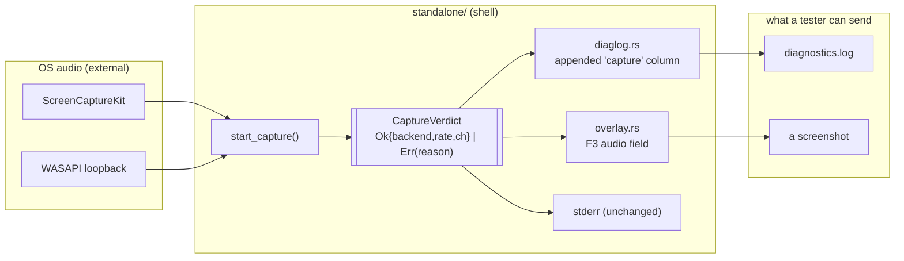

# 0083 — the build says why it hears nothing

> **Status:** in-progress
> **Created:** 2026-08-13
> **Owner skill(s):** dev, human
> **Related ADRs:** none — no rejected alternative worth recording; the shape follows
> [ADR-0052](../adrs/0052-analysis-diagnostics-are-native-only.md)'s existing diagnostics surface
> **Closes:** [design-backlog 0090](../design-backlog.md)

## TL;DR

When capture fails, the standalone degrades correctly — it renders without audio — but the *reason*
exists only on stderr, which a Finder or Explorer launch discards. This plan makes the capture
verdict a value instead of a print, and lands it in the two artifacts a remote tester can actually
send: an appended `capture` column in `diagnostics.log`, and a field in the F3 overlay. After it, a
tester who reports "it doesn't react to music" sends one file that already says why.

## Context & problem

An external Mac tester reported: *"app works, but does not react to music; permissions were
granted."* Their `diagnostics.log` came back — **1,249 rows spanning ~6.5 days and 12 app restarts,
with all four band columns at exactly 0.0000 on every row.** The renderer is healthy throughout
(steady 60.0 fps, `frame_ms_avg` ~16.7, constant `gpu_bytes`).

So the log *proves* capture never delivered a sample on any launch — which rules out "forgot to
restart after granting" (twelve restarts), quiet music, and anything render-side — **and it cannot
say why.** Thirteen launches produced thirteen stderr lines naming the reason and Finder discarded
every one.

The mechanism is one line. `standalone/src/main.rs:1023`:

```rust
Err(err) => {
    eprintln!("ScreenCaptureKit capture unavailable ({err}); rendering without audio");
```

with the same shape on the Windows arm at `:996`. The degradation is right and stays. What is wrong
is that the verdict never reaches a durable artifact:

- **`diagnostics.log`** — the file `packaging/macos/READ-ME-FIRST.md` step 6 asks testers to send —
  carries the band columns, so it shows *whether* audio reached the analyzer, but records nothing
  about whether capture started or which error it died with.
- **The F3 overlay** has no capture field at all.

The only surviving route to the reason is the README's step 3 escape hatch — relaunch from a
terminal — which is the highest-friction ask in the whole tester loop, and it is where this report
stalled. The surviving suspects are distinguishable *only* by that relaunch: a stale TCC grant (each
ad-hoc-signed build is a different app to macOS, so the Privacy toggle can show an older build's
entry as enabled while the new binary is denied), macOS below 13, or a ScreenCaptureKit start error.

**The Windows arm is in scope for a reason that is not symmetry.** Nobody on this project can
execute the macOS path — there is no Mac in the loop except the tester's. Building the same verdict
on both arms means the mechanism is exercised, tested and reviewed on the development box, and the
Mac arm differs only in which error type it formats.

## Decision

The capture verdict becomes a **value produced at startup on the render/UI thread**, carried beside
the audio format, and rendered into both durable artifacts. It lands in `diagnostics.log` as an
**appended column** — not a one-off header line — because this log rotates at 1 MiB keeping one
backup, and the tester's spanned 6.5 days: a line written once at startup is exactly the thing
rotation deletes, and a column also catches a capture that dies *mid-run*, which a startup line
cannot. The append matches the file's own stated rule, that the eight leading columns are frozen and
later columns are appended, never interleaved.

We rejected a `#`-prefixed comment line at startup (rotation drops it, and it says nothing about a
mid-run loss) and a separate `capture.log` (a second file for a tester to forget, against a loop
whose whole friction is asking for artifacts).

The `eprintln!` stays. It costs nothing and it is still the fastest read for anyone already at a
terminal.

## Architecture diagram



Nothing here touches `core/`, and nothing runs on the capture thread — the verdict is known before
the callback exists, and both consumers already live on the render/UI thread.

## Implementation phases

### Phase 1 — the verdict becomes a value

- **Owner skill:** dev
- **What:** `start_capture` returns a `CaptureVerdict` alongside the handle, consumer and format —
  one variant for a live capture carrying the backend name and the negotiated format, one carrying
  the platform error's `Display`, and one for the no-capture-path platforms. All three arms
  (`windows`, `macos`, neither) produce one. The `eprintln!`s stay exactly as they are.
- **Files touched:** `standalone/src/main.rs`, a small new `standalone/src/capture_verdict.rs`.
- **Done when:** every arm of `start_capture` yields a verdict whose rendered token is non-empty and
  differs between the success and failure cases; a unit test constructs one of each and asserts they
  are distinguishable strings, so a future arm that forgets to set it cannot render as a success.
  The token is built **once**, at startup, and stored — nothing formats per frame or per log row.

### Phase 2 — the verdict lands in `diagnostics.log`

- **Owner skill:** dev
- **What:** one `capture` column appended to `HEADER` and to every row, carrying the startup token.
  The eight frozen leading columns and the Plan 0049 analysis columns keep their indices.
- **Files touched:** `standalone/src/diaglog.rs`, `standalone/src/main.rs`.
- **Done when:** a fresh log's header ends with the new column and every data row carries the same
  number of tab-separated fields as the header; the pre-existing column names and their **order**
  are unchanged, asserted against the frozen prefix rather than against the whole string, so this
  test keeps meaning something the next time a column is appended. A run with capture unavailable
  writes rows whose `capture` field names the failure reason; a run with capture live names the
  backend and the negotiated format. Because `maybe_log` runs every frame, the row build must not
  allocate a new token per row — the stored value is borrowed, not formatted.

### Phase 3 — the verdict lands in the F3 overlay

- **Owner skill:** dev
- **What:** one audio line in the overlay — the live case naming backend, rate and channels, the
  failed case naming the reason — so a tester can answer the question with a screenshot instead of a
  file.
- **Files touched:** `standalone/src/overlay.rs`, `standalone/src/main.rs`.
- **Done when:** toggling the overlay on a build with capture unavailable shows a line naming the
  reason, and on a working build shows the negotiated format matching what `diagnostics.log`'s
  `capture` column says for the same run. The two surfaces read the same stored value, so they
  cannot disagree.

### Phase 4 — the tester loop stops asking for a terminal

- **Owner skill:** dev
- **What:** the operator-doc sweep this change owes. Both `packaging/*/READ-ME-FIRST.md` files stop
  making the terminal relaunch the primary route to the reason and point at the log column and the
  overlay; `docs/on-device-validation.md` gains the check; `docs/capturing.md` learns the new column
  if it describes the log's shape.
- **Files touched:** `packaging/macos/READ-ME-FIRST.md`, `packaging/windows/READ-ME-FIRST.md`,
  `docs/on-device-validation.md`, `docs/capturing.md`.
- **Done when:** a reader following the READ-ME-FIRST from the top can produce the capture reason
  without opening a terminal, and the terminal step survives as a fallback rather than as step 3.
  `node scripts/check-doc-links.mjs` exits 0.

### Phase 5 — the tester answers the open question

- **Owner skill:** human
- **What:** ship the tester a build carrying this change and read the reason off the returned log.
  This is the phase the whole plan exists for: the four surviving suspects — stale/mismatched TCC
  grant, macOS below 13, a ScreenCaptureKit start error, an unexpected fourth — are distinguishable
  from one field.
- **Done when:** the returned `diagnostics.log`'s `capture` column names a reason, and that reason
  is recorded in [design-backlog 0090](../design-backlog.md) as the entry's answer. **A reason that
  turns out not to be actionable is still a successful outcome** — the entry's claim is that we
  cannot tell, and telling is the deliverable. Whatever fix the named reason implies is a *new*
  plan, not scope here.

## Data shapes

```rust
// illustrative — not the final interface
enum CaptureVerdict {
    /// Capture started. `backend` is a short static name ("SCK", "WASAPI").
    Live { backend: &'static str, sample_rate: u32, channels: u16 },
    /// The platform capture path failed; `reason` is the error's `Display`.
    Failed { backend: &'static str, reason: String },
    /// Built for a platform with no capture path at all.
    Unsupported,
}
```

The log token is rendered once into a `String` at startup and borrowed thereafter — e.g.
`live SCK 48000/2` or `failed SCK <reason>` — with tabs and newlines stripped, since the file is
tab-separated and an error message is not under our control.

## Risks & open questions

- **A platform error's `Display` could contain a tab or a newline and corrupt the row.** The token
  builder sanitizes; the test for it uses a deliberately hostile message rather than a real error,
  because a real one that happens to be clean proves nothing.
- **The column widens a file some tooling may parse.** The eight leading columns are frozen by the
  file's own contract and stay at their indices; anything reading by index keeps working, and this
  is the second time columns have been appended (Plan 0049 did it first), so the pattern is
  established rather than invented here.
- **Phase 5 depends on a person who is not on this project.** It gates nothing — Phases 1–4 stand on
  their own as the capability — so if the tester goes quiet the plan still closes and Phase 5 carries
  forward as a standing item, the same shape as Plan 0061's Phase 9.
- **The negotiated format on a failed capture is a fiction.** Both arms fall back to a hardcoded
  48 kHz stereo `AudioFormat` so the renderer has something valid; the verdict must report the
  *failure*, not that fallback, or the log will state a format nothing is delivering.

## What this plan does NOT do

- **It does not fix any capture failure.** It makes the reason visible. The repair for whatever
  Phase 5 names is a separate plan.
- **It does not add a capture-device picker.** That is the live-performance roadmap item's Mac half,
  and it is the thing that eventually makes this column redundant in-app.
- **It does not touch `core/`.** Capture is a shell concern by ADR-0001, and a `CaptureError` type
  inside `core/` would be the exact leak the source-agnostic rule forbids.
- **It does not log at any new cadence.** One value, decided at startup, printed on the rows that
  were already being written.

## Followups (after this lands)

- If Phase 5 names a stale-TCC grant, the durable fix is a stable signing identity across builds —
  which is a packaging decision (ADR-0038 territory) and wants its own ADR.
