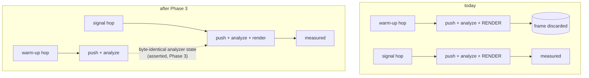

# 0084 — two gates stop lying about what they check

> **Status:** approved
> **Created:** 2026-08-13
> **Owner skill(s):** dev
> **Related ADRs:** none — both changes restore a stated property; no alternative worth recording
> **Closes:** [design-backlog 0077](../design-backlog.md), [design-backlog 0080](../design-backlog.md)

## TL;DR

Two gates this project already pays for report green about work they do not do. The doc-link checker
validates one of markdown's two link forms and is structurally blind to the other, in both
directions — 85 broken reference links once accumulated behind a green check. The reactivity gate
renders and discards ~85 % of its frames, because warm-up and measurement share one capture path.
Neither is a design question; both are the fix each one's own source comment already names.

## Context & problem

**The link checker.** `scripts/check-doc-links.mjs` matches `/\]\((?!https?:|mailto:|#)([^)#\s]+)/g`
— inline `[text](target)` and nothing else. Its own header says so: *"not reference-style links"*.
The reference form (`[0044]` in prose, resolved by a `[0044]: plans/done/0044-….md` definition
elsewhere in the file) is invisible in **both** directions: a use with no definition renders as the
literal characters `[0044]` and the checker is silent, and a definition whose target has rotted is
never resolved at all.

Measured at Plan 0061's close: **85 undefined uses across 11 files**, every one behind a green
`links` job and a green pre-push hook. **62 of them were created by that plan's own Phase 7b**, which
did nothing wrong — it moved ~2,700 lines of link-dense prose into `README-archive.md` verbatim while
the reference *definitions* those lines depend on stayed in a block at the bottom of `README.md`. The
phase's done-when said, correctly, *"Run it, do not inspect"*, and it ran clean.

This is the same shape as the 74 broken inline links Plan 0060 found: rot that degrades only in a
browser, accumulates one close at a time, and has no natural moment of discovery. Plan 0060 built the
gate for the first form. Nothing guards the second, and it re-accumulates on exactly the
close-ceremony `git mv` Plan 0060 already proved nobody catches by eye. The 85 were repaired at that
close; **the hole is unguarded, not currently broken**, which is precisely how the first one got to 74.

**The reactivity gate.** Plan 0067 Phase 1 moved the gate onto real PCM through the real analyzer —
the only reason a green suite says anything about audio at all — and it cost **86 s → 167 s over 41
presets**, measured interleaved on one machine. Each capture runs `WARMUP_HOPS + SIGNAL_HOPS` hops
and `capture_audio` **renders every one of them**, warm-up included, then throws those frames away.
The gate is paying a full rasterization pass per warm-up hop to reach a DSP state that needs no
pixels.

The cheap fix was already tried and correctly rejected: `SIGNAL_HOPS = 16` cut the cost but dropped
`emitter_squall` to 10 % headroom, which is a gate that fails on someone else's machine rather than a
gate that is faster. So the measured budget is not negotiable downward, and the discarded work is the
only slack. `core/tests/reactivity.rs:69` says exactly this and points at the fix: *"Buying that back
would take a capture entry point that feeds warm-up hops without rendering them, which is a
`core/src/render` change and not this gate's to make."* This plan is that change.

It compounds: Plan 0067 nominates this gate as the one to copy if another gate ever needs to answer an
audio question, and each copy inherits the waste.

## Decision

Both defects get the fix their own source already names, in one plan because they are the same size
and share nothing but a session.

The checker collects each file's `^[label]: target` definitions and its `[label]` uses, and reports
two new classes beside the existing one — a use with no definition, and a definition whose relative
target does not resolve — through the existing `file:line -> target` output shape. It gets a
deliberately-broken-label bite test, for the reason Plan 0060's own gate owed one: **a link checker
that silently passes is worse than none.**

The capture path grows a way to advance the analyzer without rasterizing, and the reactivity gate
uses it for its warm-up hops only. The property that makes this safe is the one the gate already
leans on and is asserted directly: analysis is a pure function of its window, so an advance that
skips rendering must leave **byte-identical** analyzer state to one that does not.

## Architecture diagram

## Implementation phases

### Phase 1 — the link checker sees the second link form

- **Owner skill:** dev
- **What:** collect per-file reference definitions and uses, and report the two new break classes
  through the existing output shape. Code stripping (fenced blocks and inline spans) already exists
  and must apply to uses too, or every document describing link syntax becomes a false positive —
  which is how this script's own prose in the architect skill was the first one.
- **Files touched:** `scripts/check-doc-links.mjs`.
- **Done when:** a fixture with a use whose label has no definition is reported and names the label;
  a fixture with a definition pointing at a missing file is reported and names the target; and a
  document that *describes* reference-link syntax inside a code span or fence is **not** reported.
  The bite check is the point of the phase: temporarily breaking one real label must turn the script
  red naming that label, and a checker that stays green there has not been built. The existing inline
  class keeps working — its current output on the repo is the control.

### Phase 2 — repair what it names

- **Owner skill:** dev
- **What:** run it and fix the breaks. **There are known to be at least seven, measured 2026-08-13
  with an ad-hoc version of Phase 1's matcher** — so this phase is not vacuous and does not depend on
  finding something:
  - `docs/plans/done/0061-…md:1037,1038,1042` — three definitions pointing at `../0046-…`,
    `../0053-…`, `../0072-…`. The plan moved into `done/`, so those siblings are **no longer one
    directory up**; the `../` is the outbound half of the close-ceremony break, on the definition
    form the current checker cannot see.
  - `docs/plans/README-archive.md:2955` — a definition targeting `0053-…md` without the `done/`
    prefix.
  - `docs/plans/README-archive.md:75,116` and `docs/plans/README.md:337` — uses (`[0071]`, `[0075]`,
    `[ADR-0037]`) with no definition in their file, rendering as literal bracket text. The first two
    are Plan 0061 Phase 7b's residue exactly as this entry describes it.

  Two more were **created and repaired during the 2026-08-13 backlog sweep** and are named here
  because they are the mechanism in miniature: moving two entries into `design-backlog-archive.md`
  carried their `[0048]` *uses* across while the definition stayed in the live file. Nothing went
  red. The definition was added to the archive by hand, and the repair is commented in place.
- **Files touched:** whatever the run names — likely `docs/plans/README.md`,
  `docs/plans/README-archive.md`, `docs/design-backlog.md` and closed plans under `docs/plans/done/`.
- **Done when:** `node scripts/check-doc-links.mjs` exits 0 with both classes live. Two repair traps
  the script's own output already warns about apply to definitions as well: a bare `NNNN-*.md` target
  inside `docs/adrs/` is identified by its **number**, not its slug — unless the surrounding prose
  says "Plan NNNN", where the missing piece is the `../plans/` prefix rather than the filename.
  Guessing wrong silently re-points a citation at a different document, so a target that is ambiguous
  gets read rather than pattern-matched.

### Phase 3 — the capture path can advance without rasterizing

- **Owner skill:** dev
- **What:** split "advance the analyzer" from "capture a frame" in `core/src/render`'s audio capture
  entry point, so a caller can push hops and step the DSP with no render pass.
- **Files touched:** `core/src/render/mod.rs` (or wherever `capture_audio` lives), `core/src/dsp/`
  only if the seam demands it.
- **Done when:** the determinism property is asserted directly and non-vacuously — feeding N hops
  **without** rendering leaves analyzer state whose next produced `AnalysisFrame` is **bit-for-bit
  equal** (compared as `to_bits`, not as `==` on floats) to the same N hops fed **with** rendering.
  The test must also show the comparison can fail: a run with a different hop count must differ, or
  the equality is proving nothing. The new entry point renders zero frames, which is checkable by
  count rather than by timing.

### Phase 4 — the gate stops paying for pixels it throws away

- **Owner skill:** dev
- **What:** `core/tests/reactivity.rs` runs its warm-up through the new path and rasterizes only the
  measured window. `SIGNAL_HOPS` and `WARMUP_HOPS` do not move — the measured headroom is not being
  renegotiated here, only the wasted work removed.
- **Files touched:** `core/tests/reactivity.rs`.
- **Done when:** the number of rendered frames per capture equals `SIGNAL_HOPS`, asserted by count
  rather than inferred from a stopwatch; every preset's reported band figures are **unchanged** from
  the current run, which is the real acceptance criterion — a faster gate that measures something
  slightly different has broken the library's calibration. The wall-clock improvement is recorded as
  a **measurement naming the machine** ([ADR-0071](../adrs/0071-a-numeric-test-contract-states-a-property-or-names-its-machine.md)),
  not asserted, and the docstring at `reactivity.rs:60` — currently stating the 86 s → 167 s
  arithmetic and naming this change as the way to buy it back — is rewritten to what was actually
  measured, including the fact that the ~15 % attributable to the wider readback window does **not**
  come back.

## Risks & open questions

- **The checker could turn red on `README-archive.md` at a scale nobody wants to repair by hand.**
  That file holds ~2,700 lines of moved prose whose definitions stayed behind, and it was repaired
  once. If Phase 2 surfaces a large batch, the repair is still mechanical (copy the definition block
  or re-point), but it is the phase most likely to be bigger than it looks. Splitting the repair into
  its own commit keeps the gate change reviewable.
- **A false positive class nobody predicted.** Reference-style syntax collides with ordinary bracket
  usage in prose — a table row, a citation, an `[ADR-0071]`-shaped mention with no link intent. The
  existing repo is the corpus: if Phase 1's first run produces noise rather than findings, the
  matcher needs narrowing (a use is only a use if a definition-shaped label exists somewhere, or the
  bracket is not immediately followed by `(`), and that narrowing is part of the phase rather than a
  follow-up.
- **The no-render capture path could quietly diverge.** Any state the render pass touches that the
  analyzer later reads would break the byte-identity property — which is exactly why Phase 3 asserts
  it rather than arguing it. If it *does* diverge, that is a finding about the capture path worth
  more than the speedup, and the plan stops to record it.
- **This plan touches CI cost, so the first CI run after it is not comparable.** A `scripts/` edit
  and a `core/src/render` edit invalidate different caches; read the *second* run, per Plan 0061
  Phase 9's standing note.

## What this plan does NOT do

- **It does not move `SIGNAL_HOPS`, `WARMUP_HOPS` or any gate threshold.** The measured headroom
  stands; only the discarded rendering goes.
- **It does not check `#anchor` fragments or external URLs.** Both are deliberately out of the
  checker's scope — the first is a bigger parse, the second makes CI a network call and a flake.
- **It does not touch the other four behavioral gates.** They synthesize their analysis frames and
  have no warm-up to skip.
- **It does not build the `sanity.rs`-shaped distribution report** that
  [design-backlog 0070](../design-backlog.md) names as a second step; that entry's cheap half already
  landed as the `geom` column.

## Followups (after this lands)

- If Phase 3's entry point proves generally useful, the four synthesized gates are candidates to move
  onto real PCM — which Plan 0067 nominated and priced. The price is exactly what this plan lowers.
