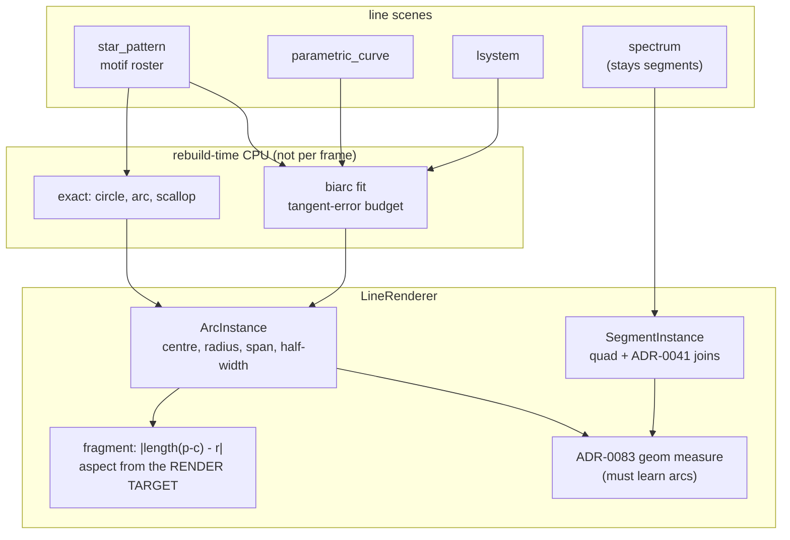

# 0087 — the line renderer draws a curve

> **Status:** in-progress — **phases 1, 1b, 2, 3, 4, 5 and 6 are done; Phase 7 is `human` and not
> started.** Every `dev` phase has landed. Phase 4's look gate returned a green light and Phase 5
> built on it; Phase 6 closed [design-backlog 0071](../design-backlog.md). One thing is owed before a
> push: `check-backlog-claims.mjs` exits 1 on **0071**, whose probe Phase 6 falsified *by discharging
> it*, and closing that entry is an architect call
> **Created:** 2026-08-13
> **Owner skill(s):** dev, human
> **Related ADRs:** [ADR-0098](../adrs/0098-the-line-renderer-draws-arcs-as-per-pixel-distance-fields.md),
> supplementing [ADR-0007](../adrs/0007-line-geometry-generators.md),
> [ADR-0041](../adrs/0041-line-joins-are-per-endpoint-on-the-segment-instance.md),
> [ADR-0079](../adrs/0079-the-mandala-interior-is-rings-of-motifs-inside-star-pattern.md)
> **Closes:** [design-backlog 0073](../design-backlog.md), [design-backlog 0071](../design-backlog.md), [design-backlog 0098](../design-backlog.md) (folded in 2026-08-16 as Phase 1b — same subsystem, and no other plan touches these files)

## TL;DR

Every curve a line scene draws is a parametric outline **sampled to straight segments**, and at
ornament scale the user's verdict was *"we don't have curves, anything curved is based on several
lines, and it's easy to see them."* Three mandala presets were retired on it. This plan adds a
circular-arc instance to `LineRenderer` whose stroke is a signed distance evaluated **per pixel** —
so a `circle` motif is one instance with no vertices at any resolution instead of `SMOOTH_SAMPLES`
segments and `SMOOTH_SAMPLES` additive beads — and the look is judged before the expensive half is
built.

## Context & problem

The verdict came twice, in the running app, from the user. First on the shipped `star_mandala`:
*"maximally lame — all lines are half transparent, line connections are visible, there is no curve
lines."* The three presets were then retuned to solid strokes at `glow = 1.0` with no trails, on the
hypothesis that the faceting was mostly inflated strokes, and re-judged:

> *"we don't have curves, anything curved is based on several lines, and it's easy to see them —
> lines look upscaled and half baked"*

A crop of `Mandala Weave` confirmed it directly: the `circle` motifs are visibly polygons, the
strokes carry stair-stepped edges, and every vertex is a bright bead. **All three ring-mandala
presets were retired** (`star_mandala`, `star_mandala_six`, `star_weave`).

**Two mechanisms, and only one of them is what anyone assumed.**

- **Faceting.** `Motif::vertex_count` (`core/src/render/scenes/lines/star.rs:665`) is a constant per
  variant — `SMOOTH_SAMPLES` for circle/petal/teardrop, `TREFOIL_SAMPLES` for the rose — and segment
  count per motif *is not an authorable parameter*. At motif `scale` 0.13–0.46 a circle is a polygon.
- **Vertex beads, and the joins are not missing.** They work exactly as
  [ADR-0041](../adrs/0041-line-joins-are-per-endpoint-on-the-segment-instance.md) specifies: each
  joined endpoint extends its quad **backward or forward by the half-width** (`renderer.rs:129`), so
  adjacent quads deliberately overlap by half a stroke on both sides of every shared vertex. The
  composite is additive, so that overlap **sums**, and a vertex renders brighter than the strokes it
  joins. Backlog 0073's own hedge — *"verify against what Plan 0040 landed before assuming joins are
  absent"* — resolves in favour of the joins. The bead is the join mechanism working.

Raising the sample count attacks the first and worsens the second per unit length, while spending
against `TierConfig::max_segments`, which a 40-member ring already reaches on the floor tier. The one
lever that exists points the wrong way on one of the two defects.

**And a user decision has been unbuildable for a week.** ADR-0079 left open whether the reference
image's scalloped outer boundary is a ring of touching motifs or a separate boundary curve. Plan 0065
Phase 2 rendered both, the user was shown explicitly that side B was 40 overlapping `arc` motifs
faking continuity, and **chose the real primitive anyway** ([backlog 0071](../design-backlog.md)).
`star.rs:599` records it in the shipped code: *"the engine does not have [one]. Nothing here fakes
one."*

The existence proof that per-pixel curves read on this composite already ships: `fragment_mandala`
draws a Gray-Scott field's **analytic iso-contours**, evaluated per pixel with no geometry and
therefore no vertex at any resolution. What has no route is a per-pixel curve in a *line* scene.

## Decision

Per [ADR-0098](../adrs/0098-the-line-renderer-draws-arcs-as-per-pixel-distance-fields.md): add a
**circular-arc instance** to `LineRenderer`, drawn as one bounding quad in the same additive pass,
whose stroke distance is `abs(length(p - c) - r)` inside the angular span and the distance to the
nearer endpoint outside it — exact, a handful of ALU operations, resolution-independent.

Curves that are not circles are expressed as a **G1-continuous chain of arcs** (a biarc chain). That
is the load-bearing half: a sampled polyline shows its joints because it is only **C0** — the tangent
jumps at every vertex and the eye reads a tangent discontinuity as a corner however fine the
sampling — while a biarc chain is tangent-continuous by construction, so the same handful of pieces
reads as a drawn curve.

We rejected authorable sample resolution (moves the two defects in opposite directions and does not
give backlog 0071 its primitive), quadratic Bézier instances (a cubic solve per pixel, against the
NFR §1 iGPU floor), and a blend change to kill the bead (reopens ADR-0018/0056, and fixes the defect
the user named *second*).

**The bead is reduced, not removed, and this plan must not claim otherwise.** Two arcs meeting still
overlap additively. A circle goes from `SMOOTH_SAMPLES` joints to **zero**; a rose has as many as it
has lobes.

## Architecture diagram



## Implementation phases

### Phase 1 — the arc instance draws

- **Owner skill:** dev
- **What:** a second instance kind, buffer and pipeline in `LineRenderer` — centre, radius, angular
  span, colour, half-width — expanded to one bounding quad and shaded by the per-pixel distance.
  Same additive pass, same premultiplied-alpha emission
  ([ADR-0056](../adrs/0056-additive-scenes-emit-premultiplied-alpha.md)), same fixed-capacity
  reused buffer so a full upload never allocates on the hot path.
- **Files touched:** `core/src/render/scenes/lines/renderer.rs`, `renderer/tests.rs`.
- **Done when:** an arc rendered through the new path matches a **densely-sampled polyline of the
  same arc** to within the golden suite's own drift tolerance, with the stroke profile (bright core,
  quadratic falloff to the quad edge) matching the segment path's — so the primitive is a *drawing*
  of the same curve rather than a different look. Two properties are pinned rather than argued:
  the shading takes its **aspect from the render target**
  ([ADR-0037](../adrs/0037-internal-grid-is-a-resolution-not-a-shape.md) — this stage's family has
  shipped that bug three times, so the control runs at a **non-16:9 target** where a grid-derived
  aspect and a target-derived one disagree, and is verified to **bite** by temporarily sourcing it
  wrongly); and the new bind-group layout is added to
  [ADR-0058](../adrs/0058-bind-group-layout-collisions-carry-evidence.md)'s enumeration with its
  evidence, or the guard is confirmed to place it in no colliding group.

### Phase 1b — a sub-floor `thickness` stops failing silently

- **Owner skill:** dev
- **What:** Closes [design-backlog 0098](../design-backlog.md), folded into this plan because this
  plan owns the line renderer and no other plan touches these files. **It is placed here, before
  Phase 4's stop gate, deliberately**: Phase 4 can send the whole plan to ADR-0098's Alternative C,
  and this repair must not be orphaned by that outcome — it is independent of whether arcs ever
  ship.
- **Files touched:** `core/src/preset/schema.rs` (the load-path warning),
  `core/src/render/scenes/lines/` where the floor lives, and their tests.
- **Done when:**
  - **The dead zone is what gets reported, not merely a small value.** `thickness` maps to an NDC
    half-width as `thickness * 0.003` floored at `0.0005`, so **every value below `0.167` produces
    the identical stroke** — about 0.27 px at 1080p, which rasterizes as a broken dotted line. A
    warning fires when a line scene's `thickness` binding rests below that threshold, in ADR-0020's
    shape (the unknown-param warning is the precedent and the same surface).
  - **The floor itself stays.** It is what stops a zero thickness degenerating the quad; the defect
    is the silence, not the clamp.
  - A test asserts that two distinct sub-floor values render **identically** — which is the property
    that makes the range dead — and that a value above the threshold does not. Without the second
    half the test would pass on a renderer that ignored `thickness` entirely.
  - **Why this cost a session, recorded in the phase commit:** re-tuning inside the dead zone
    changes nothing, so the obvious experiment *disproves the correct hypothesis*.
    `fragment_vitrail` shipped at `0.016` — two orders below the 1.5-3.2 every other line preset
    uses — and its Maurer rose read as scattered dots for its whole shipped life; the content lane
    swept chord count and sample count first because `0.016 -> 0.022 -> 0.038` had visibly no
    effect. The doc half is already discharged in `presets/README.md`.

### Phase 2 — the in-frame geometry instrument learns arcs

- **Owner skill:** dev
- **What:** `LineRenderer::draw`'s in-frame length measure
  ([ADR-0083](../adrs/0083-in-frame-geometry-is-measured-at-the-line-renderers-draw-seam.md), the
  `geom` column) counts arc length as well as segment length. This is a **correctness obligation of
  Phase 1, not a followup**: an arc contributing nothing would shrink the denominator and make every
  arc-drawing preset read better-framed than it is.
- **Files touched:** `core/src/render/scenes/lines/renderer.rs`, `core/tests/geometry_extent.rs`,
  `standalone/src/shot/report.rs`.
- **Done when:** an arc that is half outside the target reports a fraction that moves in the right
  direction and by an amount derived from the arc's own geometry — not a hardcoded number — and the
  two frozen defect pairs `geometry_extent.rs` already convicts still convict at their recorded
  separations, so the instrument's existing meaning survives the widening.

### Phase 3 — the circular motifs become arcs

- **Owner skill:** dev
- **What:** `Motif::Circle` becomes **one** arc instance and `Motif::Arc` becomes one, exactly. The
  budget arithmetic — `Motif::segments()`, which `build_rings` multiplies by `count` against
  `max_segments` — learns that a motif may cost instances of two kinds.
- **Files touched:** `core/src/render/scenes/lines/star.rs`, `star/tests.rs`, golden baselines.
- **Done when:** a `circle` motif renders with **zero interior joints** (asserted structurally by the
  instance count, not by looking at pixels) and is round at motif `scale` 0.13 and at full frame —
  the resolution-independence claim, checked at the small scale where the polygon was visible rather
  than at the large one where it was not. Frame cost is **measured and reported, naming the machine**
  ([ADR-0071](../adrs/0071-a-numeric-test-contract-states-a-property-or-names-its-machine.md)) for a
  40-member ring at Floor tier and 1080p. **This phase carries the plan's stop condition:** if the
  per-pixel cost fails NFR §1's 60 fps floor on the floor tier, the plan stops here and ADR-0098's
  Alternative C (accept the ceiling, route curve looks to the analytic-field family) is taken with
  this measurement as its evidence. Baselines that draw a circular motif **will** move — that is the
  point — and the re-bless is measured **bless-to-bless against a control**, never as a `git diff`,
  since eight baselines drift from their committed bytes on this box anyway; adapters are compared
  before blessing.

### Phase 4 — does it read as a curve?

- **Owner skill:** human
- **What:** the look gate, placed **before** the expensive half rather than at the end, because
  ADR-0098's G1 argument is a claim about what an eye does and no test in this repo settles it. Judge
  in the running app: an arc-drawn `circle` ring against the polyline version, at ornament scale, at
  the tunings the retired mandalas actually used.
- **Done when:** a verdict exists on two questions. **Does the arc-drawn ring read as drawn curves?**
  and **is the remaining bead — at genuine curve joints only — still objectionable?** A "yes, and the
  beads are gone with the vertices" green-lights Phase 5. A "the curves read but the joints still
  bead" is a **result**, not a failure: it routes the composite question to
  [backlog 0069](../design-backlog.md) with this observation as its evidence, and Phase 5 proceeds
  anyway. A "it still does not read" stops the plan and takes Alternative C — which is why this gate
  is here and not after the biarc work.

### Phase 5 — the general curve: a biarc chain

- **Owner skill:** dev
- **What:** a rebuild-time biarc fit turning a sampled outline into a G1 arc chain, applied to
  `petal`, `teardrop` and `trefoil`, and made available to `parametric_curve` and `lsystem` — which
  draw through the same `LineRenderer` and are the reason this reaches past the motif roster. Runs
  where `hankin::star_rosette` and `turtle::normalize_fit` already run, never per frame.
- **Files touched:** a new `core/src/render/scenes/lines/biarc.rs`, `star.rs`, `parametric.rs`,
  `curves.rs`, tests.
- **Done when:** the fit's error is bounded by a **stated tangent-error budget** whose derivation is
  written down, and the chain is **G1 at every joint** — asserted directly by comparing the outgoing
  tangent of each piece to the incoming tangent of the next, which is the property the whole decision
  rests on and the one thing that must not be taken on trust. The fit is a **pure function of its
  input outline** (determinism: no clock, no unseeded randomness), pinned by feeding one outline
  twice. Piece counts per motif are reported against the segment counts they replace, so the tier
  budget change is a number rather than a claim.

### Phase 6 — the scalloped boundary

- **Owner skill:** dev
- **What:** the closed scalloped outline the user chose at Plan 0065 Phase 2 — lobe count and depth
  as parameters, sampled as **one continuous chain** rather than as N placed copies. A `[generator]`
  key or roster member on `star_pattern`, per ADR-0079's own framing of where such a thing lives.
- **Files touched:** `core/src/render/scenes/lines/star.rs`, `presets/README.md`.
- **Done when:** the boundary renders as one closed curve whose lobe count is a parameter, and
  `star.rs:599`'s standing note — *"It is an approximation and the user chose the real thing… Nothing
  here fakes one"* — is replaced by a pointer to the real primitive, closing
  [backlog 0071](../design-backlog.md). `presets/README.md`'s motif and generator tables carry it,
  since the content lane keeps no catalogue of its own.

### Phase 7 — the retired mandalas, re-judged

- **Owner skill:** human
- **What:** the regression target this whole plan exists for. `star_mandala`, `star_mandala_six` and
  `star_weave` survive in git history with their **honest tunings** (`glow = 1.0`, no trails), and
  Plan 0075 Phase 1 froze their numbers as fixtures — coverage 0.2442 / 0.2505 / 0.2544, 10/10/9
  radial shells. Re-render them on the arc primitive and judge in motion.
- **Done when:** a verdict per preset, and a decision on whether any of the three returns to the
  shipped set. **Judging the look is content work**, so a preset that earns its place lands through
  the [Plan 0067](done/0067-the-curation-route.md) route in the `preset-author` lane rather than
  here — this phase produces the verdict and the evidence, not the commits.

## Data shapes

```rust
// illustrative — not the final interface
#[repr(C)]
pub struct ArcInstance {
    pub centre: [f32; 2],   // world space, same convention as SegmentInstance
    pub radius: f32,
    pub angle_start: f32,   // radians
    pub angle_sweep: f32,   // signed; |sweep| may exceed PI, and a full circle is one instance
    pub color: [f32; 3],
    pub half_width: f32,    // NDC-y units, uniform on screen after the aspect divide
}
```

No `joined` field: an arc has no interior joints, which is the whole point. Where two arcs in a chain
meet, they meet tangentially and overlap by ADR-0041's half-width as any two strokes do.

## Risks & open questions

- **ADR-0037, for the fourth time in this family.** The distance is computed in a space with an
  aspect divide, so an aspect taken from anything but the render target draws ellipses instead of
  circles. Phase 1 runs its control at a non-16:9 target — the configuration where a grid-derived and
  a target-derived aspect *disagree* — and verifies the check bites, because at 1920x1080 and at this
  box's 2048x1152 the two coincide exactly and no test at those sizes can tell them apart.
- **Per-pixel cost against the floor tier is the plan's real risk**, and Phase 3 is where it is
  measured with an explicit stop condition rather than discovered at the end. Bounding quads on a
  dense ornament overlap, so the shaded area is larger than the stroke area — this is fill-rate work
  on the hardware least able to pay it.
- **The bead may survive at curve joints and still read badly.** Phase 4 asks that question directly.
  If it does, this plan will have bought a factor and the remaining route is the composite
  question — which is a redesign and stays in [backlog 0069](../design-backlog.md).
- **`LineRenderer` gains a second instance kind, in the module four scene families share.** The guard
  against sprawl is that the arc carries only what an arc needs, and a third variant needs its own
  ADR rather than following by precedent.
- **Biarc fitting quality is a knob, not a constant.** A fit that is cheap and a fit that is good are
  different programs. Phase 5 states the budget and its derivation; getting it wrong shows as a curve
  slightly in the wrong place rather than as a visible vertex, which is a gentler failure than the one
  being replaced but is still a failure.
- **A re-bless is owed in Phase 3 and the suite is 28 baselines.** Re-derive the count rather than
  copying this number forward; that is precisely what went stale twice in `docs/plans/README.md`.

## What this plan does NOT do

- **It does not change the composite.** ADR-0018 and ADR-0056 stand; the arc emits premultiplied
  alpha into the same additive pass. The two-tone fill-and-outline question stays in backlog 0069.
- **It does not add Bézier instances.** ADR-0098 Alternative B, rejected on per-pixel cost, revisited
  only if a look is found that a biarc chain provably cannot hold.
- **It does not move straight-line scenes onto the new primitive.** `spectrum`'s bars and `lsystem`'s
  straight stems stay segments; a distance field is strictly more expensive for a straight line.
- **It does not author or re-land any preset.** Phase 7 produces a verdict; content lands through the
  Plan 0067 curation route in the `preset-author` lane.
- **It does not make sample resolution authorable.** ADR-0098 Alternative A, rejected — and it would
  become dead surface the moment the arc path exists.

## Implementation log

> Written by `dev` — one row per phase as that phase's commit lands, and the close block after the
> last one. **The phases above are the contract; everything here is what happened.**

**Lane:** phases 1-4 ran in `WORK/lmv-plan-0087` on `plan-0087-arc-primitive`, branched from `main`
at `aa4bc5f`; that branch is gone and its commits reached `main` inside Plan 0114's close merge.
Phases 5-7 run in `WORK/lmv-plan-0087-biarc` on `plan-0087-biarc`, branched from `main` at `e205f8e`.

| phase | owner | state | commit |
|---|---|---|---|
| 1 — the arc instance draws | dev | done | `3f9e828` |
| 1b — a sub-floor `thickness` stops failing silently | dev | done | `b97ff64` |
| 2 — the in-frame geometry instrument learns arcs | dev | done | `509eaff` |
| 3 — the circular motifs become arcs | dev | done | `82c031f` |
| 4 — does it read as a curve? | human | done | verdict in the notes |
| 5 — the general curve: a biarc chain | dev | done | `af4f118` |
| 6 — the scalloped boundary | dev | done | `8179f25` |
| 7 — the retired mandalas, re-judged | human | not started | |

### Notes

- **Phase 4's verdict, in the user's own words: _"circles looks fine but blurred"_.** Judged
  2026-08-25 in the running app, on the arc build alone at 1186x958, `rich` tier, against the three
  retired mandalas at their honest tunings recovered from `654304a^` (`star_mandala`,
  `star_mandala_six`, `star_weave` — `glow = 1.0`, no trails, no bloom). Against the phase's two
  questions: the arc-drawn ring **reads as drawn curves**, and **no bead was reported on it**. By the
  phase's own routing that is the "yes" that green-lights Phase 5.
- **The verdict was taken twice, and the first take judged the wrong build.** Both builds were
  launched side by side — the arc one and a control built at `509eaff`, the tip before circles became
  arcs — and the first screenshot returned was the control's: its circles carry the stippled,
  scalloped edge an arc cannot produce, since an arc has no vertices. The second take ran the arc
  build alone. **The lesson is cheap and worth keeping: a two-window A/B needs the windows
  distinguishable in the window itself**, not just in the launch command.
- **A defect Phase 4 does not ask about, named by the user at both takes and not fixed by this plan:
  the stroke reads blurred and semi-transparent.** Measured on the **arc** build's own frame, on a
  preset binding no bloom, no trails and no `glow`, so it is the stroke and not a post stage:

  | quantity | reading |
  |---|---|
  | a ~14 px stroke's cross-section | `28 45 68 91 113 134 156 177 198 215 225 223 211 192 170 149 128 106 83 60 40` |
  | of that stroke, within 10 % of peak | **4 px** |
  | of that stroke, above half peak | 13 px |
  | lit pixels in the frame reaching >= 200/255 | **13.0 %** (control: 16.1 %) |
  | lit pixels in the frame reaching >= 100/255 | 32.1 % (control: 33.4 %) |

  That is [ADR-0056](../adrs/0056-additive-scenes-emit-premultiplied-alpha.md)'s `(1 - d/w)^2`
  applied across the **whole** half-width: a thin bright spine inside a wide gradient. **Phase 1's
  done-when required the arc to reproduce it exactly** — "a drawing of the same curve rather than a
  different look" — and it does, at mean 0.0000, so the reading is identical either side of this
  plan. A stroke that reads as a drawn line wants a flat core and a ~1 px antialiased edge instead;
  that is a fragment change in `renderer.rs` reaching all four line families, moving every line
  baseline, and reopening what `glow` multiplies. **Architect's call, and this plan is not the place
  for it** — it is neither of Phase 4's two questions and it was not caused by anything here.
- **The two remaining `dev` phases were not started.** Phase 5 (the biarc chain) is green-lit by the
  verdict above but is the plan's expensive half, and the session's agreed scope was the contiguous
  `dev` run ending at Phase 4.
- **`node scripts/check-backlog-claims.mjs` now exits 1, and repairing it is an architect call.**
  Backlog 0098's probe is `present: max\(0\.0005\) in: core/src/render/scenes/lines/parametric.rs`
  and Phase 1b moved that constant into `lines/mod.rs` as `MIN_HALF_WIDTH`, so the probe no longer
  matches. The claim is unchanged and the entry is the one this plan closes; the gate's own message
  says a falsified entry is architect's to correct, close or split, and `docs/design-backlog.md` is
  outside every `dev` phase's scope. **It breaks `pre-push` and the CI `links` job until it is
  repaired.**
- **Phase 4's control needs choosing, because the obvious one no longer exists.** The phase says to
  judge "an arc-drawn `circle` ring against the polyline version". After Phase 3 the engine cannot
  draw a `circle` ring as a polyline at all, so the comparison is either against a build from before
  `82c031f` or against a `petal`/`teardrop` ring, which is a different figure. `arc_cost.rs` took the
  second route and says why it is a stand-in.
- **Phase 1's ADR-0058 obligation is discharged by the second of its two arms: there is no new
  bind-group layout.** The arc pipeline reuses the segment pipelines' bind layout, bind group and
  pipeline layout unchanged — only the vertex layout and the shader module differ — so nothing is
  owed to that ADR's enumeration. The hardware-vs-WARP comparison it asks for was run anyway
  (`prefer_software` flipped for one run): identical on every statistic, including the quadrant
  counts.
- **The aspect control bites on the max-outlier arm, not the mean.** Sourcing the arc fragment's
  aspect wrongly (a fixed `1.0`) takes the arc-vs-polyline comparison from mean 0.0000 / outlier 1
  to mean **0.0044** / outlier **255** — the mean stays *inside* the golden suite's 0.02, because a
  thin closed curve is wrong on a few hundred pixels and right on seventy-six thousand. Recorded in
  the test's own docstring.
- **Phase 1b moved the floor into one place rather than warning about four copies of it.**
  `WIDTH_SCALE` and the `0.0005` clamp were duplicated in `lsystem.rs`, `parametric.rs`,
  `spectrum.rs` and `star.rs`; they are now `lines::half_width` and the threshold the warning quotes
  is `MIN_HALF_WIDTH / WIDTH_SCALE`, derived rather than restated. The arithmetic is unchanged and
  the golden suite reads mean 0.0000 on all eighteen baselines.
- **`Expr::as_const` is new, and it is what bounds the warning's scope.** It reports the value a
  binding rests at, `None` for anything naming a variable — so an animated `thickness` that passes
  through the dead zone is silent, which is the honest limit of a load-time check and is asserted
  as such.
- **Phase 2 measures an arc by sub-chords rather than in closed form**, 64 of them, a power of two
  so an unclipped arc still sums to exactly 1.0. The closed form is the intersection of four
  half-planes with a circle — up to four disjoint angular components — and both sums are taken from
  `|sweep| * radius` either way, so the sampling changes only *where* the arc is judged to be, never
  how long it is. `standalone/src/shot/report.rs`'s `geom` legend now says "segments and arcs alike".
- **Phase 3's stop condition did not fire, and the measurement is in `core/tests/arc_cost.rs`.**
  A 40-member `circle` ring at 1920x1080, Floor tier, on this box (Windows 10 19045, DX12, RTX 3080
  Laptop, release), best of three interleaved repeats, marginal cost against the same preset without
  the ring:

  | case | lit px | per-frame | vs rosette | of the 16.67 ms budget |
  |---|---|---|---|---|
  | rosette only | 69 437 | 0.526 ms | — | 3.2 % |
  | `circle` x40 at motif scale 0.13 | 137 216 | 0.543 ms | +0.017 ms | 3.3 % |
  | `circle` x40 at motif scale 0.46 | 297 578 | 0.805 ms | +0.279 ms | 4.8 % |
  | `petal` x40 at motif scale 0.13 (960 segments) | 136 396 | 0.592 ms | +0.066 ms | 3.6 % |

  Across three consecutive runs the sparse arc ring read +0.017 / +0.043 / +0.077 ms and the polyline
  stand-in +0.066 / +0.035 / +0.106 ms — **the two are not separated by this instrument**, so the
  claim it supports is "no more expensive than what it replaces", not "cheaper". The dense case is
  +0.242 to +0.300 ms, several times the spread and a real reading. **Two caveats architect should
  weigh:** this box is not the floor tier's iGPU baseline, so the reading can convict and cannot
  acquit; and the polyline case is a `petal`, not a circle, because after this phase the engine can
  no longer draw a circle as a polyline.
- **No golden baseline moved, and Phase 3 expected them to.** The plan says baselines that draw a
  circular motif will move. **None does**: no shipped preset and no golden fixture declares a `rings`
  roster at all — the three mandala presets were retired at Plan 0065/0075 and `star_rosewindow`
  binds no rings. So no re-bless was owed and none was taken; all eighteen read mean 0.0000 /
  outlier 0. The bless-to-bless-against-a-control procedure the phase specifies was therefore never
  exercised, and the first roster preset to ship will be the one that owes it.
- **The extra pipeline did not shift WARP, against the precedent that predicted it would.**
  `over_pipeline`'s note records that building an unused pipeline for the nine line scenes moved five
  composite baselines. The shared `LineRenderer` now builds the arc pipeline for every line scene and
  nothing moved. The opt-in constructor is kept anyway.
- **Two scope steps outside Phase 3's file list, both disclosed rather than absorbed.**
  `core/src/render/scenes/mod.rs` — two lines, because the shared renderer is built there and
  `star_pattern` borrows it, so the phase is unreachable without them. And `presets/README.md` — the
  motif table said `circle` costs 24 segments and a passage said a circle reads as a polygon at
  ornament scale, both of which this phase falsified; Phase 6 is the phase scoped for that file, and
  it sits behind a `human` gate that may never open.
- **`core/tests/arc_cost.rs` is a new file**, for `mark_cost.rs`'s stated reason: one `#[test]` per
  file, so a hardware device never coexists with the other suites' WARP ones.
- **The transform and mirror went generic over a `LineInstance` trait** rather than being written
  twice. Segment behaviour is byte-identical — the mirror's rotation is `scale = 1.0`, an IEEE
  identity — and the golden suite confirms it at mean 0.0000.
- **The arc GPU buffer is `max_segments` long, which roughly doubles a line renderer's buffer
  allocation** (+720 KB at Floor, +2.1 MB at Rich, and a layered line preset builds a second one).
  It is sized that way because the two kinds share one budget: anything that passes `build_rings`'s
  cap check must reach the GPU or the cap would be cutting geometry silently, which ADR-0007 forbids.
  A tighter bound needs a tier field and is architect's call.
- **Followup noticed and not acted on — the segment path's stroke width is uniform in NDC, not in
  pixels.** Measured on a 640x480 target: the same `width` gives a horizontal stroke 24 px tall and
  a vertical one 30 px wide, the aspect ratio exactly. So a polyline circle already ships with
  fatter left and right sides than top and bottom, and `SegmentInstance::width`'s "uniform on screen
  after the aspect divide" overstates what the shader does. **The arc reproduces it deliberately** —
  Phase 1's done-when is to match a densely-sampled polyline of the same arc, not to draw a better
  one — so changing it is a separate decision about every line scene, and an architect call.

- **Phase 5 — the fit needs a second budget, and the first one alone cannot bound it.** The
  done-when asks for a stated tangent-error budget with a written derivation, and there is one
  (`biarc::TANGENT_BUDGET`, 0.05 rad, derived so its own positional consequence lands on the same
  order as the lateral one). **A tangent budget alone does not terminate.** `petal` and `teardrop`
  carry a point of *unbounded* curvature at each tip — the outline's `1.6` exponent makes
  `y ~ |x|^0.8`, so the tangent turns arbitrarily fast through vertical and no circular arc tracks
  it. A tangent-only criterion subdivides without limit over a feature `7.6e-6` units wide, five
  hundred times narrower than a pixel. The fit therefore enforces a **lateral** budget as well, in
  the caller's own frame, and that is the criterion that actually bounds the piece count. Measured
  at the tangent budget alone: 28 arcs for a `petal` against the 24 segments it replaces.
- **Phase 5 — the fit runs per frame on `parametric_curve`, and the plan says it never does.** "Runs
  where `hankin::star_rosette` and `turtle::normalize_fit` already run, never per frame" holds for
  the motif roster, where a chain is fitted once per process (`star::CHAINS`) because it is a pure
  function of its motif. It **cannot** hold for `parametric_curve`, whose build model is a resample
  every frame (ADR-0007) with no load moment to run anything at. It runs there per frame,
  allocation-free into scene-owned buffers, and the span search is doubling-plus-bisection
  (`O(n log n)`) rather than the `O(n^2)` a linear walk with a full recheck would cost.
- **Phase 5 — piece counts against the segments they replace**, printed by
  `a_fitted_motif_is_a_g1_chain_rather_than_a_polygon`: `petal` 24 -> **22 arcs**, `teardrop` 24 ->
  **16 arcs**, `trefoil` 36 -> **24 arcs**, no straight runs in any of the three. The four-ring
  mandala fixture falls from 1 092 instances before this plan to 492. The tangent breaks left in a
  placed chain are the figure's own corners: 0, 1 and 3 against 24, 24 and 36 vertices.
- **Phase 5 — a corner rule alone does not preserve a Maurer chord web, which is a measurement and
  it moved the design.** The obvious construction — break the chain wherever the walk turns past
  `CORNER_TURN`, and let a web fall out as its own polyline — **fails**: a `d = 29` walk is ~90 %
  corners, and the fit turns the remaining tenth into arcs spanning two and three chords, redrawing
  a figure whose chords *are* the figure. So the smooth/web decision is the **caller's**, taken
  whole-figure from `biarc::corner_fraction` before the fit is called, with a threshold at 25 %
  against measured 15 % / 85 % for the two families. A web declines the fit outright and reaches
  `maurer_rose` unchanged; the two samplers were folded onto one `rose_point` so they cannot draw
  two different roses from one set of parameters. **No golden baseline moved** — all 792 `lmv-core`
  tests pass, including the ~20 `parametric_curve` captures, every one of which binds `d = 43` or
  `d = 71`.
- **Phase 5 — the single-arc collapse was a G1 defect before it was an optimization.** A span that
  one arc already fits is emitted as one instance rather than as a biarc. Written against
  `TANGENT_BUDGET`, that left the next piece starting up to 2.9 degrees off where this one ended — a
  tangent discontinuity at every collapsed joint, which is the defect ADR-0098 exists to remove. It
  is an equality test at `1e-4` rad now. Caught by asserting the G1 property directly rather than
  taking it from the construction; the assertion is `chain_is_g1_at_every_joint_that_is_not_a_corner`
  and its first run failed on an ellipse at five joints.
- **Phase 5 — six `star` tests were written against `petal`/`teardrop`/`trefoil` being polylines**
  and were repaired rather than relaxed: the roster's test helpers now split three families instead
  of two, placement assertions read points **on the drawn figure** through one `drawn_points` helper
  that is blind to which primitive carries them, and two instance-count literals became expressions
  over `Motif::instances()` so the arithmetic is no longer asserted against itself. The
  counter-rotation test named `Motif::Petal` while its own comment said "a **polyline** motif"; it
  names `Motif::Diamond` now.
- **Phase 5 — one scope step outside the phase's file list, disclosed rather than absorbed.**
  `presets/README.md` (Phase 6's file, and Phase 3's precedent): its motif table quoted 24 / 24 / 36
  segments for the three fitted members and a standing note said they "still facet where the retired
  mandalas did", both of which this phase falsified. Left stale it would have been wrong for exactly
  one commit.

- **Phase 6 — the plan's open "a `[generator]` key **or** roster member" is a roster member,**
  `scallop`, the eighth. It reaches presets with **no schema change at all**: `schema.rs` builds its
  legal-name list from `Motif::ALL` and validates `count` against a range the new member already
  satisfies, so the phase stayed inside its stated two files. A `[generator] boundary` block would
  have needed `core/src/preset/schema.rs` and `core/src/render/scenes/mod.rs`, both outside it.
- **Phase 6 — `scallop` reads three ring keys with its own meaning, and it is the only member that
  does.** A boundary is a figure, not a bead repeated around a ring, so there is no copy count:
  `count` is the **lobe count**, `radius` the base circle the lobes bulge from, `scale` the **depth**
  of the bulge — the only size a lobe has once `count` has fixed its width. `Motif::arcs()` returns
  **one arc per lobe**, so `count * instances()` is the whole chain and the cap arithmetic never
  learns that this member is a chain rather than a ring.
- **Phase 6 — the lobes are constructed exactly, not fitted.** A scallop *is* a chain of circular
  arcs, which is what makes it a scallop and not a sine wave, so `biarc` has nothing to approximate
  here; the circle through a lobe's two ends and its apex has its centre on the lobe's axis by
  symmetry, and equating the two distances gives it in one line. At `depth = 0` that centre is the
  origin and every lobe is an arc of the base circle, so a `ring_scale` swept through zero passes
  through a plain ring rather than through anything undefined — asserted.
- **Phase 6 — a count below three is raised rather than refused**, to `MIN_SCALLOP_LOBES`: at one
  lobe the chain's only arc has coincident ends and a zero sweep. The `wanted` fold that reports the
  cap drop is raised through the same `placed_count` helper, so a raised count cannot make the drop
  count a fiction.
- **Phase 6 — three more `star` tests were roster-wide and had to learn the new member**: the closed
  roster is eight names, `polyline_motifs()` excludes the scallop as it already excluded the arc and
  chain families, and `the_declared_cost_matches_what_a_ring_emits` now asserts its invariant per
  **placed element** (`instances() * placed_count()`) rather than per copy, which is the same
  statement for the other seven.
- **Phase 6 — eyeballed, and it is the figure backlog 0071 asked for.** A 24-lobe boundary at
  `radius = 0.80`, `scale = 0.06` over a `petal` ring and a `trefoil` boss, rendered at 900x900
  through `shot --preset-file` from a scratch preset outside the repo: one continuous scalloped edge
  with evenly spaced cusps, no overlap and no seam. Not a done-when — Phase 7 is where a look is
  judged — but a gross construction error would have shown here and did not.

### Close triggers

- **`presets/` touched:** **no `.toml`.** `presets/README.md` only — the motif table's cost column
  (five of the eight members are arcs now, not 24 / 24 / 36 segments), the ring budget arithmetic,
  the standing note that a curved motif facets at ornament scale (Phase 3 falsified it for the two
  circular members, Phase 5 for the three fitted ones, and it is now true of neither), and the
  `scallop` row with the three ring keys it reads differently.
- **Plan header `Closes:`** — three entries, **two of them closed**:
  - [design-backlog 0098](../design-backlog.md) — **closed** by Phase 1b.
  - [design-backlog 0071](../design-backlog.md) — **closed** by Phase 6. The boundary curve exists,
    `star.rs`'s "Nothing here fakes one" note is replaced by a pointer to it, and
    `presets/README.md` carries it.
  - [design-backlog 0073](../design-backlog.md) — **not closed.** Phase 4 answered its question for
    the circular motifs and Phase 5 removes the mechanism for the other three, but the three retired
    presets are not re-landed; that is Phase 7, and it is `human`.
- **What shipped:** **feature.** The arc primitive and its instrument widening (Phases 1-3), the
  biarc fit and the three fitted motifs (Phase 5), the scalloped boundary (Phase 6); plus the
  sub-floor `thickness` warning as a fix (Phase 1b). No preset content.
- **Operator docs touched:** `presets/README.md`. None of `README.md`, `docs/presets.md`,
  `docs/preset-palettes.md`, `docs/capturing.md`, `docs/on-device-validation.md`, `docs/nfr.md`.
- **Backlog probes (`node scripts/check-backlog-claims.mjs`):** **exit 1**, naming
  **0071** — `present: Nothing here fakes one in: core/src/render/scenes/lines/star.rs`. Phase 6
  deleted that sentence **because it built the thing the entry asked for**, so the probe is falsified
  by the entry being discharged rather than by drift. `docs/design-backlog.md` is outside every `dev`
  phase's scope and the gate's own message says a falsified entry is architect's to correct, close or
  split. **It breaks `pre-push` and the CI `links` job until it is closed.** (The Phase 1b breakage
  this field recorded before — 0098's stale path — is gone: that entry was archived on `main` at
  `6eff54e`.)
- **Outstanding `human` phases:** **Phase 7** (the retired mandalas, re-judged) — the regression
  target the whole plan exists for, and the phase that decides whether any of `star_mandala`,
  `star_mandala_six` or `star_weave` returns to the shipped set. Phase 4 ran; its verdict is above.
- **Outstanding `dev` phases:** **none.** 5 and 6 landed here.
- **Lane state:** `plan-0087-biarc` is branched from `main` at `e205f8e` and carries two commits,
  `af4f118` and `8179f25`. **`main` has moved since** — a parallel session is committing to it — so
  a merge of `main` into this branch is owed before the close. **No golden baseline moved**: all 794
  `lmv-core` tests pass on the tip, including every `parametric_curve` capture, which is the property
  the chord-web gate exists to hold. `cargo fmt --all --check` and
  `cargo clippy --all-targets -- -D warnings` are clean; `node scripts/check-doc-links.mjs` and
  `node scripts/check-index-rows.mjs` pass.

## Followups (after this lands)

- If Phase 4 or Phase 7 says the remaining joint beads still read badly, that is
  [backlog 0069](../design-backlog.md)'s evidence and its ADR's opening argument.
- `parametric_curve`'s roses are the largest untouched beneficiary; a content pass judging them on
  the biarc path is a `preset-author` sitting, not a plan.
