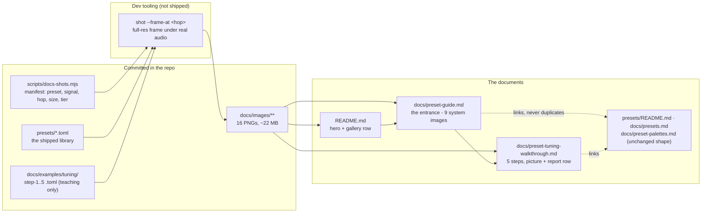

# 0088 — The docs get pictures

> **Status:** draft
> **Created:** 2026-08-13
> **Owner skill(s):** dev, human
> **Related ADRs:** [0100](../adrs/0100-documentation-images-are-committed-headless-renders.md) (documentation images are committed headless renders), [0101](../adrs/0101-the-preset-docs-gain-a-tutorial-layer-rather-than-a-merge.md) (the preset docs gain a tutorial layer rather than a merge)

## TL;DR

A visualizer with no picture in its documentation gets pictures. `shot` gains one flag —
`--frame-at <hop>`, a **full-resolution single frame under real audio**, which today is the one thing
it cannot produce — and a committed manifest script drives it to render a nine-image gallery, one per
built-in system, into `docs/images/`. Two new documents sit on top: `docs/preset-guide.md`, the
illustrated entrance to preset authoring, and `docs/preset-tuning-walkthrough.md`, which tunes one
preset over five numbered steps and shows the picture **and the `--report` row** that changed at each
one. `README.md` gets a hero image, a short gallery, and a sweep of the dead `shot` examples the
grounding turned up.

## Context & problem

The user's request is direct: update the main README, add screenshots, add a comprehensive guide to
how presets are created with screenshots, and a separate document showing a properly tuned preset
worked through with examples and pictures of what changed.

Three facts from grounding shape how that gets built.

**There is no committed image in this repository — not one.** Eighty-eight plans of a real-time
graphics project, documented entirely in prose. That is the whole problem, and it is also why the
weight question below is a one-way decision rather than a formatting one.

**Preset documentation is 4,819 lines across three files, all of them reference.**
`presets/README.md` (2,943) is the parameter roster, `docs/presets.md` (1,143) is the grammar,
`docs/preset-palettes.md` (733) is the colour surface. All three are current and load-bearing — the
`preset-author` lane keeps no catalogue of its own precisely so these stay the one copy. What is
missing is an entrance, not more reference. [ADR-0101](../adrs/0101-the-preset-docs-gain-a-tutorial-layer-rather-than-a-merge.md)
records why the answer is a fourth document rather than a merge.

**`shot` cannot currently take the picture this needs.** Measured 2026-08-13:

- `--frames 120 --out x.png` writes a clean **1280x720** frame — but under **silence**, since the
  capture path builds a default analysis frame. Fine for a time-driven accumulator like
  `attractor_leviathan`; a preset whose look is band-driven photographs at its resting state.
- `--signal dynamic:110 --at 340` runs the **real analyzer over real dynamics** — the right stimulus
  — but the filmstrip path scales every frame to a fixed tile height and draws a border. A
  single-hop `--at` at default size comes back **363x208 with a frame around it**. Unusable as a
  documentation image.
- `--set` reaches full size but is the wrong stimulus three ways, all named in
  [`docs/capturing.md`](../capturing.md#the-three-calibration-traps): a held `beat` photographs every
  accent at full deflection, band magnitudes are "a fraction of peak, held forever", and the 64-band
  array stays silent — so `bin(x)` reads `0` and the entire `spectrum` family renders as its inert
  resting comb.

So the first phase is a capability, not prose.

Two smaller things the grounding turned up, folded in because this plan is already sweeping these
files: `docs/capturing.md` quotes `--preset "Aurora"` three times and
`presets/fragment_aurora.toml` once — **neither exists**, so the first runnable command on that page
fails today — and `docs/presets.md`'s quickstart names the same missing file and describes "the
35-preset curated set across seven systems", which is now 36 across nine.

## Decision

Generate every image with `shot`, commit them full-resolution under `docs/images/`, and drive them
from `scripts/docs-shots.mjs` — a committed, argument-free regeneration script whose manifest is the
single record of what produced each file. Capture **under `--signal dynamic:110` at a late hop** so
accumulating scenes are developed and reactive ones are actually reacting, and at **`--tier rich`**,
because that is the tier the app starts on.

We rejected external hosting (breaks the link checker, offline reading and self-containment),
downscaled or lossy images (the user's explicit call with the measured cost in front of them; also
the worst-case content for palettization), live application screenshots as the primary source
(nothing regenerates, every image becomes a `human` sitting), and `--set` stimuli (the three
calibration traps, of which the `spectrum` one is decisive). Full rationale and the measured numbers
are in [ADR-0100](../adrs/0100-documentation-images-are-committed-headless-renders.md).

**The weight, stated plainly.** Measured across six families at 1280x720: **1.0–2.0 MB per PNG, mean
~1.4 MB**. This plan commits **16 images** — 9 gallery, 1 hero, 6 walkthrough — for **~22 MB** of
permanent history, against ADR-0100's budget of ≤ 22 images and ≤ 32 MB. A `Rich` capture is not
larger than a `Floor` one (1,899 KB against 2,010 KB on `attractor_leviathan`), so the tier choice
costs nothing here.

## Architecture diagram



## Implementation phases

### Phase 1 — `shot` captures one full-resolution frame under real audio

- **Owner skill:** dev
- **What:** A `--frame-at <hop>` flag: with `--signal` or `--audio`, advance the capture to that hop
  and write **one** frame at the full `--size`, with no tile scaling and no border.
- **Files touched:** `standalone/examples/shot.rs`, `standalone/src/shot/film.rs` (hop-index
  arithmetic is already there and unit-tested — reuse it rather than adding a second copy),
  `docs/capturing.md` (the flag table, plus one line naming this as the flag documentation images
  use and why `--at` is not).
- **Done when:**
  - `--frame-at 340 --signal dynamic:110 --size 1280x720 --tier rich` writes a PNG that is
    **exactly 1280x720**, against the 363x208 bordered tile the equivalent `--at 340` produces today.
  - The captured frame is the **same hop** `--at` selects: the stdout line names the hop it captured,
    and the printed audio-level table is unchanged from the filmstrip path (same clip, same
    analysis).
  - Two runs of the same `(preset, signal, hop, size, tier)` on one machine and binary are
    **byte-identical**. This is a same-adapter claim only — cross-machine byte equality is not
    asserted anywhere in this plan, because the golden suite's own `0.02` mean-channel noise floor
    says it does not hold.
  - A hop past the end of the clip is an **error**, matching `--at`'s existing behavior rather than
    silently clamping to the last frame.
  - `--frame-at` together with `--at` is an error: they answer the same question two ways.
  - `--frame-at` without `--signal`/`--audio` is an error naming what is missing.

### Phase 2 — The manifest, the regeneration script, and the first committed image

- **Owner skill:** dev
- **What:** `scripts/docs-shots.mjs` — argument-free, self-documenting in its header like
  `scripts/tuple-sheets.mjs` — reads an inline manifest and renders every documentation image into
  `docs/images/`. One image lands in this phase: the README hero.
- **Files touched:** `scripts/docs-shots.mjs` (new), `docs/images/` (new, one PNG), `README.md` (the
  hero reference only — the full README pass is Phase 6), `docs/capturing.md` (add the script to the
  two-script table, which becomes three).
- **Done when:**
  - `node scripts/docs-shots.mjs` regenerates every image the manifest names, with no arguments and
    no environment, and re-running it leaves `git status` clean on the same machine.
  - Each manifest entry carries **output path, preset file, signal, hop, size, tier** — enough that
    the command behind any committed image can be reconstructed from the manifest alone.
  - A missing preset file, a hop past the end, or a non-zero `shot` exit **fails the run non-zero and
    names the offending entry** — it does not skip it and leave a stale PNG in place.
  - The script writes **only** under `docs/images/`, and refuses to write outside it.
  - `node scripts/check-doc-links.mjs` exits 0 with the hero image referenced from `README.md` —
    confirming the checker's `](target)` regex covers ``, which it does by inspection
    and this phase demonstrates.
  - The script header states, in its own words, that **it is not a CI gate and must not become one**,
    with the adapter-drift reason.

### Phase 3 — The family gallery: one image per built-in system

- **Owner skill:** dev
- **What:** Nine images, one for each `SystemKind`, added to the manifest and committed.
- **Files touched:** `scripts/docs-shots.mjs` (nine manifest entries), `docs/images/gallery/`.
- **Provisional picks.** Four families have exactly one preset and choose themselves —
  `lsystem_vellum`, `star_rosewindow`, `spectrum_halo`, `emitter_perseids`. For the other five the
  starting picks are `fragment_whorl`, `swarm_drift`, `curve_nightbloom`, `reaction_verdigris`,
  `attractor_leviathan`; these are **provisional and judged in Phase 7**, which is where the look
  call belongs.
- **The capture recipe, and why:** `--signal dynamic:110 --frame-at 340 --size 1280x720 --tier rich`.
  `dynamic:110` is the only synthesized kind with real rise and fall through the real analyzer
  ([`docs/capturing.md`](../capturing.md#dynamicbpm--the-one-kind-that-rises-and-falls)); the clip
  runs ~355 analysis hops, so hop 340 is ~3.8 s of scene time — nearly twice the 2 s a default
  `--frames 120` capture reaches, which matters for every accumulating family. Measured:
  `attractor_leviathan` at hop 46 is an undeveloped smudge and at hop 340 is the finished rosette.
- **Done when:**
  - Nine PNGs exist, each 1280x720, one per system name in `SystemKind::from_name` — the mapping is
    the source of truth for the list, so a system added later is a missing gallery entry rather than
    a silent gap.
  - Every one is produced by the manifest, not by a hand-run command.
  - The commit message records the **total bytes added**, so ADR-0100's budget is measurable at any
    later close without re-weighing the tree.

### Phase 4 — `docs/preset-guide.md`, the illustrated entrance

- **Owner skill:** dev
- **What:** The tutorial layer: what a preset is, what each of the nine systems looks like and when
  to reach for it, which of the three references owns which surface, how to iterate, and how to know
  the result is good.
- **Files touched:** `docs/preset-guide.md` (new), `docs/presets.md` (its quickstart gains a pointer
  to the guide and loses the reference to the preset that no longer exists),
  `presets/README.md` (one pointer near the top).
- **Shape** — sections in this order, and no others without a reason:
  1. **A preset in ten lines** — a real, minimal, working file and the picture it produces.
  2. **The nine systems** — one image, two sentences and a "reach for this when" line each.
  3. **The three surfaces** — expressions, structure, colour: a paragraph each saying what it is and
     linking to the document that owns it. **No table from any of them is reproduced here**
     ([ADR-0101](../adrs/0101-the-preset-docs-gain-a-tutorial-layer-rather-than-a-merge.md)).
  4. **Iterating** — `LMV_PRESET_DIR` hot reload beside a `shot` capture, the loop the content lane
     actually runs.
  5. **Knowing it is good** — the five gates and what green is evidence of (only `reactivity` plays
     audio), pointing at [`docs/capturing.md`](../capturing.md).
  6. **Next: the walkthrough.**
- **Done when:**
  - Every one of the nine systems appears with its image and its "reach for this when" line.
  - The guide reproduces **no** parameter, function, or palette table — it links to
    `presets/README.md`, `docs/presets.md` and `docs/preset-palettes.md` for each.
  - Every shell command in the guide runs as written against this repo.
  - `node scripts/check-doc-links.mjs` exits 0.

### Phase 5 — `docs/preset-tuning-walkthrough.md`: one preset, five steps, five pictures

- **Owner skill:** dev
- **What:** The worked example. One `swarm` preset tuned over five numbered steps; each step is a
  committed `.toml`, a full-resolution picture, and **the `--report` rows that changed** — because
  the numbers are what makes the pictures a method rather than a slideshow. `--report` accepts
  `--preset-file`, so each step's row is one command.
- **Files touched:** `docs/preset-tuning-walkthrough.md` (new),
  `docs/examples/tuning/step-1..5-*.toml` (new), `scripts/docs-shots.mjs` (six manifest entries),
  `docs/images/walkthrough/`, one `core/tests/` addition (below).
- **The five steps**, each naming the instrument that exposed its defect:
  1. **It renders** — constants only. The report shows `anim` at the floor and every band column flat:
     a picture with no music in it.
  2. **Bind the bands, naively** — lively full-scale columns, a **realistic-levels row near zero**.
     The gap between the two rows is the reading, and the picture under `dynamic:110` shows exactly
     the deadness the gap predicts.
  3. **Calibrate against a measured level** — re-gain from the level table the capture itself prints,
     not from `--set` magnitudes. The realistic row comes up; watch `occ` for a `clamp` that has
     stopped being a function of the audio.
  4. **Ease it** — a `[smoothing]` `{ attack, release }` pair so accents snap and glide. `rise`/`fall`
     separate — and the doc states honestly that a `+` cell is a lower bound, not a measurement.
  5. **Colour and a beat accent** — a palette and a beat-latched term, with the reachability lines
     checked so the accent is not a branch that never fires.
- **The example presets never ship.** They live under `docs/examples/`, not `presets/`: step 1 is
  deliberately bad, and a bad preset in `presets/` would enter the browser, the embedded set and the
  five gates. They are teaching material and are labeled as such in the file header.
- **Done when:**
  - Five steps, each with its committed `.toml`, its picture, and the report rows quoted **from an
    actual run** — every number in the document is one the reader can reproduce with the command
    printed beside it.
  - Each step's prose claim matches the direction its numbers actually moved. Where a number moves
    the wrong way or not at all, the document says so rather than being retuned until the story
    holds — that is the honest failure mode and it is what a reader will hit too.
  - A test asserts that **every `.toml` under `docs/examples/` parses with the shipped preset
    parser**, so a grammar change breaks the build instead of rotting the teaching material
    silently. Extend the existing preset-parsing coverage in `core/tests/preset.rs` rather than
    adding a new suite.
  - The walkthrough links back to the guide and to `docs/capturing.md` for the report's columns; it
    does not re-explain them.

### Phase 6 — `README.md`, and the dead-example sweep

- **Owner skill:** dev
- **What:** The front page gets the hero and a gallery row and points at the guide; the `shot`
  examples that name presets which no longer exist get fixed.
- **Files touched:** `README.md`, `docs/capturing.md`, `docs/presets.md`.
- **Done when:**
  - `README.md` opens with the hero image, carries a three-image gallery row linking to the guide,
    and its **Presets** section points at `docs/preset-guide.md` first and the three references
    second. The `docs/` tree listing gains the guide and the walkthrough.
  - **Every `shot` invocation quoted anywhere in `README.md`, `docs/*.md` and `presets/README.md`
    names a preset or file that exists.** Known dead today: `--preset "Aurora"` at
    `docs/capturing.md:85`, `:613`, `:620` and `presets/fragment_aurora.toml` at `:623` and
    `docs/presets.md:35`. Check the whole corpus rather than only those five — grep the quoted
    `--preset` names and `--preset-file` paths against the library.
  - `docs/presets.md`'s "35-preset curated set across seven systems" is corrected, in **count-free
    phrasing** (it is 36 across nine today and will move again).
  - The README states, in one sentence, that the images are headless renders of the engine rather
    than screenshots of the application window — so a reader is not looking for a UI that no picture
    shows.

### Phase 7 — Judge the gallery and the hero

- **Owner skill:** human
- **What:** Look at the nine gallery images and the hero, and say which picks stand. Five families
  had a real choice (`fragment_field` from 8, `attractor` from 17, `reaction_diffusion` from 3,
  `swarm` from 2, `parametric_curve` from 2) and no instrument in this repo can make that call —
  `--report`'s `cover` names a sparse frame, not a good one.
- **Done when:** each of the nine picks is either kept or swapped. A swap is **one manifest line and
  a script re-run** — that is the whole point of Phase 2's shape.
- **This phase may carry forward.** If the user is not available, the `dev` phases close the plan and
  this item moves to [`docs/content-brief.md`](../content-brief.md) under the same rule Plan 0083's
  Phase 5 followed. The provisional picks are committed and working in the meantime.

## Data shapes

The manifest is the only new structure. Illustrative:

```js
// illustrative — not the final shape
const IMAGES = [
  {
    out: "docs/images/gallery/attractor.png",
    presetFile: "presets/attractor_leviathan.toml",
    signal: "dynamic:110",   // real analyzer, real dynamics
    hop: 340,                // ~3.8 s in: developed, and mid-music
    size: "1280x720",
    tier: "rich",            // what the app starts on (ADR-0100)
  },
  // ...
];
```

Everything else the script needs is derivable from an entry, and every committed PNG has exactly one
entry.

## Risks & open questions

- **The weight is permanent.** ~22 MB enters history and this project never rewrites history. Priced
  and accepted in ADR-0100 with the measured per-image cost; the control is the ≤ 22 image / ≤ 32 MB
  budget and the rule that a new documentation image replaces one.
- **Images go stale and nothing detects it.** A retuned preset leaves its gallery image showing the
  old look; byte comparison cannot be a gate because renders drift across adapters. Mitigation: the
  script is argument-free, and the guide and walkthrough join the close-ceremony operator-doc sweep
  table (a Followup below, since that table lives in the `architect` skill and is not `dev`'s to
  edit).
- **`Rich` is uncalibrated** — ADR-0045's Phase 4 never ran. When it does, every documentation image
  owes a re-render. That is one script run, and it is the price of showing what a user sees.
- **Hop 340 is a judgement, not a proof.** It is late enough for the accumulating families measured
  here; a slow reaction-diffusion or a long-tailed emitter may still be under-developed at ~3.8 s,
  since that is all the clip there is. If a family needs longer, the per-entry `hop` is the lever and
  a longer stimulus is a followup, not a blocker.
- **Phase 1 widens a tool surface.** `shot` is dev tooling in `standalone/examples/`, not the C ABI
  and not the core, so this is not an ADR-worthy seam change — but `docs/capturing.md`'s flag table
  must move with it in the same commit, or the next reader authors against a flag list that is
  missing one.
- **Two quickstarts now exist** — `docs/presets.md`'s and the guide's. ADR-0101 names this as the
  first place drift will appear. Phase 4 points the older one at the newer rather than deleting it;
  if they diverge later, the guide is the survivor.

## What this plan does NOT do

- **No screenshots of the application window** — no preset browser, no settings menu, no `F3`
  overlay, no app-in-situ shot. `shot` renders the engine, not the shell, and the user chose the
  all-headless route. A `human` chrome-grab pass is a followup.
- **No merge of the three preset references.** ADR-0101 records why; a future session tempted to
  consolidate should read it first.
- **No gallery of the whole library.** Nine images, one per system — not 36. The `--all` contact
  sheet already exists for browsing and stays a `target/` artifact.
- **No lossy or downscaled variants, and no external hosting.**
- **No CI gate on image freshness**, and none is to be added — see ADR-0100.
- **No new preset ships.** The walkthrough's five steps live in `docs/examples/` and never enter
  `presets/`, the embedded set, or the browser.
- **No re-tune of any shipped preset.** If a gallery image reveals a preset that needs work, that is
  a note for the content lane, not an edit in this plan.

## Followups (after this lands)

- At the close ceremony, add `docs/preset-guide.md` and `docs/preset-tuning-walkthrough.md` to the
  `architect` skill's operator-doc sweep table — the guide's images are the thing most likely to rot
  and the sweep is the only control on it.
- A `human` pass grabbing the preset browser, the settings menu and the `F3` overlay from the running
  app, if the README should show the application and not only its output. Deliberately out of scope
  here; ADR-0100 Alternative C is the standing rationale for why it is a separate, manual thing.
- Re-render the whole set after ADR-0045's `Rich` calibration lands.
- If a family proves under-developed at hop 340, consider a longer synthesized stimulus for
  documentation captures specifically.
