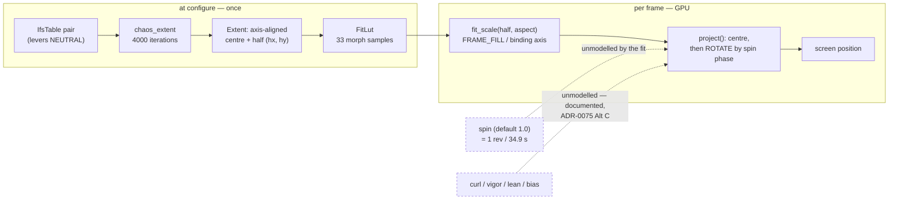

# 0089 — the framing contract stops lying, and two doc gaps close

> **Status:** in-progress
> **Created:** 2026-08-13
> **Owner skill(s):** dev
> **Related ADRs:** [ADR-0103](../adrs/0103-the-ifs-fit-frames-a-figure-that-does-not-turn.md) (accepted, this plan)
> **Closes:** [design-backlog 0089](../design-backlog.md), and the surviving halves of
> [design-backlog 0078](../design-backlog.md) and [design-backlog 0081](../design-backlog.md)
> **Supplements:** [ADR-0075](../adrs/0075-ifs-family-morphs-in-singular-value-space.md),
> [ADR-0093](../adrs/0093-attractor-tuples-are-content-with-per-tuple-framing.md)

## TL;DR

Three small items from a backlog sweep, one session, all `dev`. The load-bearing one is a
**falsified stated invariant**: `FRAME_FILL = 0.88` documents that a fitted IFS figure sits inside
the frame with margin, and it does not, because the fit measures an **axis-aligned** box and the
view then **rotates** it — at `spin`'s default of one revolution per 34.9 s, unconditionally. The
arithmetic below shows this is not a dragon bug: **a square figure overruns by 24 %**, and only a
figure at least ~1.85x taller than wide is safe at every angle. Phase 1 makes the contract state
what it actually guarantees and pins the closed form as a test, moving zero pixels. Phases 2 and 3
land two one-paragraph doc gaps that have each been routed to "the next plan that touches this
file" and had no carrier.

## Context & problem

The user asked for a backlog check: what has a want behind it and no route. Five items came back
unplanned. Two of them wanted an interview or an ADR of their own and are out of scope here (see
**What this plan does NOT do**). The three below are one sitting.

### 1. `FRAME_FILL = 0.88` is falsified, and the entry's own first suspect was wrong

[Backlog 0089](../design-backlog.md) reported the Heighway dragon overrunning the **frame corner**
at the default view at 1280x720, worked around in `presets/attractor_dragon.toml:118` with a base
`zoom = 0.92`. The entry named the fit sources — `FitLut` versus the fallback `frame()` — as "the
suspicion to check first". That suspect is largely exonerated:
`core/src/render/scenes/particles/ifs/tests.rs:1064`
(`the_fit_leaves_margin_for_what_it_under_measures`) already asserts the sampled fit against a
200,000-iteration long run for every shipped figure, requires the true figure under `0.97` of the
frame, carries a non-vacuity check, is green, and **covers the dragon**.

**What the fit does not model is rotation, and the derivation settles it.** `fit_scale`
(`ifs.rs:517`) fits the **axis-aligned** half-extents `(hx, hy)` measured by `chaos_extent`; the
2D branch of `project` (`shaders.rs:448`) then centres and rotates in-plane by the spin phase. A
centred AABB rotated by `θ` has half-extents

```
hx' = hx·|cos θ| + hy·|sin θ|        hy' = hx·|sin θ| + hy·|cos θ|
```

and both reach `r = sqrt(hx² + hy²)` at their worst angle. Write `a = hx / hy`. The fit is
`s = FRAME_FILL · min(1/hy, aspect/hx)`, so:

- **When the vertical binds** (`a <= aspect`), staying inside at every angle needs
  `FRAME_FILL · sqrt(1 + a²) <= 1`, i.e. **`a <= sqrt(1/0.88² − 1) = 0.5397`**.
- **When the horizontal binds** (`a > aspect`), it needs
  `FRAME_FILL · aspect · sqrt(1 + a²) / a <= 1`. The left factor `sqrt(1+a²)/a` exceeds 1 for every
  finite `a`, and `0.88 · 16/9 = 1.564`, so this case is **unsatisfiable at any aspect ratio at or
  above 1**.

Three consequences, all exact rather than measured:

- **A square figure (`a = 1`) overruns by 24.4 %** at 45°, because `0.88 · sqrt(2) = 1.2445`.
- **Only a figure at least `1/0.5397 = 1.85x` taller than wide is safe at every angle.**
- **The fern is that figure.** Barnsley's fern spans roughly `x ∈ [−2.18, 2.66]`, `y ∈ [0, 10]`, so
  `a ≈ 0.48` — inside the bound, with little room. The fern is the figure ADR-0075 built the fit
  on, which is exactly why the hole went unnoticed: the one shipped figure that satisfies the
  rotated bound is the one the fit was developed against. (Phase 1 measures `a` per figure rather
  than trusting these published extents.)

**And the shipped library has been paying for it in triplicate.** Three presets use a 2D IFS figure
— `attractor_dragon` (dragon), `attractor_fern` (fern), `attractor_volute` (spiral) — and **all
three independently bind `spin` down to a small rock and set base `zoom` below 1** (0.92 / 0.96 /
0.96). Three authors, three sessions, one workaround. Only `attractor_dragon`'s header names the
overrun; the other two read as taste.

**This is the second unmodelled input to the same fit, and the first one is documented and
accepted.** `FitLut` is built with every lever neutral, deliberately (ADR-0075 Alternative C — a
fit that saw `vigor` would cancel the one lever `vigor` exists for), and its docstring states the
price in as many words: *"a hard `vigor` push can leave the frame. That is the intended trade …
and `zoom` is the recourse."* Rotation belongs in that same sentence and is not in it. The
difference — and the reason this is worth a plan rather than a comment — is that a lever overrun
happens when an author pushes something, while **the rotation overrun is the default**, so every
author of a 2D IFS world meets it on their first render and has to rediscover the recourse.
[ADR-0103](../adrs/0103-the-ifs-fit-frames-a-figure-that-does-not-turn.md) takes that decision and
prices the alternative that would buy a real guarantee.

### 2. `kaleido_tile`'s bindability is undocumented

[Backlog 0078](../design-backlog.md) was **falsified** at the sweep — `kaleido_tile` is
deliberately not quantized, and `core/src/render/kaleidoscope.rs:458` carries the reasoning in a doc
comment that predates the entry by five phases. What survives is a doc gap the entry names
precisely: `presets/README.md:1524` carries the `kaleido_tile` row and nothing else, so an author
learns neither that it **may** be driven from audio (the one param on that stage where easing
between values is meaningful) nor what a fractional cell count does at the frame border.
`fragment_tiled.toml` binds it as a constant, which reads as the only option. The entry routed this
to "the next plan that touches the symmetry stage's docs" and no such plan was ever written.

### 3. The house gain rule has no exception class

[Backlog 0081](../design-backlog.md)'s first half was also **falsified** — `presets/README.md:203`
has carried `G = C / 0.85` and `C / 0.60` since 2026-08-03. Its second half stands: the *exception*
class is nowhere. Grepped 2026-08-13, `presets/README.md` and `docs/presets.md` contain no
"failure state" or "death state" language. The class is **a param whose cap is a failure state
rather than a maximum**, which wants its range pulled in at *both* ends instead of gained to reach
the cap. Gray-Scott `feed`/`kill` is the worked example: gains derived by the house rule put the
field in the filled regime, where the gaps close and the contour the picture is made of disappears
— found by `chthonic_coral_oracle`'s author rendering it as flat mustard. Same routing, same
absence of a carrier.

## Decision

Take all three in one `dev` session, in this order, because Phase 1 is the only one that touches
code and the two doc phases are independent of it and of each other.

For Phase 1 we **restate the contract and pin it**, rather than buying the guarantee: the fit's
stated property becomes "inside the frame at neutral levers **and zero rotation**, with `zoom` as
the recourse", which is ADR-0075's existing sentence extended to the input it forgot, and it moves
zero pixels. We do **not** take the two routes that would make the original invariant true — a fit
against the rotation-invariant radius `r`, or a per-figure measured fill in
[ADR-0093](../adrs/0093-attractor-tuples-are-content-with-per-tuple-framing.md)'s shape — because
both shrink every shipped 2D figure, re-frame all three worlds on top of compensating `zoom` values
they already carry, and owe a golden re-bless plus a content pass, for a guarantee nobody has asked
for. They are **priced and deferred with a trigger, not rejected**, in ADR-0103: framing decisions
in this project are taken from rendered comparisons, and nothing here has rendered one.

## Architecture diagram



The two dashed edges are the whole finding: the fit is a function of the figure pair and `morph`
only, and **two** per-frame inputs reach the projection behind its back. One of them is written
down; the other defaults to on.

## Implementation phases

### Phase 1 — the framing contract states what it guarantees, and the closed form is a test

- **Owner skill:** dev
- **What:** the rotated-extent bound becomes an asserted property over all five figures, and every
  place that states the framing invariant states the true one.
- **Files touched:** `core/src/render/scenes/particles/ifs.rs` (the `FRAME_FILL`, `fit_scale` and
  `FitLut` docstrings), `core/src/render/scenes/particles/ifs/tests.rs` (the new test),
  `presets/README.md` (the attractor framing prose), `presets/attractor_dragon.toml` and
  `presets/attractor_volute.toml` and `presets/attractor_fern.toml` (header prose only — **no value
  changes**).
- **Done when:**
  - A test measures each figure's `a = hx / hy` from its own `chaos_extent` and asserts, per figure,
    that the **closed form predicts the sign of the outcome**: the worst-angle fill
    `FRAME_FILL · sqrt(1 + a²)` (vertical-binding) or
    `FRAME_FILL · aspect · sqrt(1 + a²) / a` (horizontal-binding) is `<= 1` exactly when
    `a <= 0.5397` under vertical binding, and the *measured* worst-angle half-extent over a sweep of
    `θ` agrees with `sqrt(hx² + hy²)` to within the sweep's own angular step. Every constant here is
    dimensionless and derived, not measured on a machine (ADR-0071): `0.5397` is
    `sqrt(1/FRAME_FILL² − 1)` and must be written as that expression, not as a literal.
  - **The test is non-vacuous in both directions**: the fern comes back inside the bound and at
    least one shipped figure (expected: the dragon) comes back outside it, so the assertion can tell
    the two apart. If *every* figure lands on one side, the test proves nothing and the phase says so
    rather than shipping it.
  - The three docstrings and `presets/README.md` state the fit's guarantee as **neutral levers and
    zero rotation**, name `zoom` as the recourse for both, and cross-reference ADR-0103. The
    `fit_scale` docstring's existing claim — that taking the smaller of the two fits *"is what makes
    'inside the frame' true at every aspect rather than at one"* — is true about *aspect* and is
    kept; what it gains is the sentence saying rotation is a separate axis it does not cover.
  - **`attractor_dragon.toml`'s `FRAMING:` header stops calling its `zoom` a probe-driven
    workaround** and calls it the documented recourse; `attractor_fern` and `attractor_volute` gain
    the same one-line note, because their sub-1 base `zoom` is currently indistinguishable from
    taste and the next author to "clean it up" would break the framing. Prose only.
  - **Zero pixels move**, established by a **bless-to-bless control** on this branch (bless twice,
    differing only by reverting the change) rather than by a `git diff` — eight baselines drift from
    their committed bytes under `LMV_BLESS` on this box, so a diff would convict eight files this
    phase never touched. Bless every binary in scope
    (`--test golden --test composite --test line_joints --test attractor_trails`), then
    `git checkout -- core/tests/golden`.

### Phase 2 — `kaleido_tile` says whether it may be driven, and what a fractional count does

- **Owner skill:** dev
- **What:** the symmetry-stage section gains the two facts an author needs on their first attempt.
- **Files touched:** `presets/README.md` (the symmetry-stage section around line 1515).
- **Done when:** the section states that `kaleido_tile` is **deliberately not quantized** — unlike
  `kaleido_spiral` and `palette_steps`, which are, because a fractional winding number tears and a
  fractional band count is meaningless — so it **may be bound and eased between cell counts**, and
  that a fractional count leaves the last cell **cut off at the frame border**, seamless within the
  frame and clipped at its edge. The reasoning is transcribed from
  `core/src/render/kaleidoscope.rs:458`, which is the authority; if the two disagree, the code wins
  and the disagreement is the finding. `fragment_tiled.toml`'s constant binding is noted as one
  choice rather than the only one.
  **Not in scope:** judging whether the clipped edge reads badly. Nobody has looked, and
  [backlog 0078](../design-backlog.md) says a render is what would decide it.

### Phase 3 — the gain rule names its exception class

- **Owner skill:** dev
- **What:** the reactivity section gains the class the house rule cannot carry on its own.
- **Files touched:** `presets/README.md` (the gain-rule bullet at line 203 and its section).
- **Done when:** the section names **a param whose cap is a failure state rather than a maximum**
  as the class the `G = C / 0.85` and `C / 0.60` rule does not apply to, states the alternative
  treatment (pull the range in at *both* ends, a small reactive span on purpose — a drift between
  two living states rather than a sweep to the edge of the parameter space), and carries Gray-Scott
  `feed`/`kill` as the worked example with the mechanism: the filled regime closes the gaps and
  leaves no contour to draw, so the preset renders a flat wash. It says the class is **unlikely to
  have one member**, which is the whole reason it is worth naming, and points at
  `chthonic_coral_oracle.toml` as the shipped instance.

## Risks & open questions

- **ADR-0103 could be rejected at review, and then Phase 1 changes shape rather than dying.** If the
  user wants the guarantee bought (the rotation-invariant fit, or a per-figure fill), Phase 1's
  measurement and its test are still exactly the work needed — the derivation is route-independent —
  and only the docstring half is replaced by a re-framing phase plus a golden re-bless and a content
  pass. The measurement is deliberately first for this reason.
- **Phase 1's non-vacuity condition can fail honestly.** If the dragon turns out to satisfy the
  bound, then rotation is *not* the mechanism and the entry redirects again — to the preset's own
  `zoom` reaching `1.04` at a bass peak (`attractor_dragon.toml:118`, past 1.0), which the sweep
  named as the second candidate. That outcome is a finding to report, not a phase to force; do not
  tune the test until the expected figure fails.
- **The published fern extents in this plan are from the literature, not from this code.** They are
  used only to explain *why* the hole went unnoticed. Phase 1 measures `a` per figure from
  `chaos_extent`; if the measured fern ratio exceeds `0.5397` the explanation is wrong and the
  finding survives it.
- **`chaos_extent` under-measures by design** (it converges from below — the tree reads 7.9 % under a
  long run at `FIT_ITERATIONS`), and the existing margin test is what absorbs that. The new bound is
  computed from the *same* under-measured half-extents the fit uses, so the two are consistent by
  construction; the phase must not mix a long-run extent into one side of the comparison and a
  sampled one into the other.
- **Three presets get header edits and no value edits, which is the easiest thing in this plan to get
  wrong.** A value change here would move a golden and silently re-frame a shipped world. The
  bless-to-bless control catches it.
- **The two doc phases are unguarded by tests, as doc changes are.** The mitigation is that both
  transcribe an authority that exists in the repo (a doc comment for Phase 2, a shipped preset's
  header for Phase 3) rather than inventing a claim — and both entries were falsified in their first
  halves precisely because nobody checked the file before asserting what it lacked. Check the file.

## What this plan does NOT do

- **It does not buy the frame guarantee.** No rotation-invariant fit, no per-figure fill, no golden
  re-bless, no re-framing of shipped content. ADR-0103 prices that and states the trigger.
- **It does not touch the levers' documented overrun.** ADR-0075 Alternative C stands; `vigor` still
  overshoots on purpose.
- **It does not quantize `kaleido_tile`** — that premise is falsified, and the code comment
  explaining why predates the entry.
- **It does not judge the fractional-tile frame edge**, which needs a render nobody has made.
- **It does not touch [backlog 0068](../design-backlog.md) option 2** (the emitter's source line is
  fixed at `y = −1.12`; `core/src/render/scenes/emitter.rs:91`). That is a param-surface change with
  a real fork — a movable line versus a point source versus an authorable region — and it is going
  to an interview before anything is written.
- **It does not touch [backlog 0075](../design-backlog.md) item 2** (the palette LUT repeat-addresses
  a *coordinate*, so a negative-driven `root_tint` wraps a figure's darkest region to the ramp's
  brightest stop). That is
  [ADR-0102](../adrs/0102-a-palette-coordinates-edge-is-a-per-preset-choice.md), proposed, no plan
  yet by the user's call.
- **It does not re-tune anything.** Phase 1 explains three presets' `zoom` values; it does not change
  them. If the explanation makes any of the three look wrong, that is a content-lane sitting.

## Followups (after this lands)

- **ADR-0103's deferred routes** stay parked with their trigger: someone wanting a 2D IFS world at
  full default rotation, at which point the rendered comparison is what decides.
- **If Phase 1's non-vacuity check redirects to the preset's own `zoom > 1.0`**, that is a one-line
  content fix in `attractor_dragon.toml` and belongs to the content lane, not here.
